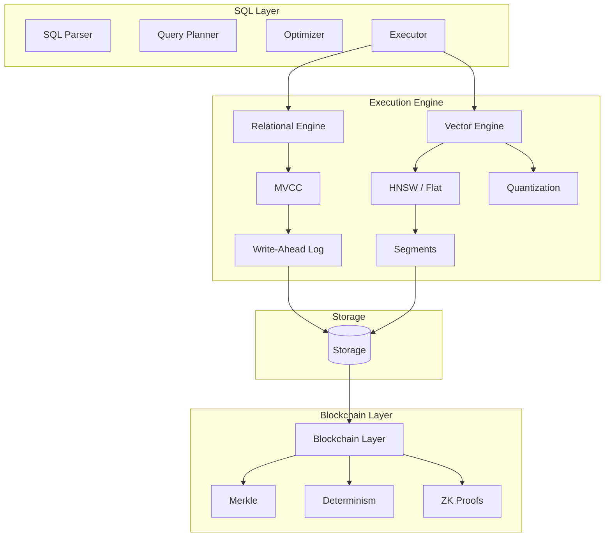
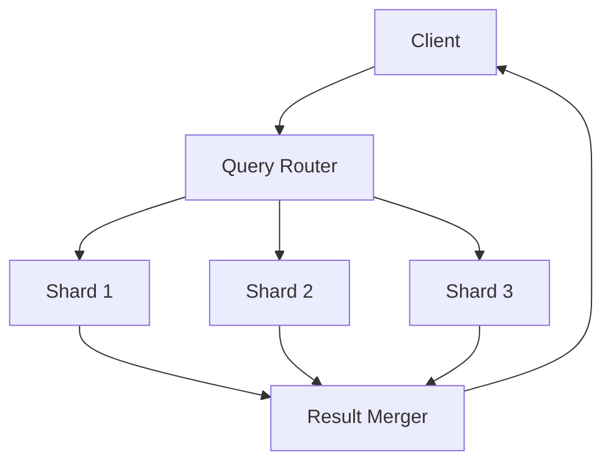

# RFC-0107 (Storage): Production Vector-SQL Storage Engine (v2)

## Status

Draft (v5 — kernel-grade)

> **Note:** This RFC was originally numbered RFC-0107 under the legacy numbering system. It remains at 0107 as it belongs to the Storage category.

## Summary

This RFC defines a **production-grade unified Vector-SQL storage engine** integrating:

- SQL relational queries
- Approximate nearest neighbor (ANN) vector search
- MVCC transactional semantics
- Blockchain verification primitives
- Deterministic numeric computation (DFP/DQA/DVEC)
- ZK-proof friendly commitments

The system merges capabilities typically spread across:

| Domain        | Existing Systems  |
| ------------- | ----------------- |
| Vector search | Qdrant / Pinecone |
| SQL           | PostgreSQL        |
| Verification  | Blockchain        |

The goal is a **single deterministic database layer** capable of:

```
AI retrieval
+
structured queries
+
cryptographic verification
```

within one execution engine.

> ⚠️ **This is RFC-0103 v5 (Kernel-Grade)** — Hardened with MVCC visibility, deterministic index rebuild, query planner statistics, proof pipeline, WAL durability, crash consistency, checkpointing, segment format, distributed queries, memory model, HNSW live updates, Raft replication, and scheduler policy.

## Design Goals

### Motivation

Current AI applications require multiple systems:

- **Vector database** (Qdrant, Pinecone, Weaviate) for similarity search
- **SQL database** (PostgreSQL, SQLite) for structured data

This creates:

- Operational complexity
- Data consistency challenges
- Latency from cross-system queries

**Why This Matters for CipherOcto**:

1. **Vector similarity search** for agent memory/retrieval
2. **SQL queries** for structured data (quotas, payments, reputation)
3. **Blockchain verification** for verifiable AI

A unified system reduces infrastructure complexity while maintaining all required capabilities.

### G1 — Single query engine

Support queries combining:

```
vector similarity
+
relational filtering
+
aggregation
```

Example:

```sql
SELECT id
FROM agents
WHERE reputation > 0.9
ORDER BY cosine_distance(embedding, $query)
LIMIT 10;
```

### G2 — Deterministic consensus compatibility

Vector math must not break consensus determinism.

Therefore the architecture enforces **three execution layers**:

| Layer                | Purpose              | Determinism       |
| -------------------- | -------------------- | ----------------- |
| Fast ANN             | candidate generation | non-deterministic |
| Deterministic rerank | exact ranking        | deterministic     |
| Blockchain proof     | input verification   | cryptographic     |

### G3 — High throughput

Target production performance:

| metric            | target          |
| ----------------- | --------------- |
| Query latency     | < 50 ms         |
| Insert throughput | > 10k vectors/s |
| Recall@10         | >95%            |
| Proof generation  | <5s async       |

### G4 — ZK-ready state commitments

All vector datasets must be **provably committed** so that:

```
query result
+
proof
=
verifiable computation
```

## System Architecture



## Data Types

Vector storage uses **two distinct vector representations**.

### Storage Vectors

Used for indexing and retrieval.

```
VECTOR(f32)
```

Example:

```sql
embedding VECTOR(768)
```

Properties:

| property    | value            |
| ----------- | ---------------- |
| precision   | float32          |
| performance | SIMD accelerated |
| determinism | not guaranteed   |

### Consensus Vectors

Defined in **RFC-0106 Numeric Tower**.

```
DVEC<N>
```

Scalar types:

```
DFP  — deterministic float
DQA  — deterministic quantized arithmetic
```

Example:

```sql
DVEC768(DFP)
```

Properties:

| property  | value          |
| --------- | -------------- |
| precision | deterministic  |
| execution | scalar loop    |
| purpose   | consensus / ZK |

### Conversion

Conversion between types is explicit.

```sql
CAST(embedding AS DVEC768(DFP))
```

Used during verification.

> ⚠️ **Key Distinction**: Storage vectors (VECTOR) are for performance, consensus vectors (DVEC) are for verification. Never mix in the same query path without explicit CAST.

### SQL Syntax

```sql
-- Create table with vector column
CREATE TABLE embeddings (
    id INTEGER PRIMARY KEY,
    content TEXT,
    embedding VECTOR(384)
) STORAGE = mmap;

-- Vector index with quantization
CREATE INDEX idx_emb ON embeddings(embedding)
USING HNSW WITH (
    metric = 'cosine',
    m = 32,
    ef_construction = 400,
    quantization = 'pq',
    compression = 8
);

-- Insert vectors
INSERT INTO embeddings (id, content, embedding)
VALUES (1, 'hello world', '[0.1, 0.2, ...]');

-- Vector search
SELECT id, content,
    cosine_distance(embedding, '[0.1, 0.2, ...]') as dist
FROM embeddings
ORDER BY dist
LIMIT 10;

-- Hybrid query
SELECT id
FROM agents
WHERE reputation > 0.9
ORDER BY cosine_distance(embedding, $query)
LIMIT 10;
```

## Vector Engine

### Execution Operators

Vector operations become **first-class operators**.

Example execution plan:

```
SeqScan(agents)
 → PayloadFilter(reputation > 0.9)
 → VectorIndexScan(HNSW)
 → DeterministicRerank
 → VectorTopK
```

Operator definitions:

| operator            | role                      |
| ------------------- | ------------------------- |
| VectorIndexScan     | ANN traversal             |
| PayloadFilter       | scalar filter             |
| VectorDistance      | distance computation      |
| DeterministicRerank | deterministic ranking     |
| VectorTopK          | final selection           |
| HybridMerge         | combine multiple segments |

> ⚠️ **Clarification**: The planner outputs these operators. DeterministicRerank runs on all candidate sets before final TopK to ensure consensus safety.

### Search Algorithms

| Algorithm     | Use Case       | Recall      | Latency  |
| ------------- | -------------- | ----------- | -------- |
| **HNSW**      | ProductionANN  | High (95%+) | Low      |
| **Flat**      | Exact search   | 100%        | High     |
| **Quantized** | Large datasets | Medium      | Very Low |

#### HNSW Parameters

| Parameter         | Default | Range          | Description               |
| ----------------- | ------- | -------------- | ------------------------- |
| `m`               | 16      | 4-64           | Connections per layer     |
| `ef_construction` | 200     | 64-512         | Search width during build |
| `ef_search`       | 50      | 10-512         | Search width during query |
| `metric`          | cosine  | l2, cosine, ip | Distance metric           |

#### Candidate Expansion Safety

> ⚠️ **Critical (v3 addition)**: Formalized safety bound for candidate expansion.

The RFC specifies `k * 4` candidates, but this is **not guaranteed safe** in worst cases:

- Dataset skew
- Quantization error accumulation
- HNSW recall degradation

**Production Formula:**

```rust
fn compute_candidate_count(k: usize, ef_search: usize) -> usize {
    // Safety margin: max(4k, ef_search) with minimum recall guarantee
    let base_candidates = k * 4;
    let ef_candidates = ef_search;

    // Use larger of 4k or ef_search, add 10% safety margin
    let candidates = base_candidates.max(ef_candidates);
    (candidates as f32 * 1.1) as usize
}
```

**Example:**

| k   | ef_search | candidates | Notes               |
| --- | --------- | ---------- | ------------------- |
| 10  | 50        | 55         | ef_search dominates |
| 10  | 10        | 44         | 4k dominates        |
| 100 | 100       | 110        | 10% margin added    |

**Worst-Case Recommendations:**

| Scenario             | Expansion Factor |
| -------------------- | ---------------- |
| Standard             | 4×k              |
| High recall required | 6×k              |
| Adversarial vectors  | 10×k             |
| Quantized index      | 8×k              |

#### Quantization Options

| Type   | Compression | Loss   | Use Case          |
| ------ | ----------- | ------ | ----------------- |
| **BQ** | 32x         | ~5%    | Fast, approximate |
| **SQ** | 4x          | ~2%    | Balanced          |
| **PQ** | 8-64x       | ~5-15% | Large datasets    |

## Query Planner Rules

Hybrid queries require cost-based decisions.

### Example Query

```sql
SELECT *
FROM agents
WHERE reputation > 0.9
ORDER BY cosine_distance(embedding, $query)
LIMIT 10
```

Possible plans:

**Plan A**: Vector index first

```
VectorIndexScan
→ Filter
```

**Plan B**: Filter first

```
Filter
→ VectorSearch
```

### Cost Model

Planner estimates:

```
cost = vector_cost + filter_cost
```

Heuristic rules:

| condition               | plan         |
| ----------------------- | ------------ |
| filter selectivity < 5% | filter first |
| large dataset           | ANN first    |
| small dataset           | brute force  |

### Hybrid Search Operator

Hybrid search merges scalar and vector signals.

```sql
ORDER BY
  cosine_distance(vector)
  + bm25(text)*0.3
```

Operator:

```
HybridScore
```

## Storage Architecture

### Segment Model

Vectors stored in **immutable segments**.

```
segment_1
segment_2
segment_live
```

Query executes across segments:

```
search(segment_1)
search(segment_2)
search(segment_live)
merge results
```

### Segment Layout

Struct-of-arrays memory layout:

```
ids[]
embeddings[]
metadata_offsets[]
metadata_blob[]
```

Advantages:

- SIMD friendly
- contiguous memory
- faster cache access

### Merge Policy

Segments merged when:

```
segments > 8
```

Strategy:

```
merge smallest segments first
```

### Versioned Segments

Required for blockchain immutability.

Segment structure:

```rust
struct VersionedSegment {
    segment_id: u64,
    version: u64,
    merkle_root: [u8; 32],
    created_block: u64,
    is_active: bool,
}
```

Old segments retained for historical queries.

## MVCC Vector Visibility Model

> ⚠️ **Critical (v3 addition)**: This section defines how MVCC visibility interacts with vector indexes.

### The Visibility Problem

Vector indexes may contain vectors that are **not yet visible** to a transaction's snapshot.

Example:

```
Transaction T1: INSERT vector V with id=100
Transaction T2: SELECT nearest neighbors (started before T1 commits)

Should T2 see V?
```

Without proper handling:

```
index contains vector
MVCC snapshot says invisible
```

This breaks query correctness.

### Vector Row Structure

```rust
struct VectorRow {
    vector_id: u64,
    xmin: TxId,      // Creating transaction
    xmax: Option<TxId>, // Deleting transaction (None = live)
    embedding: Vec<f32>,
}
```

### Visibility Rules

During vector search:

```rust
fn filter_visible(results: Vec<VectorRow>, snapshot: &Snapshot) -> Vec<VectorRow> {
    results.into_iter()
        .filter(|row| snapshot.visible(row.xmin, row.xmax))
        .collect()
}
```

**Visibility conditions:**

| State               | xmin      | xmax      | Visible to T         |
| ------------------- | --------- | --------- | -------------------- |
| Inserted & live     | committed | None      | T > xmin             |
| Inserted & deleted  | committed | committed | T > xmax             |
| Inserted & deleting | committed | active    | depends on isolation |

### Isolation Levels

| Level              | Behavior                                  |
| ------------------ | ----------------------------------------- |
| snapshot isolation | See only committed vectors at snapshot    |
| read committed     | May see uncommitted (use with care)       |
| serializable       | Same as snapshot + additional constraints |

### Implementation

```rust
pub trait VectorVisibilityFilter {
    fn filter_visible(&self, candidates: &[VectorId], snapshot: &Snapshot) -> Vec<VectorId>;
}
```

Default implementation uses snapshot's `visible(xmin, xmax)` check.

> ⚠️ **Production Rule**: All vector search operators MUST apply visibility filtering before returning results.

---

## Deterministic Index Rebuild

> ⚠️ **Critical (v3 addition)**: Ensures replicated nodes produce identical vector indexes.

### The Replication Problem

The RFC states:

> HNSW index rebuilt locally from replicated vectors

But **HNSW insertion order matters**. Different build threads produce different graphs.

Example:

```
node A: inserts vectors 1..N with threads T1, T2
node B: inserts vectors 1..N with threads T2, T1
```

Graph topology differs → candidate sets differ → consensus divergence risk.

### Deterministic Build Rules

**Rule 1: Sorted Insertion Order**

```
index build order = vector_id ascending
```

All vectors MUST be inserted in ascending vector_id order.

**Rule 2: Single-Threaded Builder**

```rust
fn build_hnsw_deterministic(vectors: &[Vector]) -> HnswIndex {
    // Sort by vector_id first
    let mut sorted: Vec<_> = vectors.iter().enumerate()
        .map(|(i, v)| (v.id, v))
        .collect();
    sorted.sort_by_key(|(id, _)| *id);

    // Single-threaded build
    let mut index = HnswIndex::new();
    for (_, vector) in sorted {
        index.insert(vector);  // One at a time, deterministic order
    }
    index
}
```

**Rule 3: Deterministic Batch Builder**

If parallel build required:

```rust
fn deterministic_batch_build(vectors: &[Vector], num_batches: usize) -> HnswIndex {
    // Pre-sort into deterministic batches
    let batch_size = vectors.len() / num_batches;
    let mut batches: Vec<Vec<_>> = (0..num_batches)
        .map(|_| Vec::new())
        .collect();

    for (i, vector) in vectors.iter().enumerate() {
        let batch_idx = i / batch_size;
        batches[batch_idx.min(num_batches - 1)].push(vector);
    }

    // Sort each batch by id for determinism within batch
    for batch in &mut batches {
        batch.sort_by_key(|v| v.id);
    }

    // Build sequentially
    // ... build from batch_0, then batch_1, etc.
}
```

### Verification

After replication, nodes MUST verify index equality:

```rust
fn verify_index_equality(local: &HnswIndex, remote: &HnswIndex) -> bool {
    local.merkle_root() == remote.merkle_root()
}
```

### Summary

| Constraint   | Mechanism                              |
| ------------ | -------------------------------------- |
| Build order  | vector_id ascending                    |
| Builder      | single-threaded or deterministic batch |
| Verification | Merkle root comparison                 |

---

## Query Planner Statistics

> ⚠️ **Critical (v3 addition)**: Enables cost-based decisions for hybrid queries.

### Current Model Deficiency

The current model:

```
cost = vector_cost + filter_cost
```

Is **too naive**. Real planning requires statistics.

### Required Statistics

```rust
struct VectorStatistics {
    /// Total number of vectors in the table
    vector_count: u64,

    /// Embedding dimension
    dimension: u32,

    /// Average vector norm
    avg_norm: f32,

    /// Histogram of norm distributions
    norm_histogram: Histogram<f32>,

    /// Per-segment statistics
    segments: Vec<SegmentStats>,
}

struct SegmentStats {
    segment_id: u64,
    vector_count: u64,
    min_id: u64,
    max_id: u64,
    merkle_root: [u8; 32],
}
```

### Statistics Collection

```rust
impl VectorStatistics {
    pub fn collect(table: &VectorTable) -> Self {
        let vectors = table.scan_all();
        let dimension = vectors.first().map(|v| v.embedding.len()).unwrap_or(0);

        VectorStatistics {
            vector_count: vectors.len() as u64,
            dimension: dimension as u32,
            avg_norm: vectors.iter()
                .map(|v| norm(&v.embedding))
                .sum::<f32>() / vectors.len() as f32,
            norm_histogram: Histogram::build(&vectors),
            segments: table.segments().iter()
                .map(|s| SegmentStats {
                    segment_id: s.id,
                    vector_count: s.count,
                    min_id: s.min_id,
                    max_id: s.max_id,
                    merkle_root: s.merkle_root,
                })
                .collect(),
        }
    }
}
```

### Cost Estimation

```rust
fn estimate_cost(
    stats: &VectorStatistics,
    query: &HybridQuery,
) -> PlanCost {
    let filter_selectivity = estimate_selectivity(&query.filter, stats);
    let filtered_count = stats.vector_count as f32 * filter_selectivity;

    // Vector search cost
    let vector_cost = if stats.vector_count > 10_000 {
        // ANN search
        estimate_ann_cost(stats, query.k, query.ef)
    } else {
        // Brute force cheaper
        stats.vector_count as f32 * stats.dimension as f32
    };

    // Filter cost
    let filter_cost = filtered_count * estimate_filter_cost(&query.filter);

    PlanCost {
        total: vector_cost + filter_cost,
        vector_cost,
        filter_cost,
        estimated_candidates: filtered_count as usize,
    }
}
```

### Planner Decision Rules

| Condition                | Plan               |
| ------------------------ | ------------------ |
| filter_selectivity < 5%  | Filter first       |
| filter_selectivity > 50% | Vector index first |
| dataset < 1,000 vectors  | Brute force        |
| k \* 4 > dataset_size    | Brute force        |

### Selectivity Estimation

```rust
fn estimate_selectivity(filter: &Filter, stats: &VectorStatistics) -> f32 {
    match filter {
        Filter::Equals(field, value) => {
            // Use histogram to estimate
            1.0 / stats.estimate_cardinality(field, value)
        }
        Filter::Range(field, min, max) => {
            stats.norm_histogram.percentile_range(*min, *max)
        }
        Filter::And(a, b) => estimate_selectivity(a, stats) * estimate_selectivity(b, stats),
        Filter::Or(a, b) => {
            let sa = estimate_selectivity(a, stats);
            let sb = estimate_selectivity(b, stats);
            sa + sb - (sa * sb) // Inclusion-exclusion
        }
        Filter::True => 1.0,
    }
}
```

---

## Proof Generation Pipeline

> ⚠️ **Critical (v3 addition)**: Architecture for async ZK proof generation.

### Pipeline Overview

```
Query Result
    ↓
Proof Job Queue
    ↓
Prover Worker 1 ─┐
Prover Worker 2 ─┼─→ Circuit Compilation
Prover Worker N ─┘
    ↓
Proof Storage
    ↓
Proof Verification
```

### Components

#### 1. Proof Job Queue

```rust
struct ProofJob {
    job_id: Uuid,
    query: VectorQuery,
    result_ids: Vec<u64>,
    priority: ProofPriority,
    created_at: Timestamp,
    deadline: Option<Timestamp>,
}

enum ProofPriority {
    High,    // Consensus-critical
    Normal,  // Standard queries
    Low,     // Background verification
}
```

Job queue uses **Redis Streams** or similar for durability.

#### 2. Prover Workers

```rust
struct ProverWorker {
    worker_id: u32,
    job_queue: QueueReader<ProofJob>,
    circuit_cache: CircuitCache,
    proof_storage: ProofStore,
}

impl ProverWorker {
    async fn process_job(&mut self, job: ProofJob) -> Result<Proof, ProofError> {
        // Step 1: Compile circuit for this query type
        let circuit = self.circuit_cache.get_or_compile(&job.query);

        // Step 2: Generate witness from vectors
        let witness = self.generate_witness(&job.result_ids, &job.query)?;

        // Step 3: Run prover
        let proof = circuit.prove(witness)?;

        // Step 4: Store proof
        self.proof_storage.store(job.job_id, &proof).await?;

        Ok(proof)
    }
}
```

#### 3. Circuit Cache

ZK circuits are expensive to compile. Cache by query pattern:

```rust
struct CircuitCache {
    cache: Mutex<HashMap<CircuitKey, CompiledCircuit>>,
    max_entries: usize,
}

struct CircuitKey {
    dimension: u32,
    k: usize,
    metric: DistanceMetric,
    quantization: Option<QuantizationType>,
}
```

#### 4. Proof Storage

```rust
struct ProofStore {
    storage: ObjectStore,  // S3, local fs, etc.
    metadata: SqlDatabase,
}

struct ProofMetadata {
    proof_id: Uuid,
    job_id: Uuid,
    circuit_key: CircuitKey,
    created_at: Timestamp,
    proof_size_bytes: u64,
    prover_time_ms: u64,
}
```

### Job Flow

```rust
async fn submit_proof_request(
    query: VectorQuery,
    result_ids: Vec<u64>,
    priority: ProofPriority,
) -> ProofJobId {
    let job = ProofJob::new(query, result_ids, priority);
    job_queue.push(job).await
}

async fn wait_for_proof(job_id: ProofJobId) -> Proof {
    // Poll or subscribe for completion
    let mut subscriber = job_queue.subscribe(job_id);
    subscriber.recv().await
}
```

### Performance Targets

| Metric                  | Target                  |
| ----------------------- | ----------------------- |
| Proof generation (k=10) | < 5 seconds             |
| Circuit compilation     | < 30 seconds (cached)   |
| Proof size              | < 100 KB                |
| Throughput              | 10 proofs/minute/worker |

### Concurrency

```
num_workers = min(16, num_cpus)
```

Each worker handles one proof at a time (memory constraints).

### Failure Handling

```rust
enum ProofFailure {
    CircuitCompileError,
    WitnessGenerationError,
    ProverError,
    Timeout,
}

impl ProverWorker {
    fn handle_failure(&self, job: ProofJob, error: ProofFailure) {
        match error {
            ProofFailure::Timeout => {
                // Re-queue with lower priority
                job_queue.push(job.with_priority(ProofPriority::Low));
            }
            _ => {
                // Notify or alert
                alert!("Proof job {} failed: {:?}", job.job_id, error);
            }
        }
    }
}
```

---

## WAL Durability Model

> ⚠️ **Critical (v3 addition)**: Fixes pointer-only WAL vulnerability.

### Problem with Pointer WAL

Current design:

```rust
VectorInsert { file_offset: u64, vector_size: u32 }
```

This means WAL replay depends on:

- File corruption resistance
- Segment not deleted before replay
- No partial writes

If crash occurs during vector write, **vector bytes are not durable in WAL**.

### Solution: Dual-Recording

Vectors are recorded in WAL **two ways**:

#### Option A: Full Vector in WAL

For small vectors or critical data:

```rust
enum WalVectorOp {
    VectorInsertFull {
        vector_id: u64,
        embedding: Vec<u8>,  // Full compressed vector
    },
    // ...
}
```

#### Option B: Hash + Pointer for Large Vectors

For large embeddings (>1KB):

```rust
struct WalVectorOp {
    VectorInsert {
        vector_id: u64,
        file_offset: u64,
        vector_size: u32,
        wal_hash: [u8; 32],      // Hash of vector for verification
        segment_id: u64,
    },
}
```

During replay:

```rust
fn replay_vector_insert(op: &WalVectorOp, segment: &Segment) -> Result<()> {
    // Verify vector integrity using hash
    let stored_hash = segment.compute_hash(op.vector_id)?;
    if stored_hash != op.wal_hash {
        return Err(ReplayError::VectorCorrupted);
    }

    // Pointer still valid?
    if !segment.is_valid_offset(op.file_offset, op.vector_size) {
        return Err(ReplayError::SegmentModified);
    }

    Ok(())
}
```

### Durability Guarantees

| Scenario                      | Guarantee                              |
| ----------------------------- | -------------------------------------- |
| Crash before flush            | WAL contains full vector → recoverable |
| Crash after flush             | Segment contains vector → recoverable  |
| Segment deleted before replay | Error, requires full rebuild           |
| Vector corrupted              | Hash mismatch → error detected         |

### Implementation

```rust
struct WalVectorWriter {
    wal: Wal,
    segment_manager: SegmentManager,
}

impl WalVectorWriter {
    fn write_vector(&mut self, vector: &Vector) -> Result<WalOp> {
        // Always write hash to WAL
        let vector_hash = blake3(vector.embedding.as_bytes());

        // Write to segment
        let (offset, size) = self.segment_manager.append(vector)?;

        Ok(WalOp::VectorInsert {
            vector_id: vector.id,
            file_offset: offset,
            vector_size: size,
            wal_hash: vector_hash,
            segment_id: self.segment_manager.current_segment(),
        })
    }
}
```

---

## Crash Consistency Model

> ⚠️ **Critical (v3 addition)**: Defines write ordering guarantees for durability.

### Write Ordering

To ensure durability, operations follow this strict ordering:

```
1. Write vector to segment buffer
2. Write WAL entry (including vector hash)
3. Fsync WAL
4. Mark segment buffer as committed
5. Fsync segment (periodic, not per-write)
6. Write commit record
7. Fsync WAL commit
```

### WAL-Before-Data Rule

The **golden rule**: WAL must be durable before data is visible.

```rust
fn commit_transaction(txn: &Transaction) -> Result<()> {
    // Step 1-2: Write data + WAL
    let wal_entry = txn.to_wal_entry()?;
    wal.write(&wal_entry)?;

    // Step 3: Fsync WAL (CRITICAL)
    wal.fsync()?;

    // Step 4-5: Commit segment
    segment.commit()?;

    // Step 6-7: Write commit record + fsync
    wal.write_commit(txn.id)?;
    wal.fsync()?;

    Ok(())
}
```

### Group Commit

For throughput, multiple transactions can be group-committed:

```rust
struct GroupCommit {
    max_size: usize,      // 64KB default
    max_latency: Duration, // 10ms default
    current_size: usize,
}

impl GroupCommit {
    fn should_commit(&self) -> bool {
        self.current_size >= self.max_size
            || self.elapsed() >= self.max_latency
    }
}
```

### Fsync Policy

| Scenario       | Fsync Behavior         |
| -------------- | ---------------------- |
| WAL            | Always fsync (durable) |
| Segment buffer | Background flush       |
| Checkpoint     | Full fsync             |
| Critical data  | Force fsync            |

### Torn Write Handling

If crash occurs mid-write, WAL detects recovery incomplete entries:

```rust
fn recover_wal(wal: &Wal) -> Vec<Transaction> {
    let mut committed = Vec::new();

    for entry in wal.scan() {
        if entry.is_commit() && entry.is_complete() {
            committed.push(entry.transaction());
        } else if entry.is_partial() {
            // Discard incomplete entry
            warn!("Discarding partial WAL entry: {}", entry.id);
        }
    }

    committed
}
```

---

## Checkpointing Architecture

> ⚠️ **Critical (v3 addition)**: Defines snapshot and recovery pipeline.

### Checkpoint Components

```
Checkpoints contain:
├── Metadata (table schema, segment mapping)
├── Segment files (immutable)
├── HNSW index metadata
├── MVCC snapshot
└── WAL truncation point
```

### Checkpoint Trigger

| Trigger    | Condition       |
| ---------- | --------------- |
| Time-based | Every 5 minutes |
| WAL-based  | Every 1GB WAL   |
| Manual     | Admin request   |

### Checkpoint Creation

```rust
struct Checkpoint {
    id: u64,
    timestamp: Timestamp,
    wal_offset: u64,
    segments: Vec<SegmentRef>,
    mvcc_snapshot: MvccSnapshot,
    merkle_root: [u8; 32],
}

fn create_checkpoint(db: &Database) -> Result<Checkpoint> {
    // 1. Pause writes momentarily
    let freeze = db.freeze_writes();

    // 2. Capture MVCC snapshot
    let snapshot = db.mvcc().snapshot();

    // 3. Get segment references
    let segments = db.segments().list_active();

    // 4. Compute Merkle root
    let merkle_root = compute_merkle_root(&segments);

    // 5. Write checkpoint metadata
    let checkpoint = Checkpoint {
        id: db.next_checkpoint_id(),
        timestamp: now(),
        wal_offset: wal.current_offset(),
        segments,
        mvcc_snapshot: snapshot,
        merkle_root,
    };

    db.checkpoints().store(&checkpoint)?;

    // 6. Truncate WAL
    wal.truncate(checkpoint.wal_offset)?;

    Ok(checkpoint)
}
```

### Recovery Pipeline

```
1. Load latest checkpoint
2. Replay WAL from checkpoint offset
3. Rebuild segments from committed entries
4. Rebuild HNSW from segments
5. Verify Merkle root
6. Resume operations
```

```rust
fn recover_from_checkpoint(checkpoint: &Checkpoint) -> Result<Database> {
    // 1. Load checkpoint metadata
    let mut db = Database::load_checkpoint(checkpoint)?;

    // 2. Replay WAL from checkpoint offset
    for entry in wal.replay_from(checkpoint.wal_offset)? {
        db.apply(entry)?;
    }

    // 3. Rebuild indexes
    db.rebuild_hnsw()?;

    // 4. Verify integrity
    let current_root = db.compute_merkle_root()?;
    if current_root != checkpoint.merkle_root {
        return Err(RecoveryError::MerkleMismatch);
    }

    Ok(db)
}
```

### Timeline

```
Checkpoints form a timeline for recovery:

C1 (t=5m) → C2 (t=10m) → C3 (t=15m) → Current
     ↓           ↓           ↓
 WAL-0      WAL-1       WAL-2       WAL-Current
```

### Retention Policy

```rust
struct CheckpointRetention {
    min_to_keep: usize,     // Keep at least 2
    max_age: Duration,      // Keep last 24 hours
    max_count: usize,       // Keep last 100
}
```

---

## Segment File Format

> ⚠️ **Critical (v3 addition)**: Precise binary layout for segments.

### Physical Layout

```
┌────────────────────────────────────────────┐
│ SegmentHeader (64 bytes)                   │
├────────────────────────────────────────────┤
│ VectorBlock 1                              │
│   ├─ VectorHeader (16 bytes)               │
│   └─ VectorData (dimension * 4 bytes)       │
├────────────────────────────────────────────┤
│ VectorBlock 2                              │
├────────────────────────────────────────────┤
│ ...                                        │
├────────────────────────────────────────────┤
│ MetadataBlock                              │
│   ├─ MetadataHeader (16 bytes)             │
│   └─ Metadata entries (var)                 │
├────────────────────────────────────────────┤
│ MerkleBlock                                │
│   ├─ MerkleTree (var)                      │
│   └─ MerkleRoot (32 bytes)                 │
├────────────────────────────────────────────┤
│ Footer (32 bytes)                         │
│   ├─ Checksum (32 bytes)                   │
│   └─ Version (4 bytes)                     │
└────────────────────────────────────────────┘
```

### Segment Header

```rust
#[repr(C)]
struct SegmentHeader {
    magic: [u8; 8],           // "VECSEG01"
    version: u32,             // Format version
    segment_id: u64,
    vector_count: u64,
    dimension: u32,
    created_block: u64,
    merkle_root: [u8; 32],
    flags: u32,               // Compression, encryption
    _padding: [u8; 4],
}
```

### Vector Block

```rust
#[repr(C)]
struct VectorBlockHeader {
    vector_id: u64,
    offset: u64,              // Offset from segment start
    size: u32,                // Total size including metadata
    flags: u8,                // Compression type
    _padding: [u8; 7],
}

// Followed by: raw f32 bytes (dimension * 4)
```

### Alignment

| Field       | Alignment                |
| ----------- | ------------------------ |
| Headers     | 8 bytes                  |
| Vector data | 16 bytes (AVX2 friendly) |
| Metadata    | 8 bytes                  |

### Compression

| Type | Flag | Description       |
| ---- | ---- | ----------------- |
| None | 0x00 | Raw f32           |
| PQ   | 0x01 | Product quantized |
| SQ   | 0x02 | Scalar quantized  |

### Checksum

Footer contains Blake3 checksum of entire segment:

```rust
struct Footer {
    checksum: [u8; 32],
    version: u32,
    header_offset: u64,
    metadata_offset: u64,
    merkle_offset: u64,
}
```

---

## Distributed Query Architecture

> ⚠️ **Critical (v3 addition)**: Sharding and query routing for multi-node deployments.

### Architecture Overview



### Sharding Strategy

#### Option 1: Vector-ID Based

```
shard = vector_id % num_shards
```

Pros: deterministic, balanced
Cons: cross-shard queries for range scans

#### Option 2: Vector Space Partitioning

```
partition by k-means clusters
```

Pros: local ANN queries
Cons: load imbalance

#### Recommended: Hybrid

```
Primary: vector_id % num_shards
For ANN: broadcast to all shards, merge top-k
```

### Query Router

```rust
struct QueryRouter {
    shards: Vec<ShardEndpoint>,
    stats: ShardStatistics,
}

impl QueryRouter {
    fn route_ann(&self, query: &[f32], k: usize) -> QueryResult {
        // Broadcast to all shards for ANN
        let mut futures = Vec::new();

        for shard in &self.shards {
            let future = shard.ann_search(query, k * self.shards.len());
            futures.push(future);
        }

        // Gather results
        let all_results = wait_all(futures);

        // Merge top-k
        merge_topk(all_results, k)
    }

    fn route_filtered(&self, query: &FilteredQuery) -> QueryResult {
        // Route based on filter selectivity
        let shard = self.select_shard(&query.filter);
        shard.execute(query)
    }
}
```

### TopK Merge

```rust
fn merge_topk(shard_results: Vec<Vec<ScoredVector>>, k: usize) -> Vec<ScoredVector> {
    // Collect all candidates
    let mut candidates: Vec<_> = shard_results
        .into_iter()
        .flatten()
        .collect();

    // Sort by score
    candidates.sort_by(|a, b| b.score.partial_cmp(&a.score).unwrap());

    // Return top-k
    candidates.into_iter().take(k).collect()
}
```

### Cross-Shard Transactions

```rust
struct DistributedTransaction {
    txn_id: TransactionId,
    participants: Vec<ShardEndpoint>,
    coordinator: ShardEndpoint,
}

impl DistributedTransaction {
    fn two_phase_commit(&self) -> Result<()> {
        // Phase 1: Prepare
        for shard in &self.participants {
            shard.prepare()?;
        }

        // Phase 2: Commit
        for shard in &self.participants {
            shard.commit()?;
        }

        Ok(())
    }
}
```

### Consistency Model

| Mode             | Guarantee           |
| ---------------- | ------------------- |
| Strong           | 2PC with leader     |
| Eventual         | Async replication   |
| Read-your-writes | Session consistency |

---

## Memory & Cache Model

> ⚠️ **Critical (v3 addition)**: Buffer pool and caching architecture.

### Buffer Pool

```rust
struct BufferPool {
    pages: RwLock<HashMap<PageId, Page>>,
    eviction_policy: LruPolicy,
    max_memory: usize,  // Total memory budget
}

struct Page {
    id: PageId,
    data: Box<[u8]>,
    pin_count: usize,
    dirty: bool,
    accessed: Instant,
}
```

### Vector Block Cache

```rust
struct VectorBlockCache {
    cache: Mutex<LruCache<SegmentId, VectorBlock>>,
    capacity: usize,  // Max blocks in memory
    hit_count: AtomicU64,
    miss_count: AtomicU64,
}

impl VectorBlockCache {
    fn get(&self, segment: SegmentId, offset: usize) -> Option<&VectorBlock> {
        let key = (segment, offset);
        self.cache.lock().get(&key)
    }

    fn hit_rate(&self) -> f64 {
        let hits = self.hit_count.load(Ordering::Relaxed);
        let misses = self.miss_count.load(Ordering::Relaxed);
        hits as f64 / (hits + misses) as f64
    }
}
```

### HNSW Page Cache

```rust
struct HnswPageCache {
    graph_pages: RwLock<HashMap<LayerId, GraphPage>>,
    entry_pages: RwLock<HashMap<LayerId, EntryPage>>,
}
```

### Memory Budget

```rust
struct MemoryBudget {
    vector_cache_pct: f32,    // Default: 40%
    hnsw_cache_pct: f32,     // Default: 30%
    mvcc_pct: f32,            // Default: 20%
    workspace_pct: f32,       // Default: 10%
}

impl MemoryBudget {
    fn allocate(budget_bytes: usize) -> Self {
        Self {
            vector_cache_pct: 0.40,
            hnsw_cache_pct: 0.30,
            mvcc_pct: 0.20,
            workspace_pct: 0.10,
        }
    }
}
```

### Monitoring Metrics

```rust
struct CacheMetrics {
    vector_cache_hits: Counter,
    vector_cache_misses: Counter,
    hnsw_page_hits: Counter,
    hnsw_page_misses: Counter,
    memory_used: Gauge,
    memory_available: Gauge,
}

// Exposed via /metrics endpoint
```

### SIMD Fallback

```rust
enum SimdCapability {
    Avx512,
    Avx2,
    Neon,
    Scalar,  // Fallback
}

fn select_distance_impl(cap: SimdCapability) -> DistanceFn {
    match cap {
        SimdCapability::Avx512 => distance_avx512,
        SimdCapability::Avx2 => distance_avx2,
        SimdCapability::Neon => distance_neon,
        SimdCapability::Scalar => distance_scalar,
    }
}
```

---

## HNSW Live Update Model

> ⚠️ **Critical (v4 addition)**: Defines live index updates without graph mutation complexity.

### Design Philosophy

HNSW graph mutation is complex and error-prone. This RFC uses **append-only segments** approach:

```
immutable segment indexes
+
background rebuild
```

This is the same approach used in production systems like Qdrant and Milvus.

### Architecture

```
┌─────────────────────────────────────────────┐
│ Query Layer                                 │
│   search(segment_1)                        │
│   search(segment_2)                        │
│   search(segment_3)                        │
│   search(live_index)                       │
│   merge_topk(results)                      │
└─────────────────────────────────────────────┘
                     ↓
┌─────────────────────────────────────────────┐
│ Storage Layer                               │
│   segment_1: immutable, indexed             │
│   segment_2: immutable, indexed            │
│   segment_3: immutable, indexed            │
│   live_index: in-memory, building           │
└─────────────────────────────────────────────┘
```

### Live Index

The **live_index** accumulates recent inserts in memory:

```rust
struct LiveIndex {
    vectors: RwLock<Vec<LiveVector>>,
    hnsw: RwLock<Option<HnswIndex>>,
    build_threshold: usize,  // Rebuild after N vectors
}

struct LiveVector {
    id: u64,
    embedding: Vec<f32>,
    inserted_at: Timestamp,
}
```

### Insert Flow

```rust
fn insert_vector(&self, vector: Vector) -> Result<()> {
    // Add to live index
    self.live_index.vectors.write().push(LiveVector {
        id: vector.id,
        embedding: vector.embedding,
        inserted_at: now(),
    });

    // Check if rebuild needed
    if self.live_index.vectors.read().len() >= self.build_threshold {
        self.trigger_background_rebuild();
    }

    // Also write to WAL for durability
    wal.write(VectorInsert { vector })?;
    wal.fsync()?;

    Ok(())
}
```

### Background Rebuild Trigger

```rust
fn trigger_background_rebuild(&self) {
    let vectors = self.live_index.vectors.write().take_all async();

    // Queue rebuild task
    scheduler.submit(Task::RebuildHnsw {
        vectors,
        priority: Background,
    });
}

impl Task {
    fn priority(&self) -> TaskPriority {
        match self {
            Task::RebuildHnsw { .. } => TaskPriority::Low,
            Task::MergeSegments { .. } => TaskPriority::Low,
            Task::Checkpoint { .. } => TaskPriority::Medium,
            Task::Query { .. } => TaskPriority::High,
        }
    }
}
```

### Query Execution

```rust
fn search(&self, query: &[f32], k: usize) -> Result<Vec<ScoredVector>> {
    let mut all_results = Vec::new();

    // Search immutable segments (parallel)
    for segment in &self.segments {
        let results = segment.search(query, k)?;
        all_results.push(results);
    }

    // Search live index
    if let Some(live_results) = self.live_index.search(query, k)? {
        all_results.push(live_results);
    }

    // Merge top-k
    Ok(merge_topk(all_results, k))
}
```

### Delete Handling

Deletes are handled via **tombstones**, not graph mutation:

```rust
struct DeleteEntry {
    vector_id: u64,
    deleted_at: Timestamp,
}

// Query filters deleted vectors
fn search_filtered(&self, query: &[f32], k: usize) -> Result<Vec<ScoredVector>> {
    let results = self.search(query, k)?;

    // Filter deleted
    let deleted_ids = self.tombstones.read();
    results.into_iter()
        .filter(|r| !deleted_ids.contains(&r.id))
        .collect()
}
```

### Partial Rebuild

For very large datasets, use **incremental rebuild**:

```rust
fn partial_rebuild(&self, new_vectors: Vec<LiveVector>) -> Result<()> {
    // Load existing index
    let existing = self.load_latest_index()?;

    // Add new vectors (deterministic order)
    let mut all_vectors: Vec<_> = existing.all_vectors()?;
    for v in new_vectors {
        all_vectors.push(v);
    }
    all_vectors.sort_by_key(|v| v.id);  // Deterministic

    // Rebuild index
    let new_index = HnswIndex::build_deterministic(&all_vectors)?;

    // Atomic swap
    self.set_latest_index(new_index)?;

    Ok(())
}
```

---

## Raft Log Replication Spec

> ⚠️ **Critical (v4 addition)**: Defines replication protocol for distributed durability.

### Overview

```
Leader
  ↓ WAL replication
Follower 1
Follower 2
Follower 3
```

### Log Entry Types

```rust
enum RaftEntry {
    // Consensus entries
    VectorInsert { vector: Vector, wal_offset: u64 },
    VectorDelete { vector_id: u64 },
    VectorUpdate { old_id: u64, new_vector: Vector },

    // Configuration
    CreateTable { schema: TableSchema },
    CreateIndex { index: IndexDef },

    // Snapshot
    SnapshotInstall { snapshot: Snapshot },

    // Membership
    AddReplica { node_id: NodeId },
    RemoveReplica { node_id: NodeId },
}
```

### Log Structure

```
Log:
┌─────┬─────────────────────┬───────────────┐
│ Term│ Index  │ Entry         │ Committed    │
├─────┼────────┼───────────────┼──────────────┤
│ 1   │ 1      │ CreateTable   │ ✓           │
│ 1   │ 2      │ VectorInsert │ ✓           │
│ 1   │ 3      │ VectorInsert │ ✓           │
│ 2   │ 4      │ VectorInsert │              │
│ ... │ ...    │ ...          │              │
└─────┴────────┴───────────────┴──────────────┘
                    ↑
              leader committed up to here
```

### Replication Protocol

```rust
struct ReplicationState {
    leader_id: NodeId,
    term: u64,
    commit_index: u64,
    last_applied: u64,
    log: Vec<RaftEntry>,
}

impl RaftReplication {
    /// Leader sends append entries to followers
    fn append_entries(&self, follower: &Follower, entries: &[RaftEntry]) -> Result<()> {
        // Replicate entries
        for entry in entries {
            follower.append(entry)?;
        }

        // Wait for majority ack
        let acks = self.wait_acks(entries.len(), self.majority())?;
        if acks >= self.majority() {
            // Advance commit index
            self.advance_commit(entries.last().index);
        }

        Ok(())
    }

    /// Follower appends entries
    fn append(&mut self, entry: &RaftEntry) -> Result<()> {
        // Validate log consistency
        if entry.index != self.log.len() as u64 + 1 {
            return Err(ReplicationError::LogInconsistent);
        }

        // Append entry
        self.log.push(entry.clone());

        // Apply to state machine
        self.apply_entry(entry)?;

        Ok(())
    }
}
```

### Snapshot Install

When log grows large, leader sends snapshots:

```rust
struct Snapshot {
    term: u64,
    last_index: u64,
    last_term: u64,
    checkpoint: Checkpoint,
    segments: Vec<SegmentRef>,
    mvcc_snapshot: MvccSnapshot,
}

fn install_snapshot(&self, snapshot: Snapshot) -> Result<()> {
    // Stop applying log entries
    self.pause_apply();

    // Install snapshot
    self.checkpoint = snapshot.checkpoint.clone();
    self.segments = snapshot.segments.clone();
    self.mvcc = snapshot.mvcc_snapshot;

    // Resume with new snapshot
    self.resume_apply(snapshot.last_index);

    Ok(())
}
```

### Replica Catch-Up

Followers that lag behind need to catch up:

```rust
fn catch_up(&self, follower: &Follower) -> Result<()> {
    // Get follower's last index
    let follower_index = follower.last_index();

    // Send snapshot if too far behind
    if self.log.len() - follower_index > self.snapshot_threshold {
        self.send_snapshot(follower)?;
    } else {
        // Send missing entries
        let entries = self.log.range(follower_index..);
        self.append_entries(follower, entries)?;
    }

    Ok(())
}
```

### Log Compaction

Old entries are truncated after checkpoint:

```rust
fn compact_log(&self, checkpoint_index: u64) -> Result<()> {
    // Remove entries before checkpoint
    self.log.drain(0..checkpoint_index as usize);

    // Keep checkpoint for safety
    self.checkpoint = self.load_checkpoint(checkpoint_index)?;

    Ok(())
}
```

### Failure Handling

| Scenario          | Handling                                      |
| ----------------- | --------------------------------------------- |
| Leader crash      | Election timeout → new leader election        |
| Follower crash    | Reconnect → catch-up protocol                 |
| Network partition | Majority quorum check → step down if isolated |
| Duplicate entries | Idempotent apply                              |

---

## Background Scheduler Policy

> ⚠️ **Critical (v4 addition)**: Defines task prioritization to prevent starvation.

### Priority Levels

```rust
#[derive(PartialEq, Eq, PartialOrd, Ord)]
enum TaskPriority {
    Critical = 0,   // WAL fsync, checkpoint
    High = 1,      // User queries
    Medium = 2,    // Compaction, merge
    Low = 3,       // Background rebuild, proof gen
}

struct ScheduledTask {
    id: TaskId,
    task: Task,
    priority: TaskPriority,
    enqueued_at: Instant,
    started_at: Option<Instant>,
}
```

### Scheduling Policy

```
Priority order:
1. Critical tasks always run immediately
2. High-priority tasks run before lower ones
3. Same priority: FIFO within priority band
4. Starvation prevention: max 1000 low tasks queued
```

### Task Queue Structure

```rust
struct TaskScheduler {
    queues: [PriorityQueue; 4],  // One per priority
    running: RwLock<HashSet<TaskId>>,
    max_concurrent: usize,
}

impl TaskScheduler {
    fn submit(&self, task: Task) {
        let priority = task.priority();
        self.queues[priority as usize].push(task);
        self.wake_worker();
    }

    fn next_task(&self) -> Option<ScheduledTask> {
        // Find highest priority non-empty queue
        for priority in 0..4 {
            if let Some(task) = self.queues[priority].pop() {
                return Some(ScheduledTask {
                    id: task.id,
                    task,
                    priority: TaskPriority::from(priority),
                    enqueued_at: now(),
                    started_at: None,
                });
            }
        }
        None
    }
}
```

### Preemption

Long-running low-priority tasks can be preempted:

```rust
fn check_preemption(&self, running: &ScheduledTask) -> bool {
    // Preempt if:
    // 1. Higher priority task waiting
    // 2. Task running too long (starvation prevention)
    // 3. System under memory pressure

    let higher_waiting = (running.priority as u8) > 0
        && !self.queues[0..running.priority as usize].all(|q| q.is_empty());

    let too_long = running.started_at.map(|s| s.elapsed() > Duration::from_secs(300));

    higher_waiting || too_long.unwrap_or(false)
}
```

### Resource Budget

```rust
struct ResourceBudget {
    max_cpu_threads: usize,
    max_memory_mb: usize,
    io_priority: IoPriority,
}

impl ResourceBudget {
    fn for_task(priority: TaskPriority) -> Self {
        match priority {
            TaskPriority::Critical => Self {
                max_cpu_threads: 4,
                max_memory_mb: 2048,
                io_priority: IoPriority::High,
            },
            TaskPriority::High => Self {
                max_cpu_threads: 2,
                max_memory_mb: 1024,
                io_priority: IoPriority::High,
            },
            TaskPriority::Medium => Self {
                max_cpu_threads: 1,
                max_memory_mb: 512,
                io_priority: IoPriority::Normal,
            },
            TaskPriority::Low => Self {
                max_cpu_threads: 1,
                max_memory_mb: 256,
                io_priority: IoPriority::Low,
            },
        }
    }
}
```

### Queue Monitoring

```rust
struct SchedulerMetrics {
    queue_depths: [usize; 4],
    tasks_completed: Counter,
    tasks_preempted: Counter,
    avg_wait_time: Histogram,
}

// Export metrics
impl SchedulerMetrics {
    fn report(&self) -> String {
        format!(
            "queue depths: critical={}, high={}, medium={}, low={}",
            self.queue_depths[0],
            self.queue_depths[1],
            self.queue_depths[2],
            self.queue_depths[3],
        )
    }
}
```

### Task Types by Priority

| Task                  | Priority | Preemptible |
| --------------------- | -------- | ----------- |
| WAL fsync             | Critical | No          |
| Checkpoint            | Critical | No          |
| User query            | High     | No          |
| Compaction            | Medium   | Yes         |
| Segment merge         | Medium   | Yes         |
| HNSW rebuild          | Low      | Yes         |
| Proof generation      | Low      | Yes         |
| Statistics collection | Low      | Yes         |

---

## Determinism Model

Vector operations inherently use floating point.

Differences between architectures:

```
AVX
NEON
SSE
```

produce slightly different rounding.

### Three Layer Verification


Guarantees:

| property            | guarantee     |
| ------------------- | ------------- |
| vector existence    | full          |
| ranking correctness | full          |
| candidate identity  | probabilistic |

### Validator Requirement

> ⚠️ **Critical**: Validator nodes **MUST** run exact verification to ensure consensus safety.

| Node Type      | Required Verification                 |
| -------------- | ------------------------------------- |
| Query Node     | HNSW + DeterministicRerank            |
| Validator Node | HNSW + **Brute-force** + Merkle proof |

```rust
// Strict verification mode for validators
fn verify_with_consensus(query: &[f32], k: usize) -> VerifiedResult {
    // Layer 1: HNSW for candidate generation
    let candidates = hnsw_search(query, k * 4);

    // Layer 2: Brute-force for exact consensus
    let exact_results = brute_force_search(query, k);

    // Layer 3: Merkle proof
    let proof = generate_merkle_proof(&exact_results);

    VerifiedResult { results: exact_results, proof }
}
```

## Deterministic ANN (Det-ANN)

> ⚠️ **Research Direction**: This section describes a future enhancement that removes the need for validator brute-force fallback.

### Motivation

Traditional ANN algorithms like HNSW are **not deterministic** because:

- Graph traversal order depends on memory layout
- Floating-point operations differ across CPU architectures
- Concurrent graph construction changes topology

This causes **candidate divergence** across nodes.

**Current mitigation**: ANN search → deterministic rerank → validator brute force

**Det-ANN** introduces deterministic vector search algorithms.

### Design

Det-ANN enforces:

```
same input
+
same index
+
same query
=
same candidate set
```

| Constraint               | Mechanism               |
| ------------------------ | ----------------------- |
| Deterministic traversal  | canonical graph walk    |
| Deterministic arithmetic | DFP / DQA numeric tower |
| Deterministic ordering   | stable candidate heaps  |

### Deterministic Traversal

#### Canonical Neighbor Ordering

All adjacency lists must be sorted:

```
neighbors = sort_by(node_id)
```

#### Deterministic Priority Queue

Comparison key:

```
(distance, vector_id)
```

Tie-breaking: if distances equal, compare vector_id.

#### Deterministic Graph Construction

Insertion order:

```
vector_id ascending
```

Single-threaded or deterministic batch builder.

### Deterministic Distance Computation

| Mode      | Arithmetic   | Purpose           |
| --------- | ------------ | ----------------- |
| FAST      | float32 SIMD | Query execution   |
| DET       | DFP          | Deterministic ANN |
| CONSENSUS | DQA          | ZK verification   |

### Algorithm

```
entrypoint = highest layer node

for layer in reverse_layers:
    greedy_walk(layer)

base_layer_search:
    canonical BFS
    stable heap
    deterministic distance
```

### Modes

| Mode      | Determinism | Performance |
| --------- | ----------- | ----------- |
| FAST      | No          | highest     |
| SAFE      | Partial     | high        |
| CONSENSUS | Full        | moderate    |

### Complexity

Estimated performance impact:

```
~1.2x slower than standard HNSW
```

Still orders of magnitude faster than brute-force.

### ZK Compatibility

Det-ANN enables verifiable vector search proofs:

```
query → deterministic ANN → rerank → proof
```

Prover can prove "these are the true top-k vectors" without revealing dataset.

### Interaction With Numeric Tower

| Layer     | Type           |
| --------- | -------------- |
| FAST      | VECTOR(f32)    |
| DET       | DVEC\<N\>(DFP) |
| CONSENSUS | DVEC\<N\>(DQA) |

### Implementation Phases

1. Canonical graph ordering
2. Stable priority queue
3. Deterministic graph builder
4. DFP deterministic distance
5. Consensus mode

### Limitations

| Issue               | Impact             |
| ------------------- | ------------------ |
| ANN approximation   | May miss neighbors |
| Adversarial vectors | Graph poisoning    |
| Dataset skew        | Degraded recall    |

### Summary

Det-ANN transforms ANN from "fast but nondeterministic" into "fast + deterministic + verifiable".

## ZK-Ready Vector Commitments

To support future **zero knowledge proofs**.

Vectors are committed using:

```
hash = blake3(vector_id || blake3(vector_bytes))
```

Merkle tree uses these hashes.

Structure:

```
root
 ├ segment_root_1
 │   └ vector hashes
 ├ segment_root_2
 │   └ vector hashes
```

Benefits:

- smaller tree
- faster updates
- ZK friendly

### Storage vs Consensus Vectors

| Aspect          | Storage Vectors         | Consensus Vectors      |
| --------------- | ----------------------- | ---------------------- |
| **Type**        | VECTOR(f32)             | DVEC\<N\> with DQA/DFP |
| **Purpose**     | HNSW indexing           | Consensus verification |
| **Determinism** | Three-layer (fast→soft) | Built-in               |
| **Performance** | SIMD/GPU accelerated    | Software only          |

## WAL & Recovery

See also:

- **WAL Durability Model** (line ~971): Dual-recording, hash verification, durability guarantees
- **Crash Consistency Model** (line ~1081): Write ordering, fsync policy, torn write handling
- **Checkpointing Architecture** (line ~1175): Snapshot creation, recovery pipeline, timeline
- **Background Scheduler Policy** (line ~1995): Task prioritization, resource budget, preemption

## GPU Acceleration

GPU support limited to:

| operation             | benefit |
| --------------------- | ------- |
| distance compute      | high    |
| quantization training | high    |
| batch rerank          | medium  |

Graph traversal remains CPU-bound.

> ⚠️ **Priority**: SIMD > GPU. GPU only useful for specific operations.

## SIMD Dispatch

Architecture specific implementations:

| arch | instruction   |
| ---- | ------------- |
| x86  | AVX512 / AVX2 |
| ARM  | NEON          |

Runtime dispatch chooses best implementation.

## Adversarial Review

This section analyses possible failure modes.

### Consensus Divergence

**Threat**: ANN candidate mismatch between nodes

**Mitigation**:

- Expanded candidate sets (4×K minimum)
- Validator brute force verification

### Malicious Query Node

**Threat**: Node returns incorrect vectors

**Mitigation**:

- Merkle proof verification
- Stake-based reputation

### Index Poisoning

**Threat**: Adversary inserts vectors to bias search

**Mitigation**:

- Reputation filters
- Stake-based rate limits
- Anomaly detection

### Denial-of-Service

**Threat**: Vector queries are expensive

**Mitigation**:

- Candidate limits
- Cost-based planner
- Query quotas

### Segment Explosion

**Threat**: Frequent writes create many segments

**Mitigation**:

- Merge scheduler
- Aggressive merge triggers

### WAL Exhaustion

**Threat**: Vector WAL grows unbounded

**Mitigation**:

- Delta encoding
- Quantization before WAL
- Aggressive rotation (64MB)

## Garbage Collection

Inactive segments retained for a fixed window.

```rust
struct GcConfig {
    retain_blocks: u64,           // Default: 10,000
    min_inactive_segments: u32,   // Default: 10
    max_inactive_segments: u32,  // Default: 50
}
```

**GC Policy**:

1. Mark segment inactive after merge
2. Retain for `retain_blocks` finalized
3. Delete oldest after threshold exceeded
4. Historical queries beyond retention use snapshots

## Performance Considerations

Major performance drivers:

| factor         | impact    |
| -------------- | --------- |
| SIMD distance  | very high |
| segment merges | medium    |
| quantization   | high      |
| cache locality | high      |

## Integration with Numeric Tower

This RFC integrates with RFC-0106 (Deterministic Numeric Tower):

| RFC-0103 (Storage) | RFC-0106 (Compute) | Use Case       |
| ------------------ | ------------------ | -------------- |
| VECTOR(f32)        | DVEC\<N\>(DQA)     | Fast retrieval |
| VECTOR(f32)        | DVEC\<N\>(DFP)     | Scientific     |
| Three-layer        | Scalar loop        | Consensus      |

**Workflow**:

```sql
-- Fast query (storage path)
SELECT id, embedding
FROM agents
WHERE cosine_distance(embedding, $query) < 0.5;

-- Consensus verification
SELECT id,
    CAST(embedding AS DVEC768(DFP)) as verified_embedding
FROM agents
WHERE id IN (SELECT id FROM agents WHERE ...);
```

## Implementation Phases

### Phase 1: Core Engine (MVP)

- MVCC + Segment architecture
- Three-layer verification
- Vector ID + content hash for Merkle
- Basic statistics collection
- In-Memory storage
- Test: MVCC + concurrent vector UPDATE/DELETE

### Phase 2: Persistence

- Memory-Mapped backend
- WAL with pointer approach
- Snapshot + recovery
- HNSW index

### Phase 3: Quantization

- Binary Quantization (BQ)
- Scalar Quantization (SQ)
- Product Quantization (PQ)

### Phase 4: Advanced Search

- Sparse vectors + BM25
- Statistics collection
- Hybrid query planner

### Phase 5: ZK Integration

- Deterministic rerank optimization
- Proof generation pipeline
- ZK circuit compatibility

### Phase 6: GPU Support (Future)

- Distance computation on GPU
- NOT graph traversal

## Key Files to Modify

| File                        | Change                         |
| --------------------------- | ------------------------------ |
| `src/storage/mod.rs`        | Add vector backend abstraction |
| `src/storage/vector/mod.rs` | Vector storage engine          |
| `src/storage/index/hnsw.rs` | HNSW implementation            |
| `src/executor/vector.rs`    | Vector execution operators     |
| `src/planner/vector.rs`     | Hybrid query planning          |
| `src/parser/`               | Add VECTOR type syntax         |

## Alternatives Considered

### Separate Systems

| Approach                  | Pros         | Cons                              |
| ------------------------- | ------------ | --------------------------------- |
| Separate SQL + Vector DBs | Mature tools | Sync overhead, consistency issues |

### Vector-Only

| Approach       | Pros        | Cons                  |
| -------------- | ----------- | --------------------- |
| Pure vector DB | Fast search | No SQL, no blockchain |

### This Approach

Unified system with:

- SQL for structured data
- Vector for similarity
- Blockchain for verification
- Deterministic math for consensus

## Performance Targets

| Metric            | Target | Notes       |
| ----------------- | ------ | ----------- |
| Query latency     | <50ms  | @ 1K QPS    |
| Insert throughput | >10k/s | Single node |
| Recall@10         | >95%   | HNSW        |
| Proof generation  | <5s    | Async       |
| MTTR              | <5min  | <1M vectors |

## Appendices

### A. Replication Model

**Question**: How do nodes synchronize in distributed deployments?

| Model               | Use Case             | Implementation                      |
| ------------------- | -------------------- | ----------------------------------- |
| **Raft**            | Strong consistency   | Leader + followers, log replication |
| **Gossip**          | Eventual consistency | Peer-to-peer state sharing          |
| **Blockchain-only** | Verification only    | Merkle state, not real-time sync    |

> ⚠️ **Recommendation**: Start with Raft for strong consistency. Gossip for large-scale deployments (future).

**Vector Index Replication Strategy**:

| Component        | Replicated? | Strategy                                |
| ---------------- | ----------- | --------------------------------------- |
| Vector data      | Yes         | Raft log replicates raw vectors         |
| HNSW index       | No          | Rebuilt locally from replicated vectors |
| Segment metadata | Yes         | Replicated via Raft                     |
| Merkle root      | Yes         | Computed locally, proof shared          |

**Why**:

- Replicating graph structure is complex and non-deterministic
- Rebuilding index locally is simpler and deterministic
- Each node computes identical index from identical data

### B. Query Language Extensions

SQL extensions for vector operations:

| Syntax                        | Purpose                   |
| ----------------------------- | ------------------------- |
| `VECTOR(dims)`                | Column type for vectors   |
| `VEC_DISTANCE_COSINE(v1, v2)` | Cosine distance function  |
| `VEC_DISTANCE_L2(v1, v2)`     | Euclidean distance        |
| `BM25_MATCH(column, query)`   | Text search               |
| `STORAGE = backend`           | Storage backend selection |
| `USING HNSW`                  | Index type selection      |

### C. Agent Memory Model

CipherOcto agents require structured memory:

```sql
-- Episodic memory: what the agent did
CREATE TABLE episodic_memory (
    id INTEGER PRIMARY KEY,
    agent_id INTEGER,
    episode_id BIGINT,
    embedding VECTOR(768),
    action JSON,
    result JSON,
    timestamp TIMESTAMP
) STORAGE = memory;

-- Semantic memory: learned knowledge
CREATE TABLE semantic_memory (
    id INTEGER PRIMARY KEY,
    agent_id INTEGER,
    embedding VECTOR(768),
    knowledge JSON,
    confidence REAL,
    timestamp TIMESTAMP
) STORAGE = mmap;

-- Create index for retrieval
CREATE INDEX idx_episodic ON episodic_memory(embedding) USING HNSW;
CREATE INDEX idx_semantic ON semantic_memory(embedding) USING HNSW;
```

### D. Implementation Notes

#### Memory Alignment for SoA

When implementing Struct of Arrays, ensure memory allocations are aligned:

| SIMD Level | Alignment | Implementation                   |
| ---------- | --------- | -------------------------------- |
| AVX2       | 32-byte   | `Layout::from_size_align(n, 32)` |
| AVX-512    | 64-byte   | `Layout::from_size_align(n, 64)` |
| ARM NEON   | 16-byte   | `Layout::from_size_align(n, 16)` |

```rust
use std::alloc::{alloc, Layout};

// For AVX-512
let layout = Layout::from_size_align(size * mem::size_of::<f32>(), 64).unwrap();
let ptr = unsafe { alloc(layout) };
```

#### Blake3 for Merkle Tree

The `blake3(vector_id || blake3(embedding))` structure is optimal:

- Blake3 has SIMD-optimized Rust implementation
- Benchmarks: 10M hashes/second on modern CPU
- Makes "commit-time Merkle root" feasible (<100ms for 1M vectors)

```rust
use blake3::Hasher;

fn vector_hash(vector_id: u64, embedding: &[f32]) -> [u8; 32] {
    let mut hasher = Hasher::new();
    hasher.update(&vector_id.to_be_bytes());
    let embedding_bytes: Vec<u8> = embedding.iter()
        .flat_map(|f| f.to_be_bytes())
        .collect();
    hasher.update(&embedding_bytes);
    *hasher.finalize().as_array()
}
```

## Future Work

### F1 — Deterministic ANN

Research deterministic HNSW traversal.

### F2 — ZK-Proof Queries

Allow proof generation for vector search.

### F3 — Hardware Acceleration

Explore:

```
GPU
TPU
FPGA
```

### F4 — Learned Indexes

Use ML to optimize vector partitioning.

## Related RFCs

- RFC-0103: Unified Vector-SQL Storage (superseded by this RFC)
- RFC-0106: Deterministic Numeric Tower (numeric types)
- RFC-0108: Verifiable AI Retrieval (ZK commitments)
- RFC-0109: Retrieval Architecture (storage integration)

## Related Use Cases

- [Unified Vector-SQL Storage](../../docs/use-cases/unified-vector-sql-storage.md)
- [Data Marketplace](../../docs/use-cases/data-marketplace.md)

## Conclusion

This RFC defines a **production-grade vector-SQL storage engine** capable of:

- Hybrid relational + vector queries
- Deterministic blockchain verification
- Scalable ANN search
- ZK-ready commitments

The architecture separates **performance paths** from **consensus verification paths**, enabling both:

```
fast queries
+
provable correctness
```

This makes the system uniquely suited for **AI-native blockchain infrastructure**.

---

**Submission Date:** 2025-03-06
**Last Updated:** 2026-03-08
**Version:** 5.0 (Kernel-Grade)
**Replaces:** RFC-0103
