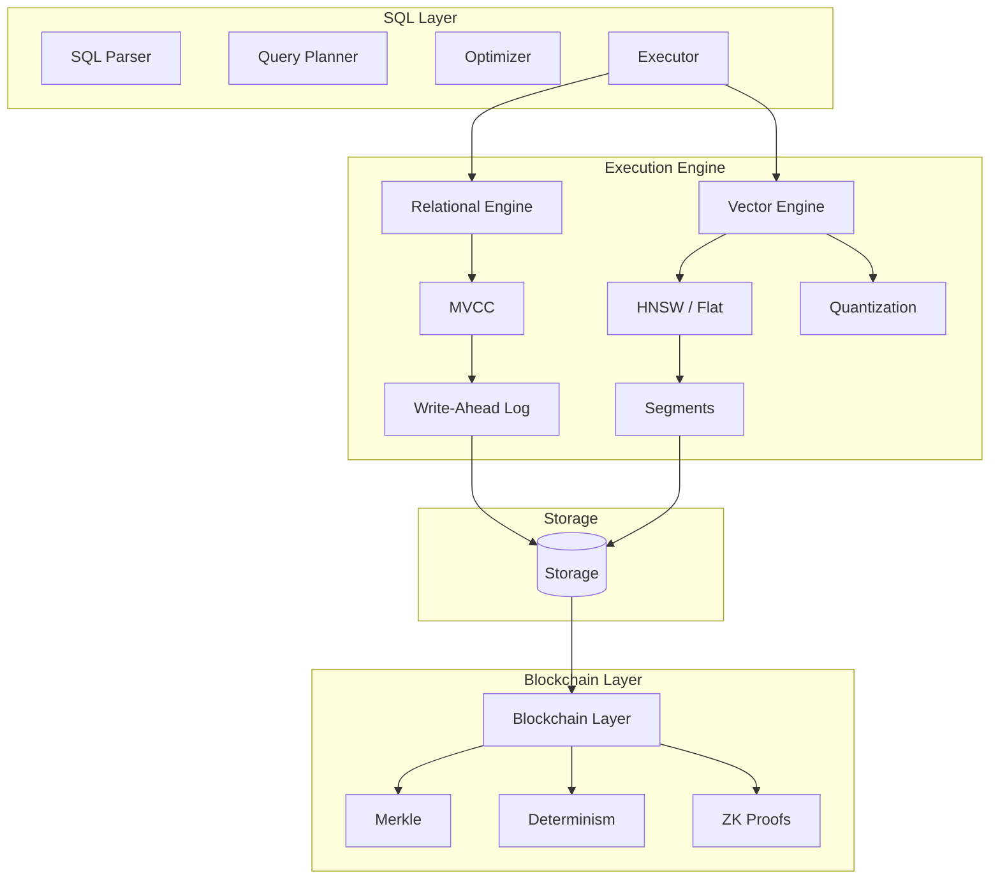
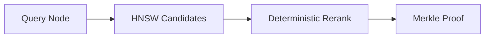

# RFC-0107: Production Vector-SQL Storage Engine (v2)

## Status

Draft (v2 — adversarial review + production architecture)

## Summary

This RFC defines a **production-grade unified Vector-SQL storage engine** integrating:

- SQL relational queries
- Approximate nearest neighbor (ANN) vector search
- MVCC transactional semantics
- Blockchain verification primitives
- Deterministic numeric computation (DFP/DQA/DVEC)
- ZK-proof friendly commitments

The system merges capabilities typically spread across:

| Domain        | Existing Systems  |
| ------------- | ----------------- |
| Vector search | Qdrant / Pinecone |
| SQL           | PostgreSQL        |
| Verification  | Blockchain        |

The goal is a **single deterministic database layer** capable of:

```
AI retrieval
+
structured queries
+
cryptographic verification
```

within one execution engine.

> ⚠️ **This is RFC-0103 v2** — Enhanced with adversarial review, production architecture, and tighter deterministic numeric tower integration.

## Design Goals

### Motivation

Current AI applications require multiple systems:

- **Vector database** (Qdrant, Pinecone, Weaviate) for similarity search
- **SQL database** (PostgreSQL, SQLite) for structured data

This creates:

- Operational complexity
- Data consistency challenges
- Latency from cross-system queries

**Why This Matters for CipherOcto**:

1. **Vector similarity search** for agent memory/retrieval
2. **SQL queries** for structured data (quotas, payments, reputation)
3. **Blockchain verification** for verifiable AI

A unified system reduces infrastructure complexity while maintaining all required capabilities.

### G1 — Single query engine

Support queries combining:

```
vector similarity
+
relational filtering
+
aggregation
```

Example:

```sql
SELECT id
FROM agents
WHERE reputation > 0.9
ORDER BY cosine_distance(embedding, $query)
LIMIT 10;
```

### G2 — Deterministic consensus compatibility

Vector math must not break consensus determinism.

Therefore the architecture enforces **three execution layers**:

| Layer                | Purpose              | Determinism       |
| -------------------- | -------------------- | ----------------- |
| Fast ANN             | candidate generation | non-deterministic |
| Deterministic rerank | exact ranking        | deterministic     |
| Blockchain proof     | input verification   | cryptographic     |

### G3 — High throughput

Target production performance:

| metric            | target          |
| ----------------- | --------------- |
| Query latency     | < 50 ms         |
| Insert throughput | > 10k vectors/s |
| Recall@10         | >95%            |
| Proof generation  | <5s async       |

### G4 — ZK-ready state commitments

All vector datasets must be **provably committed** so that:

```
query result
+
proof
=
verifiable computation
```

## System Architecture



## Data Types

Vector storage uses **two distinct vector representations**.

### Storage Vectors

Used for indexing and retrieval.

```
VECTOR(f32)
```

Example:

```sql
embedding VECTOR(768)
```

Properties:

| property    | value            |
| ----------- | ---------------- |
| precision   | float32          |
| performance | SIMD accelerated |
| determinism | not guaranteed   |

### Consensus Vectors

Defined in **RFC-0106 Numeric Tower**.

```
DVEC<N>
```

Scalar types:

```
DFP  — deterministic float
DQA  — deterministic quantized arithmetic
```

Example:

```sql
DVEC768(DFP)
```

Properties:

| property  | value          |
| --------- | -------------- |
| precision | deterministic  |
| execution | scalar loop    |
| purpose   | consensus / ZK |

### Conversion

Conversion between types is explicit.

```sql
CAST(embedding AS DVEC768(DFP))
```

Used during verification.

> ⚠️ **Key Distinction**: Storage vectors (VECTOR) are for performance, consensus vectors (DVEC) are for verification. Never mix in the same query path without explicit CAST.

### SQL Syntax

```sql
-- Create table with vector column
CREATE TABLE embeddings (
    id INTEGER PRIMARY KEY,
    content TEXT,
    embedding VECTOR(384)
) STORAGE = mmap;

-- Vector index with quantization
CREATE INDEX idx_emb ON embeddings(embedding)
USING HNSW WITH (
    metric = 'cosine',
    m = 32,
    ef_construction = 400,
    quantization = 'pq',
    compression = 8
);

-- Insert vectors
INSERT INTO embeddings (id, content, embedding)
VALUES (1, 'hello world', '[0.1, 0.2, ...]');

-- Vector search
SELECT id, content,
    cosine_distance(embedding, '[0.1, 0.2, ...]') as dist
FROM embeddings
ORDER BY dist
LIMIT 10;

-- Hybrid query
SELECT id
FROM agents
WHERE reputation > 0.9
ORDER BY cosine_distance(embedding, $query)
LIMIT 10;
```

## Vector Engine

### Execution Operators

Vector operations become **first-class operators**.

Example execution plan:

```
SeqScan(agents)
 → PayloadFilter(reputation > 0.9)
 → VectorIndexScan(HNSW)
 → DeterministicRerank
 → VectorTopK
```

Operator definitions:

| operator            | role                      |
| ------------------- | ------------------------- |
| VectorIndexScan     | ANN traversal             |
| PayloadFilter       | scalar filter             |
| VectorDistance      | distance computation      |
| DeterministicRerank | deterministic ranking     |
| VectorTopK          | final selection           |
| HybridMerge         | combine multiple segments |

> ⚠️ **Clarification**: The planner outputs these operators. DeterministicRerank runs on all candidate sets before final TopK to ensure consensus safety.

### Search Algorithms

| Algorithm     | Use Case       | Recall      | Latency  |
| ------------- | -------------- | ----------- | -------- |
| **HNSW**      | ProductionANN  | High (95%+) | Low      |
| **Flat**      | Exact search   | 100%        | High     |
| **Quantized** | Large datasets | Medium      | Very Low |

#### HNSW Parameters

| Parameter         | Default | Range               | Description               |
| ----------------- | ------- | ------------------- | ------------------------- |
| `m`               | 16      | 4-64                | Connections per layer     |
| `ef_construction` | 200     | 64-512              | Search width during build |
| `ef_search`       | 50-512  | Search width during | 10 query                  |
| `metric`          | cosine  | l2, cosine, ip      | Distance metric           |

#### Quantization Options

| Type   | Compression | Loss   | Use Case          |
| ------ | ----------- | ------ | ----------------- |
| **BQ** | 32x         | ~5%    | Fast, approximate |
| **SQ** | 4x          | ~2%    | Balanced          |
| **PQ** | 8-64x       | ~5-15% | Large datasets    |

## Query Planner Rules

Hybrid queries require cost-based decisions.

### Example Query

```sql
SELECT *
FROM agents
WHERE reputation > 0.9
ORDER BY cosine_distance(embedding, $query)
LIMIT 10
```

Possible plans:

**Plan A**: Vector index first

```
VectorIndexScan
→ Filter
```

**Plan B**: Filter first

```
Filter
→ VectorSearch
```

### Cost Model

Planner estimates:

```
cost = vector_cost + filter_cost
```

Heuristic rules:

| condition               | plan         |
| ----------------------- | ------------ |
| filter selectivity < 5% | filter first |
| large dataset           | ANN first    |
| small dataset           | brute force  |

### Hybrid Search Operator

Hybrid search merges scalar and vector signals.

```sql
ORDER BY
  cosine_distance(vector)
  + bm25(text)*0.3
```

Operator:

```
HybridScore
```

## Storage Architecture

### Segment Model

Vectors stored in **immutable segments**.

```
segment_1
segment_2
segment_live
```

Query executes across segments:

```
search(segment_1)
search(segment_2)
search(segment_live)
merge results
```

### Segment Layout

Struct-of-arrays memory layout:

```
ids[]
embeddings[]
metadata_offsets[]
metadata_blob[]
```

Advantages:

- SIMD friendly
- contiguous memory
- faster cache access

### Merge Policy

Segments merged when:

```
segments > 8
```

Strategy:

```
merge smallest segments first
```

### Versioned Segments

Required for blockchain immutability.

Segment structure:

```rust
struct VersionedSegment {
    segment_id: u64,
    version: u64,
    merkle_root: [u8; 32],
    created_block: u64,
    is_active: bool,
}
```

Old segments retained for historical queries.

## Determinism Model

Vector operations inherently use floating point.

Differences between architectures:

```
AVX
NEON
SSE
```

produce slightly different rounding.

### Three Layer Verification



Guarantees:

| property            | guarantee     |
| ------------------- | ------------- |
| vector existence    | full          |
| ranking correctness | full          |
| candidate identity  | probabilistic |

### Validator Requirement

> ⚠️ **Critical**: Validator nodes **MUST** run exact verification to ensure consensus safety.

| Node Type      | Required Verification                 |
| -------------- | ------------------------------------- |
| Query Node     | HNSW + DeterministicRerank            |
| Validator Node | HNSW + **Brute-force** + Merkle proof |

```rust
// Strict verification mode for validators
fn verify_with_consensus(query: &[f32], k: usize) -> VerifiedResult {
    // Layer 1: HNSW for candidate generation
    let candidates = hnsw_search(query, k * 4);

    // Layer 2: Brute-force for exact consensus
    let exact_results = brute_force_search(query, k);

    // Layer 3: Merkle proof
    let proof = generate_merkle_proof(&exact_results);

    VerifiedResult { results: exact_results, proof }
}
```

## Deterministic ANN (Det-ANN)

> ⚠️ **Research Direction**: This section describes a future enhancement that removes the need for validator brute-force fallback.

### Motivation

Traditional ANN algorithms like HNSW are **not deterministic** because:

- Graph traversal order depends on memory layout
- Floating-point operations differ across CPU architectures
- Concurrent graph construction changes topology

This causes **candidate divergence** across nodes.

**Current mitigation**: ANN search → deterministic rerank → validator brute force

**Det-ANN** introduces deterministic vector search algorithms.

### Design

Det-ANN enforces:

```
same input
+
same index
+
same query
=
same candidate set
```

| Constraint               | Mechanism               |
| ------------------------ | ----------------------- |
| Deterministic traversal  | canonical graph walk    |
| Deterministic arithmetic | DFP / DQA numeric tower |
| Deterministic ordering   | stable candidate heaps  |

### Deterministic Traversal

#### Canonical Neighbor Ordering

All adjacency lists must be sorted:

```
neighbors = sort_by(node_id)
```

#### Deterministic Priority Queue

Comparison key:

```
(distance, vector_id)
```

Tie-breaking: if distances equal, compare vector_id.

#### Deterministic Graph Construction

Insertion order:

```
vector_id ascending
```

Single-threaded or deterministic batch builder.

### Deterministic Distance Computation

| Mode      | Arithmetic   | Purpose           |
| --------- | ------------ | ----------------- |
| FAST      | float32 SIMD | Query execution   |
| DET       | DFP          | Deterministic ANN |
| CONSENSUS | DQA          | ZK verification   |

### Algorithm

```
entrypoint = highest layer node

for layer in reverse_layers:
    greedy_walk(layer)

base_layer_search:
    canonical BFS
    stable heap
    deterministic distance
```

### Modes

| Mode      | Determinism | Performance |
| --------- | ----------- | ----------- |
| FAST      | No          | highest     |
| SAFE      | Partial     | high        |
| CONSENSUS | Full        | moderate    |

### Complexity

Estimated performance impact:

```
~1.2x slower than standard HNSW
```

Still orders of magnitude faster than brute-force.

### ZK Compatibility

Det-ANN enables verifiable vector search proofs:

```
query → deterministic ANN → rerank → proof
```

Prover can prove "these are the true top-k vectors" without revealing dataset.

### Interaction With Numeric Tower

| Layer     | Type           |
| --------- | -------------- |
| FAST      | VECTOR(f32)    |
| DET       | DVEC\<N\>(DFP) |
| CONSENSUS | DVEC\<N\>(DQA) |

### Implementation Phases

1. Canonical graph ordering
2. Stable priority queue
3. Deterministic graph builder
4. DFP deterministic distance
5. Consensus mode

### Limitations

| Issue               | Impact             |
| ------------------- | ------------------ |
| ANN approximation   | May miss neighbors |
| Adversarial vectors | Graph poisoning    |
| Dataset skew        | Degraded recall    |

### Summary

Det-ANN transforms ANN from "fast but nondeterministic" into "fast + deterministic + verifiable".

## ZK-Ready Vector Commitments

To support future **zero knowledge proofs**.

Vectors are committed using:

```
hash = blake3(vector_id || blake3(vector_bytes))
```

Merkle tree uses these hashes.

Structure:

```
root
 ├ segment_root_1
 │   └ vector hashes
 ├ segment_root_2
 │   └ vector hashes
```

Benefits:

- smaller tree
- faster updates
- ZK friendly

### Storage vs Consensus Vectors

| Aspect          | Storage Vectors         | Consensus Vectors      |
| --------------- | ----------------------- | ---------------------- |
| **Type**        | VECTOR(f32)             | DVEC\<N\> with DQA/DFP |
| **Purpose**     | HNSW indexing           | Consensus verification |
| **Determinism** | Three-layer (fast→soft) | Built-in               |
| **Performance** | SIMD/GPU accelerated    | Software only          |

## WAL

Vector operations logged for recovery.

```rust
enum WalVectorOp {
    VectorInsert { file_offset: u64, vector_size: u32 },
    VectorDelete { vector_id: i64 },
    VectorUpdate { delta_offset: u64, delta_size: u32 },
    SegmentCreate { is_immutable: bool },
    SegmentMerge { old_merkle_root, new_merkle_root },
    IndexBuild,
    SnapshotCommit,
}
```

> ⚠️ **Optimization**: WAL uses pointer approach (file_offset) instead of full vectors to prevent WAL bloat.

Recovery process:

```
replay WAL
rebuild segments
rebuild indexes
restore snapshot
```

## Background Scheduler

Vector databases require many background tasks.

Scheduler responsibilities:

| task             | trigger       |
| ---------------- | ------------- |
| segment merge    | segment count |
| compaction       | tombstones    |
| index rebuild    | merges        |
| proof generation | async         |
| snapshot         | interval      |

## GPU Acceleration

GPU support limited to:

| operation             | benefit |
| --------------------- | ------- |
| distance compute      | high    |
| quantization training | high    |
| batch rerank          | medium  |

Graph traversal remains CPU-bound.

> ⚠️ **Priority**: SIMD > GPU. GPU only useful for specific operations.

## SIMD Dispatch

Architecture specific implementations:

| arch | instruction   |
| ---- | ------------- |
| x86  | AVX512 / AVX2 |
| ARM  | NEON          |

Runtime dispatch chooses best implementation.

## Adversarial Review

This section analyses possible failure modes.

### Consensus Divergence

**Threat**: ANN candidate mismatch between nodes

**Mitigation**:

- Expanded candidate sets (4×K minimum)
- Validator brute force verification

### Malicious Query Node

**Threat**: Node returns incorrect vectors

**Mitigation**:

- Merkle proof verification
- Stake-based reputation

### Index Poisoning

**Threat**: Adversary inserts vectors to bias search

**Mitigation**:

- Reputation filters
- Stake-based rate limits
- Anomaly detection

### Denial-of-Service

**Threat**: Vector queries are expensive

**Mitigation**:

- Candidate limits
- Cost-based planner
- Query quotas

### Segment Explosion

**Threat**: Frequent writes create many segments

**Mitigation**:

- Merge scheduler
- Aggressive merge triggers

### WAL Exhaustion

**Threat**: Vector WAL grows unbounded

**Mitigation**:

- Delta encoding
- Quantization before WAL
- Aggressive rotation (64MB)

## Garbage Collection

Inactive segments retained for a fixed window.

```rust
struct GcConfig {
    retain_blocks: u64,           // Default: 10,000
    min_inactive_segments: u32,   // Default: 10
    max_inactive_segments: u32,  // Default: 50
}
```

**GC Policy**:

1. Mark segment inactive after merge
2. Retain for `retain_blocks` finalized
3. Delete oldest after threshold exceeded
4. Historical queries beyond retention use snapshots

## Performance Considerations

Major performance drivers:

| factor         | impact    |
| -------------- | --------- |
| SIMD distance  | very high |
| segment merges | medium    |
| quantization   | high      |
| cache locality | high      |

## Integration with Numeric Tower

This RFC integrates with RFC-0106 (Deterministic Numeric Tower):

| RFC-0103 (Storage) | RFC-0106 (Compute) | Use Case       |
| ------------------ | ------------------ | -------------- |
| VECTOR(f32)        | DVEC\<N\>(DQA)     | Fast retrieval |
| VECTOR(f32)        | DVEC\<N\>(DFP)     | Scientific     |
| Three-layer        | Scalar loop        | Consensus      |

**Workflow**:

```sql
-- Fast query (storage path)
SELECT id, embedding
FROM agents
WHERE cosine_distance(embedding, $query) < 0.5;

-- Consensus verification
SELECT id,
    CAST(embedding AS DVEC768(DFP)) as verified_embedding
FROM agents
WHERE id IN (SELECT id FROM agents WHERE ...);
```

## Implementation Phases

### Phase 1: Core Engine (MVP)

- MVCC + Segment architecture
- Three-layer verification
- Vector ID + content hash for Merkle
- Basic statistics collection
- In-Memory storage
- Test: MVCC + concurrent vector UPDATE/DELETE

### Phase 2: Persistence

- Memory-Mapped backend
- WAL with pointer approach
- Snapshot + recovery
- HNSW index

### Phase 3: Quantization

- Binary Quantization (BQ)
- Scalar Quantization (SQ)
- Product Quantization (PQ)

### Phase 4: Advanced Search

- Sparse vectors + BM25
- Statistics collection
- Hybrid query planner

### Phase 5: ZK Integration

- Deterministic rerank optimization
- Proof generation pipeline
- ZK circuit compatibility

### Phase 6: GPU Support (Future)

- Distance computation on GPU
- NOT graph traversal

## Key Files to Modify

| File                        | Change                         |
| --------------------------- | ------------------------------ |
| `src/storage/mod.rs`        | Add vector backend abstraction |
| `src/storage/vector/mod.rs` | Vector storage engine          |
| `src/storage/index/hnsw.rs` | HNSW implementation            |
| `src/executor/vector.rs`    | Vector execution operators     |
| `src/planner/vector.rs`     | Hybrid query planning          |
| `src/parser/`               | Add VECTOR type syntax         |

## Alternatives Considered

### Separate Systems

| Approach                  | Pros         | Cons                              |
| ------------------------- | ------------ | --------------------------------- |
| Separate SQL + Vector DBs | Mature tools | Sync overhead, consistency issues |

### Vector-Only

| Approach       | Pros        | Cons                  |
| -------------- | ----------- | --------------------- |
| Pure vector DB | Fast search | No SQL, no blockchain |

### This Approach

Unified system with:

- SQL for structured data
- Vector for similarity
- Blockchain for verification
- Deterministic math for consensus

## Performance Targets

| Metric            | Target | Notes       |
| ----------------- | ------ | ----------- |
| Query latency     | <50ms  | @ 1K QPS    |
| Insert throughput | >10k/s | Single node |
| Recall@10         | >95%   | HNSW        |
| Proof generation  | <5s    | Async       |
| MTTR              | <5min  | <1M vectors |

## Appendices

### A. Replication Model

**Question**: How do nodes synchronize in distributed deployments?

| Model               | Use Case             | Implementation                      |
| ------------------- | -------------------- | ----------------------------------- |
| **Raft**            | Strong consistency   | Leader + followers, log replication |
| **Gossip**          | Eventual consistency | Peer-to-peer state sharing          |
| **Blockchain-only** | Verification only    | Merkle state, not real-time sync    |

> ⚠️ **Recommendation**: Start with Raft for strong consistency. Gossip for large-scale deployments (future).

**Vector Index Replication Strategy**:

| Component        | Replicated? | Strategy                                |
| ---------------- | ----------- | --------------------------------------- |
| Vector data      | Yes         | Raft log replicates raw vectors         |
| HNSW index       | No          | Rebuilt locally from replicated vectors |
| Segment metadata | Yes         | Replicated via Raft                     |
| Merkle root      | Yes         | Computed locally, proof shared          |

**Why**:

- Replicating graph structure is complex and non-deterministic
- Rebuilding index locally is simpler and deterministic
- Each node computes identical index from identical data

### B. Query Language Extensions

SQL extensions for vector operations:

| Syntax                        | Purpose                   |
| ----------------------------- | ------------------------- |
| `VECTOR(dims)`                | Column type for vectors   |
| `VEC_DISTANCE_COSINE(v1, v2)` | Cosine distance function  |
| `VEC_DISTANCE_L2(v1, v2)`     | Euclidean distance        |
| `BM25_MATCH(column, query)`   | Text search               |
| `STORAGE = backend`           | Storage backend selection |
| `USING HNSW`                  | Index type selection      |

### C. Agent Memory Model

CipherOcto agents require structured memory:

```sql
-- Episodic memory: what the agent did
CREATE TABLE episodic_memory (
    id INTEGER PRIMARY KEY,
    agent_id INTEGER,
    episode_id BIGINT,
    embedding VECTOR(768),
    action JSON,
    result JSON,
    timestamp TIMESTAMP
) STORAGE = memory;

-- Semantic memory: learned knowledge
CREATE TABLE semantic_memory (
    id INTEGER PRIMARY KEY,
    agent_id INTEGER,
    embedding VECTOR(768),
    knowledge JSON,
    confidence REAL,
    timestamp TIMESTAMP
) STORAGE = mmap;

-- Create index for retrieval
CREATE INDEX idx_episodic ON episodic_memory(embedding) USING HNSW;
CREATE INDEX idx_semantic ON semantic_memory(embedding) USING HNSW;
```

### D. Implementation Notes

#### Memory Alignment for SoA

When implementing Struct of Arrays, ensure memory allocations are aligned:

| SIMD Level | Alignment | Implementation                   |
| ---------- | --------- | -------------------------------- |
| AVX2       | 32-byte   | `Layout::from_size_align(n, 32)` |
| AVX-512    | 64-byte   | `Layout::from_size_align(n, 64)` |
| ARM NEON   | 16-byte   | `Layout::from_size_align(n, 16)` |

```rust
use std::alloc::{alloc, Layout};

// For AVX-512
let layout = Layout::from_size_align(size * mem::size_of::<f32>(), 64).unwrap();
let ptr = unsafe { alloc(layout) };
```

#### Blake3 for Merkle Tree

The `blake3(vector_id || blake3(embedding))` structure is optimal:

- Blake3 has SIMD-optimized Rust implementation
- Benchmarks: 10M hashes/second on modern CPU
- Makes "commit-time Merkle root" feasible (<100ms for 1M vectors)

```rust
use blake3::Hasher;

fn vector_hash(vector_id: u64, embedding: &[f32]) -> [u8; 32] {
    let mut hasher = Hasher::new();
    hasher.update(&vector_id.to_be_bytes());
    let embedding_bytes: Vec<u8> = embedding.iter()
        .flat_map(|f| f.to_be_bytes())
        .collect();
    hasher.update(&embedding_bytes);
    *hasher.finalize().as_array()
}
```

## Future Work

### F1 — Deterministic ANN

Research deterministic HNSW traversal.

### F2 — ZK-Proof Queries

Allow proof generation for vector search.

### F3 — Hardware Acceleration

Explore:

```
GPU
TPU
FPGA
```

### F4 — Learned Indexes

Use ML to optimize vector partitioning.

## Conclusion

This RFC defines a **production-grade vector-SQL storage engine** capable of:

- Hybrid relational + vector queries
- Deterministic blockchain verification
- Scalable ANN search
- ZK-ready commitments

The architecture separates **performance paths** from **consensus verification paths**, enabling both:

```
fast queries
+
provable correctness
```

This makes the system uniquely suited for **AI-native blockchain infrastructure**.

---

**Submission Date:** 2025-03-06
**Last Updated:** 2025-03-06
**Version:** 2.0
**Replaces:** RFC-0103
