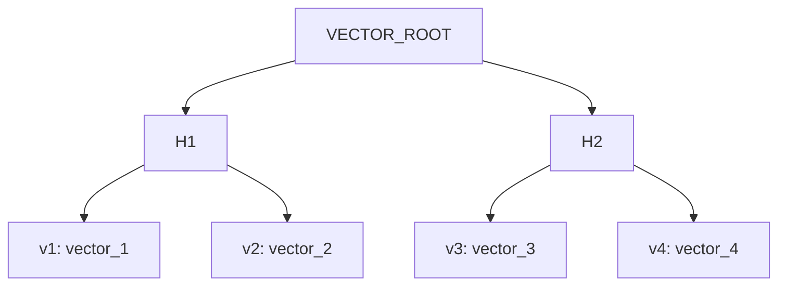
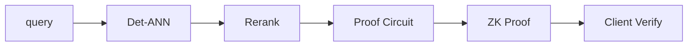
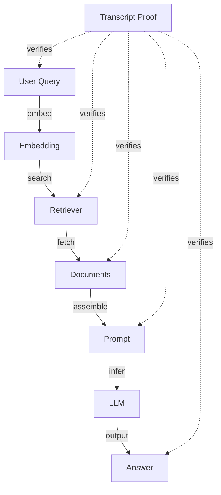
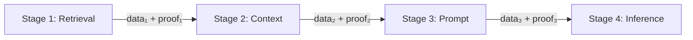

# RFC-0108: Verifiable AI Retrieval

## Status

Draft

## Summary

This RFC defines **Verifiable AI Retrieval** — a system that provides cryptographic proofs for vector search results.

The architecture combines:

- Deterministic ANN (Det-ANN from RFC-0107)
- Vector Merkle commitments
- Deterministic reranking
- Optional ZK proofs

The result is a database where clients can verify: **"These are provably the real top-k vectors in this dataset."**

This is a capability no current vector database (Faiss, Milvus, Pinecone, Weaviate) provides.

> ⚠️ **Prerequisites**: This RFC builds on RFC-0106 (Numeric Tower) and RFC-0107 (Vector-SQL Storage v2)

## Motivation

### Problem Statement

Normal vector databases return results that **cannot be verified**.

**Example query**:

```
query: "motorcycle riding gear"
top_k = 3
```

**Server returns**:

```
doc_812
doc_441
doc_129
```

**But client cannot prove**:

- Those vectors exist in the dataset
- Those are actually the closest vectors
- Server did not hide better matches

### Trust Problems

This becomes critical in:

| Domain                  | Problem                                  |
| ----------------------- | ---------------------------------------- |
| AI marketplaces         | Providers cannot prove retrieval quality |
| Decentralized inference | Nodes may manipulate results             |
| RAG pipelines           | Cannot verify LLM context is correct     |
| On-chain AI             | Smart contracts cannot verify proofs     |

### Desired State

Clients can verify:

- Vector membership in dataset
- Distance computation correctness
- Ranking order correctness
- No better vectors were skipped

## Architecture Overview

```
┌─────────────────────────────────────────────────────────┐
│                  AI Query Layer                         │
└──────────────────────┬──────────────────────────────────┘
                       │
┌──────────────────────▼──────────────────────────────────┐
│                  Det-ANN Engine                         │
│              (RFC-0107 Deterministic ANN)              │
└──────────────────────┬──────────────────────────────────┘
                       │
┌──────────────────────▼──────────────────────────────────┐
│            Deterministic Numeric Tower                  │
│           (RFC-0106 - DFP/DQA/DVEC)                   │
└──────────────────────┬──────────────────────────────────┘
                       │
┌──────────────────────▼──────────────────────────────────┐
│            Vector Merkle Commitments                   │
└──────────────────────┬──────────────────────────────────┘
                       │
┌──────────────────────▼──────────────────────────────────┐
│              Proof System (optional ZK)                │
└─────────────────────────────────────────────────────────┘
```

## Vector Commitment Structure

### Dataset Commitment

The vector dataset is committed using a Merkle tree:

```
vector dataset
→ canonical ordering
→ merkle tree
→ root hash
```

Every node shares the same `VECTOR_ROOT`.

### Leaf Structure

Each leaf contains:

```rust
struct VectorLeaf {
    vector_id: u64,
    vector: Vec<f32>,
    metadata_hash: [u8; 32],
}

impl VectorLeaf {
    fn hash(&self) -> [u8; 32] {
        blake3::hash(&[
            &self.vector_id.to_be_bytes(),
            &self.vector_bytes(),
            &self.metadata_hash,
        ].concat())
    }
}
```

### Merkle Tree Structure



**Benefits**:

- Each vector has a Merkle proof
- Root commits to entire dataset
- Efficient verification

## Query Execution Pipeline

### With Deterministic ANN

```
query vector
        │
        ▼
Det-ANN search (canonical traversal)
        │
        ▼
candidate set (deterministic)
        │
        ▼
deterministic rerank (DFP/DQA)
        │
        ▼
top_k results
        │
        ▼
return: results + proofs + transcript
```

### Response Structure

A full response contains:

```json
{
  "results": [
    {
      "vector_id": 812,
      "distance": 0.214,
      "merkle_proof": ["..."],
      "vector_commitment": "..."
    }
  ],
  "transcript_hash": "...",
  "dataset_root": "...",
  "search_config": {
    "mode": "CONSENSUS",
    "ef_search": 40,
    "k": 10
  }
}
```

## Verification Types

### 1. Membership Verification

Client checks Merkle proof:

```rust
fn verify_membership(
    leaf_hash: [u8; 32],
    proof: &[MerkleNode],
    root: [u8; 32],
) -> bool {
    let mut current = leaf_hash;
    for node in proof {
        current = match node.position {
            Left => blake3::hash(&[current, node.hash].concat()),
            Right => blake3::hash(&[node.hash, current].concat()),
        };
    }
    current == root
}
```

**Guarantee**: `vector ∈ dataset`

### 2. Distance Verification

Distances are recomputed using deterministic arithmetic:

| Mode      | Arithmetic | Use Case           |
| --------- | ---------- | ------------------ |
| FAST      | float32    | Quick verification |
| DET       | DFP        | Full precision     |
| CONSENSUS | DQA        | ZK-compatible      |

```rust
fn verify_distance(
    query: &[f32],
    result: &VectorResult,
    mode: SearchMode,
) -> bool {
    let computed = match mode {
        SearchMode::DET => dfp_distance(query, &result.vector),
        SearchMode::CONSENSUS => dqa_distance(query, &result.vector),
        _ => f32_distance(query, &result.vector),
    };
    computed == result.distance
}
```

**Guarantee**: Distance computation is correct

### 3. Ordering Verification

```rust
fn verify_ordering(results: &[VectorResult]) -> bool {
    for i in 1..results.len() {
        if results[i-1].distance > results[i].distance {
            return false;
        }
    }
    true
}
```

**Guarantee**: `d1 ≤ d2 ≤ d3 ≤ ... ≤ dk`

### 4. Coverage Proof (Det-ANN)

The hardest part: prove no better vectors were skipped.

Det-ANN generates a **search transcript**:

```rust
struct SearchTranscript {
    query_vector: Vec<f32>,
    visited_nodes: Vec<u64>,
    candidate_heap: Vec<(f32, u64)>,
    ef_search: usize,
}

impl SearchTranscript {
    fn hash(&self) -> [u8; 32] {
        blake3::hash(&[
            &self.query_bytes(),
            &self.visited_bytes(),
            &self.heap_bytes(),
        ].concat())
    }
}
```

**Transcript proves**:

- Algorithm followed canonical path
- All candidates evaluated
- No shortcuts taken

## ZK-Proof Upgrade

### Motivation

Instead of sending full transcript, server produces:

```
zk_proof(Det-ANN(query) = top_k)
```

### Proof Guarantees

The ZK proof proves:

- Correct algorithm executed
- Correct dataset committed
- Correct result returned

Without revealing:

- Full dataset
- Search path
- Internal graph structure

### ZK Pipeline



### Circuit Structure

```rust
// Simplified ZK circuit for ANN verification
fn verify_ann_circuit(
    // Public inputs
    query_commitment: Digest,
    dataset_root: Digest,
    result_ids: Vec<u64>,
    result_distances: Vec<Field>,
    proof: Proof,
    // Witness (private)
    query_vector: Vec<Field>,
    visited_nodes: Vec<Field>,
) -> bool {
    // 1. Verify query commitment
    verify_commitment(query_commitment, query_vector);

    // 2. Verify each result distance
    for (id, dist) in result_ids.zip(result_distances) {
        let vector = lookup_vector(id);
        let computed = compute_distance(query_vector, vector);
        assert_eq!(computed, dist);
    }

    // 3. Verify ordering
    assert!(is_sorted_ascending(result_distances));

    // 4. Verify no better candidates exist
    verify_coverage(visited_nodes, query_vector, result_distances);

    proof.verify()
}
```

## Verifiable RAG

### Current RAG Pipeline

```
LLM
  │
  ▼
vector search
  │
  ▼
documents
  │
  ▼
answer
```

**Problem**: The retriever can lie or return incorrect context.

### Verifiable RAG Pipeline

```
LLM
  │
  ▼
vector search
  │
  ▼
documents + proofs
  │
  ▼
verify context  ← NEW
  │
  ▼
verified context
  │
  ▼
answer
```

**Guarantees**:

- LLM used correct context
- Context actually exists in dataset
- Context is actually relevant (verified distances)

### Example

```sql
-- Query with verification
SELECT
    id,
    content,
    cosine_distance(embedding, $query) as dist,
    get_merkle_proof(embedding, $root) as proof
FROM documents
WHERE cosine_distance(embedding, $query) < 0.3
ORDER BY dist
LIMIT 10;

-- Client verification
VERIFY PROOF ON CLIENT:
  1. Check Merkle membership
  2. Recompute distances with DFP
  3. Verify ordering
```

## Proof-of-Retrieval

### Concept

Once vectors are committed cryptographically, we can build **Proof-of-Retrieval**:

Similar to:

- **Proof-of-Storage** (Filecoin)
- **Proof-of-Replication**

But for AI knowledge retrieval.

### Economic Model

```rust
struct RetrievalBond {
    provider: Pubkey,
    stake_amount: u64,
    dataset_root: Digest,
    retrieval_count: u64,
    quality_score: f64,
}

impl RetrievalBond {
    fn verify_retrieval(
        &self,
        proof: &RetrievalProof,
    ) -> bool {
        // Verify proof is valid
        proof.verify(self.dataset_root)
            && proof.query_timestamp > self.activation_time
    }
}
```

### Slashing Conditions

| Condition              | Slashing   |
| ---------------------- | ---------- |
| Invalid Merkle proof   | 10% stake  |
| Incorrect distance     | 25% stake  |
| Missing coverage proof | 50% stake  |
| Repeated cheating      | 100% stake |

## Security Properties

### Threat Model

| Threat                       | Mitigation               |
| ---------------------------- | ------------------------ |
| Server returns wrong vectors | Merkle membership proof  |
| Server manipulates distances | Deterministic arithmetic |
| Server skips better vectors  | Det-ANN transcript       |
| Server caches queries        | Query freshness proof    |

### Privacy

| Data            | Visible          | Hidden      |
| --------------- | ---------------- | ----------- |
| Query vector    | Commitment       | Full vector |
| Result vectors  | Results + proofs | Dataset     |
| Search path     | Transcript hash  | Full path   |
| Graph structure | None             | Full graph  |

## Performance Considerations

### Proof Generation

| Component           | Time         |
| ------------------- | ------------ |
| Merkle proof        | <1ms         |
| Distance transcript | <10ms        |
| Coverage proof      | <100ms       |
| ZK proof            | <10s (async) |

### Verification

| Component          | Time   |
| ------------------ | ------ |
| Merkle check       | <1ms   |
| Distance recompute | <1ms   |
| ZK verify          | <100ms |

### Trade-offs

| Mode     | Security          | Latency | Bandwidth |
| -------- | ----------------- | ------- | --------- |
| Basic    | Membership only   | <10ms   | 1KB       |
| Standard | Full verification | <100ms  | 10KB      |
| ZK       | Cryptographic     | <10s    | 100KB     |

## Integration Points

### With RFC-0106 (Numeric Tower)

| Numeric Tower | Use in Verifiable Retrieval        |
| ------------- | ---------------------------------- |
| DFP           | Deterministic distance computation |
| DQA           | ZK-compatible arithmetic           |
| DVEC          | Vector commitment structure        |

### With RFC-0107 (Vector Storage)

| Vector Storage | Use in Verifiable Retrieval |
| -------------- | --------------------------- |
| Merkle root    | Dataset commitment          |
| Det-ANN        | Deterministic search        |
| Segments       | Incremental proofs          |

## Implementation Phases

### Phase 1: Basic Verification (MVP)

- Merkle tree over vector dataset
- Distance verification (DFP)
- Ordering verification

### Phase 2: Coverage Proofs

- Det-ANN transcript generation
- Coverage proof structure

### Phase 3: ZK Integration

- Proof circuit design
- ZK proof generation
- Client verification

### Phase 4: Economic Layer

- Bonding mechanism
- Slashing logic
- Quality scoring

## Use Cases

### 1. AI Marketplaces

Providers must prove retrieval quality:

```sql
-- Provider submits to marketplace
INSERT INTO provider_metrics
SELECT provider_id, COUNT(*), AVG(proof_verification_time)
FROM verified_retrievals
GROUP BY provider_id;
```

### 2. Decentralized Search

Nodes cannot manipulate results:

```rust
// Verify before accepting search result
fn verify_search_result(
    result: &SearchResult,
    root: &Digest,
) -> Result<()> {
    // All three verification types
    assert!(verify_membership(&result, root)?);
    assert!(verify_distances(&result)?);
    assert!(verify_ordering(&result)?);
    Ok(())
}
```

### 3. Agent Economies

Agents verify retrieval honesty:

```sql
-- Agent requests with verification
SELECT verify_retrieval(
    embedding,
    $query,
    merkle_root,
    proof
) FROM agents;
```

### 4. On-Chain AI

Smart contracts verify proofs:

```solidity
contract VerifiableAI {
    function verifyRetrieval(
        bytes32 root,
        uint256[] memory ids,
        uint256[] memory distances,
        bytes[] memory proofs
    ) public returns (bool) {
        // Verify all on-chain
        for (uint i = 0; i < ids.length; i++) {
            require(verifyMerkle(ids[i], proofs[i], root));
        }
        require(verifyOrdering(distances));
    }
}
```

## Conclusion

Verifiable AI Retrieval transforms vector search from:

```
"trust me, these are the results"
```

Into:

```
"here are the cryptographic proofs"
```

### Why This Is Rare

Vector databases today optimize for:

- Latency
- Recall
- Throughput

But not:

- Verifiability
- Determinism
- Cryptographic guarantees

### Why This Works Here

The RFC stack already has the hard prerequisites:

| Prerequisite                | RFC       | Status |
| --------------------------- | --------- | ------ |
| Deterministic numeric tower | 0106      | ✅     |
| Canonical ordering          | 0107      | ✅     |
| Deterministic ANN           | 0107      | ✅     |
| Consensus architecture      | 0103/0107 | ✅     |

This is exactly what's required for verifiable retrieval.

### The Bigger Picture

This enables:

```
Proof-of-Retrieval

similar to Proof-of-Storage (Filecoin)
similar to Proof-of-Replication

But for AI knowledge retrieval.
```

A new primitive for verifiable AI infrastructure.

---

**Submission Date:** 2025-03-06
**Last Updated:** 2025-03-06

**Prerequisites**:

- RFC-0106: Deterministic Numeric Tower
- RFC-0107: Production Vector-SQL Storage v2

## Research Integration

This RFC connects to the CipherOcto proof system:

| Layer                | Document                      | Purpose                  |
| -------------------- | ----------------------------- | ------------------------ |
| Verifiable Retrieval | RFC-0108 (this)               | Retrieval proofs         |
| Numeric Tower        | RFC-0106                      | Deterministic arithmetic |
| AIR                  | `luminair-air-deep-dive.md`   | Constraint generation    |
| STWO                 | `stwo-gpu-acceleration.md`    | GPU-accelerated proving  |
| Orion                | `cairo-ai-research-report.md` | Provable ML inference    |

## Transcript Proofs

A **transcript proof** proves the complete RAG pipeline:



### Transcript Structure

```rust
struct RetrievalTranscript {
    query_text: String,
    query_embedding: DVec,
    retrieved_doc_ids: Vec<u64>,
    retrieved_chunks: Vec<String>,
    prompt_template: String,
    prompt_hash: Digest,
    model_id: String,
    model_hash: Digest,
    llm_output: String,
    timestamp: u64,
}
```

### Verification Guarantees

Transcript proofs verify:

1. **Retrieval integrity**: Documents actually exist in dataset (Merkle proof)
2. **Relevance**: Distances computed correctly (deterministic arithmetic)
3. **Prompt commitment**: Prompt cannot be modified after retrieval
4. **Model integrity**: Specific model produced output (model hash)
5. **No hallucination**: Output derives from retrieved context

## Proof-Carrying Data Pipelines (PCDP)

> ⚠️ **Architectural Improvement**: Instead of proving full computation (expensive at scale), CipherOcto uses **Proof-Carrying Data (PCD)** — proving each pipeline stage independently.

### The Scalability Problem

Naïve ZK-AI attempts to prove everything at once:

```
retrieval → vector search → dataset filtering → LLM inference → proof
```

This fails for three reasons:

| Problem            | Impact                                                     |
| ------------------ | ---------------------------------------------------------- |
| Proof size         | LLM inference traces are enormous (millions of operations) |
| Prover cost        | Massive GPU resources, huge memory, long proving time      |
| Poor composability | Change one stage → recompute entire proof                  |

### The PCDP Approach

Instead, each stage outputs **data + proof**:



### CipherOcto Pipeline Stages

#### Stage 1 — Retrieval Proof

```
Query → Vector Search → Document Set
```

**Output:**

```json
{
  "documents": [...],
  "retrieval_proof": "...",
  "dataset_commitment": "..."
}
```

**Guarantees:**

- Correct index used
- Correct documents returned
- No omission of better matches

#### Stage 2 — Context Assembly Proof

```
Documents → Chunk Selection → Prompt Context
```

**Output:**

```json
{
  "prompt_context": "...",
  "context_proof": "..."
}
```

**Guarantees:**

- Selected chunks come from retrieved documents
- Chunk ordering is correct

#### Stage 3 — Deterministic Prompt Construction

```
System Prompt + User Query + Retrieved Context → Final Prompt
```

**Output:**

```json
{
  "final_prompt": "...",
  "prompt_commitment": "..."
}
```

**Guarantees:**

- Prompt = deterministic function(inputs)
- Integrates with RFC-0106 deterministic compute

#### Stage 4 — Inference Verification

Instead of proving full model (expensive), three options:

| Option                 | Approach                        | Cost    | Trust Level |
| ---------------------- | ------------------------------- | ------- | ----------- |
| **A: TEE Attestation** | Remote attestation + model hash | Lowest  | High        |
| **B: Sampled STARK**   | Prove selected layers only      | Medium  | High        |
| **C: Full STARK**      | Full inference proof            | Highest | Highest     |

### Proof Envelope Format

Standard proof artifact for CipherOcto AI:

```json
{
  "pipeline_id": "uuid",
  "stages": [
    {
      "stage": "retrieval",
      "proof": "...",
      "dataset_root": "..."
    },
    {
      "stage": "context",
      "proof": "..."
    },
    {
      "stage": "prompt",
      "commitment": "..."
    },
    {
      "stage": "inference",
      "verification": "TEE|SAMPLED|FULL",
      "proof": "..."
    }
  ]
}
```

### Advantages

| Advantage         | Benefit                                                      |
| ----------------- | ------------------------------------------------------------ |
| **Scalability**   | Proof cost = retrieval + small inference (not full pipeline) |
| **Modularity**    | Different nodes specialize: retrieval, prover, inference     |
| **Composability** | Reuse retrieval_proof across multiple queries                |
| **Parallelism**   | Stages can be proven independently in parallel               |

### Proof-Carrying AI

This enables **Proof-Carrying AI** — every AI output includes:

```json
{
  "answer": "The capital of France is Paris.",
  "proof": {
    "retrieval_proof": { "merkle_root": "...", "doc_ids": [...] },
    "inference_proof": { "model_hash": "...", "prompt_hash": "..." },
    "dataset_commitment": "..."
  }
}
```

## Related RFCs

- RFC-0103: Unified Vector-SQL Storage (superseded by 0107)
- RFC-0104: Deterministic Floating-Point
- RFC-0105: Deterministic Quant Arithmetic
- RFC-0106: Deterministic Numeric Tower (numeric determinism)
- RFC-0110: Verifiable RAG & Transcript Proofs (future)
