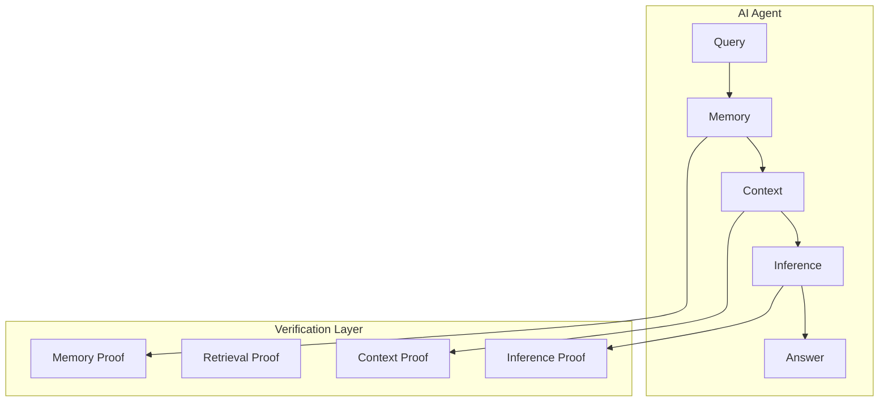
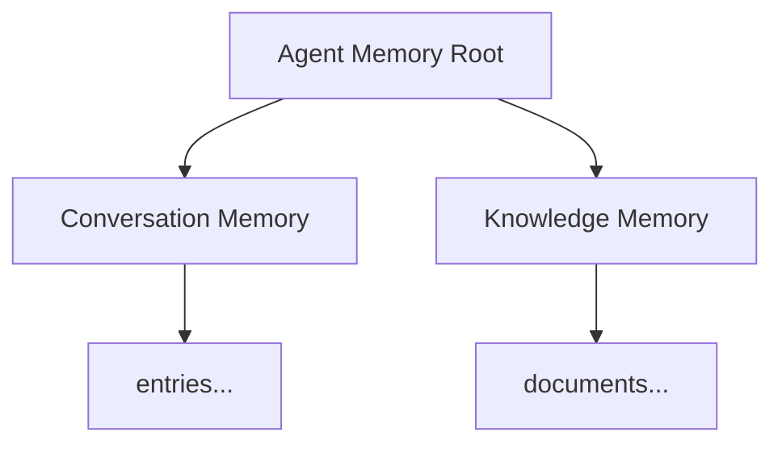
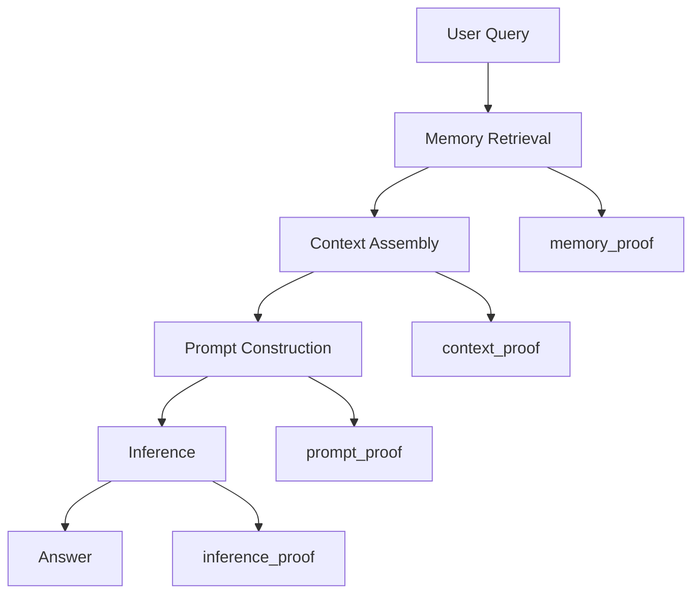

# RFC-0110: Verifiable Agent Memory

## Status

Draft

## Summary

This RFC defines **Verifiable Agent Memory (VAM)** — a system where AI agent memory operations produce cryptographic proofs, making agent behavior cryptographically auditable.

Agent memory becomes a **verifiable data structure** where:

- Every memory write produces a proof
- Every retrieval includes verification
- Memory lineage is traceable
- Agent decisions can be audited post-hoc

This builds on RFC-0108 (Verifiable Retrieval), RFC-0106 (Deterministic Compute), and integrates with storage tiers (OCTO-S).

## Motivation

### The Problem: AI Memory Is Unverifiable

Modern AI agents rely on memory systems:

- conversation history
- vector embeddings
- knowledge stores
- task state
- external documents

But memory operations are opaque:

| Issue                       | Impact                                 |
| --------------------------- | -------------------------------------- |
| Incorrect context retrieval | Agent makes wrong decisions            |
| Memory tampering            | Past interactions modified             |
| Fabricated interactions     | False history claimed                  |
| RAG manipulation            | Documents claimed as used that weren't |

For a decentralized AI system, this is unacceptable.

### Desired State

Every memory operation produces a cryptographic record:

```
memory = committed state + proofs
```

Agents become auditable: you can verify why an AI produced any answer.

## Architecture Overview



## Memory as a State Machine

Agent memory evolves through discrete transitions:

```
State₀ --write--> State₁ --write--> State₂ --write--> State₃
```

Each state has a commitment:

```
memory_root = MerkleTree(memories)
```

Every new memory entry produces:

```
new_root = update(old_root, entry)
```

Proof ensures the transition was valid.

## Memory Operations with Proofs

### 1. Memory Write

**Example:**

```
store memory: "user prefers Rust for backend systems"
```

**Proof ensures:**

- Entry correctly inserted into memory tree
- Previous state preserved

**Output:**

```json
{
  "memory_root": "...",
  "write_proof": "...",
  "entry_commitment": "..."
}
```

### 2. Memory Retrieval

**Example query:**

```
RECALL memories WHERE topic="Rust"
```

**Proof guarantees:**

- Retrieved memories exist in state
- No qualifying memory omitted

This uses the same coverage proofs as RFC-0108 retrieval verification.

### 3. Memory Ranking

Agents rank memories via embeddings:

```
distance(query_vec, memory_vec)
```

**Proof ensures:**

- Ranking correctness
- Uses vector verification from RFC-0106

### 4. Memory Update

**Example:**

```
update preference: "Python" → "Rust"
```

**Proof ensures:**

- Old entry replaced correctly
- History preserved
- No data loss

## Memory Provenance

Each memory entry includes metadata for lineage:

```rust
struct MemoryEntry {
    memory_id: uuid,
    timestamp: u64,
    source: MemorySource,  // conversation | dataset | tool | inference
    content: String,
    content_hash: Digest,
    embedding_hash: Digest,
    previous_root: Digest,
    new_root: Digest,
}

enum MemorySource {
    Conversation,  // User interaction
    Dataset,       // From retrieved documents
    Tool,          // Tool output
    Inference,     // Model-generated
}
```

## Agent Memory Tree Structure

Two-layer tree for scalability:



**Advantages:**

- Efficient updates per domain
- Separate memory namespaces
- Easier proof generation

## Storage Tier Integration

Memory types map to storage tiers:

| Memory Type         | Storage Tier     | Latency | Use Case         |
| ------------------- | ---------------- | ------- | ---------------- |
| Working Memory      | Hot (OCTO-S-H)   | <10ms   | Active context   |
| Long-term Knowledge | Cold (OCTO-S-C)  | minutes | Learned facts    |
| Historical Logs     | Archive (OCTO-H) | hours   | Full audit trail |

## Verifiable Decision Chain

With verifiable memory, prove why an agent produced an answer:



**Full proof chain:**

```
memory_proof + retrieval_proof + context_proof + inference_proof
```

## Agent Identity and Memory

Each agent has a cryptographic identity:

```
agent_id = hash(public_key)
```

Memory roots are bound to the agent:

```
memory_root_signed_by_agent
```

**Guarantees:**

- Memory belongs to this specific agent
- Non-repudiation

## Verifiable Multi-Agent Systems

Multiple agents can interact with verifiable memory:


**Proves:**

- Which agent knew what
- When it learned it
- How it used it

Enables auditable autonomous systems.

## Proof Structure

```json
{
  "pipeline_id": "uuid",
  "agent_id": "...",
  "memory_root": "...",
  "stages": [
    {
      "stage": "memory_retrieval",
      "query": "...",
      "results": [...],
      "proof": "...",
      "coverage_proof": "..."
    },
    {
      "stage": "context_assembly",
      "memories": [...],
      "context": "...",
      "proof": "..."
    },
    {
      "stage": "inference",
      "prompt": "...",
      "model_id": "...",
      "output": "...",
      "verification": "TEE"
    }
  ]
}
```

## Integration Points

### With RFC-0106 (Deterministic Compute)

| Component                | Use in VAM               |
| ------------------------ | ------------------------ |
| DQA                      | Memory ranking distances |
| DVEC                     | Embedding operations     |
| Deterministic arithmetic | Proof verification       |

### With RFC-0108 (Verifiable Retrieval)

| Component          | Use in VAM                    |
| ------------------ | ----------------------------- |
| Merkle commitments | Memory state roots            |
| Coverage proofs    | Memory retrieval verification |
| Transcript proofs  | Decision chain                |

### With RFC-0109 (Retrieval Architecture)

| Component       | Use in VAM         |
| --------------- | ------------------ |
| Storage tiers   | Memory persistence |
| Retrieval nodes | Memory access      |
| Gateway         | Memory routing     |

## Use Cases

### 1. Auditable AI

Verify why an AI said something:

```
User: "Why did you recommend Rust?"
Agent: "Based on memory entry #42 from conversation..."
Proof: [verifies entry #42 exists, was written by user, etc.]
```

### 2. Compliance

Regulated industries require traceability:

- Financial AI: Audit trail for decisions
- Legal AI: Provenance of legal research
- Medical AI: Source of medical advice

### 3. Decentralized Agent Economies

Agents trade knowledge with provenance:

```
Agent A sells: "cryptography knowledge"
  → includes memory proof showing source
  → buyer verifies authenticity
```

### 4. Multi-Agent Coordination

Provenance across agent interactions:

```
Agent A learned X from dataset
  → Agent B retrieved from A's memory
  → Agent C used in inference
  → Full chain auditable
```

## Comparison: Traditional vs Verifiable Memory

| Aspect                 | Traditional | Verifiable (VAM) |
| ---------------------- | ----------- | ---------------- |
| Memory state           | Database    | Merkle tree      |
| Write proof            | None        | Cryptographic    |
| Retrieval verification | None        | Coverage proof   |
| Lineage                | Logs        | Chain of proofs  |
| Auditability           | Partial     | Full             |
| Tampering detection    | Difficult   | Cryptographic    |

## Implementation Phases

### Phase 1: Memory State Commitments

- Merkle tree over memory entries
- Root publication
- Write proofs

### Phase 2: Retrieval Verification

- Memory coverage proofs
- Ranking verification
- Context assembly proofs

### Phase 3: Identity Binding

- Agent key management
- Signed memory roots
- Multi-agent proofs

### Phase 4: Storage Integration

- Hot/Cold/Archive tier mapping
- Proof retrieval from storage
- Cross-tier verification

## Summary

Verifiable Agent Memory transforms AI agents from opaque systems into **cryptographically auditable entities**:

| Capability             | What It Enables          |
| ---------------------- | ------------------------ |
| Memory proofs          | Verify what agent knows  |
| Retrieval verification | Prove context is correct |
| Decision chain         | Audit why agent acted    |
| Identity binding       | Non-repudiation          |
| Multi-agent proofs     | Traceable interactions   |

This is the missing piece for **decentralized verifiable AI**:

```
AI Agents
     │
Verifiable Agent Memory
     │
Retrieval Architecture (RFC-0109)
     │
Deterministic Compute (RFC-0106)
     │
Proof Infrastructure (STWO/AIR)
```

---

**Submission Date:** 2026-03-07
**Last Updated:** 2026-03-07

**Prerequisites:**

- RFC-0106: Deterministic Numeric Tower
- RFC-0108: Verifiable AI Retrieval
- RFC-0109: Retrieval Architecture

**Related RFCs:**

- RFC-0113: Retrieval Gateway & Query Routing

## Related Use Cases

- [Verifiable AI Agents for DeFi](../../docs/use-cases/verifiable-ai-agents-defi.md)
- [Agent Marketplace (OCTO-D)](../../docs/use-cases/agent-marketplace.md)
