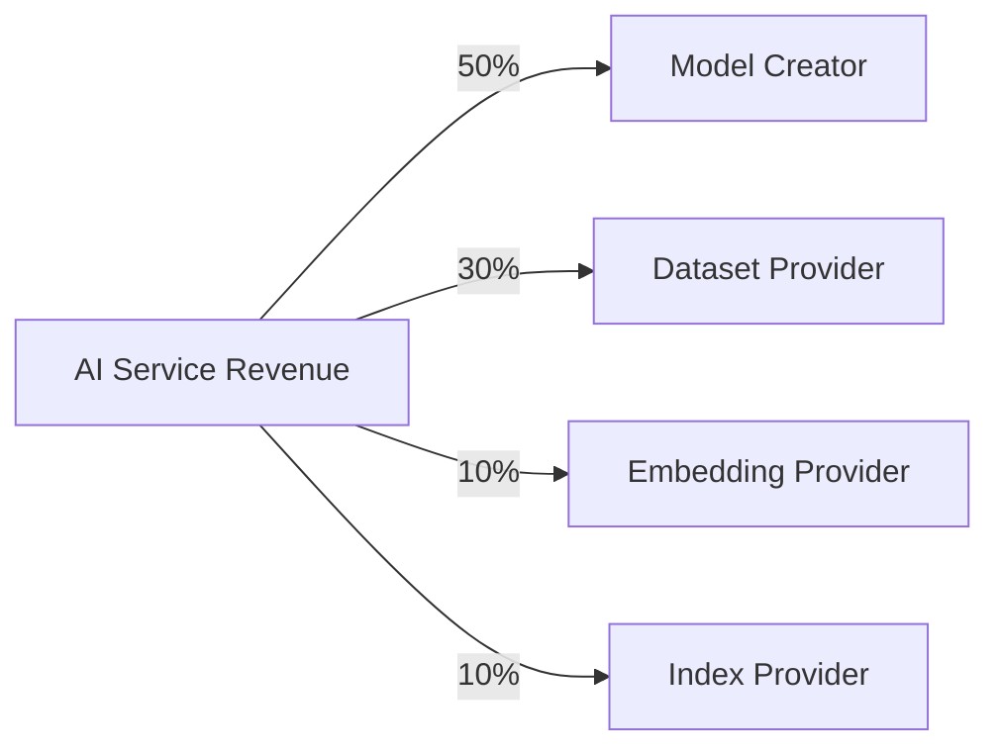

# RFC-0111: Knowledge Market & Verifiable Data Assets

## Status

Draft

## Summary

This RFC defines the **Knowledge Market** of the CipherOcto network — enabling decentralized trading of datasets, embeddings, AI memory, knowledge indexes, and real-time data feeds.

All assets are cryptographically verifiable through **dataset commitments** and **retrieval proofs**, unlocking economic value while preserving privacy and verifiability.

## Motivation

### Problem Statement

Current data marketplaces have critical flaws:

| Problem                    | Impact                                         |
| -------------------------- | ---------------------------------------------- |
| No cryptographic identity  | Datasets can be modified after listing         |
| Static licensing only      | No ongoing revenue for data providers          |
| File-based access          | Doesn't leverage query-based retrieval         |
| No AI pipeline integration | Can't prove training/inference data provenance |

### Desired State

CipherOcto should enable:

- Verifiable knowledge assets with cryptographic commitments
- Multiple access models (download, query, vector, stream)
- Query-based licensing
- Ongoing royalties for data providers
- Integration with AI pipeline proofs

## Knowledge Asset Types

The market supports multiple asset categories:

| Asset Type          | Description                 | Retrieval Interface |
| ------------------- | --------------------------- | ------------------- |
| **Dataset**         | Structured data collections | SQL queries         |
| **Embedding Index** | Vector search indexes       | ANN queries         |
| **Agent Memory**    | Curated knowledge bases     | Memory recall       |
| **Real-time Feed**  | Streaming data              | Subscriptions       |
| **Evaluation Set**  | Model benchmarks            | Benchmark queries   |

## Dataset Commitments

All datasets must publish a cryptographic commitment:

```
dataset_root = MerkleTree(dataset_chunks)
```

This root uniquely identifies the dataset.

### Metadata Structure

```json
{
  "dataset_id": "uuid",
  "dataset_root": "sha256:...",
  "schema_hash": "sha256:...",
  "chunk_count": 10000,
  "provider": "agent_id or wallet",
  "classification": "PRIVATE | CONFIDENTIAL | SHARED | PUBLIC",
  "pricing": { ... },
  "created_at": 1234567890,
  "version": 1
}
```

### Verification

Consumers can verify retrieved data against the commitment:

```
retrieved_data ∈ dataset_root
```

This integrates directly with **retrieval proofs** (RFC-0108).

## Dataset Lineage

Derived datasets record provenance:

```json
{
  "dataset_id": "uuid",
  "parent_dataset": "parent_uuid",
  "derivation_proof": "...",
  "transformation": "cleaning | embedding | training | augmentation",
  "transformation_hash": "sha256:..."
}
```

### Use Cases

- Verifiable training provenance
- Dataset attribution
- Data quality chains

## Access Models

Knowledge assets support multiple access methods:

| Model        | Description         | Integration          |
| ------------ | ------------------- | -------------------- |
| **Download** | Full dataset export | Storage providers    |
| **Query**    | SQL query access    | Retrieval gateway    |
| **Vector**   | Embedding search    | ANN search           |
| **Stream**   | Real-time feed      | Subscription service |

> ⚠️ **Key Insight**: Query-based access aligns with CipherOcto's retrieval architecture, enabling fine-grained access control.

## Pricing Models

| Model             | Description             | Use Case         |
| ----------------- | ----------------------- | ---------------- |
| **Per-query**     | Pay per access          | Experimental use |
| **Subscription**  | Periodic payment        | Ongoing access   |
| **One-time**      | Permanent license       | Dataset purchase |
| **Revenue share** | % of downstream revenue | Training data    |

### Query Royalties

Enable ongoing royalties through the supply chain:

```
Dataset Provider → Model Trainer → AI Service → Royalty Distribution
```

This creates **knowledge supply chains** with verifiable attribution.

## Data Classification

Data flags define privacy levels:

| Level            | Access          | Monetization | Execution Policy |
| ---------------- | --------------- | ------------ | ---------------- |
| **PRIVATE**      | Owner only      | None         | LOCAL            |
| **CONFIDENTIAL** | Selected agents | Premium      | TEE              |
| **SHARED**       | Verified users  | Standard     | VERIFIED         |
| **PUBLIC**       | Open            | Unrestricted | OPEN             |

## Verification Methods

Knowledge assets support several verification methods:

| Method              | Purpose                         | RFC Integration |
| ------------------- | ------------------------------- | --------------- |
| **Merkle proofs**   | Dataset integrity               | RFC-0108        |
| **Coverage proofs** | Complete query results          | RFC-0108        |
| **ZK proofs**       | Privacy-preserving verification | RFC-0108        |
| **TEE attestation** | Confidential computation        | RFC-0109        |

## Quality Signals

Dataset quality is measured using weighted signals:

| Signal       | Weight | Metric                |
| ------------ | ------ | --------------------- |
| Accuracy     | 40%    | Validation checks     |
| Freshness    | 20%    | Update frequency      |
| Completeness | 20%    | Missing data ratio    |
| Reputation   | 20%    | Provider track record |

```
QualityScore = 0.4×Accuracy + 0.2×Freshness + 0.2×Completeness + 0.2×Reputation
```

## Provider Staking

Providers must stake OCTO tokens to list assets:

| Classification | Minimum Stake |
| -------------- | ------------- |
| PUBLIC         | 100 OCTO      |
| SHARED         | 500 OCTO      |
| CONFIDENTIAL   | 1,000 OCTO    |

Stake aligns incentives and discourages fraud.

## Slashing Conditions

| Offense                     | Penalty    |
| --------------------------- | ---------- |
| Fake dataset                | 100% stake |
| Privacy violation           | 100% stake |
| Incorrect quality claims    | 50% stake  |
| Unauthorized redistribution | 75% stake  |

## Integration with AI Pipelines

AI systems using marketplace data can generate **usage proofs**:

```json
{
  "pipeline_id": "uuid",
  "dataset_root": "sha256:...",
  "retrieval_proof": { ... },
  "context_proof": { ... },
  "inference_proof": { ... },
  "attribution": {
    "dataset_id": "uuid",
    "provider": "...",
    "license_type": "revenue_share"
  }
}
```

### Revenue Attribution

When AI outputs are monetized:

1. Proof chain links output to source datasets
2. Smart contract distributes royalties
3. Providers receive ongoing revenue

## Architecture

```mermaid
graph TB
    subgraph MARKET["Knowledge Market"]
        LISTING[Asset Listing]
        DISCOVERY[Discovery]
        PRICING[Pricing Engine]
    end

    subgraph GATEWAY["Retrieval Gateway"]
        ROUTING[Query Routing]
        VERIFY[Verification]
    end

    subgraph STORAGE["Storage (OCTO-S)"]
        HOT[Hot Tier]
        COLD[Cold Tier]
        ARCHIVE[Archive Tier]
    end

    subgraph PROOFS["Proof Infrastructure"]
        MERKLE[Merkle Commitments]
        ZK[ZK Prover]
        TEE[TEE Attestation]
    end

    MARKET --> GATEWAY
    GATEWAY --> STORAGE

## The Three-Market System

> ⚠️ **Architectural Enhancement**: To capture full AI value chain, CipherOcto implements three integrated markets.

### Why Single Markets Fail

Previous Web3 data projects (Ocean, Numerai, Filecoin experiments) failed because:

```

data → sold once → buyer keeps all future value

```

**Example:**
```

dataset → model → billion-dollar AI product
Dataset creator earns once, if at all.

```

### The Three-Market Architecture

```

┌─────────────────────────────────────────────────┐
│ AI Applications │
└──────────────────────┬──────────────────────────┘
│
┌──────────────────────▼──────────────────────────┐
│ AI Production Market │
│ (training / inference / proofs) │
└──────────────────────┬──────────────────────────┘
│
┌──────────────────────▼──────────────────────────┐
│ Knowledge Market │
│ (datasets / embeddings / memory) │
└──────────────────────┬──────────────────────────┘
│
┌──────────────────────▼──────────────────────────┐
│ Retrieval Layer │
└──────────────────────┬──────────────────────────┘
│
┌──────────────────────▼──────────────────────────┐
│ Storage Market (OCTO-S) │
│ (Hot / Cold / Archive Tiers) │
└────────────────────────────────────────────────┘

```

### Layer Comparison

| Layer | Asset | Participants |
|-------|-------|--------------|
| **Storage Market** | Raw data persistence | Storage providers |
| **Knowledge Market** | Datasets, embeddings, memory | Data providers |
| **AI Production Market** | Training, inference, proofs | GPU operators, developers |

## Knowledge Lineage Graph

Knowledge assets form a **derivation graph** instead of isolated assets.

### Graph Structure

```

Dataset A (raw)
│
├──► Dataset B (cleaned)
│
├──► Embedding Index
│
└──► Model Training
│
└──► AI Service

````

### Node Structure

```json
{
  "asset_id": "uuid",
  "asset_root": "sha256:...",
  "parent_roots": ["parent1", "parent2"],
  "derivation_proof": "...",
  "transformation": "cleaning | embedding | training | inference",
  "created_at": 1234567890
}
````

### Benefits

- **Royalty propagation**: Value flows backward through lineage
- **Provenance tracking**: Every asset has verifiable origin
- **Quality signals**: Derivatives inherit parent quality scores

## Knowledge Royalty Engine

When downstream products generate revenue, royalties distribute through the lineage graph.

### Distribution Model

```
AI service revenue = 100 OCTO
```

| Asset in Lineage   | Share |
| ------------------ | ----- |
| Model creator      | 50%   |
| Dataset provider   | 30%   |
| Embedding provider | 10%   |
| Index provider     | 10%   |

### Royalty Flow



### Verification

Because CipherOcto supports **retrieval proofs**, usage is verifiable:

```json
{
  "dataset_root": "...",
  "embedding_root": "...",
  "model_hash": "...",
  "inference_proof": "...",
  "usage_verified": true
}
```

This proves the model used this dataset — royalties cannot be faked.

## Compute Market (AI Production)

The third market handles **knowledge production** — training, inference, and proof generation.

### Participants

| Role                | Function        | Earnings       |
| ------------------- | --------------- | -------------- |
| **GPU Operators**   | Model training  | Training fees  |
| **Inference Nodes** | AI inference    | Per-query fees |
| **Proving Nodes**   | ZK/STARK proofs | Proof fees     |

### Pipeline

```
Dataset
    │
    ▼
Compute Node (GPU)
    │
    ▼
Training Job
    │
    ▼
Model Artifact
    │
    ▼
Inference Node
    │
    ▼
AI Service
```

### Compute Pricing

| Service          | Pricing Model |
| ---------------- | ------------- |
| Training         | Per-epoch fee |
| Inference        | Per-token fee |
| Proof generation | Per-proof fee |

## Knowledge NFTs

> ⚠️ **Future Extension**: Knowledge assets can be tokenized as NFTs.

Each Knowledge NFT represents:

- Dataset with lineage
- Embedding index
- Trained model
- Agent memory

```json
{
  "knowledge_nft": {
    "asset_id": "uuid",
    "asset_root": "sha256:...",
    "lineage": ["parent1", "parent2"],
    "royalties": {
      "on_sale": "10%",
      "on_derivative": "5%"
    },
    "owner": "wallet_address"
  }
}
```

This enables:

- Trading knowledge assets
- Programmable royalties
- Derivative markets
  STORAGE --> PROOFS

  style MARKET fill:#6c3483
  style GATEWAY fill:#1f618d
  style STORAGE fill:#27ae60
  style PROOFS fill:#b7950b

```

## Economic Model

### Fee Distribution

| Recipient        | Share |
| ---------------- | ----- |
| Data Provider    | 70%   |
| Retrieval Node   | 15%   |
| Network Treasury | 15%   |

### Market Efficiency

The Knowledge Market becomes more valuable as:

- More high-quality datasets are listed
- Verification infrastructure matures
- AI agents require data provenance
- Royalties create sustainable economics

## Comparison: Data vs Knowledge Market

| Aspect         | Data Marketplace | Knowledge Market        |
| -------------- | ---------------- | ----------------------- |
| Asset type     | Static files     | Dynamic knowledge       |
| Access model   | Download only    | Query + vector + stream |
| Verification   | Hash only        | Merkle + ZK + coverage  |
| Pricing        | One-time         | Per-query + royalties   |
| AI integration | None             | Full proof chain        |
| Provenance     | None             | Dataset lineage         |

## Related RFCs

- RFC-0106: Deterministic Numeric Tower
- RFC-0108: Verifiable AI Retrieval
- RFC-0109: Retrieval Architecture
- RFC-0110: Verifiable Agent Memory
- RFC-0113: Retrieval Gateway & Query Routing

## Related Use Cases

- [Data Marketplace](../../docs/use-cases/data-marketplace.md)
- [Verifiable AI Agents for DeFi](../../docs/use-cases/verifiable-ai-agents-defi.md)

## Future Extensions

- Decentralized data indexing
- Automated royalty distribution
- Dataset derivative markets
- Knowledge tokenization

## Verifiable Training & Economic Security

> ⚠️ **Critical Technical Risk**: The largest risk in a decentralized AI knowledge economy is **unverifiable model usage**.

### The Core Problem: Hidden Training Data

Once a model is trained on CipherOcto data:

```

Dataset → Developer trains model → Model deployed off-chain

```

The developer can claim:

```

"I trained this myself"

```

**No cryptographic proof** links the model to the dataset. This breaks royalty distribution.

### Why This Problem Is Hard

AI training is non-deterministic and massive:

```

10^12+ operations
hundreds of GPUs
random initialization

````

Two models trained on different datasets can produce similar weights — simple hashing doesn't work.

### The Three-Layer Solution

#### Layer 1 — Deterministic Pipelines

Training runs in a deterministic environment:

```json
{
  "training_commitment": "sha256:...",
  "components": {
    "dataset_root": "sha256:...",
    "code_hash": "sha256:...",
    "hyperparams": "sha256:...",
    "seed": "sha256:..."
  }
}
````

Output is deterministic given the same inputs.

#### Layer 2 — Sampling Proofs

Instead of proving all training, prove random subsets:

```
Verifier chooses random steps → Trainer proves correctness
```

This dramatically reduces proof cost.

#### Layer 3 — Retrieval Proof Enforcement

If the model uses CipherOcto retrieval memory, each query produces:

```json
{
  "retrieval_proof": "...",
  "dataset_root": "sha256:...",
  "query_timestamp": 1234567890
}
```

This creates a **usage record** for royalty distribution.

### The Critical Insight

You don't need to prove:

```
model trained on dataset
```

You only need to prove:

```
model economically depends on dataset
```

Because royalties flow through **actual usage** — retrieval proofs.

### Dataset Spam Prevention

Once royalties exist, attackers will upload garbage to farm rewards.

**Mitigation Mechanisms:**

| Mechanism                  | Description                                          |
| -------------------------- | ---------------------------------------------------- |
| **Reputation Staking**     | Minimum stake to list (prevents spam)                |
| **Usage-Weighted Rewards** | Royalties based on actual usage, not listings        |
| **Quality Scoring**        | Weighted signals (accuracy, freshness, completeness) |
| **Challenge System**       | Anyone can challenge fake datasets                   |
| **Slashing**               | Penalties for fake data (100% stake)                 |

### The Three Pillars of Economic Security

A sustainable knowledge economy requires:

| Pillar                | Implementation                            |
| --------------------- | ----------------------------------------- |
| **Provenance**        | Lineage graph with parent roots           |
| **Usage Proofs**      | Retrieval proofs + inference verification |
| **Economic Friction** | Staking + slashing + verification markets |

### Secure Usage Flow

```
dataset_root
      ↓
training_commitment
      ↓
model_hash
      ↓
inference
      ↓
retrieval_proof
      ↓
royalty engine
      ↓
revenue distribution
```

Every step is cryptographically verifiable.

## Summary

The CipherOcto Knowledge Market enables a **decentralized economy for verifiable knowledge assets**.

By combining cryptographic commitments, retrieval proofs, and privacy controls, the market enables trustworthy data exchange for AI systems.

### The Three-Market System

```

┌─────────────────────────────────────┐
│ AI Applications │
└────────────────┬────────────────────┘
│
┌────────────────▼────────────────────┐
│ AI Production Market │
│ (training / inference / proofs) │
└────────────────┬────────────────────┘
│
┌────────────────▼────────────────────┐
│ Knowledge Market │
│ (datasets / embeddings / memory) │
└────────────────┬────────────────────┘
│
┌────────────────▼────────────────────┐
│ Storage Market (OCTO-S) │
└────────────────────────────────────┘

```

### Strategic Positioning

CipherOcto unifies four layers that other networks cover separately:

| System         | Layer Covered         |
| -------------- | --------------------- |
| Filecoin       | storage only          |
| Ocean Protocol | data marketplace only |
| Akash          | compute only          |
| Bittensor      | inference only        |
| **CipherOcto** | **all four layers**   |

This makes CipherOcto a **decentralized operating system for AI knowledge production**.

---

**Submission Date:** 2026-03-07
**Last Updated:** 2026-03-07

```

```
