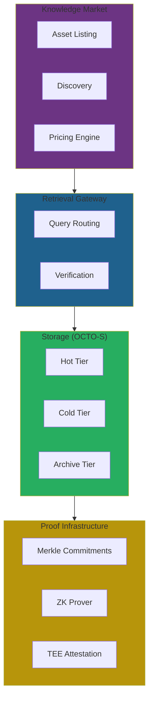

# RFC-0111: Knowledge Market & Verifiable Data Assets

## Status

Draft

## Summary

This RFC defines the **Knowledge Market** of the CipherOcto network — enabling decentralized trading of datasets, embeddings, AI memory, knowledge indexes, and real-time data feeds.

All assets are cryptographically verifiable through **dataset commitments** and **retrieval proofs**, unlocking economic value while preserving privacy and verifiability.

## Motivation

### Problem Statement

Current data marketplaces have critical flaws:

| Problem                    | Impact                                         |
| -------------------------- | ---------------------------------------------- |
| No cryptographic identity  | Datasets can be modified after listing         |
| Static licensing only      | No ongoing revenue for data providers          |
| File-based access          | Doesn't leverage query-based retrieval         |
| No AI pipeline integration | Can't prove training/inference data provenance |

### Desired State

CipherOcto should enable:

- Verifiable knowledge assets with cryptographic commitments
- Multiple access models (download, query, vector, stream)
- Query-based licensing
- Ongoing royalties for data providers
- Integration with AI pipeline proofs

## Knowledge Asset Types

The market supports multiple asset categories:

| Asset Type          | Description                 | Retrieval Interface |
| ------------------- | --------------------------- | ------------------- |
| **Dataset**         | Structured data collections | SQL queries         |
| **Embedding Index** | Vector search indexes       | ANN queries         |
| **Agent Memory**    | Curated knowledge bases     | Memory recall       |
| **Real-time Feed**  | Streaming data              | Subscriptions       |
| **Evaluation Set**  | Model benchmarks            | Benchmark queries   |

## Dataset Commitments

All datasets must publish a cryptographic commitment:

```
dataset_root = MerkleTree(dataset_chunks)
```

This root uniquely identifies the dataset.

### Metadata Structure

```json
{
  "dataset_id": "uuid",
  "dataset_root": "sha256:...",
  "schema_hash": "sha256:...",
  "chunk_count": 10000,
  "provider": "agent_id or wallet",
  "classification": "PRIVATE | CONFIDENTIAL | SHARED | PUBLIC",
  "pricing": { ... },
  "created_at": 1234567890,
  "version": 1
}
```

### Verification

Consumers can verify retrieved data against the commitment:

```
retrieved_data ∈ dataset_root
```

This integrates directly with **retrieval proofs** (RFC-0108).

## Dataset Lineage

Derived datasets record provenance:

```json
{
  "dataset_id": "uuid",
  "parent_dataset": "parent_uuid",
  "derivation_proof": "...",
  "transformation": "cleaning | embedding | training | augmentation",
  "transformation_hash": "sha256:..."
}
```

### Use Cases

- Verifiable training provenance
- Dataset attribution
- Data quality chains

## Access Models

Knowledge assets support multiple access methods:

| Model        | Description         | Integration          |
| ------------ | ------------------- | -------------------- |
| **Download** | Full dataset export | Storage providers    |
| **Query**    | SQL query access    | Retrieval gateway    |
| **Vector**   | Embedding search    | ANN search           |
| **Stream**   | Real-time feed      | Subscription service |

> ⚠️ **Key Insight**: Query-based access aligns with CipherOcto's retrieval architecture, enabling fine-grained access control.

## Pricing Models

| Model             | Description             | Use Case         |
| ----------------- | ----------------------- | ---------------- |
| **Per-query**     | Pay per access          | Experimental use |
| **Subscription**  | Periodic payment        | Ongoing access   |
| **One-time**      | Permanent license       | Dataset purchase |
| **Revenue share** | % of downstream revenue | Training data    |

### Query Royalties

Enable ongoing royalties through the supply chain:

```
Dataset Provider → Model Trainer → AI Service → Royalty Distribution
```

This creates **knowledge supply chains** with verifiable attribution.

## Data Classification

Data flags define privacy levels:

| Level            | Access          | Monetization | Execution Policy |
| ---------------- | --------------- | ------------ | ---------------- |
| **PRIVATE**      | Owner only      | None         | LOCAL            |
| **CONFIDENTIAL** | Selected agents | Premium      | TEE              |
| **SHARED**       | Verified users  | Standard     | VERIFIED         |
| **PUBLIC**       | Open            | Unrestricted | OPEN             |

## Verification Methods

Knowledge assets support several verification methods:

| Method              | Purpose                         | RFC Integration |
| ------------------- | ------------------------------- | --------------- |
| **Merkle proofs**   | Dataset integrity               | RFC-0108        |
| **Coverage proofs** | Complete query results          | RFC-0108        |
| **ZK proofs**       | Privacy-preserving verification | RFC-0108        |
| **TEE attestation** | Confidential computation        | RFC-0109        |

## Quality Signals

Dataset quality is measured using weighted signals:

| Signal       | Weight | Metric                |
| ------------ | ------ | --------------------- |
| Accuracy     | 40%    | Validation checks     |
| Freshness    | 20%    | Update frequency      |
| Completeness | 20%    | Missing data ratio    |
| Reputation   | 20%    | Provider track record |

```
QualityScore = 0.4×Accuracy + 0.2×Freshness + 0.2×Completeness + 0.2×Reputation
```

## Provider Staking

Providers must stake OCTO tokens to list assets:

| Classification | Minimum Stake |
| -------------- | ------------- |
| PUBLIC         | 100 OCTO      |
| SHARED         | 500 OCTO      |
| CONFIDENTIAL   | 1,000 OCTO    |

Stake aligns incentives and discourages fraud.

## Slashing Conditions

| Offense                     | Penalty    |
| --------------------------- | ---------- |
| Fake dataset                | 100% stake |
| Privacy violation           | 100% stake |
| Incorrect quality claims    | 50% stake  |
| Unauthorized redistribution | 75% stake  |

## Integration with AI Pipelines

AI systems using marketplace data can generate **usage proofs**:

```json
{
  "pipeline_id": "uuid",
  "dataset_root": "sha256:...",
  "retrieval_proof": { ... },
  "context_proof": { ... },
  "inference_proof": { ... },
  "attribution": {
    "dataset_id": "uuid",
    "provider": "...",
    "license_type": "revenue_share"
  }
}
```

### Revenue Attribution

When AI outputs are monetized:

1. Proof chain links output to source datasets
2. Smart contract distributes royalties
3. Providers receive ongoing revenue

## Architecture



## Economic Model

### Fee Distribution

| Recipient        | Share |
| ---------------- | ----- |
| Data Provider    | 70%   |
| Retrieval Node   | 15%   |
| Network Treasury | 15%   |

### Market Efficiency

The Knowledge Market becomes more valuable as:

- More high-quality datasets are listed
- Verification infrastructure matures
- AI agents require data provenance
- Royalties create sustainable economics

## Comparison: Data vs Knowledge Market

| Aspect         | Data Marketplace | Knowledge Market        |
| -------------- | ---------------- | ----------------------- |
| Asset type     | Static files     | Dynamic knowledge       |
| Access model   | Download only    | Query + vector + stream |
| Verification   | Hash only        | Merkle + ZK + coverage  |
| Pricing        | One-time         | Per-query + royalties   |
| AI integration | None             | Full proof chain        |
| Provenance     | None             | Dataset lineage         |

## Related RFCs

- RFC-0106: Deterministic Numeric Tower
- RFC-0108: Verifiable AI Retrieval
- RFC-0109: Retrieval Architecture
- RFC-0110: Verifiable Agent Memory
- RFC-0113: Retrieval Gateway & Query Routing

## Related Use Cases

- [Data Marketplace](../../docs/use-cases/data-marketplace.md)
- [Verifiable AI Agents for DeFi](../../docs/use-cases/verifiable-ai-agents-defi.md)

## Future Extensions

- Decentralized data indexing
- Automated royalty distribution
- Dataset derivative markets
- Knowledge tokenization

## Summary

The CipherOcto Knowledge Market enables a **decentralized economy for verifiable knowledge assets**.

By combining cryptographic commitments, retrieval proofs, and privacy controls, the market enables trustworthy data exchange for AI systems.

```
Data Providers
       ↓
Knowledge Market
       ↓
AI Agents
       ↓
Verifiable Outputs
```

This positions CipherOcto as a **Verifiable Knowledge Economy** — integrating storage, retrieval, proofs, AI pipelines, and data markets into a single architecture.

---

**Submission Date:** 2026-03-07
**Last Updated:** 2026-03-07
