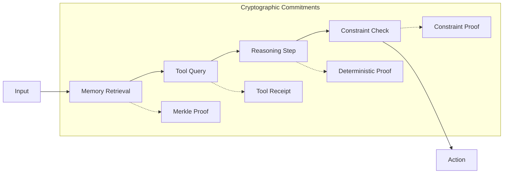

# RFC-0114: Verifiable Reasoning Traces

## Status

Draft

## Summary

This RFC defines **Verifiable Reasoning Traces** — a system that transforms opaque AI reasoning into cryptographically auditable execution graphs.

Every agent decision becomes a traceable, verifiable object containing:

- Step-by-step reasoning structure
- Input/output commitments for each step
- Hash chain linking steps
- Optional STARK proofs

This enables **auditable autonomous agents** for finance, science, governance, and infrastructure.

## Design Goals

| Goal                       | Target                               | Metric               |
| -------------------------- | ------------------------------------ | -------------------- |
| **G1: Trace Completeness** | Every decision has full trace        | 100% coverage        |
| **G2: Tamper Evidence**    | Any change detected                  | Hash chain integrity |
| **G3: Step Verification**  | Each step independently verifiable   | Proof availability   |
| **G4: Privacy**            | ZK proofs for confidential reasoning | Optional disclosure  |

## Motivation

### The Problem: Non-Auditable AI Decisions

Typical agent pipeline:

```
input → LLM → decision → action
```

After the fact, we only see:

```
decision
```

We cannot verify:

```
reasoning path
memory usage
tool calls
policy compliance
```

This creates serious risks:

- Financial fraud
- Autonomous system failure
- AI manipulation
- Regulatory violations

## Specification

### Reasoning Trace Structure

```json
{
  "trace_id": "trace_abc123",
  "agent_id": "agent_defi_trader",
  "input_hash": "sha256:...",
  "steps": [
    {
      "step_id": 0,
      "step_type": "RETRIEVAL",
      "input_commitment": "merkle:...",
      "output_commitment": "merkle:...",
      "code_hash": "sha256:...",
      "proof": null
    }
  ],
  "output_hash": "sha256:...",
  "trace_hash": "sha256:..."
}
```

### Step Types

| Step Type      | Description                    | Proof Method             |
| -------------- | ------------------------------ | ------------------------ |
| **RETRIEVAL**  | Memory/dataset/document fetch  | Merkle inclusion         |
| **INFERENCE**  | LLM or model reasoning         | Deterministic proof      |
| **TOOL_CALL**  | API, DB, simulation            | Signed receipt           |
| **CONSTRAINT** | Policy/budget/compliance check | Deterministic evaluation |

### The Trace Hash Chain

Each step links to the previous:

```rust
fn compute_step_hash(
    step_type: StepType,
    input_commitment: FieldElement,
    output_commitment: FieldElement,
    previous_hash: FieldElement
) -> FieldElement {
    blake3::hash(&[
        step_type.as_bytes(),
        &input_commitment.to_bytes(),
        &output_commitment.to_bytes(),
        &previous_hash
    ])
}
```

This forms a **tamper-proof chain**. If any step changes, the trace_hash changes.

### Step-by-Step Execution



### Verifiable Reasoning with STARKs

For higher assurance, the reasoning graph produces a proof:

```rust
struct ReasoningProof {
    // The trace executed correctly
    trace_commitment: FieldElement,

    // The reasoning program was followed
    program_hash: FieldElement,

    // STARK proof
    proof: StarkProof,
}
```

This proves:

- The agent followed the declared reasoning program
- All constraints were satisfied
- The output derives correctly from inputs

Useful for:

- Regulated environments
- Confidential strategies
- High-value decisions

## Performance Targets

| Metric                  | Target | Notes           |
| ----------------------- | ------ | --------------- |
| Trace generation        | <100ms | Per decision    |
| Step commitment         | <10ms  | Per step        |
| Hash chain verification | <5ms   | Per step        |
| STARK proof             | <60s   | Optional, async |

## CipherOcto Integration

### Knowledge Asset Connection

Reasoning traces connect to the knowledge lineage graph:

```json
{
  "trace_commitment": "blake3:...",
  "agent_id": "sha256:...",
  "input_hash": "sha256:...",
  "step_root": "merkle:...",
  "output_hash": "sha256:...",
  "lineage": {
    "memory_references": [...],
    "dataset_references": [...],
    "model_references": [...]
  }
}
```

### Integration Points

| Component                       | Integration                |
| ------------------------------- | -------------------------- |
| RFC-0110 (Agent Memory)         | Traces store in memory DAG |
| RFC-0111 (Knowledge Market)     | Traces as licensed assets  |
| RFC-0108 (Verifiable Retrieval) | Retrieval steps verified   |
| RFC-0106 (Numeric Tower)        | Deterministic computation  |

## Example: Autonomous Trading Agent

```
┌─────────────────────────────────────────────────────────┐
│                  Trading Decision Trace                  │
├─────────────────────────────────────────────────────────┤
│ Step 0: RETRIEVAL                                      │
│   Input: trading_query                                 │
│   Output: market_data (Merkleroot: abc123)            │
├─────────────────────────────────────────────────────────┤
│ Step 1: RETRIEVAL                                      │
│   Input: portfolio_state                                │
│   Output: current_positions (Merkleroot: def456)       │
├─────────────────────────────────────────────────────────┤
│ Step 2: INFERENCE                                      │
│   Input: market_data + positions                       │
│   Output: risk_assessment (hash: ghi789)              │
├─────────────────────────────────────────────────────────┤
│ Step 3: CONSTRAINT                                     │
│   Input: risk_assessment                               │
│   Check: max_drawdown < 10%                            │
│   Output: constraint_satisfied (hash: jkl012)          │
├─────────────────────────────────────────────────────────┤
│ Step 4: TOOL_CALL                                      │
│   Input: trade_command                                 │
│   Output: execution_receipt (signature: xyz)           │
└─────────────────────────────────────────────────────────┘
```

The trace proves:

- The decision respected risk limits
- The agent used correct market data
- The strategy executed correctly

## Example: Scientific Discovery Agent

```
Research Pipeline Trace:
  │
  ├─► Step 0: RETRIEVAL
  │      Retrieve: research_papers (n=50)
  │      Output: paper_embeddings
  │
  ├─► Step 1: INFERENCE
  │      Model: hypothesis_extractor
  │      Output: hypotheses (n=5)
  │
  ├─► Step 2: TOOL_CALL
  │      Tool: simulation_engine
  │      Input: hypothesis_1
  │      Output: simulation_results
  │
  └─► Step 3: INFERENCE
         Model: conclusion_generator
         Output: verified_conclusion
```

The trace proves:

- The hypothesis derived from specific sources
- The simulation used declared parameters
- The results computed correctly

## Privacy-Preserving Reasoning

For confidential reasoning, use ZK proofs:

```json
{
  "encrypted_trace": "...",
  "commitment": "sha256:...",
  "zk_proof": {
    "statement": "risk_limits_obeyed",
    "proof": "snark:...",
    "public_inputs": ["max_drawdown", "position_size"]
  }
}
```

This proves reasoning validity without revealing the reasoning itself.

## The Full CipherOcto Cognitive Stack

```
┌─────────────────────────────────────────┐
│        Autonomous Agents                  │
│           (Verifiable Reasoning)         │
├─────────────────────────────────────────┤
│        Agent Memory Layer                │
│           (RFC-0110)                     │
├─────────────────────────────────────────┤
│        Knowledge Graph                    │
│           (RFC-0111)                     │
├─────────────────────────────────────────┤
│        AI Production Market              │
├─────────────────────────────────────────┤
│        Storage Network                   │
└─────────────────────────────────────────┘
```

Each layer adds:

- Verifiability
- Ownership
- Economic incentives

## Economic Value of Reasoning Traces

Reasoning traces become **valuable knowledge assets**:

| Asset Type              | Value  | Example                |
| ----------------------- | ------ | ---------------------- |
| Trading strategies      | High   | Execution traces       |
| Scientific insights     | High   | Research pipelines     |
| Optimization heuristics | Medium | Problem-solving traces |

### Lineage with Royalties

```
dataset
   ↓
model
   ↓
agent reasoning
   ↓
decision strategy
```

Royalties propagate backward through the lineage.

## Adversarial Review

| Threat                | Impact | Mitigation                 |
| --------------------- | ------ | -------------------------- |
| **Trace Fabrication** | High   | Hash chain integrity       |
| **Step Reordering**   | High   | Sequential hash binding    |
| **Constraint Bypass** | High   | Independent proof per step |
| **Privacy Leakage**   | Medium | ZK proofs optional         |

## Alternatives Considered

| Approach           | Pros         | Cons                      |
| ------------------ | ------------ | ------------------------- |
| **Text logs only** | Simple       | No verification           |
| **ZK-only**        | Full privacy | Expensive                 |
| **This approach**  | Tunable      | Implementation complexity |

## Key Files to Modify

| File                            | Change             |
| ------------------------------- | ------------------ |
| src/agent/reasoning/trace.rs    | Trace structure    |
| src/agent/reasoning/prover.rs   | Proof generation   |
| src/agent/reasoning/verifier.rs | Trace verification |
| src/crypto/commitment.rs        | Step commitments   |

## Future Work

- F1: Hierarchical trace aggregation
- F2: Cross-agent trace sharing
- F3: Automated compliance reporting

## Related RFCs

- RFC-0106: Deterministic Numeric Tower
- RFC-0108: Verifiable AI Retrieval
- RFC-0110: Verifiable Agent Memory
- RFC-0111: Knowledge Market & Verifiable Data Assets
- RFC-0116: Unified Deterministic Execution Model
- RFC-0117: State Virtualization for Massive Agent Scaling
- RFC-0118: Autonomous Agent Organizations
- RFC-0119: Alignment & Control Mechanisms

## Related Use Cases

- [Verifiable AI Agents for DeFi](../../docs/use-cases/verifiable-ai-agents-defi.md)
- [Verifiable Agent Memory Layer](../../docs/use-cases/verifiable-agent-memory-layer.md)

---

**Version:** 1.0
**Submission Date:** 2026-03-07
**Last Updated:** 2026-03-07
