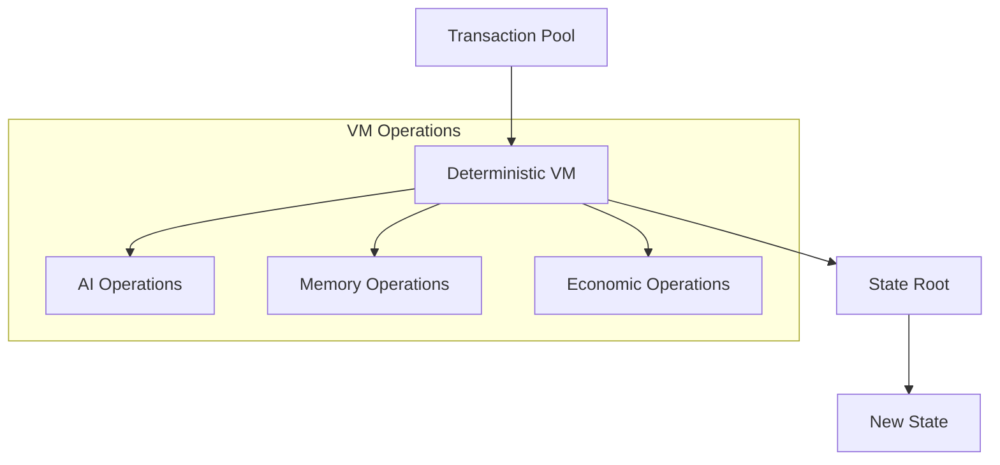

# RFC-0116: Unified Deterministic Execution Model

## Status

Draft

## Summary

This RFC defines a **Unified Deterministic Execution Model** — reducing every AI operation to a verifiable state transition.

The key insight: instead of building many specialized subsystems, the entire platform treats **every operation as a deterministic state transition over committed data**.

This is the same abstraction used by Ethereum/Solana, applied to AI computation and knowledge production.

## Design Goals

| Goal                  | Target                       | Metric                     |
| --------------------- | ---------------------------- | -------------------------- |
| **G1: Unification**   | All ops as state transitions | Single execution model     |
| **G2: Determinism**   | Reproducible execution       | Cross-node agreement       |
| **G3: Verifiability** | Every transition verifiable  | Merkle state root          |
| **G4: Scalability**   | Parallel execution           | Independent ops concurrent |

## Motivation

### The Problem: Complex Subsystems

Without unification, the platform needs separate systems for:

```
storage network
compute network
knowledge graph
agent memory
verification layer
```

This creates integration complexity and coordination overhead.

### The Solution: Universal Primitive

Every operation becomes:

```
(previous_state, input) → deterministic_program → new_state
```

If the program is deterministic and inputs are committed, the result is verifiable.

## Specification

### State Commitment

All system state is represented by a **Merkle root**:

```rust
struct StateRoot {
    // Merkle root of all state objects
    root: FieldElement,

    // State objects include:
    // - datasets
    // - models
    // - agent memories
    // - reasoning traces
    // - economic balances
}
```

Each block/epoch updates the root.

### State Transition Function

```rust
fn state_transition(
    previous_state: StateRoot,
    tx_batch: Vec<Transaction>
) -> StateRoot {
    let mut state = load_state(previous_state);

    for tx in tx_batch {
        state = execute(state, tx);
    }

    compute_merkle_root(state)
}
```

### Transaction Types

All AI operations become transactions:

| Transaction         | Description                   |
| ------------------- | ----------------------------- |
| `STORE_DATASET`     | Store dataset with commitment |
| `TRAIN_MODEL`       | Execute training step         |
| `RUN_INFERENCE`     | Run model inference           |
| `UPDATE_MEMORY`     | Update agent memory           |
| `EXECUTE_REASONING` | Execute reasoning trace       |
| `VECTOR_SEARCH`     | Perform vector search         |

### Unified Object Model

Everything is an **object with hash identity**:

```json
{
  "id": "sha256:abc123",
  "type": "dataset|model|memory|trace",
  "owner": "address",
  "metadata": {...},
  "content": "..."
}
```

This creates a **global knowledge graph** automatically.

### Execution Traces

Every execution produces a trace:

```rust
struct ExecutionTrace {
    steps: Vec<TraceStep>,
    trace_root: FieldElement,
}

struct TraceStep {
    operation: Operation,
    input_commitment: FieldElement,
    output_commitment: FieldElement,
}
```

This trace is what verification markets challenge.

### Universal Execution Engine



Operations supported:

```
VECTOR_SEARCH
MODEL_INFERENCE
TRAINING_STEP
STORE_MEMORY
VERIFY_PROOF
```

## Why Determinism Solves Many Problems

### Floating-Point Issue

In this architecture, the execution environment is a **deterministic VM**:

```
execution environment = deterministic VM
```

Operations use:

- Fixed-point arithmetic (from RFC-0106)
- Deterministic GPU kernels
- Reproducible compute traces

Every node computing the same operation produces the same result.

### Verification Simplification

Verifiers don't need to check everything.

They only verify:

```
selected state transitions
```

The probability of undetected fraud remains extremely small (from RFC-0115).

## Minimal Core Protocol

The core protocol needs only:

| Component               | Purpose                   |
| ----------------------- | ------------------------- |
| **Object Store**        | Content-addressed storage |
| **Deterministic VM**    | State transition engine   |
| **Merkle Commitments**  | State verification        |
| **Verification Market** | Economic security         |
| **Economic Incentives** | Stake/rewards             |

Everything else becomes a **smart program**.

## Example: Agent Reasoning as Transaction

```json
{
  "type": "EXECUTE_REASONING",
  "payload": {
    "agent_id": "agent_123",
    "input_hash": "sha256:...",
    "memory_refs": ["mem_a", "mem_b"],
    "model_ref": "model_x",
    "tool_refs": ["tool_y"]
  }
}
```

The VM performs:

1. Memory retrieval
2. Model inference
3. Tool execution
4. Result storage

Then updates state.

## Example: Training Step

```json
{
  "type": "TRAIN_STEP",
  "payload": {
    "model_id": "model_abc",
    "dataset_batch": "batch_xyz",
    "optimizer_state": "opt_state"
  }
}
```

Each step updates:

- Model weights
- Training metadata
- Proof commitments

## Storage and Knowledge Unification

Datasets, models, and reasoning traces are all stored the same way:

```
content-addressed objects
```

Similar to IPFS or Git, but extended to AI computation.

## Parallelization

Because operations are independent objects, execution can be massively parallel:

```
dataset updates ─┐
model training  ─┼─→ concurrent execution
agent reasoning  ─┤
memory writes   ─┘
```

All can run simultaneously as long as they don't touch the same objects.

## Integration with CipherOcto Stack

```
┌─────────────────────────────────────────┐
│         Agents / Applications              │
├─────────────────────────────────────────┤
│            AI Programs                     │
├─────────────────────────────────────────┤
│       Deterministic Execution VM           │
├─────────────────────────────────────────┤
│        State Commitment Layer              │
├─────────────────────────────────────────┤
│        Storage + Compute Providers         │
└─────────────────────────────────────────┘
```

### Integration Points

| RFC      | Integration                 |
| -------- | --------------------------- |
| RFC-0106 | Deterministic numeric tower |
| RFC-0107 | Vector-SQL storage          |
| RFC-0108 | Verifiable retrieval        |
| RFC-0110 | Agent memory                |
| RFC-0114 | Reasoning traces            |
| RFC-0115 | Verification markets        |

## Performance Targets

| Metric         | Target | Notes                 |
| -------------- | ------ | --------------------- |
| State update   | <100ms | Per transaction batch |
| Merkle compute | <10ms  | For 1M objects        |
| VM execution   | <50ms  | Per operation         |
| Parallel ops   | >10k/s | Concurrent execution  |

## Adversarial Review

| Threat               | Impact | Mitigation              |
| -------------------- | ------ | ----------------------- |
| **VM Manipulation**  | High   | Deterministic execution |
| **State Replay**     | Medium | Sequence numbers        |
| **Object Collision** | Low    | Hash commitment         |

## Alternatives Considered

| Approach              | Pros               | Cons                   |
| --------------------- | ------------------ | ---------------------- |
| **Separate services** | Specialized        | Integration complexity |
| **Monolithic**        | Simple             | Scaling limits         |
| **This approach**     | Unified + scalable | Implementation scope   |

## Key Files to Modify

| File                | Change                |
| ------------------- | --------------------- |
| src/vm/mod.rs       | Deterministic VM core |
| src/state/mod.rs    | State management      |
| src/state/merkle.rs | Merkle commitment     |
| src/tx/mod.rs       | Transaction types     |

## Future Work

- F1: Formal verification of VM
- F2: Hardware acceleration
- F3: Cross-chain state bridges

## Related RFCs

- RFC-0106: Deterministic Numeric Tower
- RFC-0107: Production Vector-SQL Storage
- RFC-0108: Verifiable AI Retrieval
- RFC-0110: Verifiable Agent Memory
- RFC-0114: Verifiable Reasoning Traces
- RFC-0115: Probabilistic Verification Markets
- RFC-0117: State Virtualization for Massive Agent Scaling
- RFC-0118: Autonomous Agent Organizations
- RFC-0119: Alignment & Control Mechanisms

## Related Use Cases

- [Verifiable Reasoning Traces](../../docs/use-cases/verifiable-reasoning-traces.md)
- [Probabilistic Verification Markets](../../docs/use-cases/probabilistic-verification-markets.md)

---

**Version:** 1.0
**Submission Date:** 2026-03-07
**Last Updated:** 2026-03-07
