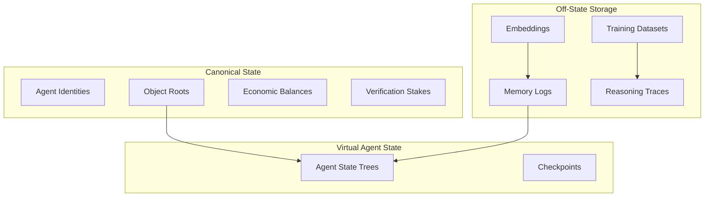

# RFC-0117 (AI Execution): State Virtualization for Massive Agent Scaling

## Status

Draft

> **Note:** This RFC was originally numbered RFC-0117 under the legacy numbering system. It remains at 0117 as it belongs to the AI Execution category.

## Summary

This RFC defines **State Virtualization** — a mechanism that enables the platform to host millions of autonomous agents without state explosion.

The key insight: most agent state must exist **off the canonical state while remaining cryptographically verifiable**. Only minimum commitments (Merkle roots) stay on-chain.

## Design Goals

| Goal                         | Target                         | Metric                |
| ---------------------------- | ------------------------------ | --------------------- |
| **G1: Canonical Minimalism** | Keep only commitments on-chain | <10GB canonical state |
| **G2: State Scaling**        | Support millions of agents     | >1M agents            |
| **G3: Verification**         | All off-state verifiable       | 100% provable         |
| **G4: Storage Efficiency**   | Deduplicate shared knowledge   | >90% reduction        |

## Motivation

### The Problem: State Explosion

A system hosting millions of agents faces state explosion:

```
1M agents
× 1,000 memories/day
× 365 days
= 365 billion memory objects per year
```

A naive blockchain-style state model collapses under that load.

### The Solution: Layered State Virtualization

Separate state into layers:

```
Canonical State (minimal)
      │
Derived State
      │
Ephemeral Agent State
```

Only critical commitments remain in canonical layer.

## Specification

### Layered State Architecture



### Canonical State (Minimal Layer)

Only stores **critical commitments**:

| Object              | Description                     |
| ------------------- | ------------------------------- |
| Agent identities    | Public keys, registration       |
| Object roots        | Merkle roots of datasets/models |
| Economic balances   | Token holdings                  |
| Verification stakes | Provider collateral             |

Each large dataset or memory collection is represented by a **Merkle root**:

```json
{
  "memory_root_agent_A": "sha256:abc123",
  "dataset_root_X": "sha256:def456",
  "model_root_Y": "sha256:ghi789"
}
```

### Off-State Object Stores

Actual data lives in distributed storage:

| Storage Type      | Content                          |
| ----------------- | -------------------------------- |
| Memory logs       | Agent episodic/semantic memories |
| Training datasets | Training batches                 |
| Reasoning traces  | Decision traces                  |
| Embeddings        | Vector representations           |

Referenced via content hash + Merkle proofs.

### Virtual Agent State

Each agent maintains its own **local state tree**:

```json
{
  "agent_state_tree": {
    "episodic_memories": "root_1",
    "semantic_knowledge": "root_2",
    "skill_library": "root_3",
    "embeddings": "root_4",
    "strategy_models": "root_5"
  }
}
```

The root is periodically committed to canonical state.

### State Checkpoints

Agents publish periodic checkpoints:

```json
{
  "checkpoint": {
    "agent_id": "agent_123",
    "state_root_t0": "sha256:...",
    "state_root_t1": "sha256:...",
    "state_root_t2": "sha256:...",
    "timestamp": 1234567890,
    "proof": "optional_zk_proof"
  }
}
```

Verification markets can challenge transitions between checkpoints.

### Stateless Execution

The execution engine does **not need full state**. Transactions provide **state witnesses**:

```json
{
  "type": "UPDATE_MEMORY",
  "payload": {
    "agent_id": "agent_123",
    "previous_memory_root": "sha256:...",
    "memory_object": {...},
    "merkle_proof": [...]
  }
}
```

Nodes verify:

```
proof → valid
update → new_root
```

No node must store all memories.

### Memory Compaction

Agents compress old memory into summaries:

```
raw memory
   ↓
clustered memory
   ↓
summarized knowledge
   ↓
knowledge graph node
```

Older layers can be pruned. Only summary commitments remain.

### Temporal State Layers

Agent state partitioned by time:

| Layer          | Storage      | Access    |
| -------------- | ------------ | --------- |
| Current state  | Fast storage | Immediate |
| Recent history | Standard     | <1s       |
| Archival       | Cold storage | On-demand |

### Shared Knowledge Deduplication

Many agents reference identical knowledge:

```
popular dataset
common models
shared research papers
```

Instead of duplicating, agents reference shared hashes:

```json
{
  "knowledge_ref": "sha256:popular_dataset"
}
```

This dramatically reduces global state growth.

### Lazy State Reconstruction

Nodes reconstruct state **only when needed**:

```
1. Agent requests memory
2. Node fetches memory objects
3. Verify proofs
4. Rebuild local state
```

After execution, reconstructed state can be discarded.

### Execution Sharding

Agent workloads partitioned across shards:

```
Shard A: agents 1–100k
Shard B: agents 100k–200k
Shard C: agents 200k–300k
```

Each shard maintains its own execution state. Only global commitments synchronize.

### Knowledge Graph Compression

Global knowledge graph compressed:

Instead of storing every relation, store edge commitments:

```json
{
  "edge_root": "merkle:edges"
}
```

Edges remain off-chain.

## Scalability Results

With these techniques:

| Metric              | Target   |
| ------------------- | -------- |
| Supported agents    | >1M      |
| Memory objects      | >1B      |
| Canonical state     | <10GB    |
| Off-chain knowledge | Exabytes |

## Integration with CipherOcto Stack

```
┌─────────────────────────────────────────┐
│         Autonomous Agents                      │
├─────────────────────────────────────────┤
│         Virtual Agent State                    │
├─────────────────────────────────────────┤
│         Off-Chain Knowledge Storage           │
├─────────────────────────────────────────┤
│         Deterministic Execution Engine        │
├─────────────────────────────────────────┤
│         Verification Markets                 │
├─────────────────────────────────────────┤
│         Canonical Commitment Layer            │
└─────────────────────────────────────────┘
```

The blockchain-like layer only stores **roots and commitments**.

### Integration Points

| RFC      | Integration                     |
| -------- | ------------------------------- |
| RFC-0110 | Agent memory as virtual state   |
| RFC-0114 | Reasoning traces as checkpoints |
| RFC-0115 | Challenge verification          |
| RFC-0116 | State transition function       |

## Performance Targets

| Metric               | Target | Notes            |
| -------------------- | ------ | ---------------- |
| Checkpoint frequency | 1/hour | Per agent        |
| State witness size   | <1KB   | Per transaction  |
| Reconstruction time  | <100ms | Lazy loading     |
| Deduplication ratio  | >90%   | Shared knowledge |

## Adversarial Review

| Threat                 | Impact | Mitigation                     |
| ---------------------- | ------ | ------------------------------ |
| **State Forgery**      | High   | Merkle proof verification      |
| **Checkpoint Fraud**   | High   | Verification market challenges |
| **Storage Censorship** | Medium | Redundant storage providers    |
| **State Replay**       | Medium | Sequence numbers               |

## Alternatives Considered

| Approach                | Pros              | Cons                 |
| ----------------------- | ----------------- | -------------------- |
| **Full on-chain state** | Simple            | Does not scale       |
| **Stateless clients**   | Scalable          | Complexity           |
| **This approach**       | Hybrid + scalable | Implementation scope |

## Key Files to Modify

| File                    | Change                   |
| ----------------------- | ------------------------ |
| src/state/virtual.rs    | Virtual state management |
| src/state/checkpoint.rs | Checkpoint logic         |
| src/state/merkle.rs     | Merkle commitment        |
| src/storage/sharding.rs | Storage sharding         |

## Future Work

- F1: Cross-shard state synchronization
- F2: Hierarchical checkpoint aggregation
- F3: Automatic memory compaction

## Related RFCs

- RFC-0110: Verifiable Agent Memory
- RFC-0114: Verifiable Reasoning Traces
- RFC-0115: Probabilistic Verification Markets
- RFC-0116: Unified Deterministic Execution Model
- RFC-0118: Autonomous Agent Organizations
- RFC-0119: Alignment & Control Mechanisms

## Related Use Cases

- [Verifiable Reasoning Traces](../../docs/use-cases/verifiable-reasoning-traces.md)
- [Verifiable Agent Memory Layer](../../docs/use-cases/verifiable-agent-memory-layer.md)

---

**Version:** 1.0
**Submission Date:** 2026-03-07
**Last Updated:** 2026-03-07
