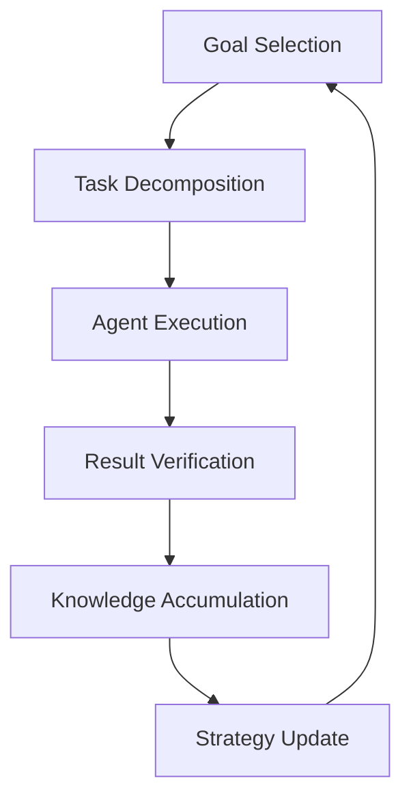

# RFC-0118: Autonomous Agent Organizations

## Status

Draft

## Summary

This RFC defines **Autonomous Agent Organizations** — entities composed primarily of AI agents that control assets, produce knowledge, and make decisions within the CipherOcto infrastructure.

These are **agent-native firms**: they own memory, models, capital, and governance logic. They operate programmatically without human intervention for day-to-day decisions.

## Design Goals

| Goal                            | Target                           | Metric             |
| ------------------------------- | -------------------------------- | ------------------ |
| **G1: Organizational Identity** | Cryptographic org identity       | Address derivation |
| **G2: Treasury Management**     | Autonomous capital control       | Token holdings     |
| **G3: Knowledge Accumulation**  | Persistent knowledge assets      | Lineage tracking   |
| **G4: Governance**              | Deterministic policy enforcement | Rule compliance    |

## Motivation

### Why Agent Organizations?

Current organizations are human-centric. They have:

- Employees (humans)
- Bank accounts
- Knowledge stored in humans
- Decision-making by committee

Future organizations can be **agent-centric**:

- Workers = AI agents
- Capital = Token treasury
- Knowledge = Verifiable memory traces
- Decisions = Reasoning traces

### Why This Matters for CipherOcto

1. **New economic entities** — Autonomous organizations as market participants
2. **Knowledge compounding** — Organizations accumulate intelligence
3. **Massive coordination** — Internal markets for task allocation
4. **AI-native firms** — Institutions built for machine intelligence

## Specification

### Organizational Structure

```json
{
  "organization": {
    "org_id": "sha256:...",
    "treasury": "address",
    "agents": ["agent_1", "agent_2", ...],
    "knowledge_assets": ["dataset_1", "model_1", ...],
    "governance_rules": "policy_hash",
    "operational_programs": "program_roots"
  }
}
```

### Identity Module

Cryptographic identity for the organization:

```rust
struct OrganizationIdentity {
    // Derive from public key and creation block
    org_id: FieldElement,
    public_key: PublicKey,
    creation_block: u64,
    // Can sign transactions and own assets
}
```

### Treasury Module

The treasury manages capital:

| Asset Type          | Description        |
| ------------------- | ------------------ |
| Tokens              | OCTO, role tokens  |
| Compute credits     | AI inference quota |
| Storage allocations | Persistent memory  |
| Dataset licenses    | Knowledge access   |

Agents request funding from treasury to perform tasks.

### Knowledge Assets Module

Organizations accumulate knowledge:

```
datasets
trained models
reasoning traces
research results
agent memory archives
```

Each asset has hash identity and lineage in knowledge graph.

### Agent Workforce Module

Agents specialize in tasks:

| Role       | Function                           |
| ---------- | ---------------------------------- |
| Research   | Data collection, literature review |
| Training   | Model training, fine-tuning        |
| Analysis   | Data processing, insights          |
| Operations | Task coordination                  |
| Governance | Decision approval                  |

### Governance Module

Deterministic policy enforcement:

```json
{
  "policies": {
    "budget_limit": 1000,
    "risk_threshold": 0.1,
    "task_approval": "majority_vote",
    "strategy_update": "board_approval"
  }
}
```

### Operating Loop

The organization executes continuously:



Every step produces verifiable reasoning traces.

## Example: Autonomous Research Organization

### Pipeline

```
literature retrieval
      ↓
hypothesis generation
      ↓
simulation experiments
      ↓
result analysis
      ↓
publication / model release
```

### Revenue Sources

- Dataset licensing
- Model API access
- Research services
- Knowledge asset sales

## Example: Autonomous Trading Firm

### Structure

```
market data agents
strategy agents
risk agents
execution agents
audit agents
```

### Decision Pipeline

```
data ingestion
      ↓
signal generation
      ↓
risk evaluation
      ↓
trade execution
      ↓
performance analysis
```

All steps produce verifiable traces.

## Internal Market Mechanisms

To scale coordination, organizations run internal markets:

| Market              | Function                      |
| ------------------- | ----------------------------- |
| Task marketplace    | Agents bid for tasks          |
| Compute auctions    | Allocate processing resources |
| Knowledge licensing | Internal knowledge sharing    |

## Security Controls

| Control               | Purpose                         |
| --------------------- | ------------------------------- |
| Budget limits         | Prevent unlimited spending      |
| Risk models           | Evaluate decision risk          |
| Verification markets  | Challenge incorrect outputs     |
| Multi-agent consensus | Require multiple agent approval |
| Human override keys   | Emergency human intervention    |

## Integration with CipherOcto Stack

```
┌─────────────────────────────────────────┐
│         Agent Organizations                      │
├─────────────────────────────────────────┤
│         Autonomous Agents                      │
├─────────────────────────────────────────┤
│         Verifiable Reasoning Layer            │
├─────────────────────────────────────────┤
│         Agent Memory + Knowledge Graph        │
├─────────────────────────────────────────┤
│         Deterministic Execution Engine        │
├─────────────────────────────────────────┤
│         Verification Markets                  │
├─────────────────────────────────────────┤
│         Canonical Commitment Layer            │
└─────────────────────────────────────────┘
```

### Integration Points

| RFC      | Integration                           |
| -------- | ------------------------------------- |
| RFC-0110 | Agent memory as organizational memory |
| RFC-0114 | Reasoning traces for decisions        |
| RFC-0115 | Verification markets                  |
| RFC-0116 | Deterministic execution               |
| RFC-0117 | State virtualization                  |

## Performance Targets

| Metric                 | Target    | Notes                 |
| ---------------------- | --------- | --------------------- |
| Organization creation  | <1s       | On-chain registration |
| Agent coordination     | <100ms    | Internal messaging    |
| Decision throughput    | >1000/day | Per organization      |
| Knowledge accumulation | >1GB/day  | Active organization   |

## Adversarial Review

| Threat                 | Impact | Mitigation               |
| ---------------------- | ------ | ------------------------ |
| **Agent collusion**    | High   | Multi-agent consensus    |
| **Treasury drain**     | High   | Budget limits + approval |
| **Knowledge theft**    | Medium | Lineage tracking         |
| **Governance capture** | High   | Policy voting rights     |

## Alternatives Considered

| Approach                 | Pros                     | Cons                    |
| ------------------------ | ------------------------ | ----------------------- |
| **Human-run orgs**       | Familiar                 | Not scalable            |
| **Single AI controller** | Simple                   | Single point of failure |
| **This approach**        | Distributed + verifiable | Complexity              |

## Key Files to Modify

| File                  | Change                |
| --------------------- | --------------------- |
| src/org/mod.rs        | Organization core     |
| src/org/treasury.rs   | Capital management    |
| src/org/governance.rs | Policy enforcement    |
| src/org/registry.rs   | Organization registry |

## Future Work

- F1: Inter-organizational collaboration protocols
- F2: Organizational spawning/division
- F3: Evolutionary algorithms for org structures

## Related RFCs

- RFC-0110: Verifiable Agent Memory
- RFC-0114: Verifiable Reasoning Traces
- RFC-0115: Probabilistic Verification Markets
- RFC-0116: Unified Deterministic Execution Model
- RFC-0117: State Virtualization for Massive Agent Scaling

## Related Use Cases

- [Verifiable AI Agents for DeFi](../../docs/use-cases/verifiable-ai-agents-defi.md)
- [Verifiable Reasoning Traces](../../docs/use-cases/verifiable-reasoning-traces.md)

---

**Version:** 1.0
**Submission Date:** 2026-03-07
**Last Updated:** 2026-03-07
