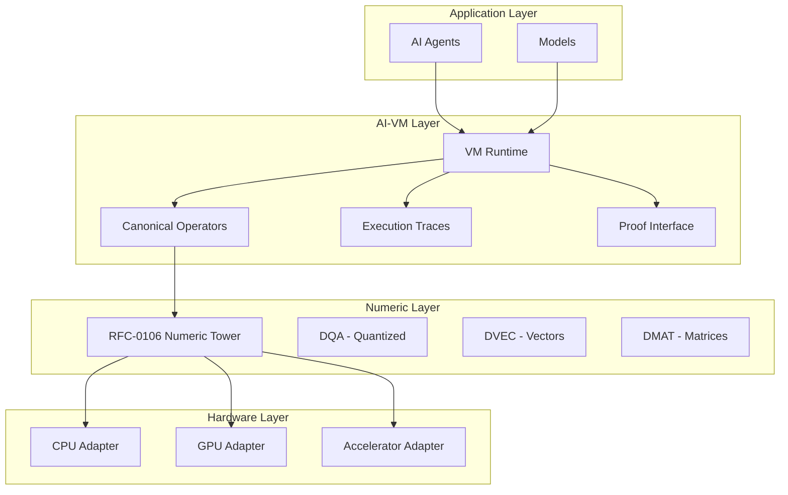
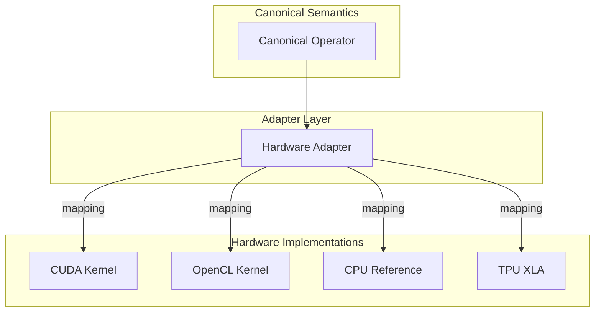
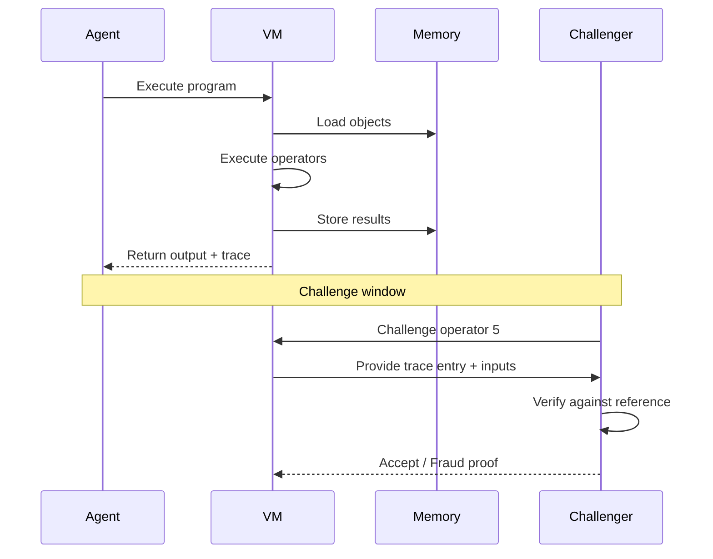

# RFC-0120 (AI Execution): Deterministic AI Virtual Machine

## Status

Draft

> **Note:** This RFC was originally numbered RFC-0120 under the legacy numbering system. It remains at 0120 as it belongs to the AI Execution category.

## Summary

This RFC defines the **Deterministic AI Virtual Machine (AI-VM)** — a specialized execution environment that runs AI workloads identically across heterogeneous hardware (CPUs, GPUs, accelerators). The AI-VM builds on RFC-0106's Deterministic Numeric Tower to provide deterministic execution semantics, canonical operators, hardware abstraction, and verification interfaces for verifiable AI inference and training.

## Design Goals

| Goal                 | Target                               | Metric                 |
| -------------------- | ------------------------------------ | ---------------------- |
| **G1: Determinism**  | Identical results across hardware    | Bit-exact output       |
| **G2: Verification** | Full execution traces for challenges | Trace completeness     |
| **G3: Portability**  | Single canonical semantics           | Hardware-agnostic      |
| **G4: Performance**  | Near-native execution speed          | <2x overhead vs native |
| **G5: ZK-Readiness** | Circuit-friendly operations          | Gate efficiency        |

## Motivation

### CAN WE? — Feasibility Research

The fundamental question: **Can we create a deterministic execution environment for AI workloads that produces bit-exact results across heterogeneous hardware?**

Research confirms feasibility through:

- **Deterministic Numeric Tower (RFC-0106)** — Provides DQA, DFP, DVEC, DMAT types with guaranteed determinism
- **Canonical operator semantics** — Fixed loop orders, deterministic reductions
- **Hardware adapter pattern** — Map canonical semantics to hardware-specific implementations while preserving correctness
- **Execution trace commitment** — Merkle-based verification of execution history

### WHY? — Why This Matters

Without deterministic AI execution:

| Problem                    | Consequence                                              |
| -------------------------- | -------------------------------------------------------- |
| Non-reproducible inference | Verification impossible, fraud detection fails           |
| Hardware variance          | Different results on CPU vs GPU vs TPU                   |
| Verification cost          | Full ZK proofs economically infeasible for large models  |
| Agent unpredictability     | Autonomous agents cannot guarantee reproducible behavior |

The AI-VM enables:

- **Verifiable Inference** — Cryptographic proof that specific inputs produced specific outputs
- **Deterministic Training** — Reproducible model training across the network
- **Verification Markets** — Fraud proofs require deterministic execution
- **Agent Trust** — Autonomous agents need guaranteed reproducible behavior

### WHAT? — What This Specifies

The AI-VM defines:

1. **Execution model** — State machine semantics with canonical operators
2. **Instruction set** — Deterministic operations (MATMUL, ATTENTION, SOFTMAX, etc.)
3. **Hardware abstraction** — Adapters that preserve semantics across devices
4. **Verification interface** — Sampling, fraud proofs, and ZK integration
5. **Memory model** — Object-based storage with cryptographic addressing

### HOW? — Implementation

The AI-VM integrates with the existing stack:

```
RFC-0106 (Numeric Tower)
       ↓
RFC-0120 (AI-VM) ← NEW
       ↓
RFC-0121 (Verifiable Large Model Execution)
       ↓
RFC-0130 (Proof-of-Inference Consensus)
```

### The Problem: Non-Deterministic AI Execution

Modern ML stacks introduce nondeterminism through:

| Source                      | Impact                                           |
| --------------------------- | ------------------------------------------------ |
| **Floating-point variance** | IEEE 754 allows different rounding paths         |
| **Reduction order**         | `(a+b)+c ≠ a+(b+c)` in parallel execution        |
| **Kernel scheduling**       | GPU warp timing varies by driver/hardware        |
| **Vendor optimizations**    | cuDNN/TensorRT swap algorithms dynamically       |
| **Approximate algorithms**  | HNSW, PQ search are inherently non-deterministic |

This makes verifiable AI impossible — two nodes executing the same model may produce different results.

### The Solution: Deterministic AI-VM

Replace the traditional ML runtime with a deterministic computational substrate that:

- Enforces fixed numeric formats (via RFC-0106)
- Defines canonical operator semantics
- Mandates deterministic reduction trees
- Provides hardware adapters that preserve semantics

### Why This Matters for CipherOcto

1. **Verifiable Inference** — Cryptographic proof that specific inputs produced specific outputs
2. **Deterministic Training** — Reproducible model training across the network
3. **Verification Markets** — Fraud proofs require deterministic execution
4. **Agent Trust** — Autonomous agents need guaranteed reproducible behavior

## Specification

### Layered Architecture



### Execution Model

The AI-VM executes deterministic programs as state transitions:

```
S₀ → OP₁ → OP₂ → OP₃ → ... → Sₙ
```

Where:

- `S` is the VM state (memory objects, model weights, activations)
- `OP` is a canonical operator with deterministic semantics

#### State Structure

```rust
struct VMState {
    // Object store - Merkle-addressed data
    objects: HashMap<Digest, Object>,

    // Execution context
    program_counter: u64,
    call_stack: Vec<Frame>,

    // Deterministic RNG state
    prng_state: [u8; 32],

    // Numeric context (from RFC-0106)
    numeric_mode: NumericMode,
}
```

#### Program Structure

```rust
struct AIProgram {
    // Program identity
    program_id: Digest,

    // Canonical operator sequence
    operators: Vec<Operator>,

    // Initial state commitment
    input_root: Digest,

    // Expected output commitment
    output_root: Digest,
}
```

### Instruction Set

The AI-VM exposes a strict instruction set with deterministic semantics:

| Category    | Instruction        | Description                     |
| ----------- | ------------------ | ------------------------------- |
| **Memory**  | `LOAD_OBJECT`      | Load object by Merkle root      |
|             | `STORE_OBJECT`     | Store object, return commitment |
|             | `ALLOC_TENSOR`     | Allocate tensor in memory       |
| **Compute** | `MATMUL`           | Matrix multiplication           |
|             | `CONV2D`           | 2D convolution                  |
|             | `ACTIVATION`       | Apply activation function       |
|             | `SOFTMAX`          | Deterministic softmax           |
|             | `LAYERNORM`        | Layer normalization             |
|             | `ATTENTION`        | Attention mechanism             |
| **Vector**  | `VECTOR_SEARCH`    | Deterministic similarity search |
|             | `EMBEDDING_LOOKUP` | Embedding vector retrieval      |
| **Verify**  | `VERIFY_PROOF`     | Verify ZK/fraud proof           |
|             | `COMMIT_STATE`     | Commit state root               |

#### Instruction Encoding

```rust
enum Instruction {
    // Memory operations
    LoadObject { object_id: Digest },
    StoreObject { data: Vec<u8> },

    // Compute operations
    MatMul {
        lhs: TensorRef,
        rhs: TensorRef,
        output: TensorRef,
        transpose_a: bool,
        transpose_b: bool,
    },

    Conv2d {
        input: TensorRef,
        kernel: TensorRef,
        output: TensorRef,
        stride: [u32; 2],
        padding: [u32; 4],
    },

    Activation {
        input: TensorRef,
        output: TensorRef,
        function: ActivationFunction,
    },

    Softmax {
        input: TensorRef,
        output: TensorRef,
        axis: i32,
    },

    Attention {
        q: TensorRef,
        k: TensorRef,
        v: TensorRef,
        output: TensorRef,
    },

    // Vector operations
    VectorSearch {
        query: TensorRef,
        index: Digest,
        k: u32,
        results: Vec<(Digest, f32)>,
    },

    // Verification
    VerifyProof {
        proof: Vec<u8>,
        public_inputs: Vec<Digest>,
    },

    CommitState {
        state_root: Digest,
    },
}
```

### Canonical Operator Library

Each operator defines exact semantics to ensure determinism:

#### Matrix Multiplication

```rust
/// Canonical matmul with fixed loop order
fn matmul<A: DqaScalar, B: DqaScalar, const M: usize, const K: usize, const N: usize>(
    a: &DMat<A, M, K>,
    b: &DMat<A, K, N>,
) -> DMat<A, M, N> {
    let mut c = DMat::zero();

    // Fixed loop order ensures determinism
    for i in 0..M {
        for j in 0..N {
            let mut sum = A::zero();
            for k in 0..K {
                sum = sum + a[i][k] * b[k][j];
            }
            c[i][j] = sum;
        }
    }
    c
}
```

Key constraints:

- Loop order: `i` → `j` → `k` (fixed)
- Reduction: Binary tree, not arbitrary parallel
- Accumulator: Start at zero, exact arithmetic

#### Deterministic Attention

Transformer attention requires special handling:

```rust
/// Deterministic attention with fixed softmax computation
fn attention<Q: DqaScalar, K: DqaScalar, V: DqaScalar>(
    q: &DMat<Q, B, N, H>,
    k: &DMat<K, B, M, H>,
    v: &DMat<V, B, M, H>,
) -> DMat<Q, B, N, H> {
    // Step 1: Compute QK^T with fixed reduction
    let scale = Q::from_f32(1.0 / f32::sqrt(H as f32));
    let scores = matmul_qk_fixed(q, k, scale);

    // Step 2: Deterministic softmax (row-wise)
    let weights = deterministic_softmax(scores);

    // Step 3: Weighted sum with fixed order
    let output = matmul_weighted_sum(weights, v);

    output
}

/// Softmax with fixed numerical approach
fn deterministic_softmax<T: DqaScalar>(x: &DMat<T, B, N, H>) -> DMat<T, B, N, H> {
    let mut result = DMat::zero();

    for b in 0..B {
        for n in 0..N {
            // Compute max for numerical stability (fixed)
            let mut max_val = x[b][n][0];
            for h in 1..H {
                if x[b][n][h] > max_val {
                    max_val = x[b][n][h];
                }
            }

            // Compute exp(x - max) with fixed sum
            let mut sum = T::zero();
            for h in 0..H {
                let exp_val = (x[b][n][h] - max_val).exp();
                result[b][n][h] = exp_val;
                sum = sum + exp_val;
            }

            // Normalize with fixed division
            for h in 0..H {
                result[b][n][h] = result[b][n][h] / sum;
            }
        }
    }

    result
}
```

#### Vector Search

For retrieval (critical for RAG), approximate algorithms like HNSW are non-deterministic. The AI-VM provides deterministic alternatives:

```rust
enum VectorSearchMode {
    /// Exact search - deterministic but slow for large datasets
    Exact,

    /// Product quantization with fixed codebook traversal
    ProductQuantization { codebook: Digest },

    /// Deterministic graph traversal with fixed path
    GraphSearch { graph: Digest, entry: u32 },
}

struct VectorSearchOp {
    query: TensorRef,
    index: Digest,
    k: u32,
    mode: VectorSearchMode,
}
```

### Deterministic Kernel Rules

To ensure bit-exact results across hardware:

| Rule                | Requirement                           |
| ------------------- | ------------------------------------- |
| **Reduction order** | Binary tree, left-to-right            |
| **Loop order**      | Fixed canonical order                 |
| **Rounding**        | Round-to-nearest-even (deterministic) |
| **Memory access**   | Sequential, no prefetch variation     |
| **Threading**       | Deterministic thread mapping          |

#### Parallel Reduction Constraint

```rust
/// Deterministic reduction using fixed binary tree
/// NOT: arbitrary parallel reduce
/// NOT: tree-based but order-dependent
fn deterministic_reduce(values: &[Scalar]) -> Scalar {
    let mut result = values[0];

    // Fixed pairwise reduction order
    for i in 1..values.len() {
        result = result + values[i];  // Strict left-to-right
    }

    result
}
```

### Deterministic Randomness

AI workloads require randomness (dropout, initialization, sampling). The AI-VM provides deterministic PRNG:

```rust
/// Deterministic PRNG seeded by execution context
struct DeterministicRng {
    state: [u8; 32],
}

impl DeterministicRng {
    /// Seed from block and transaction context
    fn seed(block_hash: Digest, tx_hash: Digest, step_index: u64) -> Self {
        let mut input = Vec::new();
        input.extend_from_slice(block_hash.as_bytes());
        input.extend_from_slice(tx_hash.as_bytes());
        input.extend_from_slice(&step_index.to_le_bytes());

        let hash = sha256(&input);
        Self { state: hash }
    }

    /// ChaCha20-based deterministic output
    fn next_u32(&mut self) -> u32 {
        // Fixed ChaCha20 rounds
        let mut block = [0u8; 64];
        chacha20_block(&self.state, &mut block, 12);

        self.state = increment_counter(&self.state);

        u32::from_le_bytes([block[0], block[1], block[2], block[3]])
    }

    /// Dropout with deterministic mask
    fn dropout_mask<T: Scalar>(&mut self, shape: [usize; 4], rate: f32) -> Tensor<T> {
        // Generate deterministic mask
        let threshold = (rate * u32::MAX as f32) as u32;
        Tensor::from_fn(shape, |_, _, _, _| {
            self.next_u32() < threshold
        })
    }
}
```

#### Seed Derivation

```
seed = H(block_hash || tx_hash || step_index || operator_id)
```

Every node derives identical random numbers.

### Execution Traces

Every AI-VM execution produces a trace for verification:

```rust
struct ExecutionTrace {
    /// Unique trace identifier
    trace_id: Digest,

    /// Program identity
    program_id: Digest,

    /// Input state commitment
    input_root: Digest,

    /// Output state commitment
    output_root: Digest,

    /// Operator execution sequence
    operators: Vec<TraceEntry>,

    /// Deterministic randomness used
    rng_seeds: Vec<RngSeed>,

    /// Timing (optional, for profiling)
    timing: Option<TimingInfo>,
}

struct TraceEntry {
    /// Operator index
    index: u64,

    /// Operator type
    operator: OperatorType,

    /// Input commitments
    inputs: Vec<Digest>,

    /// Output commitment
    output: Digest,

    /// Operator-specific data (e.g., tensor shapes)
    metadata: Value,
}

struct RngSeed {
    /// Seed derivation inputs
    block_hash: Digest,
    tx_hash: Digest,
    step_index: u64,

    /// First random value generated
    first_value: u32,
}
```

#### Trace Commitment

Traces are Merkle-committed for efficient verification:

```rust
/// Build Merkle tree of trace entries
fn commit_trace(trace: &ExecutionTrace) -> Digest {
    let entries: Vec<Digest> = trace.operators.iter()
        .map(|e| digest_trace_entry(e))
        .collect();

    merkle_root(&entries)
}
```

### Verification Interface

The AI-VM provides interfaces for multiple verification approaches:

#### 1. Sampling Verification

Verification markets sample executions and verify:

```rust
struct SamplingVerification {
    /// Sample N random operators to verify
    sample_size: u32,

    /// Verify operator correctness
    verify_operator: fn(TraceEntry) -> bool,

    /// Challenge threshold
    threshold: f32,
}
```

#### 2. Fraud Proofs

Incorrect execution generates fraud proofs:

```rust
struct FraudProof {
    /// Trace of disputed execution
    trace: ExecutionTrace,

    /// Specific operator being challenged
    challenged_operator: u64,

    /// Expected vs actual output
    expected_output: Digest,
    actual_output: Digest,

    /// Proof of incorrect computation
    computation_proof: ComputationProof,
}
```

#### 3. ZK Proof Integration

For premium verification, generate ZK proofs:

```rust
struct ZKVerification {
    /// Circuit type
    circuit: ZKCircuit,

    /// Public inputs (trace commitments)
    public_inputs: Vec<Digest>,

    /// Proof
    proof: Vec<u8>,
}

/// Supported ZK operations
enum ZKCircuit {
    MatMul { rows: usize, cols: usize },
    Conv2d { channels: usize, kernel_size: usize },
    Attention { heads: usize, seq_len: usize },
    Softmax { size: usize },
    VectorSearch { method: SearchMethod },
}
```

### Hardware Adapter Layer

The AI-VM maps canonical operators to hardware-specific implementations:



#### Adapter Interface

```rust
trait HardwareAdapter {
    /// Check if this hardware supports the operation
    fn supports(&self, op: &Operator) -> bool;

    /// Execute with deterministic semantics
    fn execute(&self, op: &Operator, inputs: &[Tensor]) -> Result<Tensor, Error>;

    /// Verify output matches canonical semantics (for challenged execution)
    fn verify(&self, op: &Operator, inputs: &[Tensor], output: &Tensor) -> bool;
}

/// CPU adapter - reference implementation, always correct
struct CpuAdapter;

impl HardwareAdapter for CpuAdapter {
    fn supports(&self, op: &Operator) -> bool { true }

    fn execute(&self, op: &Operator, inputs: &[Tensor]) -> Result<Tensor, Error> {
        // Pure Rust implementation with RFC-0106 types
        execute_canonical(op, inputs)
    }

    fn verify(&self, op: &Operator, inputs: &[Tensor], output: &Tensor) -> bool {
        // Compare against reference
        let expected = execute_canonical(op, inputs).unwrap();
        expected.bit_equal(output)
    }
}

/// GPU adapter - uses optimized kernels but must preserve semantics
struct GpuAdapter {
    device: GpuDevice,
}

impl HardwareAdapter for GpuAdapter {
    fn supports(&self, op: &Operator) -> bool {
        matches!(op, Operator::MatMul | Operator::Conv2d | Operator::Attention)
    }

    fn execute(&self, op: &Operator, inputs: &[Tensor]) -> Result<Tensor, Error> {
        // GPU kernel with deterministic constraints:
        // - Fixed thread mapping
        // - Deterministic reduction
        // - No algorithm swapping
        execute_gpu_deterministic(op, inputs)
    }

    fn verify(&self, op: &Operator, inputs: &[Tensor], output: &Tensor) -> bool {
        // On challenge, verify against CPU reference
        let expected = execute_canonical(op, inputs).unwrap();
        // Allow small numerical tolerance for GPU vs CPU
        expected.approx_equal(output, 1e-6)
    }
}
```

#### Hardware Requirements

| Hardware   | Support | Notes                         |
| ---------- | ------- | ----------------------------- |
| CPU        | Full    | Reference implementation      |
| NVIDIA GPU | Full    | CUDA with deterministic flags |
| AMD GPU    | Full    | ROCm with deterministic flags |
| TPU        | Partial | XLA with constraints          |
| Custom     | Adapter | Via HardwareAdapter trait     |

### Deterministic Memory Model

AI-VM memory is object-based with cryptographic addressing:

```rust
/// Object in the AI-VM storage
struct VMObject {
    /// Content-addressable identity
    object_id: Digest,

    /// Object type
    kind: ObjectKind,

    /// Serialized data
    data: Vec<u8>,

    /// Creator commitment
    creator: Option<PublicKey>,
}

enum ObjectKind {
    /// Model weights
    Tensor { shape: Vec<usize>, dtype: DataType },

    /// Activation data
    Activation { shape: Vec<usize> },

    /// Lookup tables
    LookupTable { key_type: Type, value_type: Type },

    /// Embedding index
    VectorIndex { dimension: usize, metric: Metric },

    /// Program code
    Program { operators: Vec<Operator> },
}
```

#### Memory Operations

| Operation | Semantics                            |
| --------- | ------------------------------------ |
| `ALLOC`   | Allocate tensor, zero-initialized    |
| `LOAD`    | Retrieve by digest, verify integrity |
| `STORE`   | Store object, return commitment      |
| `FREE`    | Deallocate tensor                    |

### Performance Considerations

The AI-VM balances determinism and performance:

| Technique                     | Approach                         |
| ----------------------------- | -------------------------------- |
| **Semantic preservation**     | Protocol defines WHAT, not HOW   |
| **Verification on challenge** | Fast path uses optimized kernels |
| **Lazy verification**         | Only verify challenged operators |
| **Batched execution**         | Group compatible operators       |
| **Hardware parallelism**      | Within deterministic constraints |

#### Performance Targets

| Metric            | Target    | Notes                    |
| ----------------- | --------- | ------------------------ |
| Inference latency | <100ms    | Per operator (not total) |
| Trace generation  | <10ms     | Per operator             |
| Verification time | <50ms     | Per challenged operator  |
| Throughput        | >1M ops/s | Aggregated               |
| Memory overhead   | <20%      | For trace storage        |

## Adversarial Review

| Threat                 | Impact | Mitigation                                |
| ---------------------- | ------ | ----------------------------------------- |
| **Kernel equivalence** | High   | Verification markets challenge outputs    |
| **Memory tampering**   | High   | Merkle commitments on all objects         |
| **RNG manipulation**   | High   | Deterministic seed from block context     |
| **Timing attacks**     | Medium | Deterministic execution time not required |
| **Hardware variance**  | Medium | CPU reference for verification            |

## Alternatives Considered

| Approach                 | Pros                                 | Cons                          |
| ------------------------ | ------------------------------------ | ----------------------------- |
| **Pure software (CPU)**  | Simple, deterministic                | Too slow for production       |
| **Hardware timestamps**  | Fast                                 | Not reproducible across nodes |
| **This approach**        | Balanced performance + verifiability | Adapter complexity            |
| **ZK-only verification** | Strong guarantees                    | Prover cost too high          |

## Implementation Phases

### Phase 1: Core VM

- [ ] VM state machine implementation
- [ ] Basic instruction set (LOAD, STORE, ALLOC)
- [ ] Execution trace generation
- [ ] CPU adapter with reference implementation

### Phase 2: Compute Operators

- [ ] MATMUL with deterministic reduction
- [ ] ACTIVATION functions (ReLU, Sigmoid, Tanh)
- [ ] SOFTMAX with deterministic normalization
- [ ] ATTENTION mechanism

### Phase 3: Vector Search

- [ ] Exact vector search
- [ ] Deterministic product quantization
- [ ] Vector index structure

### Phase 4: Hardware Adapters

- [ ] CUDA adapter with deterministic flags
- [ ] OpenCL adapter
- [ ] Verification interface

### Phase 5: Verification Integration

- [ ] Sampling verification protocol
- [ ] Fraud proof generation
- [ ] ZK circuit templates

## Key Files to Modify

| File                   | Change                         |
| ---------------------- | ------------------------------ |
| src/vm/mod.rs          | VM core implementation         |
| src/vm/operators.rs    | Canonical operator definitions |
| src/vm/adapters/cpu.rs | CPU reference adapter          |
| src/vm/adapters/gpu.rs | GPU adapter                    |
| src/vm/trace.rs        | Execution trace generation     |
| src/vm/verification.rs | Verification interfaces        |

## Future Work

- F1: Deterministic convolution kernels (CONV2D, CONV3D)
- F2: Recurrent operators (LSTM, GRU)
- F3: Large model sharding (trillion-parameter support)
- F4: Distributed execution with deterministic aggregation
- F5: Automatic mixed-precision verification

## Rationale

### Why a Separate VM?

The AI-VM separates concerns cleanly:

- **RFC-0106** defines numeric representation (how numbers work)
- **RFC-0120** defines execution semantics (how operations work)

This separation enables:

- Independent evolution of numeric types
- Clear verification boundaries
- Multiple VM implementations

### Why Not Use Existing Runtimes?

| Runtime      | Reason for Rejection               |
| ------------ | ---------------------------------- |
| ONNX Runtime | Non-deterministic by default       |
| TensorFlow   | Session-based, stateful            |
| PyTorch      | Autograd, dynamic graphs           |
| WebGPU       | Browser-focused, not deterministic |

A purpose-built VM enables deterministic guarantees impossible in general-purpose ML frameworks.

## Dependency on RFC-0106

The AI-VM builds directly on the Deterministic Numeric Tower (RFC-0106) for all numeric operations:

### Numeric Types Used

| RFC-0106 Type | AI-VM Usage                         | Purpose                         |
| ------------- | ----------------------------------- | ------------------------------- |
| `DqaScalar`   | Weight matrices, activations        | Quantized inference             |
| `DfpScalar`   | Intermediate computations           | Floating-point precision        |
| `DVEC<N>`     | Embedding vectors                   | Vector search, attention scores |
| `DMAT<M,N>`   | Weight matrices, activation tensors | Linear algebra operations       |

### Key Integration Points

1. **Scalar Arithmetic**: All operator implementations use `DqaScalar` traits for deterministic arithmetic
2. **Matrix Operations**: `matmul()` uses `DMat<A, M, K>` with fixed loop order
3. **Vector Operations**: Attention and embedding lookup use `DVEC` with deterministic traversal
4. **Numeric Context**: VM state includes `numeric_mode: NumericMode` from RFC-0106

### Why Not Other Approaches?

| Approach                | Why Rejected                        |
| ----------------------- | ----------------------------------- |
| IEEE 754 floats         | Non-deterministic across hardware   |
| Vendor tensor cores     | Algorithm selection varies          |
| General-purpose vectors | No determinism guarantees           |
| This approach           | Full stack determinism via RFC-0106 |

## Related RFCs

- RFC-0106 (Numeric/Math): Deterministic Numeric Tower
- RFC-0108 (Retrieval): Verifiable AI Retrieval
- RFC-0114 (Agents): Verifiable Reasoning Traces
- RFC-0115 (Economics): Probabilistic Verification Markets
- RFC-0116 (Numeric/Math): Unified Deterministic Execution Model
- RFC-0121 (AI Execution): Verifiable Large Model Execution
- RFC-0122 (AI Execution): Mixture-of-Experts

## Related Use Cases

- [Hybrid AI-Blockchain Runtime](../../docs/use-cases/hybrid-ai-blockchain-runtime.md)
- [Verifiable AI Agents for DeFi](../../docs/use-cases/verifiable-ai-agents-defi.md)
- [Verifiable Reasoning Traces](../../docs/use-cases/verifiable-reasoning-traces.md)

## Appendices

### A. IEEE 754 Non-Determinism Examples

```python
# Example 1: Reduction order
a, b, c = 1e10, 1.0, -1e10
# (a + b) + c = 0.0
# a + (b + c) = 1.0  # Different!

# Example 2: Fused multiply-add
# CUDA FMA may round differently than software

# Example 3: cuDNN algorithm selection
# Different algorithms for conv2d on different GPUs
```

### B. Supported Activation Functions

| Function | Deterministic Definition                                                |
| -------- | ----------------------------------------------------------------------- | --- | ---------------------- |
| ReLU     | `max(0, x)` - exact                                                     |
| Sigmoid  | `x / (1 +                                                               | x   | )` - polynomial approx |
| Tanh     | `x * (27 + x²) / (27 + 9x²)` - polynomial approx                        |
| GELU     | `0.5x(1 + tanh(√2/π * (x + 0.044715x³)))` - requires deterministic tanh |

### C. Trace Verification Protocol



---

**Version:** 1.1
**Submission Date:** 2026-03-07
**Last Updated:** 2026-03-07
