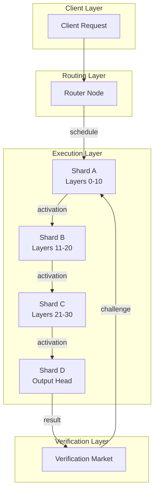
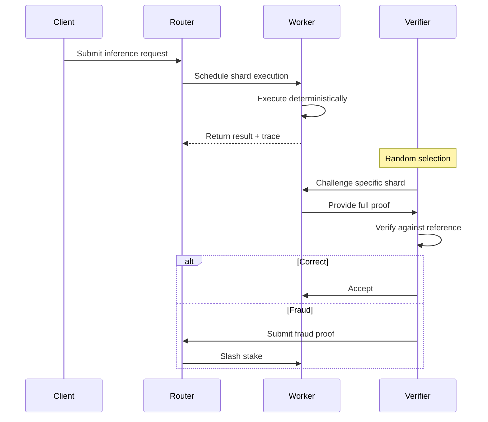
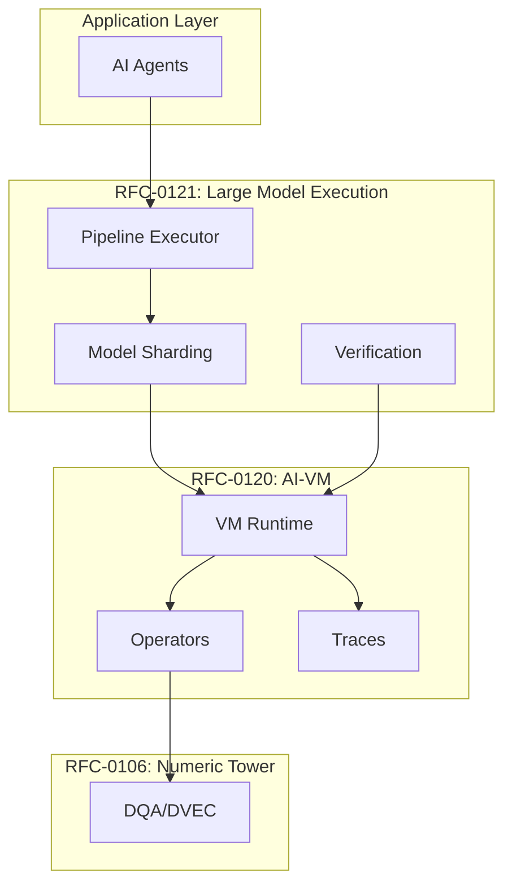

# RFC-0121 (AI Execution): Verifiable Large Model Execution

## Status

Draft

> **Note:** This RFC was originally numbered RFC-0121 under the legacy numbering system. It remains at 0121 as it belongs to the AI Execution category.

## Summary

This RFC defines **Verifiable Large Model Execution** — a system enabling inference and training of trillion-parameter models across a decentralized network without requiring any single node to hold the full model. The architecture combines model sharding, deterministic execution proofs (via RFC-0120), and probabilistic verification to achieve scalable, cryptographically verifiable distributed AI.

## Design Goals

| Goal                  | Target                               | Metric                             |
| --------------------- | ------------------------------------ | ---------------------------------- |
| **G1: Sharding**      | Support 1T+ parameter models         | Per-node storage <100GB            |
| **G2: Scalability**   | Linear bandwidth with active shards  | O(active_shards) not O(model_size) |
| **G3: Verifiability** | Detect fraud with >99.9% probability | Challenge threshold                |
| **G4: Determinism**   | Bit-exact across all nodes           | RFC-0120 compliance                |
| **G5: Economics**     | Secure against colluding workers     | StakeSlash > PotentialGain         |

## Motivation

### The Problem: Massive Models, Limited Resources

trillion-parameter models require:

| Resource   | Requirement             |
| ---------- | ----------------------- |
| Storage    | ~2TB (FP16)             |
| GPU Memory | 80GB+ per inference     |
| Bandwidth  | 100GB+ per forward pass |

No single node can run a 1T-parameter model.

### The Solution: Distributed Sharded Execution

Instead of running the full model locally:

- **Model sharding** — Decompose model across nodes
- **Pipeline execution** — Stream through shard pipeline
- **Activation commitments** — Hash tensors, not raw data
- **Probabilistic verification** — Sample checks with economic stakes

### Why This Matters for CipherOcto

1. **Democratized inference** — Any node can participate
2. **Verifiable results** — Cryptographic proof of correct execution
3. **Massive scale** — Models larger than any single machine
4. **Economic security** — Stake-based fraud prevention

## Specification

### Architecture Overview



### Model Commitment Structure

The full model is never stored as one object. Instead, it's a Merkle tree of shards:

```rust
struct ModelCommitment {
    /// Canonical model identity
    model_root: Digest,

    /// Total parameter count
    param_count: u64,

    /// Shard configuration
    shards: Vec<ShardDescriptor>,
}

struct ShardDescriptor {
    /// Shard index
    shard_id: u32,

    /// Layer range this shard covers
    layer_start: u32,
    layer_end: u32,

    /// Parameter count in this shard
    param_count: u64,

    /// Commitment hash
    shard_hash: Digest,
}

struct LayerObject {
    /// Layer identifier
    layer_id: u32,

    /// Operator type (attention, mlp, embedding)
    operator_type: OperatorType,

    /// Weights commitment
    weights_hash: Digest,

    /// Configuration (hidden size, heads, etc.)
    config: LayerConfig,
}
```

### Layer-Aligned Sharding

Transformer models decompose naturally by layer:

```
Model Structure (1T parameters):
├── embedding (1B params)
├── layer_0 (8B params)
├── layer_1 (8B params)
...
├── layer_119 (8B params)
└── output_head (1B params)

Shards:
├── shard_0: embedding + layers 0-9 (80B params)
├── shard_1: layers 10-19 (80B params)
├── shard_2: layers 20-29 (80B params)
...
├── shard_11: layers 110-119 + head (80B params)
```

Each shard is a **VM object** referenced by hash:

```rust
/// Shard stored as VM object
struct ShardObject {
    shard_id: u32,
    layers: Vec<LayerObject>,
    weights: Vec<u8>,  // Serialized weights
}
```

### Pipeline Inference Execution

Inference runs as a pipeline across shards:

```rust
struct PipelineExecution {
    /// Execution identifier
    execution_id: Digest,

    /// Scheduled shards in order
    pipeline: Vec<PipelineStage>,

    /// Input commitment
    input_root: Digest,

    /// Final output commitment
    output_root: Digest,

    /// Trace of all stages
    trace_root: Digest,
}

struct PipelineStage {
    /// Shard to execute
    shard_id: u32,

    /// Node assigned to this stage
    worker: PublicKey,

    /// Input activation commitment
    input_hash: Digest,

    /// Output activation commitment
    output_hash: Digest,

    /// Execution timestamp
    timestamp: u64,
}
```

#### Execution Flow

```
1. Client submits input tokens
       ↓
2. Router fetches model commitment
       ↓
3. Router schedules pipeline:
   - Shard A → layers 0-10
   - Shard B → layers 11-20
   - Shard C → layers 21-30
   - Shard D → output head
       ↓
4. Each shard executes deterministically (RFC-0120)
       ↓
5. Activation passed as commitment + proof
       ↓
6. Final result committed with trace
       ↓
7. Verification market samples for challenges
```

### Activation Commitments

Instead of sending full tensors across the network, nodes commit to them:

```rust
struct ActivationCommitment {
    /// Tensor content hash
    tensor_hash: Digest,

    /// Tensor shape
    shape: Vec<usize>,

    /// Data type (from RFC-0106)
    dtype: DataType,

    /// Block commitments for partial verification
    blocks: Vec<BlockCommitment>,
}

struct BlockCommitment {
    /// Block index
    block_id: u32,

    /// Block hash
    block_hash: Digest,

    /// Merkle proof to tensor root
    proof: Vec<Digest>,
}
```

#### Commitment Protocol

```
Node A (shard i):
1. Compute activation tensor
2. Compute tensor_hash = H(activation)
3. Split into blocks, compute block hashes
4. Send {activation, tensor_hash, block_proofs}

Node B (shard i+1):
1. Verify commitment matches
2. Use activation for computation
3. If challenged: reveal specific blocks
```

### Deterministic Execution Traces

Each shard execution produces a trace entry:

```rust
struct ShardTrace {
    /// Shard execution identifier
    trace_id: Digest,

    /// Shard being executed
    shard_id: u32,

    /// Input activation commitment
    input_hash: Digest,

    /// Output activation commitment
    output_hash: Digest,

    /// Operator trace (from RFC-0120)
    operator_traces: Vec<OperatorTrace>,

    /// RNG seeds used
    rng_seeds: Vec<RngSeed>,

    /// Worker signature
    worker_signature: Signature,
}
```

#### Trace Tree

```
trace_root
   ├── shard_0_trace
   │    ├── operator_0_trace
   │    ├── operator_1_trace
   │    └── ...
   ├── shard_1_trace
   ├── shard_2_trace
   └── ...
```

### Distributed Execution Roles

| Role                   | Function           | Storage              | Stake    |
| ---------------------- | ------------------ | -------------------- | -------- |
| **Execution Nodes**    | Run model shards   | Assigned layers only | High     |
| **Routing Nodes**      | Schedule pipeline  | Model commitment     | Medium   |
| **Verification Nodes** | Challenge fraud    | Minimal              | Low      |
| **Storage Nodes**      | Hold weight shards | Full or partial      | Variable |

#### Execution Node

```rust
struct ExecutionNode {
    /// Node identity
    node_id: PublicKey,

    /// Assigned shards (layer ranges)
    assigned_shards: Vec<u32>,

    /// Current capacity
    available_compute: ComputeUnits,

    /// Staked tokens
    stake: TokenAmount,
}
```

#### Router Node

```rust
struct RouterNode {
    /// Model commitments cache
    model_cache: HashMap<Digest, ModelCommitment>,

    /// Active pipelines
    active_pipelines: HashMap<Digest, PipelineExecution>,

    /// Node registry
    node_registry: HashMap<PublicKey, ExecutionNode>,
}
```

### Probabilistic Verification

Verifying every operation is too expensive. Instead, use random challenges:

```rust
struct VerificationConfig {
    /// Probability of challenge per execution
    challenge_probability: f64,

    /// Minimum stake to participate as worker
    min_stake: TokenAmount,

    /// Slash penalty for fraud
    slash_fraction: f64,

    /// Challenge reward to challenger
    reward_fraction: f64,
}

// Default configuration
const VERIFICATION_CONFIG = VerificationConfig {
    challenge_probability: 0.01,  // 1%
    min_stake: 10_000,            // OCTO tokens
    slash_fraction: 0.5,           // 50% stake slashed
    reward_fraction: 0.3,          // 30% to challenger
};
```

#### Challenge Protocol



### Step-Level Challenge Protocol

When a shard is challenged:

```rust
struct Challenge {
    /// Execution being challenged
    execution_id: Digest,

    /// Specific shard
    shard_id: u32,

    /// Challenge reason
    reason: ChallengeReason,
}

enum ChallengeReason {
    /// Random audit
    RandomAudit,

    /// Client dispute
    ClientDispute,

    /// Anomaly detection
    AnomalyDetected,
}

/// Worker must provide this proof
struct ShardProof {
    /// Weights used
    weights: ShardObject,

    /// Input activation
    input_activation: Tensor,

    /// Full operator traces
    traces: Vec<OperatorTrace>,

    /// Output activation
    output_activation: Tensor,

    /// RNG seeds
    rng_seeds: Vec<RngSeed>,
}
```

Verifier recomputes inside AI-VM (RFC-0120):

```rust
fn verify_shard(proof: ShardProof) -> Result<bool, Error> {
    // Load weights from proof
    let weights = load_weights(&proof.weights)?;

    // Reconstruct input
    let input = proof.input_activation;

    // Execute operators deterministically
    let output = execute_operators(&weights, &input, &proof.traces)?;

    // Compare against claimed output
    let output_hash = hash(&output);
    Ok(output_hash == proof.output_activation.hash)
}
```

### Shard Proof Compression

To avoid transmitting massive tensors during challenges:

```rust
struct TensorCommitment {
    /// Root hash of tensor
    root: Digest,

    /// Block size for chunking
    block_size: usize,

    /// Number of blocks
    block_count: usize,

    /// Merkle tree
    merkle_tree: Vec<Digest>,
}

/// Challenge can request specific blocks
struct BlockChallenge {
    tensor_root: Digest,
    block_indices: Vec<u32>,
}

/// Worker provides only requested blocks
struct BlockProof {
    block_data: Vec<Vec<u8>>,
    merkle_proofs: Vec<Digest>,
}
```

### Weight Streaming

Execution nodes don't need permanent storage. Weights are streamed on-demand:

```rust
struct WeightStreamer {
    /// Content-addressed storage
    storage: ContentAddressedStore,

    /// Cache for recently used shards
    cache: LruCache<Digest, ShardObject>,
}

impl WeightStreamer {
    /// Fetch shard by hash
    async fn fetch_shard(&self, shard_hash: Digest) -> Result<ShardObject> {
        // Check cache first
        if let Some(shard) = self.cache.get(&shard_hash) {
            return Ok(shard.clone());
        }

        // Fetch from storage network
        let shard = self.storage.retrieve(&shard_hash).await?;

        // Cache for reuse
        self.cache.put(shard_hash, shard.clone());

        Ok(shard)
    }
}
```

This enables **on-demand model execution** without global replication.

### Deterministic Attention Handling

Attention layers are the heaviest part. The AI-VM (RFC-0120) defines canonical attention:

```rust
/// Deterministic attention per RFC-0120
fn attention_step(
    q: &Tensor,
    k: &Tensor,
    v: &Tensor,
    num_heads: u32,
) -> Tensor {
    // QK^T with fixed reduction
    let scores = matmul_fixed(q, &k.transpose());

    // Scale by sqrt(d_k)
    let scale = 1.0 / f32::sqrt(num_heads as f32);
    let scaled = scalar_mul(&scores, scale);

    // Deterministic softmax
    let weights = softmax_fixed(&scaled, /*axis=*/ -1);

    // Weighted sum with fixed order
    let output = matmul_fixed(&weights, v);

    output
}
```

### Multi-Head Attention Partitioning

Attention can be partitioned across nodes:

```rust
struct AttentionPartition {
    /// Head range for this partition
    head_start: u32,
    head_end: u32,

    /// Node responsible
    node: PublicKey,
}

/// Results concatenated deterministically
fn concatenate_partitions(partitions: Vec<Tensor>, num_heads: u32) -> Tensor {
    // Fixed concatenation order
    let mut result = Vec::new();
    for partition in partitions {
        // Verify head range
        assert!(partition.num_heads <= num_heads);
        result.push(partition);
    }

    // Deterministic stack
    stack(&result, /*axis=*/ 1)
}
```

### Hierarchical Model Sharding

For extremely large models, shards can be hierarchical:

```rust
struct HierarchicalModel {
    /// Top-level root
    root: Digest,

    /// Layer groups (super-shards)
    groups: Vec<LayerGroup>,

    /// Commitment structure
    commitment: ModelCommitment,
}

struct LayerGroup {
    /// Group identifier
    group_id: u32,

    /// Layers in this group
    layers: Vec<u32>,

    /// Sub-shard commitments
    sub_shards: Vec<Digest>,

    /// Group hash
    group_hash: Digest,
}
```

Benefits:

- Fewer pipeline stages for efficiency
- Better scheduling granularity
- Partial model loading

### Lazy Verification

Verifiers don't check full inference — they sample:

```rust
struct LazyVerification {
    /// Random seed from block
    seed: Digest,

    /// Verification budget
    budget: u32,

    /// Shards to verify
    selected_shards: Vec<u32>,
}

fn select_shards_for_verification(
    execution: &PipelineExecution,
    seed: Digest,
    challenge_rate: f64,
) -> Vec<u32> {
    let mut selected = Vec::new();
    for (i, stage) in execution.pipeline.iter().enumerate() {
        let hash = combine_hash(seed, stage.shard_id);
        let random_value = hash_to_float(hash);

        if random_value < challenge_rate {
            selected.push(i);
        }
    }
    selected
}
```

### Economic Security

Workers stake tokens. Fraud is economically irrational:

```rust
struct EconomicParams {
    /// Stake required per shard
    stake_per_shard: TokenAmount,

    /// Challenge probability
    challenge_probability: f64,

    /// Slash fraction on fraud
    slash_fraction: f64,

    /// Expected reward for correct execution
    execution_reward: TokenAmount,

    /// Expected reward for successful challenge
    challenge_reward: TokenAmount,
}

fn is_secure(params: &EconomicParams) -> bool {
    let honest_expected = params.execution_reward * (1.0 - params.challenge_probability);

    let fraud_expected = {
        let caught_prob = params.challenge_probability;
        let penalty = params.stake_per_shard * params.slash_fraction;
        let gain = params.execution_reward;
        (1.0 - caught_prob) * gain - caught_prob * penalty
    };

    // Honest execution must be more profitable
    honest_expected > fraud_expected
}
```

### Network Bandwidth Optimization

Large tensors dominate bandwidth:

```rust
struct BandwidthOptimizer {
    /// Activation quantization
    quantizer: DeterministicQuantizer,

    /// Delta encoder
    delta_encoder: DeltaEncoder,
}

impl BandwidthOptimizer {
    /// Compress activation with deterministic quantization
    fn compress_activation(tensor: &Tensor) -> CompressedTensor {
        // Deterministic quantization per RFC-0120
        let quantized = self.quantizer.quantize(tensor);

        // Compress with deterministic algorithm
        let compressed = compress(&quantized);

        CompressedTensor {
            data: compressed,
            quantization_params: self.quantizer.params(),
        }
    }

    /// Delta encode between layers
    fn delta_encode(prev: &Tensor, curr: &Tensor) -> DeltaEncoded {
        // Only encode changes
        let delta = subtract(curr, prev);

        DeltaEncoded {
            base_hash: hash(prev),
            delta: compress(&delta),
        }
    }
}
```

## Integration with CipherOcto Stack



### Integration Points

| RFC      | Integration                            |
| -------- | -------------------------------------- |
| RFC-0106 | Numeric types for weights/activations  |
| RFC-0120 | Deterministic operators, VM, traces    |
| RFC-0115 | Verification market challenges         |
| RFC-0117 | State virtualization for shard storage |
| RFC-0118 | Organization as execution collectives  |

## Performance Targets

| Metric              | Target     | Notes                   |
| ------------------- | ---------- | ----------------------- |
| Model size support  | 1T+ params | Via sharding            |
| Per-node storage    | <100GB     | Only assigned shards    |
| Pipeline latency    | <10s       | End-to-end for 1T model |
| Challenge detection | >99.9%     | Probabilistic guarantee |
| Bandwidth per node  | <10Gbps    | With optimization       |

## Adversarial Review

| Threat                  | Impact | Mitigation                         |
| ----------------------- | ------ | ---------------------------------- |
| **Shard collusion**     | High   | Random scheduling, diverse workers |
| **Activation forgery**  | High   | Merkle commitments, challenges     |
| **Partial computation** | High   | Trace verification                 |
| **Stake grinding**      | Medium | Commit-before-execute              |
| **Bandwidth eclipse**   | Medium | Multiple storage providers         |

## Alternatives Considered

| Approach                 | Pros                  | Cons                      |
| ------------------------ | --------------------- | ------------------------- |
| **Full replication**     | Simple                | Impossible for 1T models  |
| **ZK-only verification** | Strong security       | Prover cost too high      |
| **This approach**        | Scalable + verifiable | Implementation complexity |
| **Trusted hardware**     | Fast                  | Single point of trust     |

## Implementation Phases

### Phase 1: Model Commitment

- [ ] Merkle tree structure for model
- [ ] Shard descriptor format
- [ ] Model registry

### Phase 2: Pipeline Execution

- [ ] Router node implementation
- [ ] Pipeline scheduling
- [ ] Activation commitments

### Phase 3: Verification

- [ ] Challenge protocol
- [ ] Shard proof generation
- [ ] Economic parameter tuning

### Phase 4: Optimization

- [ ] Weight streaming
- [ ] Bandwidth compression
- [ ] Hierarchical sharding

### Phase 5: MoE Support

- [ ] Mixture-of-experts routing
- [ ] Expert shard management
- [ ] Dynamic load balancing

## Future Work

- F1: Mixture-of-experts integration (20-40B active params per request)
- F2: Federated learning with verifiable gradients
- F3: Cross-shard attention optimization
- F4: Dynamic model composition

## Rationale

### Why Not Full Replication?

trillion parameters = ~2TB. No node can store this.

Even if some nodes could, bandwidth to serve inference would be enormous.

### Why Probabilistic Verification?

Verifying every operation would require 100x more compute than execution.

Probabilistic verification with economic stakes achieves >99.9% detection with <1% overhead.

### Why Pipeline Over Parallel?

Parallel execution would require full model at each node.

Pipeline allows each node to hold only its shards.

## Related RFCs

- RFC-0106 (Numeric/Math): Deterministic Numeric Tower
- RFC-0115 (Economics): Probabilistic Verification Markets
- RFC-0117 (Agents): State Virtualization for Massive Agent Scaling
- RFC-0118 (Agents): Autonomous Agent Organizations
- RFC-0120 (AI Execution): Deterministic AI Virtual Machine
- RFC-0122 (AI Execution): Mixture-of-Experts
- RFC-0123 (AI Execution): Scalable Verifiable AI Execution

## Related Use Cases

- [Hybrid AI-Blockchain Runtime](../../docs/use-cases/hybrid-ai-blockchain-runtime.md)
- [Verifiable AI Agents for DeFi](../../docs/use-cases/verifiable-ai-agents-defi.md)

## Appendices

### A. Example: 1T Parameter Model Pipeline

```
Model: 1 trillion parameters
- Embedding: 1B
- 120 layers × 8B each: 960B
- Output head: 1B
- Total: ~1T

Sharding (12 shards):
- shard_0: embedding + layers 0-9 (80B)
- shard_1: layers 10-19 (80B)
- ...
- shard_10: layers 100-109 (80B)
- shard_11: layers 110-119 + head (80B)

Pipeline stages: 12
Per-node storage: ~160GB (2 shards)
End-to-end latency: ~5-10s
Challenge probability: 1%
```

### B. Economic Analysis

```
Parameters:
- stake_per_shard = 10,000 OCTO
- challenge_probability = 1%
- slash_fraction = 50%
- execution_reward = 100 OCTO

Honest expected value:
= 100 × (1 - 0.01) = 99 OCTO

Fraud expected value:
= (1 - 0.01) × 100 - 0.01 × 5,000
= 99 - 50 = 49 OCTO

Honest > Fraud → System is secure
```

---

**Version:** 1.0
**Submission Date:** 2026-03-07
**Last Updated:** 2026-03-07
