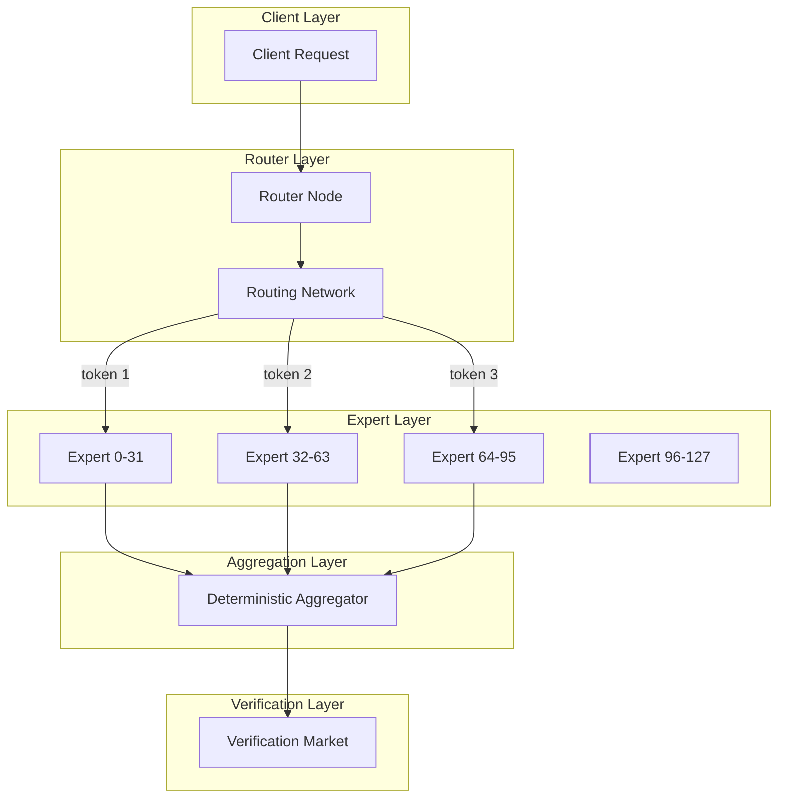
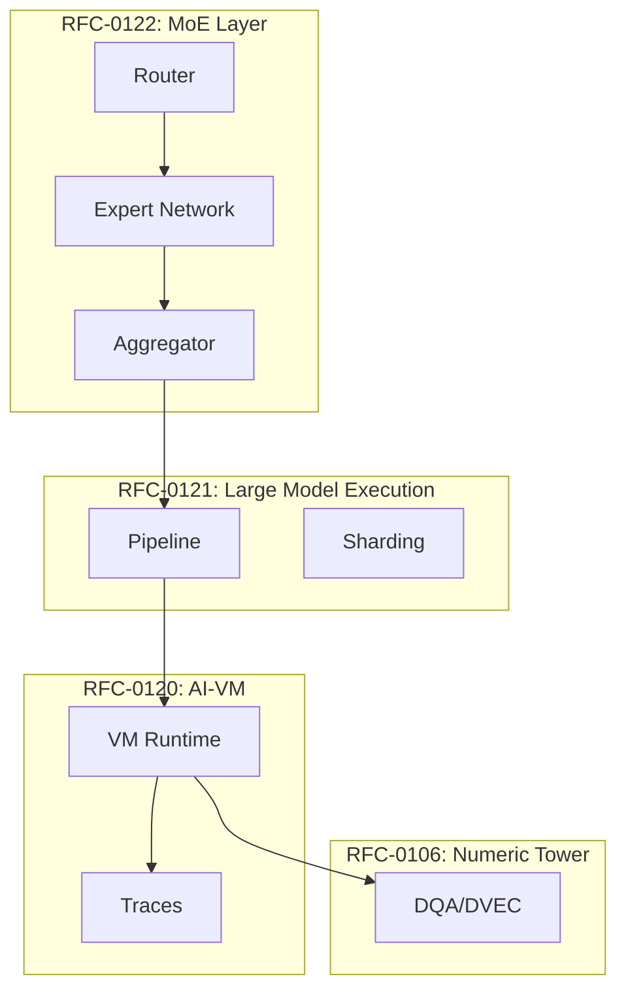

# RFC-0122 (AI Execution): Mixture-of-Experts for Decentralized Inference

## Status

Draft

> **Note:** This RFC was originally numbered RFC-0122 under the legacy numbering system. It remains at 0122 as it belongs to the AI Execution category.

## Summary

This RFC defines **Mixture-of-Experts (MoE) Integration** for the CipherOcto network — enabling efficient execution of models with hundreds of billions to trillions of parameters by activating only a small subset of specialized sub-networks ("experts") per request. The design builds on RFC-0120 (Deterministic AI-VM) and RFC-0121 (Verifiable Large Model Execution) to provide deterministic routing, verifiable expert computation, and cryptographically secure execution in a decentralized environment.

## Design Goals

| Goal                          | Target                           | Metric                         |
| ----------------------------- | -------------------------------- | ------------------------------ |
| **G1: Compute Efficiency**    | 20-40B active params per request | Active params <5% of total     |
| **G2: Deterministic Routing** | Reproducible expert selection    | Bit-exact across nodes         |
| **G3: Verifiability**         | Challenge any expert computation | Full trace verification        |
| **G4: Decentralization**      | Experts distributed across nodes | No single expert concentration |
| **G5: Load Balance**          | Fair expert utilization          | <10x variance in load          |

## Motivation

### The Problem: Massive Models, Limited Compute

trillion-parameter models require:

| Requirement                   | Traditional | MoE    |
| ----------------------------- | ----------- | ------ |
| Active parameters per request | 1T          | 20-40B |
| GPU memory                    | 80GB+       | 8GB    |
| Bandwidth per inference       | 100GB+      | 1GB    |

Traditional dense models activate ALL parameters for every token.

### The Solution: Sparse Activation

MoE activates only a fraction:

```
total parameters:      1 trillion
active per token:     ~20 billion
active percentage:     ~2%
```

This enables trillion-parameter models in decentralized environments.

### Why This Matters for CipherOcto

1. **Massive model support** — Models larger than any single node
2. **Efficient decentralization** — Experts run on different nodes
3. **Bandwidth savings** — Only active experts receive tokens
4. **Economic efficiency** — Pay only for executed computation

## Specification

### Architecture Overview



### MoE Layer Structure

An MoE layer consists of:

```rust
struct MoELayer {
    /// Layer identifier
    layer_id: u32,

    /// Number of experts
    num_experts: u32,

    /// Number of experts to activate per token
    top_k: u32,

    /// Expert capacity (max tokens per expert)
    capacity: u32,

    /// Expert descriptors
    experts: Vec<ExpertDescriptor>,
}

struct ExpertDescriptor {
    /// Expert identifier
    expert_id: u32,

    /// Node hosting this expert
    node: PublicKey,

    /// Commitment hash of expert weights
    weights_hash: Digest,

    /// Expert configuration
    config: ExpertConfig,
}

struct ExpertConfig {
    /// Hidden size
    hidden_size: u32,

    /// Intermediate size (FFN)
    intermediate_size: u32,

    /// Activation function
    activation: ActivationFunction,
}
```

### Expert Storage

Each expert is stored as a content-addressed object:

```rust
struct ExpertObject {
    /// Expert identifier
    expert_id: u32,

    /// First FFN layer weights (gate/up projection)
    w_gate: Tensor,

    /// First FFN layer weights (up projection)
    w_up: Tensor,

    /// Second FFN layer weights (down projection)
    w_down: Tensor,

    /// Optional bias terms
    biases: Option<ExpertBiases>,
}

/// Expert weights commitment
struct ExpertCommitment {
    expert_id: u32,
    weights_hash: Digest,
    config: ExpertConfig,
}
```

### Expert Merkle Tree

Experts form a Merkle tree for efficient commitment:

```rust
struct ExpertMerkleRoot {
    /// Root hash of expert tree
    root: Digest,

    /// Expert count
    num_experts: u32,

    /// Individual expert commitments
    expert_commitments: Vec<ExpertCommitment>,
}
```

### Deterministic Routing

The router must be deterministic across all nodes:

```rust
struct MoERouter {
    /// Router weights
    router_weights: Tensor,

    /// Routing algorithm
    algorithm: RoutingAlgorithm,
}

enum RoutingAlgorithm {
    /// Standard top-k softmax routing
    TopK { k: u32 },

    /// Hash-based routing (deterministic)
    Hash { num_experts: u32 },

    /// Expert choice routing
    ExpertChoice { capacity: u32 },
}
```

#### Deterministic Routing Algorithm

```rust
/// Deterministic top-k routing with fixed tie-breaking
fn route_deterministic(
    router: &MoERouter,
    token_embedding: &Tensor,
    top_k: u32,
) -> Vec<(u32, f32)> {
    // Step 1: Compute router scores
    // scores = token_embedding × router_weights^T
    let scores = matmul(token_embedding, &router.router_weights.transpose());

    // Step 2: Apply softmax with deterministic implementation
    let weights = softmax_deterministic(&scores);

    // Step 3: Select top-k with fixed tie-breaking
    let mut expert_weights: Vec<(u32, f32)> = weights
        .iter()
        .enumerate()
        .map(|(i, &w)| (i as u32, w))
        .collect();

    // Sort by weight descending, then by expert ID for determinism
    expert_weights.sort_by(|a, b| {
        let cmp = b.1.partial_cmp(&a.1).unwrap();
        if cmp == std::cmp::Ordering::Equal {
            a.0.cmp(&b.0)  // Tie-break by expert ID
        } else {
            cmp
        }
    });

    // Return top-k
    expert_weights.into_iter().take(top_k as usize).collect()
}

/// Deterministic softmax (per RFC-0120)
fn softmax_deterministic(x: &Tensor) -> Vec<f32> {
    // Fixed numerical approach for determinism
    let mut exp_values: Vec<f32> = x.iter().map(|&v| {
        // Deterministic exp approximation
        exp_approx(v)
    }).collect();

    // Fixed sum for normalization
    let sum: f32 = exp_values.iter().fold(0.0, |acc, &v| acc + v);

    // Fixed division order
    exp_values.iter().map(|&v| v / sum).collect()
}
```

### Token-to-Expert Mapping

Each token routes to specific experts:

```rust
struct TokenRouting {
    /// Token position
    token_id: u32,

    /// Selected experts (expert_id, weight)
    selected_experts: Vec<(u32, f32)>,

    /// Deterministic hash for verification
    routing_hash: Digest,
}
```

#### Example Routing

```
Batch: 1024 tokens
Experts: 128
Top-k: 2

Token 0 → expert 12 (0.7), expert 87 (0.3)
Token 1 → expert 5 (0.6), expert 6 (0.4)
Token 2 → expert 12 (0.8), expert 44 (0.2)
...
```

### Expert Execution

Each expert processes its assigned tokens:

```rust
struct ExpertExecution {
    /// Expert being executed
    expert_id: u32,

    /// Input tokens for this expert
    inputs: Vec<Tensor>,  // [token, hidden_size]

    /// Routing weights for each token
    weights: Vec<f32>,

    /// Output tensors
    outputs: Vec<Tensor>,
}

impl ExpertExecution {
    /// Execute expert feed-forward network
    fn execute(
        expert: &ExpertObject,
        inputs: &[Tensor],
    ) -> Result<Vec<Tensor>> {
        let mut outputs = Vec::new();

        for input in inputs {
            // Gate projection: gate = x × w_gate
            let gate = matmul(input, &expert.w_gate);

            // Up projection: up = x × w_up
            let up = matmul(input, &expert.w_up);

            // Element-wise multiplication: gate × up
            let intermediate = elementwise_mul(&gate, &up);

            // Activation (deterministic per RFC-0120)
            let activated = activation_deterministic(
                &intermediate,
                expert.config.activation,
            );

            // Down projection: output = activated × w_down
            let output = matmul(&activated, &expert.w_down);

            outputs.push(output);
        }

        Ok(outputs)
    }
}
```

### Deterministic Aggregation

After expert computation, results aggregate deterministically:

```rust
struct MoEAggregation {
    /// Aggregation method
    method: AggregationMethod,
}

enum AggregationMethod {
    /// Weighted sum of expert outputs
    WeightedSum,

    /// Concatenation then linear
    ConcatLinear,
}

/// Deterministic aggregation
fn aggregate_deterministic(
    expert_outputs: Vec<(Tensor, f32)>,
    method: &AggregationMethod,
) -> Tensor {
    match method {
        AggregationMethod::WeightedSum => {
            // Initialize with zero
            let mut result = Tensor::zeros(expert_outputs[0].0.shape());

            // Fixed order aggregation
            for (output, weight) in expert_outputs {
                // output_scaled = output × weight
                let scaled = scalar_mul(&output, weight);

                // result = result + output_scaled
                result = elementwise_add(&result, &scaled);
            }

            result
        }
        AggregationMethod::ConcatLinear => {
            // Concatenate in fixed order
            let concatenated = concatenate(
                &expert_outputs.iter().map(|(o, _)| o).collect(),
                /*axis=*/ 0,
            );

            // Apply linear transformation (deterministic)
            linear_transform(&concatenated)
        }
    }
}
```

### Decentralized Expert Distribution

Experts distribute across the network:

```rust
struct ExpertNetwork {
    /// All experts in the MoE layer
    experts: HashMap<u32, ExpertNode>,

    /// Router configuration
    router: MoERouter,
}

struct ExpertNode {
    /// Node identity
    node_id: PublicKey,

    /// Experts hosted
    expert_ids: Vec<u32>,

    /// Current load
    current_load: u32,

    /// Maximum capacity
    capacity: u32,

    /// Staked tokens
    stake: TokenAmount,
}
```

### Expert Discovery and Routing

```rust
/// Discover experts for a token batch
fn route_tokens(
    network: &ExpertNetwork,
    embeddings: &[Tensor],
    top_k: u32,
) -> Vec<BatchRouting> {
    let mut batch_routing = Vec::new();

    for (token_id, embedding) in embeddings.iter().enumerate() {
        // Deterministic routing
        let selected = route_deterministic(
            &network.router,
            embedding,
            top_k,
        );

        // Map expert IDs to nodes
        let expert_nodes: Vec<(PublicKey, f32)> = selected
            .iter()
            .map(|(expert_id, weight)| {
                let node = &network.experts[expert_id];
                (node.node_id, *weight)
            })
            .collect();

        batch_routing.push(BatchRouting {
            token_id: token_id as u32,
            expert_assignments: expert_nodes,
            routing_hash: hash_routing(embedding, &selected),
        });
    }

    batch_routing
}
```

### Verification Strategy

Verification markets can challenge routing or execution:

```rust
struct MoEVerification {
    /// Challenge types
    challenge_types: Vec<MoEChallengeType>,
}

enum MoEChallengeType {
    /// Challenge routing decision
    RoutingChallenge {
        token_id: u32,
        claimed_experts: Vec<u32>,
    },

    /// Challenge expert computation
    ExpertChallenge {
        expert_id: u32,
        token_id: u32,
        claimed_output: Digest,
    },

    /// Challenge aggregation
    AggregationChallenge {
        token_id: u32,
        claimed_output: Digest,
    },
}

/// Routing verification
fn verify_routing(
    token_embedding: &Tensor,
    claimed_routing: &TokenRouting,
    router: &MoERouter,
) -> bool {
    // Recompute routing deterministically
    let computed = route_deterministic(
        router,
        token_embedding,
        claimed_routing.selected_experts.len() as u32,
    );

    // Compare
    computed == claimed_routing.selected_experts
}

/// Expert computation verification
fn verify_expert(
    expert: &ExpertObject,
    input: &Tensor,
    claimed_output: &Tensor,
) -> bool {
    // Execute expert deterministically (RFC-0120)
    let outputs = ExpertExecution::execute(expert, &[input.clone()])?;

    // Compare outputs
    outputs[0].bit_equal(claimed_output)
}
```

### Load Balancing

To prevent expert overload:

```rust
struct LoadBalancer {
    /// Target load per expert
    target_load: f32,

    /// Load balancing loss weight
    loss_weight: f32,
}

impl LoadBalancer {
    /// Compute load balancing loss
    fn load_balance_loss(
        expert_loads: &[u32],
        routing_weights: &[f32],
    ) -> f32 {
        // Mean load
        let mean_load: f32 = expert_loads.iter().sum::<u32>() as f32
            / expert_loads.len() as f32;

        // Load variance (encourages equal distribution)
        let variance: f32 = expert_loads
            .iter()
            .map(|&l| (l as f32 - mean_load).powi(2))
            .sum::<f32>()
            / expert_loads.len() as f32;

        // Routing weights contribution
        let routing_bias: f32 = routing_weights.iter().sum::<f32>()
            / routing_weights.len() as f32;

        variance + self.loss_weight * routing_bias
    }

    /// Adjust routing for load
    fn adjust_routing(
        current: &mut Vec<(u32, f32)>,
        expert_loads: &[u32],
    ) {
        // Sort experts by current load
        let mut expert_load: Vec<(u32, u32)> = expert_loads
            .iter()
            .enumerate()
            .map(|(i, &l)| (i as u32, l))
            .collect();

        expert_load.sort_by_key(|(_, load)| *load);

        // Prefer less-loaded experts when weights are similar
        // (deterministic based on expert ID as tie-breaker)
        current.sort_by(|a, b| {
            let load_a = expert_loads[a.0 as usize];
            let load_b = expert_loads[b.0 as usize];

            if (load_a as f32 - load_b as f32).abs() < 10.0 {
                a.0.cmp(&b.0)  // Tie-break
            } else if load_a < load_b {
                std::cmp::Ordering::Less
            } else {
                std::cmp::Ordering::Greater
            }
        });
    }
}
```

### Fault Tolerance

If an expert node fails:

```rust
struct MoEFaultTolerance {
    /// Number of backup experts per routing
    num_backups: u32,

    /// Fallback strategy
    fallback: FallbackStrategy,
}

enum FallbackStrategy {
    /// Reroute to next-best expert
    Reroute,

    /// Use dedicated fallback experts
    FallbackExperts,

    /// Reject token
    Reject,
}

impl MoEFaultTolerance {
    /// Handle expert failure
    fn handle_failure(
        routing: &mut TokenRouting,
        failed_expert: u32,
        network: &ExpertNetwork,
    ) {
        // Remove failed expert
        routing.selected_experts.retain(|(id, _)| *id != failed_expert);

        // Add backup expert (deterministic selection)
        let backup = select_backup_expert(
            routing.token_id,
            &routing.selected_experts,
            network,
            self.num_backups,
        );

        routing.selected_experts.push(backup);
    }

    /// Deterministic backup selection
    fn select_backup_expert(
        token_id: u32,
        current: &[(u32, f32)],
        network: &ExpertNetwork,
        num_backups: u32,
    ) -> (u32, f32) {
        // Sort available experts by ID for determinism
        let mut available: Vec<u32> = network.experts
            .keys()
            .cloned()
            .filter(|id| !current.iter().any(|(c, _)| *c == *id))
            .collect();

        available.sort();

        // Select based on token_id for determinism
        let idx = (token_id as usize) % available.len();
        let expert_id = available[idx];

        // Default weight for backup
        (expert_id, 0.5)  // Lower weight than primary
    }
}
```

### Economic Security

Expert nodes stake tokens to participate:

```rust
struct ExpertEconomics {
    /// Minimum stake per expert
    min_stake: TokenAmount,

    /// Slash fraction for fraud
    slash_fraction: f64,

    /// Execution reward per token
    token_reward: TokenAmount,
}

impl ExpertEconomics {
    /// Verify stake is sufficient
    fn verify_stake(node: &ExpertNode, params: &ExpertEconomics) -> bool {
        node.stake >= params.min_stake
    }

    /// Slash for fraudulent computation
    fn slash(node: &mut ExpertNode, params: &ExpertEconomics) {
        let slash_amount = node.stake * params.slash_fraction;
        node.stake -= slash_amount;

        // Notify verification market
        emit_slash_event(node.node_id, slash_amount);
    }
}
```

## Integration with CipherOcto Stack



### Integration Points

| RFC      | Integration                         |
| -------- | ----------------------------------- |
| RFC-0106 | DQA types for expert weights        |
| RFC-0120 | Deterministic operators, VM, traces |
| RFC-0121 | Pipeline integration, sharding      |
| RFC-0115 | Verification market challenges      |

## Performance Targets

| Metric                      | Target       | Notes        |
| --------------------------- | ------------ | ------------ |
| Active parameters           | <5% of total | Per token    |
| Routing latency             | <1ms         | Per token    |
| Expert execution            | <10ms        | Per expert   |
| Aggregation latency         | <1ms         | Per token    |
| Expert capacity utilization | >80%         | Network-wide |

## Adversarial Review

| Threat                    | Impact | Mitigation                                  |
| ------------------------- | ------ | ------------------------------------------- |
| **Routing manipulation**  | High   | Deterministic routing, trace verification   |
| **Expert collusion**      | High   | Random expert selection, stake requirements |
| **Load imbalance attack** | Medium | Load balancing, capacity limits             |
| **Expert forgery**        | High   | Merkle commitments, challenge protocol      |
| **Freeloading**           | Medium | Verification sampling                       |

## Alternatives Considered

| Approach           | Pros                  | Cons                       |
| ------------------ | --------------------- | -------------------------- |
| **Dense models**   | Simple                | Cannot scale to 1T+        |
| **Static routing** | Deterministic         | Poor load balance          |
| **This approach**  | Scalable + verifiable | Implementation complexity  |
| **Expert caching** | Fast                  | Memory vs latency tradeoff |

## Implementation Phases

### Phase 1: Core MoE

- [ ] MoE layer structure
- [ ] Expert storage format
- [ ] Deterministic router
- [ ] Basic aggregation

### Phase 2: Distribution

- [ ] Expert network management
- [ ] Routing protocol
- [ ] Token-to-expert mapping

### Phase 3: Verification

- [ ] Routing verification
- [ ] Expert computation verification
- [ ] Aggregation verification

### Phase 4: Optimization

- [ ] Load balancing
- [ ] Fault tolerance
- [ ] Bandwidth optimization

## Future Work

- F1: Hierarchical MoE (multiple router layers)
- F2: Dynamic expert creation
- F3: Cross-shard expert routing
- F4: Expert specialization via learning

## Rationale

### Why Top-k Routing?

Top-k provides the best balance:

- **Sparsity** — Only k experts activate
- **Expressiveness** — Multiple experts can contribute
- **Simplicity** — Straightforward to verify

### Why Not Hash Routing?

Hash routing is simpler but:

- Cannot learn which experts are best
- May route to underqualified experts
- Less adaptable to input distribution

### Why Deterministic?

In decentralized verification:

- All nodes must agree on routing
- Challenges require reproducing decisions
- Economic stakes require no ambiguity

## Related RFCs

- RFC-0106 (Numeric/Math): Deterministic Numeric Tower
- RFC-0115 (Economics): Probabilistic Verification Markets
- RFC-0120 (AI Execution): Deterministic AI Virtual Machine
- RFC-0121 (AI Execution): Verifiable Large Model Execution
- RFC-0123 (AI Execution): Scalable Verifiable AI Execution

## Related Use Cases

- [Hybrid AI-Blockchain Runtime](../../docs/use-cases/hybrid-ai-blockchain-runtime.md)
- [Verifiable AI Agents for DeFi](../../docs/use-cases/verifiable-ai-agents-defi.md)

## Appendices

### A. Example: 1T Parameter MoE Model

```
Model Configuration:
- Total parameters: 1 trillion
- Expert count: 256
- Expert size: 4B params each
- Top-k: 2 experts per token

Active compute per token:
- 2 × 4B = 8B parameters
- ~0.8% of total

Network:
- 256 expert nodes (each hosts 1 expert)
- 1 router node
- Verification market

Latency estimate:
- Routing: 0.1ms
- Expert execution: 5ms
- Aggregation: 0.5ms
- Total: ~6ms per token
```

### B. Routing Algorithm Comparison

| Algorithm     | Deterministic        | Load Balance | Learnable |
| ------------- | -------------------- | ------------ | --------- |
| Top-k         | Yes (with tie-break) | Good         | Yes       |
| Hash          | Yes                  | Random       | No        |
| Expert Choice | Yes                  | Perfect      | No        |
| Noise         | No                   | Good         | No        |

### C. Expert Failure Recovery

```
Scenario: Expert 42 fails mid-batch

Recovery:
1. Detect failure (timeout)
2. Remove from current routing
3. Select backup expert (deterministic)
4. Re-execute affected tokens
5. Update routing state
6. Slash failed node (if malicious)

Time to recover: ~50ms
```

---

**Version:** 1.0
**Submission Date:** 2026-03-07
**Last Updated:** 2026-03-07
