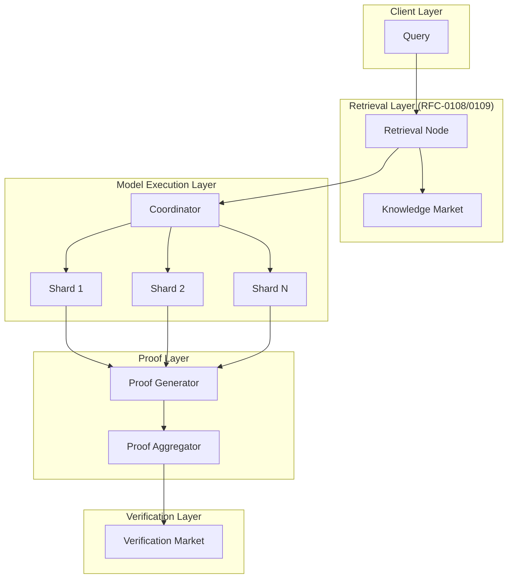
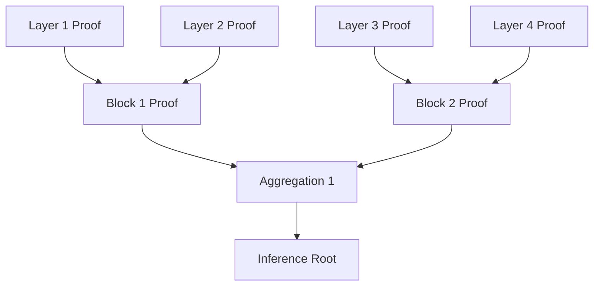
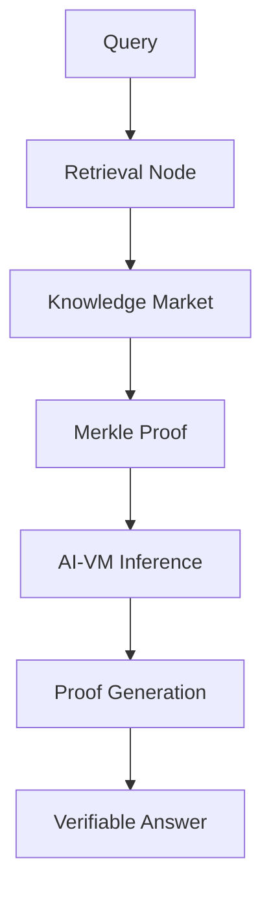
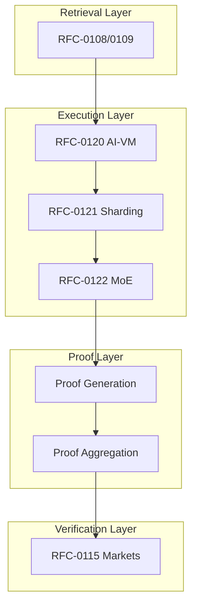

# RFC-0123: Scalable Verifiable AI Execution

## Status

Draft

## Summary

This RFC defines the **Scalable Verifiable AI Execution** architecture — a unified system combining deterministic AI-VM execution (RFC-0120), model sharding (RFC-0121), mixture-of-experts (RFC-0122), and succinct proofs to enable trillion-parameter model inference without requiring any single node to store the full model. The architecture integrates with CipherOcto's verification markets, retrieval layer, and knowledge market to produce end-to-end verifiable AI outputs.

## Design Goals

| Goal                  | Target                          | Metric                 |
| --------------------- | ------------------------------- | ---------------------- |
| **G1: Scalability**   | Support 1T+ parameter models    | Per-node storage <10GB |
| **G2: Verifiability** | Millisecond verification        | O(log n) proof size    |
| **G3: Composability** | Integrate all RFCs              | Single unified flow    |
| **G4: Determinism**   | Bit-exact across nodes          | RFC-0120 compliance    |
| **G5: End-to-End**    | From query to verifiable answer | Complete proof package |

## Motivation

### The Problem: Massive Models, Limited Resources

trillion-parameter models require:

| Resource   | Requirement             |
| ---------- | ----------------------- |
| Storage    | ~2TB (FP16)             |
| GPU Memory | 80GB+ per inference     |
| Bandwidth  | 100GB+ per forward pass |

Traditional approaches require full model replication — impossible for decentralized networks.

### The Solution: Commitment + Sharding + Proofs

The architecture combines four primitives:

```
1. Deterministic AI-VM (RFC-0120)
   ↓
2. Model Sharding (RFC-0121)
   ↓
3. Mixture-of-Experts (RFC-0122)
   ↓
4. Succinct Proofs
```

This achieves:

- Compute distributed across nodes
- Storage minimal per node
- Verification cheap (milliseconds)

### Why This Matters for CipherOcto

1. **Massive model support** — Trillion-parameter models without centralization
2. **Complete verifiability** — From retrieval to output
3. **Economic efficiency** — Pay only for executed computation
4. **Integration** — Leverages existing RFCs

## Specification

### Unified Architecture



### Layer 1: Parameter Commitment

The full model is represented as cryptographic commitments:

```rust
struct ModelCommitment {
    /// Merkle root of all parameters
    model_root: Digest,

    /// Total parameter count
    param_count: u64,

    /// Shard configuration
    shards: Vec<ShardDescriptor>,

    /// Expert configuration (if MoE)
    expert_root: Option<Digest>,
}
```

#### Shard Structure

```rust
struct ParameterShard {
    /// Shard identifier
    shard_id: u32,

    /// Layer range
    layer_start: u32,
    layer_end: u32,

    /// Compressed weights (DQA per RFC-0106)
    weights: Vec<u8>,

    /// Merkle proof to model root
    proof: Vec<Digest>,
}

struct ShardDescriptor {
    shard_id: u32,
    layer_range: (u32, u32),
    param_count: u64,
    shard_hash: Digest,
    storage_node: PublicKey,
}
```

### Layer 2: Model Sharding Strategies

Multiple sharding strategies combine for maximum efficiency:

```rust
enum ShardingStrategy {
    /// Layer-by-layer pipeline
    LayerSharding {
        layers_per_shard: u32,
    },

    /// Tensor parallelism
    TensorSharding {
        sharding_dimensions: Vec<u32>,
    },

    /// Expert distribution (MoE)
    ExpertSharding {
        experts_per_node: u32,
        top_k: u32,
    },

    /// KV cache sharding for inference
    KVCacheSharding {
        cache_shards: u32,
    },
}
```

#### Combined Strategy for Trillion-Parameter Models

```rust
struct TrillionModelConfig {
    /// Primary: Mixture-of-Experts
    moe: MoEConfig {
        num_experts: 256,
        expert_size: 4_000_000_000,  // 4B params
        top_k: 2,
    },

    /// Secondary: Layer sharding within experts
    layer_sharding: LayerSharding {
        layers_per_expert_group: 4,
    },

    /// Tertiary: Tensor sharding within layers
    tensor_sharding: TensorSharding {
        sharding_dimensions: vec![1, 2],  // TP=4
    },
}

// Total: 256 × 4B × 4 × 4 = ~1T params
```

### Layer 3: Deterministic AI-VM Execution

Each shard executes via the AI-VM with deterministic operators:

```rust
/// AI-VM Instruction Set (40 Opcodes)
enum VMOpcode {
    // =====================
    // Memory Operations (4)
    // =====================
    LOAD_OBJECT,      // Load object by digest
    STORE_OBJECT,     // Store object, return digest
    ALLOC_TENSOR,     // Allocate tensor
    FREE_TENSOR,      // Deallocate tensor

    // =====================
    // Matrix Operations (4)
    // =====================
    MATMUL,           // Matrix multiplication
    MATMUL_ADD,       // Multiply-accumulate
    TRANSPOSE,        // Matrix transpose
    RESHAPE,          // Reshape tensor

    // =====================
    // Convolution (3)
    // =====================
    CONV1D,           // 1D convolution
    CONV2D,           // 2D convolution
    CONV3D,           // 3D convolution

    // =====================
    // Activation Functions (6)
    // =====================
    RELU,             // ReLU(x) = max(0, x)
    GELU,             // GELU approximation
    SIGMOID,          // Sigmoid(x) = 1/(1+exp(-x))
    TANH,             // Hyperbolic tangent
    SILU,             // SiLU (Swish): x * sigmoid(x)
    LEAKY_RELU,       // Leaky ReLU

    // =====================
    // Normalization (3)
    // =====================
    LAYERNORM,        // Layer normalization
    RMSNORM,          // RMS normalization
    BATCHNORM,        // Batch normalization

    // =====================
    // Attention (4)
    // =====================
    ATTENTION,        // Multi-head attention
    ATTENTION_SCORE,  // QK^T computation
    SOFTMAX,          // Softmax operation
    CAUSAL_MASK,      // Apply causal mask

    // =====================
    // Vector Operations (4)
    // =====================
    VECTOR_SEARCH,    // Similarity search
    TOP_K,            // Top-k selection
    SORT,             // Tensor sorting
    GATHER,           // Gather by indices

    // =====================
    // Element-wise (4)
    // =====================
    ADD,              // Element-wise addition
    MUL,              // Element-wise multiplication
    DIV,              // Element-wise division
    POW,              // Element-wise power

    // =====================
    // Reduction (3)
    // =====================
    SUM,              // Sum reduction
    MEAN,             // Mean reduction
    MAX,              // Max reduction

    // =====================
    // MoE Specific (2)
    // =====================
    MOE_ROUTER,       // Expert routing
    MOE_AGGREGATE,    // Expert output combination

    // =====================
    // Verification (2)
    // =====================
    VERIFY_MERKLE,    // Verify Merkle proof
    COMMIT_STATE,      // Commit state root
}
```

#### Deterministic Operator Semantics

Each operator follows RFC-0120's deterministic rules:

```rust
/// Deterministic MATMUL - fixed loop order
///
/// Order: i → j → k (canonical)
/// Reduction: strict left-to-right accumulation
fn op_matmul(lhs: &Tensor, rhs: &Tensor) -> Tensor {
    let (m, k) = lhs.shape();
    let (k2, n) = rhs.shape();
    assert_eq!(k, k2);

    let mut output = Tensor::zeros(&[m, n]);

    // Fixed canonical order
    for i in 0..m {
        for j in 0..n {
            let mut sum = Scalar::zero();
            for k_idx in 0..k {
                // Strict left-to-right reduction
                sum = sum + lhs[[i, k_idx]] * rhs[[k_idx, j]];
            }
            output[[i, j]] = sum;
        }
    }

    output
}

/// Deterministic SOFTMAX - fixed numerical approach
fn op_softmax(input: &Tensor, axis: i32) -> Tensor {
    // Step 1: Find max per row (fixed order)
    let max_val = input.iter().fold(
        Scalar::min_value(),
        |acc, &x| if x > acc { x } else { acc }
    );

    // Step 2: Compute exp(x - max) with fixed sum
    let exp_values: Vec<Scalar> = input.iter()
        .map(|&v| (v - max_val).exp())
        .collect();

    // Step 3: Sum with fixed order
    let sum: Scalar = exp_values.iter()
        .fold(Scalar::zero(), |acc, &v| acc + v);

    // Step 4: Divide with fixed order
    exp_values.iter()
        .map(|&v| v / sum)
        .collect()
}

/// Deterministic ATTENTION - canonical implementation
fn op_attention(
    q: &Tensor,
    k: &Tensor,
    v: &Tensor,
    num_heads: u32,
) -> Tensor {
    // 1. QK^T with deterministic matmul
    let scores = matmul(q, &k.transpose());

    // 2. Scale by 1/sqrt(d_k)
    let scale = Scalar::from_f32(1.0 / f32::sqrt(num_heads as f32));
    let scaled = mul_scalar(&scores, scale);

    // 3. Deterministic softmax
    let weights = op_softmax(&scaled, -1);

    // 4. Deterministic weighted sum
    matmul(&weights, v)
}
```

### Layer 4: Proof-Generating Workers

Workers execute and generate proofs:

```rust
struct ProofGeneratingWorker {
    /// Node identity
    node_id: PublicKey,

    /// Assigned shards
    assigned_shards: Vec<u32>,

    /// Proof generation capability
    proof_type: ProofType,
}

enum ProofType {
    /// Fast fraud proofs (per-execution)
    FraudProof,

    /// Full STARK proofs (optional)
    STARKProof,

    /// No proofs (lightweight workers)
    None,
}

struct WorkerOutput {
    /// Execution result
    result: Tensor,

    /// Shard IDs used
    shard_ids: Vec<u32>,

    /// Merkle proofs for weights used
    weight_proofs: Vec<MerkleProof>,

    /// Execution trace hash
    trace_hash: Digest,

    /// Proof (if generated)
    proof: Option<Vec<u8>>,
}
```

### Layer 5: Verifier Nodes

Validators verify without recomputing:

```rust
struct VerifierNode {
    /// Verification mode
    mode: VerificationMode,

    /// Challenge rate (probabilistic)
    challenge_rate: f64,
}

enum VerificationMode {
    /// Verify parameter commitments only
    CommitmentOnly,

    /// Verify execution traces
    TraceVerification,

    /// Verify full proofs
    FullProof,

    /// Probabilistic sampling
    Probabilistic,
}

impl VerifierNode {
    fn verify(output: &WorkerOutput, challenge: &Challenge) -> VerificationResult {
        match challenge.challenge_type {
            ChallengeType::ParameterIntegrity => {
                // Verify Merkle proofs for weights
                for proof in &output.weight_proofs {
                    if !verify_merkle_proof(proof) {
                        return VerificationResult::Invalid;
                    }
                }
                VerificationResult::Valid
            }

            ChallengeType::ExecutionTrace => {
                // Hash trace, compare to claimed
                let computed_hash = hash_trace(&output.trace);
                if computed_hash != output.trace_hash {
                    return VerificationResult::Invalid;
                }
                VerificationResult::Valid
            }

            ChallengeType::FullProof => {
                // Verify STARK proof
                verify_stark_proof(&output.proof)
            }

            ChallengeType::RandomSample => {
                // Recompute random subset
                self.verify_sample(output, challenge)
            }
        }
    }
}
```

### Layer 6: Probabilistic Verification

Random challenges ensure honest behavior:

```rust
struct ProbabilisticVerification {
    /// Challenge probability per execution
    challenge_probability: f64,

    /// Verification depth
    depth: VerificationDepth,
}

enum VerificationDepth {
    /// Verify single operator
    SingleOperator,

    /// Verify entire layer
    FullLayer,

    /// Verify full inference
    FullInference,
}

/// Challenge protocol
struct Challenge {
    /// Execution being challenged
    execution_id: Digest,

    /// Challenge type
    challenge_type: ChallengeType,

    /// Specific operator/layer (if applicable)
    target: Option<ChallengeTarget>,
}

enum ChallengeType {
    /// Random audit
    RandomAudit,

    /// Client dispute
    ClientDispute,

    /// Anomaly detection
    AnomalyDetected,
}
```

### Layer 7: Recursive Proof Aggregation

Large models aggregate proofs recursively:



```rust
struct RecursiveProofAggregator {
    /// Aggregation factor per level
    block_size: usize,

    /// Proof system
    proof_system: ProofSystem,
}

impl RecursiveProofAggregator {
    /// Aggregate layer proofs into block proof
    fn aggregate_block(layer_proofs: &[Proof]) -> Proof {
        // Compute block hash
        let block_inputs: Vec<Digest> = layer_proofs
            .iter()
            .map(|p| p.hash())
            .collect();

        let block_hash = merkle_root(&block_inputs);

        // Generate block proof
        self.proof_system.prove(&[block_hash])
    }

    /// Aggregate block proofs into inference proof
    fn aggregate_inference(block_proofs: &[Proof]) -> Proof {
        let inference_hash = merkle_root(&block_proofs.iter()
            .map(|p| p.hash())
            .collect::<Vec<_>>());

        self.proof_system.prove(&[inference_hash])
    }
}
```

### Layer 8: Model Execution Commitments

Every inference produces a deterministic commitment:

```rust
struct InferenceCommitment {
    /// Hash of all inputs
    input_hash: Digest,

    /// Model commitment used
    model_root: Digest,

    /// Execution trace root
    trace_root: Digest,

    /// Final output hash
    output_hash: Digest,

    /// Proof (if generated)
    proof: Option<Digest>,
}

impl InferenceCommitment {
    fn compute(
        model: &ModelCommitment,
        input: &Tensor,
        trace: &ExecutionTrace,
        output: &Tensor,
    ) -> Self {
        let input_hash = hash(input);
        let output_hash = hash(output);
        let trace_root = compute_trace_root(trace);

        Self {
            input_hash,
            model_root: model.model_root,
            trace_root,
            output_hash,
            proof: None,
        }
    }
}
```

### Layer 9: Integration with Retrieval Layer

The verifiable RAG pipeline integrates naturally:



```rust
struct VerifiableAnswer {
    /// The answer text
    answer: String,

    /// Retrieval proofs
    retrieval_proofs: Vec<RetrievalProof>,

    /// Model execution commitment
    inference_commitment: InferenceCommitment,

    /// Proof package
    proof: Option<ProofPackage>,
}

struct RetrievalProof {
    /// Dataset ID
    dataset_id: Digest,

    /// Retrieved chunk hashes
    chunk_hashes: Vec<Digest>,

    /// Merkle proof to dataset root
    dataset_proof: MerkleProof,
}
```

### Layer 10: Knowledge Market Integration

Datasets become verifiable training inputs:

```rust
struct VerifiableTrainingPackage {
    /// Dataset commitment
    dataset_root: Digest,

    /// Training configuration
    config: TrainingConfig,

    /// Gradient proof
    gradient_proof: Option<Proof>,

    /// Weight update commitment
    weight_delta_hash: Digest,
}
```

## Integration with CipherOcto Stack



### Integration Points

| RFC      | Integration          |
| -------- | -------------------- |
| RFC-0106 | DQA numeric types    |
| RFC-0108 | Retrieval proofs     |
| RFC-0109 | Knowledge Market     |
| RFC-0115 | Verification markets |
| RFC-0120 | AI-VM operators      |
| RFC-0121 | Model sharding       |
| RFC-0122 | MoE routing          |

## Performance Targets

| Metric                   | Target     | Notes                 |
| ------------------------ | ---------- | --------------------- |
| Model size               | 1T+ params | Via sharding          |
| Per-node storage         | <10GB      | Only active shards    |
| Inference latency        | <10s       | End-to-end            |
| Verification time        | <100ms     | Probabilistic         |
| Proof size               | <100KB     | Recursive aggregation |
| Final proof verification | <10ms      | Single hash check     |

## Adversarial Review

| Threat                   | Impact | Mitigation                       |
| ------------------------ | ------ | -------------------------------- |
| **Colluding workers**    | High   | Random scheduling, diverse nodes |
| **Proof forgery**        | High   | Verification market challenges   |
| **Parameter tampering**  | High   | Merkle commitments               |
| **Free riding**          | Medium | Stake requirements               |
| **Verification evasion** | Medium | Probabilistic sampling           |

## Alternatives Considered

| Approach             | Pros                | Cons                     |
| -------------------- | ------------------- | ------------------------ |
| **Full replication** | Simple verification | Impossible for 1T models |
| **ZK-only**          | Strong security     | Prover cost too high     |
| **This approach**    | Balanced + scalable | Implementation scope     |
| **Trusted hardware** | Fast                | Single point of trust    |

## Implementation Phases

### Phase 1: Core Integration

- [ ] Unified execution flow
- [ ] Commitment structures
- [ ] Basic verification

### Phase 2: Proof Integration

- [ ] Proof generation
- [ ] Recursive aggregation
- [ ] Proof verification

### Phase 3: Optimization

- [ ] Proof compression
- [ ] Batch verification
- [ ] Performance tuning

## Rationale

### Why Combine All Four Primitives?

Each primitive addresses different challenges:

| Primitive | Addresses               |
| --------- | ----------------------- |
| RFC-0120  | Deterministic execution |
| RFC-0121  | Storage scaling         |
| RFC-0122  | Compute efficiency      |
| Proofs    | Verification            |

Together, they enable trillion-parameter verifiable AI.

### Why Not ZK-Only?

ZK proof generation for 1T-parameter inference would require:

- Specialized hardware
- Minutes to hours per proof
- High cost

Our approach uses:

- Probabilistic verification for most cases
- Optional STARK proofs for critical workloads

## Related RFCs

- RFC-0106: Deterministic Numeric Tower
- RFC-0108: Verifiable AI Retrieval
- RFC-0109: Retrieval Architecture
- RFC-0115: Probabilistic Verification Markets
- RFC-0120: Deterministic AI Virtual Machine
- RFC-0121: Verifiable Large Model Execution
- RFC-0122: Mixture-of-Experts
- RFC-0124: Proof Market and Hierarchical Inference Network
- RFC-0130: Proof-of-Inference Consensus
- RFC-0131: Deterministic Transformer Circuit

## Related Use Cases

- [Hybrid AI-Blockchain Runtime](../../docs/use-cases/hybrid-ai-blockchain-runtime.md)
- [Verifiable AI Agents for DeFi](../../docs/use-cases/verifiable-ai-agents-defi.md)

## Appendices

### A. Complete Opcode Reference

| Opcode       | Operands                     | Output Shape        | Deterministic Notes      |
| ------------ | ---------------------------- | ------------------- | ------------------------ |
| LOAD_OBJECT  | (digest)                     | (\*,)               | -                        |
| STORE_OBJECT | (data)                       | (digest)            | -                        |
| MATMUL       | (a, b)                       | (m, n)              | Fixed i→j→k order        |
| CONV2D       | (input, kernel, stride, pad) | (b, c, h, w)        | Fixed algorithm          |
| RELU         | (x)                          | (x.shape)           | Exact max(0,x)           |
| GELU         | (x)                          | (x.shape)           | Polynomial approx        |
| ATTENTION    | (q, k, v, heads)             | (b, n, d)           | Canonical implementation |
| SOFTMAX      | (x, axis)                    | (x.shape)           | Fixed numerical approach |
| MOE_ROUTER   | (x, router_weights, k)       | (token, expert_ids) | Deterministic top-k      |

### B. Latency Breakdown (1T Model)

| Stage              | Latency   |
| ------------------ | --------- |
| Retrieval          | 10-100ms  |
| Shard loading      | 50-200ms  |
| Pipeline execution | 1-5s      |
| Proof generation   | 1-10s     |
| Aggregation        | 100-500ms |
| **Total**          | **3-20s** |

With probabilistic verification:

- Verification: <100ms
- End-to-end: <10s typical

---

**Version:** 1.0
**Submission Date:** 2026-03-07
**Last Updated:** 2026-03-07
