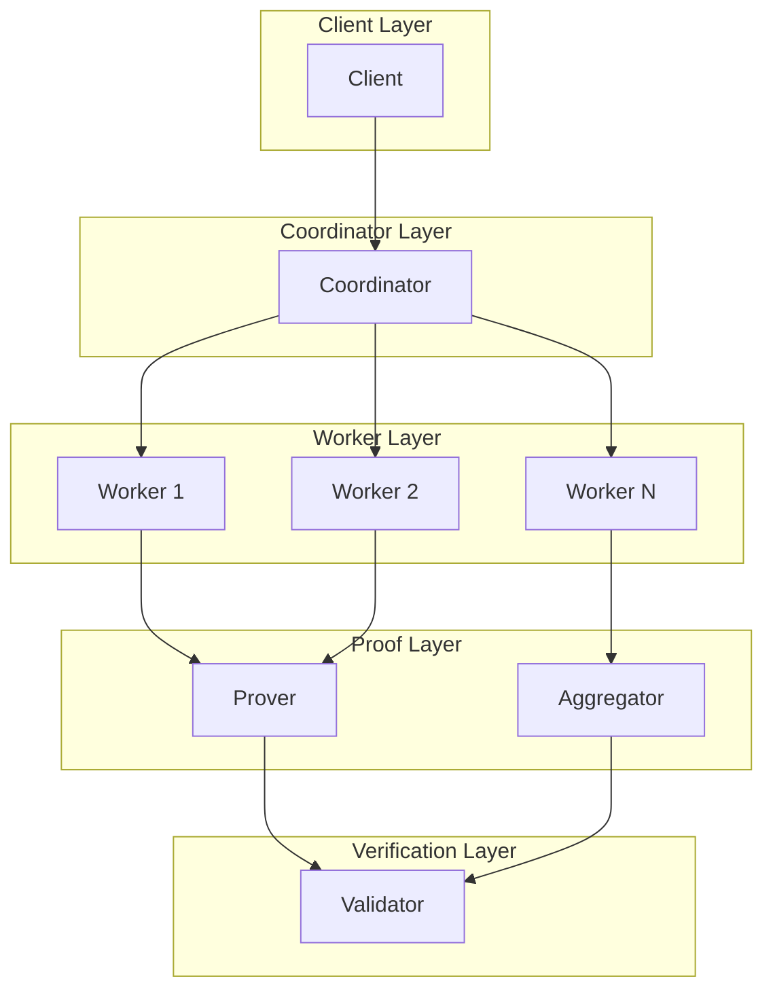
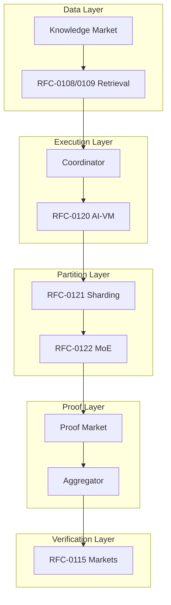

# RFC-0124: Proof Market and Hierarchical Inference Network

## Status

Draft

## Summary

This RFC defines the **Proof Market and Hierarchical Inference Network** — a network architecture enabling decentralized execution of frontier-scale AI models (100B–1T+ parameters) across hundreds to thousands of specialized nodes. The architecture separates inference execution from proof generation, uses a competitive market for proof production, and provides configurable verification levels (optimistic, ZK-verified, audited) to balance latency, cost, and security.

## Design Goals

| Goal                | Target                         | Metric                    |
| ------------------- | ------------------------------ | ------------------------- |
| **G1: Scale**       | Support 1T+ parameter models   | 500-1000 workers          |
| **G2: Latency**     | Inference <5s for large models | End-to-end                |
| **G3: Efficiency**  | Minimal validator compute      | <1 GPU-hour per inference |
| **G4: Flexibility** | Three verification tiers       | Client choice             |
| **G5: Economics**   | Market-driven proof pricing    | Auction mechanism         |

## Motivation

### The Problem: Frontier Models Need Clusters

trillion-parameter models require:

| Resource  | Requirement          |
| --------- | -------------------- |
| Compute   | 1000+ GPUs           |
| Storage   | 2TB+ per model       |
| Bandwidth | 100GB+ per inference |

No single node can run frontier models. Even decentralized networks cannot expect every node to replicate the full model.

### The Solution: Hierarchical + Market-Based

The architecture combines:

1. **Hierarchical execution** — Structured pipeline through specialized nodes
2. **Proof market** — Competitive proof generation
3. **Multiple verification tiers** — Client chooses security/latency tradeoff
4. **Economic incentives** — Stake-based security

### Why This Matters for CipherOcto

1. **Frontier model support** — GPT-4/5 scale without centralization
2. **Economic efficiency** — Market pricing for proof generation
3. **Flexibility** — Clients choose verification level
4. **Fault tolerance** — Byzantine-resistant network

## Specification

### Node Class Architecture

The network comprises four primary node classes:



```rust
/// Client node - submits inference requests
struct ClientNode {
    /// Client identity
    client_id: PublicKey,

    /// Supported models
    supported_models: Vec<ModelId>,

    /// Default verification level
    default_verification: VerificationLevel,
}

/// Coordinator node - orchestrates execution
struct CoordinatorNode {
    /// Model commitments cache
    model_commitments: HashMap<ModelId, ModelCommitment>,

    /// Layer topology
    layer_topology: HashMap<ModelId, LayerGraph>,

    /// Active workers
    worker_registry: WorkerRegistry,

    /// Scheduling strategy
    scheduler: SchedulingStrategy,
}

/// Worker node - executes model shards
struct WorkerNode {
    /// Assigned shards
    assigned_shards: Vec<ShardId>,

    /// Compute capacity
    compute_units: u64,

    /// Storage capacity
    storage_gb: u64,

    /// Proof generation capability
    proof_capability: ProofCapability,

    /// Staked tokens
    stake: TokenAmount,
}

/// Verifier node - validates proofs
struct VerifierNode {
    /// Verification mode
    mode: VerificationMode,

    /// Challenge rate
    challenge_rate: f64,

    /// Reputation score
    reputation: u64,
}
```

### Specialized Node Types

```rust
/// Prover node - generates STARK proofs
struct ProverNode {
    /// Prover type
    prover_type: ProverType,

    /// Proof generation speed ( proofs per hour)
    throughput: u32,

    /// Pricing per proof
    price_per_proof: TokenAmount,

    /// Hardware (GPU, FPGA, ASIC)
    hardware: HardwareType,
}

/// Aggregator node - merges proofs recursively
struct AggregatorNode {
    /// Aggregation factor
    block_size: usize,

    /// Current aggregation depth
    depth: u32,

    /// Aggregation proofs cache
    cache: ProofCache,
}
```

### Model Partitioning Strategy

For trillion-parameter models, three partitioning methods combine:

```rust
enum PartitionStrategy {
    /// Layer-by-layer pipeline
    LayerPartition {
        layers_per_shard: u32,
    },

    /// Tensor parallelism
    TensorPartition {
        sharding_dimensions: Vec<u32>,
    },

    /// Expert distribution (MoE)
    ExpertPartition {
        experts_per_node: u32,
        top_k: u32,
    },
}

/// Combined partitioning for maximum efficiency
struct TrillionModelPartition {
    /// Primary: MoE
    expert_partition: ExpertPartition,

    /// Secondary: Layer sharding
    layer_partition: LayerPartition,

    /// Tertiary: Tensor sharding
    tensor_partition: TensorPartition,
}

// Example: 1T params = 96 layers × 64 experts × 8 tensor shards
// = ~768 worker nodes for frontier models
```

### Coordinator Responsibilities

The coordinator orchestrates without holding model weights:

```rust
struct Coordinator {
    /// Model commitment (root hash + topology)
    model_commitment: ModelCommitment,

    /// Layer execution graph
    layer_graph: LayerGraph,

    /// Worker discovery and selection
    worker_registry: WorkerRegistry,

    /// Scheduling algorithm
    scheduler: Scheduler,
}

impl Coordinator {
    /// Schedule inference across workers
    fn schedule_inference(
        &self,
        request: &InferenceRequest,
    ) -> Pipeline {
        // 1. Select workers for each layer
        let worker_assignment = self.select_workers(&request.model_id);

        // 2. Build execution pipeline
        let pipeline = self.build_pipeline(worker_assignment);

        // 3. Return scheduled pipeline
        pipeline
    }

    /// Select workers based on reputation, capacity, stake
    fn select_workers(
        &self,
        model_id: &ModelId,
    ) -> HashMap<u32, PublicKey> {
        // Filter workers by:
        // - Required capabilities
        // - Sufficient stake
        // - Historical reliability

        // Select based on:
        // - Reputation score
        // - Current load
        // - Geographic proximity

        // Return worker assignment for each layer/shard
    }
}
```

### Execution Flow

```mermaid
sequenceDiagram
    participant C as Client
    participant CO as Coordinator
    participant W as Workers
    participant PM as Proof Market
    participant PR as Prover
    participant V as Verifier

    C->>CO: Submit inference request
    CO->>CO: Schedule pipeline

    par Layer Execution
        CO->>W1: Execute layer 1
        CO->>W2: Execute layer 2
        CO->>W3: Execute layer N
    end

    W-->>CO: Return outputs + traces

    alt Fast ( CO--optimistic)
       >>C: Return result
    else Verified (ZK)
        CO->>PM: Request proof
        PM->>PR: Auction proof generation
        PR->>PR: Generate STARK proof
        PR-->>CO: Return proof
        CO-->>C: Return result + proof
    end

    V->>W: Random challenge (probabilistic)
    V->>PR: Verify proof (if present)
```

### Verification Levels

Clients choose verification level:

```rust
enum VerificationLevel {
    /// Fast: probabilistic verification only
    Fast {
        /// Challenge probability
        challenge_rate: f64,
    },

    /// Verified: STARK proof required
    Verified {
        /// Proof type
        proof_type: ProofType,

        /// Max proof generation time
        deadline_seconds: u32,
    },

    /// Audited: recursive proof
    Audited {
        /// Aggregation depth
        depth: u32,

        /// External auditor
        auditor: Option<PublicKey>,
    },
}

impl VerificationLevel {
    fn default_for_value(value: TokenAmount) -> Self {
        if value > 1_000_000 {
            VerificationLevel::Audited { depth: 3, auditor: None }
        } else if value > 100_000 {
            VerificationLevel::Verified {
                proof_type: ProofType::STARK,
                deadline_seconds: 60,
            }
        } else {
            VerificationLevel::Fast { challenge_rate: 0.05 }
        }
    }
}
```

### Proof Generation Modes

#### Mode 1: Optimistic Execution

Default for most requests:

```rust
struct OptimisticExecution {
    /// Challenge rate (1-10%)
    challenge_rate: f64,

    /// Slash penalty for fraud
    slash_penalty: f64,
}

impl OptimisticExecution {
    fn execute(
        &self,
        workers: &[WorkerNode],
        request: &InferenceRequest,
    ) -> Result<OptimisticOutput> {
        // Execute inference
        let output = self.run_inference(workers, &request)?;

        // Generate trace hash (no full proof)
        let trace_hash = hash(&output.trace);

        Ok(OptimisticOutput {
            result: output.result,
            trace_hash,
            shard_hashes: output.shard_hashes,
        })
    }

    /// Random challenge verification
    fn challenge(
        &self,
        output: &OptimisticOutput,
    ) -> Option<ChallengeResult> {
        // Randomly select layer/shard to verify
        let target = select_random_layer();

        // Request full trace from worker
        let full_trace = request_trace(target);

        // Verify deterministically (RFC-0120)
        let is_valid = verify_trace(&full_trace);

        if !is_valid {
            Some(ChallengeResult::Fraud { slash: true })
        } else {
            None
        }
    }
}
```

#### Mode 2: ZK-Verified Execution

For high-value requests:

```rust
struct ZKVerifiedExecution {
    /// Proof system
    proof_system: ProofSystem,

    /// Proof type
    proof_type: ProofType,

    /// Generation deadline
    deadline_seconds: u32,
}

enum ProofType {
    /// STARK proof (fast generation)
    STARK,

    /// PLONK proof
    PLONK,

    /// Groth16 (small proof, slow setup)
    Groth16,
}

impl ZKVerifiedExecution {
    fn generate_proof(
        &self,
        trace: &ExecutionTrace,
    ) -> Result<ZKProof> {
        // Generate proof using AIR circuits
        let proof = self.proof_system.prove(trace)?;

        Ok(proof)
    }

    fn verify_proof(
        &self,
        proof: &ZKProof,
        public_inputs: &[Digest],
    ) -> Result<bool> {
        self.proof_system.verify(proof, public_inputs)
    }
}
```

### Proof Market

Proof generation is expensive and competitive:

```rust
struct ProofMarket {
    /// Active provers
    provers: HashMap<PublicKey, ProverNode>,

    /// Pending proof requests
    pending_requests: Vec<ProofRequest>,

    /// Auction mechanism
    auction: ProofAuction,
}

struct ProofRequest {
    /// Request ID
    request_id: Digest,

    /// Execution trace to prove
    trace: Digest,

    /// Proof type required
    proof_type: ProofType,

    /// Maximum price
    max_price: TokenAmount,

    /// Deadline
    deadline: Timestamp,

    /// Verification level
    level: VerificationLevel,
}

struct ProofAuction {
    /// Auction type
    auction_type: AuctionType,

    /// Minimum bid increment
    min_increment: TokenAmount,

    /// Auction duration
    duration_seconds: u32,
}

enum AuctionType {
    /// First to meet requirements wins
    FirstReady,

    /// Lowest price wins
    SealedBid,

    /// Dutch auction (price decreases over time)
    Dutch { start_price: TokenAmount },
}

impl ProofMarket {
    /// Submit proof request
    fn submit_request(&mut self, request: ProofRequest) -> RequestId {
        // Broadcast to provers
        self.pending_requests.push(request);

        // Run auction
        self.run_auction(&request)
    }

    /// Run auction to select prover
    fn run_auction(&self, request: &ProofRequest) -> RequestId {
        match self.auction.auction_type {
            AuctionType::FirstReady => {
                // Provers compete on speed
                // First to submit valid proof wins
            }
            AuctionType::SealedBid => {
                // Provers submit sealed bids
                // Lowest bid within deadline wins
            }
            AuctionType::Dutch { start_price } => {
                // Price starts high, decreases
                // First prover to accept wins
            }
        }
    }
}
```

### Recursive Proof Aggregation

Large models aggregate proofs hierarchically:

```rust
struct ProofAggregator {
    /// Block size for aggregation
    block_size: usize,

    /// Current depth
    depth: u32,
}

impl ProofAggregator {
    /// Aggregate layer proofs into batch proof
    fn aggregate_batch(
        &self,
        layer_proofs: &[ZKProof],
    ) -> Result<ZKProof> {
        // Group proofs into blocks
        let blocks: Vec<_> = layer_proofs
            .chunks(self.block_size)
            .collect();

        // Recursively aggregate each block
        let block_proofs: Vec<_> = blocks
            .iter()
            .map(|chunk| self.aggregate_block(chunk))
            .collect::<Result<Vec<_>>>()?;

        // Top-level aggregation
        self.aggregate_block(&block_proofs)
    }

    /// Generate final inference proof
    fn aggregate_inference(
        &self,
        layer_proofs: &[ZKProof],
    ) -> Result<AggregatedProof> {
        // Multi-level aggregation
        // Final proof verifies entire inference
        let final_proof = self.aggregate_batch(layer_proofs)?;

        Ok(AggregatedProof {
            proof: final_proof,
            depth: self.depth,
            size_kb: final_proof.size() / 1024,
        })
    }
}
```

### Economic Incentives

Workers stake tokens and face slashing:

```rust
struct EconomicModel {
    /// Minimum stake to participate
    min_stake: TokenAmount,

    /// Slash for invalid output (100%)
    slash_invalid_output: f64,

    /// Slash for invalid proof (100%)
    slash_invalid_proof: f64,

    /// Slash for unavailability (20%)
    slash_unavailable: f64,

    /// Execution reward
    reward_execution: TokenAmount,

    /// Proof generation reward
    reward_proof: TokenAmount,

    /// Challenge success reward
    reward_challenge: TokenAmount,
}

impl EconomicModel {
    /// Slash worker for fraud
    fn slash(&self, worker: &mut WorkerNode, offense: Offense) -> TokenAmount {
        let slash_amount = match offense {
            Offense::InvalidOutput => worker.stake * self.slash_invalid_output,
            Offense::InvalidProof => worker.stake * self.slash_invalid_proof,
            Offense::Unavailable => worker.stake * self.slash_unavailable,
            Offense::Late => worker.stake * 0.01, // Small penalty
        };

        worker.stake -= slash_amount;

        // Distribute to challenger
        slash_amount
    }

    /// Calculate honest expected reward
    fn honest_expected(&self, requests: u64) -> TokenAmount {
        let execution_earnings = requests * self.reward_execution;
        let challenge_earnings = requests * (1.0 - self.challenge_rate)
            * self.reward_challenge;

        execution_earnings + challenge_earnings
    }

    /// Calculate fraud expected value
    fn fraud_expected(&self, requests: u64) -> TokenAmount {
        let caught_prob = self.challenge_rate;
        let penalty = self.min_stake;
        let gain = self.reward_execution;

        // Honest earnings - expected penalty
        self.honest_expected(requests) - (caught_prob * penalty)
    }
}
```

### Reputation System

Workers build reputation over time:

```rust
struct ReputationSystem {
    /// Score factors
    factors: ReputationFactors,
}

struct ReputationFactors {
    /// Accuracy weight
    accuracy_weight: f64,

    /// Uptime weight
    uptime_weight: f64,

    /// Latency weight
    latency_weight: f64,

    /// Challenge success weight
    challenge_weight: f64,
}

impl ReputationSystem {
    fn calculate_score(
        &self,
        worker: &WorkerNode,
    ) -> u64 {
        let accuracy = worker.successful_executions as f64
            / worker.total_executions as f64;

        let uptime = worker.uptime_percentage;

        let latency = if worker.avg_latency_ms < 1000 {
            1.0
        } else if worker.avg_latency_ms < 2000 {
            0.8
        } else {
            0.5
        };

        let challenge_success = worker.challenges_passed as f64
            / worker.total_challenges as f64;

        let score = (
            accuracy * self.factors.accuracy_weight +
            uptime * self.factors.uptime_weight +
            latency * self.factors.latency_weight +
            challenge_success * self.factors.challenge_weight
        ) * 100.0;

        score as u64
    }
}
```

### Storage Model

Workers store only their assigned shards:

```rust
struct ShardStorage {
    /// Shard size in MB
    shard_size_mb: u32,

    /// Shards stored
    shards: Vec<ShardId>,

    /// Storage used
    storage_used_gb: f64,

    /// Maximum storage
    max_storage_gb: f64,
}

impl ShardStorage {
    fn can_store(&self, shard: &Shard) -> bool {
        let required = shard.size_mb as f64 / 1024.0;
        self.storage_used_gb + required <= self.max_storage_gb
    }
}

// Example: 1T model with 50MB shards = 40,000 shards
// Worker with 200 shards = 10GB storage
```

### Latency Profile

```rust
struct LatencyProfile {
    /// Retrieval time
    retrieval_ms: (u32, u32),  // (min, max)

    /// Inference time
    inference_ms: (u32, u32),

    /// Proof generation time
    proof_generation_ms: (u32, u32),

    /// Proof verification time
    verification_ms: (u32, u32),
}

impl LatencyProfile {
    fn for_model_size(params: u64) -> Self {
        // Scale estimates based on model size
        let inference_base = (params / 1_000_000_000) as u32 * 10; // ~10ms per 1B params

        Self {
            retrieval_ms: (50, 200),
            inference_ms: (500, inference_base.max(1500)),
            proof_generation_ms: (2000, 20000),
            verification_ms: (1, 10),
        }
    }
}
```

### Integration with Knowledge Market

```rust
struct VerifiableOutput {
    /// The answer
    answer: String,

    /// Retrieval proofs (if RAG)
    retrieval_proofs: Vec<RetrievalProof>,

    /// Model execution commitment
    execution_commitment: InferenceCommitment,

    /// Proof (if verified/audited)
    proof: Option<AggregatedProof>,

    /// Verification level used
    verification_level: VerificationLevel,
}

impl VerifiableOutput {
    fn to_json(&self) -> serde_json::Value {
        // Full verifiable output package
        // Includes all proofs and commitments
    }
}
```

## Integration with CipherOcto Stack



### Integration Points

| RFC      | Integration                 |
| -------- | --------------------------- |
| RFC-0106 | Deterministic numeric types |
| RFC-0108 | Retrieval proofs            |
| RFC-0109 | Knowledge Market data       |
| RFC-0115 | Verification markets        |
| RFC-0120 | AI-VM execution             |
| RFC-0121 | Model sharding              |
| RFC-0122 | MoE routing                 |
| RFC-0123 | Proof aggregation           |

## Performance Targets

| Metric             | Target      | Notes           |
| ------------------ | ----------- | --------------- |
| Model size         | 1T+ params  | Frontier models |
| Worker count       | 500-1000    | For 1T model    |
| Inference latency  | <5s         | End-to-end      |
| Proof verification | <10ms       | STARK verify    |
| Validator compute  | <1 GPU-hour | Per inference   |
| Worker storage     | <10GB       | Partial model   |

## Adversarial Review

| Threat                   | Impact | Mitigation                           |
| ------------------------ | ------ | ------------------------------------ |
| **Worker collusion**     | High   | Random scheduling, diverse selection |
| **Proof forgery**        | High   | Verification market challenges       |
| **Coordinator bias**     | High   | Transparent scheduling algorithm     |
| **Free riding**          | Medium | Stake requirements                   |
| **Auction manipulation** | Medium | Sealed bidding, transparency         |

## Alternatives Considered

| Approach                 | Pros                     | Cons                        |
| ------------------------ | ------------------------ | --------------------------- |
| **All nodes execute**    | Simple                   | Impossible for large models |
| **Centralized provers**  | Fast                     | Single point of failure     |
| **This approach**        | Scalable + decentralized | Complexity                  |
| **Random sampling only** | Simple                   | Insufficient for high-value |

## Implementation Phases

### Phase 1: Core Network

- [ ] Node classes (Client, Coordinator, Worker, Verifier)
- [ ] Basic scheduling
- [ ] Optimistic execution

### Phase 2: Proof Market

- [ ] Proof request/auction
- [ ] Prover registration
- [ ] ZK proof integration

### Phase 3: Aggregation

- [ ] Recursive aggregation
- [ ] Proof compression

### Phase 4: Economics

- [ ] Staking model
- [ ] Slashing mechanism
- [ ] Reputation system

## Future Work

- F1: Model Liquidity Layer (shards as tradeable assets)
- F2: Cross-chain proof verification
- F3: Dynamic model composition

## Rationale

### Why Hierarchical?

Flat networks (every node connected to every other) scale poorly:

- O(n²) connections for n nodes
- Consensus becomes expensive

Hierarchical networks:

- O(n) connections
- Clear responsibilities
- Natural fault isolation

### Why Market-Based Proofs?

Proof generation is computationally expensive:

- GPU-hours per proof
- Not every inference needs it

Market mechanism:

- Prices proof generation correctly
- Incentivizes prover competition
- Allows client choice

## Related RFCs

- RFC-0106: Deterministic Numeric Tower
- RFC-0108: Verifiable AI Retrieval
- RFC-0109: Retrieval Architecture
- RFC-0115: Probabilistic Verification Markets
- RFC-0120: Deterministic AI Virtual Machine
- RFC-0121: Verifiable Large Model Execution
- RFC-0122: Mixture-of-Experts
- RFC-0123: Scalable Verifiable AI Execution

## Related Use Cases

- [Hybrid AI-Blockchain Runtime](../../docs/use-cases/hybrid-ai-blockchain-runtime.md)
- [Verifiable AI Agents for DeFi](../../docs/use-cases/verifiable-ai-agents-defi.md)

---

**Version:** 1.0
**Submission Date:** 2026-03-07
**Last Updated:** 2026-03-07
