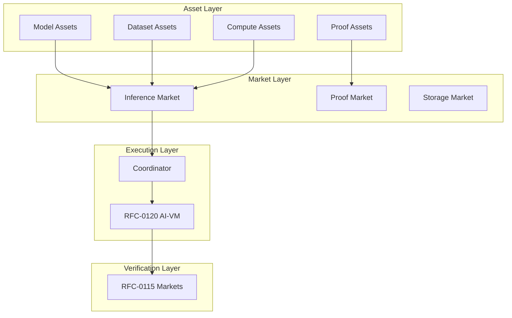

# RFC-0125 (Economics): Model Liquidity Layer

## Status

Draft

> **Note:** This RFC was originally numbered RFC-0125 under the legacy numbering system. It remains at 0125 as it belongs to the Economics category.

## Summary

This RFC introduces the **Model Liquidity Layer (MLL)** — an economic infrastructure enabling fractional ownership of AI models, decentralized trading of model shards, markets for inference compute and proof generation, and automated revenue distribution. The layer treats models, datasets, compute, and proofs as tokenized financial primitives, creating a complete decentralized AI economy where assets can be composed, traded, and verified on-chain.

## Design Goals

| Goal                       | Target                        | Metric           |
| -------------------------- | ----------------------------- | ---------------- |
| **G1: Asset Tokenization** | All AI primitives tokenized   | 4 asset types    |
| **G2: Market Efficiency**  | Sub-minute market matching    | <60s allocation  |
| **G3: Revenue Automation** | Automatic distribution        | 100% on-chain    |
| **G4: Composability**      | Models build on models        | Lineage tracking |
| **G5: Liquidity**          | Stable pools for major assets | >$10M TVL target |

## Motivation

### The Problem: Static AI Assets

Current AI infrastructure treats models and datasets as static assets:

| Issue                  | Impact                                   |
| ---------------------- | ---------------------------------------- |
| Centralized ownership  | Few companies control frontier models    |
| Closed datasets        | Valuable data locked in silos            |
| Unverifiable inference | AI outputs cannot be proven correct      |
| Compute monopolies     | GPU clusters controlled by few providers |

### The Solution: Liquidity Layer

The Model Liquidity Layer turns AI primitives into programmable financial assets:

```
Models → Tokenized ownership
Datasets → Tradable assets
Compute → Market-allocated
Proofs → Reusable commodities
```

### Why This Matters for CipherOcto

1. **Democratized model ownership** — Fractional ownership of frontier models
2. **Data economy** — Dataset creators earn royalties
3. **Compute markets** — Fair pricing for inference
4. **Proof markets** — Competitive proof generation

## Specification

### Core Asset Types

The system defines four primary asset classes:

```rust
/// Primary asset types in the Model Liquidity Layer
enum AssetType {
    /// Tokenized ownership of an AI model
    ModelAsset,

    /// Tradable dataset with provenance
    DatasetAsset,

    /// Compute execution capacity
    ComputeAsset,

    /// Verifiable computation proofs
    ProofAsset,
}
```

### Model Assets

Model assets represent ownership of complete models:

```rust
struct ModelAsset {
    /// Unique model identifier
    model_id: Digest,

    /// Model commitment root
    model_root: Digest,

    /// Layer topology
    layer_topology: LayerGraph,

    /// Shard mapping
    shard_map: Vec<ShardAssignment>,

    /// Owner shares (must sum to 1.0)
    owners: Vec<OwnershipShare>,

    /// Governance configuration
    governance: GovernanceConfig,

    /// Revenue distribution contract
    revenue_contract: Address,
}

struct OwnershipShare {
    /// Owner identity (EOA or contract)
    owner: PublicKey,

    /// Ownership percentage
    share_percent: f64,

    /// Lock-up period (if any)
    locked_until: Option<Timestamp>,
}
```

#### Example Ownership Structure

```rust
// Model: GPT-X (1T parameters)
let gpt_x = ModelAsset {
    model_id: digest("gpt-x-v1"),
    owners: vec![
        OwnershipShare { owner: alice, share_percent: 30.0 },
        OwnershipShare { owner: bob, share_percent: 25.0 },
        OwnershipShare { owner: dao_address, share_percent: 45.0 },
    ],
    // ...
};
```

### Model Shard Tokens

Individual shards become tradeable tokens:

```rust
struct ShardToken {
    /// Shard identifier
    shard_id: Digest,

    /// Parent model
    model_id: Digest,

    /// Shard commitment root
    shard_root: Digest,

    /// Storage provider
    storage_provider: PublicKey,

    /// Token standard
    standard: TokenStandard::ERC1155,

    /// Total supply (represents storage capacity)
    total_supply: u64,
}

impl ShardToken {
    /// Fractional ownership of shard storage
    fn fractionalize(&self, shares: u64) -> Vec<ShardFraction> {
        // Create fractional shares
    }

    /// Earn storage rewards
    fn claim_storage_reward(&self, period: &StoragePeriod) -> TokenAmount {
        // Reward based on storage duration and availability
    }
}
```

### Dataset Assets

Datasets become licensed, tradable assets:

```rust
struct DatasetAsset {
    /// Dataset identifier
    dataset_id: Digest,

    /// Dataset commitment root
    dataset_root: Digest,

    /// Provenance proof (from RFC-0108)
    provenance_proof: ProvenanceProof,

    /// License configuration
    license: DatasetLicense,

    /// Pricing model
    price_model: PriceModel,

    /// Royalty configuration
    royalty_config: RoyaltyConfig,

    /// Owner
    owner: PublicKey,
}

enum DatasetLicense {
    /// Full commercial usage
    Commercial,

    /// Research only
    ResearchOnly,

    /// Custom terms
    Custom { terms_hash: Digest },
}

enum PriceModel {
    /// Fixed price per access
    Fixed { price_per_access: TokenAmount },

    /// Subscription
    Subscription { monthly_rate: TokenAmount },

    /// Royalty-based
    Royalty { percentage: f64 },

    /// Free with attribution
    Open,
}

struct ProvenanceProof {
    /// Data source commitments
    source_roots: Vec<Digest>,

    /// Transformation lineage
    lineage: Vec<Transformation>,

    /// Creator signature
    creator_signature: Signature,

    /// Timestamp
    created_at: Timestamp,
}
```

### Compute Assets

Compute nodes advertise execution capacity:

```rust
struct ComputeOffer {
    /// Node identity
    node_id: PublicKey,

    /// Hardware type
    hardware: HardwareType,

    /// Available compute units
    compute_units: u64,

    /// Throughput (inferences per hour)
    throughput: u32,

    /// Price per inference
    price_per_inference: TokenAmount,

    /// Geographic region
    region: String,

    /// Reputation score
    reputation: u64,

    /// Staked tokens
    stake: TokenAmount,
}

enum HardwareType {
    CPU { cores: u32, memory_gb: u32 },
    GPU { model: String, vram_gb: u32, count: u32 },
    TPU { version: String },
    Cluster { node_count: u32 },
}

struct ComputeMarket {
    /// Active offers
    offers: HashMap<PublicKey, ComputeOffer>,

    /// Pending requests
    requests: Vec<ComputeRequest>,

    /// Matching algorithm
    matcher: MarketMatcher,
}
```

### Proof Assets

Proof generation becomes a tradeable commodity:

```rust
struct ProofJob {
    /// Job identifier
    job_id: Digest,

    /// Execution trace to prove
    trace_hash: Digest,

    /// Required proof type
    proof_type: ProofType,

    /// Generation deadline
    deadline: Timestamp,

    /// Maximum reward
    max_reward: TokenAmount,

    /// Verification level
    level: VerificationLevel,
}

enum ProofType {
    /// Fast fraud proof
    FraudProof,

    /// Full STARK proof
    STARK,

    /// Recursive proof
    Recursive,

    /// Zero-knowledge verification
    ZK,
}

struct ProofAsset {
    /// Proof identifier
    proof_id: Digest,

    /// Root hash being proven
    root_hash: Digest,

    /// Proof data
    proof_data: Vec<u8>,

    /// Verifier contract
    verifier: Address,

    /// Proof size in KB
    size_kb: u32,

    /// Generation timestamp
    created_at: Timestamp,

    /// Reusability
    reusable: bool,
}

impl ProofAsset {
    /// Verify proof
    fn verify(&self, public_inputs: &[Digest]) -> bool {
        // Verify against on-chain verifier
    }

    /// Resell proof (if reusable)
    fn list_for_sale(&mut self, price: TokenAmount) {
        self.reusable = true;
        // List on marketplace
    }
}
```

### Inference Marketplace

Inference requests are auctioned across compute nodes:

```rust
struct InferenceRequest {
    /// Request identifier
    request_id: Digest,

    /// Model to use
    model_id: Digest,

    /// Input data
    input_data: EncryptedBlob,

    /// Requested verification level
    verification_level: VerificationLevel,

    /// Maximum price
    max_price: TokenAmount,

    /// Deadline
    deadline: Timestamp,

    /// Client
    client: PublicKey,
}

struct InferenceAuction {
    /// Active auctions
    auctions: Vec<Auction>,

    /// Matching engine
    matcher: AuctionMatcher,
}

enum AuctionType {
    /// Sealed bid
    SealedBid,

    /// Dutch auction (price decreases)
    Dutch { start_price: TokenAmount },

    /// English auction (price increases)
    English,

    /// Fixed price
    FixedPrice,
}

impl InferenceAuction {
    /// Submit inference request
    fn submit(&mut self, request: InferenceRequest) -> AuctionId {
        // Create auction
        let auction = self.matcher.create_auction(request);
        self.auctions.push(auction)
    }

    /// Match request with compute node
    fn match_auction(&self, auction_id: AuctionId) -> Option<ComputeAllocation> {
        self.matcher.find_winner(auction_id)
    }
}
```

### Revenue Distribution

Automated revenue distribution to participants:

```rust
struct RevenueDistribution {
    /// Distribution configuration
    config: DistributionConfig,

    /// Pending distributions
    pending: Vec<PendingDistribution>,
}

struct DistributionConfig {
    /// Model owner share
    model_owner_share: f64,

    /// Compute node share
    compute_node_share: f64,

    /// Proof provider share
    proof_provider_share: f64,

    /// Storage node share
    storage_node_share: f64,

    /// Protocol treasury share
    treasury_share: f64,
}

impl RevenueDistribution {
    /// Distribute inference revenue
    fn distribute_inference(&mut self, revenue: TokenAmount, request: &InferenceRequest) {
        let model_owner = self.config.model_owner_share * revenue;
        let compute = self.config.compute_node_share * revenue;
        let proof = self.config.proof_provider_share * revenue;
        let storage = self.config.storage_node_share * revenue;
        let treasury = self.config.treasury_share * revenue;

        // Transfer to participants
        self.transfer(model_owner, &request.model_id);
        self.transfer(compute, &request.compute_node);
        self.transfer(proof, &request.proof_provider);
        self.transfer(storage, &request.storage_nodes);
        self.transfer(treasury, &treasury_address);
    }
}
```

### Model Composability

Models can build on other models:

```rust
struct ModelLineage {
    /// Base model
    base_model: Digest,

    /// Derived models
    derived_models: Vec<Digest>,

    /// Transformation applied
    transformation: ModelTransformation,

    /// Revenue sharing configuration
    revenue_share: f64,
}

enum ModelTransformation {
    /// Fine-tuning
    FineTuning { base_model: Digest, training_data: Digest },

    /// Merging
    ModelMerge { sources: Vec<Digest>, method: MergeMethod },

    /// Quantization
    Quantization { base_model: Digest, target_precision: Precision },

    /// Pruning
    Pruning { base_model: Digest, sparsity: f64 },
}

struct RevenueSharing {
    /// Calculate revenue for lineage
    fn calculate_shares(&self, total_revenue: TokenAmount) -> Vec<(PublicKey, TokenAmount)> {
        // Split revenue between base and derived model owners
    }
}
```

### Dataset Royalties

Datasets earn royalties when used:

```rust
struct DatasetRoyalty {
    /// Dataset being used
    dataset_id: Digest,

    /// Usage event
    usage: DatasetUsage,

    /// Royalty calculation
    fn calculate_royalty(&self) -> TokenAmount {
        match self.dataset.price_model {
            PriceModel::Royalty { percentage } => {
                self.usage.inference_value * percentage
            }
            _ => TokenAmount::zero(),
        }
    }

    /// Distribute to data contributors
    fn distribute(&self, royalty: TokenAmount) {
        // Pay dataset contributors
    }
}
```

### Verifiable RAG Integration

The liquidity layer integrates with verifiable retrieval:

```rust
struct VerifiableOutput {
    /// The answer
    answer: String,

    /// Dataset used (with proof)
    dataset: Option<DatasetAsset>,

    /// Model used (with commitment)
    model: ModelAsset,

    /// Inference execution
    execution: InferenceExecution,

    /// Proof asset
    proof: Option<ProofAsset>,

    /// Revenue distribution record
    revenue_record: RevenueDistribution,
}

impl VerifiableOutput {
    /// Generate complete verifiable package
    fn to_verifiable_package(&self) -> VerifiablePackage {
        VerifiablePackage {
            answer: self.answer.clone(),
            dataset_proof: self.dataset.as_ref().map(|d| d.provenance_proof.clone()),
            model_commitment: self.model.model_root,
            execution_proof: self.execution.proof.clone(),
            revenue_allocation: self.revenue_record.clone(),
        }
    }
}
```

### Liquidity Pools

Stabilize markets through pooling:

```rust
struct AssetPool {
    /// Pooled asset type
    asset_type: AssetType,

    /// Total value locked
    tvl: TokenAmount,

    /// Token supply
    pool_token_supply: u64,

    /// Price oracle
    oracle: PriceOracle,

    /// Liquidity providers
    providers: Vec<LiquidityProvider>,
}

struct LiquidityProvider {
    provider: PublicKey,
    deposited: TokenAmount,
    share: f64,
    earned_fees: TokenAmount,
}

impl AssetPool {
    /// Add liquidity
    fn add_liquidity(&mut self, amount: TokenAmount) -> PoolTokens {
        // Mint pool tokens proportional to share
    }

    /// Remove liquidity
    fn remove_liquidity(&mut self, pool_tokens: PoolTokens) -> TokenAmount {
        // Burn tokens, return asset
    }

    /// Swap assets
    fn swap(&mut self, from: AssetType, to: AssetType, amount: TokenAmount) -> TokenAmount {
        // Atomic swap via pool
    }
}
```

### Governance

Model assets governed by DAOs:

```rust
struct ModelGovernance {
    /// Governance contract
    governance_contract: Address,

    /// Voting configuration
    voting: VotingConfig,

    /// Proposals
    proposals: Vec<Proposal>,
}

struct VotingConfig {
    /// Voting period
    voting_period_blocks: u32,

    /// Quorum required
    quorum: f64,

    /// Approval threshold
    threshold: f64,

    /// Delegation enabled
    delegation: bool,
}

enum Proposal {
    /// Upgrade model weights
    UpgradeWeights { new_model_root: Digest },

    /// Change pricing
    ChangePricing { new_price: TokenAmount },

    /// Modify license
    ModifyLicense { new_license: DatasetLicense },

    /// Add/remove owners
    TransferOwnership { transfers: Vec<OwnershipTransfer> },

    /// Parameter updates
    UpdateParameters { changes: ParameterChanges },
}

impl ModelGovernance {
    /// Submit proposal
    fn propose(&mut self, proposal: Proposal) -> ProposalId {
        // Create on-chain proposal
    }

    /// Vote
    fn vote(&mut self, proposal_id: ProposalId, vote: Vote) {
        // Record vote
    }

    /// Execute if passed
    fn execute(&mut self, proposal_id: ProposalId) -> Result<()> {
        // Execute approved proposal
    }
}
```

## Integration with CipherOcto Stack



### Integration Points

| RFC      | Integration                  |
| -------- | ---------------------------- |
| RFC-0106 | Deterministic numeric types  |
| RFC-0108 | Dataset provenance proofs    |
| RFC-0109 | Retrieval market integration |
| RFC-0115 | Verification markets         |
| RFC-0120 | AI-VM execution              |
| RFC-0121 | Model sharding               |
| RFC-0124 | Proof market                 |

## Performance Targets

| Metric               | Target  | Notes                |
| -------------------- | ------- | -------------------- |
| Market matching      | <60s    | Inference allocation |
| Revenue distribution | <10s    | Automated            |
| Asset transfer       | <5s     | On-chain             |
| Pool TVL             | >$10M   | Target               |
| Governance latency   | <7 days | Proposal execution   |

## Adversarial Review

| Threat                  | Impact | Mitigation              |
| ----------------------- | ------ | ----------------------- |
| **Fake models**         | High   | Commitment verification |
| **Dataset fraud**       | High   | Provenance tracking     |
| **Inference fraud**     | High   | Proof verification      |
| **Market manipulation** | Medium | Oracle price feeds      |
| **Governance capture**  | Medium | Quorum requirements     |

## Alternatives Considered

| Approach                    | Pros                           | Cons                    |
| --------------------------- | ------------------------------ | ----------------------- |
| **Centralized marketplace** | Simple                         | Single point of failure |
| **Static model licensing**  | Familiar                       | No liquidity            |
| **This approach**           | Full liquidity + composability | Implementation scope    |
| **DAO-only governance**     | Decentralized                  | Slow decisions          |

## Implementation Phases

### Phase 1: Core Assets

- [ ] Model asset contracts
- [ ] Dataset asset contracts
- [ ] Basic ownership tracking

### Phase 2: Markets

- [ ] Inference marketplace
- [ ] Proof market integration
- [ ] Price discovery

### Phase 3: Revenue

- [ ] Automated distribution
- [ ] Royalty tracking
- [ ] Composability

### Phase 4: Liquidity

- [ ] Liquidity pools
- [ ] Governance
- [ ] Cross-chain bridges

## Future Work

- F1: Proof-of-Inference Consensus
- F2: AI Derivatives Markets
- F3: Cross-Model Composability
- F4: Dataset Reputation System

## Rationale

### Why Tokenized Assets?

Tokenization enables:

- Fractional ownership
- Programmable revenue distribution
- Tradable secondary markets
- Composable financial primitives

### Why Market-Based Compute?

Markets provide:

- Price discovery
- Efficient allocation
- Competition driving down costs

### Why Automated Revenue?

Automation ensures:

- Trustless operation
- Immediate compensation
- Programmable splits

## Related RFCs

- RFC-0106 (Numeric/Math): Deterministic Numeric Tower
- RFC-0108 (Retrieval): Verifiable AI Retrieval
- RFC-0109 (Retrieval): Retrieval Architecture
- RFC-0115 (Economics): Probabilistic Verification Markets
- RFC-0120 (AI Execution): Deterministic AI Virtual Machine
- RFC-0121 (AI Execution): Verifiable Large Model Execution
- RFC-0124 (Economics): Proof Market and Hierarchical Inference Network
- RFC-0130 (Proof Systems): Proof-of-Inference Consensus
- RFC-0131 (Numeric/Math): Deterministic Transformer Circuit
- RFC-0132 (Numeric/Math): Deterministic Training Circuits
- RFC-0133 (Proof Systems): Proof-of-Dataset Integrity

## Related Use Cases

- [Hybrid AI-Blockchain Runtime](../../docs/use-cases/hybrid-ai-blockchain-runtime.md)
- [Verifiable AI Agents for DeFi](../../docs/use-cases/verifiable-ai-agents-defi.md)

## Appendices

### A. Revenue Split Example

```
Inference Revenue: 100 OCTO

Split:
- Model owners: 40 OCTO (40%)
- Compute nodes: 30 OCTO (30%)
- Proof providers: 15 OCTO (15%)
- Storage nodes: 10 OCTO (10%)
- Treasury: 5 OCTO (5%)
```

### B. Example: End-to-End Flow

```
1. User submits prompt
   "Explain quantum tunneling"

2. Coordinator queries compute market
   - Matches with worker nodes
   - Allocates inference job

3. Dataset retrieval (if RAG)
   - Physics dataset accessed
   - Provenance proof generated

4. Model shards execute
   - Inference computation
   - Execution trace created

5. Proof market generates proof
   - STARK proof produced

6. User receives:
   - Answer
   - Dataset proof
   - Model commitment
   - Execution proof

7. Revenue automatically distributed:
   - Model owners credited
   - Compute node paid
   - Proof provider rewarded
   - Storage node credited
```

---

**Version:** 1.0
**Submission Date:** 2026-03-07
**Last Updated:** 2026-03-07
