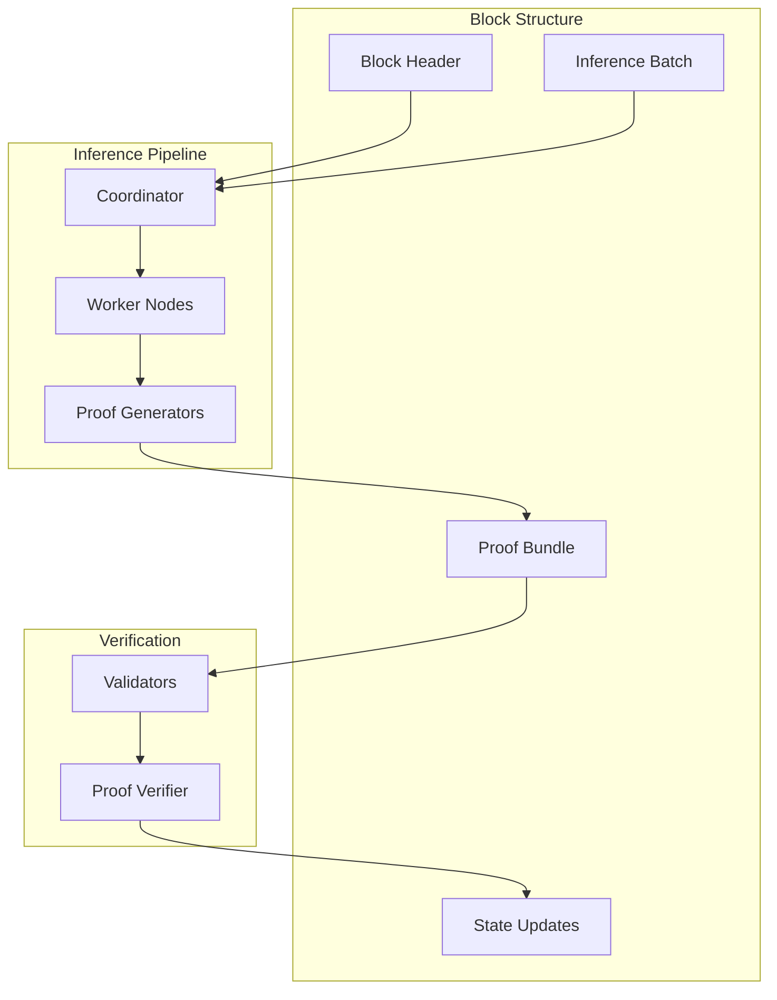
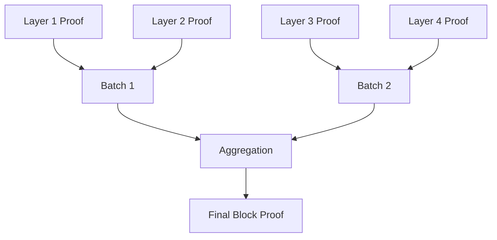
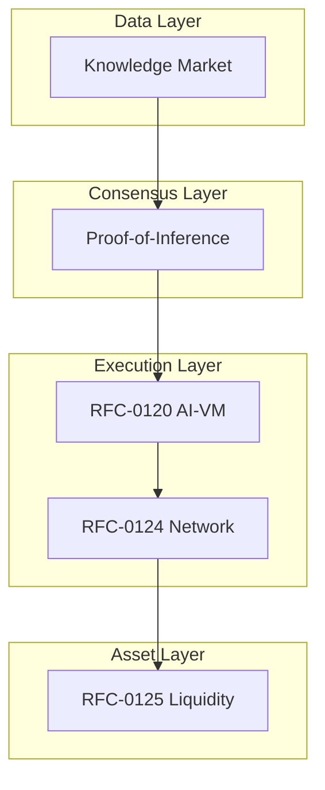

# RFC-0130: Proof-of-Inference Consensus

## Status

Draft

## Summary

This RFC defines **Proof-of-Inference (PoI)** — a blockchain consensus mechanism where cryptographically verified AI inference replaces traditional hash computation as the primary work securing the network. Instead of miners performing meaningless SHA256 hashing, nodes perform deterministic AI-VM inference tasks whose correctness is verified via STARK proofs. The system ensures AI computation equals consensus work, transforming the network into a global distributed AI compute system.

## Design Goals

| Goal                     | Target                             | Metric                |
| ------------------------ | ---------------------------------- | --------------------- |
| **G1: Useful Work**      | All consensus work is AI inference | 100% utility          |
| **G2: Verifiability**    | STARK-verified execution           | O(log n) verification |
| **G3: Decentralization** | GPU nodes worldwide                | >1000 workers         |
| **G4: Security**         | Economic slashing for fraud        | 100% stake penalty    |
| **G5: Integration**      | Full stack unification             | All RFCs connected    |

## Motivation

### The Problem: Wasteful Consensus

Traditional consensus mechanisms waste computational resources:

| Consensus      | Work Type          | Utility |
| -------------- | ------------------ | ------- |
| Proof-of-Work  | SHA256 hashing     | None    |
| Proof-of-Stake | Token staking      | Minimal |
| Proof-of-Space | Storage allocation | Limited |

### The Solution: Useful Consensus

Proof-of-Inference provides:

- **Useful work** — Real AI inference
- **Verifiable execution** — STARK proofs
- **Economic value** — Inference market
- **Decentralization** — Distributed GPU nodes

### Why This Matters for CipherOcto

1. **AI-native blockchain** — Consensus IS inference
2. **Global compute network** — Distributed AI supercomputer
3. **Economic alignment** — All participants benefit from useful work
4. **Full stack unification** — Connects all previous RFCs

## Specification

### Consensus Architecture



### Block Structure

```rust
struct PoIBlock {
    /// Block header
    header: BlockHeader,

    /// Inference tasks batched in this block
    inference_batch: InferenceBatch,

    /// STARK proof bundle
    proof_bundle: ProofBundle,

    /// State updates
    state_updates: StateUpdates,

    /// Consensus metadata
    consensus: ConsensusMetadata,
}

struct BlockHeader {
    /// Previous block hash
    parent_hash: Digest,

    /// Merkle root of inference batch
    batch_root: Digest,

    /// State root after updates
    state_root: Digest,

    /// Timestamp
    timestamp: u64,

    /// Block producer
    producer: PublicKey,

    /// Total work accumulated
    total_work: u256,
}

struct InferenceBatch {
    /// Inference tasks
    tasks: Vec<InferenceTask>,

    /// Total FLOPs in batch
    total_flops: u64,

    /// Aggregated proof
    aggregated_proof: Option<Digest>,
}

struct ProofBundle {
    /// Layer proofs
    layer_proofs: Vec<Digest>,

    /// Batch proof
    batch_proof: Digest,

    /// Verification status
    verified: bool,
}
```

### Work Unit Definition

```rust
/// Atomic unit of consensus work
struct InferenceTask {
    /// Task identifier
    task_id: Digest,

    /// Model to execute
    model_id: Digest,

    /// Input prompt hash
    prompt_hash: Digest,

    /// Dataset roots used
    dataset_roots: Vec<Digest>,

    /// Execution commitment
    execution_commitment: ExecutionCommitment,

    /// Verification level
    verification_level: VerificationLevel,
}

struct ExecutionCommitment {
    /// Input commitment
    input_root: Digest,

    /// Output commitment
    output_root: Digest,

    /// Execution trace hash
    trace_hash: Digest,

    /// Worker signature
    worker_signature: Signature,
}

struct InferenceResult {
    /// Result output
    output_hash: Digest,

    /// Execution trace
    trace_hash: Digest,

    /// Computation cost (FLOPs)
    flops: u64,

    /// Proof (if verified)
    proof: Option<ZKProof>,
}
```

### Block Production Pipeline

```rust
impl ProofOfInference {
    /// Submit inference request
    fn submit_request(&self, request: InferenceRequest) -> TaskId {
        // Add to pending queue
        // Market matching with workers
        // Return task ID
    }

    /// Execute task
    fn execute_task(&self, task: &InferenceTask) -> Result<InferenceResult> {
        // Load model shards
        // Execute via AI-VM (RFC-0120)
        // Generate trace
        // Return result
    }

    /// Generate proof
    fn generate_proof(&self, result: &InferenceResult) -> Result<ZKProof> {
        // AIR circuit for operators
        // STARK prover
        // Return proof
    }

    /// Package into block
    fn produce_block(&self, tasks: &[TaskId]) -> PoIBlock {
        // Collect task results
        // Aggregate proofs
        // Update state
        // Return block
    }
}
```

### Work Difficulty

```rust
struct Difficulty {
    /// Target FLOPs per block
    target_flops: u64,

    /// Difficulty adjustment
    adjustment_factor: f64,

    /// Minimum difficulty
    min_difficulty: u64,
}

impl Difficulty {
    /// Calculate required work
    fn required_work(block_time_seconds: u64) -> u64 {
        // Target: 10 second blocks
        // Adjust based on network hashrate
        // Return FLOPs needed
    }

    /// Verify block work
    fn verify_work(block: &PoIBlock, difficulty: &Difficulty) -> bool {
        block.inference_batch.total_flops >= difficulty.target_flops
    }
}

// Difficulty metrics
struct WorkMetrics {
    /// Transformer layers executed
    layers_executed: u32,

    /// Tokens processed
    tokens_processed: u64,

    /// Model parameters
    param_count: u64,

    /// Proof complexity
    proof_complexity: u32,
}
```

### Hierarchical Execution

```rust
/// Distributed execution for large models
struct HierarchicalExecution {
    /// Coordinator node
    coordinator: PublicKey,

    /// Layer shard workers
    layer_workers: HashMap<u32, Vec<PublicKey>>,

    /// Proof generators
    proof_generators: Vec<PublicKey>,
}

impl HierarchicalExecution {
    /// Execute model across workers
    fn execute_model(
        &self,
        model: &Model,
        input: &Tensor,
    ) -> Result<InferenceResult> {
        // Pipeline through layers
        for layer in model.layers.iter() {
            let workers = &self.layer_workers[&layer.id];
            let result = self.execute_layer(workers, layer, input)?;
            input = &result.output;
        }

        // Aggregate results
        self.aggregate_results(input)
    }

    /// Generate aggregated proof
    fn aggregate_proof(&self, layer_proofs: &[ZKProof]) -> ZKProof {
        // Recursive aggregation
        // Layer → Batch → Block
    }
}
```

### Proof Structure



```rust
/// Layer-level proof
struct LayerProof {
    layer_id: u32,
    execution_trace: Digest,
    output_commitment: Digest,
    stark_proof: Vec<u8>,
}

/// Shard proof
struct ShardProof {
    shard_id: u32,
    layer_proofs: Vec<LayerProof>,
    aggregated: Digest,
}

/// Batch proof
struct BatchProof {
    tasks: Vec<TaskId>,
    shard_proofs: Vec<ShardProof>,
    batch_root: Digest,
}

/// Final block proof
struct BlockProof {
    batch_proofs: Vec<BatchProof>,
    final_root: Digest,
    verification_cost: u32,
}

impl BlockProof {
    /// Verify in O(log n)
    fn verify(&self, public_inputs: &[Digest]) -> bool {
        // Recursive verification
        // Each layer verified independently
    }
}
```

### Verification Modes

```rust
enum VerificationLevel {
    /// Fast: probabilistic challenges
    Optimistic {
        challenge_rate: f64,
    },

    /// Verified: STARK proof required
    Verified {
        proof_type: ProofType,
    },

    /// Audited: recursive proof
    Audited {
        depth: u32,
    },
}

impl VerificationLevel {
    fn select_for_fee(fee: TokenAmount) -> Self {
        if fee > 1000 {
            VerificationLevel::Audited { depth: 3 }
        } else if fee > 100 {
            VerificationLevel::Verified {
                proof_type: ProofType::STARK,
            }
        } else {
            VerificationLevel::Optimistic { challenge_rate: 0.05 }
        }
    }
}
```

### Inference Fee Market

```rust
struct InferenceMarket {
    /// Pending requests
    pending: Vec<InferenceRequest>,

    /// Worker offers
    offers: Vec<ComputeOffer>,

    /// Matching engine
    matcher: MarketMatcher,
}

struct InferenceRequest {
    /// Client
    client: PublicKey,

    /// Model
    model_id: Digest,

    /// Prompt (encrypted)
    prompt: EncryptedBlob,

    /// Maximum fee
    max_fee: TokenAmount,

    /// Verification level
    level: VerificationLevel,

    /// Deadline
    deadline: Timestamp,
}

impl InferenceMarket {
    /// Submit request
    fn submit(&mut self, request: InferenceRequest) -> RequestId {
        // Add to pending
        // Trigger matching
    }

    /// Match with worker
    fn match_request(&self, request: &InferenceRequest) -> Option<Allocation> {
        // Select worker based on:
        // - Reputation
        // - Fee
        // - Capacity
    }
}
```

### Block Rewards

```rust
struct RewardDistribution {
    /// Block subsidy
    block_subsidy: TokenAmount,

    /// Inference fees
    inference_fees: TokenAmount,

    /// Distribution config
    config: RewardConfig,
}

struct RewardConfig {
    /// Block producer share
    producer_share: f64,

    /// Compute worker share
    compute_share: f64,

    /// Proof provider share
    proof_share: f64,

    /// Storage node share
    storage_share: f64,

    /// Treasury share
    treasury_share: f64,
}

impl RewardDistribution {
    /// Calculate total reward
    fn total(&self) -> TokenAmount {
        self.block_subsidy + self.inference_fees
    }

    /// Distribute rewards
    fn distribute(&self, recipients: &[PublicKey], amounts: &[TokenAmount]) {
        // Execute transfers
    }
}
```

### Validator Responsibilities

```rust
struct Validator {
    /// Validator identity
    node_id: PublicKey,

    /// Staked tokens
    stake: TokenAmount,

    /// Reputation
    reputation: u64,
}

impl Validator {
    /// Verify block
    fn verify_block(&self, block: &PoIBlock) -> Result<VerificationResult> {
        // 1. Verify proof bundle
        for proof in &block.proof_bundle.layer_proofs {
            if !self.verify_proof(proof) {
                return Err(VerificationError::InvalidProof);
            }
        }

        // 2. Verify state transitions
        if !self.verify_state_updates(&block.state_updates) {
            return Err(VerificationError::InvalidState);
        }

        // 3. Check work difficulty
        if !self.verify_work(&block, &self.difficulty) {
            return Err(VerificationError::InsufficientWork);
        }

        Ok(VerificationResult::Valid)
    }

    /// Verify single proof
    fn verify_proof(&self, proof: &ZKProof) -> bool {
        // STARK verification
        // O(log n) complexity
    }
}
```

### Security Model

```rust
struct SecurityModel {
    /// Slash for invalid inference
    slash_invalid: f64,

    /// Slash for proof forgery
    slash_forgery: f64,

    /// Slash for data unavailability
    slash_unavailable: f64,

    /// Challenge rate
    challenge_rate: f64,
}

impl SecurityModel {
    /// Slash fraudulent worker
    fn slash_worker(&self, worker: &mut WorkerNode, offense: Offense) {
        let penalty = match offense {
            Offense::InvalidOutput => worker.stake * self.slash_invalid,
            Offense::ProofForgery => worker.stake * self.slash_forgery,
            Offense::Unavailable => worker.stake * self.slash_unavailable,
        };

        worker.stake -= penalty;
        emit_slash_event(worker.id, penalty);
    }
}
```

## Integration with CipherOcto Stack



### Integration Points

| RFC      | Integration                 |
| -------- | --------------------------- |
| RFC-0106 | Deterministic numeric types |
| RFC-0108 | Dataset provenance          |
| RFC-0109 | Retrieval integration       |
| RFC-0120 | AI-VM execution             |
| RFC-0121 | Model sharding              |
| RFC-0122 | MoE routing                 |
| RFC-0124 | Proof market                |
| RFC-0125 | Asset layer                 |

## Performance Targets

| Metric                 | Target      | Notes            |
| ---------------------- | ----------- | ---------------- |
| Block time             | 10s         | Target interval  |
| Inference per block    | >1000 tasks | Batch processing |
| Proof verification     | <100ms      | O(log n)         |
| Validator requirements | <32GB RAM   | CPU-only         |
| Network workers        | >1000       | GPU nodes        |

## Adversarial Review

| Threat                   | Impact | Mitigation                    |
| ------------------------ | ------ | ----------------------------- |
| **Fraudulent inference** | High   | Proof verification + slashing |
| **Model tampering**      | High   | Merkle commitments            |
| **Worker collusion**     | High   | Random selection + challenges |
| **Data unavailability**  | Medium | Erasure coding + sampling     |
| **Block withholding**    | Medium | P2P diffusion requirements    |

## Alternatives Considered

| Approach             | Pros                | Cons                      |
| -------------------- | ------------------- | ------------------------- |
| **Proof-of-Work**    | Battle-tested       | Wasteful                  |
| **Proof-of-Stake**   | Efficient           | Not useful                |
| **Proof-of-Storage** | Useful storage      | Limited utility           |
| **This approach**    | Useful + verifiable | Implementation complexity |

## Implementation Phases

### Phase 1: Core Consensus

- [ ] Block structure
- [ ] Basic inference tasks
- [ ] Difficulty adjustment
- [ ] Block rewards

### Phase 2: Verification

- [ ] STARK proof integration
- [ ] Proof aggregation
- [ ] Validator requirements

### Phase 3: Market Integration

- [ ] Fee market
- [ ] Worker registry
- [ ] Slash handling

### Phase 4: Scaling

- [ ] Hierarchical execution
- [ ] Large model support
- [ ] Cross-chain bridges

## Future Work

- F1: Proof-of-Training consensus
- F2: Cross-chain AI markets
- F3: Autonomous AI agents
- F4: Deterministic transformer circuits

## Rationale

### Why Inference as Work?

PoI transforms wasted hash computation into:

- Real AI inference
- Verifiable outputs
- Economic value

### Why STARKs?

STARKs provide:

- Transparent setup (no trusted parties)
- Quantum resistance
- O(log n) verification
- Low verification cost

### Why Not ZK-SNARKs?

SNARKs require trusted setup ceremonies which create:

- Centralization risk
- Single points of failure

## Related RFCs

- RFC-0106: Deterministic Numeric Tower
- RFC-0108: Verifiable AI Retrieval
- RFC-0109: Retrieval Architecture
- RFC-0120: Deterministic AI Virtual Machine
- RFC-0121: Verifiable Large Model Execution
- RFC-0122: Mixture-of-Experts
- RFC-0124: Proof Market and Hierarchical Inference Network
- RFC-0125: Model Liquidity Layer
- RFC-0131: Deterministic Transformer Circuit
- RFC-0132: Deterministic Training Circuits

## Related Use Cases

- [Hybrid AI-Blockchain Runtime](../../docs/use-cases/hybrid-ai-blockchain-runtime.md)
- [Verifiable AI Agents for DeFi](../../docs/use-cases/verifiable-ai-agents-defi.md)

## Appendices

### A. Comparison Table

| Property     | PoW       | PoS     | PoI          |
| ------------ | --------- | ------- | ------------ |
| Work type    | Hashing   | Staking | AI Inference |
| Utility      | None      | Minimal | Full AI      |
| Hardware     | ASIC      | None    | GPU          |
| Energy       | High      | Low     | Medium       |
| Verification | Recompute | Voting  | STARK        |

### B. Block Reward Example

```
Block subsidy: 10 OCTO
Inference fees: 5 OCTO
Total: 15 OCTO

Distribution:
- Producer: 6 OCTO (40%)
- Compute: 4.5 OCTO (30%)
- Proof: 2.25 OCTO (15%)
- Storage: 1.5 OCTO (10%)
- Treasury: 0.75 OCTO (5%)
```

### C. Difficulty Adjustment

```
Every 100 blocks:
  new_difficulty = current_difficulty *
    (target_block_time / actual_block_time)

Minimum difficulty: 1M FLOPs
Maximum difficulty: 1T FLOPs
```

---

**Version:** 1.0
**Submission Date:** 2026-03-07
**Last Updated:** 2026-03-07
