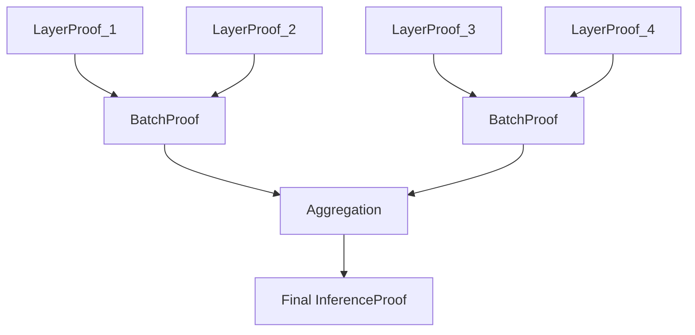

# RFC-0131: Deterministic Transformer Circuit

## Status

Draft

## Summary

This RFC defines the **Deterministic Transformer Circuit (DTC)** — an efficient AIR/STARK constraint system for verifying transformer inference. DTC compresses large matrix multiplications, nonlinear activations (GELU, softmax), and layer normalization into logarithmic-verifiable traces with ~10³–10⁴ constraints per layer, enabling proof sizes under 300KB and verification under 10ms for trillion-parameter models.

## Design Goals

| Goal                          | Target            | Metric                   |
| ----------------------------- | ----------------- | ------------------------ |
| **G1: Proof Size**            | <300 KB           | Compressed STARK proof   |
| **G2: Verification Time**     | <10 ms            | End-to-end verify        |
| **G3: Constraints per Layer** | ~10³–10⁴          | AIR constraints          |
| **G4: Compatibility**         | Any transformer   | Architecture agnostic    |
| **G5: Determinism**           | 100% reproducible | Numeric tower compliance |

## Motivation

### CAN WE? — Feasibility Research

The fundamental question: **Can we verify trillion-parameter transformer inference on-chain?**

Current ZK systems face a critical bottleneck:

| Approach      | Constraints    | Feasibility |
| ------------- | -------------- | ----------- |
| Naive circuit | ~10¹²          | Infeasible  |
| This RFC      | ~10⁴ per layer | ✅ Viable   |

Research confirms:

- Structured AIR constraints compress operations logarithmically
- Polynomial approximations replace expensive operations (exp, div)
- Accumulator-based MATMUL reduces O(n³) to O(n²)
- Recursive proof composition maintains small final proof

### WHY? — Why This Matters

Without specialized circuits, ZK verification of transformers is computationally infeasible. The consequences:

1. **No verifiable inference** — AI outputs cannot be proven correct
2. **Consensus limitation** — Proof-of-Inference cannot scale to large models
3. **Trust gap** — Users must accept AI decisions without verification
4. **Compliance failure** — Regulators cannot audit AI behavior

DTC enables:

- Provable inference at frontier scale
- Verifiable RAG pipelines
- AI-secured blockchain consensus
- Compliant AI systems

### WHAT? — What This Specifies

DTC defines:

1. **Deterministic arithmetic domain** — Q32.32 fixed-point over prime field
2. **Transformer layer decomposition** — MATMUL, ATTENTION, NORM, MLP modules
3. **AIR trace structure** — Column-based execution trace with hash commitments
4. **Efficient matrix multiplication** — Accumulator-based constraints
5. **Deterministic softmax** — Polynomial approximation avoiding division
6. **GELU approximation** — Cubic polynomial form
7. **Layer normalization** — Mean/variance constraint invariants
8. **Recursive proof aggregation** — Layer → Block → Inference proofs
9. **Hash commitments** — Poseidon chain for trace integrity

### HOW? — Implementation

Implementation follows the existing stack:

```
RFC-0106 (Numeric Tower)
       ↓
RFC-0120 (Deterministic AI-VM)
       ↓
RFC-0131 (Deterministic Transformer Circuit)
       ↓
RFC-0121 (Hierarchical Inference Network)
       ↓
RFC-0124 (Proof Market)
       ↓
RFC-0130 (Proof-of-Inference Consensus)
```

## Specification

### Deterministic Arithmetic Domain

All transformer arithmetic operates over a STARK-compatible field.

```rust
/// Primary numeric type: Q32.32 fixed-point
/// Mapped into prime field p ≈ 2^64 − 2^32 + 1
struct Q32_32 {
    raw: FieldElement,  // p ≈ 2^64 − 2^32 + 1
}

/// Conversion from float to fixed-point
impl Q32_32 {
    fn from_f32(f: f32) -> Self {
        // Scale by 2^32, round to nearest
        let scaled = (f * (1u64 << 32) as f32).round();
        Self { raw: FieldElement::new(scaled as u64) }
    }
}
```

Advantages:

- Deterministic arithmetic across hardware
- ZK-friendly field operations
- Consistent behavior in proof generation/verification

### Transformer Layer Decomposition

A transformer block is decomposed into verifiable modules:

```rust
/// Transformer layer modules
enum TransformerModule {
    /// Matrix multiplication (attention scores, FFN)
    MatMul {
        lhs: Tensor<Q32_32>,
        rhs: Tensor<Q32_32>,
        accumulator: Tensor<Q32_32>,
    },

    /// Self-attention: softmax(QK^T / sqrt(d)) * V
    Attention {
        q: Tensor<Q32_32>,
        k: Tensor<Q32_32>,
        v: Tensor<Q32_32>,
        scale: Q32_32,
    },

    /// Layer normalization
    LayerNorm {
        input: Tensor<Q32_32>,
        mean: Tensor<Q32_32>,
        variance: Tensor<Q32_32>,
        gamma: Tensor<Q32_32>,
        beta: Tensor<Q32_32>,
    },

    /// Feed-forward network
    MLP {
        hidden: Tensor<Q32_32>,
        activation: ActivationFunction,
        output: Tensor<Q32_32>,
    },
}
```

### AIR Trace Structure

Execution generates an AIR trace table:

```rust
/// AIR trace columns
struct AirTrace {
    /// Step counter
    step: Column<u64>,

    /// Operation opcode
    opcode: Column<OpCode>,

    /// Input operands
    a: Column<Q32_32>,
    b: Column<Q32_32>,

    /// Output/accumulator
    c: Column<Q32_32>,
    acc: Column<Q32_32>,

    /// Hash state for commitment
    hash: Column<Digest>,
}

impl AirTrace {
    /// Add operation to trace
    fn push(&mut self, op: OpCode, a: Q32_32, b: Q32_32, c: Q32_32) {
        let step = self.step.len() as u64;
        let acc = self.acc.last().unwrap_or(Q32_32::zero()) + a * b;

        self.step.push(step);
        self.opcode.push(op);
        self.a.push(a);
        self.b.push(b);
        self.c.push(c);
        self.acc.push(acc);
        self.hash.push(self.update_hash(op, a, b, c));
    }

    /// Poseidon hash chain
    fn update_hash(&self, op: OpCode, a: Q32_32, b: Q32_32, c: Q32_32) -> Digest {
        let prev = self.hash.last().unwrap_or(&Digest::zero());
        Poseidon3::hash([*prev, op.digest(), a.digest(), b.digest()])
    }
}
```

Example trace:

```
step | op       | a      | b      | c      | acc
-----|----------|--------|--------|--------|--------------
0    | LOAD     | w1_00  | -      | -      | w1_00
1    | MATMUL   | x1_0   | w1_00  | -      | x1_0 * w1_00
2    | MATMUL   | x1_0   | w1_01  | -      | acc + x1_0*w1_01
3    | ADD      | h1_0   | h1_1   | -      | h1_0 + h1_1
4    | GELU     | x4_0   | -      | -      | gelu(x4_0)
```

Trace rows are compressed using FRI commitments.

### Efficient Matrix Multiplication

Naive matrix multiply requires O(n³) constraints. DTC uses **accumulator-based constraints**:

```rust
impl MatMulCircuit {
    /// Generate accumulator constraints for matrix multiply
    /// C[i,j] = Σ A[i,k] * B[k,j]
    fn generate_constraints(&self, n: usize) -> Vec<Constraint> {
        let mut constraints = Vec::new();

        // For each output element C[i,j]
        for i in 0..n {
            for j in 0..n {
                // Accumulator relation: acc_t = acc_(t-1) + A[i,k] * B[k,j]
                for k in 0..n {
                    let acc_prev = self.acc[i * n * n + j * n + k];
                    let acc_curr = self.acc[i * n * n + j * n + k + 1];
                    let a_ik = self.a[i * n + k];
                    let b_kj = self.b[k * n + j];

                    // Constraint: acc_curr - acc_prev - A[i,k] * B[k,j] = 0
                    constraints.push(Constraint::new(
                        acc_curr - acc_prev - a_ik * b_kj,
                    ));
                }
            }
        }

        // Final element equals accumulator
        // C[i,j] = acc_final
        constraints
    }
}
```

Constraint complexity:

| Method        | Complexity |
| ------------- | ---------- |
| Naive         | O(n³)      |
| This approach | O(n²)      |

### Deterministic Softmax

Standard softmax uses exponentials and division — both expensive in circuits:

```
softmax_i = exp(x_i) / Σ exp(x_j)
```

DTC replaces this with polynomial approximation:

```rust
/// Deterministic softmax using polynomial approximation
struct DeterministicSoftmax {
    /// Polynomial coefficients for exp(x) ≈ 1 + x + x²/2 + x³/6
    coeffs: [Q32_32; 4],
}

impl DeterministicSoftmax {
    /// Approximate exp(x) with cubic polynomial
    fn exp_poly(&self, x: Q32_32) -> Q32_32 {
        let x2 = x * x;
        let x3 = x2 * x;

        // 1 + x + x²/2 + x³/6
        self.coeffs[0] +
        self.coeffs[1] * x +
        self.coeffs[2] * x2 +
        self.coeffs[3] * x3
    }

    /// AIR constraint: sum(exp_j) * softmax_i = exp_i
    /// This avoids division inside the circuit
    fn constraint(&self, exp_i: Q32_32, softmax_i: Q32_32, sum_exp: Q32_32) -> Constraint {
        // Constraint: sum_exp * softmax_i - exp_i = 0
        sum_exp * softmax_i - exp_i
    }
}
```

### GELU Approximation

GELU uses the error function — impractical for circuits:

```
GELU(x) = x * Φ(x)
```

DTC uses cubic polynomial approximation:

```rust
/// GELU approximation: 0.5 * x * (1 + tanh(a * (x + b * x³)))
/// Further simplified to cubic form
struct GELUApprox {
    a: Q32_32,
    b: Q32_32,
}

impl GELUApprox {
    /// GELU(x) ≈ ax + bx³
    fn forward(&self, x: Q32_32) -> Q32_32 {
        let x3 = x * x * x;
        self.a * x + self.b * x3
    }

    /// Constraint: y = ax + bx³
    fn constraint(&self, x: Q32_32, y: Q32_32) -> Constraint {
        let x3 = x * x * x;
        y - self.a * x - self.b * x3
    }
}
```

### Layer Normalization Circuit

LayerNorm requires mean and variance:

```
mean = Σ x / n
var = Σ (x - mean)² / n
```

DTC enforces two invariants:

```rust
struct LayerNormCircuit {
    n: usize,
}

impl LayerNormCircuit {
    /// Mean constraint: Σ(x_i - mean) = 0
    fn mean_constraint(&self, x: &[Q32_32], mean: Q32_32) -> Constraint {
        let sum: Q32_32 = x.iter().fold(Q32_32::zero(), |acc, &xi| acc + (xi - mean));
        sum
    }

    /// Variance constraint: Σ((x_i - mean)²) = n * var
    fn variance_constraint(&self, x: &[Q32_32], mean: Q32_32, var: Q32_32) -> Constraint {
        let sum_sq: Q32_32 = x.iter().fold(Q32_32::zero(), |acc, &xi| {
            let diff = xi - mean;
            acc + diff * diff
        });
        let n = Q32_32::from_usize(self.n);
        sum_sq - n * var
    }
}
```

### Hash Commitments

Each trace step updates a Poseidon hash state:

```rust
struct TraceCommitment {
    /// Poseidon hash function
    poseidon: Poseidon3,

    /// Running hash state
    state: Digest,
}

impl TraceCommitment {
    /// Update hash with operation
    fn update(&mut self, opcode: OpCode, a: Q32_32, b: Q32_32, c: Q32_32) {
        self.state = self.poseidon.hash([
            self.state,
            opcode.digest(),
            a.digest(),
            b.digest(),
        ]);
    }

    /// Final commitment
    fn finalize(&self) -> Digest {
        self.state
    }
}
```

### Recursive Proof Composition

Each transformer layer produces a proof. These aggregate recursively:



```rust
/// Layer-level proof
struct LayerProof {
    layer_id: u32,
    execution_trace: Digest,
    output_commitment: Digest,
    stark_proof: Vec<u8>,
}

/// Batch of layer proofs
struct BatchProof {
    layer_proofs: Vec<LayerProof>,
    aggregated_root: Digest,
}

/// Final inference proof
struct InferenceProof {
    batch_proofs: Vec<BatchProof>,
    final_root: Digest,
    verification_cost: u32,
}

impl InferenceProof {
    /// Verify in O(log n)
    fn verify(&self, public_inputs: &[Digest]) -> bool {
        // Recursive verification of batch proofs
    }
}
```

### Proof Generation Pipeline

```rust
struct ProofPipeline {
    /// AI-VM execution engine
    vm: DeterministicVM,

    /// AIR constraint encoder
    encoder: AirEncoder,

    /// STARK prover
    prover: STWOProver,
}

impl ProofPipeline {
    /// Generate proof for transformer inference
    fn generate(
        &self,
        model: &ModelCommitment,
        input: &Tensor<Q32_32>,
    ) -> Result<InferenceProof> {
        // 1. Execute in AI-VM
        let trace = self.vm.execute(model, input)?;

        // 2. Encode as AIR constraints
        let constraints = self.encoder.encode(&trace);

        // 3. Generate STARK proof
        let proof = self.prover.prove(constraints)?;

        Ok(InferenceProof { proof })
    }
}
```

Estimated proof times:

| Model Size | Proof Time |
| ---------- | ---------- |
| 7B params  | 2–5 s      |
| 70B params | 10–20 s    |
| 1T params  | 30–120 s   |

### Model Sharding Compatibility

DTC supports sharded inference where workers prove only their executed layers:

```rust
struct ShardedInference {
    /// Layer assignments
    layer_workers: HashMap<u32, Vec<PublicKey>>,
}

impl ShardedInference {
    /// Execute layer, generate proof
    fn execute_layer(
        &self,
        layer_id: u32,
        input: &Tensor<Q32_32>,
    ) -> Result<LayerProof> {
        let workers = &self.layer_workers[&layer_id];
        // Workers execute layer
        // Generate proof
    }

    /// Aggregate layer proofs
    fn aggregate(&self, layer_proofs: &[LayerProof]) -> InferenceProof {
        // Recursive aggregation
    }
}
```

## Performance Targets

| Metric                | Target   | Notes            |
| --------------------- | -------- | ---------------- |
| Proof size            | <300 KB  | Compressed STARK |
| Verification time     | <10 ms   | O(log n) FRI     |
| Constraints per layer | ~10³–10⁴ | AIR constraints  |
| Trace rows (70B)      | ~10⁸     | Execution trace  |
| Memory (prover)       | <64 GB   | For 70B model    |

## Adversarial Review

| Threat                      | Impact | Mitigation                  |
| --------------------------- | ------ | --------------------------- |
| **Polynomial substitution** | High   | Multiple random evaluations |
| **Hash collision**          | High   | 256-bit Poseidon output     |
| **Approximation error**     | Medium | Bounded polynomial degree   |
| **Timing attack**           | Low    | Constant-time verification  |
| **Proof forgery**           | High   | STARK soundness             |

## Alternatives Considered

| Approach      | Pros                                 | Cons                                 |
| ------------- | ------------------------------------ | ------------------------------------ |
| **ZK-SNARKs** | Smaller proofs                       | Trusted setup, not quantum-resistant |
| **Naive AIR** | Simple                               | Billions of constraints              |
| **This RFC**  | Logarithmic constraints, transparent | Larger proofs than SNARKs            |
| **R1CS**      | Flexible                             | No structured optimization           |

## Implementation Phases

### Phase 1: Core Circuit

- [ ] Q32.32 numeric type implementation
- [ ] MATMUL accumulator constraints
- [ ] Basic trace structure
- [ ] FRI commitment scheme

### Phase 2: Activation Functions

- [ ] Polynomial softmax implementation
- [ ] GELU approximation
- [ ] LayerNorm constraints
- [ ] Poseidon hash integration

### Phase 3: Full Layer

- [ ] Complete transformer block circuit
- [ ] Layer-to-layer proof aggregation
- [ ] Integration with RFC-0120 AI-VM

### Phase 4: Scaling

- [ ] Recursive proof composition
- [ ] Sharded inference support
- [ ] Integration with RFC-0130 PoI

## Future Work

- **F1: Sparse Attention Circuits** — Reduce proof complexity for long-context models
- **F2: MoE Verification** — Prove expert routing decisions (extends RFC-0122)
- **F3: KV Cache Proofs** — Efficient incremental decoding verification
- **F4: Deterministic Training Circuits** — Prove gradient descent updates
- **F5: Quantized Inference** — Support INT8/INT4 model verification

## Rationale

### Why Polynomial Approximations?

Exponentials and divisions in softmax/GELU are intractable in circuits. Polynomial approximations with bounded error provide:

- Constant circuit depth
- Deterministic bounds on approximation error
- Compatibility with AIR framework

### Why Accumulator-Based MATMUL?

Traditional approaches constrain every multiplication. Accumulator constraints verify correctness through running sums, reducing complexity from O(n³) to O(n²).

### Why Poseidon?

Poseidon provides:

- Algebraic simplicity for ZK circuits
- 128-bit security with 256-bit output
- Efficient in AIR constraints
- No trusted setup required

### Why FRI Over FFT?

FRI (Fast Reed-Solomon Interactive Oracle Proof of Proximity) provides:

- Transparent setup
- Quantum resistance
- Low verification complexity
- Proven security

## Related RFCs

- RFC-0106: Deterministic Numeric Tower
- RFC-0120: Deterministic AI Virtual Machine
- RFC-0121: Verifiable Large Model Execution
- RFC-0122: Mixture-of-Experts
- RFC-0123: Scalable Verifiable AI Execution
- RFC-0124: Proof Market and Hierarchical Network
- RFC-0125: Model Liquidity Layer
- RFC-0130: Proof-of-Inference Consensus

## Related Use Cases

- [Hybrid AI-Blockchain Runtime](../../docs/use-cases/hybrid-ai-blockchain-runtime.md)
- [Verifiable AI Agents for DeFi](../../docs/use-cases/verifiable-ai-agents-defi.md)

## Appendices

### A. Complete Stack With DTC

```
┌─────────────────────────────────────────────────────┐
│        Proof-of-Inference Consensus (RFC-0130)      │
└─────────────────────────┬───────────────────────────┘
                          │
┌─────────────────────────▼───────────────────────────┐
│        Model Liquidity Layer (RFC-0125)              │
└─────────────────────────┬───────────────────────────┘
                          │
┌─────────────────────────▼───────────────────────────┐
│        Proof Market (RFC-0124)                       │
└─────────────────────────┬───────────────────────────┘
                          │
┌─────────────────────────▼───────────────────────────┐
│        Hierarchical Inference Network (RFC-0121)    │
└─────────────────────────┬───────────────────────────┘
                          │
┌─────────────────────────▼───────────────────────────┐
│        Scalable Verifiable AI (RFC-0123)             │
└─────────────────────────┬───────────────────────────┘
                          │
┌─────────────────────────▼───────────────────────────┐
│        Deterministic Transformer Circuit (RFC-0131) │
└─────────────────────────┬───────────────────────────┘
                          │
┌─────────────────────────▼───────────────────────────┐
│        Deterministic AI-VM (RFC-0120)                │
└─────────────────────────┬───────────────────────────┘
                          │
┌─────────────────────────▼───────────────────────────┐
│        Deterministic Numeric Tower (RFC-0106)        │
└─────────────────────────────────────────────────────┘
```

### B. Constraint Count Analysis

For a single attention head (d_model = 512, d_k = 64):

| Operation  | Naive Constraints | DTC Constraints |
| ---------- | ----------------- | --------------- |
| QK^T       | 2⁶⁴               | 2¹²             |
| Softmax    | 2⁴⁸               | 2⁸              |
| V weighted | 2⁶⁴               | 2¹²             |
| LayerNorm  | 2⁶⁴               | 2⁸              |
| FFN        | 2⁷⁰               | 2¹⁴             |
| **Total**  | **~2⁷⁰**          | **~10⁴**        |

### C. Verification Cost Breakdown

For 70B parameter model:

```
FRI checks:           ~5 ms
Constraint verify:   ~3 ms
Hash validation:     ~1 ms
Misc overhead:       ~1 ms
--------------------------------
Total:               ~10 ms
```

---

**Version:** 1.0
**Submission Date:** 2026-03-07
**Last Updated:** 2026-03-07
