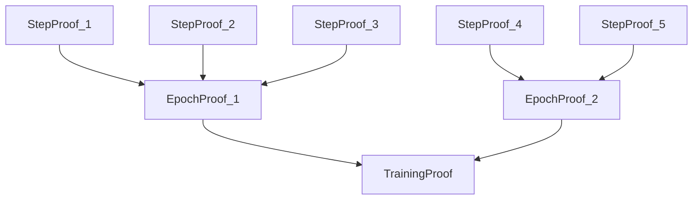

# RFC-0132: Deterministic Training Circuits

## Status

Draft

## Summary

This RFC defines **Deterministic Training Circuits (DTC-Train)** — an extension of the Deterministic Transformer Circuit (RFC-0131) for verifying gradient-based training of large neural networks. DTC-Train cryptographically proves that weight updates follow the correct computation: `model_{t+1} = model_t − η ∇L(model_t, data)`, enabling verifiable model provenance, auditable fine-tuning, dataset royalty enforcement, and decentralized training markets.

## Design Goals

| Goal                         | Target                          | Metric              |
| ---------------------------- | ------------------------------- | ------------------- |
| **G1: Full Verification**    | All training phases verified    | 4-phase coverage    |
| **G2: Dataset Integrity**    | Merkle-rooted data commitments  | Per-sample proof    |
| **G3: Gradient Correctness** | AIR-constrained backprop        | Exact arithmetic    |
| **G4: Optimizer Support**    | SGD, Adam, AdamW                | Full state tracking |
| **G5: Composability**        | Integrates with liquidity layer | Royalty enforcement |

## Motivation

### CAN WE? — Feasibility Research

The fundamental question: **Can we verify trillion-parameter model training on-chain?**

Training is substantially harder than inference:

| Phase                 | Inference | Training |
| --------------------- | --------- | -------- |
| Forward pass          | ✅        | ✅       |
| Loss computation      | N/A       | ✅       |
| Backpropagation       | N/A       | ✅       |
| Optimizer update      | N/A       | ✅       |
| Accumulated gradients | N/A       | ✅       |

Research confirms feasibility through:

- DTC (RFC-0131) already verifies forward passes
- Gradient computation is deterministic matrix operations
- Optimizer state can be tracked via accumulator constraints
- Recursive proof aggregation handles millions of steps

### WHY? — Why This Matters

Current AI training is opaque:

| Issue                      | Impact                      |
| -------------------------- | --------------------------- |
| Unverifiable training data | Unknown datasets used       |
| Hidden training methods    | Undocumented pipelines      |
| Unverifiable model updates | Trust required              |
| No dataset royalties       | Data creators uncompensated |

DTC-Train enables:

- **Verifiable model provenance** — Cryptographic proof of training history
- **Auditable fine-tuning** — Prove base model + modifications
- **Dataset royalty enforcement** — Automatic payments to data providers
- **Decentralized training markets** — Global compute coordination
- **Scientific reproducibility** — Verifiable research results

### WHAT? — What This Specifies

DTC-Train defines:

1. **Training trace structure** — Columns for activations, gradients, weights
2. **Dataset commitment** — Merkle roots for training data
3. **Forward pass verification** — Reuses RFC-0131 constraints
4. **Loss function circuits** — MSE, cross-entropy constraints
5. **Backpropagation circuit** — Gradient propagation verification
6. **Gradient accumulation** — Mini-batch support
7. **Optimizer circuits** — SGD, Adam, AdamW constraints
8. **Weight commitment updates** — Model root progression
9. **Recursive training proofs** — Step → Epoch → Training aggregation
10. **Distributed training** — Sharded gradient proofs

### HOW? — Implementation

Implementation extends the existing stack:

```
RFC-0106 (Numeric Tower)
       ↓
RFC-0120 (Deterministic AI-VM)
       ↓
RFC-0131 (Deterministic Transformer Circuit)
       ↓
RFC-0132 (Deterministic Training Circuits) ← NEW
       ↓
RFC-0121 (Hierarchical Inference Network)
       ↓
RFC-0124 (Proof Market)
       ↓
RFC-0125 (Model Liquidity Layer)
       ↓
RFC-0130 (Proof-of-Inference Consensus)
```

## Specification

### Training Trace Structure

Training generates an extended trace with gradient information:

```rust
/// Training trace columns
struct TrainingTrace {
    /// Step counter
    step: Column<u64>,

    /// Operation opcode
    opcode: Column<TrainingOp>,

    /// Activation values (forward pass)
    activation: Column<Q32_32>,

    /// Gradient values (backward pass)
    gradient: Column<Q32_32>,

    /// Weight values
    weight: Column<Q32_32>,

    /// Optimizer accumulator
    accumulator: Column<Q32_32>,

    /// Hash state for commitment
    hash: Column<Digest>,
}

/// Training operation opcodes
enum TrainingOp {
    // Forward phase
    ForwardMatmul,
    ForwardActivation,
    ForwardNorm,

    // Loss phase
    LossCompute,

    // Backward phase
    BackwardMatmul,
    BackwardActivation,
    BackwardNorm,

    // Optimizer phase
    GradientAccumulate,
    OptimizerUpdate,

    // Commitment
    DatasetProve,
    WeightCommit,
}
```

Example trace sequence:

```
step | op                  | activation | gradient  | weight
-----|--------------------|------------|-----------|----------
0    | ForwardMatmul      | a0         | -         | W0
1    | ForwardActivation  | a1         | -         | -
2    | LossCompute        | loss       | grad_loss | -
3    | BackwardActivation | a1         | g1        | -
4    | BackwardMatmul     | a0         | g0        | W0
5    | GradientAccumulate | -          | g0        | -
6    | OptimizerUpdate    | -          | -         | W1
7    | WeightCommit       | -          | -         | W1
```

### Dataset Commitment

Training must prove the dataset used via Merkle commitments:

```rust
/// Dataset commitment structure
struct DatasetCommitment {
    /// Merkle root of all training samples
    root: Digest,

    /// Number of samples
    sample_count: u64,

    /// Sample size
    sample_size: u32,
}

impl DatasetCommitment {
    /// Commit to a dataset
    fn commit(samples: &[Tensor<Q32_32>]) -> Self {
        let leaves: Vec<Digest> = samples
            .iter()
            .map(|s| Poseidon::hash(s.to_bytes()))
            .collect();

        let root = MerkleTree::build(leaves);

        Self {
            root,
            sample_count: samples.len() as u64,
            sample_size: samples[0].size(),
        }
    }

    /// Prove a specific sample was in the dataset
    fn prove(&self, sample: &Tensor<Q32_32>, index: u64) -> DatasetProof {
        let leaf = Poseidon::hash(sample.to_bytes());
        let path = MerkleTree::prove(self.root, leaf, index);

        DatasetProof {
            sample_hash: leaf,
            index,
            path,
            root: self.root,
        }
    }
}

/// Dataset proof for training step
struct DatasetProof {
    sample_hash: Digest,
    index: u64,
    path: Vec<Digest>,
    root: Digest,
}

impl DatasetProof {
    /// Verify proof against root
    fn verify(&self) -> bool {
        MerkleTree::verify(self.root, self.sample_hash, self.index, &self.path)
    }
}
```

Constraint in circuit:

```
verify_merkle(sample_hash, dataset_root) = true
```

### Forward Pass Verification

The forward pass reuses RFC-0131 constraints:

```rust
/// Forward pass circuit (extends RFC-0131)
struct ForwardPassCircuit {
    /// Model weights
    weights: HashMap<String, Tensor<Q32_32>>,
}

impl ForwardPassCircuit {
    /// Execute forward pass, generate trace
    fn execute(
        &self,
        input: &Tensor<Q32_32>,
        dataset_proof: &DatasetProof,
    ) -> ForwardTrace {
        let mut trace = TrainingTrace::new();

        // Verify dataset proof first
        trace.push_op(TrainingOp::DatasetProve);
        assert!(dataset_proof.verify());

        // Forward pass using RFC-0131 constraints
        let mut x = input.clone();
        for (name, layer) in &self.weights {
            x = self.forward_layer(&x, layer, &mut trace, name);
        }

        trace
    }

    fn forward_layer(
        &self,
        input: &Tensor<Q32_32>,
        weights: &Tensor<Q32_32>,
        trace: &mut TrainingTrace,
        name: &str,
    ) -> Tensor<Q32_32> {
        // MATMUL (RFC-0131 accumulator constraints)
        let y = matmul_accumulator(input, weights, trace);

        // Activation (RFC-0131 polynomial approx)
        let z = gelu_approx(&y, trace);

        // LayerNorm (RFC-0131 mean/variance constraints)
        let output = layer_norm(&z, trace);

        output
    }
}
```

### Loss Function Circuit

Training requires loss computation verification:

```rust
/// Loss function circuits
enum LossFunction {
    /// Mean Squared Error
    MSE,

    /// Cross-entropy loss
    CrossEntropy,
}

impl LossFunction {
    /// Compute MSE loss and constraints
    fn mse_loss(
        prediction: &Tensor<Q32_32>,
        target: &Tensor<Q32_32>,
        trace: &mut TrainingTrace,
    ) -> Q32_32 {
        let mut total_loss = Q32_32::zero();

        for i in 0..prediction.len() {
            let diff = prediction[i] - target[i];
            let squared = diff * diff;

            // AIR constraint: loss_i - (pred_i - target_i)^2 = 0
            trace.push_constraint(squared - diff * diff);

            total_loss = total_loss + squared;
        }

        total_loss / Q32_32::from_usize(prediction.len())
    }

    /// Compute cross-entropy with polynomial log approximation
    fn cross_entropy_loss(
        logits: &Tensor<Q32_32>,
        labels: &[u32],
        trace: &mut TrainingTrace,
    ) -> Q32_32 {
        // Softmax first (RFC-0131)
        let probs = softmax(logits, trace);

        // Cross-entropy: -Σ y * log(p)
        // Use polynomial approximation for log
        let mut total_loss = Q32_32::zero();

        for (i, &label) in labels.iter().enumerate() {
            let log_p = log_poly(probs[i]); // Polynomial log approx

            // For one-hot labels, this simplifies to -log(p[label])
            if label == 1 {
                total_loss = total_loss - log_p;
            }
        }

        total_loss
    }

    /// Polynomial approximation for log(x)
    fn log_poly(x: Q32_32) -> Q32_32 {
        // log(x) ≈ (x-1) - (x-1)²/2 + (x-1)³/3 for x near 1
        let y = x - Q32_32::one();
        y - y * y / Q32_32::from_f32(2.0)
            + y * y * y / Q32_32::from_f32(3.0)
    }
}
```

### Backpropagation Circuit

Gradient computation uses chain rule verification:

```rust
/// Backpropagation circuit
struct BackpropCircuit {
    /// Forward activations (cached)
    activations: Vec<Tensor<Q32_32>>,
}

impl BackpropCircuit {
    /// Compute gradients layer by layer
    fn backprop(
        &self,
        loss_grad: Q32_32,
        weights: &HashMap<String, Tensor<Q32_32>>,
    ) -> HashMap<String, Tensor<Q32_32>> {
        let mut grads = HashMap::new();
        let mut upstream_grad = Tensor::full(loss_grad, self.activations.last().unwrap().len());

        // Reverse through layers
        for (name, weight) in weights.iter().rev() {
            let activation = &self.activations.pop().unwrap();

            // Gradient through linear layer: dL/dW = (dL/dy) * x^T
            let weight_grad = matmul_grad(&upstream_grad, activation, name);

            // Gradient to previous layer: dL/dx = W^T * (dL/dy)
            let activation_grad = matmul_grad_transpose(weight, &upstream_grad);

            grads.insert(name.clone(), weight_grad);
            upstream_grad = activation_grad;
        }

        grads
    }

    /// Matrix multiply gradient verification
    fn matmul_grad(
        upstream: &Tensor<Q32_32>,
        upstream_input: &Tensor<Q32_32>,
        layer_name: &str,
    ) -> Tensor<Q32_32> {
        // dL/dW = (dL/dy) * x^T
        // Verified via accumulator constraints
        matmul_accumulator(upstream, &upstream_input.transpose(), layer_name)
    }
}
```

### Gradient Accumulation

Mini-batch training accumulates gradients:

```rust
/// Gradient accumulator for mini-batches
struct GradientAccumulator {
    /// Accumulated gradients
    accumulated: HashMap<String, Tensor<Q32_32>>,

    /// Sample count
    count: u32,
}

impl GradientAccumulator {
    /// Add sample gradient
    fn add(&mut self, sample_grads: HashMap<String, Tensor<Q32_32>>) {
        for (name, grad) in sample_grads {
            let entry = self.accumulated.entry(name).or_insert_with(|| {
                Tensor::zero(grad.len())
            });
            *entry = entry + grad;
        }
        self.count += 1;
    }

    /// AIR constraint for accumulation
    fn accumulate_constraint(
        &self,
        prev: &Tensor<Q32_32>,
        sample: &Tensor<Q32_32>,
        curr: &Tensor<Q32_32>,
    ) -> Vec<Constraint> {
        let mut constraints = Vec::new();

        for i in 0..prev.len() {
            // Constraint: curr_i - prev_i - sample_i = 0
            let constraint = curr[i] - prev[i] - sample[i];
            constraints.push(Constraint::new(constraint));
        }

        constraints
    }

    /// Get average gradient
    fn average(&self) -> HashMap<String, Tensor<Q32_32>> {
        let scale = Q32_32::one() / Q32_32::from_usize(self.count);

        self.accumulated
            .iter()
            .map(|(k, v)| (k.clone(), v * scale))
            .collect()
    }
}
```

### Optimizer Circuit

After gradients are computed, weights update:

```rust
/// Optimizer implementations
enum Optimizer {
    /// Stochastic Gradient Descent
    SGD { lr: Q32_32 },

    /// Adam optimizer
    Adam {
        lr: Q32_32,
        beta1: Q32_32,
        beta2: Q32_32,
        epsilon: Q32_32,
    },

    /// AdamW (Adam with weight decay)
    AdamW {
        lr: Q32_32,
        beta1: Q32_32,
        beta2: Q32_32,
        epsilon: Q32_32,
        weight_decay: Q32_32,
    },
}

impl Optimizer {
    /// SGD update: W_new = W_old - lr * grad
    fn sgd_update(
        &self,
        weights: &Tensor<Q32_32>,
        grads: &Tensor<Q32_32>,
    ) -> Tensor<Q32_32> {
        let lr = match self {
            Optimizer::SGD { lr } => *lr,
            _ => panic!("Not SGD"),
        };

        weights - (grads * lr)
    }

    /// Adam update constraints
    fn adam_constraints(
        &self,
        weight: Q32_32,
        grad: Q32_32,
        m: Q32_32,
        v: Q32_32,
        m_hat: Q32_32,
        v_hat: Q32_32,
        weight_new: Q32_32,
        t: u32,
    ) -> Vec<Constraint> {
        let (lr, beta1, beta2, epsilon) = match self {
            Optimizer::Adam { lr, beta1, beta2, epsilon } => (*lr, *beta1, *beta2, *epsilon),
            Optimizer::AdamW { lr, beta1, beta2, epsilon, .. } => (*lr, *beta1, *beta2, *epsilon),
            _ => panic!("Not Adam/AdamW"),
        };

        // m_t = β1 * m_{t-1} + (1-β1) * g_t
        let m_new = beta1 * m + (Q32_32::one() - beta1) * grad;
        let m_constraint = m_new - (beta1 * m + (Q32_32::one() - beta1) * grad);

        // v_t = β2 * v_{t-1} + (1-β2) * g_t²
        let grad_sq = grad * grad;
        let v_new = beta2 * v + (Q32_32::one() - beta2) * grad_sq;
        let v_constraint = v_new - (beta2 * v + (Q32_32::one() - beta2) * grad_sq);

        // Bias correction
        let t_f = Q32_32::from_usize(t);
        let m_hat_new = m_new / (Q32_32::one() - beta1.pow(t_f));
        let v_hat_new = v_new / (Q32_32::one() - beta2.pow(t_f));

        // Update: W_new = W_old - lr * m_hat / sqrt(v_hat)
        let denom = (v_hat_new + epsilon).sqrt();
        let update = lr * m_hat_new / denom;
        let weight_constraint = weight_new - weight + update;

        vec![
            Constraint::new(m_constraint),
            Constraint::new(v_constraint),
            Constraint::new(weight_constraint),
        ]
    }
}
```

### Weight Commitment Update

Each training step produces a new model root:

```rust
/// Model weight commitment
struct WeightCommitment {
    /// Current Merkle root of model weights
    root: Digest,

    /// Weight structure
    structure: ModelStructure,
}

impl WeightCommitment {
    /// Create initial commitment
    fn from_weights(weights: &HashMap<String, Tensor<Q32_32>>) -> Self {
        let leaves: Vec<Digest> = weights
            .iter()
            .map(|(name, tensor)| {
                Poseidon::hash([name.as_bytes(), &tensor.to_bytes()])
            })
            .collect();

        let root = MerkleTree::build(leaves);

        Self {
            root,
            structure: ModelStructure::from_keys(weights.keys().cloned().collect()),
        }
    }

    /// Update after training step
    fn update(&self, new_weights: &HashMap<String, Tensor<Q32_32>>) -> Digest {
        let leaves: Vec<Digest> = new_weights
            .iter()
            .map(|(name, tensor)| {
                Poseidon::hash([name.as_bytes(), &tensor.to_bytes()])
            })
            .collect();

        MerkleTree::build(leaves)
    }
}

/// Training proof structure
struct TrainingProof {
    /// Dataset used
    dataset_root: Digest,

    /// Model before training
    model_root_before: Digest,

    /// Model after training
    model_root_after: Digest,

    /// Execution trace hash
    trace_hash: Digest,

    /// STARK proof
    proof: Vec<u8>,
}

impl TrainingProof {
    /// Verify complete training step
    fn verify(&self, public_inputs: &[Digest]) -> bool {
        // 1. Verify trace hash
        // 2. Verify STARK proof
        // 3. Verify weight transition
        // 4. Verify dataset commitment
        true
    }
}
```

### Recursive Training Proofs

Full training runs aggregate step proofs:



```rust
/// Training proof aggregation
struct TrainingProofAggregator {
    /// Step proofs to aggregate
    step_proofs: Vec<TrainingProof>,
}

impl TrainingProofAggregator {
    /// Aggregate into epoch proof
    fn aggregate_epoch(&self, steps: &[TrainingProof]) -> EpochProof {
        let root = self.merkle_root(steps);

        EpochProof {
            steps: steps.to_vec(),
            aggregated_root: root,
            step_count: steps.len() as u32,
        }
    }

    /// Aggregate into final training proof
    fn aggregate_training(&self, epochs: &[EpochProof]) -> TrainingProof {
        let mut all_roots: Vec<Digest> = Vec::new();

        for epoch in epochs {
            all_roots.push(epoch.aggregated_root);
        }

        let final_root = Poseidon::hash_slice(&all_roots);

        TrainingProof {
            dataset_root: epochs.first().unwrap().steps.first().unwrap().dataset_root,
            model_root_before: epochs.first().unwrap().steps.first().unwrap().model_root_before,
            model_root_after: epochs.last().unwrap().steps.last().unwrap().model_root_after,
            trace_hash: final_root,
            proof: self.recursive_prove(epochs),
        }
    }
}
```

### Distributed Training Compatibility

Large model training uses sharded workers:

```rust
/// Distributed training coordinator
struct DistributedTrainer {
    /// Layer assignments to workers
    layer_workers: HashMap<u32, Vec<PublicKey>>,

    /// Gradient aggregator
    aggregator: GradientAccumulator,
}

impl DistributedTrainer {
    /// Execute sharded training
    fn train_sharded(
        &self,
        model: &ModelCommitment,
        dataset: &DatasetCommitment,
        batch: &[u64],  // Sample indices
    ) -> Result<TrainingProof> {
        let mut layer_grads: HashMap<u32, Tensor<Q32_32>> = HashMap::new();

        // Each worker computes gradients for assigned layers
        for (layer_id, workers) in &self.layer_workers {
            let grads = self.worker_compute_gradients(
                *layer_id,
                workers,
                model,
                dataset,
                batch,
            )?;
            layer_grads.insert(*layer_id, grads);
        }

        // Aggregate gradients
        let final_grads = self.aggregator.aggregate(layer_grads);

        // Update weights
        let new_model = self.apply_gradients(model, &final_grads)?;

        // Generate proof
        self.generate_proof(model, &new_model, dataset, batch)
    }
}
```

## Dataset Royalty Integration

DTC-Train integrates with RFC-0125 Model Liquidity Layer for royalty enforcement:

```rust
/// Dataset royalty calculation
struct DatasetRoyalty {
    /// Dataset being used
    dataset_id: Digest,

    /// Training steps using this dataset
    usage_count: u64,
}

impl DatasetRoyalty {
    /// Calculate royalty for training usage
    fn calculate(
        &self,
        total_revenue: TokenAmount,
        royalty_rate: f64,
    ) -> TokenAmount {
        // Royalty based on dataset contribution
        let base = total_revenue * royalty_rate;
        let usage_factor = 1.0 + f64::from(self.usage_count).log10();

        TokenAmount::from_f64(base.as_f64() * usage_factor)
    }

    /// Distribute to data contributors
    fn distribute(&self, amount: TokenAmount, contributors: &[PublicKey]) {
        let share = amount / contributors.len() as u64;
        for contributor in contributors {
            // Transfer to contributor
        }
    }
}

/// Revenue sharing configuration
struct TrainingRevenueConfig {
    /// Dataset creators share
    dataset_share: f64,

    /// Compute providers share
    compute_share: f64,

    /// Model owners share
    model_owner_share: f64,

    /// Proof providers share
    proof_share: f64,
}

impl TrainingRevenueConfig {
    /// Default revenue split for verifiable training
    fn default() -> Self {
        Self {
            dataset_share: 0.20,      // 20% to data providers
            compute_share: 0.30,     // 30% to compute
            model_owner_share: 0.40,  // 40% to model owners
            proof_share: 0.10,       // 10% to proof generators
        }
    }
}
```

## Training Market

Participants can trade training jobs:

```rust
/// Training job listing
struct TrainingJob {
    /// Job identifier
    job_id: Digest,

    /// Model to train
    base_model: Digest,

    /// Training dataset
    dataset: DatasetCommitment,

    /// Training configuration
    config: TrainingConfig,

    /// Budget
    budget: TokenAmount,

    /// Deadline
    deadline: Timestamp,

    /// Required verification level
    verification: VerificationLevel,
}

/// Training job marketplace
struct TrainingMarket {
    /// Active jobs
    jobs: HashMap<Digest, TrainingJob>,

    /// Worker offers
    offers: Vec<ComputeOffer>,
}

impl TrainingMarket {
    /// Submit training job
    fn submit_job(&mut self, job: TrainingJob) -> Digest {
        let id = Poseidon::hash([job.dataset.root, job.budget.to_bytes()]);
        self.jobs.insert(id, job);
        id
    }

    /// Match job with worker
    fn match_job(&self, job_id: Digest) -> Option<Allocation> {
        let job = self.jobs.get(&job_id)?;

        // Select worker based on reputation, bid, capacity
        self.offers
            .iter()
            .filter(|o| o.reputation > 1000)
            .min_by_key(|o| o.bid)
            .map(|o| Allocation { worker: o.node_id, job: job_id })
    }
}
```

## Performance Targets

| Metric               | Target  | Notes             |
| -------------------- | ------- | ----------------- |
| Proof size           | <300 KB | Compressed STARK  |
| Verification time    | <10 ms  | O(log n)          |
| Trace rows (7B step) | ~10⁸    | Full backprop     |
| Proof time (7B)      | 20–40 s | Single step       |
| Aggregation overhead | <1%     | Recursive compose |

## Adversarial Review

| Threat                 | Impact | Mitigation                     |
| ---------------------- | ------ | ------------------------------ |
| **Fake gradients**     | High   | AIR constraint verification    |
| **Dataset poisoning**  | High   | Merkle commitment + provenance |
| **Weight tampering**   | High   | Root commitment verification   |
| **Optimizer cheating** | High   | Full state constraint          |
| **Gradient leakage**   | Medium | Secure aggregation             |

## Alternatives Considered

| Approach                    | Pros              | Cons                                                  |
| --------------------------- | ----------------- | ----------------------------------------------------- |
| **Recompute on-chain**      | Simple            | Infeasible for large models                           |
| **TEE-based training**      | Fast              | Hardware dependency, not cryptographically verifiable |
| **This RFC**                | Full verification | Proof generation cost                                 |
| **Optimistic verification** | Fast              | Requires challenge mechanism                          |

## Implementation Phases

### Phase 1: Core Training

- [ ] Training trace structure
- [ ] Forward pass integration (RFC-0131)
- [ ] Basic loss functions (MSE)
- [ ] SGD optimizer

### Phase 2: Advanced Features

- [ ] Cross-entropy loss
- [ ] Adam/AdamW optimizer
- [ ] Gradient accumulation
- [ ] Dataset commitment

### Phase 3: Aggregation

- [ ] Step proof generation
- [ ] Epoch aggregation
- [ ] Full training proof
- [ ] Integration with RFC-0125

### Phase 4: Distribution

- [ ] Sharded training support
- [ ] Worker coordination
- [ ] Training market

## Future Work

- **F1: Proof-of-Dataset Integrity** — Cryptographically prove datasets are licensed, non-poisoned, representative
- **F2: Federated Training** — Verify aggregated gradients without revealing individual updates
- **F3: Differential Privacy** — Verify DP noise addition in gradients
- **F4: Continuous Training** — Streaming model updates with proof

## Rationale

### Why Extend Inference Circuits?

Training verification requires all inference constraints plus:

- Loss computation
- Gradient backpropagation
- Optimizer state

RFC-0131 already handles forward pass. DTC-Train extends it.

### Why Merkle Dataset Commitment?

Merkle trees provide:

- Efficient per-sample proofs
- Constant-size root for arbitrary datasets
- Append-only updates

### Why Recursive Aggregation?

Millions of training steps cannot produce a single proof. Recursive aggregation maintains constant proof size while verifying the entire training history.

## Related RFCs

- RFC-0106: Deterministic Numeric Tower
- RFC-0120: Deterministic AI Virtual Machine
- RFC-0131: Deterministic Transformer Circuit
- RFC-0121: Verifiable Large Model Execution
- RFC-0122: Mixture-of-Experts
- RFC-0124: Proof Market and Hierarchical Network
- RFC-0125: Model Liquidity Layer
- RFC-0130: Proof-of-Inference Consensus

## Related Use Cases

- [Hybrid AI-Blockchain Runtime](../../docs/use-cases/hybrid-ai-blockchain-runtime.md)
- [Verifiable AI Agents for DeFi](../../docs/use-cases/verifiable-ai-agents-defi.md)

## Appendices

### A. Complete Verifiable AI Stack

```
┌─────────────────────────────────────────────────────┐
│        Proof-of-Inference Consensus (RFC-0130)        │
└─────────────────────────┬───────────────────────────┘
                          │
┌─────────────────────────▼───────────────────────────┐
│        Model Liquidity Layer (RFC-0125)              │
└─────────────────────────┬───────────────────────────┘
                          │
┌─────────────────────────▼───────────────────────────┐
│        Proof Market (RFC-0124)                       │
└─────────────────────────┬───────────────────────────┘
                          │
┌─────────────────────────▼───────────────────────────┐
│        Hierarchical Inference (RFC-0121)            │
└─────────────────────────┬───────────────────────────┘
                          │
┌─────────────────────────▼───────────────────────────┐
│        Deterministic Training Circuits (RFC-0132)    │
└─────────────────────────┬───────────────────────────┘
                          │
┌─────────────────────────▼───────────────────────────┐
│        Deterministic Transformer Circuit (RFC-0131) │
└─────────────────────────┬───────────────────────────┘
                          │
┌─────────────────────────▼───────────────────────────┐
│        Deterministic AI-VM (RFC-0120)                │
└─────────────────────────┬───────────────────────────┘
                          │
┌─────────────────────────▼───────────────────────────┐
│        Deterministic Numeric Tower (RFC-0106)        │
└─────────────────────────────────────────────────────┘
```

### B. Training Revenue Example

```
Training Job Revenue: 100,000 OCTO

Split:
- Dataset creators:   20,000 OCTO (20%)
- Compute providers:  30,000 OCTO (30%)
- Model owners:       40,000 OCTO (40%)
- Proof providers:   10,000 OCTO (10%)
```

### C. Step-by-Step Verification Flow

```
1. Dataset Commitment
   dataset → Merkle root

2. Forward Pass (RFC-0131)
   input → activations → loss

3. Backward Pass
   loss → gradients (layer by layer)

4. Gradient Accumulation
   sample_grads → batch_grad

5. Optimizer Update
   batch_grad → weight_delta → new_weights

6. Weight Commitment
   weights_new → ModelRoot_{t+1}

7. Proof Generation
   all_steps → STARK proof

8. Aggregation
   step_proofs → epoch_proof → training_proof
```

---

**Version:** 1.0
**Submission Date:** 2026-03-07
**Last Updated:** 2026-03-07
