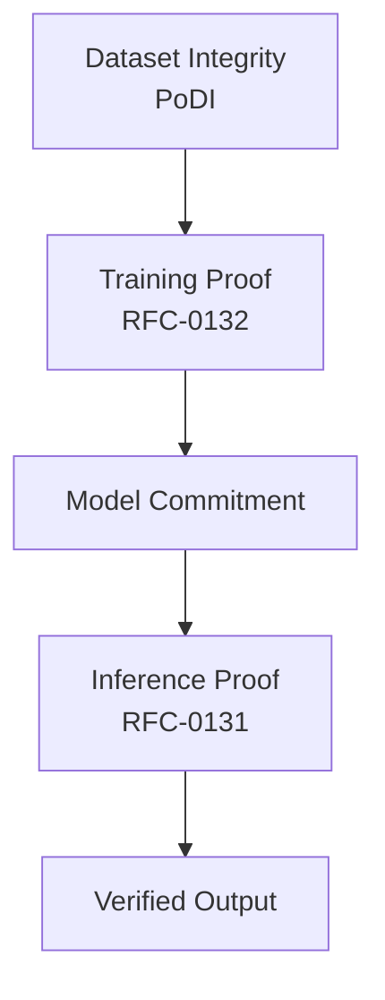

# RFC-0133 (Proof Systems): Proof-of-Dataset Integrity

## Status

Draft

> **Note:** This RFC was originally numbered RFC-0133 under the legacy numbering system. It remains at 0133 as it belongs to the Proof Systems category.

## Summary

This RFC defines **Proof-of-Dataset Integrity (PoDI)** — a framework for cryptographically verifying properties of datasets used in AI systems. PoDI provides proofs for dataset provenance, licensing compliance, statistical integrity, poisoning resistance, and reproducibility. By committing datasets via Merkle structures and validating through statistical and cryptographic proofs, PoDI completes the trust chain for verifiable AI: from raw data → trained model → inference → blockchain consensus.

## Design Goals

| Goal                  | Target                | Metric                 |
| --------------------- | --------------------- | ---------------------- |
| **G1: Provenance**    | All samples traceable | Source verification    |
| **G2: Licensing**     | Automated compliance  | License constraints    |
| **G3: Integrity**     | Poisoning detection   | Statistical proofs     |
| **G4: Composability** | Training integration  | Dataset root in proofs |
| **G5: Reputation**    | Quality scoring       | Multi-metric score     |

## Motivation

### CAN WE? — Feasibility Research

The fundamental question: **Can we cryptographically verify dataset properties?**

Current dataset verification faces challenges:

| Problem            | Verification Method                   |
| ------------------ | ------------------------------------- |
| Unknown provenance | Merkle commitment + source signatures |
| Data poisoning     | Statistical outlier proofs            |
| License violations | Metadata constraints                  |
| Bias               | Distribution constraint proofs        |
| Preprocessing      | Pipeline commitment                   |

Research confirms feasibility through:

- Merkle trees provide constant-size dataset commitments
- Statistical proofs can use AIR constraints
- ZK membership proofs enable privacy-preserving verification
- Reputation systems aggregate historical quality metrics

### WHY? — Why This Matters

Current AI datasets suffer from major trust issues:

| Problem                      | Impact                       |
| ---------------------------- | ---------------------------- |
| Unknown provenance           | Copyright/legal risk         |
| Data poisoning               | Model manipulation attacks   |
| Unverifiable bias            | Unfair/discriminatory models |
| Irreproducible preprocessing | Inconsistent results         |
| No data monetization         | Data creators uncompensated  |

PoDI enables datasets to become **verifiable digital assets**:

- **Trustworthy datasets** — Higher model reliability
- **Legal compliance** — Automated license enforcement
- **Poisoning resistance** — Safer AI systems
- **Dataset monetization** — New data economy
- **Scientific reproducibility** — Verifiable research

### WHAT? — What This Specifies

PoDI defines:

1. **Dataset commitment** — Merkle tree structure
2. **Metadata commitment** — License, source, preprocessing
3. **Provenance proofs** — Source verification
4. **Licensing verification** — Constraint-based compliance
5. **Poisoning resistance** — Statistical outlier detection
6. **Statistical integrity** — Distribution constraints
7. **Deduplication proofs** — Content fingerprinting
8. **Versioning** — Dataset evolution tracking
9. **Sharding** — Large dataset partitioning
10. **Retrieval proofs** — Sample verification
11. **Reputation system** — Quality scoring
12. **Challenge mechanism** — Fraud detection

### HOW? — Implementation

Implementation integrates with existing stack:

```
RFC-0108 (Verifiable AI Retrieval)
       ↓
RFC-0133 (Proof-of-Dataset Integrity) ← NEW
       ↓
RFC-0132 (Deterministic Training Circuits)
       ↓
RFC-0131 (Deterministic Transformer Circuit)
       ↓
RFC-0120 (Deterministic AI-VM)
       ↓
RFC-0124 (Proof Market)
       ↓
RFC-0125 (Model Liquidity Layer)
       ↓
RFC-0130 (Proof-of-Inference Consensus)
```

## Specification

### Dataset Commitment

Every dataset is committed via a deterministic pipeline:

```rust
/// Dataset commitment structure
struct DatasetCommitment {
    /// Unique dataset identifier
    dataset_id: Digest,

    /// Merkle root of all samples
    sample_root: Digest,

    /// Metadata root
    metadata_root: Digest,

    /// Sample count
    sample_count: u64,

    /// Shard roots (for large datasets)
    shard_roots: Vec<Digest>,
}

impl DatasetCommitment {
    /// Create dataset commitment
    fn commit(samples: &[DatasetSample], metadata: &DatasetMetadata) -> Self {
        // Hash each sample
        let sample_hashes: Vec<Digest> = samples
            .iter()
            .map(|s| s.content_hash())
            .collect();

        // Build Merkle tree
        let sample_root = MerkleTree::build(&sample_hashes);

        // Hash metadata
        let metadata_root = metadata.hash();

        // Create dataset ID
        let dataset_id = Poseidon::hash([sample_root, metadata_root]);

        Self {
            dataset_id,
            sample_root,
            metadata_root,
            sample_count: samples.len() as u64,
            shard_roots: Vec::new(),
        }
    }
}

/// Individual dataset sample
struct DatasetSample {
    /// Unique sample identifier
    sample_id: Digest,

    /// Content hash
    content_hash: Digest,

    /// Metadata hash
    metadata_hash: Digest,

    /// Label/target (if applicable)
    label: Option<Digest>,
}
```

### Dataset Metadata

Datasets commit comprehensive metadata:

```rust
/// Dataset metadata
struct DatasetMetadata {
    /// Creator identity
    creator: PublicKey,

    /// License type
    license: License,

    /// Data source
    source: DataSource,

    /// Creation timestamp
    created_at: Timestamp,

    /// Preprocessing pipeline commitment
    pipeline: PreprocessingPipeline,

    /// Statistical properties
    statistics: DatasetStatistics,
}

/// License types
enum License {
    /// Open with attribution
    CC BY,

    /// Commercial usage
    Commercial { royalty_rate: f64 },

    /// Research only
    ResearchOnly,

    /// Custom terms
    Custom { terms_hash: Digest },
}

/// Data source types
enum DataSource {
    /// Web crawl with logs
    WebCrawl { crawl_id: Digest, timestamp: Timestamp },

    /// Academic dataset
    Academic { institution: String, paper_ref: String },

    /// Synthetic data
    Synthetic { generator_id: Digest },

    /// Enterprise data
    Enterprise { source_org: String },
}

/// Preprocessing pipeline commitment
struct PreprocessingPipeline {
    /// Pipeline version
    version: String,

    /// Steps performed (hashed)
    steps_hash: Digest,

    /// Random seed (for reproducibility)
    seed: u64,
}
```

### Provenance Proofs

Data origin verification:

```rust
/// Provenance proof
struct ProvenanceProof {
    /// Source type
    source: DataSource,

    /// Source signature
    source_signature: Signature,

    /// Dataset root
    dataset_root: Digest,

    /// Timestamp
    timestamp: Timestamp,
}

impl ProvenanceProof {
    /// Verify provenance
    fn verify(&self, source_public_key: &PublicKey) -> bool {
        // Verify source signature
        source_public_key.verify(&self.source_signature, &self.dataset_root)
    }
}

/// Source verification types
enum SourceVerification {
    /// Signed crawl logs
    WebCrawl { logs: CrawlLogs, signature: Signature },

    /// Institutional signature
    Academic { institution_sig: Signature },

    /// Generator proof
    Synthetic { generator_proof: ZKProof },

    /// Enterprise attestation
    Enterprise { attested_source: Signature },
}
```

### Licensing Verification

License compliance through constraints:

```rust
/// License verification
struct LicenseVerifier {
    /// Allowed usage types
    allowed_usage: Vec<UsageType>,

    /// Revenue share configuration
    revenue_share: Option<RevenueShare>,

    /// Restrictions
    restrictions: Vec<Restriction>,
}

impl LicenseVerifier {
    /// Verify usage compliance
    fn verify_usage(&self, usage: &TrainingUsage) -> Result<(), LicenseError> {
        // Check allowed usage
        if !self.allowed_usage.contains(&usage.usage_type) {
            return Err(LicenseError::UsageNotAllowed);
        }

        // Check restrictions
        for restriction in &self.restrictions {
            restriction.check(usage)?;
        }

        Ok(())
    }
}

/// Training usage record
struct TrainingUsage {
    /// Type of usage
    usage_type: UsageType,

    /// Model trained
    model_id: Digest,

    /// Revenue generated (if applicable)
    revenue: Option<TokenAmount>,
}

enum UsageType {
    Research,
    Commercial,
    FineTuning,
    Redistribution,
}
```

### Poisoning Resistance

Statistical detection of adversarial samples:

```rust
/// Poisoning detection system
struct PoisoningDetector {
    /// Detection methods
    methods: Vec<DetectionMethod>,

    /// Threshold configuration
    thresholds: DetectionThresholds,
}

enum DetectionMethod {
    /// Embedding-based clustering
    EmbeddingClustering {
        embedding_model: Digest,
        cluster_count: u32,
    },

    /// Statistical distribution checks
    DistributionCheck {
        expected_distribution: Distribution,
        tolerance: f64,
    },

    /// Duplicate detection
    DuplicateDetection {
        fingerprint_type: FingerprintType,
        threshold: f64,
    },
}

impl PoisoningDetector {
    /// Generate poisoning resistance proof
    fn prove_no_poisoning(&self, samples: &[DatasetSample]) -> PoisoningProof {
        let results: Vec<DetectionResult> = samples
            .iter()
            .map(|s| self.detect(s))
            .collect();

        // Verify all samples below threshold
        let all_clean = results.iter().all(|r| r.score < self.thresholds.outlier);

        PoisoningProof {
            detection_method: self.methods.clone(),
            results,
            verified_clean: all_clean,
        }
    }
}

/// Poisoning detection result
struct DetectionResult {
    sample_id: Digest,
    score: f64,
    is_outlier: bool,
}

/// Poisoning resistance proof
struct PoisoningProof {
    detection_method: Vec<DetectionMethod>,
    results: Vec<DetectionResult>,
    verified_clean: bool,
}
```

### Statistical Integrity

Statistical guarantees via constraints:

```rust
/// Statistical integrity proofs
struct StatisticalVerifier {
    /// Required properties
    properties: Vec<StatisticalProperty>,
}

enum StatisticalProperty {
    /// Class balance constraint
    ClassBalance {
        class_counts: HashMap<String, u64>,
        tolerance: f64,
    },

    /// Feature variance minimum
    MinimumVariance {
        feature: String,
        min_variance: f64,
    },

    /// Entropy requirement
    MinimumEntropy {
        threshold: f64,
    },

    /// Sample uniqueness
    UniquenessRatio {
        min_unique_ratio: f64,
    },
}

impl StatisticalVerifier {
    /// Verify class balance constraint
    fn verify_class_balance(
        &self,
        class_counts: &HashMap<String, u64>,
        expected: &HashMap<String, f64>,
    ) -> Constraint {
        let total: u64 = class_counts.values().sum();

        let mut total_deviation = Q32_32::zero();

        for (class, expected_ratio) in expected {
            let actual_count = class_counts.get(class).unwrap_or(&0);
            let actual_ratio = Q32_32::from_f64(*actual_count as f64 / total as f64);
            let exp = Q32_32::from_f64(*expected_ratio);

            let deviation = (actual_ratio - exp).abs();
            total_deviation = total_deviation + deviation;
        }

        // Constraint: total_deviation < tolerance
        Constraint::new(total_deviation - Q32_32::from_f64(self.tolerance))
    }
}
```

### Deduplication Proofs

Content fingerprinting:

```rust
/// Deduplication system
struct Deduplicator {
    /// Fingerprint algorithm
    fingerprint: FingerprintType,

    /// Similarity threshold
    threshold: f64,
}

enum FingerprintType {
    /// SimHash for near-duplicate detection
    SimHash { dimension: u32 },

    /// MinHash for set similarity
    MinHash { permutations: u32 },

    /// Exact hash
    ExactHash,
}

impl Deduplicator {
    /// Compute fingerprints
    fn fingerprint(&self, samples: &[DatasetSample]) -> Vec<Digest> {
        samples.iter().map(|s| self.compute(s)).collect()
    }

    /// Generate deduplication proof
    fn prove_deduplication(
        &self,
        samples: &[DatasetSample],
    ) -> DeduplicationProof {
        let fingerprints = self.fingerprint(samples);
        let duplicates = self.find_duplicates(&fingerprints);

        let unique_ratio = 1.0 - (duplicates.len() as f64 / samples.len() as f64);

        DeduplicationProof {
            fingerprint_type: self.fingerprint.clone(),
            duplicate_count: duplicates.len(),
            unique_ratio,
            verified: unique_ratio >= self.threshold,
        }
    }
}
```

### Dataset Versioning

Evolution tracking:

```rust
/// Dataset version
struct DatasetVersion {
    /// Version number
    version: u32,

    /// Dataset root at this version
    root: Digest,

    /// Changes from previous version
    diff: DatasetDiff,

    /// Timestamp
    timestamp: Timestamp,
}

/// Dataset changes
struct DatasetDiff {
    /// Added samples
    added: Vec<Digest>,

    /// Removed samples
    removed: Vec<Digest>,

    /// Modified samples
    modified: Vec<(Digest, Digest)>,
}

/// Version chain
struct VersionChain {
    /// Versions in order
    versions: Vec<DatasetVersion>,
}

impl VersionChain {
    /// Add new version
    fn add_version(&mut self, root: Digest, diff: DatasetDiff) {
        let version = self.versions.last().map(|v| v.version + 1).unwrap_or(0);

        self.versions.push(DatasetVersion {
            version,
            root,
            diff,
            timestamp: Timestamp::now(),
        });
    }

    /// Verify lineage
    fn verify_lineage(&self) -> bool {
        for i in 1..self.versions.len() {
            let prev = &self.versions[i - 1];
            let curr = &self.versions[i];

            // Verify hash chain
            let expected = Poseidon::hash([prev.root, curr.diff.hash()]);
            if expected != curr.root {
                return false;
            }
        }
        true
    }
}
```

### Dataset Sharding

Large dataset partitioning:

```rust
/// Dataset sharding
struct DatasetSharding {
    /// Shard size
    shard_size: u64,

    /// Shard roots
    shard_roots: Vec<Digest>,
}

impl DatasetSharding {
    /// Create shards
    fn shard(&self, samples: &[DatasetSample]) -> Vec<DatasetShard> {
        samples
            .chunks(self.shard_size as usize)
            .enumerate()
            .map(|(i, chunk)| {
                let hashes: Vec<Digest> = chunk.iter().map(|s| s.content_hash()).collect();
                let root = MerkleTree::build(&hashes);

                DatasetShard {
                    shard_id: i as u32,
                    samples: chunk.to_vec(),
                    root,
                }
            })
            .collect()
    }

    /// Build global root from shards
    fn global_root(&self, shards: &[DatasetShard]) -> Digest {
        let shard_roots: Vec<Digest> = shards.iter().map(|s| s.root).collect();
        MerkleTree::build(&shard_roots)
    }
}

/// Individual shard
struct DatasetShard {
    shard_id: u32,
    samples: Vec<DatasetSample>,
    root: Digest,
}
```

### Retrieval Proofs

Sample verification during training/inference:

```rust
/// Retrieval proof
struct RetrievalProof {
    /// Sample hash
    sample_hash: Digest,

    /// Merkle path to root
    merkle_path: Vec<Digest>,

    /// Dataset root
    dataset_root: Digest,

    /// Sample index
    index: u64,
}

impl RetrievalProof {
    /// Verify sample belongs to dataset
    fn verify(&self) -> bool {
        MerkleTree::verify_path(
            self.dataset_root,
            self.sample_hash,
            self.index,
            &self.merkle_path,
        )
    }
}

/// Sample retrieval
struct SampleRetriever {
    /// Dataset commitment
    commitment: DatasetCommitment,
}

impl SampleRetriever {
    /// Retrieve sample with proof
    fn retrieve(&self, sample_id: &Digest) -> (DatasetSample, RetrievalProof) {
        let sample = self.find_sample(sample_id);
        let proof = self.generate_proof(sample_id);

        (sample, proof)
    }
}
```

### Reputation System

Quality scoring:

```rust
/// Dataset reputation
struct DatasetReputation {
    /// Dataset ID
    dataset_id: Digest,

    /// Component scores
    model_quality_score: f64,

    /// Usage metrics
    usage_volume: u64,

    /// Integrity check results
    integrity_score: f64,

    /// Challenge outcomes
    challenge_score: f64,
}

impl DatasetReputation {
    /// Calculate composite score
    fn composite_score(&self) -> f64 {
        0.4 * self.model_quality_score
            + 0.3 * (self.usage_volume as f64 / 1_000_000.0).min(1.0)
            + 0.3 * self.integrity_score
    }
}

/// Reputation oracle
struct ReputationOracle {
    /// Historical records
    records: HashMap<Digest, DatasetReputation>,
}

impl ReputationOracle {
    /// Update reputation based on model performance
    fn update_from_model(&mut self, dataset_id: Digest, model_performance: f64) {
        let rep = self.records.entry(dataset_id).or_insert_with(|| {
            DatasetReputation {
                dataset_id,
                model_quality_score: 0.5,
                usage_volume: 0,
                integrity_score: 1.0,
                challenge_score: 1.0,
            }
        });

        // Update with exponential moving average
        rep.model_quality_score = 0.9 * rep.model_quality_score + 0.1 * model_performance;
    }
}
```

### Challenge Mechanism

Fraud detection:

```rust
/// Dataset challenge
struct DatasetChallenge {
    /// Challenger
    challenger: PublicKey,

    /// Dataset being challenged
    dataset_id: Digest,

    /// Challenge type
    challenge_type: ChallengeType,

    /// Stake deposited
    stake: TokenAmount,
}

enum ChallengeType {
    /// Poisoned sample detection
    Poisoning { sample_ids: Vec<Digest> },

    /// Copyright violation
    Copyright { evidence: Digest },

    /// Statistical anomaly
    Statistical { property: StatisticalProperty },
}

impl DatasetChallenge {
    /// Resolve challenge
    fn resolve(&self, verdict: ChallengeVerdict) -> Result<(), ChallengeError> {
        match verdict {
            ChallengeVerdict::Valid => {
                // Slash dataset provider stake
                Ok(())
            }
            ChallengeVerdict::Invalid => {
                // Slash challenger stake
                Ok(())
            }
        }
    }
}
```

### Privacy-Preserving Verification

ZK membership proofs:

```rust
/// ZK membership proof
struct ZKMembershipProof {
    /// Proof of membership
    proof: Vec<u8>,

    /// Public parameters
    public_inputs: Vec<Digest>,
}

impl ZKMembershipProof {
    /// Prove sample is in dataset without revealing it
    fn prove_membership(
        dataset_root: Digest,
        sample: &DatasetSample,
        witness: MerkleWitness,
    ) -> Self {
        // Generate ZK proof of Merkle path
        let proof = zk_prove_membership(dataset_root, sample, witness);

        ZKMembershipProof {
            proof,
            public_inputs: vec![dataset_root],
        }
    }

    /// Verify without revealing sample
    fn verify(&self) -> bool {
        zk_verify_membership(&self.proof, &self.public_inputs)
    }
}
```

## Integration with Training Proofs

PoDI integrates with RFC-0132:

```rust
/// Training proof with dataset integrity
struct VerifiableTrainingProof {
    /// Dataset root (from PoDI)
    dataset_root: Digest,

    /// Sample retrieval proof
    sample_proof: RetrievalProof,

    /// Training proof (from RFC-0132)
    training_proof: TrainingProof,
}

impl VerifiableTrainingProof {
    /// Verify complete trust chain
    fn verify(&self) -> bool {
        // 1. Verify dataset integrity
        if !self.sample_proof.verify() {
            return false;
        }

        // 2. Verify training correctness
        if !self.training_proof.verify(&[self.dataset_root]) {
            return false;
        }

        true
    }
}
```

## End-to-End Trust Chain

With PoDI, the full AI lifecycle is verifiable:



```
Dataset Integrity Proof
        ↓
Training Proof (with dataset root)
        ↓
Model Commitment
        ↓
Inference Proof
        ↓
Verified AI Output
```

## Performance Targets

| Metric                  | Target | Notes               |
| ----------------------- | ------ | ------------------- |
| Commitment creation     | <1s    | Per 1K samples      |
| Provenance verification | <10ms  | Source signature    |
| Statistical proof       | <100ms | Distribution check  |
| Retrieval proof         | <5ms   | Merkle verification |
| Challenge resolution    | <1s    | Verification        |

## Adversarial Review

| Threat                | Impact | Mitigation                     |
| --------------------- | ------ | ------------------------------ |
| **Fake provenance**   | High   | Source signature verification  |
| **Hidden poisoning**  | High   | Statistical proof + challenges |
| **License violation** | Medium | Metadata constraints           |
| **Reputation gaming** | Medium | Multi-source scoring           |
| **Privacy leakage**   | Low    | ZK membership proofs           |

## Alternatives Considered

| Approach              | Pros              | Cons                      |
| --------------------- | ----------------- | ------------------------- |
| **Centralized audit** | Simple            | Single point of failure   |
| **Self-reported**     | Cheap             | No verification           |
| **This RFC**          | Full verification | Implementation complexity |
| **Random sampling**   | Fast              | Not comprehensive         |

## Implementation Phases

### Phase 1: Core Commitment

- [ ] Merkle tree structure
- [ ] Metadata commitment
- [ ] Basic provenance proofs

### Phase 2: Integrity Checks

- [ ] Statistical verification
- [ ] Poisoning detection
- [ ] Deduplication

### Phase 3: Integration

- [ ] Training proof integration
- [ ] Retrieval proofs
- [ ] Reputation system

### Phase 4: Advanced

- [ ] Privacy-preserving proofs
- [ ] Challenge mechanism
- [ ] Dataset marketplace

## Future Work

- **F1: Differential Privacy Proofs** — Prove DP noise addition
- **F2: Fairness Proofs** — Verify fairness metrics
- **F3: Data Lineage Graphs** — Trace models to sources
- **F4: Federated Dataset Proofs** — Support distributed providers

## Rationale

### Why Merkle Commitment?

Merkle trees provide:

- Constant-size root for arbitrary datasets
- Efficient per-sample proofs
- Append-only updates
- Cryptographic binding

### Why Statistical Proofs?

Statistical constraints ensure:

- Dataset quality guarantees
- Poisoning detection
- Bias prevention
- Reproducibility

### Why Reputation System?

Reputation aggregates:

- Historical quality
- Usage patterns
- Challenge outcomes
- Market value

## Related RFCs

- RFC-0106: Deterministic Numeric Tower
- RFC-0108: Verifiable AI Retrieval
- RFC-0125: Model Liquidity Layer
- RFC-0130: Proof-of-Inference Consensus
- RFC-0131: Deterministic Transformer Circuit
- RFC-0132: Deterministic Training Circuits
- RFC-0134: Self-Verifying AI Agents

## Related Use Cases

- [Hybrid AI-Blockchain Runtime](../../docs/use-cases/hybrid-ai-blockchain-runtime.md)
- [Verifiable AI Agents for DeFi](../../docs/use-cases/verifiable-ai-agents-defi.md)

## Appendices

### A. Complete Verifiable AI Stack

```
┌─────────────────────────────────────────────────────┐
│        Proof-of-Inference Consensus (RFC-0130)       │
└─────────────────────────┬───────────────────────────┘
                          │
┌─────────────────────────▼───────────────────────────┐
│        Model Liquidity Layer (RFC-0125)              │
└─────────────────────────┬───────────────────────────┘
                          │
┌─────────────────────────▼───────────────────────────┐
│        Proof Market (RFC-0124)                       │
└─────────────────────────┬───────────────────────────┘
                          │
┌─────────────────────────▼───────────────────────────┐
│        Hierarchical Inference (RFC-0121)            │
└─────────────────────────┬───────────────────────────┘
                          │
┌─────────────────────────▼───────────────────────────┐
│        Deterministic Training (RFC-0132)             │
└─────────────────────────┬───────────────────────────┘
                          │
┌─────────────────────────▼───────────────────────────┐
│        Transformer Circuit (RFC-0131)               │
└─────────────────────────┬───────────────────────────┘
                          │
┌─────────────────────────▼───────────────────────────┐
│        Proof-of-Dataset Integrity (RFC-0133)          │
└─────────────────────────┬───────────────────────────┘
                          │
┌─────────────────────────▼───────────────────────────┐
│        Verifiable AI Retrieval (RFC-0108)            │
└─────────────────────────┬───────────────────────────┘
                          │
┌─────────────────────────▼───────────────────────────┐
│        Deterministic Numeric Tower (RFC-0106)        │
└─────────────────────────────────────────────────────┘
```

### B. Dataset Royalty Example

```
Training Revenue: 100,000 OCTO

Dataset Royalty (20%): 20,000 OCTO

Split by dataset contribution:
- Source dataset A: 10,000 OCTO (50%)
- Source dataset B: 6,000 OCTO (30%)
- Source dataset C: 4,000 OCTO (20%)
```

### C. Challenge Slashing Example

```
Challenge: Poisoned sample detected

Verdict: Valid

Penalty:
- Dataset provider: 50% stake slashed
- Dataset flagged: "unverified"
- Challenger reward: 10% of slashed stake
```

---

**Version:** 1.0
**Submission Date:** 2026-03-07
**Last Updated:** 2026-03-07
