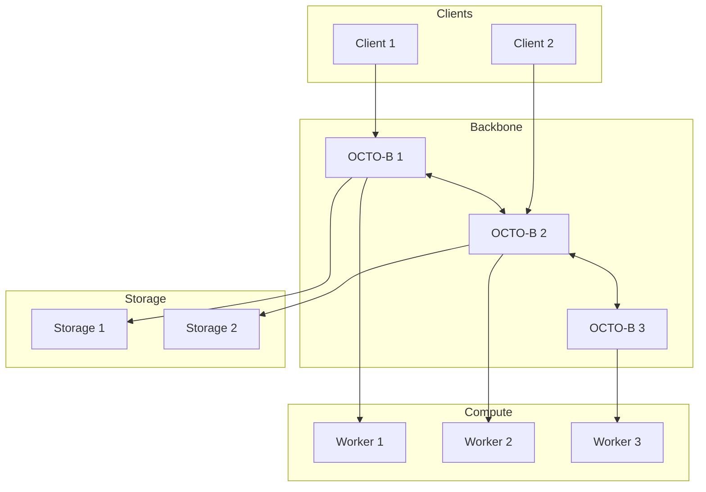

# RFC-0143: OCTO-Network Protocol

## Status

Draft

## Summary

This RFC defines the **OCTO-Network Protocol** — the distributed coordination layer that orchestrates peer discovery, task routing, shard synchronization, proof propagation, and block convergence across the CipherOcto network. OCTO-Network uses libp2p as its foundation, enabling permissionless participation while providing high-throughput routing through backbone nodes (OCTO-B). The protocol is the nervous system that connects all RFC components into a functioning distributed system.

## Design Goals

| Goal                      | Target                  | Metric              |
| ------------------------- | ----------------------- | ------------------- |
| **G1: Peer Discovery**    | <1s discovery           | Kademlia DHT        |
| **G2: Task Routing**      | <100ms routing          | Capability matching |
| **G3: Proof Propagation** | On-demand fetch         | No broadcast        |
| **G4: Scalability**       | 10K+ nodes              | Sublinear overhead  |
| **G5: Decentralization**  | Permissionless backbone | Stake-based entry   |

## Motivation

### CAN WE? — Feasibility Research

The fundamental question: **Can we build a coordination layer that scales to thousands of AI compute nodes?**

Current approaches face challenges:

| Challenge           | Impact                      |
| ------------------- | --------------------------- |
| Centralized routing | Single point of failure     |
| Broadcast overload  | Network congestion          |
| Shard coordination  | State management complexity |
| Proof propagation   | Bandwidth exhaustion        |

Research confirms feasibility through:

- libp2p provides battle-tested P2P primitives
- Kademlia DHT scales to millions of nodes
- Gossipsub enables efficient topic-based communication
- Erasure coding solves data availability at scale

### WHY? — Why This Matters

Without OCTO-Network:

- Shards cannot synchronize — inference fails
- Tasks cannot be distributed — no parallelism
- Proofs cannot propagate — consensus stalls
- Blocks cannot converge — network forks

OCTO-Network enables:

- **Horizontal scaling** — Add nodes, throughput increases
- **Fault tolerance** — Peer disappearance handled automatically
- **Geographic optimization** — Route to closest nodes
- **Permissionless operation** — Anyone can join

### WHAT? — What This Specifies

OCTO-Network defines:

1. **Peer discovery** — Kademlia DHT
2. **Capability advertisement** — Node roles and resources
3. **Task routing** — Job dispatch to suitable nodes
4. **Shard registry** — Who stores what
5. **Proof propagation** — On-demand retrieval
6. **Block gossip** — DAG propagation
7. **OCTO-B backbone** — High-availability coordinators

### HOW? — Implementation

Implementation integrates with existing stack:

```
RFC-0106 (Numeric Tower)
       ↓
RFC-0120 (AI-VM)
       ↓
RFC-0131 (Transformer Circuit)
       ↓
RFC-0130 (Proof-of-Inference)
       ↓
RFC-0143 (OCTO-Network) ← NEW
```

## Specification

### Network Architecture Overview



### Node Types

```rust
/// Node types in OCTO-Network
enum NodeType {
    /// Compute node - runs AI inference
    Compute {
        /// Available FLOPs
        flops: u64,
        /// GPU models
        gpus: Vec<GPUInfo>,
    },

    /// Storage node - stores model/dataset shards
    Storage {
        /// Available storage in TB
        capacity_tb: u64,
        /// Dataset IDs hosted
        datasets: Vec<Digest>,
    },

    /// Prover node - generates STARK proofs
    Prover {
        /// Proof generation speed
        proof_speed: u64,
    },

    /// Verifier node - verifies proofs
    Verifier {
        /// Verification capacity
        verifications_per_sec: u32,
    },

    /// Router node - routes tasks
    Router,

    /// Backbone node - network coordination
    Backbone {
        /// Geographic region
        region: String,
        /// Bandwidth in Gbps
        bandwidth_gbps: u32,
    },
}

/// Node capability advertisement
struct NodeCapability {
    /// Node identity
    node_id: PeerId,

    /// Node types
    types: Vec<NodeType>,

    /// Network endpoint
    endpoint: Multiaddr,

    /// Stake amount (for backbone)
    stake: Option<TokenAmount>,

    /// Metrics
    metrics: NodeMetrics,
}

struct NodeMetrics {
    /// Average latency to other nodes
    avg_latency_ms: u32,

    /// Uptime percentage
    uptime: f64,

    /// Total work completed
    work_completed: u64,

    /// Reputation score
    reputation: u64,
}
```

### Peer Discovery with Kademlia DHT

```rust
/// Kademlia DHT configuration
struct OctoKademliaConfig {
    /// Number of k-buckets
    k_bucket_size: usize,

    /// Replication factor
    replication_factor: usize,

    /// Query parallelism
    query_parallelism: usize,

    /// Cache TTL
    cache_ttl_secs: u64,
}

impl OctoKademliaConfig {
    fn default() -> Self {
        Self {
            k_bucket_size: 20,
            replication_factor: 10,
            query_parallelism: 3,
            cache_ttl_secs: 3600,
        }
    }
}

/// DHT record types
enum DHTRecord {
    /// Node capability advertisement
    Capability(NodeCapability),

    /// Model shard location
    ShardLocation {
        model_id: Digest,
        shard_id: u32,
        node_ids: Vec<PeerId>,
    },

    /// Dataset shard location
    DatasetLocation {
        dataset_id: Digest,
        shard_id: u32,
        node_ids: Vec<PeerId>,
    },

    /// Task routing
    TaskRouting {
        task_id: Digest,
        assigned_nodes: Vec<PeerId>,
    },
}

/// Peer discovery
struct PeerDiscovery;

impl PeerDiscovery {
    /// Find nodes with specific capabilities
    async fn find_nodes(
        &self,
        capability: NodeType,
        count: usize,
    ) -> Vec<PeerId> {
        // Query DHT for capability
        // Return nearest nodes
    }

    /// Advertise node capabilities
    async fn advertise(&self, capability: &NodeCapability) -> Result<(), Error> {
        // Put capability in DHT
    }
}
```

### Task Routing

```rust
/// Inference task
struct InferenceTask {
    /// Unique task ID
    task_id: Digest,

    /// Model to execute
    model_id: Digest,

    /// Required shards
    required_shards: Vec<u32>,

    /// Input hash
    input_hash: Digest,

    /// Difficulty (FLOPs target)
    difficulty: u64,

    /// Deadline
    deadline: Timestamp,

    /// Verification level
    verification: VerificationLevel,
}

/// Task router
struct TaskRouter {
    /// DHT client
    dht: Kademlia,

    /// Backbone nodes
    backbone: Vec<PeerId>,
}

impl TaskRouter {
    /// Route task to suitable nodes
    async fn route_task(&self, task: &InferenceTask) -> RouteResult {
        // 1. Find nodes with required model shards
        let shard_nodes = self.find_shard_nodes(task.model_id, &task.required_shards).await?;

        // 2. Filter by capability (compute + prover)
        let compute_nodes: Vec<PeerId> = shard_nodes
            .iter()
            .filter(|id| self.has_capability(id, NodeType::Compute))
            .cloned()
            .collect();

        // 3. Filter by geographic proximity
        let local_nodes = self.sort_by_latency(compute_nodes, task.input_hash).await;

        // 4. Assign to nodes
        let assignments = self.assign_tasks(&local_nodes, task).await?;

        Ok(RouteResult { assignments })
    }

    /// Find nodes hosting model shards
    async fn find_shard_nodes(
        &self,
        model_id: Digest,
        shards: &[u32],
    ) -> Result<Vec<PeerId>, Error> {
        let mut nodes = Vec::new();

        for &shard_id in shards {
            let key = format!("shard:{}.{}", model_id, shard_id);
            let records = self.dht.get(&key).await?;

            for record in records {
                if let DHTRecord::ShardLocation { node_ids, .. } = record {
                    nodes.extend(node_ids);
                }
            }
        }

        Ok(nodes)
    }
}

/// Routing result
struct RouteResult {
    /// Assigned compute nodes
    assignments: Vec<NodeAssignment>,
}

struct NodeAssignment {
    node_id: PeerId,
    shard_ids: Vec<u32>,
    estimated_completion: Timestamp,
}
```

### Shard Coordination

```rust
/// Shard registry entry
struct ShardRegistryEntry {
    /// Shard ID
    shard_id: ShardId,

    /// Primary storage nodes
    primary_nodes: Vec<PeerId>,

    /// Backup storage nodes
    backup_nodes: Vec<PeerId>,

    /// Availability score
    availability_score: f64,

    /// Last update
    last_update: Timestamp,
}

/// Shard coordinator
struct ShardCoordinator {
    /// Registry
    registry: HashMap<ShardId, ShardRegistryEntry>,

    /// Heartbeat tracker
    heartbeats: HashMap<PeerId, Timestamp>,
}

impl ShardCoordinator {
    /// Register shard
    async fn register_shard(&mut self, entry: ShardRegistryEntry) {
        self.registry.insert(entry.shard_id, entry);
    }

    /// Update heartbeat
    async fn heartbeat(&mut self, node_id: PeerId, shards: Vec<ShardId>) {
        self.heartbeats.insert(node_id, Timestamp::now());

        // Update shard availability
        for shard_id in shards {
            if let Some(entry) = self.registry.get_mut(&shard_id) {
                entry.availability_score = self.calculate_score(&entry);
            }
        }
    }

    /// Handle node failure
    async fn handle_failure(&mut self, node_id: &PeerId) {
        // Remove from primary
        // Promote backups
        // Trigger re-replication
    }

    /// Calculate availability score
    fn calculate_score(&self, entry: &ShardRegistryEntry) -> f64 {
        let mut score = 1.0;

        // Reduce for missing heartbeats
        for node in &entry.primary_nodes {
            let last_seen = self.heartbeats.get(node);
            if let Some(ts) = last_seen {
                let elapsed = Timestamp::now() - *ts;
                if elapsed > 300 {
                    score *= 0.9;
                }
            }
        }

        score
    }
}
```

### Block DAG Propagation with Gossipsub

```rust
/// Gossipsub topics
struct OctoTopics {
    /// Global block topic
    blocks_global: Topic,

    /// Shard-specific topics
    blocks_shard: HashMap<Digest, Topic>,
}

impl OctoTopics {
    fn new() -> Self {
        Self {
            blocks_global: Topic::new("octo.blocks.global"),
            blocks_shard: HashMap::new(),
        }
    }

    fn shard_topic(&self, model_id: Digest) -> Topic {
        self.blocks_shard
            .entry(model_id)
            .or_insert_with(|| Topic::new(&format!("octo.blocks.{}", model_id)))
            .clone()
    }
}

/// Block propagation
struct BlockPropagator {
    /// Gossipsub
    gossipsub: Gossipsub,

    /// Topics
    topics: OctoTopics,

    /// Message cache
    cache: MessageCache,
}

impl BlockPropagator {
    /// Publish block
    async fn publish(&self, block: &PoIBlock) {
        let topic = self.topics.shard_topic(block.model_id);
        let message = block.serialize();

        self.gossipsub.publish(topic, message).await?;
    }

    /// Subscribe to blocks
    async fn subscribe(&self, model_id: Option<Digest>) {
        match model_id {
            Some(id) => {
                let topic = self.topics.shard_topic(id);
                self.gossipsub.subscribe(topic).await?;
            }
            None => {
                self.gossipsub.subscribe(self.topics.blocks_global.clone()).await?;
            }
        }
    }
}
```

### Proof Propagation

```rust
/// Proof request
struct ProofRequest {
    /// Proof ID
    proof_id: Digest,

    /// Block ID
    block_id: Digest,

    /// Requester
    requester: PeerId,
}

/// Proof propagator (on-demand)
struct ProofPropagator {
    /// Request-response protocol
    protocol: RequestResponse,

    /// Proof cache
    cache: LRUCache<Digest, ZKProof>,
}

impl ProofPropagator {
    /// Request proof
    async fn request_proof(&self, proof_id: Digest, from: PeerId) -> Result<ZKProof, Error> {
        // Check cache first
        if let Some(proof) = self.cache.get(&proof_id) {
            return Ok(proof.clone());
        }

        // Request from peer
        let response = self.protocol
            .send_request(&from, ProofRequest { proof_id })
            .await?;

        // Cache result
        self.cache.put(proof_id, response.proof.clone());

        Ok(response.proof)
    }

    /// Announce proof availability
    async fn announce(&self, proof_id: Digest, block_id: Digest) {
        // Broadcast availability via gossipsub
        let msg = ProofAnnouncement {
            proof_id,
            block_id,
            available_at: self.local_peer_id(),
        };

        self.gossipsub
            .publish("octo.proofs", msg.serialize())
            .await?;
    }
}
```

### Data Availability Sampling

```rust
/// Data availability sample
struct DASRequest {
    /// Data root
    data_root: Digest,

    /// Fragment index
    index: u32,

    /// Challenge
    challenge: Digest,
}

/// Data availability checker
struct DataAvailabilityChecker {
    /// Erasure coding
    erasure: ReedSolomon,

    /// Sample requests
    sample_rate: u32,
}

impl DataAvailabilityChecker {
    /// Verify data availability
    async fn verify(&self, data_root: Digest, nodes: &[PeerId]) -> bool {
        let mut verified = 0;
        let samples_needed = 10;

        for node in nodes.iter().take(samples_needed) {
            // Request random fragment
            let request = DASRequest {
                data_root,
                index: rand::random(),
                challenge: rand::random(),
            };

            let fragment = self.request_fragment(node, request).await?;

            if self.verify_fragment(&fragment, &request) {
                verified += 1;
            }
        }

        // Success if majority verify
        verified >= samples_needed / 2
    }

    /// Request fragment from node
    async fn request_fragment(&self, node: &PeerId, request: DASRequest) -> Result<Vec<u8>, Error> {
        // Request-response protocol
    }
}
```

### OCTO-B Backbone Nodes

```rust
/// OCTO-B backbone node requirements
struct BackboneRequirements {
    /// Minimum stake
    min_stake: TokenAmount,

    /// Minimum bandwidth (Gbps)
    min_bandwidth_gbps: u32,

    /// Geographic diversity required
    regions: Vec<String>,

    /// Uptime requirement
    min_uptime: f64,

    /// Heartbeat interval
    heartbeat_interval_secs: u64,
}

impl BackboneRequirements {
    fn default() -> Self {
        Self {
            min_stake: TokenAmount::from(100_000), // 100k OCTO
            min_bandwidth_gbps: 10,
            regions: vec![
                "us-east".into(),
                "us-west".into(),
                "eu-central".into(),
                "asia-pacific".into(),
            ],
            min_uptime: 0.99,
            heartbeat_interval_secs: 30,
        }
    }
}

/// Backbone node
struct BackboneNode {
    /// Node ID
    node_id: PeerId,

    /// Region
    region: String,

    /// Connected peers
    connected_peers: HashSet<PeerId>,

    /// Routing table
    routing_table: RoutingTable,

    /// Network metrics
    metrics: NetworkMetrics,
}

impl BackboneNode {
    /// Become backbone node
    async fn register(&self, stake: TokenAmount) -> Result<(), Error> {
        let reqs = BackboneRequirements::default();

        if stake < reqs.min_stake {
            return Err(Error::InsufficientStake);
        }

        // Register in backbone registry
        // Start heartbeat
        // Begin routing

        Ok(())
    }
}
```

### Failure Handling

```rust
/// Network failure handler
struct FailureHandler {
    /// Peer manager
    peer_manager: PeerManager,

    /// Shard coordinator
    shard_coordinator: ShardCoordinator,
}

impl FailureHandler {
    /// Handle peer disconnect
    async fn handle_disconnect(&mut self, peer_id: &PeerId) {
        // Remove from peer manager
        self.peer_manager.remove(peer_id);

        // Handle shard re-replication
        self.shard_coordinator.handle_failure(peer_id).await;

        // Reassign any pending tasks
        self.reroute_tasks(peer_id).await;
    }

    /// Handle shard unavailable
    async fn handle_shard_unavailable(&mut self, shard_id: ShardId) {
        // Find alternative nodes
        let alternatives = self.find_alternative_nodes(shard_id).await;

        // Trigger re-replication
        self.trigger_replication(shard_id, alternatives).await;
    }

    /// Handle task timeout
    async fn handle_task_timeout(&mut self, task_id: &Digest) {
        // Cancel existing assignment
        // Re-route to new node
    }
}
```

## Integration with Consensus

```rust
/// Network integration with Proof-of-Inference
struct PoINetworkIntegration {
    /// Task router
    router: TaskRouter,

    /// Block propagator
    propagator: BlockPropagator,

    /// Proof propagator
    proof_propagator: ProofPropagator,
}

impl PoINetworkIntegration {
    /// Submit inference task for consensus
    async fn submit_consensus_task(&self, task: InferenceTask) -> TaskId {
        // 1. Route to compute nodes
        let route = self.router.route_task(&task).await.unwrap();

        // 2. Propagate to verifiers
        self.propagator.propagate_task(&task).await;

        // Return task ID
    }

    /// Broadcast new block
    async fn broadcast_block(&self, block: &PoIBlock) {
        // 1. Propagate block via gossipsub
        self.propagator.publish(block).await;

        // 2. Propagate proofs on-demand
        for proof in &block.proofs {
            self.proof_propagator.announce(proof.id, block.id).await;
        }
    }
}
```

## Performance Targets

| Metric            | Target | Notes          |
| ----------------- | ------ | -------------- |
| Peer discovery    | <1s    | Kademlia query |
| Task routing      | <100ms | DHT lookup     |
| Block propagation | <500ms | Gossipsub      |
| Proof retrieval   | <1s    | On-demand      |
| DAS verification  | <5s    | 10 samples     |

## Adversarial Review

| Threat                   | Impact | Mitigation            |
| ------------------------ | ------ | --------------------- |
| **Eclipse attack**       | High   | Multiple DHT queries  |
| **Sybil attack**         | High   | Stake requirement     |
| **Eclipse via gossip**   | Medium | Topic diversification |
| **Data withholding**     | High   | DAS + slashing        |
| **Routing manipulation** | Medium | Multiple paths        |

## Alternatives Considered

| Approach               | Pros                     | Cons                      |
| ---------------------- | ------------------------ | ------------------------- |
| **Centralized broker** | Simple                   | Single point of failure   |
| **Full broadcast**     | Reliable                 | Bandwidth waste           |
| **This RFC**           | Scalable + decentralized | Implementation complexity |
| **Tor-like onions**    | Privacy                  | High latency              |

## Implementation Phases

### Phase 1: Core Networking

- [ ] libp2p integration
- [ ] Kademlia DHT
- [ ] Basic peer discovery

### Phase 2: Task Routing

- [ ] Capability advertisement
- [ ] Task routing
- [ ] Shard registry

### Phase 3: Propagation

- [ ] Gossipsub integration
- [ ] Block propagation
- [ ] Proof on-demand

### Phase 4: Backbone

- [ ] OCTO-B requirements
- [ ] Backbone election
- [ ] Load balancing

## Future Work

- **F1: Multi-chain Routing** — Cross-chain task routing
- **F2: Privacy** — Onion routing for sensitive tasks
- **F3: QoS** — Quality of service guarantees
- **F4: IPv6** — Native IPv6 support

## Rationale

### Why libp2p?

libp2p provides:

- Battle-tested P2P primitives
- Modular architecture
- Active Rust ecosystem
- NAT traversal support

### Why on-demand proof propagation?

Broadcasting proofs wastes bandwidth. On-demand retrieval:

- Saves bandwidth
- Uses caching
- Scales better

### Why backbone nodes?

Backbone nodes provide:

- Geographic distribution
- High availability
- Reduced latency
- Network organization

## Related RFCs

- RFC-0106: Deterministic Numeric Tower
- RFC-0120: Deterministic AI Virtual Machine
- RFC-0130: Proof-of-Inference Consensus
- RFC-0131: Deterministic Transformer Circuit
- RFC-0132: Deterministic Training Circuits
- RFC-0133: Proof-of-Dataset Integrity
- RFC-0134: Self-Verifying AI Agents
- RFC-0140: Sharded Consensus Protocol
- RFC-0141: Parallel Block DAG Specification
- RFC-0142: Data Availability & Sampling Protocol

## Related Use Cases

- [Hybrid AI-Blockchain Runtime](../../docs/use-cases/hybrid-ai-blockchain-runtime.md)
- [Node Operations](../../docs/use-cases/node-operations.md)

## Appendices

### A. Complete Stack with OCTO-Network

```
┌─────────────────────────────────────────────────────┐
│        Applications                                    │
│   Self-Verifying Agents, Agent Organizations          │
└─────────────────────────┬───────────────────────────┘
                          │
┌─────────────────────────▼───────────────────────────┐
│        AI Execution Layer                              │
│   Transformer Circuits, Training Circuits              │
└─────────────────────────┬───────────────────────────┘
                          │
┌─────────────────────────▼───────────────────────────┐
│        Data Integrity Layer                           │
│   Proof-of-Dataset Integrity                          │
└─────────────────────────┬───────────────────────────┘
                          │
┌─────────────────────────▼───────────────────────────┐
│        Consensus Layer                                 │
│   Proof-of-Inference, Sharded Consensus               │
└─────────────────────────┬───────────────────────────┘
                          │
┌─────────────────────────▼───────────────────────────┐
│        Network Layer (RFC-0143)                        │
│   OCTO-Network (libp2p)                               │
│   Peer Discovery, Task Routing, Block Propagation     │
└─────────────────────────────────────────────────────┘
```

### B. Topic Structure

```
octo.blocks.global      - Global blocks
octo.blocks.{model_id}  - Model-specific blocks
octo.proofs            - Proof announcements
octo.tasks             - Task routing
octo.heartbeat        - Node heartbeats
```

### C. Backbone Requirements

```
Minimum Stake:      100,000 OCTO
Bandwidth:          10 Gbps
Uptime:             99%
Regions:            4+ geographic regions
Heartbeat:          30 seconds
```

---

**Version:** 1.0
**Submission Date:** 2026-03-07
**Last Updated:** 2026-03-07
