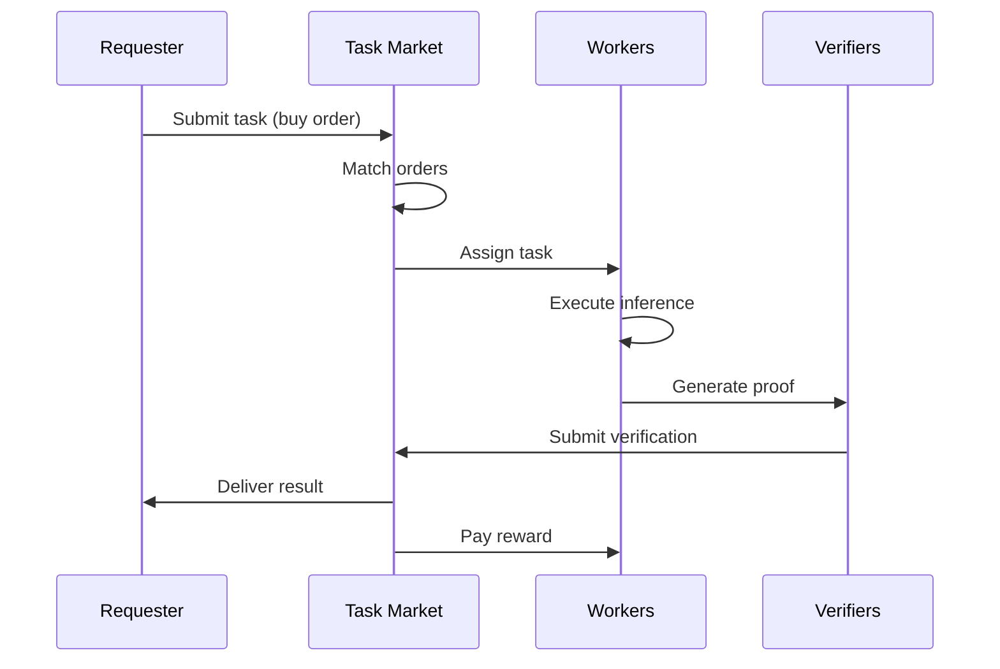

# RFC-0144 (Economics): Inference Task Market

## Status

Draft

> **Note:** This RFC was originally numbered RFC-0144 under the legacy numbering system. It remains at 0144 as it belongs to the Economics category.

## Summary

This RFC defines the **Inference Task Market** — an economic protocol that governs how inference tasks are created, priced, allocated, and executed within the Proof-of-Inference consensus. The market enables dynamic pricing based on supply (compute nodes) and demand (inference requests), difficulty adjustment based on network capacity, and fair task allocation among workers. This transforms the network into a self-regulating compute economy where AI inference becomes a tradable commodity.

## Design Goals

| Goal                          | Target                 | Metric             |
| ----------------------------- | ---------------------- | ------------------ |
| **G1: Dynamic Pricing**       | Market-clearing prices | <60s adjustment    |
| **G2: Task Allocation**       | Efficient matching     | <10s assignment    |
| **G3: Difficulty Adjustment** | Stable block time      | 10s target         |
| **G4: Fair Compensation**     | No starvation          | All nodes get work |
| **G5: Economic Security**     | Sybil resistance       | Stake requirement  |

## Motivation

### CAN WE? — Feasibility Research

The fundamental question: **Can we create a self-regulating market for AI inference that prevents manipulation while ensuring fair compensation?**

Market design challenges:

| Challenge          | Impact                |
| ------------------ | --------------------- |
| Price manipulation | Unstable economics    |
| Sybil attacks      | Fake demand/supply    |
| Task front-running | Unfair allocation     |
| Difficulty spikes  | Unpredictable rewards |

Research confirms feasibility through:

- Mechanism design (Vickrey-Clarke-Groves)
- Cryptoeconomic primitives (stake-weighted)
- Zero-knowledge for task verification
- On-chain order books

### WHY? — Why This Matters

Without a task market:

| Problem                  | Consequence                 |
| ------------------------ | --------------------------- |
| No pricing mechanism     | Inference value unknown     |
| No task allocation       | Workers idle or overwhelmed |
| No difficulty adjustment | Block times unstable        |
| No economic security     | Sybil attacks possible      |

The Inference Task Market enables:

- **Price discovery** — Market determines fair value
- **Efficient allocation** — Tasks to best workers
- **Stable consensus** — Difficulty adjusts automatically
- **Attack resistance** — Stake-based participation

### WHAT? — What This Specifies

The Task Market defines:

1. **Task types** — Inference, proof generation, verification
2. **Order book** — Buy/sell matching
3. **Pricing mechanism** — Dutch auction + Vickrey
4. **Difficulty adjustment** — Supply-demand algorithm
5. **Worker selection** — Reputation + stake weighted
6. **Reward distribution** — Block rewards + fees

### HOW? — Implementation

Integration with existing stack:

```
RFC-0124 (Proof Market)
       ↓
RFC-0144 (Inference Task Market) ← NEW
       ↓
RFC-0130 (Proof-of-Inference)
       ↓
RFC-0143 (OCTO-Network)
```

## Specification

### Task Types

```rust
/// Inference task types
enum TaskType {
    /// Standard inference request
    Inference(InferenceTask),

    /// Proof generation task
    ProofGeneration(ProofTask),

    /// Verification task
    Verification(VerificationTask),

    /// Aggregation task
    Aggregation(AggregationTask),
}

/// Standard inference task
struct InferenceTask {
    /// Unique task ID
    task_id: Digest,

    /// Model to execute
    model_id: Digest,

    /// Required shards
    required_shards: Vec<u32>,

    /// Input data commitment
    input_commitment: Digest,

    /// Output format
    output_spec: OutputSpec,

    /// Maximum price willing to pay
    max_price: TokenAmount,

    /// Deadline
    deadline: Timestamp,

    /// Verification level
    verification: VerificationLevel,
}

/// Proof generation task
struct ProofTask {
    /// Task ID
    task_id: Digest,

    /// Execution trace to prove
    trace_hash: Digest,

    /// Proof type required
    proof_type: ProofType,

    /// Reward
    reward: TokenAmount,
}

/// Verification task
struct VerificationTask {
    /// Task ID
    task_id: Digest,

    /// Proof to verify
    proof_id: Digest,

    /// Verification level
    level: VerificationLevel,

    /// Reward
    reward: TokenAmount,
}
```

### Order Book

```rust
/// Task order
struct TaskOrder {
    /// Order ID
    order_id: Digest,

    /// Order type
    order_type: OrderType,

    /// Task specification
    task: TaskType,

    /// Price (for sell orders)
    price: Option<TokenAmount>,

    /// Maximum price (for buy orders)
    max_price: Option<TokenAmount>,

    /// Creator
    creator: PublicKey,

    /// Timestamp
    created_at: u64,

    /// Expiration
    expires_at: u64,
}

enum OrderType {
    /// Buy order (requesters)
    Buy {
        /// Maximum price
        max_price: TokenAmount,

        /// Quantity (number of tasks)
        quantity: u32,
    },

    /// Sell order (workers)
    Sell {
        /// Asking price per task
        price: TokenAmount,

        /// Capacity (tasks per epoch)
        capacity: u32,
    },
}

/// Order book
struct TaskOrderBook {
    /// Buy orders (sorted by price desc)
    buy_orders: Vec<TaskOrder>,

    /// Sell orders (sorted by price asc)
    sell_orders: Vec<TaskOrder>,

    /// Order index
    order_index: HashMap<Digest, TaskOrder>,
}

impl TaskOrderBook {
    /// Match buy and sell orders
    fn match_orders(&mut self) -> Vec<TaskMatch> {
        let mut matches = Vec::new();

        // Sort orders
        self.buy_orders.sort_by(|a, b| {
            b.max_price.cmp(&a.max_price)
        });
        self.sell_orders.sort_by(|a, b| {
            a.price.cmp(&b.price)
        });

        // Match
        let mut buy_idx = 0;
        let mut sell_idx = 0;

        while buy_idx < self.buy_orders.len() && sell_idx < self.sell_orders.len() {
            let buy = &self.buy_orders[buy_idx];
            let sell = &self.sell_orders[sell_idx];

            // Check if match possible
            if buy.max_price >= sell.price {
                let match_price = (buy.max_price + sell.price) / 2; // Mid-price

                matches.push(TaskMatch {
                    buyer: buy.creator,
                    seller: sell.creator,
                    task: sell.task.clone(),
                    price: match_price,
                });

                buy_idx += 1;
                sell_idx += 1;
            } else {
                break;
            }
        }

        matches
    }

    /// Add buy order
    fn add_buy(&mut self, order: TaskOrder) {
        self.buy_orders.push(order);
    }

    /// Add sell order
    fn add_sell(&mut self, order: TaskOrder) {
        self.sell_orders.push(order);
    }
}

/// Matched task
struct TaskMatch {
    /// Buyer (requester)
    buyer: PublicKey,

    /// Seller (worker)
    seller: PublicKey,

    /// Task to execute
    task: TaskType,

    /// Clearing price
    price: TokenAmount,
}
```

### Pricing Mechanism

```rust
/// Pricing mechanism
struct PricingMechanism {
    /// Base price per FLOP
    base_price_per_flop: TokenAmount,

    /// Price floor
    floor_price: TokenAmount,

    /// Price ceiling
    ceiling_price: TokenAmount,

    /// Adjustment factor
    adjustment_factor: f64,
}

impl PricingMechanism {
    /// Calculate price based on market conditions
    fn calculate_price(
        &self,
        demand: u64,        // Pending tasks
        supply: u64,        // Available compute
        base_difficulty: u64,
    ) -> TokenAmount {
        // Supply/demand ratio
        let ratio = if supply > 0 {
            demand as f64 / supply as f64
        } else {
            f64::MAX
        };

        // Adjust price based on ratio
        let multiplier = if ratio > 1.0 {
            // High demand: increase price
            1.0 + (ratio - 1.0).min(1.0)
        } else {
            // Low demand: decrease price
            0.5 + (ratio * 0.5)
        };

        // Apply difficulty factor
        let difficulty_factor = base_difficulty as f64 / 1_000_000.0;

        let price = self.base_price_per_flop
            * multiplier
            * difficulty_factor;

        // Clamp to bounds
        price.clamp(self.floor_price, self.ceiling_price)
    }

    /// Dutch auction for time-sensitive tasks
    fn dutch_auction(
        &self,
        start_price: TokenAmount,
        floor: TokenAmount,
        decay_rate: f64,
        elapsed: u64,
    ) -> TokenAmount {
        let decay = 1.0 - (decay_rate * elapsed as f64);
        let price = start_price * decay;

        price.max(floor)
    }

    /// Vickrey second-price for important tasks
    fn vickrey(
        &self,
        bids: &[VickreyBid],
    ) -> (PublicKey, TokenAmount) {
        // Sort by price descending
        let mut sorted = bids.to_vec();
        sorted.sort_by(|a, b| b.price.cmp(&a.price));

        // Winner is highest bidder
        let winner = sorted[0].bidder;

        // Price is second-highest bid
        let price = if sorted.len() > 1 {
            sorted[1].price
        } else {
            sorted[0].price
        };

        (winner, price)
    }
}

/// Vickrey bid
struct VickreyBid {
    bidder: PublicKey,
    price: TokenAmount,
    reputation: u64,
}
```

### Difficulty Adjustment

```rust
/// Difficulty adjustment algorithm
struct DifficultyAdjuster {
    /// Target block time (seconds)
    target_block_time: u64,

    /// Adjustment window
    window_size: u32,

    /// Min difficulty
    min_difficulty: u64,

    /// Max difficulty
    max_difficulty: u64,
}

impl DifficultyAdjuster {
    /// Calculate new difficulty
    fn adjust(
        &self,
        current_difficulty: u64,
        recent_block_times: &[u64],
    ) -> u64 {
        // Calculate average block time
        let avg_time: u64 = if recent_block_times.is_empty() {
            self.target_block_time
        } else {
            recent_block_times.iter().sum::<u64>() / recent_block_times.len() as u64
        };

        // Adjustment factor
        let adjustment = if avg_time > self.target_block_time {
            // Blocks too slow: decrease difficulty
            self.target_block_time as f64 / avg_time as f64
        } else {
            // Blocks too fast: increase difficulty
            1.0 + (self.target_block_time as f64 - avg_time as f64) / self.target_block_time as f64
        };

        // Apply adjustment
        let new_difficulty = (current_difficulty as f64 * adjustment) as u64;

        // Clamp to bounds
        new_difficulty.clamp(self.min_difficulty, self.max_difficulty)
    }
}

/// Network statistics
struct NetworkStats {
    /// Total compute capacity (FLOPs/s)
    total_capacity: u64,

    /// Active workers
    active_workers: u32,

    /// Pending tasks
    pending_tasks: u64,

    /// Average task completion time
    avg_completion_time: u64,

    /// Task success rate
    success_rate: f64,
}

impl NetworkStats {
    /// Calculate supply/demand
    fn supply_demand_ratio(&self) -> f64 {
        if self.active_workers == 0 {
            return f64::MAX;
        }

        let capacity_per_worker = self.total_capacity / self.active_workers as u64;
        let tasks_per_worker = self.pending_tasks / self.active_workers as u64;

        if capacity_per_worker == 0 {
            return f64::MAX;
        }

        tasks_per_worker as f64 / capacity_per_worker as f64
    }
}
```

### Worker Selection

```rust
/// Worker selection algorithm
struct WorkerSelector {
    /// Selection strategy
    strategy: SelectionStrategy,
}

enum SelectionStrategy {
    /// Highest reputation
    ReputationWeighted,

    /// Lowest load
    LeastLoaded,

    /// Random (for fairness)
    Random,

    /// Stake-weighted
    StakeWeighted,

    /// Geographic proximity
    Geographic,
}

impl WorkerSelector {
    /// Select workers for task
    fn select_workers(
        &self,
        task: &InferenceTask,
        workers: &[Worker],
        count: usize,
    ) -> Vec<WorkerAssignment> {
        match self.strategy {
            SelectionStrategy::ReputationWeighted => {
                self.select_by_reputation(workers, task, count)
            }
            SelectionStrategy::LeastLoaded => {
                self.select_by_load(workers, task, count)
            }
            SelectionStrategy::Random => {
                self.select_random(workers, count)
            }
            SelectionStrategy::StakeWeighted => {
                self.select_by_stake(workers, task, count)
            }
            SelectionStrategy::Geographic => {
                self.select_by_region(workers, task, count)
            }
        }
    }

    fn select_by_reputation(
        &self,
        workers: &[Worker],
        task: &InferenceTask,
        count: usize,
    ) -> Vec<WorkerAssignment> {
        let mut sorted = workers.to_vec();
        sorted.sort_by(|a, b| b.reputation.cmp(&a.reputation));

        sorted
            .into_iter()
            .take(count)
            .map(|w| WorkerAssignment {
                worker: w.id,
                shards: self.assign_shards(task, w),
                reward_share: TokenAmount::from(0),
            })
            .collect()
    }

    fn select_random(
        &self,
        workers: &[Worker],
        count: usize,
    ) -> Vec<WorkerAssignment> {
        let mut rng = ChaCha8::from_seed(current_timestamp());
        let mut selected = workers.choose_multiple(&mut rng, count);

        selected
            .iter()
            .map(|w| WorkerAssignment {
                worker: w.id,
                shards: vec![],
                reward_share: TokenAmount::from(0),
            })
            .collect()
    }
}

/// Worker
struct Worker {
    /// Worker ID
    id: PublicKey,

    /// Reputation score
    reputation: u64,

    /// Stake
    stake: TokenAmount,

    /// Available capacity
    capacity: u64,

    /// Current load
    current_load: u32,

    /// Geographic region
    region: String,

    /// Success rate
    success_rate: f64,
}

/// Worker assignment
struct WorkerAssignment {
    worker: PublicKey,
    shards: Vec<u32>,
    reward_share: TokenAmount,
}
```

### Reward Distribution

```rust
/// Reward pool
struct RewardPool {
    /// Block subsidy
    block_subsidy: TokenAmount,

    /// Transaction fees
    fees: TokenAmount,

    /// Total rewards
    total: TokenAmount,
}

/// Reward distribution
struct RewardDistributor {
    /// Worker share
    worker_share: f64,

    /// Verifier share
    verifier_share: f64,

    /// Storage share
    storage_share: f64,

    /// Treasury share
    treasury_share: f64,
}

impl RewardDistributor {
    /// Distribute rewards
    fn distribute(
        &self,
        pool: &RewardPool,
        contributions: &[Contribution],
    ) -> HashMap<PublicKey, TokenAmount> {
        let worker_pool = pool.total * self.worker_share;
        let verifier_pool = pool.total * self.verifier_share;
        let storage_pool = pool.total * self.storage_share;
        let treasury = pool.total * self.treasury_share;

        let mut rewards = HashMap::new();

        // Distribute worker rewards proportionally
        let total_weight: f64 = contributions
            .iter()
            .map(|c| c.weight)
            .sum();

        for contribution in contributions {
            let share = contribution.weight / total_weight;
            let reward = worker_pool * share;
            rewards.insert(contribution.worker, reward);
        }

        rewards
    }
}

/// Work contribution
struct Contribution {
    worker: PublicKey,
    flops_completed: u64,
    proofs_generated: u32,
    weight: f64,
}
```

### Task Execution Flow



## Performance Targets

| Metric           | Target | Notes              |
| ---------------- | ------ | ------------------ |
| Order matching   | <5s    | Per epoch          |
| Price update     | <60s   | Dynamic adjustment |
| Worker selection | <1s    | Per task           |
| Task assignment  | <10s   | End-to-end         |

## Adversarial Review

| Threat                      | Impact | Mitigation         |
| --------------------------- | ------ | ------------------ |
| **Price manipulation**      | High   | Stake-based voting |
| **Task front-running**      | Medium | Commit-reveal      |
| **Sybil attacks**           | High   | Stake requirement  |
| **Worker collusion**        | Medium | Random selection   |
| **Difficulty manipulation** | High   | On-chain algorithm |

## Alternatives Considered

| Approach              | Pros                     | Cons                    |
| --------------------- | ------------------------ | ----------------------- |
| **Fixed price**       | Simple                   | Doesn't adapt           |
| **Centralized**       | Efficient                | Single point of failure |
| **This RFC**          | Adaptive + decentralized | Complexity              |
| **Prediction market** | Accurate                 | Computational cost      |

## Implementation Phases

### Phase 1: Core Market

- [ ] Order book
- [ ] Basic matching
- [ ] Fixed pricing

### Phase 2: Dynamic Pricing

- [ ] Supply/demand algorithm
- [ ] Difficulty adjustment
- [ ] Price bounds

### Phase 3: Worker Selection

- [ ] Reputation weighting
- [ ] Geographic routing
- [ ] Load balancing

### Phase 4: Economics

- [ ] Reward distribution
- [ ] Slashing integration
- [ ] Fee market

## Future Work

- **F1: Prediction Market** — Forecast difficulty
- **F2: Options/Futures** — Hedge volatility
- **F3: Cross-Chain** — Bridge markets
- **F4: Privacy** — Encrypted orders

## Rationale

### Why Market-Based?

Markets provide:

- Efficient price discovery
- Self-regulating supply/demand
- Incentive alignment

### Why Multiple Mechanisms?

Each task type needs different pricing:

- Dutch auction: Time-sensitive
- Vickrey: Important tasks
- Fixed: Standard requests

## Related RFCs

- RFC-0124 (Economics): Proof Market and Hierarchical Network
- RFC-0130 (Proof Systems): Proof-of-Inference Consensus
- RFC-0140 (Consensus): Sharded Consensus Protocol
- RFC-0143 (Networking): OCTO-Network Protocol

## Related Use Cases

- [Hybrid AI-Blockchain Runtime](../../docs/use-cases/hybrid-ai-blockchain-runtime.md)
- [Node Operations](../../docs/use-cases/node-operations.md)

---

**Version:** 1.0
**Submission Date:** 2026-03-07
**Last Updated:** 2026-03-07
