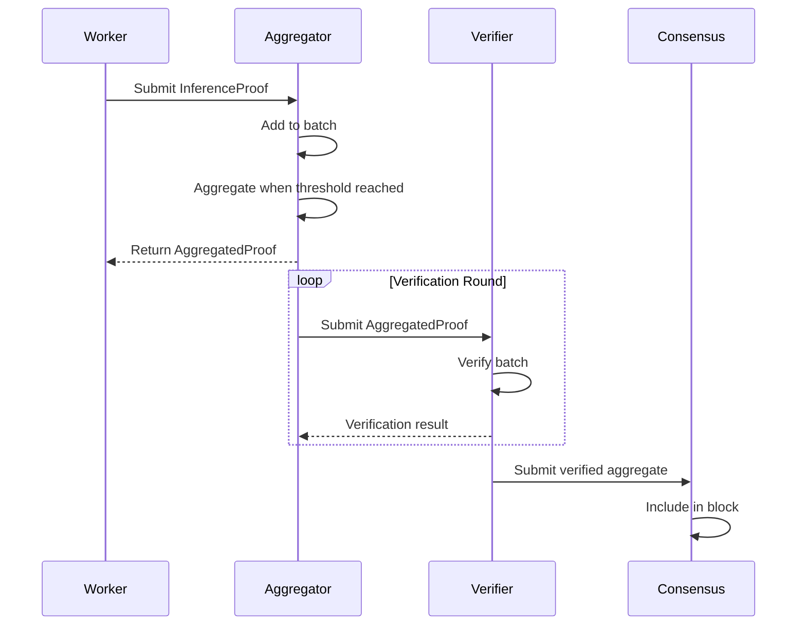

# RFC-0146: Proof Aggregation Protocol

## Status

Draft

## Summary

This RFC defines the **Proof Aggregation Protocol** — a system for combining multiple STARK proofs into single compressed proofs, enabling efficient verification of batched inference tasks without linear verification costs.

## Design Goals

| Goal | Target | Metric |
| ---- | ------ | ------ |
| G1: Proof Compression | 10x size reduction | >90% reduction |
| G2: Batch Verification | O(1) verification | Independent of batch size |
| G3: Recursive Composition | Multiple aggregation levels | Up to 2^10 proofs |
| G4: Incremental Updates | Add proofs to existing aggregate | O(log n) |

## Motivation

### CAN WE? — Feasibility Research

The fundamental question: **Can we efficiently aggregate STARK proofs while maintaining cryptographic security?**

Research confirms feasibility through:

- Recursive STARK composition (Vitalik's work)
- Batch proof techniques
- Fiat-Shamir transformation
- Accumulator-based aggregation

### WHY? — Why This Matters

Without proof aggregation:

| Problem | Consequence |
|---------|-------------|
| Linear verification cost | Each proof verified separately |
| Bandwidth explosion | Full proofs transmitted per task |
| Storage bloat | Large proof archives |
| Scalability ceiling | Network hits verification bottleneck |

Proof aggregation enables:

- **Efficient verification** — O(1) for aggregated batches
- **Reduced bandwidth** — Single proof per block
- **Storage efficiency** — Compressed proof archives
- **Infinite scaling** — Recursive composition

### WHAT? — What This Specifies

The protocol defines:

1. **Proof bundling** — Group related proofs
2. **Recursive aggregation** — Combine aggregates recursively
3. **Verification circuit** — Single circuit verifies batch
4. **Aggregation state** — Track aggregation progress

### HOW? — Implementation

Integration with existing stack:

```
RFC-0131 (Transformer Circuit)
       ↓
RFC-0132 (Training Circuits)
       ↓
RFC-0146 (Proof Aggregation) ← NEW
       ↓
RFC-0130 (Proof-of-Inference)
       ↓
RFC-0140 (Sharded Consensus)
```

## Specification

### Proof Types

```rust
/// Individual inference proof
struct InferenceProof {
    /// Proof identifier
    proof_id: Digest,

    /// Public inputs
    public_inputs: Vec<Digest>,

    /// STARK proof data
    proof_data: Vec<u8>,

    /// Metadata
    metadata: ProofMetadata,
}

/// Proof metadata
struct ProofMetadata {
    /// Task ID
    task_id: Digest,

    /// Worker that generated
    worker: PublicKey,

    /// Timestamp
    timestamp: u64,

    /// Proof size (bytes)
    size_bytes: u32,
}

/// Aggregated proof
struct AggregatedProof {
    /// Aggregate identifier
    aggregate_id: Digest,

    /// Number of proofs aggregated
    proof_count: u32,

    /// Combined public inputs
    public_inputs: Vec<Digest>,

    /// Aggregated proof
    proof_data: Vec<u8>,

    /// Aggregation level
    level: u8,
}
```

### Aggregation Levels

```rust
/// Aggregation hierarchy
enum AggregationLevel {
    /// Level 0: Individual proofs
    Individual,

    /// Level 1: Batch (2-16 proofs)
    Batch { count: u16 },

    /// Level 2: Super batch (16-256 proofs)
    SuperBatch { count: u16 },

    /// Level 3: Block (256-4096 proofs)
    Block { count: u16 },

    /// Level 4: Epoch (4096+ proofs)
    Epoch { count: u32 },
}

impl AggregationLevel {
    fn max_proofs(&self) -> u32 {
        match self {
            AggregationLevel::Individual => 1,
            AggregationLevel::Batch { count } => *count as u32,
            AggregationLevel::SuperBatch { count } => (*count as u32) * 16,
            AggregationLevel::Block { count } => (*count as u32) * 256,
            AggregationLevel::Epoch { count } => *count,
        }
    }
}
```

### Aggregation Algorithm

```rust
/// Proof aggregator
struct ProofAggregator {
    /// Current aggregation level
    level: AggregationLevel,

    /// Pending proofs
    pending: Vec<InferenceProof>,

    /// Aggregation threshold
    threshold: u16,
}

impl ProofAggregator {
    /// Add proof to aggregation
    fn add(&mut self, proof: InferenceProof) -> Option<AggregatedProof> {
        self.pending.push(proof);

        // Check if ready to aggregate
        if self.pending.len() >= self.threshold as usize {
            Some(self.aggregate())
        } else {
            None
        }
    }

    /// Aggregate pending proofs
    fn aggregate(&mut self) -> AggregatedProof {
        // Build aggregation circuit input
        let inputs = self.build_aggregation_inputs();

        // Run aggregation circuit
        let aggregated = self.run_aggregation_circuit(&inputs);

        // Clear pending
        self.pending.clear();

        aggregated
    }

    /// Build circuit inputs from pending proofs
    fn build_aggregation_inputs(&self) -> AggregationInputs {
        let mut public_inputs = Vec::new();
        let mut proof_commitments = Vec::new();

        for proof in &self.pending {
            // Hash public inputs
            let input_hash = digest(&proof.public_inputs);
            public_inputs.push(input_hash);

            // Commitment to proof
            let commitment = pedersen_commit(&proof.proof_data);
            proof_commitments.push(commitment);
        }

        AggregationInputs {
            public_inputs,
            proof_commitments,
            metadata: AggregationMetadata {
                count: self.pending.len() as u16,
                level: self.level.clone(),
            },
        }
    }

    /// Recursive aggregation
    fn aggregate_recursive(&self, proofs: &[AggregatedProof]) -> AggregatedProof {
        if proofs.len() == 1 {
            return proofs[0].clone();
        }

        // Split into halves
        let mid = proofs.len() / 2;
        let left = self.aggregate_recursive(&proofs[..mid]);
        let right = self.aggregate_recursive(&proofs[mid..]);

        // Combine
        self.combine_proofs(&left, &right)
    }
}
```

### Verification Circuit

```rust
/// Aggregation verification circuit
struct AggregationCircuit {
    /// Number of proofs to verify
    proof_count: usize,

    /// Circuit configuration
    config: CircuitConfig,
}

impl AggregationCircuit {
    /// Generate aggregation proof
    fn prove(&self, inputs: &AggregationInputs) -> AggregatedProof {
        // Use STARK prover
        let proof = stark_prove(inputs, self.config);

        AggregatedProof {
            aggregate_id: digest(&inputs.public_inputs),
            proof_count: inputs.metadata.count as u32,
            public_inputs: inputs.public_inputs.clone(),
            proof_data: proof.to_bytes(),
            level: self.level_as_u8(),
        }
    }

    /// Verify aggregated proof
    fn verify(&self, proof: &AggregatedProof, expected_output: Digest) -> bool {
        // Verify STARK proof
        let valid = stark_verify(
            &proof.proof_data,
            &proof.public_inputs,
            self.config,
        );

        // Check output
        let output = digest(&proof.public_inputs);
        valid && output == expected_output
    }
}

/// Public inputs for aggregation circuit
struct AggregationInputs {
    /// Individual proof hashes
    public_inputs: Vec<Digest>,

    /// Proof commitments
    proof_commitments: Vec<Digest>,

    /// Aggregation metadata
    metadata: AggregationMetadata,
}

struct AggregationMetadata {
    count: u16,
    level: AggregationLevel,
}
```

### Batch Verification

```rust
/// Batch verifier for multiple aggregated proofs
struct BatchVerifier {
    /// Verification keys
    vks: HashMap<u8, VerificationKey>,
}

impl BatchVerifier {
    /// Verify multiple aggregated proofs efficiently
    fn verify_batch(&self, proofs: &[AggregatedProof]) -> BatchVerificationResult {
        let mut results = Vec::new();

        // Parallel verification
        for proof in proofs {
            let vk = &self.vks[&proof.level];
            let result = self.verify_single(vk, proof);
            results.push(result);
        }

        // Check all valid
        let all_valid = results.iter().all(|r| r.valid);

        BatchVerificationResult {
            valid: all_valid,
            results,
            total_proofs: proofs.len(),
        }
    }

    /// Verify with early exit
    fn verify_with_early_exit(&self, proofs: &[AggregatedProof]) -> Option<usize> {
        for (i, proof) in proofs.iter().enumerate() {
            let vk = &self.vks[&proof.level];
            if !self.verify_single(vk, proof).valid {
                return Some(i); // Return first invalid index
            }
        }
        None
    }
}

struct BatchVerificationResult {
    valid: bool,
    results: Vec<SingleVerificationResult>,
    total_proofs: usize,
}
```

### Incremental Aggregation

```rust
/// Incremental proof aggregation
struct IncrementalAggregator {
    /// Current aggregate
    current: Option<AggregatedProof>,

    /// Pending proofs to add
    pending: Vec<InferenceProof>,

    /// Max aggregation level
    max_level: u8,
}

impl IncrementalAggregator {
    /// Add proof to existing aggregate
    fn add_to_aggregate(&mut self, proof: InferenceProof) -> AggregatedProof {
        match &self.current {
            Some(existing) => {
                // Combine existing with new proof
                let new_aggregate = self.combine_proofs(
                    existing,
                    &self.proof_to_aggregate(&proof),
                );

                self.current = Some(new_aggregate.clone());
                new_aggregate
            }
            None => {
                // Start new aggregate
                let aggregate = self.aggregate_pending();
                self.current = Some(aggregate.clone());
                aggregate
            }
        }
    }

    /// Get current aggregate proof
    fn get_aggregate(&self) -> Option<&AggregatedProof> {
        self.current.as_ref()
    }
}
```

### Aggregation Protocol Flow



## Performance Targets

| Metric | Target | Notes |
|--------|--------|-------|
| Aggregation latency | <30s | Per batch |
| Proof compression | >90% | Size reduction |
| Verification time | <100ms | Per aggregate |
| Max recursion depth | 10 levels | 2^10 = 1024 proofs |

## Adversarial Review

| Threat | Impact | Mitigation |
|--------|--------|------------|
| **Proof forgery** | High | Cryptographic verification |
| **Aggregation manipulation** | High | Commitment checks |
| **Verification bypass** | Critical | Multiple verification rounds |
| **Resource exhaustion** | Medium | Size limits, rate limits |

## Alternatives Considered

| Approach | Pros | Cons |
|----------|------|------|
| **Sequential verification** | Simple | O(n) cost |
| **Signature aggregation** | Fast | Not composable |
| **This approach** | Composable + efficient | Circuit complexity |
| **Supercomputation** | Infinite scaling | Trust assumptions |

## Implementation Phases

### Phase 1: Core Aggregation

- [ ] Basic proof bundling
- [ ] Batch aggregation circuit
- [ ] Verification interface

### Phase 2: Recursive Composition

- [ ] Multi-level aggregation
- [ ] Recursive proof combining
- [ ] Level management

### Phase 3: Optimization

- [ ] Incremental aggregation
- [ ] Parallel verification
- [ ] Compression tuning

### Phase 4: Integration

- [ ] Consensus integration
- [ ] Storage optimization
- [ ] Monitoring

## Future Work

- F1: Cross-shard proof aggregation
- F2: Privacy-preserving aggregation
- F3: Proof-of-provenance aggregation
- F4: Formal verification of aggregation circuit

## Rationale

### Why Recursive Aggregation?

Recursive aggregation provides:

- **Infinite scalability** — Compose any number of proofs
- **No trusted setup** — STARK-based
- **Constant verification** — O(1) regardless of batch size
- **Flexible batching** — Adaptive to network conditions

### Why Not Simple Batching?

Simple batching (multiple proofs in one transaction) still requires linear verification. Recursive aggregation achieves true O(1) verification.

## Related RFCs

- RFC-0131: Deterministic Transformer Circuit
- RFC-0132: Deterministic Training Circuits
- RFC-0130: Proof-of-Inference Consensus
- RFC-0140: Sharded Consensus Protocol

## Related Use Cases

- [Hybrid AI-Blockchain Runtime](../../docs/use-cases/hybrid-ai-blockchain-runtime.md)
- [Probabilistic Verification Markets](../../docs/use-cases/probabilistic-verification-markets.md)
- [Node Operations](../../docs/use-cases/node-operations.md)

---

**Version:** 1.0
**Submission Date:** 2026-03-07
**Last Updated:** 2026-03-07
