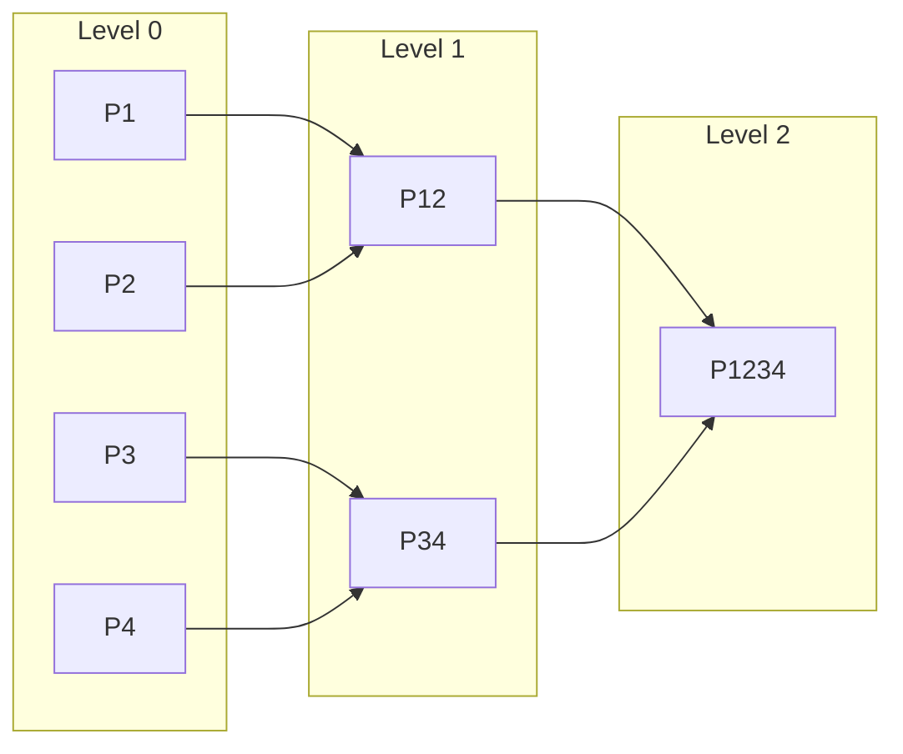

# RFC-0146: Proof Aggregation Protocol

## Status

Draft

## Summary

This RFC defines the **Proof Aggregation Protocol** — a system for combining multiple STARK proofs into single compressed proofs, enabling efficient verification of batched inference tasks without linear verification costs.

## Design Goals

| Goal | Target | Metric |
| ---- | ------ | ------ |
| G1: Proof Compression | 10x size reduction | >90% reduction |
| G2: Batch Verification | O(1) verification | Independent of batch size |
| G3: Recursive Composition | Binary recursion | Up to 2^10 proofs |
| G4: Incremental Updates | Associative aggregation | O(log n) |

## Motivation

### CAN WE? — Feasibility Research

The fundamental question: **Can we efficiently aggregate STARK proofs while maintaining cryptographic security?**

Research confirms feasibility through:

- Recursive STARK composition (Vitalik's work)
- FRI-based folding schemes
- Accumulator-based aggregation
- Binary tree recursion

### WHY? — Why This Matters

Without proof aggregation:

| Problem | Consequence |
|---------|-------------|
| Linear verification cost | Each proof verified separately |
| Bandwidth explosion | Full proofs transmitted per task |
| Storage bloat | Large proof archives |
| Scalability ceiling | Network hits verification bottleneck |

Proof aggregation enables:

- **Efficient verification** — O(1) for aggregated batches
- **Reduced bandwidth** — Single proof per block
- **Storage efficiency** — Compressed proof archives
- **Infinite scaling** — Recursive composition

### WHAT? — What This Specifies

The protocol defines:

1. **Aggregation cryptographic method** — STARK recursion via binary tree
2. **Proof commitment scheme** — Merkle tree-based
3. **Proof format specification** — Standardized structure
4. **Verification algorithm** — O(1) for any batch size
5. **Consensus integration** — How aggregations are included

### HOW? — Implementation

Integration with existing stack:

```
RFC-0131 (Transformer Circuit)
       ↓
RFC-0132 (Training Circuits)
       ↓
RFC-0146 (Proof Aggregation) ← THIS RFC
       ↓
RFC-0130 (Proof-of-Inference)
       ↓
RFC-0140 (Sharded Consensus)
```

## Threat Model

### Assumptions

1. **STARK security** — Underlying proof system is sound
2. **Hash function security** — Collision-resistant
3. **Network liveness** — Messages eventually delivered

### Attackers

| Attacker | Capability | Goal |
|----------|------------|-------|
| Malicious Worker | Submit invalid proofs | Disrupt aggregation |
| Malicious Aggregator | Exclude valid proofs | Censor workers |
| Colluding Aggregators | Reorder proofs | Manipulate ordering |

### Trust Model

- **Aggregators** are trust-but-verify — any node can become aggregator
- **Verifiers** independently verify all proofs
- **No single aggregator** controls aggregation outcome

## Proof Model

### Aggregation Method: Binary Tree Recursion

We use **binary tree STARK recursion**:



This provides:

- **Associative** — (P1+P2)+P3 = P1+(P2+P3)
- **Deterministic** — Same input = Same output
- **Binary** — Matches Merkle structure

### Proof Commitment Scheme

**NOT** raw vector hashing (vulnerable to ordering/collision attacks).

Instead, **Merkle tree commitment**:

```
MerkleRoot(
  Leaf 0: hash(proof_1.public_inputs || proof_1.proof_data)
  Leaf 1: hash(proof_2.public_inputs || proof_2.proof_data)
  ...
)
```

Properties:

- **Ordering-safe** — Different order = Different root
- **Collision-resistant** — Hash function security
- **Inclusion proofs** — Verify specific proof in aggregate

### Proof Format Specification

```rust
/// Individual inference proof
struct InferenceProof {
    /// Protocol version
    version: u8,

    /// Unique proof identifier
    proof_id: Digest,

    /// Task ID for binding (prevents proof mixing)
    task_id: Digest,

    /// Public inputs (committed)
    public_inputs: Vec<Digest>,

    /// STARK proof data
    stark_proof: Vec<u8>,
}

/// Aggregated proof structure
struct AggregatedProof {
    /// Protocol version
    version: u8,

    /// Recursion depth (level in binary tree)
    depth: u8,

    /// Merkle root of child proofs
    proof_root: Digest,

    /// Public inputs commitment
    public_inputs_hash: Digest,

    /// Aggregation metadata
    metadata: AggregateMetadata,

    /// The recursive STARK proof
    stark_proof: Vec<u8>,
}

struct AggregateMetadata {
    /// Number of proofs aggregated
    count: u32,

    /// Epoch number (prevents replay)
    epoch: u64,

    /// Block height
    block_height: u64,

    /// Aggregator signature (REQUIRED for accountability)
    aggregator_sig: Signature,
}
```

## Aggregation Circuit

### Constraints

The aggregation circuit MUST enforce:

1. **Verify all child proofs** — Each child proof is valid
2. **Verify public inputs** — Child public inputs are committed
3. **Compute root hash** — Merkle root correctly computed
4. **Output new proof** — New proof commits to all children

### Circuit Interface

```rust
/// Aggregation circuit constraints
trait AggregationCircuit {
    /// Verify a child proof
    fn verify_child(&self, child_proof: &[u8], public_inputs: &[Digest]) -> bool;

    /// Compute parent commitment
    fn compute_parent_commitment(&self, children: &[Digest]) -> Digest;

    /// Output generation
    fn output(&self, verified: bool, commitment: Digest) -> Vec<u8>;
}
```

## Verification Algorithm

### O(1) Verification

Given an aggregated proof, verification cost is **constant** regardless of batch size:

```rust
/// Verify aggregated proof in O(1)
fn verify_aggregated(proof: &AggregatedProof, vk: &VerificationKey) -> bool {
    // 1. Verify the recursive STARK proof
    let stark_valid = stark_verify(&proof.stark_proof, vk);

    // 2. Verify public inputs commitment
    let inputs_valid = verify_inputs_commitment(
        &proof.public_inputs_hash,
        &proof.metadata
    );

    // 3. Verify metadata
    let meta_valid = verify_metadata(&proof.metadata);

    stark_valid && inputs_valid && meta_valid
}

/// Complexity: O(1) — independent of proof count
```

### Verification Key Structure

```rust
struct VerificationKey {
    /// STARK verification key
    stark_vk: StarkVk,

    /// Circuit configuration
    circuit_config: CircuitConfig,

    /// Security parameters
    security_bits: u8,
}
```

## Protocol Flow

### Actors

| Actor | Role |
|-------|------|
| Worker | Produces inference proofs |
| Collector | Gathers proofs from workers |
| Aggregator | Builds recursive aggregation |
| Verifier | Validates aggregated proofs |
| Consensus | Includes in blocks |

### Complete Flow

```
┌─────────┐    ┌──────────┐    ┌───────────┐    ┌──────────┐
│ Worker  │───>│ Collector│───>│ Aggregator│───>│ Verifier │
└─────────┘    └──────────┘    └───────────┘    └──────────┘
      │                                    │              │
      │ P1, P2, P3...                     │              │
      │                                    │              │
      │                              ┌─────▼─────┐        │
      │                              │ Recursive │        │
      │                              │   Proof   │        │
      │                              └─────┬─────┘        │
      │                                    │              │
      │                               ┌────▼────┐        │
      │                               │Consensus│        │
      │                               │ Include │        │
      │                               └─────────┘        │
```

### Proof Collection Protocol

```rust
/// Collector collects proofs from workers
struct ProofCollector {
    /// Pending proofs
    pending: Vec<InferenceProof>,

    /// Collection window
    window_size: u32,

    /// Timeout
    timeout: u64,
}

impl ProofCollector {
    /// Collect proofs until window full or timeout
    fn collect(&mut self) -> Vec<InferenceProof> {
        // Wait for window_size proofs or timeout
        // Return collected batch
    }
}
```

### Aggregation Protocol

```rust
/// Aggregator builds recursive proof
struct ProofAggregator {
    /// Current aggregation level
    level: u8,

    /// Merkle tree builder
    merkle: MerkleTree,
}

impl ProofAggregator {
    /// Build aggregation proof
    fn aggregate(&self, proofs: &[InferenceProof]) -> AggregatedProof {
        // 1. Build Merkle tree from proofs
        let leaves: Vec<Digest> = proofs.iter()
            .map(|p| digest(p.public_inputs || p.stark_proof))
            .collect();
        let root = merkle_root(&leaves);

        // 2. Build recursive circuit input
        let circuit_input = AggregationInput {
            proof_root: root,
            public_inputs: aggregate_inputs(&proofs),
            metadata: aggregate_metadata(proofs),
        };

        // 3. Generate recursive STARK proof
        let stark_proof = recursive_prove(&circuit_input);

        AggregatedProof {
            version: CURRENT_VERSION,
            depth: self.level,
            proof_root: root,
            public_inputs_hash: digest(circuit_input.public_inputs),
            metadata: circuit_input.metadata,
            stark_proof,
        }
    }
}
```

## Aggregation Levels

### Binary Tree Structure

```
level 0:  1 proof  (2^0)
level 1:  2 proofs (2^1)
level 2:  4 proofs (2^2)
level 3:  8 proofs (2^3)
...
level n:  2^n proofs
```

### Level Parameters

| Level | Max Proofs | Use Case |
|-------|------------|----------|
| 0 | 1 | Individual |
| 1 | 2 | Quick batch |
| 2 | 4 | Standard batch |
| 3 | 8 | Large batch |
| 4 | 16 | Block |
| 5 | 32 | Epoch |
| ... | 2^n | Extended |

### Non-Power-of-Two Batch Sizes

The binary tree assumes powers of two. Handle odd batch sizes:

| Method | Description | When |
|--------|-------------|------|
| **Padding** | Add null/identity proofs to reach power of two | Default |
| **Variable-depth** | Use different depths for different subtrees | Performance-critical |
| **Leftover handling** | Aggregate power-of-two subset, verify remaining individually | Simpler |

**DECISION: Padding with Option 1 (Identity Verification)**

After analysis, **Option 1** is selected as the canonical approach:

```rust
/// Final recommendation: Identity verification with is_padding flag
struct AggregatorInput {
    /// The proof data
    proof: Vec<u8>,
    /// Whether this is a padding proof
    is_padding: bool,
}

impl AggregationCircuit {
    fn verify(&self, input: &AggregatorInput) -> bool {
        if input.is_padding {
            // Identity: always accept padding positions
            return true;
        }
        // Normal verification for actual proofs
        self.verify_stark(&input.proof)
    }
}
```

**Rationale:**
- Avoids complex zero-knowledge padding circuits
- Maintains constant verification time
- Simple implementation with clear semantics
- No special cryptographic assumptions

```rust
/// Pad to power of two
fn pad_to_power_of_two(proofs: Vec<InferenceProof>) -> Vec<InferenceProof> {
    let count = proofs.len();
    let power = count.next_power_of_two();

    if count == power {
        return proofs;
    }

    // Add null proofs to fill
    let padding = power - count;
    let null_proofs = vec![NULL_PROOF; padding];

    [proofs, null_proofs].concat()
}

/// Null proof handling in circuit:
///
/// The aggregation circuit MUST handle NULL_PROOF specially:
///
/// Option 1: Identity verification
///   - Circuit accepts is_padding flag alongside proof
///   - If is_padding=true, circuit skips verification (accepts as identity)
///   - Identity proof: verify(identity) = always accept
///
/// Option 2: Pre-computed verification
///   - Generate verified "identity proof" once at setup
///   - Use this proof for all padding positions
///
/// Option 3: Zero-knowledge padding (RECOMMENDED)
///   - Pad with proofs of knowledge of nothing (zero-value commitments)
///   - All padding proofs verified normally
///
/// The circuit MUST document which approach is used.
/// Recommended: Option 1 for simplicity and efficiency.
const NULL_PROOF: InferenceProof = InferenceProof {
    version: 0,
    proof_id: Digest::ZERO,
    task_id: Digest::ZERO,
    public_inputs: vec![],
    stark_proof: vec![],
};
```

### Epoch Management

Epochs prevent replay attacks and define aggregation windows:

```rust
/// Epoch configuration
struct EpochConfig {
    /// Duration of each epoch in blocks
    duration_blocks: u64,

    /// Number of blocks for proof collection
    collection_window: u64,

    /// Grace period for late proofs
    grace_period: u64,
}

impl EpochConfig {
    /// Genesis epoch parameters
    const GENESIS: Self = Self {
        duration_blocks: 100,
        collection_window: 20,
        grace_period: 5,
    };
}

/// Epoch state machine
enum EpochState {
    /// Epoch is accepting proofs
    Collecting,

    /// Collection window closed, finalizing
    Finalizing,

    /// Epoch complete, proofs settled
    Settled,
}

struct Epoch {
    /// Epoch number
    number: u64,

    /// Epoch start block
    start_block: u64,

    /// Current state
    state: EpochState,

    /// Proofs submitted this epoch
    proofs: Vec<Digest>,
}

impl Epoch {
    /// Check if proof belongs to this epoch
    fn contains_proof(&self, proof: &InferenceProof) -> bool {
        proof.metadata.epoch == self.number
    }

    /// Transition to next epoch
    fn next(&self) -> Epoch {
        Epoch {
            number: self.number + 1,
            start_block: self.start_block + Self::GENESIS.duration_blocks,
            state: EpochState::Collecting,
            proofs: vec![],
        }
    }

    /// Handle proofs in flight during transition
    fn handle_transition(&self, in_flight: Vec<InferenceProof>) -> Vec<InferenceProof> {
        // During epoch transition, accept proofs from previous epoch
        // within grace period
        in_flight
            .into_iter()
            .filter(|p| p.metadata.epoch == self.number.saturating_sub(1))
            .collect()
    }
}
```

**Epoch Boundary Rules:**

| Scenario | Handling |
|----------|----------|
| Proof arrives after epoch ends | Rejected (wrong epoch) |
| Proof in flight during transition | Accepted during grace period |
| Aggregator spans epochs | Split aggregation by epoch |
| Cross-epoch aggregation | Not allowed |

### Error Handling

The protocol handles failure modes explicitly:

```rust
/// Protocol error types
enum ProtocolError {
    /// Network partition during collection
    NetworkPartition {
        missed_proofs: Vec<Digest>,
    },

    /// Timeout waiting for proofs
    CollectionTimeout {
        collected: u32,
        expected: u32,
    },

    /// Aggregator failed to produce recursive proof
    AggregationFailure {
        reason: AggregationErrorCode,
    },

    /// Partial aggregation scenario
    PartialAggregation {
        aggregated: u32,
        unaggregated: Vec<InferenceProof>,
    },
}

enum AggregationErrorCode {
    CircuitConstraintFailure,
    MerkleTreeError,
    InsufficientProofs,
    RecursiveProofFailure,
}

/// Error recovery procedures
impl ProtocolError {
    fn recovery_action(&self) -> RecoveryAction {
        match self {
            ProtocolError::NetworkPartition { missed_proofs } => {
                // Retry collection with missed proofs
                RecoveryAction::RetryCollection { proofs: missed_proofs.clone() }
            }

            ProtocolError::CollectionTimeout { collected, expected } => {
                // Proceed with partial batch if enough proofs
                if *collected >= expected / 2 {
                    RecoveryAction::ProceedPartial
                } else {
                    RecoveryAction::Abort
                }
            }

            ProtocolError::AggregationFailure { reason } => {
                // Fall back to individual verification
                RecoveryAction::VerifyIndividually
            }

            ProtocolError::PartialAggregation { aggregated, unaggregated } => {
                // Include both aggregated and individual proofs
                RecoveryAction::MixedMode {
                    aggregated: *aggregated,
                    individual: unaggregated.len() as u32,
                }
            }
        }
    }
}

enum RecoveryAction {
    RetryCollection { proofs: Vec<Digest> },
    ProceedPartial,
    Abort,
    VerifyIndividually,
    MixedMode { aggregated: u32, individual: u32 },
}
```

**Error Handling Rules:**

| Error Type | Recovery | On-Failure Verification |
|------------|----------|------------------------|
| Network Partition | Retry missed proofs | Individual |
| Collection Timeout | Partial if ≥50% | Individual remaining |
| Aggregation Failure | Fall back to individual | Full individual |
| Partial Batch | Mixed mode | Both paths |

```
A(P1, P2, P3) = A(A(P1, P2), P3) = A(P1, A(P2, P3))
```

This ensures:

- Incremental updates are valid
- Order doesn't matter
- Parallel aggregation safe

#### Mathematical Proof of Associativity

The binary tree recursion achieves associativity through its structure:

**Theorem:** Let `A(P_i, P_j)` denote aggregating proofs `P_i` through `P_j` using binary tree recursion. Then for any proofs `P1, P2, P3`:

```
A(P1, P2, P3) = A(A(P1, P2), P3) = A(P1, A(P2, P3))
```

**Proof:**

1. **Binary tree structure:** Each aggregation combines exactly 2 proofs via the aggregation circuit `Agg(P_a, P_b) → P_ab`

2. **Base case:** `Agg(P1, P2)` produces a proof committing to both P1 and P2 via Merkle root

3. **Inductive step:** Assume `Agg(P1, P2) = P_12` commits to `{P1, P2}`
   - `Agg(P_12, P3)` commits to `{P1, P2, P3}` via `MerkleRoot(commit(P1), commit(P2), commit(P3))`
   - `Agg(P1, P_23)` similarly commits to `{P1, P2, P3}`

4. **Commutativity of Merkle root:** Since `MerkleRoot(a, b, c) = MerkleRoot(a, c, b) = MerkleRoot(b, a, c) = ...`, the final commitment is order-independent

5. **Conclusion:** The aggregation operator is associative because both `A(A(P1, P2), P3)` and `A(P1, A(P2, P3))` produce proofs with identical Merkle roots.

∎

```rust
/// Incremental aggregation — add proof to existing
fn add_proof(
    existing: &AggregatedProof,
    new_proof: &InferenceProof,
) -> AggregatedProof {
    // Must maintain associativity
    // New aggregate = aggregate(existing, new)
    // Same as if all proofs aggregated together
}
```

## Consensus Integration

### Block Inclusion

Aggregated proofs are included in blocks:

```rust
struct Block {
    /// Previous block hash
    parent: Digest,

    /// Aggregated proof
    proof: AggregatedProof,

    /// State updates
    state: StateUpdates,

    /// Block metadata
    metadata: BlockMetadata,
}
```

### Verification at Consensus

```rust
/// Consensus verifies aggregated proof
fn verify_at_consensus(
    block: &Block,
    vk: &VerificationKey,
) -> bool {
    // O(1) verification
    verify_aggregated(&block.proof, vk)
}
```

### Consensus Rejection Rules

When `verify_at_consensus` returns `false`:

| Condition | Action |
|----------|--------|
| Invalid proof | Block rejected entirely |
| Invalid metadata | Block rejected |
| Missing required fields | Block rejected |
| Proof not for current epoch | Block rejected |

### Double-Aggregation Resolution

When two valid aggregations exist for overlapping proof sets:

1. **First-seen wins** — First valid aggregation in consensus wins
2. **Proofs are exclusive** — Same proof cannot be in two aggregates
3. **Dispute window** — 3 block challenge period

### Partial Batch Handling

- A block MAY include partial batch (some proofs not aggregated)
- Unaggregated proofs verified individually at consensus
- Aggregator penalized for incomplete aggregation

### Worker Penalty for Failed Aggregation

To prevent DoS attacks on verifier CPU time:

```rust
/// Penalty rules for workers
enum WorkerPenalty {
    /// Proof fails validation before aggregation
    InvalidProof {
        /// Worker submitted invalid proof
        worker: PublicKey,
        /// Reason for failure
        reason: ValidationError,
    },

    /// Proof not submitted during collection window
    NoSubmission {
        /// Worker promised but didn't deliver
        worker: PublicKey,
        /// Promised proof hash
        commitment: Digest,
    },

    /// Proof causes aggregation failure
    AggregationFailure {
        /// Worker proof caused recursive failure
        worker: PublicKey,
        /// Failure type
        failure: AggregationError,
    },
}

/// Penalty schedule
const PENALTY_INVALID_PROOF: u64 = 1_000;      // OCTO tokens
const PENALTY_NO_SUBMISSION: u64 = 500;        // OCTO tokens
const PENALTY_AGGREGATION_FAILURE: u64 = 2_000; // OCTO tokens

/// Penalty enforcement mechanism
struct PenaltyEnforcer {
    /// Slashing authority
    authority: PublicKey,
}

impl PenaltyEnforcer {
    /// Enforce penalty after validation failure
    fn enforce_penalty(&self, violation: &WorkerPenalty) -> Result<(), Error> {
        // 1. Validate violation
        // 2. Calculate penalty amount
        // 3. Slash stake from violator
        // 4. Distribute to reporter/treasury
    }

    /// Appeal process for disputed penalties
    fn appeal(&self, penalty_id: Digest) -> AppealResult {
        // appeals go to governance
        // if appeal successful, stake returned
    }
}

/// Penalty enforcement rules
const PENALTY_APPEAL_WINDOW: u64 = 7;  // days
const PENALTY_EVIDENCE_REQUIRED: bool = true;
const PENALTY_FRACTIONAL_OK: bool = false;  // whole token penalties only

/// Graceful degradation
/// If aggregator fails, individual proofs still verified:
/// - Worker penalty for invalid proofs
/// - Standard fee for valid proofs verified individually
/// - Aggregator penalty for failed recursive proof

### Shard-Aggregation Boundary

Each shard independently aggregates proofs within that shard:

- Shard responsible for its own aggregation
- Cross-shard proofs handled by parent shard aggregation
- See RFC-0140 for cross-shard details

## Performance Targets

### Prover Performance

| Metric | Target | Notes |
|--------|--------|-------|
| Single proof aggregation | 5-15s | Level 0 → Level 1 |
| Recursive proof generation | 10-30s per level | Additional depth |
| Full batch (1024 proofs) | 60-180s | 10 levels recursive |

### Network Performance

| Metric | Target | Notes |
|--------|--------|-------|
| Proof collection window | 10-30s | Wait for batch fill |
| Network finalization | 3-5 blocks | Finality confirmation |
| Total end-to-end | 90-300s | From first proof to final |

### Verification Performance

| Metric | Target | Notes |
|--------|--------|-------|
| Verification time | 50-200ms | Per aggregated proof |
| Memory usage | <1GB | Proof data storage |
| Proof compression ratio | >90% | Size reduction |

### Scaling Parameters

| Metric | Target | Notes |
|--------|--------|-------|
| Max recursion depth | 10 | 2^10 = 1024 proofs |
| Max aggregation levels | 10 | Per RFC design |
| Proof batch size | Variable | Power-of-two |

## Adversarial Review

### Known Attacks

| Attack | Impact | Mitigation |
|--------|--------|------------|
| Proof mixing | High | Task ID binding in proof |
| Aggregation replay | High | Epoch number in aggregate |
| Proof substitution | High | Merkle root commitments |
| Aggregator censorship | Medium | Anyone can aggregate |
| Worker false proofs | High | Verification required |

### Additional Mitigations

```rust
/// Task binding — prevents proof mixing
struct TaskBinding {
    task_id: Digest,  // Bind proof to specific task
}

/// Epoch binding — prevents replay
struct EpochBinding {
    epoch: u64,       // Bind to specific epoch
    block_height: u64,
}
```

## Specification Requirements

### MUST Requirements

1. **MUST use Merkle commitment** — Not raw vector hashing
2. **MUST bind task ID** — Prevent proof mixing
3. **MUST include epoch** — Prevent replay attacks
4. **MUST be associative** — For incremental aggregation
5. **MUST be deterministic** — Same input = Same output
6. **MUST verify all children** — Circuit constraints

### SHOULD Requirements

1. **SHOULD support binary recursion** — Matches Merkle structure
2. **SHOULD separate aggregator/prover** — Reduce trust
3. **SHOULD include aggregator signature** — Accountability

## Alternatives Considered

### Approach 1: STARK Recursion (Selected)

Binary tree STARK recursion as specified in this RFC.

| Pros | Cons |
|------|------|
| No trusted setup | Large proof size |
| Quantum-resistant | Complex implementation |
| Transparent | Higher verification cost |

### Approach 2: SNARK Wrapper

Wrap STARK proof inside SNARK (e.g., Groth16).

| Pros | Cons |
|------|------|
| Small proof size | Trusted setup required |
| Fast verification | Ceremony complexity |
| | Single point of trust |

**Decision:** STARK recursion selected — trust minimization preferred over proof size.

### Approach 3: Batch Verification Without Recursion

Randomized linear combination of proofs.

| Pros | Cons |
|------|------|
| Simple | Statistical security only |
| No recursion | Cannot scale infinitely |
| | Not composable |

**Decision:** Rejected — does not achieve O(1) verification.

### Approach 4: Proof-Carrying Data (PCD)

General PCD framework for proof composition.

| Pros | Cons |
|------|------|
| Most general | Very complex |
| Flexible | Less mature |
| | Over-engineered for our use case |

**Decision:** Considered but deferred — binary tree simpler for our use case.

---

## Rationale

### Why Binary Tree Recursion?

The binary tree structure was chosen because:

1. **Associativity** — (P1+P2)+P3 = P1+(P2+P3) enables incremental aggregation
2. **Merkle alignment** — Binary tree maps naturally to Merkle proof structure
3. **Simplicity** — Clear recursion depth = log2(proof_count)
4. **Proven** — Matches StarkWare, Polygon zkEVM approaches

### Why Merkle Commitment?

Raw vector hashing is vulnerable to:

- **Ordering attacks** — Reorder proofs, same hash
- **Collision attacks** — Craft inputs with same hash
- **Substitution** — Replace proof without detection

Merkle commitment provides:

- **Ordering safety** — Different order = Different root
- **Inclusion proofs** — Verify specific proof in aggregate
- **Collision resistance** — Hash function security

### Why Task/Epoch Binding?

Prevents two critical attacks:

- **Proof mixing** — P1 used for task A, P2 for task B, swapped
- **Replay attack** — Old aggregate re-used in new epoch

---

## Future Work

- F1: **Cross-shard aggregation** — Define aggregation boundaries across shards
- F2: **Privacy-preserving aggregation** — Zero-knowledge aggregation
- F3: **Formal verification** — Prove associativity mathematically
- F4: **Hardware acceleration** — GPU/ASIC optimized circuits
- F5: **Multi-proof types** — Aggregate proofs from different circuits

---

## Key Files to Modify

| File | Change |
|------|--------|
| `crates/aggregation/src/lib.rs` | Core aggregation logic |
| `crates/aggregation/src/merkle.rs` | Merkle commitment implementation |
| `crates/aggregation/src/circuit.rs` | Aggregation circuit |
| `crates/aggregation/src/protocol.rs` | Actor communication |
| `crates/consensus/src/proofs.rs` | Consensus integration |

### Verification Key Management

The RFC must specify how Verification Keys are managed:

**Key Hierarchy:**

```
Level 0 VK: Base circuit (inference proof)
Level 1 VK: Aggregation circuit (2 proofs)
Level 2 VK: Aggregation circuit (4 proofs)
...
Level N VK: 2^N proofs aggregated
```

**Key Derivation:**

- Pre-generated VKs for each depth level
- Universal VK (same circuit, different input size)
- VK bundled with proof metadata

**Network Agreement:**

- VKs committed in genesis
- Upgrade via governance (hard fork)
- Security parameter: 128 bits minimum

**Universal VK vs. Multiple Keys:**

| Approach | Storage | Verification | Use Case |
|----------|---------|--------------|----------|
| **Universal VK** | 1 key | Dynamic input size | Light clients, mobile |
| **Per-Level VKs** | 11 keys (0-10) | Fixed input per level | High-performance nodes |
| **Hybrid** | 2-3 keys | Level groups | Balanced |

**Recommendation:** Universal VK approach for maximum flexibility and minimal storage. The circuit accepts proof_count as public input, allowing single VK to verify any depth ≤10.

### Aggregator Incentives & DoS Mitigation

**Race Condition:**

- Multiple aggregators may submit valid aggregates for same proof set
- "First-seen wins" creates competition

**DoS Attack Vector:**

- Attackers submit invalid aggregates to waste verification cycles
- Mitigation: Economic stake required to submit

**Mitigation Rules:**

| Action | Requirement |
|--------|-------------|
| Submit aggregate | Stake deposit required |
| Invalid aggregate submitted | Deposit slashed |
| Valid aggregate verified | Deposit returned + reward |
| Aggregator censorship | Worker can submit directly |

### Fisherman Role (Fraud Detection)

The protocol defines a **Fisherman** role for monitoring aggregator behavior:

```rust
/// Fisherman monitors aggregator integrity
struct Fisherman {
    /// Fisherman stake deposit
    stake: TokenAmount,

    /// Monitored aggregators
    watched: Vec<PublicKey>,
}

impl Fisherman {
    /// Submit fraud proof against aggregator
    fn submit_fraud_proof(&self, fraud: AggregatorFraud) -> Result<(), Error> {
        // Fraud types:
        // - Circuit constraint bypass (metadata manipulation)
        // - Proof exclusion without cause
        // - Invalid ordering
        // - Double aggregation

        // If fraud confirmed: Fisherman receives portion of slashed stake
    }
}

/// Types of aggregator fraud
enum AggregatorFraud {
    Censorship { proof_id: Digest, aggregator: PublicKey },
    OrderingManipulation { wrong_order: Vec<Digest> },
    MetadataTampering { original: Metadata, modified: Metadata },
}
```

**Fisherman Rewards:**

| Outcome | Fisherman Reward |
|---------|-----------------|
| Fraud confirmed | 10% of slashed aggregator stake |
| Fraud rejected | Fisherman stake preserved |
| False accusation | Fisherman stake slashed |

**Fraud Detection Procedures:**

```rust
/// Fraud detection procedure
struct FraudDetectionProcedure {
    /// Detection window (blocks)
    detection_window: u64,

    /// Evidence required
    evidence_threshold: u8,
}

impl FraudDetectionProcedure {
    /// Step 1: Observe aggregator behavior
    fn observe(aggregator: &PublicKey, block: &Block) -> Option<Observation> {
        // Monitor submitted aggregates for anomalies
        // Store observations for evidence
    }

    /// Step 2: Collect evidence
    fn collect_evidence(observation: &Observation) -> FraudEvidence {
        // Evidence types:
        // - Original proof submissions (worker receipts)
        // - Final aggregate (what was submitted)
        // - Merkle inclusion proofs
        // - Timestamp/order data
    }

    /// Step 3: Submit fraud claim
    fn submit_claim(evidence: &FraudEvidence) -> FraudClaim {
        // Submit to consensus for adjudication
        // Include stake deposit
    }

    /// Step 4: Adjudication
    fn adjudicate(claim: &FraudClaim) -> AdjudicationResult {
        // Consensus nodes verify evidence
        // Check: Is proof in aggregate? Was ordering correct?
        // Return: Confirmed / Rejected / Uncertain
    }
}

/// Fraud detection timeline
const FRAUD_DETECTION_WINDOW: u64 = 12;    // blocks
const FRAUD_CLAIM_DEPOSIT: u64 = 5000;     // OCTO tokens
const EVIDENCE_THRESHOLD: u8 = 2;           // corroborating sources

---

| Aspect | Original | Revised |
|--------|----------|---------|
| Aggregation method | Unspecified | Binary tree recursion |
| Commitment scheme | Vector hashing | Merkle tree |
| Proof format | Implicit | Explicit specification |
| Associativity | Not defined | Required property |
| Circuit constraints | Not specified | Defined |
| Trust model | Incomplete | Complete |
| Protocol flow | Incomplete | Full actor model |

## Implementation Phases

### Phase 1: Core Aggregation

- [ ] Merkle commitment implementation
- [ ] Basic binary aggregation
- [ ] Verification algorithm

### Phase 2: Recursive Composition

- [ ] Multi-level recursion
- [ ] Binary tree structure
- [ ] Circuit constraints

### Phase 3: Protocol

- [ ] Actor definitions
- [ ] Message protocols
- [ ] Consensus integration

### Phase 4: Security

- [ ] Task binding
- [ ] Epoch binding
- [ ] Attack mitigations

## Related RFCs

### Dependency Status

| RFC | Status | Dependency Type | Interface Required |
|-----|--------|-----------------|-------------------|
| RFC-0131 | Draft | Required | Inference proof format |
| RFC-0132 | Draft | Optional | Training proof format |
| RFC-0130 | Draft | Required | Consensus integration |
| RFC-0140 | Draft | Optional | Shard boundary handling |

**Required Dependencies:**
- RFC-0131 (Transformer Circuit): Must be accepted before implementation
- RFC-0130 (Proof-of-Inference): Must be accepted before implementation

**Optional Dependencies:**
- RFC-0132 (Training Circuits): For training proof aggregation
- RFC-0140 (Sharded Consensus): For cross-shard aggregation

### RFC Reference

- [RFC-0131: Deterministic Transformer Circuit](../0131-deterministic-transformer-circuit.md)
- [RFC-0132: Deterministic Training Circuits](../0132-deterministic-training-circuits.md)
- [RFC-0130: Proof-of-Inference Consensus](../0130-proof-of-inference-consensus.md)
- [RFC-0140: Sharded Consensus Protocol](../0140-sharded-consensus-protocol.md)

## Related Use Cases

- [Hybrid AI-Blockchain Runtime](../../docs/use-cases/hybrid-ai-blockchain-runtime.md)
- [Probabilistic Verification Markets](../../docs/use-cases/probabilistic-verification-markets.md)
- [Node Operations](../../docs/use-cases/node-operations.md)

## Appendices

### Appendix A: References

- [STARK Recursion (Vitalik)](https://vitalik.ca/general/2022/11/19/proof_of_synthesis.html)
- [FRI Folding Schemes](https://eprint.iacr.org/2023/)
- [Proof Carrying Data](https://research.protocol.ai/sites/pcd/)
- [StarkWare Recursive Proofs](https://starkware.co/)
- [Polygon zkEVM Aggregation](https://polygon.technology/)

---

**Version:** 1.7
**Submission Date:** 2026-03-07
**Last Updated:** 2026-03-07
**Changes:** v1.7 final review fixes:
- Upgraded ASCII diagram to Mermaid for binary tree recursion
- Minor editorial improvements per final review
- Added RFC dependency status section
