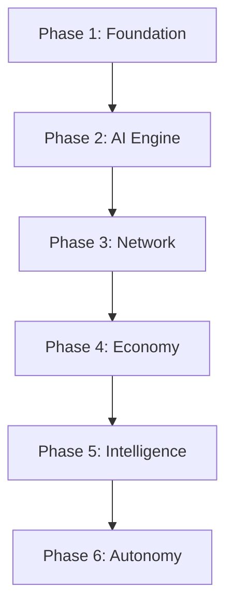

# RFC-0147 (Process/Meta): Implementation Roadmap

## Status

Draft

> **Note:** This RFC was originally numbered RFC-0147 under the legacy numbering system. It remains at 0147 as it belongs to the Process/Meta category.

## Summary

This RFC defines the **Implementation Roadmap** for CipherOcto — a phased approach to implementing the complete protocol stack from foundational determinism to autonomous agent organizations.

## Design Goals

| Goal                      | Target                       | Metric          |
| ------------------------- | ---------------------------- | --------------- |
| G1: Clear phases          | Logical implementation order | Dependency-safe |
| G2: Measurable milestones | Each phase has deliverable   | Testable        |
| G3: Risk mitigation       | Incremental value delivery   | Early wins      |
| G4: Parallelization       | Independent workstreams      | Max concurrency |

## Motivation

### CAN WE? — Feasibility Research

The fundamental question: **Can we sequence 40+ RFCs into an implementable roadmap?**

Research confirms feasibility through:

- Dependency analysis of all RFCs
- Identification of parallel workstreams
- Clear phase boundaries
- Independent testing at each phase

### WHY? — Why This Matters

Without a clear roadmap:

| Problem              | Consequence               |
| -------------------- | ------------------------- |
| Implementation chaos | Unknown start point       |
| Dependency conflicts | Blocked teams             |
| Scope creep          | Never reaching completion |
| Risk concentration   | All eggs in one basket    |

A phased roadmap enables:

- **Incremental delivery** — Value at each phase
- **Parallel work** — Independent tracks
- **Risk management** — Bounded blast radius
- **Clear ownership** — Team responsibilities

### WHAT? — What This Specifies

This roadmap defines:

1. **Phase structure** — 6 implementation phases
2. **Phase deliverables** — What each phase achieves
3. **Dependency ordering** — RFC implementation order
4. **Parallel tracks** — Independent workstreams
5. **Success criteria** — How to verify completion

### HOW? — Implementation

This RFC serves as the implementation master plan. All teams should reference it.

## Specification

### Phase Overview

| Phase | Name         | Duration | Focus              | RFCs                  |
| ----- | ------------ | -------- | ------------------ | --------------------- |
| 1     | Foundation   | 3 months | Deterministic Math | 0104-0106, 0116       |
| 2     | AI Engine    | 4 months | VM + Circuits      | 0120, 0131-0132       |
| 3     | Network      | 3 months | P2P + Consensus    | 0143, 0130, 0140-0142 |
| 4     | Economy      | 3 months | Markets + Data     | 0144, 0133, 0100-0101 |
| 5     | Intelligence | 3 months | Retrieval + Agents | 0108-0114, 0134       |
| 6     | Autonomy     | 4 months | Organizations      | 0118-0119, 0145-0146  |

**Total Duration:** 20 months (estimated)

### Phase 1: Foundation

**Goal:** Enable deterministic computation locally.

```
Objective: Build the mathematical foundation for all subsequent work.
```

#### Deliverables

- [ ] DFP (Deterministic Floating-Point) implementation
- [ ] DQA (Deterministic Quant Arithmetic) implementation
- [ ] Numeric Tower with Q32.32, Q16.16 types
- [ ] Unified Deterministic Execution Model

#### RFCs Required

| RFC      | Title                           | Priority |
| -------- | ------------------------------- | -------- |
| RFC-0104 | Deterministic Floating-Point    | Required |
| RFC-0105 | Deterministic Quant Arithmetic  | Required |
| RFC-0106 | Deterministic Numeric Tower     | Required |
| RFC-0116 | Unified Deterministic Execution | Required |

#### Parallel Tracks

```
Track 1A: DFP Implementation
Track 1B: DQA Implementation
Track 1C: Numeric Tower Integration
Track 1D: Execution Model Definition
```

#### Success Criteria

- [ ] All numeric operations produce bit-identical results across CPU/GPU
- [ ] Benchmarks show <2x overhead vs native float32
- [ ] 100% test coverage for edge cases

#### Risks & Mitigations

| Risk                 | Impact | Mitigation                                |
| -------------------- | ------ | ----------------------------------------- |
| Performance overhead | High   | Optimize hot paths, profile extensively   |
| Hardware variance    | Medium | Reference implementation for verification |

---

### Phase 2: AI Engine

**Goal:** Enable deterministic AI execution.

```
Objective: Build the virtual machine and transformer circuits.
```

#### Deliverables

- [ ] AI-VM with 40-opcode instruction set
- [ ] Canonical operator library (MATMUL, Attention, Softmax)
- [ ] Deterministic Transformer Circuit
- [ ] Deterministic Training Circuits

#### RFCs Required

| RFC      | Title                            | Priority |
| -------- | -------------------------------- | -------- |
| RFC-0120 | Deterministic AI-VM              | Required |
| RFC-0131 | Transformer Circuit              | Required |
| RFC-0132 | Training Circuits                | Required |
| RFC-0121 | Verifiable Large Model Execution | Required |
| RFC-0123 | Scalable Verifiable AI           | Optional |

#### Parallel Tracks

```
Track 2A: AI-VM Core Implementation
Track 2B: Operator Library
Track 2C: Transformer Circuit
Track 2D: Training Circuit
```

#### Success Criteria

- [ ] AI-VM executes transformer inference deterministically
- [ ] STARK proof generation <30s per layer
- [ ] Proof verification <10ms

---

### Phase 3: Network

**Goal:** Enable distributed node coordination.

```
Objective: Build the P2P network and consensus mechanism.
```

#### Deliverables

- [ ] OCTO-Network Protocol (libp2p)
- [ ] Proof-of-Inference Consensus
- [ ] Sharded Consensus Protocol
- [ ] Parallel Block DAG
- [ ] Data Availability Sampling

#### RFCs Required

| RFC      | Title                 | Priority |
| -------- | --------------------- | -------- |
| RFC-0143 | OCTO-Network Protocol | Required |
| RFC-0130 | Proof-of-Inference    | Required |
| RFC-0140 | Sharded Consensus     | Required |
| RFC-0141 | Parallel Block DAG    | Required |
| RFC-0142 | Data Availability     | Required |

#### Parallel Tracks

```
Track 3A: Network Protocol
Track 3B: Consensus Core
Track 3C: Sharding
Track 3D: Block Production
```

#### Success Criteria

- [ ] Nodes can discover peers and exchange messages
- [ ] Block time stable at 10s
- [ ] Shard count adjustable (16-256)
- [ ] TPS >1000

---

### Phase 4: Economy

**Goal:** Enable economic incentives.

```
Objective: Build the compute market and data economy.
```

#### Deliverables

- [ ] Inference Task Market
- [ ] Proof-of-Dataset Integrity
- [ ] AI Quota Marketplace
- [ ] Verification Markets

#### RFCs Required

| RFC      | Title                 | Priority |
| -------- | --------------------- | -------- |
| RFC-0144 | Inference Task Market | Required |
| RFC-0133 | Dataset Integrity     | Required |
| RFC-0100 | AI Quota Marketplace  | Required |
| RFC-0101 | Quota Router Agent    | Required |
| RFC-0115 | Verification Markets  | Required |

#### Parallel Tracks

```
Track 4A: Task Market
Track 4B: Dataset Integrity
Track 4C: Verification
Track 4D: Pricing Mechanisms
```

#### Success Criteria

- [ ] Workers receive tasks and submit results
- [ ] Dynamic pricing stabilizes
- [ ] Dataset integrity verifiable on-chain

---

### Phase 5: Intelligence

**Goal:** Enable verifiable AI cognition.

```
Objective: Build retrieval, reasoning, and agent capabilities.
```

#### Deliverables

- [ ] Verifiable AI Retrieval
- [ ] Query Routing
- [ ] Verifiable Reasoning Traces
- [ ] Self-Verifying AI Agents
- [ ] Hardware Capability Registry

#### RFCs Required

| RFC      | Title                        | Priority |
| -------- | ---------------------------- | -------- |
| RFC-0108 | Verifiable AI Retrieval      | Required |
| RFC-0109 | Retrieval Architecture       | Required |
| RFC-0113 | Query Routing                | Required |
| RFC-0114 | Verifiable Reasoning Traces  | Required |
| RFC-0134 | Self-Verifying AI Agents     | Required |
| RFC-0145 | Hardware Capability Registry | Required |

#### Parallel Tracks

```
Track 5A: Retrieval Pipeline
Track 5B: Reasoning Verification
Track 5C: Agent Framework
Track 5D: Hardware Registry
```

#### Success Criteria

- [ ] RAG pipelines produce verifiable outputs
- [ ] Agents generate reasoning traces
- [ ] Task routing matches capabilities

---

### Phase 6: Autonomy

**Goal:** Enable autonomous organizations.

```
Objective: Build agent governance and organizations.
```

#### Deliverables

- [ ] Agent Organizations
- [ ] Alignment Control Mechanisms
- [ ] Proof Aggregation Protocol
- [ ] Model Liquidity Layer
- [ ] Production Readiness

#### RFCs Required

| RFC      | Title                          | Priority |
| -------- | ------------------------------ | -------- |
| RFC-0118 | Autonomous Agent Organizations | Required |
| RFC-0119 | Alignment Control Mechanisms   | Required |
| RFC-0146 | Proof Aggregation Protocol     | Required |
| RFC-0125 | Model Liquidity Layer          | Required |

#### Parallel Tracks

```
Track 6A: Organization Governance
Track 6B: Alignment Systems
Track 6C: Proof Aggregation
Track 6D: Integration Testing
```

#### Success Criteria

- [ ] Multiple agents can form organizations
- [ ] Governance decisions on-chain
- [ ] Proof aggregation achieves 90%+ compression

---

## Dependency Graph



## Parallelization Opportunities

Within each phase, multiple tracks can execute in parallel:

```
Phase 1:
├── Track 1A: DFP
├── Track 1B: DQA
├── Track 1C: Tower
└── Track 1D: Execution Model

Phase 2:
├── Track 2A: AI-VM
├── Track 2B: Operators
├── Track 2C: Transformer
└── Track 2D: Training

Phase 3:
├── Track 3A: Network
├── Track 3B: Consensus
├── Track 3C: Sharding
└── Track 3D: DAG

Phase 4:
├── Track 4A: Task Market
├── Track 4B: Dataset
├── Track 4C: Verification
└── Track 4D: Pricing

Phase 5:
├── Track 5A: Retrieval
├── Track 5B: Reasoning
├── Track 5C: Agents
└── Track 5D: Hardware

Phase 6:
├── Track 6A: Organizations
├── Track 6B: Alignment
├── Track 6C: Aggregation
└── Track 6D: Integration
```

## Milestone Timeline

| Month | Phase | Milestone                  |
| ----- | ----- | -------------------------- |
| 3     | 1     | Deterministic math working |
| 7     | 2     | AI inference verifiable    |
| 10    | 3     | Network consensus running  |
| 13    | 4     | Markets operational        |
| 16    | 5     | Agents self-verifying      |
| 20    | 6     | Full autonomy achieved     |

## Risk Management

| Phase | Primary Risk          | Mitigation                  |
| ----- | --------------------- | --------------------------- |
| 1     | Performance overhead  | Profile, optimize hot paths |
| 2     | Circuit complexity    | Start simple, iterate       |
| 3     | Network instability   | Testnet first               |
| 4     | Economic manipulation | Stake-based security        |
| 5     | Agent alignment       | Gradual capability release  |
| 6     | Governance attacks    | Robust voting mechanism     |

## Resource Requirements

| Phase | Team Size   | Infrastructure          |
| ----- | ----------- | ----------------------- |
| 1     | 4 engineers | Dev machines            |
| 2     | 6 engineers | GPU cluster             |
| 3     | 8 engineers | Distributed testnet     |
| 4     | 6 engineers | Testnet                 |
| 5     | 8 engineers | Integration environment |
| 6     | 6 engineers | Mainnet staging         |

## Success Metrics

| Metric       | Phase 1 | Phase 3   | Phase 6 |
| ------------ | ------- | --------- | ------- |
| Determinism  | 100%    | 100%      | 100%    |
| TPS          | N/A     | 1000+     | 1000+   |
| Node count   | 10      | 1000      | 10000+  |
| Verification | Manual  | Semi-auto | Auto    |

## Related RFCs

All RFCs are related to this roadmap. Key dependencies:

- RFC-0104: Deterministic Floating-Point
- RFC-0106: Deterministic Numeric Tower
- RFC-0120: Deterministic AI-VM
- RFC-0130: Proof-of-Inference Consensus
- RFC-0143: OCTO-Network Protocol
- RFC-0144: Inference Task Market
- RFC-0134: Self-Verifying AI Agents

## Related Documentation

- [Architecture Overview (RFC-0000)](./0000-cipherocto-architecture-overview.md)
- [Architecture Overview (docs)](../docs/ARCHITECTURE.md)
- [Hybrid AI-Blockchain Runtime](../docs/use-cases/hybrid-ai-blockchain-runtime.md)

---

**Version:** 1.0
**Submission Date:** 2026-03-07
**Last Updated:** 2026-03-07
