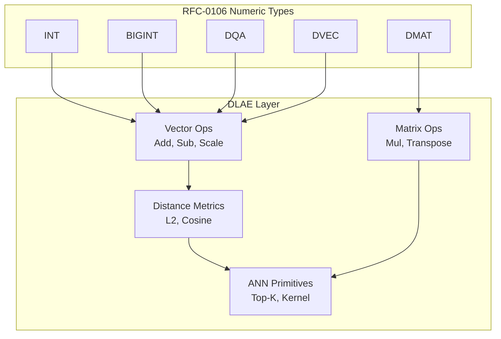

# RFC-0148: Deterministic Linear Algebra Engine (DLAE)

## Status

**Version:** 1.0
**Status:** Draft
**Submission Date:** 2026-03-10

## Summary

This RFC defines the Deterministic Linear Algebra Engine (DLAE) for the CipherOcto VM. The DLAE provides consensus-safe primitives for vector and matrix operations, distance metrics, dot products, and neural inference. All operations produce bit-identical results across all nodes, building on the numeric types defined in RFC-0106 (DQA, DVEC, DMAT). No floating-point arithmetic is permitted.

## Design Goals

| Goal | Target           | Metric                                                          |
| ---- | ---------------- | --------------------------------------------------------------- |
| G1   | Determinism      | Bit-identical results across CPU architectures, compilers, SIMD |
| G2   | Consensus Safety | No non-associative reductions, no undefined overflow            |
| G3   | ZK Compatibility | Representable inside zero-knowledge circuits                    |
| G4   | Performance      | Support vector similarity, embedding search, ANN                |

## Motivation

The CipherOcto VM requires deterministic linear algebra operations for:

- Vector similarity search
- Embedding comparisons
- On-chain ML inference
- Deterministic ANN

Current blockchain VMs lack deterministic linear algebra. This RFC provides the primitives needed for AI workloads while maintaining consensus safety.

## Specification

### System Architecture



### Core Data Structures

#### Deterministic Vector

```
DVec<T, N>

struct DVec<T, const N: usize> {
    data: [T; N]
}
```

Constraints:

- `1 ≤ N ≤ MAX_VECTOR_DIM`
- Consensus constant: `MAX_VECTOR_DIM = 4096`

#### Deterministic Matrix

```
DMat<T, M, N>

struct DMat<T, const M: usize, const N: usize> {
    data: [T; M * N]  // row-major storage
}
```

Storage layout: row-major
Index calculation: `index = row * N + column`
Maximum dimension: `MAX_MATRIX_DIM = 512`

### Deterministic Reduction Rule

Many linear algebra operations require reduction:

```
dot = Σ (a_i * b_i)
```

Floating-point systems allow arbitrary reduction order. Consensus systems must not.

> ⚠️ **CANONICAL REDUCTION RULE**: All reductions MUST execute strictly left-to-right:

```
sum = 0
for i in 0..N:
    sum = sum + (a_i * b_i)
```

**Forbidden optimizations:**

- Tree reductions
- SIMD horizontal adds
- Parallel reductions

These change numerical results.

### Vector Operations

#### Vector Addition

```
DVecAdd(a, b)

for i in 0..N:
    result[i] = a[i] + b[i]
```

Constraints: `dimension(a) == dimension(b)`, otherwise `ExecutionError::DimensionMismatch`

#### Vector Subtraction

```
DVecSub(a, b)
result[i] = a[i] - b[i]
```

#### Scalar Multiply

```
DVecScale(a, scalar)
result[i] = a[i] * scalar
```

### Dot Product

#### Deterministic Dot Product

```
Dot(a, b)

acc = 0
for i in 0..N:
    acc = acc + (a[i] * b[i])
return acc
```

Reduction order MUST be strictly sequential.

#### Overflow Safety

For DQA elements:

- Intermediate multiplication → i128 accumulator
- Final result converted back to DQA with deterministic rounding

### Distance Metrics

Required for vector search, embeddings, and clustering.

#### Squared Euclidean Distance

```
L2Squared(a, b)

acc = 0
for i in 0..N:
    diff = a[i] - b[i]
    acc = acc + diff * diff
return acc
```

**Intentional design choice:** Square root is avoided.

Advantages:

- Faster
- Deterministic
- ZK-friendly

#### Euclidean Distance

```
L2(a, b) = sqrt(L2Squared(a, b))
```

The sqrt operation MUST use the deterministic algorithm from RFC-0106.

#### Cosine Similarity

```
cos(a,b) = dot(a,b) / (|a| * |b|)
```

Deterministic implementation:

```
dot = Dot(a, b)
na = sqrt(Dot(a, a))
nb = sqrt(Dot(b, b))
return dot / (na * nb)
```

Domain errors: If `|a| = 0` or `|b| = 0`, raise `ExecutionError::DivisionByZero`

### Matrix Operations

#### Matrix Multiply

```
MatMul(A[M,K], B[K,N])

for i in 0..M:
  for j in 0..N:
    acc = 0
    for k in 0..K:
        acc += A[i,k] * B[k,j]
    C[i,j] = acc
```

#### Determinism Constraints

**Forbidden optimizations in consensus:**

- Strassen multiplication
- Blocked multiplication
- Parallel multiply
- SIMD reduction

These may change reduction order.

### Neural Inference Primitives

#### Linear Layer

```
y = W * x + b
```

Where: W = matrix, x = vector, b = bias vector

Algorithm:

```
y = MatMul(W, x)
y = DVecAdd(y, b)
```

#### Activation Functions

Activations MUST use deterministic LUTs from RFC-0106.

Supported:

- Sigmoid
- Tanh
- ReLU

#### ReLU

```
relu(x) = max(0, x)
```

Deterministic for fixed-point numbers.

### Deterministic ANN Primitives

#### Distance Kernel

Primary ANN primitive:

```
DistanceKernel(query, vector) = L2Squared(query, vector)
```

Using squared distance avoids sqrt cost.

#### Top-K Selection

Must be deterministic.

Canonical algorithm: partial insertion sort

```
for each element:
    insert into ordered list
    truncate to K
```

Heaps may be used only if deterministic ordering is preserved.

**Tie-break rule:**

- distance first
- vector_id second

## Performance Targets

| Metric             | Target | Notes                |
| ------------------ | ------ | -------------------- |
| Vector add (N=64)  | <1μs   | Per element          |
| Dot product (N=64) | <5μs   | Sequential reduction |
| Matrix mul (8×8)   | <50μs  | All operations       |
| L2 distance (N=64) | <3μs   | Squared distance     |

## Gas Cost Model

Operations have deterministic gas costs:

| Operation   | Gas Formula                                           | Example (N=64)      |
| ----------- | ----------------------------------------------------- | ------------------- |
| Vector add  | N × GAS_DQA_ADD                                       | 64 × 5 = 320        |
| Vector sub  | N × GAS_DQA_ADD                                       | 64 × 5 = 320        |
| Dot product | N × (GAS_DQA_MUL + GAS_DQA_ADD)                       | 64 × 13 = 832       |
| L2Squared   | 2N × GAS_DQA_MUL + (2N-1) × GAS_DQA_ADD               | 64 × 21 = 1344      |
| Matrix mul  | M × N × K × GAS_DQA_MUL + M × N × (K-1) × GAS_DQA_ADD | 8×8×8×8 = 4096 base |

## SIMD Execution

> ⚠️ **SIMD DETERMINISM RULE**: SIMD may be used only if output is identical to scalar execution.

SIMD must preserve:

- Reduction order
- Rounding semantics
- Overflow behavior

Otherwise the scalar reference implementation must be used.

## Consensus Limits

| Constant       | Value | Purpose                           |
| -------------- | ----- | --------------------------------- |
| MAX_VECTOR_DIM | 4096  | Maximum vector length             |
| MAX_MATRIX_DIM | 512   | Maximum matrix dimension          |
| MAX_DOT_DIM    | 4096  | Maximum dot product dimension     |
| MAX_LAYER_DIM  | 1024  | Maximum neural network layer size |

Nodes MUST reject operations exceeding these limits.

## Adversarial Review

| Threat                   | Impact   | Mitigation                      |
| ------------------------ | -------- | ------------------------------- |
| DoS via large matrices   | High     | Dimension limits + gas scaling  |
| Reduction nondeterminism | Critical | Strict sequential reductions    |
| SIMD divergence          | High     | Reference scalar implementation |
| Overflow manipulation    | High     | i128 accumulator + bounds check |

## Alternatives Considered

| Approach            | Pros               | Cons                 |
| ------------------- | ------------------ | -------------------- |
| IEEE-754 floats     | Familiar           | Non-deterministic    |
| Relaxed determinism | Faster             | Consensus risk       |
| Pure integer        | Deterministic      | Limited range        |
| This spec           | Deterministic + ZK | Performance overhead |

## Implementation Phases

### Phase 1: Core

- [ ] Vector add/sub/scale
- [ ] Dot product (sequential)
- [ ] L2Squared distance
- [ ] Matrix multiply (naive)
- [ ] Gas model implementation

### Phase 2: Enhanced

- [ ] Cosine similarity
- [ ] L2 distance (with sqrt)
- [ ] Linear layer (MatMul + bias)
- [ ] Activation LUT integration (ReLU, Sigmoid, Tanh)

### Phase 3: ANN

- [ ] Distance kernel
- [ ] Top-K selection
- [ ] Deterministic heap (if needed)

## Key Files to Modify

| File                                     | Change                      |
| ---------------------------------------- | --------------------------- |
| crates/octo-determin/src/dlae.rs         | Core DLAE implementation    |
| crates/octo-vm/src/gas.rs                | Gas cost updates            |
| rfcs/0106-deterministic-numeric-tower.md | Reference DLAE dependencies |

## Future Work

- F1: Deterministic tensor operations
- F2: Convolution kernels
- F3: Attention primitives
- F4: Transformer inference
- F5: Deterministic ANN indexes (FAISS-style)

## Rationale

The DLAE builds on RFC-0106's deterministic numeric types to provide linear algebra primitives that are:

1. **Consensus-safe**: No floating-point, strict reduction order
2. **ZK-compatible**: Integer arithmetic, no transcendental functions
3. **Performant**: Gas costs scale predictably with dimension
4. **Practical**: Supports vector search and ML inference

## Related RFCs

- RFC-0106: Deterministic Numeric Tower (DNT) — Core numeric types (DQA, DVEC, DMAT)
- RFC-0105: Deterministic Quantized Arithmetic (DQA) — Scalar quantized operations
- RFC-0103: Unified Vector SQL Storage — Vector storage and similarity search
- RFC-0107: Production Vector SQL Storage v2 — Vector operations in production
- RFC-0120: Deterministic AI VM — AI VM with linear algebra requirements
- RFC-0121: Verifiable Large Model Execution — Matrix mul, neural network layers
- RFC-0122: Mixture of Experts — Linear layers, dot products
- RFC-0131: Deterministic Transformer Circuit — Matrix multiplication, attention

> **Note**: RFC-0148 serves as the canonical linear algebra layer that these RFCs depend on for deterministic operations.

## Related Use Cases

- [AI Inference on Chain](../../docs/use-cases/hybrid-ai-blockchain-runtime.md)
- [Vector Search](../../docs/use-cases/unified-vector-sql-storage.md)
- [Verifiable Agent Memory](../../docs/use-cases/verifiable-agent-memory-layer.md)

## Appendices

### A. Reference Algorithms

#### Dot Product (Reference)

```rust
fn dot_product<T: DeterministicNumeric, const N: usize>(
    a: &[T; N],
    b: &[T; N]
) -> T {
    let mut acc = T::zero();
    let mut i = 0;
    while i < N {
        acc = acc + (a[i] * b[i]);
        i += 1;
    }
    acc
}
```

#### L2Squared (Reference)

```rust
fn l2_squared<T: DeterministicNumeric, const N: usize>(
    a: &[T; N],
    b: &[T; N]
) -> T {
    let mut acc = T::zero();
    let mut i = 0;
    while i < N {
        let diff = a[i] - b[i];
        acc = acc + (diff * diff);
        i += 1;
    }
    acc
}
```

### B. Test Vectors

Implementations MUST pass canonical test vectors:

| Operation   | Test Case         | Expected       |
| ----------- | ----------------- | -------------- |
| Dot product | [1,2,3] · [4,5,6] | 32             |
| L2Squared   | [0,0], [3,4]      | 25             |
| Cosine      | [1,0], [0,1]      | 0              |
| Matrix mul  | 2×2 × 2×2         | Per definition |

### C. Error Handling

All DLAE operations return `Result<T, ExecutionError>`:

```rust
pub enum DLAEError {
    DimensionMismatch,
    Overflow,
    InvalidOperation,
}
```

---

**Version:** 1.0
**Submission Date:** 2026-03-10
**Changes:**

- Initial draft for DLAE specification
