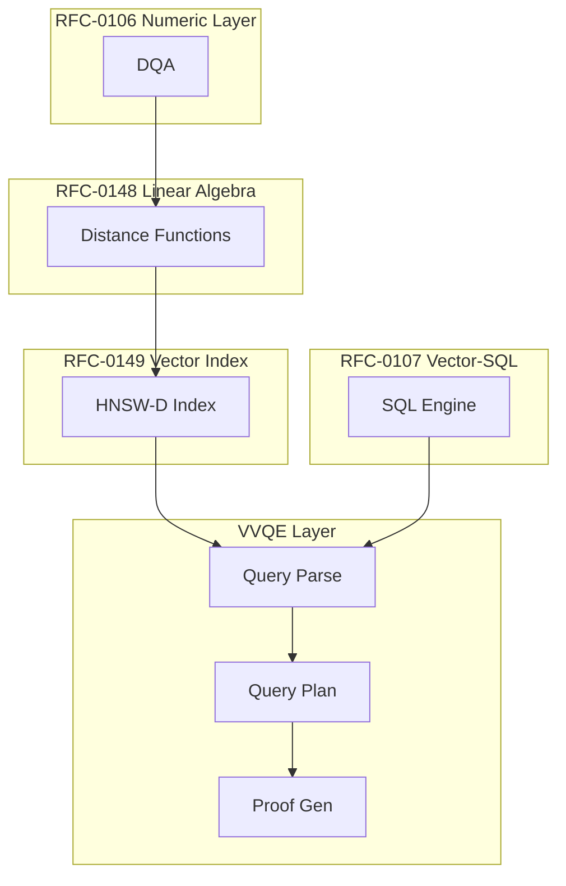

# RFC-0150 (Retrieval): Verifiable Vector Query Execution (VVQE)

## Status

**Version:** 1.0
**Status:** Draft
**Submission Date:** 2026-03-10

> **Note:** This RFC was originally numbered RFC-0150 under the legacy numbering system. It remains at 0150 as it belongs to the Retrieval category.

## Summary

This RFC defines Verifiable Vector Query Execution (VVQE), a deterministic query layer enabling vector similarity search as a consensus operation. VVQE provides deterministic ANN queries, SQL-compatible vector operators, verifiable query proofs, and reproducible search results across all nodes.

The goal is to enable AI retrieval workloads to execute directly in the blockchain runtime while maintaining consensus determinism.

## Design Goals

| Goal | Target           | Metric                                                    |
| ---- | ---------------- | --------------------------------------------------------- |
| G1   | Determinism      | Identical results across all nodes for same query/dataset |
| G2   | Consensus Safety | Verifiable query proofs                                   |
| G3   | SQL Integration  | Compatible with Vector-SQL operations                     |
| G4   | ZK Compatibility | Provable in zero-knowledge circuits                       |

## Motivation

Modern AI systems rely heavily on vector search:

- Embeddings
- Semantic retrieval
- RAG pipelines
- Similarity ranking

Typical vector databases are nondeterministic due to approximate algorithms, parallel execution, floating-point math, and nondeterministic pruning. VVQE enforces deterministic execution so that the same query, dataset, and parameters always produce identical results across all nodes.

## Specification

### System Architecture



### Query Model

VVQE introduces a vector query operator.

Canonical form:

```
VECTOR_SEARCH(
    index,
    query_vector,
    K,
    metric
)
```

| Parameter    | Description                |
| ------------ | -------------------------- |
| index        | Deterministic vector index |
| query_vector | Vector embedding           |
| K            | Number of results          |
| metric       | Distance metric            |

Supported metrics:

- L2Squared
- Cosine
- InnerProduct

These metrics must use deterministic implementations from RFC-0148.

### SQL Integration

VVQE integrates with Vector-SQL.

Example query:

```sql
SELECT id, distance
FROM embeddings
ORDER BY VECTOR_DISTANCE(embedding, :query)
LIMIT 10;
```

Compiled into deterministic vector search:

```
ANN_Search(index, query, K)
```

### Deterministic Query Execution

Query execution follows a canonical pipeline:

#### Step 1 — Query Vector Validation

Query vector must satisfy:

```
dimension == index.dimension
```

Otherwise: `ExecutionError::DimensionMismatch`

#### Step 2 — ANN Search

Vector index from RFC-0149 is executed:

```
candidates = ANN_Search(query, EF_SEARCH)
```

Search parameters are consensus constants.

#### Step 3 — Distance Computation

Distances recomputed deterministically:

```
for each candidate:
    distance = metric(query, vector)
```

This avoids approximation errors.

#### Step 4 — Deterministic Sorting

Results sorted by:

```
(distance, vector_id)
```

Tie-break rule: smaller vector_id wins

#### Step 5 — Result Truncation

Return first K results.

### Query Determinism Rules

> ⚠️ **FORBIDDEN BEHAVIORS**:
>
> - Parallel sorting
> - Nondeterministic heaps
> - Unordered iteration
> - Floating-point comparisons

All implementations must produce identical ordering.

### Query Proofs

VVQE supports verifiable query proofs.

#### Proof Structure

Proof includes:

- query_hash
- index_root
- candidate_set
- distance_evaluations
- top_k_selection

This allows external verifiers to recompute the result.

#### Query Hash

Query parameters hashed as:

```
query_hash = SHA256(
    index_id ||
    metric ||
    query_vector ||
    K
)
```

This ensures reproducibility.

### Vector Query Plan

Execution plan for vector queries is deterministic.

Example plan:

```
VECTOR_QUERY_PLAN
 ├─ index_lookup
 ├─ ANN_search
 ├─ distance_recompute
 ├─ deterministic_sort
 └─ result_limit
```

Nodes must execute the plan exactly as defined.

## Performance Targets

| Metric           | Target             | Notes            |
| ---------------- | ------------------ | ---------------- |
| ANN search       | O(EF_SEARCH log N) | ~1ms latency     |
| Distance compute | O(K × dim)         | Recompute phase  |
| Proof generation | O(K log K)         | Sorting overhead |

## Gas Cost Model

Vector queries require deterministic gas accounting:

| Operation           | Gas Formula     |
| ------------------- | --------------- |
| Distance evaluation | dim             |
| ANN traversal       | EF_SEARCH × dim |
| Sorting             | K log K         |

Approximate formula:

```
gas = EF_SEARCH × dim + K × dim + K log K
```

## Result Determinism

Results must be identical across nodes.

Given:

- same index
- same query
- same parameters

Nodes must return:

- identical vector IDs
- identical ordering
- identical distances

## Deterministic Pagination

Large result sets support deterministic pagination.

Example:

```
VECTOR_SEARCH(... LIMIT 10 OFFSET 20)
```

Pagination operates on sorted canonical result set.

## Consensus Limits

| Constant          | Value | Purpose                   |
| ----------------- | ----- | ------------------------- |
| MAX_QUERY_DIM     | 4096  | Maximum vector dimension  |
| MAX_QUERY_K       | 1000  | Maximum results           |
| MAX_EF_SEARCH     | 256   | Maximum search breadth    |
| MAX_RESULT_WINDOW | 5000  | Maximum pagination window |

Queries exceeding limits must fail.

## Deterministic Caching

Nodes may cache query results.

Cache key: `query_hash`

Cache entries must expire deterministically.

Caching must not change query semantics.

## Adversarial Review

| Threat               | Impact   | Mitigation                        |
| -------------------- | -------- | --------------------------------- |
| Adversarial queries  | High     | Gas limits, query size limits     |
| Index poisoning      | High     | Neighbor pruning, distance limits |
| Query nondeterminism | Critical | Canonical algorithms              |
| Cache poisoning      | Medium   | Expiration, hash verification     |

## Alternatives Considered

| Approach     | Pros                      | Cons                  |
| ------------ | ------------------------- | --------------------- |
| Standard ANN | Fast                      | Non-deterministic     |
| Brute force  | Deterministic             | O(N) - too slow       |
| This spec    | Deterministic + efficient | Requires all RFC deps |

## Implementation Phases

### Phase 1: Core

- [ ] VECTOR_SEARCH operator
- [ ] ANN search integration
- [ ] Distance recomputation
- [ ] Deterministic sorting

### Phase 2: SQL

- [ ] SQL compilation
- [ ] ORDER BY VECTOR_DISTANCE
- [ ] LIMIT support

### Phase 3: Proofs

- [ ] Query proof generation
- [ ] Proof verification
- [ ] ZK circuit integration

## Key Files to Modify

| File                              | Change                   |
| --------------------------------- | ------------------------ |
| crates/octo-vector/src/vvqe.rs    | Core VVQE implementation |
| crates/octo-sql/src/vector_ops.rs | SQL integration          |
| crates/octo-vm/src/gas.rs         | Query gas costs          |

## Future Work

- F1: Vector joins
- F2: Vector filters
- F3: Hybrid lexical+vector search
- F4: Deterministic RAG pipelines
- F5: Vector query batching

## Rationale

VVQE provides the query layer needed for:

1. **Consensus**: Identical results across all nodes
2. **Verifiability**: Query proofs enable external verification
3. **Integration**: SQL-compatible vector operations
4. **AI Native**: Enables verifiable RAG and agent pipelines

## Related RFCs

- RFC-0106: Deterministic Numeric Tower (DNT) — Core numeric types
- RFC-0105: Deterministic Quantized Arithmetic (DQA) — Scalar operations
- RFC-0107: Production Vector SQL Storage v2 — Vector storage engine
- RFC-0148: Deterministic Linear Algebra Engine — Distance primitives
- RFC-0149: Deterministic Vector Index (HNSW-D) — ANN index

> **Note**: RFC-0150 completes the deterministic AI retrieval stack together with RFC-0106, RFC-0148, and RFC-0149.

## Related Use Cases

- [Vector Search](../../docs/use-cases/unified-vector-sql-storage.md)
- [Verifiable Agent Memory](../../docs/use-cases/verifiable-agent-memory-layer.md)
- [AI Inference on Chain](../../docs/use-cases/hybrid-ai-blockchain-runtime.md)

## Appendices

### A. Query Proof Verification

```rust
fn verify_query_proof(
    proof: &QueryProof,
    index: &HNSWIndex,
    query: &VectorRecord,
) -> bool {
    // 1. Verify query hash
    let computed_hash = sha256(&proof.params);
    if computed_hash != proof.query_hash {
        return false;
    }

    // 2. Verify distance computations
    for (id, dist) in &proof.distance_evaluations {
        let vector = index.get_vector(id);
        let expected = L2Squared(query.vector, vector);
        if expected != *dist {
            return false;
        }
    }

    // 3. Verify top-K selection
    let sorted: Vec<_> = proof.distance_evaluations.iter()
        .sorted_by(|a, b| {
            let cmp = a.1.cmp(&b.1);
            if cmp == std::cmp::Ordering::Equal {
                a.0.cmp(&b.0)
            } else {
                cmp
            }
        })
        .take(proof.k as usize)
        .collect();

    return sorted == proof.top_k;
}
```

### B. SQL Compilation Example

```sql
-- Input SQL
SELECT id, embedding
FROM documents
ORDER BY VECTOR_DISTANCE(embedding, :query_vec)
LIMIT 5;

-- Compiled to VVQE plan
VECTOR_QUERY_PLAN {
    index: "documents_idx",
    metric: "L2Squared",
    query: :query_vec,
    k: 5,
    ef_search: 64
}
```

---

**Version:** 1.0
**Submission Date:** 2026-03-10
**Changes:**

- Initial draft for VVQE specification
