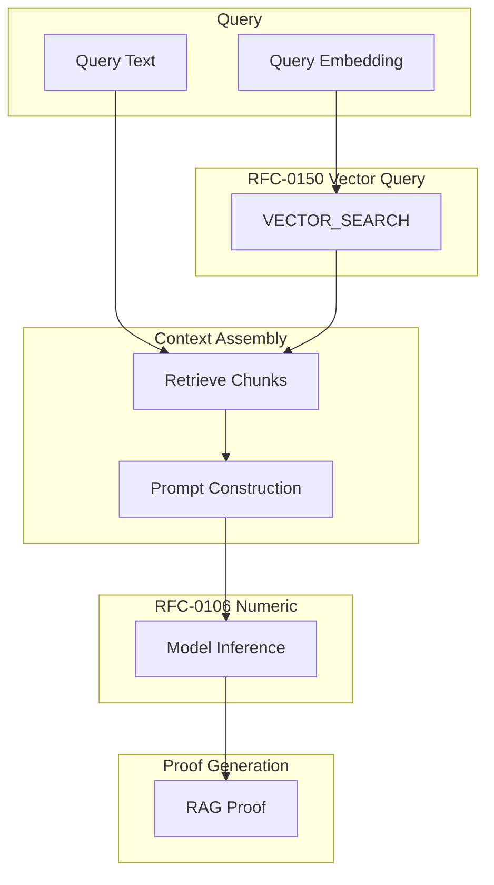

# RFC-0151 (AI Execution): Verifiable RAG Execution (VRE)

## Status

**Version:** 1.0
**Status:** Draft
**Submission Date:** 2026-03-10

> **Note:** This RFC was originally numbered RFC-0151 under the legacy numbering system. It remains at 0151 as it belongs to the AI Execution category.

## Summary

This RFC defines Verifiable RAG Execution (VRE), a deterministic execution framework for Retrieval-Augmented Generation (RAG) pipelines. RAG combines vector retrieval, context selection, and language model inference. VRE introduces deterministic rules that allow RAG pipelines to become verifiable computations.

Typical RAG pipelines are not reproducible due to nondeterministic retrieval, stochastic model sampling, floating-point inference, and non-canonical prompt construction. VRE ensures identical inputs produce identical outputs with verifiable execution proofs.

## Design Goals

| Goal | Target              | Metric                                    |
| ---- | ------------------- | ----------------------------------------- |
| G1   | Determinism         | Identical inputs → identical outputs      |
| G2   | Verifiability       | Proof describing all execution steps      |
| G3   | Reproducibility     | Any node can recompute result             |
| G4   | AI-Native Contracts | Smart contracts can trigger RAG pipelines |

## Motivation

RAG is essential for modern AI systems:

- Semantic search
- Question answering
- Knowledge augmentation
- Agentic AI

Current RAG implementations are nondeterministic. VRE enables:

- Verifiable AI inference
- Reproducible results
- Consensus-safe AI operations

## Specification

### System Architecture



### RAG Pipeline Definition

A RAG pipeline is represented as:

```
RAGPipeline

struct RAGPipeline {
    pipeline_id: u64,
    index_id: u64,
    model_id: u64,
    metric: DistanceMetric,
    top_k: u32,
    max_context_tokens: u32,
}
```

These parameters are immutable once deployed.

### Query Execution

A RAG request:

```
RAGQuery

struct RAGQuery {
    pipeline_id: u64,
    query_embedding: DVec<DQA, N>,
    query_text: bytes,
}
```

Execution is performed by the deterministic runtime.

### Retrieval Stage

Retrieval uses the vector query engine from RFC-0150.

```
VECTOR_SEARCH(
    index_id,
    query_embedding,
    top_k
)
```

Result: top_k document vectors, each mapping to a document chunk.

### Context Assembly

Retrieved documents assembled into deterministic context.

> ⚠️ **ORDERING RULE**: Sorted by `(distance, document_id)`

#### Context Truncation

Context length must not exceed `max_context_tokens`.

> ⚠️ **TRUNCATION RULE**: Append chunks until token limit reached. No partial chunks.

### Deterministic Prompt Construction

Prompt format must be canonical:

```
SYSTEM:
{system_prompt}

CONTEXT:
{retrieved_chunks}

USER:
{query_text}
```

Whitespace and separators must be canonical. All nodes must construct identical prompts.

### Deterministic Model Inference

Model inference must avoid nondeterminism.

> ⚠️ **FORBIDDEN**: temperature sampling, top-p sampling, top-k sampling, random seeds

Instead, inference uses greedy decoding:

```
repeat until stop_token:
    logits = model.forward(state)
    next_token = argmax(logits)
    append next_token
```

Tie-breaking: lowest token_id wins

### Deterministic Numeric Execution

All model operations use deterministic arithmetic from RFC-0106.

Allowed types:

- INT
- DQA
- DVEC
- DMAT

Floating-point is forbidden.

### Model Representation

Models stored as deterministic tensors:

```
ModelArtifact {
    model_id: u64,
    architecture: enum,
    weights_hash: SHA256,
    layer_count: u32,
}
```

Weights encoded using deterministic fixed-point format.

### RAG Proof

Execution produces a RAG proof:

```
RAGProof {
    query_hash,
    retrieved_ids,
    prompt_hash,
    model_id,
    output_tokens,
}

where:
- query_hash = SHA256(query_embedding || query_text)
- prompt_hash = SHA256(prompt)
```

The proof allows recomputation of the result.

### Verifier Algorithm

Verifier checks:

1. Retrieval correctness
2. Prompt construction
3. Model inference
4. Output tokens

All steps must match the proof.

## Performance Targets

| Metric            | Target             | Notes            |
| ----------------- | ------------------ | ---------------- |
| Retrieval latency | O(EF_SEARCH log N) | ~1ms             |
| Context assembly  | O(top_k)           | Token processing |
| Model inference   | O(tokens × layers) | Dominant cost    |

## Gas Cost Model

RAG execution has multiple cost components:

| Component        | Gas                 |
| ---------------- | ------------------- |
| Vector retrieval | EF_SEARCH × dim     |
| Context assembly | context_tokens      |
| Model inference  | tokens × model_cost |

Approximate formula:

```
gas = retrieval_cost + context_cost + inference_cost
```

Inference dominates cost.

## Consensus Limits

| Constant           | Value | Purpose                  |
| ------------------ | ----- | ------------------------ |
| MAX_TOP_K          | 32    | Maximum retrieved chunks |
| MAX_CONTEXT_TOKENS | 4096  | Maximum context length   |
| MAX_OUTPUT_TOKENS  | 512   | Maximum generation       |
| MAX_MODEL_LAYERS   | 128   | Maximum model depth      |

Queries exceeding limits must fail.

## Adversarial Review

| Threat                | Impact   | Mitigation                                        |
| --------------------- | -------- | ------------------------------------------------- |
| Prompt injection      | High     | System prompt isolation, deterministic boundaries |
| Retrieval poisoning   | High     | Distance thresholds, index integrity              |
| Determinism violation | Critical | Disable all random sampling                       |

## Alternatives Considered

| Approach              | Pros                 | Cons                  |
| --------------------- | -------------------- | --------------------- |
| Standard RAG          | Flexible             | Non-deterministic     |
| Frozen retrieval only | Deterministic        | Limited AI capability |
| This spec             | Verifiable + capable | Requires all RFC deps |

## Implementation Phases

### Phase 1: Core

- [ ] RAG pipeline definition
- [ ] Vector retrieval integration
- [ ] Context assembly
- [ ] Prompt construction

### Phase 2: Inference

- [ ] Greedy decoding
- [ ] Model artifact format
- [ ] Fixed-point weights

### Phase 3: Verification

- [ ] RAG proof generation
- [ ] Verifier algorithm
- [ ] ZK circuit integration

## Key Files to Modify

| File                            | Change            |
| ------------------------------- | ----------------- |
| crates/octo-rag/src/pipeline.rs | Core RAG pipeline |
| crates/octo-rag/src/proof.rs    | Proof generation  |
| crates/octo-vm/src/gas.rs       | RAG gas costs     |

## Future Work

- F1: Deterministic attention kernels
- F2: Multi-agent pipelines
- F3: Verifiable tool usage
- F4: Agent memory proofs
- F5: Streaming inference

## Rationale

VRE provides:

1. **Determinism**: Identical inputs → identical outputs
2. **Verifiability**: Complete execution proof
3. **AI-Native**: Smart contracts can trigger RAG
4. **ZK-Compatible**: All operations provable

## Related RFCs

- RFC-0106: Deterministic Numeric Tower (DNT) — Numeric types
- RFC-0108: Verifiable AI Retrieval — Retrieval foundations
- RFC-0148: Deterministic Linear Algebra Engine — Distance primitives
- RFC-0149: Deterministic Vector Index (HNSW-D) — ANN index
- RFC-0150: Verifiable Vector Query Execution — Query engine

> **Note**: RFC-0151 completes the verifiable AI stack.

## Related Use Cases

- [Hybrid AI-Blockchain Runtime](../../docs/use-cases/hybrid-ai-blockchain-runtime.md)
- [Verifiable Agent Memory](../../docs/use-cases/verifiable-agent-memory-layer.md)

## Appendices

### A. Greedy Decoding Algorithm

```rust
fn greedy_decode(model: &Model, prompt: &[u32], max_tokens: u32) -> Vec<u32> {
    let mut state = prompt.to_vec();
    let mut output = Vec::new();

    for _ in 0..max_tokens {
        let logits = model.forward(&state);
        let next_token = logits
            .iter()
            .enumerate()
            .max_by_key(|(_, &score)| score)
            .map(|(id, _)| id)
            .unwrap();

        if model.is_stop_token(next_token) {
            break;
        }

        output.push(next_token as u32);
        state.push(next_token as u32);
    }

    output
}
```

### B. Canonical Prompt Template

```rust
fn construct_prompt(
    system_prompt: &str,
    chunks: &[DocumentChunk],
    query: &str,
) -> String {
    let context = chunks
        .iter()
        .map(|c| c.content.clone())
        .collect::<Vec<_>>()
        .join("\n\n");

    format!(
        "SYSTEM:\n{}\n\nCONTEXT:\n{}\n\nUSER:\n{}",
        system_prompt.trim(),
        context.trim(),
        query.trim()
    )
}
```

---

**Version:** 1.0
**Submission Date:** 2026-03-10
**Changes:**

- Initial draft for VRE specification
