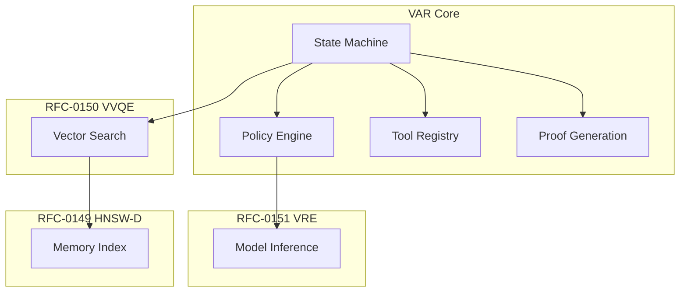

# RFC-0152 (Agents): Verifiable Agent Runtime (VAR)

## Status

**Version:** 1.0
**Status:** Draft
**Submission Date:** 2026-03-10

> **Note:** This RFC was originally numbered RFC-0152 under the legacy numbering system. It remains at 0152 as it belongs to the Agents category.

## Depends on

- RFC-0106 (Numeric/Math): Deterministic Numeric Tower
- RFC-0108 (Retrieval): Verifiable AI Retrieval
- RFC-0148 (Numeric/Math): Deterministic Linear Algebra Engine
- RFC-0149 (Retrieval): Deterministic Vector Index
- RFC-0150 (Retrieval): Verifiable Vector Query Execution
- RFC-0151 (AI Execution): Verifiable RAG Execution

## Summary

This RFC defines the Verifiable Agent Runtime (VAR), a deterministic execution framework for autonomous AI agents. Agents execute structured workflows involving reasoning, retrieval, tool execution, memory updates, and state transitions. Traditional AI agents are not reproducible because they rely on nondeterministic LLM sampling, mutable memory stores, external tool responses, and asynchronous execution. VAR transforms agents into deterministic state machines whose execution can be verified and replayed.

## Design Goals

| Goal | Target                     | Metric                                     |
| ---- | -------------------------- | ------------------------------------------ |
| G1   | Deterministic Execution    | Identical inputs → identical agent actions |
| G2   | Verifiable Decisions       | Agent reasoning produces provable outputs  |
| G3   | Replayability              | Any node can replay the agent lifecycle    |
| G4   | Smart-Contract Integration | Agents interact with blockchain contracts  |
| G5   | Modular Tooling            | Tools are deterministic modules            |

## Motivation

AI agents are essential for autonomous operations:

- Task automation
- Multi-step workflows
- Agentic AI systems
- Autonomous decision-making

Current agent implementations are nondeterministic. VAR enables:

- Verifiable AI agents
- Reproducible execution
- Consensus-safe agent operations
- Trustless AI interactions

## Specification

### System Architecture



### Agent Model

An agent is defined as a deterministic state machine:

```
state_t → decision() → action → state_t+1
```

Every transition must be deterministic.

### Agent Structure

Agents are defined using the `AgentDefinition`:

```
AgentDefinition

struct AgentDefinition {
    agent_id: u64,
    policy_id: u64,
    memory_index_id: u64,
    toolset_id: u64,
    max_steps: u32,
}
```

| Field           | Meaning             |
| --------------- | ------------------- |
| agent_id        | Unique identifier   |
| policy_id       | Reasoning policy    |
| memory_index_id | Vector memory index |
| toolset_id      | Tool registry       |
| max_steps       | Execution bound     |

### Agent State

Agent execution maintains a state structure:

```
AgentState

struct AgentState {
    step: u32,
    memory_cursor: u64,
    context_hash: Hash,
    last_action: ActionType,
}
```

This state is updated deterministically after each step.

### Agent Execution Loop

Execution follows a fixed deterministic loop:

```
for step in 0..max_steps:
    context = build_context()
    decision = policy(context)
    execute(decision)
    update_state()
```

Execution halts when:

- STOP action emitted
- max_steps reached
- Consensus failure

### Policy Execution

Agent reasoning uses a deterministic model defined in RFC-0151:

```
decision = MODEL_INFER(prompt)
```

Prompt includes:

- System prompt
- Agent state
- Retrieved memory
- User input

Inference must follow:

- Greedy decoding (no sampling)
- Deterministic arithmetic (RFC-0106)
- Canonical prompt format

### Agent Memory

Agents maintain memory using the vector index from RFC-0149:

```
AgentMemory

struct AgentMemory {
    memory_id: u64,
    embedding: DVec<DQA, N>,
    content_hash: Hash,
    timestamp: u64,
}
```

Memory is stored in the deterministic vector engine.

### Memory Retrieval

Agents retrieve relevant memories deterministically:

```
VECTOR_SEARCH(
    memory_index,
    query_embedding,
    top_k
)
```

Returned memories are ordered by `(distance, memory_id)` — guaranteeing determinism.

### Tool Invocation

Agents may call deterministic tools:

```
ToolCall

struct ToolCall {
    tool_id: u64,
    input_hash: Hash,
}
```

Tools must implement:

```
execute(input) -> output
```

Execution must be deterministic with reproducible outputs.

### Tool Registry

Tools are registered in a global registry:

```
ToolRegistryEntry

struct ToolRegistryEntry {
    tool_id: u64,
    tool_hash: Hash,
    version: u32,
}
```

This ensures tool integrity and version tracking.

### Allowed Tool Types

Allowed deterministic tools include:

| Tool Type          | Description                |
| ------------------ | -------------------------- |
| Vector search      | RFC-0150 VVQE operations   |
| SQL queries        | Deterministic database ops |
| Cryptographic ops  | Hashing, signatures        |
| Blockchain reads   | On-chain state queries     |
| Deterministic math | RFC-0148 DLAE operations   |

**Forbidden tools:**

- External APIs (nondeterministic)
- Random number generation
- System clock access
- Network I/O

### Agent Actions

Agents can emit the following actions:

| Action          | Description               |
| --------------- | ------------------------- |
| RETRIEVE_MEMORY | Query vector memory       |
| STORE_MEMORY    | Add to memory index       |
| CALL_TOOL       | Invoke deterministic tool |
| RESPOND         | Generate output           |
| STOP            | Halt execution            |

Each action produces a deterministic state transition.

### Action Execution

Example:

```
CALL_TOOL(tool_id, input)
```

Execution:

```
output = TOOL_EXEC(tool_id, input)
state.context_hash = HASH(output)
```

### Agent Proof

Agent execution produces a proof record:

```
AgentProof

struct AgentProof {
    agent_id: u64,
    input_hash: Hash,
    step_count: u32,
    action_log: Vec<ActionRecord>,
    output_hash: Hash,
}

struct ActionRecord {
    step: u32,
    action_type: ActionType,
    tool_id: Option<u64>,
    output_hash: Hash,
}
```

The action log allows complete replay and verification.

### Verification Algorithm

To verify an agent run:

```
1. Load agent definition
2. Recompute each step:
   a. Build context
   b. Run policy inference
   c. Execute action
   d. Update state
3. Validate all actions match proof
4. Check all hashes match
5. Confirm final output
```

All transitions must match the proof exactly.

### Deterministic Limits

Consensus limits prevent runaway agents:

| Constant           | Value | Purpose                           |
| ------------------ | ----- | --------------------------------- |
| MAX_AGENT_STEPS    | 128   | Maximum execution steps           |
| MAX_MEMORY_RESULTS | 16    | Maximum retrieved memories        |
| MAX_TOOL_CALLS     | 32    | Maximum tool invocations per step |
| MAX_CONTEXT_TOKENS | 4096  | Maximum prompt size               |

Operations exceeding limits must fail with `ExecutionError::AgentLimitExceeded`.

### Gas Model

Agent cost is proportional to executed steps:

```
gas =
    inference_cost
  + vector_search_cost
  + tool_execution_cost
```

Upper bound:

```
gas ≤ max_steps × step_cost
```

Each component uses gas constants from respective RFCs.

### Parallel Execution

Agents may run in parallel across nodes.

Determinism is preserved because:

- Execution order is canonical
- State transitions are deterministic
- Hash inputs are fixed

### Mission Integration

Agents may execute missions defined in the CipherOcto lifecycle (RFC-0001).

Example mission workflow:

1. Collect documents → RETRIEVE_MEMORY
2. Analyze content → CALL_TOOL(analysis)
3. Generate report → MODEL_INFER
4. Store result → STORE_MEMORY

Each step becomes a verifiable agent transition.

## Performance Targets

| Metric           | Target | Notes               |
| ---------------- | ------ | ------------------- |
| Step execution   | <10ms  | Per agent step      |
| Memory retrieval | <1ms   | RFC-0150 latency    |
| Tool invocation  | <5ms   | Deterministic tools |
| Proof generation | <1ms   | Hash computation    |

## Adversarial Review

| Threat             | Impact   | Mitigation                       |
| ------------------ | -------- | -------------------------------- |
| Prompt injection   | High     | System prompt isolation          |
| Tool abuse         | High     | Strict input schemas, gas limits |
| Infinite loops     | Critical | max_steps bound                  |
| State manipulation | Critical | Hash chain verification          |
| Memory poisoning   | High     | Content hash verification        |

## Alternatives Considered

| Approach           | Pros                 | Cons                  |
| ------------------ | -------------------- | --------------------- |
| Standard AI agents | Flexible             | Non-deterministic     |
| Stateless agents   | Simple               | Limited capability    |
| This spec          | Verifiable + capable | Requires all RFC deps |

## Implementation Phases

### Phase 1: Core

- [ ] Agent definition structure
- [ ] State machine implementation
- [ ] Basic execution loop
- [ ] Agent proof generation

### Phase 2: Memory Integration

- [ ] Vector memory retrieval
- [ ] Memory storage operations
- [ ] Context building

### Phase 3: Tools

- [ ] Tool registry
- [ ] Tool invocation
- [ ] Tool execution validation

### Phase 4: Verification

- [ ] Verifier algorithm
- [ ] ZK circuit integration
- [ ] Replay capability

## Key Files to Modify

| File                             | Change                  |
| -------------------------------- | ----------------------- |
| crates/octo-agent/src/runtime.rs | Core VAR implementation |
| crates/octo-agent/src/state.rs   | Agent state machine     |
| crates/octo-agent/src/proof.rs   | Proof generation        |
| crates/octo-vm/src/gas.rs        | Agent gas costs         |

## Future Work

- F1: Multi-agent coordination protocols
- F2: Agent marketplaces with stake weighting
- F3: Tool staking for reliability
- F4: Reputation scoring for agents
- F5: Agent governance mechanisms

## Rationale

VAR completes the verifiable AI stack by providing:

1. **Determinism**: Agents as deterministic state machines
2. **Verifiability**: Complete proof generation
3. **Composability**: Integrates with all prior RFCs
4. **AI-Native**: Smart contracts can trigger agents

## Related RFCs

- RFC-0106 (Numeric/Math): Deterministic Numeric Tower (DNT) — Numeric types
- RFC-0108 (Retrieval): Verifiable AI Retrieval — Retrieval foundations
- RFC-0148 (Numeric/Math): Deterministic Linear Algebra Engine — Math primitives
- RFC-0149 (Retrieval): Deterministic Vector Index (HNSW-D) — Memory storage
- RFC-0150 (Retrieval): Verifiable Vector Query Execution — Query engine
- RFC-0151 (AI Execution): Verifiable RAG Execution — Model inference
- RFC-0110 (Agents): Verifiable Agent Memory — Memory layer

> **Note**: RFC-0152 completes the verifiable AI stack.

## Related Use Cases

- [Verifiable Agent Memory Layer](../../docs/use-cases/verifiable-agent-memory-layer.md)
- [Hybrid AI-Blockchain Runtime](../../docs/use-cases/hybrid-ai-blockchain-runtime.md)

## Appendices

### A. Agent Execution Pseudocode

```rust
fn execute_agent(
    definition: &AgentDefinition,
    input: &AgentInput,
) -> Result<AgentProof, ExecutionError> {
    let mut state = AgentState::initial(definition.agent_id);
    let mut action_log = Vec::new();

    for step in 0..definition.max_steps {
        // Build deterministic context
        let context = build_context(&state, &input, definition)?;

        // Policy inference (deterministic)
        let decision = model_infer(&context, definition.policy_id)?;

        // Execute action
        let action_result = execute_action(&decision, &mut state, definition)?;

        // Record action
        action_log.push(ActionRecord {
            step,
            action_type: decision.action_type,
            tool_id: decision.tool_id,
            output_hash: action_result.output_hash,
        });

        // Check for STOP
        if decision.action_type == ActionType::STOP {
            break;
        }

        state.step += 1;
    }

    Ok(AgentProof {
        agent_id: definition.agent_id,
        input_hash: hash(input),
        step_count: state.step,
        action_log,
        output_hash: state.context_hash,
    })
}
```

### B. Canonical Context Building

```rust
fn build_context(
    state: &AgentState,
    input: &AgentInput,
    definition: &AgentDefinition,
) -> Result<String, ExecutionError> {
    // Retrieve memory
    let memories = vector_search(
        definition.memory_index_id,
        &input.query_embedding,
        MAX_MEMORY_RESULTS,
    )?;

    // Build canonical prompt
    format!(
        "SYSTEM: {}\n\nSTATE: {}\n\nMEMORY: {}\n\nINPUT: {}",
        get_system_prompt(definition.policy_id),
        serialize_state(state),
        serialize_memories(memories),
        input.query_text
    )
}
```

---

**Version:** 1.0
**Submission Date:** 2026-03-10
**Changes:**

- Initial draft for VAR specification
