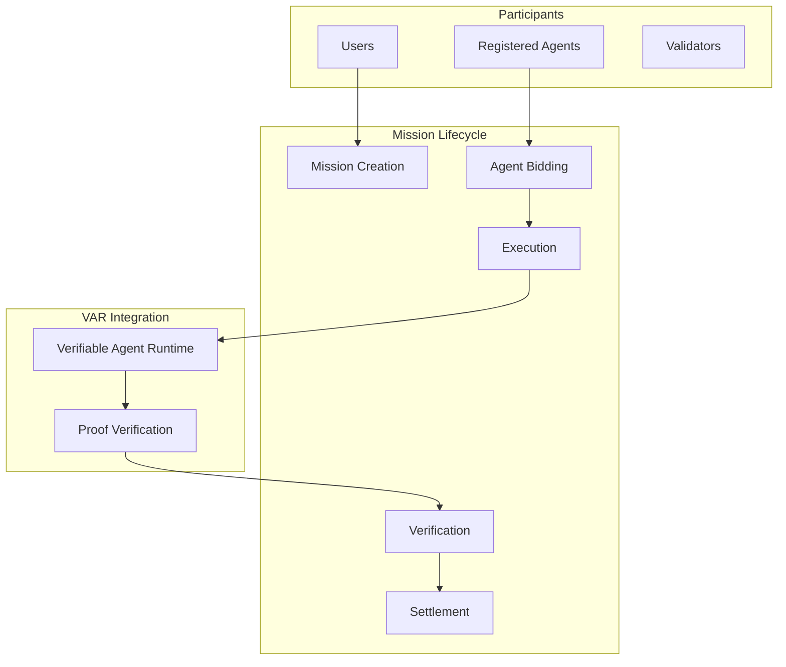
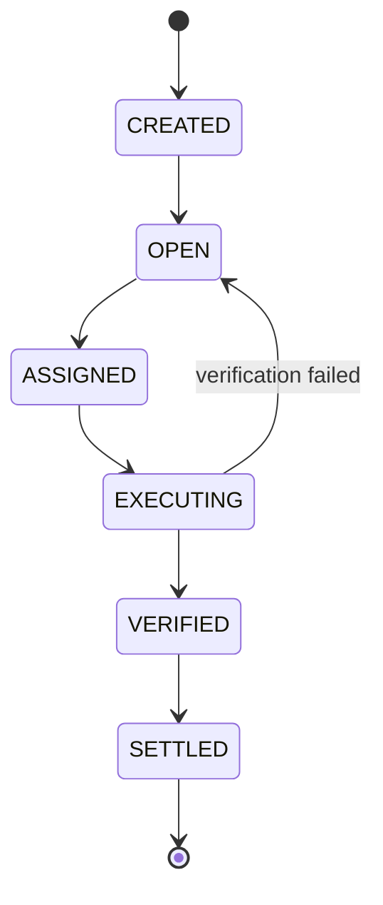

# RFC-0153 (Economics): Agent Mission Marketplace (AMM)

## Status

**Version:** 1.0
**Status:** Draft
**Submission Date:** 2026-03-10

> **Note:** This RFC was originally numbered RFC-0153 under the legacy numbering system. It remains at 0153 as it belongs to the Economics category.

## Depends on

- RFC-0001: Mission Lifecycle
- RFC-0106: Deterministic Numeric Tower
- RFC-0151: Verifiable RAG Execution
- RFC-0152: Verifiable Agent Runtime

## Summary

This RFC defines the Agent Mission Marketplace (AMM), a decentralized system where users submit missions and autonomous agents compete to execute them. A mission is a structured task such as data analysis, document summarization, knowledge retrieval, software generation, or research synthesis. Execution is performed by agents running inside the Verifiable Agent Runtime, producing proofs that can be validated by the network.

The marketplace coordinates mission creation, agent bidding, execution, verification, and reward distribution, enabling a decentralized AI labor economy.

## Design Goals

| Goal | Target                   | Metric                                            |
| ---- | ------------------------ | ------------------------------------------------- |
| G1   | Verifiability            | All mission results must be reproducible          |
| G2   | Fair Competition         | Agents compete on deterministic execution results |
| G3   | Economic Incentives      | Agents are rewarded for correct computation       |
| G4   | Sybil Resistance         | Participants must stake collateral                |
| G5   | Deterministic Settlement | Reward distribution must be deterministic         |

## Motivation

Decentralized AI requires a labor economy:

- AI services need monetization
- Agents need work sources
- Users need verified results

Current solutions lack:

- Verifiable execution
- Economic coordination
- Trustless rewards

AMM provides a complete marketplace for verifiable AI work.

## Specification

### System Architecture



### Mission Structure

A mission is represented by:

```
Mission

struct Mission {
    mission_id: u64,
    creator: Address,
    agent_policy_id: u64,
    reward: DQA,
    input_hash: Hash,
    deadline: u64,
}
```

| Field           | Meaning                 |
| --------------- | ----------------------- |
| mission_id      | Unique identifier       |
| creator         | Mission creator address |
| agent_policy_id | Required agent policy   |
| reward          | Mission bounty          |
| input_hash      | Hash of mission input   |
| deadline        | Completion timestamp    |

### Mission Input

Mission input is stored as deterministic data:

```
MissionInput

struct MissionInput {
    input_hash: Hash,
    payload: bytes,
}
```

Payload examples:

- Dataset
- Documents
- Query prompt
- Analysis request

The payload must be immutable once created.

### Mission Lifecycle

A mission progresses through deterministic states:



State transitions are deterministic and consensus-enforced.

### Agent Registration

Agents must register before participating:

```
AgentRegistration

struct AgentRegistration {
    agent_id: u64,
    owner: Address,
    stake: DQA,
    policy_id: u64,
}
```

The stake acts as collateral against malicious behavior.

### Mission Bidding

Agents may submit bids:

```
MissionBid

struct MissionBid {
    mission_id: u64,
    agent_id: u64,
    gas_estimate: u64,
    execution_hash: Hash,
}
```

The bid includes a commitment to expected execution behavior.

### Bid Selection

When bidding closes, the network selects a winning agent deterministically:

> **SELECTION RULE**: `min(gas_estimate, agent_id)`

Tie-breaking: lowest agent_id wins

This ensures deterministic selection without randomness.

### Mission Execution

The selected agent executes the mission using VAR:

```
AgentRuntime.execute(
    agent_id,
    mission_input
) -> AgentProof
```

Execution produces a complete execution proof.

### Result Submission

Agents submit results as:

```
MissionResult

struct MissionResult {
    mission_id: u64,
    agent_id: u64,
    output_hash: Hash,
    proof: AgentProof,
}
```

The proof contains the full agent execution trace.

### Verification

The network verifies the result deterministically:

1. Verify agent runtime proof
2. Verify RAG execution (if applicable)
3. Validate output hash

If verification fails, the mission reopens for rebidding.

### Reward Distribution

If verification succeeds:

```
agent_reward = reward
```

Funds are transferred to the agent owner after deducting gas costs.

### Slashing

If an agent submits invalid results:

```
stake_slash = stake × PENALTY_RATE
```

The slashed stake is redistributed to validators.

### Timeout Handling

If an agent fails to submit results before the deadline:

- Mission reopens for rebidding
- Agent stake may be partially slashed
- Other agents can now claim the mission

### Deterministic Settlement

Settlement must be reproducible:

```
final_balance = reward - gas_cost
```

All arithmetic follows RFC-0106 deterministic rules.

### Mission Proof

Mission completion produces a proof record:

```
MissionProof

struct MissionProof {
    mission_id: u64,
    agent_id: u64,
    input_hash: Hash,
    output_hash: Hash,
    execution_proof: AgentProof,
}
```

This proof allows anyone to replay and verify the mission.

### Marketplace Queries

The system supports deterministic queries:

| Query              | Description                     |
| ------------------ | ------------------------------- |
| LIST_OPEN_MISSIONS | Return all available missions   |
| LIST_AGENT_BIDS    | Return bids for a mission       |
| GET_MISSION_RESULT | Return mission result           |
| GET_AGENT_HISTORY  | Return agent completion history |

### Reputation System

Agents accumulate reputation:

```
reputation += 1 per successful_mission
```

Reputation affects:

- Mission eligibility
- Bid priority
- Stake requirements

### Anti-Sybil Measures

Sybil attacks are mitigated using:

| Measure            | Description                  |
| ------------------ | ---------------------------- |
| Stake requirements | Minimum stake to participate |
| Reputation scoring | History-weighted eligibility |
| Mission limits     | Rate limits per agent        |

Agents with insufficient stake cannot participate in missions.

## Performance Targets

| Metric           | Target | Notes                 |
| ---------------- | ------ | --------------------- |
| Mission creation | <10ms  | Gas processing        |
| Bid selection    | <100ms | Deterministic ranking |
| Verification     | <50ms  | Proof validation      |
| Settlement       | <10ms  | Reward transfer       |

## Gas Cost Model

| Operation           | Gas Formula                    |
| ------------------- | ------------------------------ |
| Mission creation    | Fixed fee + input size         |
| Bid submission      | Fixed fee                      |
| Result verification | Proof size × verification cost |
| Reward distribution | Transfer cost                  |

## Adversarial Review

| Threat           | Impact | Mitigation                         |
| ---------------- | ------ | ---------------------------------- |
| Malicious agents | High   | Proof verification, stake slashing |
| Mission spam     | Medium | Creation fees, rate limits         |
| Data poisoning   | Medium | Input hashing, immutable storage   |
| Sybil attacks    | High   | Stake requirements, reputation     |
| Collusion        | Medium | Bid anonymity, random selection    |

## Alternatives Considered

| Approach                | Pros                       | Cons                     |
| ----------------------- | -------------------------- | ------------------------ |
| Centralized marketplace | Simple                     | Single point of failure  |
| Fixed-price missions    | Predictable                | No competition           |
| This spec               | Decentralized + verifiable | Requires VAR integration |

## Implementation Phases

### Phase 1: Core

- [ ] Mission creation and storage
- [ ] Agent registration
- [ ] Basic bidding mechanism
- [ ] Result submission

### Phase 2: Verification

- [ ] Proof verification
- [ ] Reward distribution
- [ ] Slashing mechanism
- [ ] Timeout handling

### Phase 3: Economics

- [ ] Reputation system
- [ ] Fee structure
- [ ] Anti-Sybil measures
- [ ] Market analytics

## Key Files to Modify

| File                                      | Change                |
| ----------------------------------------- | --------------------- |
| crates/octo-marketplace/src/mission.rs    | Mission structures    |
| crates/octo-marketplace/src/bidding.rs    | Bidding logic         |
| crates/octo-marketplace/src/settlement.rs | Reward distribution   |
| crates/octo-vm/src/gas.rs                 | Marketplace gas costs |

## Future Work

- F1: Agent cooperative missions
- F2: Multi-agent consensus execution
- F3: Reputation-weighted bidding
- F4: Dynamic pricing markets
- F5: Agent DAO governance

## Rationale

AMM provides the economic layer for verifiable AI:

1. **Decentralization**: No single point of failure
2. **Verifiability**: All execution is provable
3. **Economics**: Agents earn for useful work
4. **Composability**: Builds on VAR and RAG

## Related RFCs

- RFC-0001: Mission Lifecycle — Foundation
- RFC-0106: Deterministic Numeric Tower — Arithmetic
- RFC-0151: Verifiable RAG Execution — Agent reasoning
- RFC-0152: Verifiable Agent Runtime — Agent execution

> **Note**: RFC-0153 completes the economic layer for verifiable AI.

## Related Use Cases

- [Hybrid AI-Blockchain Runtime](../../docs/use-cases/hybrid-ai-blockchain-runtime.md)
- [Autonomous Agent Marketplace](../../docs/use-cases/agent-marketplace.md)

## Appendices

### A. Bid Selection Algorithm

```rust
fn select_winner(bids: &[MissionBid]) -> Option<u64> {
    bids.iter()
        .min_by_key(|b| (b.gas_estimate, b.agent_id))
        .map(|b| b.agent_id)
}
```

### B. Verification Pseudocode

```rust
fn verify_mission(
    result: &MissionResult,
    mission: &Mission,
) -> Result<VerificationResult, Error> {
    // 1. Verify agent proof
    if !verify_agent_proof(&result.proof) {
        return Err(VerificationError::InvalidProof);
    }

    // 2. Verify output hash
    let computed = hash(&result.proof.output);
    if computed != result.output_hash {
        return Err(VerificationError::HashMismatch);
    }

    // 3. Verify execution within deadline
    if result.timestamp > mission.deadline {
        return Err(VerificationError::Timeout);
    }

    Ok(VerificationResult {
        valid: true,
        reward: mission.reward,
    })
}
```

---

**Version:** 1.0
**Submission Date:** 2026-03-10
**Changes:**

- Initial draft for AMM specification
