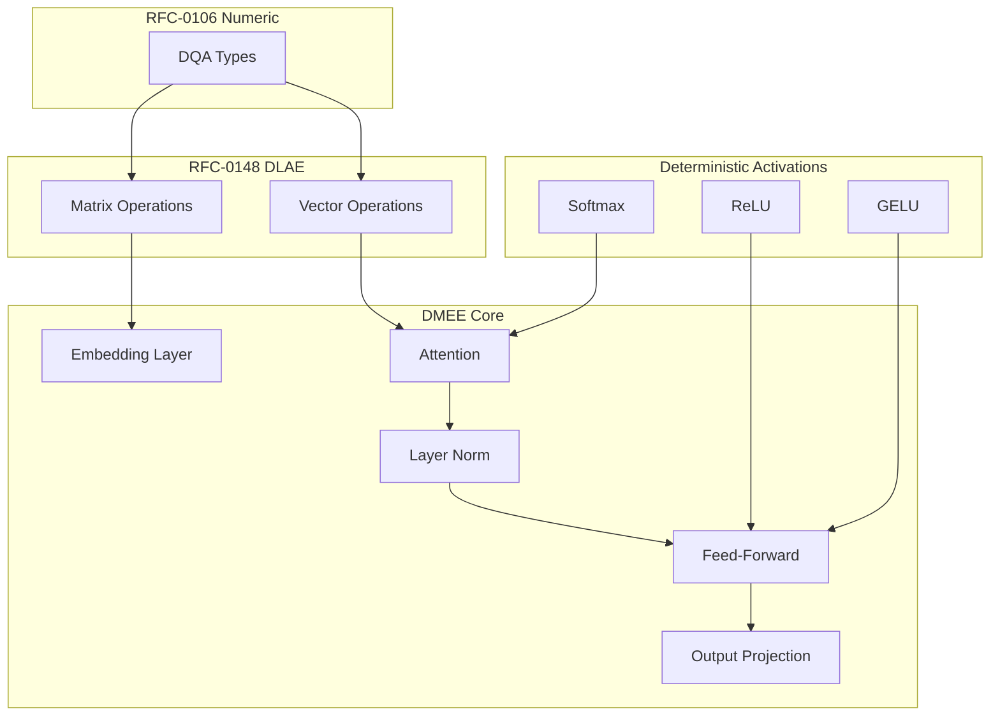

# RFC-0155 (AI Execution): Deterministic Model Execution Engine (DMEE)

## Status

**Version:** 1.0
**Status:** Draft
**Submission Date:** 2026-03-10

> **Note:** This RFC was originally numbered RFC-0155 under the legacy numbering system. It remains at 0155 as it belongs to the AI Execution category.

## Depends on

- RFC-0106: Deterministic Numeric Tower
- RFC-0148: Deterministic Linear Algebra Engine
- RFC-0151: Verifiable RAG Execution
- RFC-0152: Verifiable Agent Runtime

## Summary

This RFC defines the Deterministic Model Execution Engine (DMEE), a runtime for executing machine learning models in a fully deterministic manner. The engine guarantees that identical inputs produce identical outputs across all nodes. DMEE supports transformer-based architectures commonly used in modern AI systems.

## Design Goals

| Goal | Target                   | Metric                                         |
| ---- | ------------------------ | ---------------------------------------------- |
| G1   | Deterministic Arithmetic | All operations use deterministic numeric types |
| G2   | Hardware Independence    | Identical outputs across CPU and GPU           |
| G3   | Verifiability            | All operations are reproducible                |
| G4   | Performance              | Execution remains efficient                    |

## Motivation

Typical ML frameworks introduce nondeterminism through:

- Floating-point arithmetic
- GPU kernel variability
- Parallel execution ordering
- Random sampling
- Hardware-dependent rounding

These behaviors break consensus in distributed systems. DMEE eliminates these sources of nondeterminism.

## Specification

### System Architecture



### Supported Model Architectures

Initial support includes:

| Architecture    | Description       |
| --------------- | ----------------- |
| Transformer     | Base transformer  |
| Encoder-only    | BERT-style models |
| Decoder-only    | GPT-style models  |
| Encoder-decoder | T5-style models   |

Future extensions may include diffusion models, graph neural networks, and vision transformers.

### Deterministic Tensor Representation

All tensors must use deterministic numeric types:

```
DTensor<T, Shape>

Example:
DTensor<DQA, [batch, seq, dim]>
```

Where DQA is defined in RFC-0106. Floating-point types are forbidden.

### Model Artifact Format

Models must be stored in a canonical artifact format:

```
ModelArtifact

struct ModelArtifact {
    model_id: u64,
    architecture: ModelArchitecture,
    weight_hash: Hash,
    tensor_count: u32,
    metadata: ModelMetadata,
}
```

Weights are serialized deterministically.

### Weight Encoding

Weights must be encoded using fixed-point representation:

```
fixed_point = integer / scale
```

Example: `scale = 2^16`

This ensures deterministic arithmetic across all nodes.

### Transformer Execution Pipeline

Execution follows the standard transformer pipeline:

```
embedding → attention layers → feed-forward layers → output projection
```

Each stage must be deterministic.

### Deterministic Attention

Attention computation:

```
Q = X · Wq
K = X · Wk
V = X · Wv
```

Score calculation:

```
scores = (Q · K^T) / sqrt(d)
```

Softmax must use deterministic numeric operations.

### Deterministic Softmax

Softmax must be implemented without floating-point arithmetic:

```
max_val = max(scores)
exp_i = EXP(scores_i - max_val)
sum_exp = Σ exp_i
softmax_i = exp_i / sum_exp
```

EXP must use the deterministic exponential function from RFC-0106.

### Deterministic Activation Functions

Supported activations:

| Activation | Formula                                | Implementation           |
| ---------- | -------------------------------------- | ------------------------ |
| ReLU       | max(0, x)                              | Deterministic comparison |
| GELU       | 0.5x(1 + tanh(√(2/π)(x + 0.044715x³))) | Polynomial approximation |
| Sigmoid    | 1/(1 + exp(-x))                        | Deterministic EXP        |
| Tanh       | (exp(x) - exp(-x))/(exp(x) + exp(-x))  | Deterministic EXP        |

Polynomial approximations must use canonical constants.

### Deterministic Layer Normalization

Layer normalization:

```
mean = Σ x / n
variance = Σ (x - mean)² / n
```

Normalized output:

```
y = (x - mean) / sqrt(variance + epsilon)
```

All operations must use deterministic arithmetic from RFC-0106.

### Deterministic Matrix Operations

All matrix operations must use the deterministic linear algebra engine:

| Operation  | Description           |
| ---------- | --------------------- |
| matmul     | Matrix multiplication |
| transpose  | Matrix transpose      |
| vector_add | Vector addition       |
| scale      | Scalar multiplication |

Execution order must be canonical (left-to-right reduction).

### Execution Scheduling

Operations must follow a deterministic schedule:

```
execution_graph = {
    embedding → attention → norm → ffn → norm → output
}
```

Graph traversal must use topological ordering.

### Parallel Execution Rules

Parallel execution is allowed only if:

- Result is independent of execution order

Otherwise operations must execute sequentially.

### Deterministic Token Generation

Token generation must follow greedy decoding:

```
logits = model.forward(state)
next_token = argmax(logits)
```

Tie-breaking rule: lowest token_id wins

Sampling (temperature, top-k, top-p) is forbidden.

### Execution Trace

Each model run produces a trace:

```
ExecutionTrace

struct ExecutionTrace {
    model_id: u64,
    input_hash: Hash,
    layer_outputs: Vec<LayerHash>,
    output_tokens: Vec<u32>,
}
```

This trace allows deterministic replay.

### Verification

Verification requires recomputing the model execution:

1. Load model artifact
2. Recompute layers deterministically
3. Compare output tokens

If outputs match exactly, the execution is valid.

### Gas Model

Execution cost depends on model size:

```
gas = tokens × layers × hidden_dim × operation_cost
```

Large models require more gas. Each operation uses gas constants from RFC-0148.

### Deterministic Limits

Consensus limits prevent resource exhaustion:

| Constant            | Value | Purpose                     |
| ------------------- | ----- | --------------------------- |
| MAX_MODEL_SIZE      | 20 GB | Maximum model artifact size |
| MAX_SEQUENCE_LENGTH | 4096  | Maximum input sequence      |
| MAX_LAYER_COUNT     | 128   | Maximum transformer layers  |
| MAX_HIDDEN_DIM      | 16384 | Maximum hidden dimension    |

### Hardware Compatibility

The engine must support:

| Platform | Support                    |
| -------- | -------------------------- |
| CPU      | Required                   |
| GPU      | Deterministic kernels only |
| SIMD     | Deterministic ordering     |

GPU kernels must enforce deterministic operation ordering.

## Performance Targets

| Metric            | Target          | Notes                 |
| ----------------- | --------------- | --------------------- |
| Inference latency | <100ms          | Per token generation  |
| Layer compute     | <10ms           | Per transformer layer |
| Memory footprint  | <MAX_MODEL_SIZE | Model loading         |

## Adversarial Review

| Threat              | Impact   | Mitigation                                 |
| ------------------- | -------- | ------------------------------------------ |
| Model tampering     | Critical | Weight hash verification, signatures       |
| Numerical drift     | High     | Fixed-point arithmetic, canonical rounding |
| Resource exhaustion | High     | Gas limits, execution bounds               |

## Alternatives Considered

| Approach            | Pros                       | Cons                 |
| ------------------- | -------------------------- | -------------------- |
| IEEE-754 floats     | Familiar                   | Non-deterministic    |
| Relaxed determinism | Faster                     | Consensus risk       |
| This spec           | Deterministic + verifiable | Performance overhead |

## Implementation Phases

### Phase 1: Core

- [ ] Tensor representation
- [ ] Model artifact loading
- [ ] Basic matrix operations

### Phase 2: Transformer

- [ ] Attention implementation
- [ ] Feed-forward networks
- [ ] Layer normalization

### Phase 3: Activations

- [ ] Deterministic ReLU
- [ ] Deterministic GELU
- [ ] Deterministic Softmax

### Phase 4: Integration

- [ ] Token generation
- [ ] Execution tracing
- [ ] Verification

## Key Files to Modify

| File                                    | Change                   |
| --------------------------------------- | ------------------------ |
| crates/octo-determin/src/model.rs       | Core model execution     |
| crates/octo-determin/src/attention.rs   | Attention implementation |
| crates/octo-determin/src/activations.rs | Activation functions     |
| crates/octo-vm/src/gas.rs               | Model execution gas      |

## Future Work

- F1: Deterministic GPU kernels
- F2: Model compression
- F3: Quantized inference
- F4: Recursive proof systems
- F5: Hardware accelerators

## Rationale

DMEE provides the core model execution layer:

1. **Determinism**: All operations use fixed-point arithmetic
2. **Verifiability**: Execution traces enable verification
3. **Composability**: Works with RAG and Agent layers
4. **ZK-Compatible**: Enables proof-of-inference

## Related RFCs

- RFC-0106: Deterministic Numeric Tower — DQA types
- RFC-0148: Deterministic Linear Algebra Engine — Matrix operations
- RFC-0151: Verifiable RAG Execution — Inference integration
- RFC-0152: Verifiable Agent Runtime — Agent reasoning

> **Note**: RFC-0155 completes the compute layer.

## Related Use Cases

- [Hybrid AI-Blockchain Runtime](../../docs/use-cases/hybrid-ai-blockchain-runtime.md)
- [Verifiable AI Inference](../../docs/use-cases/verifiable-inference.md)

## Appendices

### A. Deterministic Softmax Implementation

```rust
fn deterministic_softmax(scores: &[DQA]) -> Vec<DQA> {
    // Find max deterministically
    let max_val = scores.iter()
        .copied()
        .max()
        .unwrap_or(DQA::zero());

    // Compute exp with deterministic subtraction
    let exp_values: Vec<DQA> = scores.iter()
        .map(|&s| det_exp(s - max_val))
        .collect();

    // Compute sum deterministically
    let sum_exp = exp_values.iter()
        .fold(DQA::zero(), |acc, &v| acc + v);

    // Compute softmax deterministically
    exp_values.iter()
        .map(|&e| e / sum_exp)
        .collect()
}
```

### B. Deterministic GELU Approximation

```rust
fn deterministic_gelu(x: DQA) -> DQA {
    // GELU(x) ≈ 0.5 * x * (1 + tanh(√(2/π) * (x + 0.044715 * x³)))
    let sqrt_2_over_pi = DQA::from_fp32(0.7978845608);
    let c2 = DQA::from_fp32(0.044715);

    let x3 = x * x * x;
    let inner = sqrt_2_over_pi * (x + c2 * x3);
    let tanh_inner = deterministic_tanh(inner);

    DQA::from_fp32(0.5) * x * (DQA::one() + tanh_inner)
}
```

---

**Version:** 1.0
**Submission Date:** 2026-03-10
**Changes:**

- Initial draft for DMEE specification
