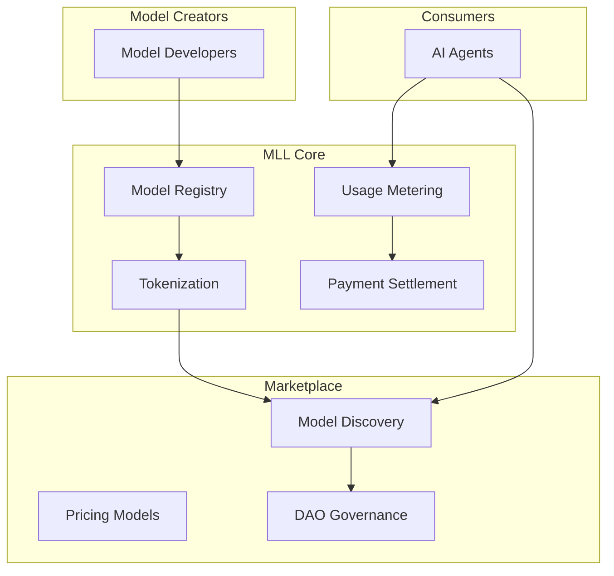

# RFC-0156 (Economics): Model Liquidity Layer (MLL)

## Status

**Version:** 1.0
**Status:** Draft
**Submission Date:** 2026-03-10

> **Note:** This RFC was originally numbered RFC-0156 under the legacy numbering system. It remains at 0156 as it belongs to the Economics category.

## Depends on

- RFC-0106: Deterministic Numeric Tower
- RFC-0151: Verifiable RAG Execution
- RFC-0152: Verifiable Agent Runtime
- RFC-0153: Agent Mission Marketplace
- RFC-0155: Deterministic Model Execution Engine

## Summary

This RFC defines the Model Liquidity Layer (MLL), a system that allows AI models to become tokenized economic assets. Models can be registered, licensed, monetized, and governed. The layer enables a decentralized market where developers publish models and agents pay to use them during inference.

## Design Goals

| Goal | Target                   | Metric                                  |
| ---- | ------------------------ | --------------------------------------- |
| G1   | Ownership                | Model creators control licensing        |
| G2   | Liquidity                | Models are tradable                     |
| G3   | Metered Usage            | Inference usage is measurable           |
| G4   | Deterministic Accounting | All payments follow deterministic rules |
| G5   | Open Market Access       | Any agent may purchase model usage      |

## Motivation

Today AI models are distributed through centralized platforms:

- Closed access
- Opaque licensing
- Centralized pricing
- Limited ownership

The Model Liquidity Layer allows models to function as programmable digital assets, enabling decentralized AI economics.

## Specification

### System Architecture



### Model Asset Definition

Each model is registered as a Model Asset:

```
ModelAsset

struct ModelAsset {
    model_id: u64,
    owner: Address,
    artifact_hash: Hash,
    license_type: LicenseType,
    usage_price: DQA,
}
```

| Field         | Description                       |
| ------------- | --------------------------------- |
| model_id      | Unique identifier                 |
| owner         | Model creator address             |
| artifact_hash | Deterministic model artifact hash |
| license_type  | Licensing rules                   |
| usage_price   | Price per inference unit          |

### Model Artifact Registration

Model artifacts must reference deterministic model files defined in RFC-0155:

1. Upload model artifact
2. Compute artifact hash
3. Register asset

The artifact hash ensures integrity.

### Model Tokenization

Model assets may be tokenized:

```
ModelToken

struct ModelToken {
    model_id: u64,
    supply: u64,
    ownership_share: u64,
}
```

Token holders receive a portion of usage revenue.

### Usage Metering

Each inference call consumes model compute units (MCU):

```
MCU = tokens_generated × model_complexity
```

Example: `MCU = 512 tokens × 32 layers = 16384 MCU`

The MCU determines usage fees.

### Pricing Models

The system supports multiple pricing models:

| Model         | Description             |
| ------------- | ----------------------- |
| Fixed price   | Flat rate per inference |
| Usage-based   | Price per MCU           |
| Subscription  | Access for fixed period |
| Auction-based | Market-driven pricing   |

Initial implementation uses usage-based pricing.

### Payment Flow

When an agent executes inference:

1. Agent calls model
2. Usage is measured
3. Payment is deducted
4. Owner receives revenue

Payment formula:

```
payment = MCU × usage_price
```

All arithmetic follows RFC-0106 deterministic rules.

### Revenue Distribution

Revenue is distributed among stakeholders:

| Stakeholder        | Share |
| ------------------ | ----- |
| Model creator      | 70%   |
| Token holders      | 20%   |
| Network validators | 10%   |

Values may be configurable per model.

### Model Licensing

Supported license types:

| License      | Description          |
| ------------ | -------------------- |
| Open         | Anyone can use       |
| Commercial   | Paid use only        |
| Restricted   | Limited access       |
| DAO-governed | Community controlled |

License rules determine access.

### Access Control

Access verification:

1. Agent balance check
2. License verification
3. Payment approval

If conditions fail, inference is denied.

### Model Upgrades

Model owners may publish new versions:

```
ModelVersion

struct ModelVersion {
    model_id: u64,
    version: u32,
    artifact_hash: Hash,
}
```

Versions are immutable once published.

### Compatibility Requirements

Model upgrades must remain compatible with:

- Deterministic execution (RFC-0155)
- Fixed-point arithmetic (RFC-0106)
- Canonical artifact format

Breaking changes require new model IDs.

### Model Discovery

Agents may search for models:

| Query                       | Description          |
| --------------------------- | -------------------- |
| LIST_MODELS                 | All available models |
| SEARCH_MODELS_BY_CAPABILITY | Filter by capability |
| GET_MODEL_PRICING           | Price information    |
| GET_MODEL_REPUTATION        | Reliability score    |

### Model Reputation

Models accumulate reputation:

```
reputation_score += 1 per successful_inference
```

Reputation helps agents select reliable models.

### Fraud Prevention

| Threat              | Mitigation                   |
| ------------------- | ---------------------------- |
| Fake models         | Artifact verification        |
| Malicious artifacts | Deterministic execution      |
| Incorrect pricing   | Community audits, reputation |

### Gas Model

Model usage incurs computation costs:

```
gas = inference_cost + verification_cost + settlement_cost
```

These costs are independent of model pricing.

### Governance

Models may be governed by DAOs:

- Pricing decisions
- Licensing changes
- Upgrade approval
- Revenue distribution

This enables community-managed AI models.

## Performance Targets

| Metric             | Target | Notes          |
| ------------------ | ------ | -------------- |
| Model registration | <100ms | Asset creation |
| Usage metering     | <1ms   | Per inference  |
| Payment settlement | <10ms  | Deterministic  |
| Model discovery    | <50ms  | Search queries |

## Adversarial Review

| Threat             | Impact   | Mitigation                       |
| ------------------ | -------- | -------------------------------- |
| Model poisoning    | Critical | Artifact hashing, verification   |
| Price manipulation | Medium   | Transparent pricing, competition |
| Unauthorized usage | High     | License enforcement, metering    |

## Alternatives Considered

| Approach                 | Pros                   | Cons                    |
| ------------------------ | ---------------------- | ----------------------- |
| Centralized model stores | Simple                 | Single point of failure |
| Fixed licensing          | Predictable            | No market dynamics      |
| This spec                | Decentralized + liquid | Complex economics       |

## Implementation Phases

### Phase 1: Core

- [ ] Model asset registration
- [ ] Artifact hashing
- [ ] Basic usage metering

### Phase 2: Economics

- [ ] Usage-based pricing
- [ ] Payment settlement
- [ ] Revenue distribution

### Phase 3: Tokenization

- [ ] Model token creation
- [ ] Token holder rewards
- [ ] Governance integration

### Phase 4: Marketplace

- [ ] Model discovery
- [ ] Search functionality
- [ ] Reputation system

## Key Files to Modify

| File                            | Change                 |
| ------------------------------- | ---------------------- |
| crates/octo-mll/src/asset.rs    | Model asset structures |
| crates/octo-mll/src/metering.rs | Usage metering         |
| crates/octo-mll/src/payment.rs  | Payment settlement     |
| crates/octo-mll/src/token.rs    | Tokenization           |
| crates/octo-vm/src/gas.rs       | MLL gas costs          |

## Future Work

- F1: Model futures markets
- F2: Model insurance pools
- F3: Performance-based pricing
- F4: Cross-chain model markets
- F5: Model staking mechanisms

## Rationale

MLL provides economic layer for AI models:

1. **Ownership**: Creators control their models
2. **Liquidity**: Models become tradable assets
3. **Metering**: Usage is precisely measured
4. **Composability**: Works with VAR, AMM, DMEE

## Related RFCs

- RFC-0106: Deterministic Numeric Tower — Arithmetic
- RFC-0151: Verifiable RAG Execution — Inference
- RFC-0152: Verifiable Agent Runtime — Agent execution
- RFC-0153: Agent Mission Marketplace — Task market
- RFC-0155: Deterministic Model Execution Engine — Model execution

> **Note**: RFC-0156 completes the economic layer for AI models.

## Related Use Cases

- [Hybrid AI-Blockchain Runtime](../../docs/use-cases/hybrid-ai-blockchain-runtime.md)
- [Model Marketplace](../../docs/use-cases/model-marketplace.md)

## Appendices

### A. Payment Calculation

```rust
fn calculate_payment(
    tokens_generated: u32,
    model_complexity: u32,
    usage_price: DQA,
) -> DQA {
    let mcu = DQA::from(tokens_generated as u64)
        * DQA::from(model_complexity as u64);
    mcu * usage_price
}
```

### B. Revenue Distribution

```rust
fn distribute_revenue(
    amount: DQA,
    creator: Address,
    token_holders: &[Address],
    validators: Address,
) -> (DQA, DQA, DQA) {
    let creator_share = amount * DQA::from_fp32(0.70);
    let holder_share = amount * DQA::from_fp32(0.20);
    let network_fee = amount * DQA::from_fp32(0.10);

    (creator_share, holder_share, network_fee)
}
```

---

**Version:** 1.0
**Submission Date:** 2026-03-10
**Changes:**

- Initial draft for MLL specification
