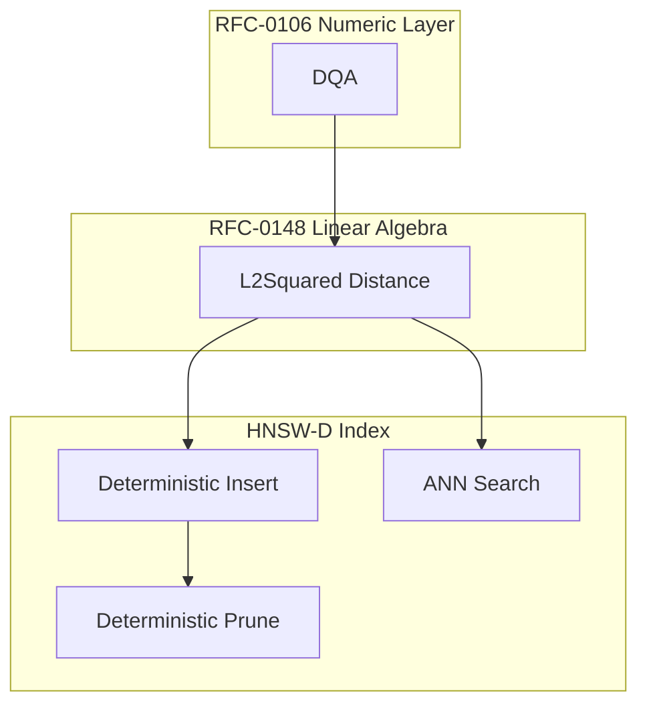

# RFC-0303 (Retrieval): Deterministic Vector Index (HNSW-D)

## Status

**Version:** 1.0
**Status:** Draft
**Submission Date:** 2026-03-10

> **Note:** This RFC was renumbered from RFC-0149 to RFC-0303 as part of the category-based numbering system.

## Summary

This RFC defines HNSW-D, a deterministic version of the Hierarchical Navigable Small World (HNSW) vector index suitable for consensus execution. The index supports efficient approximate nearest neighbor (ANN) search over vectors stored in the CipherOcto vector storage engine.

Standard HNSW implementations are nondeterministic due to random level assignment, concurrent graph updates, floating-point distance, and nondeterministic traversal ordering. HNSW-D removes these sources of nondeterminism by defining deterministic level assignment, canonical graph insertion, deterministic search ordering, deterministic tie-breaking, and fixed-point distance metrics.

## Design Goals

| Goal | Target           | Metric                                      |
| ---- | ---------------- | ------------------------------------------- |
| G1   | Determinism      | Identical graph structures across all nodes |
| G2   | Consensus Safety | Deterministic graph edges from same dataset |
| G3   | Efficient Search | O(log N) similar to standard HNSW           |
| G4   | ZK Compatibility | Distance via RFC-0106 primitives            |

## Motivation

Vector similarity search is essential for:

- AI retrieval-augmented generation (RAG)
- Semantic embedding search
- Agent memory layers
- Recommendation systems

Current blockchain vector indexes lack determinism. This RFC provides an ANN index that produces identical results across all consensus nodes while maintaining efficient search complexity.

## Specification

### System Architecture



### Core Data Structures

#### Vector Record

Each indexed vector is stored as:

```
VectorRecord

struct VectorRecord {
    vector_id: u64,
    vector: DVec<DQA, N>,
}

Constraints:
- 1 ≤ N ≤ MAX_VECTOR_DIM
- MAX_VECTOR_DIM = 4096
```

#### HNSW Node

Each vector corresponds to a node in the graph:

```
HNSWNode

struct HNSWNode {
    id: u64,
    level: u8,
    neighbors: Vec<Vec<u64>>,
}

Where:
- neighbors[level] = list of neighbor node IDs
```

#### Graph Structure

The index is a multi-layer proximity graph:

```
layer L     → sparse long edges (accelerates search)
layer L-1   →
layer L-2   →
...
layer 0     → dense local graph (contains all nodes)
```

Upper layers accelerate search by enabling long jumps.

### Deterministic Level Assignment

Standard HNSW uses random level assignment. HNSW-D replaces this with hash-based deterministic levels.

> ⚠️ **CANONICAL LEVEL ASSIGNMENT**: Level is computed as:

```
level = leading_zero_bits(SHA256(vector_id))
```

Maximum level: `MAX_LEVEL = 16`

Final rule:

```
level = min(level, MAX_LEVEL)
```

This produces a geometric distribution similar to standard HNSW while being deterministic.

### Graph Parameters

Consensus parameters:

| Parameter | Value | Definition                                 |
| --------- | ----- | ------------------------------------------ |
| M         | 16    | Maximum neighbors per node at upper layers |
| M_MAX     | 32    | Neighbors allowed at layer 0               |
| EF_CONS   | 64    | Search breadth during construction         |

### Deterministic Distance Function

> ⚠️ **DISTANCE REQUIREMENT**: Distance MUST use deterministic primitives.

Default metric:

```
L2Squared(a, b)
```

Defined in RFC-0148. Floating-point metrics are forbidden.

### Deterministic Graph Insertion

Insertion algorithm must be canonical:

#### Step 1 — Entry Point

The graph maintains a global entry node:

```
entry_node
```

First vector becomes entry.

#### Step 2 — Greedy Search

Search from highest layer downward:

```
current = entry_node

for layer from max_level → node_level+1:
    current = greedy_search(layer, vector)
```

#### Step 3 — Candidate Search

At layers ≤ node_level:

```
candidates = search_layer(query, EF_CONS)
```

#### Step 4 — Neighbor Selection

Neighbors are selected using deterministic ordering.

> ⚠️ **CANONICAL SELECTION**: Candidates are sorted by `(distance, vector_id)`. Tie-break: smaller vector_id wins. Top M neighbors are selected.

#### Step 5 — Mutual Connections

Edges must be bidirectional:

```
add_edge(node, neighbor)
add_edge(neighbor, node)
```

If neighbor list exceeds capacity:

```
prune_neighbors()
```

### Deterministic Neighbor Pruning

When neighbor count exceeds limits, nodes must be pruned.

> ⚠️ **CANONICAL PRUNING**: Sort neighbors by `(distance_to_node, node_id)`, keep first M (or M_MAX for layer 0). All nodes must apply identical pruning.

### Deterministic Search

Search algorithm returns approximate nearest neighbors.

```
ANN_Search(query, K)

entry = entry_node
for layer = max_level → 1:
    entry = greedy_search(layer, query)

candidates = search_layer(query, EF_SEARCH)

return top_K(candidates)
```

Consensus constant: `EF_SEARCH = 64`

### Deterministic Priority Queue

Candidate exploration requires a priority queue.

> ⚠️ **QUEUE ORDERING**: Primary key: `distance`, Secondary key: `vector_id`. This ensures deterministic traversal.

### Deterministic Graph Serialization

Graph state must be canonical.

> ⚠️ **SERIALIZATION ORDER**:
>
> - Node order: sorted by node_id
> - Neighbor order: sorted by neighbor_id

Serialized fields: `node_id`, `level`, `neighbor lists`

This ensures identical hash commitments.

## Performance Targets

| Metric        | Target             | Notes             |
| ------------- | ------------------ | ----------------- |
| Insert (N=1M) | O(M log N)         | ~100ms per vector |
| Search (K=10) | O(EF_SEARCH log N) | ~1ms latency      |
| Index build   | O(N log N)         | Bulk load         |

## Gas Cost Model

Operations have deterministic gas costs:

| Operation        | Gas Formula              | Example               |
| ---------------- | ------------------------ | --------------------- |
| Vector insertion | EF_CONS × dim × log(N)   | 64 × 64 × 20 = 81,920 |
| ANN search       | EF_SEARCH × dim × log(N) | 64 × 64 × 20 = 81,920 |
| Distance eval    | dim × GAS_DQA_MUL        | 64 × 8 = 512          |

## Consensus Limits

| Constant       | Value       | Purpose                    |
| -------------- | ----------- | -------------------------- |
| MAX_VECTOR_DIM | 4096        | Maximum vector dimension   |
| MAX_INDEX_SIZE | 10M vectors | Maximum index capacity     |
| MAX_LEVEL      | 16          | Maximum graph height       |
| MAX_NEIGHBORS  | 32          | Maximum neighbors per node |

Nodes MUST reject operations exceeding these limits.

## Adversarial Review

| Threat                        | Impact   | Mitigation                              |
| ----------------------------- | -------- | --------------------------------------- |
| Graph poisoning               | High     | Distance-based pruning, neighbor limits |
| DoS via flood                 | High     | Gas cost scaling, index size limits     |
| Determinism failure           | Critical | Canonical ordering, fixed-point math    |
| Priority queue nondeterminism | Critical | Explicit (distance, id) ordering        |

## Alternatives Considered

| Approach      | Pros                     | Cons                   |
| ------------- | ------------------------ | ---------------------- |
| Standard HNSW | Fast                     | Non-deterministic      |
| IVF-PQ        | Memory efficient         | Less accurate          |
| Brute force   | Deterministic            | O(N) - too slow        |
| HNSW-D        | Deterministic + O(log N) | Additional constraints |

## Implementation Phases

### Phase 1: Core

- [ ] Deterministic level assignment
- [ ] Graph insertion with M parameter
- [ ] Greedy search algorithm
- [ ] Basic serialization

### Phase 2: Search

- [ ] ANN search with EF_SEARCH
- [ ] Priority queue implementation
- [ ] Top-K selection
- [ ] Tie-breaking rules

### Phase 3: Production

- [ ] Neighbor pruning
- [ ] Graph serialization verification
- [ ] Gas cost calibration
- [ ] Deterministic test suite

## Key Files to Modify

| File                                             | Change                           |
| ------------------------------------------------ | -------------------------------- |
| crates/octo-vector/src/hnsw_d.rs                 | Core HNSW-D implementation       |
| crates/octo-vm/src/gas.rs                        | Index operation gas costs        |
| rfcs/0148-deterministic-linear-algebra-engine.md | Add distance primitive reference |

## Future Work

- F1: Deterministic PQ quantization
- F2: Deterministic IVF indexes
- F3: Deterministic graph compaction
- F4: Vector shard routing

## Rationale

HNSW-D provides the deterministic ANN index needed for:

1. **Consensus**: Identical results across all nodes
2. **Efficiency**: O(log N) search complexity
3. **ZK**: Integer arithmetic for distance
4. **Practical**: Enables on-chain vector search and RAG

## Related RFCs

- RFC-0106 (Numeric/Math): Deterministic Numeric Tower (DNT) — Core numeric types
- RFC-0105 (Numeric/Math): Deterministic Quantized Arithmetic (DQA) — Scalar operations
- RFC-0148 (Numeric/Math): Deterministic Linear Algebra Engine (DLAE) — Distance primitives
- RFC-0103 (Numeric/Math): Unified Vector SQL Storage — Vector storage layer
- RFC-0107 (Storage): Production Vector SQL Storage v2 — Production vector ops
- RFC-0120 (AI Execution): Deterministic AI VM — AI VM integration
- RFC-0110 (Agents): Verifiable Agent Memory — Memory layer with vectors

> **Note**: RFC-0149 completes the deterministic AI/vector stack together with RFC-0106 and RFC-0148.

## Related Use Cases

- [Vector Search](../../docs/use-cases/unified-vector-sql-storage.md)
- [Verifiable Agent Memory](../../docs/use-cases/verifiable-agent-memory-layer.md)
- [AI Inference on Chain](../../docs/use-cases/hybrid-ai-blockchain-runtime.md)

## Appendices

### A. Level Assignment Algorithm

```rust
fn deterministic_level(vector_id: u64, max_level: u8) -> u8 {
    let hash = sha256(vector_id.to_le_bytes());
    let leading_zeros = hash[0].leading_zeros() as u8;
    min(leading_zeros, max_level)
}
```

### B. Neighbor Selection Algorithm

```rust
fn select_neighbors(candidates: Vec<(u64, f64)>, max_neighbors: usize) -> Vec<u64> {
    // Sort by (distance, vector_id) - deterministic
    candidates.sort_by(|a, b| {
        let cmp = a.1.partial_cmp(&b.1).unwrap();
        if cmp == std::cmp::Ordering::Equal {
            a.0.cmp(&b.0)
        } else {
            cmp
        }
    });
    candidates.into_iter().take(max_neighbors).map(|(id, _)| id).collect()
}
```

### C. Test Vectors

| Test Case            | Expected Behavior                |
| -------------------- | -------------------------------- |
| Insert single vector | Single node at entry             |
| Insert duplicate ID  | Replace existing node            |
| Search empty index   | Return empty                     |
| Pruning boundary     | Deterministic neighbor selection |

---

**Version:** 1.0
**Submission Date:** 2026-03-10
**Changes:**

- Initial draft for HNSW-D specification
