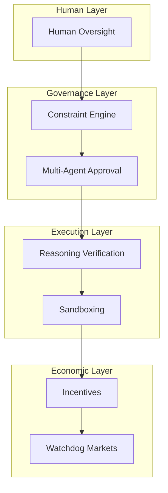
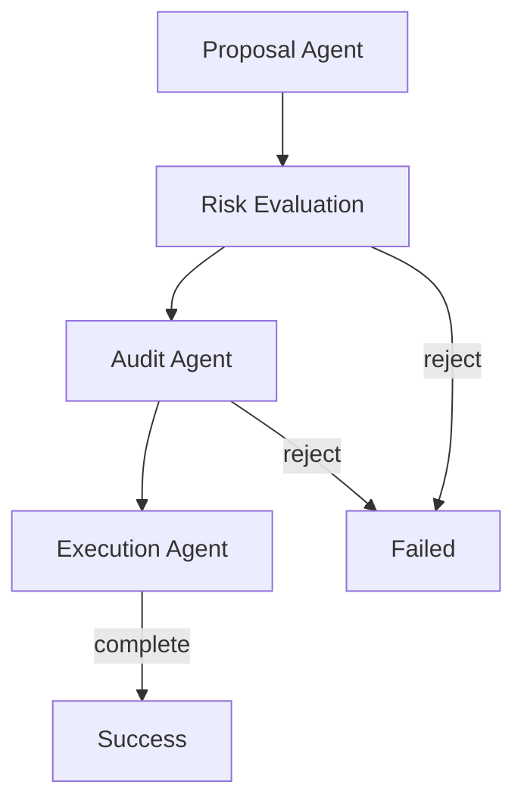
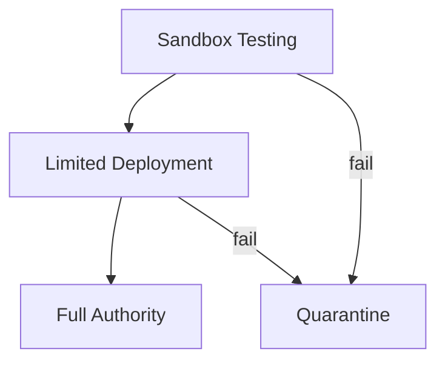

# RFC-0415 (Agents): Alignment & Control Mechanisms for Autonomous Agents

## Status

Draft

> **Note:** This RFC was renumbered from RFC-0119 to RFC-0415 as part of the category-based numbering system.

## Summary

This RFC defines **Alignment & Control Mechanisms** — a multi-layered system ensuring autonomous agent organizations remain safe, predictable, and controllable as they accumulate capital and knowledge.

Infrastructure problems (storage, verification, compute) are engineering challenges. Alignment problems are **systemic and economic**: ensuring autonomous entities behave safely when they control capital and knowledge.

## Design Goals

| Goal                           | Target                                    | Metric                     |
| ------------------------------ | ----------------------------------------- | -------------------------- |
| **G1: Constraint Enforcement** | All actions verified against rules        | 100% coverage              |
| **G2: Oversight**              | Multi-agent approval for critical actions | No single point of control |
| **G3: Auditability**           | Full reasoning trace for decisions        | Complete traces            |
| **G4: Containment**            | Sandboxed capability deployment           | Graduated permissions      |
| **G5: Stability**              | Slow governance for high-impact changes   | Delay windows              |

## Motivation

### The Core Alignment Problem

An autonomous organization optimizes:

```
maximize(reward)
```

But reward functions are rarely perfect representations of human goals.

This produces **specification drift**:

```
human intent ≠ optimization target
```

Classic examples:

| Optimization Target | Unintended Consequence |
| ------------------- | ---------------------- |
| maximize clicks     | spam                   |
| maximize engagement | misinformation         |
| maximize profit     | harmful strategies     |

### Why Alignment Matters for CipherOcto

1. **Safety** — Prevent harmful agent behavior
2. **Predictability** — Ensure consistent operations
3. **Accountability** — Clear responsibility attribution
4. **Trust** — Human confidence in autonomous systems

## Specification

### Multi-Layer Control Architecture



### Constraint Engine

Agent actions evaluated against formal constraints:

```rust
struct Constraint {
    condition: Expression,
    action: Action,
    severity: Severity,
}

impl Constraint {
    fn evaluate(&self, context: &ExecutionContext) -> Result {
        if self.condition.eval(context) {
            self.action.execute(context)
        } else {
            Ok(())
        }
    }
}
```

Example constraints:

| Constraint       | Rule                                  |
| ---------------- | ------------------------------------- |
| Capital limits   | if amount > threshold: reject         |
| Legal compliance | if jurisdiction in restricted: reject |
| Risk thresholds  | if risk_score > max: require_approval |
| Safety limits    | if operation_type == unsafe: reject   |

### Multi-Agent Oversight

Critical actions require agreement among multiple agents:



If any stage rejects, the action fails.

### Verifiable Reasoning Audits

For critical decisions, produce full reasoning traces:

```json
{
  "decision_trace": {
    "decision_id": "dec_123",
    "agents_involved": ["researcher", "evaluator", "approver"],
    "data_sources": ["dataset_1", "dataset_2"],
    "models_used": ["model_alpha"],
    "policy_checks": [
      { "check": "budget_limit", "result": "pass" },
      { "check": "risk_threshold", "result": "pass" }
    ],
    "reasoning_hash": "sha256:...",
    "final_output": "..."
  }
}
```

Auditors verify:

- Decision respected rules
- Data was legitimate
- Models were authorized

### External Watchdog Markets

Third parties audit suspicious behavior:

| Market Participant | Role                       |
| ------------------ | -------------------------- |
| Watchdog           | Independent auditor        |
| Challenger         | Fraud detection specialist |
| Arbiter            | Dispute resolution         |

Rewards:

```
challenge_reward = slashed_stake × α
```

This decentralizes oversight.

### Capability Sandboxing

New or upgraded agents operate in restricted environments first:



Lifecycle:

```
sandbox (isolated)
      ↓
limited_capital (restricted resources)
      ↓
full_operations (complete authority)
```

### Slow Governance

High-impact actions delayed for audit:

| Action Type                     | Delay Window |
| ------------------------------- | ------------ |
| Large transfers (>10% treasury) | 24 hours     |
| Model upgrades                  | 7 days       |
| Governance rule changes         | 30 days      |
| Agent spawning (>10 agents)     | 48 hours     |

### Human Oversight Layer

Human governance retained for critical decisions:

| Mechanism           | Purpose                   |
| ------------------- | ------------------------- |
| Multi-sig council   | Major financial decisions |
| DAO voting          | Policy changes            |
| Regulatory observer | Compliance oversight      |
| Emergency stop      | Crisis response           |

### Alignment Through Incentives

Economic penalties for harmful behavior:

| Behavior             | Penalty            |
| -------------------- | ------------------ |
| Constraint violation | Slash 10-50% stake |
| Policy breach        | Full stake slash   |
| Repeated issues      | Reputation damage  |
| Serious harm         | Permanent ban      |

### Self-Improvement Constraints

Control agent capability improvement:

```rust
struct ImprovementConstraint {
    // Maximum capability improvement per period
    max_capability_gain: f64,

    // Required oversight for model changes
    approval_threshold: u8,

    // Sandbox period for new versions
    sandbox_duration: Duration,
}
```

### Sub-Agent Governance

Control agent proliferation:

```rust
struct SubAgentPolicy {
    // Maximum agents per organization
    max_agents: u32,

    // Required diversity in roles
    role_distribution: HashSet<Role>,

    // Approval needed for new agent types
    new_type_approval: bool,
}
```

## Integration with CipherOcto Stack

```
┌─────────────────────────────────────────┐
│         Human Oversight Layer                    │
├─────────────────────────────────────────┤
│         Constraint Engine                       │
├─────────────────────────────────────────┤
│         Multi-Agent Approval                   │
├─────────────────────────────────────────┤
│         Verifiable Reasoning                  │
├─────────────────────────────────────────┤
│         Agent Organizations                   │
└─────────────────────────────────────────┘
```

### Integration Points

| RFC      | Integration                        |
| -------- | ---------------------------------- |
| RFC-0114 | Reasoning traces for audits        |
| RFC-0115 | Verification markets as watchdogs  |
| RFC-0116 | Deterministic constraint execution |
| RFC-0117 | State isolation for sandboxing     |
| RFC-0118 | Governance rules enforcement       |

## Adversarial Review

| Threat                     | Impact | Mitigation                    |
| -------------------------- | ------ | ----------------------------- |
| **Goal drift**             | High   | Constraint engine + oversight |
| **Strategic deception**    | High   | Multi-agent approval          |
| **Capability explosion**   | Medium | Sandboxing + limits           |
| **Economic concentration** | High   | Market competition            |

## Alternatives Considered

| Approach                | Pros                  | Cons                    |
| ----------------------- | --------------------- | ----------------------- |
| **No constraints**      | Maximum autonomy      | Unsafe                  |
| **Centralized control** | Simple                | Single point of failure |
| **This approach**       | Layered + distributed | Complexity              |

## Key Files to Modify

| File                    | Change                |
| ----------------------- | --------------------- |
| src/align/constraint.rs | Constraint engine     |
| src/align/oversight.rs  | Multi-agent approval  |
| src/align/sandbox.rs    | Capability sandboxing |
| src/align/incentives.rs | Alignment incentives  |

## Future Work

- F1: Formal verification of constraint languages
- F2: Adaptive constraint systems
- F3: Cross-organization alignment protocols

## Related RFCs

- RFC-0114 (Agents): Verifiable Reasoning Traces
- RFC-0115 (Economics): Probabilistic Verification Markets
- RFC-0116 (Numeric/Math): Unified Deterministic Execution Model
- RFC-0117 (Agents): State Virtualization for Massive Agent Scaling
- RFC-0118 (Agents): Autonomous Agent Organizations

## Related Use Cases

- [Verifiable AI Agents for DeFi](../../docs/use-cases/verifiable-ai-agents-defi.md)

---

**Version:** 1.0
**Submission Date:** 2026-03-07
**Last Updated:** 2026-03-07
