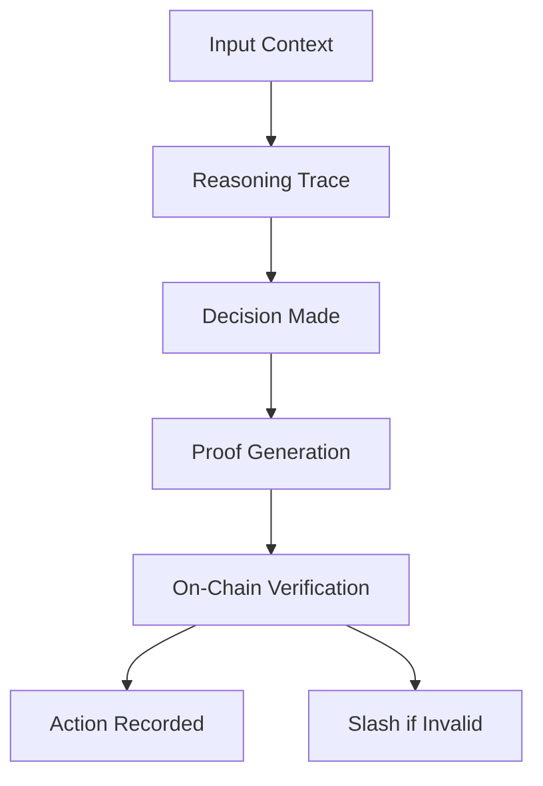

# RFC-0416 (Agents): Self-Verifying AI Agents

## Status

Draft

> **Note:** This RFC was renumbered from RFC-0134 to RFC-0416 as part of the category-based numbering system.

## Summary

This RFC defines **Self-Verifying AI Agents** — autonomous agents that produce cryptographic proofs of their reasoning steps, decisions, and actions. Each agent decision generates a proof chain that can be verified on-chain, enabling auditable AI behavior in DeFi, governance, and autonomous systems. The framework combines deterministic execution (RFC-0131), verifiable reasoning traces (RFC-0114), and ZK proofs to create agents whose every action is cryptographically auditable.

## Design Goals

| Goal                            | Target                   | Metric              |
| ------------------------------- | ------------------------ | ------------------- |
| **G1: Reasoning Proofs**        | Every decision proven    | 100% coverage       |
| **G2: Action Auditing**         | All actions verifiable   | On-chain record     |
| **G3: Deterministic Execution** | Reproducible behavior    | Bit-identical       |
| **G4: Composability**           | Multi-agent coordination | Proof aggregation   |
| **G5: Economic Security**       | Stake-based trust        | Slashing conditions |

## Motivation

### CAN WE? — Feasibility Research

The fundamental question: **Can AI agents produce cryptographic proofs of their reasoning?**

Current AI agent systems face a trust gap:

| Problem              | Impact                                |
| -------------------- | ------------------------------------- |
| Opaque reasoning     | Cannot verify why decisions were made |
| Unverifiable actions | No proof of what agents did           |
| No accountability    | Agents cannot be held responsible     |
| Trust bottlenecks    | Must trust agents blindly             |

Feasibility is established through:

- RFC-0131 Deterministic Transformer Circuits already verify inference
- RFC-0114 Verifiable Reasoning Traces provides trace structures
- STARK proofs can verify arbitrary computation
- Execution traces can be commitment-linked

### WHY? — Why This Matters

AI agents are increasingly making consequential decisions:

| Domain             | Current Problem                |
| ------------------ | ------------------------------ |
| DeFi               | Unverified trading decisions   |
| Governance         | Opaque voting rationale        |
| Autonomous Systems | No accountability for actions  |
| Legal/Compliance   | Cannot audit AI decisions      |
| Financial Services | No proof of strategy adherence |

Self-verifying agents enable:

- **Auditable decisions** — Every action has a proof chain
- **Accountable behavior** — Agents can be slashed for violations
- **Compliance-ready** — Regulators can verify without re-executing
- **Trustless operation** — No need to trust agents blindly

### WHAT? — What This Specifies

Self-Verifying Agents define:

1. **Agent architecture** — Decision-making components
2. **Reasoning trace** — Step-by-step proof generation
3. **Decision proofs** — Cryptographic verification of choices
4. **Action commitment** — On-chain action records
5. **Verification layer** — Proof validation
6. **Slashing conditions** — Economic penalties
7. **Multi-agent coordination** — Aggregated proofs

### HOW? — Implementation

Implementation builds on existing stack:

```
RFC-0131 (Transformer Circuit)
       ↓
RFC-0114 (Reasoning Traces)
       ↓
RFC-0134 (Self-Verifying Agents) ← NEW
       ↓
RFC-0130 (Proof-of-Inference)
       ↓
RFC-0125 (Model Liquidity)
```

## Specification

### Agent Architecture

A self-verifying agent consists of:

```rust
/// Self-verifying AI agent
struct VerifiableAgent {
    /// Agent identity
    agent_id: Digest,

    /// Model commitment
    model_commitment: ModelCommitment,

    /// Strategy commitment
    strategy: Strategy,

    /// Execution environment
    environment: AgentEnvironment,

    /// Proof generator
    prover: ProofGenerator,
}

/// Strategy defines agent behavior rules
struct Strategy {
    /// Strategy hash (committed on-chain)
    strategy_hash: Digest,

    /// Decision rules
    rules: Vec<DecisionRule>,

    /// Constraints (must not violate)
    constraints: Vec<Constraint>,

    /// Maximum slippage, exposure, etc.
    risk_limits: RiskLimits,
}

impl Strategy {
    /// Verify action complies with strategy
    fn verify_action(&self, action: &AgentAction) -> Result<(), StrategyError> {
        for rule in &self.rules {
            if !rule.applies(action) {
                continue;
            }
            if !rule.allows(action) {
                return Err(StrategyError::RuleViolation(rule.id));
            }
        }

        for constraint in &self.constraints {
            if constraint.violated(action) {
                return Err(StrategyError::ConstraintViolation(constraint.id));
            }
        }

        Ok(())
    }
}
```

### Reasoning Trace

Each decision generates a reasoning trace:

```rust
/// Reasoning trace for a decision
struct ReasoningTrace {
    /// Trace entries
    entries: Vec<TraceEntry>,

    /// Input commitment
    input_commitment: Digest,

    /// Output commitment
    output_commitment: Digest,

    /// Trace hash
    trace_hash: Digest,
}

impl ReasoningTrace {
    /// Add reasoning step
    fn add_step(&mut self, step: ReasoningStep) {
        let entry = TraceEntry {
            step_number: self.entries.len() as u32,
            step,
            hash: self.update_hash(),
        };
        self.entries.push(entry);
    }

    /// Finalize trace
    fn finalize(&mut self) {
        self.output_commitment = self.compute_output_hash();
        self.trace_hash = self.compute_trace_hash();
    }
}

/// Individual reasoning step
struct ReasoningStep {
    /// Step type
    step_type: StepType,

    /// Input state
    input: Digest,

    /// Operation performed
    operation: Operation,

    /// Output state
    output: Digest,

    /// Reasoning (why this step was taken)
    reasoning: String,
}

enum StepType {
    Perception,
    Analysis,
    Planning,
    Decision,
    Execution,
    Verification,
}
```

### Decision Proof Structure

Every decision produces a verifiable proof:

```rust
/// Decision proof
struct DecisionProof {
    /// Unique decision ID
    decision_id: Digest,

    /// Agent that made the decision
    agent_id: Digest,

    /// Timestamp
    timestamp: u64,

    /// Block number
    block_number: u64,

    /// Input context (hashed)
    context_hash: Digest,

    /// Reasoning trace
    reasoning_trace: ReasoningTrace,

    /// Decision made
    decision: AgentDecision,

    /// Strategy used
    strategy_hash: Digest,

    /// Proof of correct execution
    execution_proof: ZKProof,

    /// Strategy adherence proof
    strategy_proof: ZKProof,
}

/// Agent decision
enum AgentDecision {
    /// Trading decision
    Trade(TradeAction),

    /// Governance vote
    Vote(VoteAction),

    /// Parameter update
    ParameterUpdate(ParameterChange),

    /// Message sent
    Message(OutgoingMessage),

    /// Custom action
    Custom(ActionPayload),
}
```

### Action Commitment

Actions are committed to the blockchain:

```rust
/// Action commitment to chain
struct ActionCommitment {
    /// Commitment hash
    commitment: Digest,

    /// Action details (encrypted)
    action_encrypted: EncryptedBlob,

    /// Proof of validity
    validity_proof: ZKProof,

    /// Pre-commitment (revealed after)
    pre_commitment: Digest,
}

impl ActionCommitment {
    /// Create commitment
    fn commit(action: &AgentAction) -> Self {
        let action_hash = Poseidon::hash(action.to_bytes());

        // Pre-commit before revealing
        let pre_commitment = Poseidon::hash([action_hash, action.nonce]);

        Self {
            commitment: action_hash,
            action_encrypted: action.encrypt(),
            validity_proof: action.generate_proof(),
            pre_commitment,
        }
    }

    /// Reveal action
    fn reveal(&self, action: &AgentAction) -> bool {
        // Verify commitment matches
        let action_hash = Poseidon::hash(action.to_bytes());
        action_hash == self.commitment
    }
}
```

### Verification Layer

Actions are verified through a dedicated layer:

```rust
/// Agent action verifier
struct AgentVerifier {
    /// Verification thresholds
    thresholds: VerificationThresholds,
}

struct VerificationThresholds {
    /// Minimum proof quality
    proof_quality_min: f64,

    /// Strategy adherence required
    strategy_adherence_min: f64,

    /// Reasoning depth minimum
    reasoning_depth_min: u32,
}

impl AgentVerifier {
    /// Verify a decision proof
    fn verify_decision(&self, proof: &DecisionProof) -> VerificationResult {
        // 1. Verify execution proof
        if !self.verify_execution(&proof.execution_proof) {
            return VerificationResult::Invalid("Execution proof failed");
        }

        // 2. Verify strategy adherence
        if !self.verify_strategy(&proof.strategy_proof, &proof.strategy_hash) {
            return VerificationResult::Invalid("Strategy violation");
        }

        // 3. Verify reasoning trace integrity
        if !self.verify_trace(&proof.reasoning_trace) {
            return VerificationResult::Invalid("Trace integrity failed");
        }

        // 4. Verify decision within constraints
        if !self.verify_constraints(&proof.decision) {
            return VerificationResult::Invalid("Constraints violated");
        }

        VerificationResult::Valid
    }

    /// Verify reasoning trace
    fn verify_trace(&self, trace: &ReasoningTrace) -> bool {
        // Verify hash chain
        let mut current_hash = trace.input_commitment;
        for entry in &trace.entries {
            if entry.input != current_hash {
                return false;
            }
            current_hash = entry.output;
        }

        // Verify final hash
        current_hash == trace.output_commitment
    }
}
```

### Slashing Conditions

Agents stake tokens and can be slashed:

```rust
/// Slashing conditions for agents
enum SlashingCondition {
    /// No proof submitted for decision
    NoProof {
        decision_id: Digest,
    },

    /// Proof invalid
    InvalidProof {
        decision_id: Digest,
        proof_type: ProofType,
    },

    /// Strategy violation
    StrategyViolation {
        decision_id: Digest,
        violated_rule: String,
    },

    /// Constraint violation
    ConstraintViolation {
        decision_id: Digest,
        constraint: String,
    },

    /// Late proof submission
    LateProof {
        decision_id: Digest,
        deadline: u64,
    },

    /// Incorrect execution
    IncorrectExecution {
        decision_id: Digest,
        expected: Digest,
        actual: Digest,
    },
}

impl SlashingCondition {
    /// Calculate slash amount
    fn slash_amount(&self, stake: TokenAmount) -> TokenAmount {
        match self {
            SlashingCondition::NoProof { .. } => stake * 0.50,
            SlashingCondition::InvalidProof { .. } => stake * 1.00,
            SlashingCondition::StrategyViolation { .. } => stake * 0.75,
            SlashingCondition::ConstraintViolation { .. } => stake * 0.80,
            SlashingCondition::LateProof { .. } => stake * 0.10,
            SlashingCondition::IncorrectExecution { .. } => stake * 1.00,
        }
    }
}
```

### Multi-Agent Coordination

Multiple agents can coordinate with aggregated proofs:

```rust
/// Multi-agent action
struct CoordinatedAction {
    /// Participating agents
    agents: Vec<Digest>,

    /// Individual decisions
    decisions: Vec<AgentDecision>,

    /// Coordination proof
    coordination_proof: ZKProof,

    /// Aggregated decision
    aggregated_decision: AggregatedDecision,
}

/// Agent coalition
struct AgentCoalition {
    /// Member agents
    members: Vec<Digest>,

    /// Shared strategy
    shared_strategy: Digest,

    /// Voting mechanism
    voting: VotingMechanism,

    /// Decision threshold
    threshold: u32,
}

impl AgentCoalition {
    /// Make decision as coalition
    fn decide(&self, proposals: &[Proposal]) -> CoordinatedAction {
        // Each agent votes
        let votes: Vec<Vote> = self.members
            .iter()
            .map(|a| a.vote(proposals))
            .collect();

        // Aggregate votes
        let decision = self.voting.tally(&votes);

        // Generate coordination proof
        let coordination_proof = self.prove_coordination(&votes, &decision);

        CoordinatedAction {
            agents: self.members.clone(),
            decisions: votes.into_iter().map(|v| v.decision).collect(),
            coordination_proof,
            aggregated_decision: decision,
        }
    }
}
```

### Agent Reputation

Agents build reputation over time:

```rust
/// Agent reputation
struct AgentReputation {
    /// Agent ID
    agent_id: Digest,

    /// Total decisions
    decision_count: u64,

    /// Valid decisions
    valid_count: u64,

    /// Slash count
    slash_count: u64,

    /// Total value secured
    value_secured: TokenAmount,

    /// Uptime
    uptime: f64,
}

impl AgentReputation {
    /// Calculate reputation score
    fn score(&self) -> f64 {
        let validity_rate = self.valid_count as f64 / self.decision_count.max(1) as f64;
        let slash_penalty = 1.0 - (self.slash_count as f64 * 0.1);
        let uptime_factor = self.uptime;

        validity_rate * slash_penalty * uptime_factor
    }

    /// Update after decision
    fn record_decision(&mut self, result: DecisionResult) {
        self.decision_count += 1;

        match result {
            DecisionResult::Valid => self.valid_count += 1,
            DecisionResult::Slashed => self.slash_count += 1,
            DecisionResult::Pending => {}
        }
    }
}
```

### Integration with DeFi

Self-verifying agents excel in DeFi:

```rust
/// Verifiable trading agent
struct VerifiableTradingAgent {
    /// Base verifiable agent
    base: VerifiableAgent,

    /// Trading strategy
    trading_strategy: TradingStrategy,

    /// Allowed DEXes
    allowed_dexes: Vec<Address>,

    /// Max slippage
    max_slippage: f64,

    /// Position limits
    position_limits: PositionLimits,
}

/// Trading decision with proof
struct TradingDecision {
    /// Action
    action: TradeAction,

    /// Amount
    amount: TokenAmount,

    /// DEX used
    dex: Address,

    /// Price impact
    price_impact: f64,

    /// Reasoning
    reasoning: String,

    /// Proof
    proof: DecisionProof,
}

impl VerifiableTradingAgent {
    /// Execute trade with proof
    fn execute_trade(
        &self,
        action: TradeAction,
        amount: TokenAmount,
    ) -> Result<TradingDecision, TradingError> {
        // 1. Analyze market
        let analysis = self.analyze_market();

        // 2. Make decision
        let decision = self.decide(action, amount, &analysis)?;

        // 3. Generate proof
        let proof = self.generate_proof(&decision, &analysis)?;

        // 4. Execute on DEX
        let tx = self.execute_on_dex(&decision)?;

        // 5. Verify execution
        self.verify_execution(&tx, &decision)?;

        Ok(TradingDecision {
            action: decision.action,
            amount: decision.amount,
            dex: decision.dex,
            price_impact: decision.price_impact,
            reasoning: decision.reasoning,
            proof,
        })
    }
}
```

### Integration with Governance

Agents can participate in governance:

```rust
/// Governance agent
struct GovernanceAgent {
    /// Voting strategy
    voting_strategy: VotingStrategy,

    /// Delegate voting
    delegate: Option<Digest>,
}

/// Governance vote with proof
struct GovernanceVote {
    /// Proposal ID
    proposal_id: Digest,

    /// Vote choice
    choice: VoteChoice,

    /// Reasoning
    reasoning: String,

    /// Voting power
    voting_power: u64,

    /// Proof
    proof: DecisionProof,
}
```

## Verification Pipeline



## Performance Targets

| Metric            | Target | Notes         |
| ----------------- | ------ | ------------- |
| Proof generation  | <5s    | Per decision  |
| Verification time | <10ms  | On-chain      |
| Trace size        | <1MB   | Per decision  |
| Reasoning steps   | >5     | Minimum depth |

## Adversarial Review

| Threat                 | Impact | Mitigation                   |
| ---------------------- | ------ | ---------------------------- |
| **Fake proofs**        | High   | ZK verification + slashing   |
| **Strategy gaming**    | High   | On-chain strategy commitment |
| **Collusion**          | Medium | Multi-party proofs           |
| **Front-running**      | Medium | Commit-reveal scheme         |
| **Reputation farming** | Medium | Slash history weighted       |

## Alternatives Considered

| Approach                    | Pros              | Cons                       |
| --------------------------- | ----------------- | -------------------------- |
| **TEE-based agents**        | Fast              | Hardware dependency        |
| **Audit logs only**         | Simple            | No cryptographic proof     |
| **This RFC**                | Full verification | Proof generation overhead  |
| **Optimistic verification** | Fast              | Challenge mechanism needed |

## Implementation Phases

### Phase 1: Core Agent

- [ ] Agent architecture
- [ ] Reasoning trace structure
- [ ] Basic decision proofs

### Phase 2: Integration

- [ ] DeFi trading agents
- [ ] Governance agents
- [ ] Strategy commitment

### Phase 3: Coordination

- [ ] Multi-agent coordination
- [ ] Coalition formation
- [ ] Aggregated proofs

### Phase 4: Economics

- [ ] Reputation system
- [ ] Slashing mechanism
- [ ] Staking integration

## Future Work

- **F1: Continuous Verification** — Real-time action monitoring
- **F2: Human-in-the-Loop** — Approval gates for critical actions
- **F3: Agent Insurance** — Coverage for agent failures
- **F4: Cross-Chain Agents** — Verifiable across chains

## Rationale

### Why ZK Proofs for Agents?

ZK proofs provide:

- Cryptographic certainty of reasoning
- No need to reveal internal state
- On-chain verification cheap
- Quantum resistance (STARKs)

### Why Strategy Commitment?

Committed strategies prevent:

- Post-hoc justification
- Strategy changes after the fact
- Blame-shifting for violations

### Why Reasoning Traces?

Traces enable:

- Human auditing of decisions
- Error diagnosis
- Compliance reporting

## Related RFCs

- RFC-0106 (Numeric/Math): Deterministic Numeric Tower
- RFC-0114 (Agents): Verifiable Reasoning Traces
- RFC-0120 (AI Execution): Deterministic AI Virtual Machine
- RFC-0130 (Proof Systems): Proof-of-Inference Consensus
- RFC-0131 (Numeric/Math): Deterministic Transformer Circuit
- RFC-0132 (Numeric/Math): Deterministic Training Circuits
- RFC-0133 (Proof Systems): Proof-of-Dataset Integrity
- RFC-0140 (Consensus): Sharded Consensus Protocol
- RFC-0141 (Consensus): Parallel Block DAG Specification
- RFC-0142 (Consensus): Data Availability & Sampling Protocol
- RFC-0143 (Networking): OCTO-Network Protocol

## Related Use Cases

- [Verifiable AI Agents for DeFi](../../docs/use-cases/verifiable-ai-agents-defi.md)
- [Hybrid AI-Blockchain Runtime](../../docs/use-cases/hybrid-ai-blockchain-runtime.md)

## Appendices

### A. Complete Verifiable AI Stack

```
┌─────────────────────────────────────────────────────┐
│        Self-Verifying AI Agents (RFC-0134)            │
└─────────────────────────┬───────────────────────────┘
                          │
┌─────────────────────────▼───────────────────────────┐
│        Proof-of-Dataset Integrity (RFC-0133)          │
└─────────────────────────┬───────────────────────────┘
                          │
┌─────────────────────────▼───────────────────────────┐
│        Deterministic Training (RFC-0132)               │
└─────────────────────────┬───────────────────────────┘
                          │
┌─────────────────────────▼───────────────────────────┐
│        Transformer Circuit (RFC-0131)                 │
└─────────────────────────┬───────────────────────────┘
                          │
┌─────────────────────────▼───────────────────────────┐
│        Deterministic AI-VM (RFC-0120)                 │
└─────────────────────────┬───────────────────────────┘
                          │
┌─────────────────────────▼───────────────────────────┐
│        Proof-of-Inference Consensus (RFC-0130)         │
└─────────────────────────┬───────────────────────────┘
                          │
┌─────────────────────────▼───────────────────────────┐
│        Model Liquidity Layer (RFC-0125)               │
└─────────────────────────────────────────────────────┘
```

### B. Agent Slashing Example

```
Decision: Trade 100k USDC → ETH

Violation: Exceeded max slippage (2%)

Slash: 75% of staked tokens

Result:
- Agent loses 75% stake
- Decision reversed on-chain
- Agent reputation: -1 slash
```

### C. End-to-End Decision Flow

```
1. Input: "Swap 100 USDC for ETH on Uniswap"

2. Reasoning Trace:
   - Step 1: Analyze market data
   - Step 2: Check liquidity pools
   - Step 3: Calculate optimal route
   - Step 4: Verify slippage < 2%
   - Step 5: Execute trade

3. Decision Proof:
   - Context hash
   - Reasoning trace (5 steps)
   - Execution proof (ZK)
   - Strategy adherence proof (ZK)

4. On-Chain:
   - Verify proofs
   - Record decision
   - Release funds

5. Result:
   - Trade executed
   - Proof stored
   - Auditable forever
```

---

**Version:** 1.0
**Submission Date:** 2026-03-07
**Last Updated:** 2026-03-07
