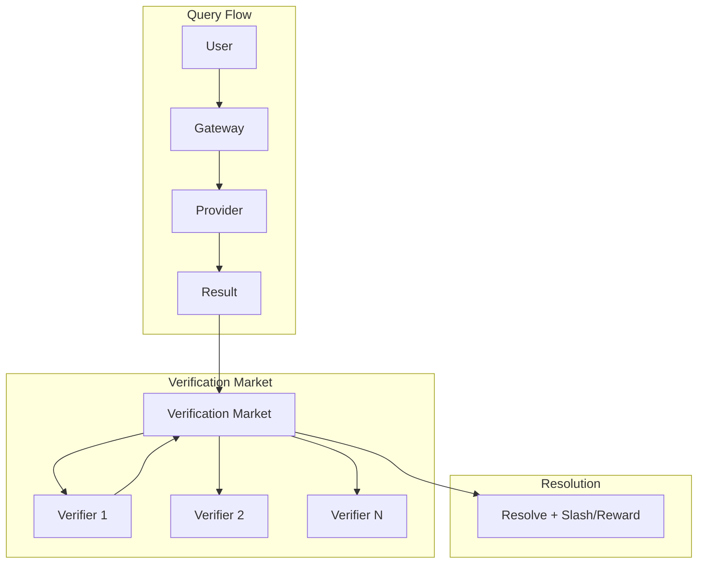
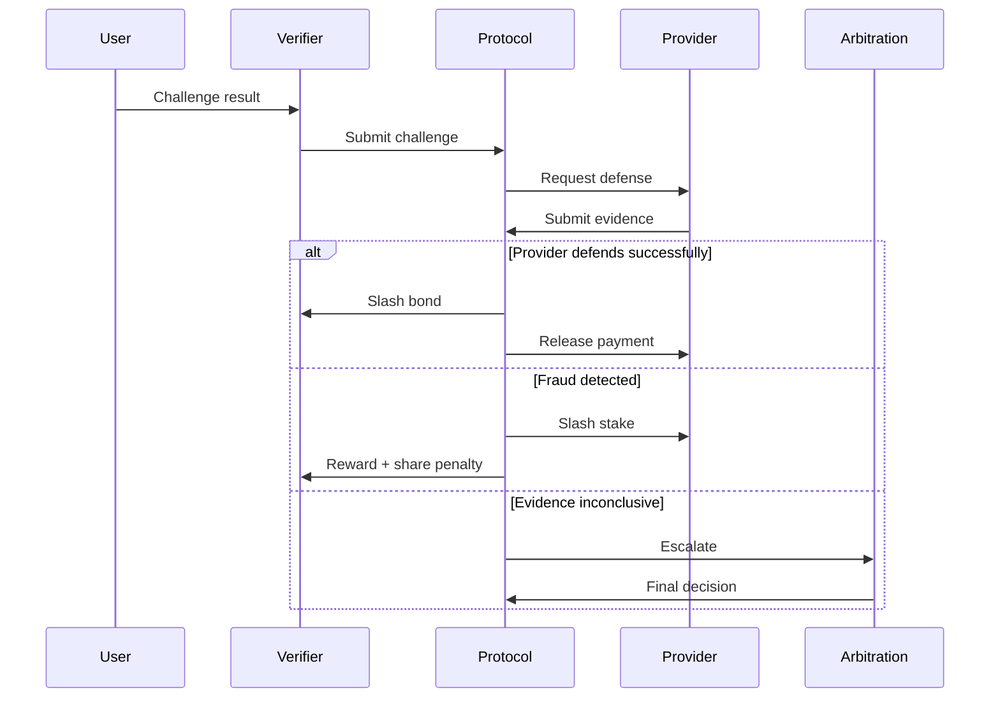
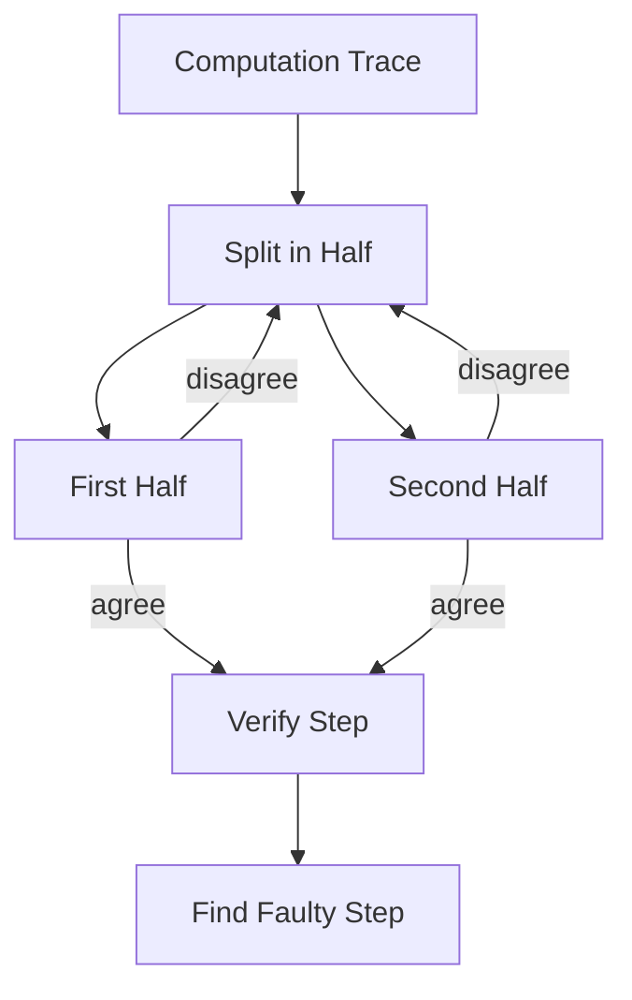

# RFC-0615 (Proof Systems): Probabilistic Verification Markets

## Status

Draft

> **Note:** This RFC was renumbered from RFC-0115 to RFC-0615 as part of the category-based numbering system.

## Summary

This RFC defines **Probabilistic Verification Markets** — a mechanism that enables massive AI computations to remain trustworthy without proving everything.

The key insight: you don't need to verify every computation. Instead, you create markets where verifiers compete to detect fraud, with economic incentives structured so that **the expected cost of cheating exceeds the potential gain**.

## Design Goals

| Goal                    | Target                                  | Metric                           |
| ----------------------- | --------------------------------------- | -------------------------------- |
| **G1: Fraud Detection** | Cheating detected economically          | >99% detection rate              |
| **G2: Scalability**     | Handle millions of queries              | Verification cost <0.1% of query |
| **G3: Incentives**      | Verifiers earn more for fraud detection | ROI > verifier stake             |
| **G4: Low Latency**     | Fast verification for honest queries    | <10ms for P99                    |

## Motivation

### The Problem: Proof Cost Collapse

Verifying every AI computation is economically impossible:

| Query Type        | Verification Cost | Query Cost | Overhead |
| ----------------- | ----------------- | ---------- | -------- |
| Simple retrieval  | $0.001            | $0.0001    | 1000%    |
| LLM inference     | $10.00            | $0.01      | 100,000% |
| Complex reasoning | $100.00           | $0.10      | 100,000% |

If we verify everything, the network becomes prohibitively expensive.

### The Solution: Economic Verification

Instead of cryptographic certainty, use **economic games**:

```
Honest verifier: costs $0.001 to verify → earns $0.001
Fraudulent provider: 1% chance of fraud → expected loss = 0.01 × stake
```

When fraud detection is cheap and profitable, the system remains trustworthy without proving everything.

## Specification

### Market Structure



### Verification Tiers

| Tier         | Verification Level      | Cost     | Use Case               |
| ------------ | ----------------------- | -------- | ---------------------- |
| **Basic**    | Random sampling (1%)    | $0.001   | High volume, low value |
| **Standard** | Deterministic checks    | $0.01    | Most queries           |
| **Premium**  | Full proof verification | $0.10    | Financial/regulated    |
| **Dispute**  | Third-party arbitration | Variable | Challenged results     |

### The Verification Game

```rust
struct VerificationGame {
    // The query and result
    query: Query,
    result: Result,

    // Economic parameters
    stake: u256,           // Provider's staked amount
    verification_bond: u256, // Verifier's bond
    challenge_reward: u256,  // Reward for successful challenge

    // Verification outcome
    outcome: VerificationOutcome,
}

enum VerificationOutcome {
    // All verifiers agree result is correct
    Verified,

    // Verifiers disagree → escalation
    Disputed {
        challenger: Address,
        defender: Address,
        evidence: Vec<Evidence>,
    },

    // Fraud detected
    FraudDetected {
        evidence: FraudEvidence,
        slash_amount: u256,
    },
}
```

### Incentive Structure

#### For Providers

| Action           | Consequence                       |
| ---------------- | --------------------------------- |
| Honest execution | Earn payment, maintain reputation |
| Fraud detected   | Slash 10-100% of stake            |
| Repeated fraud   | Permanent ban + reputation wipe   |

#### For Verifiers

| Action               | Reward                           |
| -------------------- | -------------------------------- |
| Correct verification | Bond returned + small fee        |
| Detect fraud         | Bond + fraud penalty share (50%) |
| False accusation     | Lose bond + reputation penalty   |

### The Math: Why It Works

**Assumptions:**

- Provider stake: $10,000
- Fraud profit: $100 per query
- Fraud rate without verification: 5%
- Verification cost: $1 per query
- Verifier pool: 100 verifiers

**Expected values:**

```
Honest provider:
  E[profit] = revenue - costs = $100 - $0 = $100/query

Fraudulent provider (1% verified):
  P[caught] = 0.01
  E[penalty] = 0.01 × $10,000 = $100/query
  E[fraud_profit] = $100 - $100 = $0/query
```

**Result:** Fraud is not economically viable.

### Slashing Conditions

| Offense       | Penalty            | Evidence Required           |
| ------------- | ------------------ | --------------------------- |
| Wrong result  | 10-50% stake       | Independent verification    |
| Missing proof | 25% stake          | Verification attempt        |
| Collusion     | 100% stake + ban   | Multiple verifier testimony |
| Slow response | Reputation penalty | Latency logs                |

### Random Sampling Protocol

For high-volume verification:

```rust
fn should_verify(query: &Query, provider: &Provider) -> bool {
    let verification_rate = match provider.reputation.tier() {
        Tier::Gold => 0.01,      // 1% for trusted
        Tier::Silver => 0.05,    // 5% for standard
        Tier::Bronze => 0.20,    // 20% for new
    };

    let random = random_u64() % 10000;
    random < (verification_rate * 10000) as u64
}
```

### Dispute Resolution



## Integration with CipherOcto

### Tiered Verification Levels

| Query Type             | Default Tier    | Upgrade Path                |
| ---------------------- | --------------- | --------------------------- |
| Simple retrieval       | Basic           | User pays for Standard      |
| Agent reasoning        | Standard        | Provider stakes for Premium |
| Financial transactions | Premium         | Always required             |
| Regulatory queries     | Premium + Audit | Full verification           |

### Cost Distribution

```
User pays: query_cost
Provider stakes: verification_bond
Verifier earns: verification_fee + fraud_penalty_share

Example:
  Query cost: $0.10
  Verification fee: $0.001 (1%)
  Fraud penalty: 50% to verifier
```

### Network Roles

A functioning verification market needs three actors:

| Role            | Description                 | Examples                                          |
| --------------- | --------------------------- | ------------------------------------------------- |
| **Workers**     | Perform computation         | Training nodes, inference nodes, simulation nodes |
| **Challengers** | Audit results               | Verifiers who earn rewards for catching fraud     |
| **Stakers**     | Provide economic collateral | Token holders who back provider integrity         |

### Multi-Level Verification

Large systems use **tiered verification**:

```
Level 1 — Random sampling (most computations)
Level 2 — Dispute games
Level 3 — Full cryptographic proof
```

Most computations stop at Level 1. Only suspicious ones escalate.

### Dispute Games

If someone challenges a result, both parties enter an interactive protocol:



They narrow the disagreement until a minimal step must be proven.

This reduces proof cost dramatically — similar to optimistic rollup architectures.

### Integration with AI Workloads

For AI tasks, challenges may target:

| Task Type | Challenge Target                             |
| --------- | -------------------------------------------- |
| Training  | Random training step (e.g., step #2,834,112) |
| Inference | Model execution correctness                  |
| Reasoning | Specific reasoning trace step                |
| Retrieval | Dataset inclusion proof                      |

Instead of proving an entire training run, the verifier checks one random step.

If that step is wrong, the entire job is invalid.

### Why This Scales

Let:

```
N = total computations
p = challenge probability
```

Total proofs required:

```
proofs_needed = N × p
```

Example:

```
N = 10,000,000 computations
p = 0.01 (1% sampling)
proofs_needed = 100,000
```

Verification becomes economically manageable.

### Security Intuition

Attack success probability becomes extremely small.

If a job cheats in k places:

```
P(undetected) ≈ (1 − p)^k
```

Example:

```
p = 1%
k = 100 incorrect steps
P ≈ 0.366 (36.6%)
```

Increase sampling or stakes:

```
p = 5%
k = 100
P ≈ 0.006 (0.6%)
```

Probability quickly collapses.

### Integration with Verifiable Reasoning

Reasoning traces from RFC-0114 integrate well:

- Each reasoning step publishes a commitment: `step_hash`
- Only some traces are challenged
- If a step fails verification, entire reasoning trace invalid

### Already Proven in Production

Similar ideas power major systems:

| System                 | Domain                |
| ---------------------- | --------------------- |
| **Optimistic Rollups** | Ethereum L2           |
| **Arbitrum**           | L2 scaling            |
| **Optimism**           | L2 scaling            |
| **BOINC**              | Distributed computing |

The same principle adapts well to decentralized AI.

## Performance Targets

| Metric               | Target    | Notes                  |
| -------------------- | --------- | ---------------------- |
| Verification latency | <10ms     | P99 for honest queries |
| Dispute resolution   | <1 hour   | Automated              |
| Arbitration          | <24 hours | Third-party            |
| Fraud detection rate | >99%      | Economic equilibrium   |

## Adversarial Review

| Threat                    | Impact | Mitigation                           |
| ------------------------- | ------ | ------------------------------------ |
| **Verifier Collusion**    | High   | Random verifier selection + rotation |
| **Sybil Attacks**         | High   | Stake requirements + reputation      |
| **False Accusations**     | Medium | Bond penalty for losers              |
| **Verification Shopping** | Medium | Random re-verification               |

## Alternatives Considered

| Approach                 | Pros                    | Cons                     |
| ------------------------ | ----------------------- | ------------------------ |
| **ZK proofs everywhere** | Cryptographic certainty | Prohibitively expensive  |
| **Centralized audit**    | Cheap                   | Single point of failure  |
| **Random sampling**      | Cheap                   | Statistical, not certain |
| **This approach**        | Economic guarantees     | Complexity               |

## Key Files to Modify

| File                        | Change           |
| --------------------------- | ---------------- |
| src/verification/market.rs  | Market mechanism |
| src/verification/slasher.rs | Slashing logic   |
| src/verification/sampler.rs | Random selection |

## Future Work

- F1: Cross-chain verification markets
- F2: ZK-proof integration for premium tier
- F3: Reputation-weighted verification

## Related RFCs

- RFC-0108 (Retrieval): Verifiable AI Retrieval
- RFC-0109 (Retrieval): Retrieval Architecture & Read Economics
- RFC-0111 (Agents): Knowledge Market & Verifiable Data Assets
- RFC-0116 (Numeric/Math): Unified Deterministic Execution Model
- RFC-0117 (Agents): State Virtualization for Massive Agent Scaling
- RFC-0119 (Agents): Alignment & Control Mechanisms

## Related Use Cases

- [Provable Quality of Service](../../docs/use-cases/provable-quality-of-service.md)

---

**Version:** 1.0
**Submission Date:** 2026-03-07
**Last Updated:** 2026-03-07
