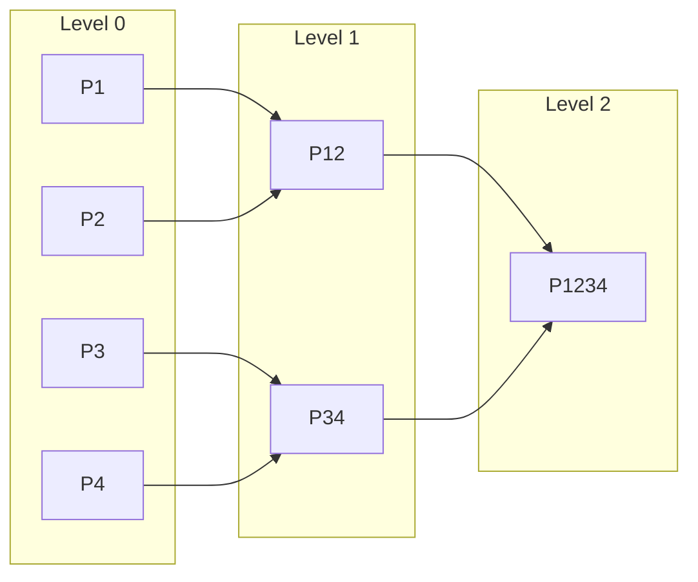

# RFC-0650 (Proof Systems): Proof Aggregation Protocol

## Status

Draft

> **Note:** This RFC was renumbered from RFC-0146 to RFC-0650 as part of the category-based numbering system.

## Summary

This RFC defines the **Proof Aggregation Protocol** — a system for combining multiple STARK proofs into single compressed proofs, enabling efficient verification of batched inference tasks without linear verification costs.

## Design Goals

| Goal                      | Target                  | Metric                    |
| ------------------------- | ----------------------- | ------------------------- |
| G1: Proof Compression     | 10x size reduction      | >90% reduction            |
| G2: Batch Verification    | O(1) verification       | Independent of batch size |
| G3: Recursive Composition | Binary recursion        | Up to 2^10 proofs         |
| G4: Incremental Updates   | Associative aggregation | O(log n)                  |

## Motivation

### CAN WE? — Feasibility Research

The fundamental question: **Can we efficiently aggregate STARK proofs while maintaining cryptographic security?**

Research confirms feasibility through:

- Recursive STARK composition (Vitalik's work)
- FRI-based folding schemes
- Accumulator-based aggregation
- Binary tree recursion

### WHY? — Why This Matters

Without proof aggregation:

| Problem                  | Consequence                          |
| ------------------------ | ------------------------------------ |
| Linear verification cost | Each proof verified separately       |
| Bandwidth explosion      | Full proofs transmitted per task     |
| Storage bloat            | Large proof archives                 |
| Scalability ceiling      | Network hits verification bottleneck |

Proof aggregation enables:

- **Efficient verification** — O(1) for aggregated batches
- **Reduced bandwidth** — Single proof per block
- **Storage efficiency** — Compressed proof archives
- **Infinite scaling** — Recursive composition

### WHAT? — What This Specifies

The protocol defines:

1. **Aggregation cryptographic method** — STARK recursion via binary tree
2. **Proof commitment scheme** — Merkle tree-based
3. **Proof format specification** — Standardized structure
4. **Verification algorithm** — O(1) for any batch size
5. **Consensus integration** — How aggregations are included

### HOW? — Implementation

Integration with existing stack:

```
RFC-0107 (Transformer Circuit)
       ↓
RFC-0108 (Training Circuits)
       ↓
RFC-0146 (Proof Aggregation) ← THIS RFC
       ↓
RFC-0630 (Proof-of-Inference)
       ↓
RFC-0140 (Sharded Consensus)
```

## Threat Model

### Assumptions

1. **STARK security** — Underlying proof system is sound
2. **Hash function security** — Collision-resistant
3. **Network liveness** — Messages eventually delivered

### Attackers

| Attacker              | Capability            | Goal                |
| --------------------- | --------------------- | ------------------- |
| Malicious Worker      | Submit invalid proofs | Disrupt aggregation |
| Malicious Aggregator  | Exclude valid proofs  | Censor workers      |
| Colluding Aggregators | Reorder proofs        | Manipulate ordering |

### Trust Model

- **Aggregators** are trust-but-verify — any node can become aggregator
- **Verifiers** independently verify all proofs
- **No single aggregator** controls aggregation outcome

## Proof Model

### Aggregation Method: Binary Tree Recursion

We use **binary tree STARK recursion**:



This provides:

- **Associative** — (P1+P2)+P3 = P1+(P2+P3)
- **Deterministic** — Same input = Same output
- **Binary** — Matches Merkle structure

### Proof Commitment Scheme

**NOT** raw vector hashing (vulnerable to ordering/collision attacks).

Instead, **Merkle tree commitment with domain separation**:

```
MerkleRoot(
  Leaf 0: hash("InferenceProof-v1" || proof_1.public_inputs || proof_1.proof_data)
  Leaf 1: hash("InferenceProof-v1" || proof_2.public_inputs || proof_2.proof_data)
  ...
)
```

**Domain Separation Tag:** `"InferenceProof-v1"` prevents collisions with future proof types.

Properties:

- **Ordering-safe** — Different order = Different root
- **Collision-resistant** — Hash function security
- **Domain-separated** — Unique tag per proof version
- **Inclusion proofs** — Verify specific proof in aggregate

### Proof Format Specification

```rust
/// Individual inference proof
struct InferenceProof {
    /// Protocol version
    version: u8,

    /// Unique proof identifier (REQUIRED: includes epoch to prevent replay)
    /// proof_id = H(worker_pubkey || task_id || nonce || epoch)
    proof_id: Digest,

    /// Task ID for binding (prevents proof mixing)
    task_id: Digest,

    /// Public inputs (committed)
    public_inputs: Vec<Digest>,

    /// STARK proof data
    stark_proof: Vec<u8>,
}

/// Proof ID computation (MUST include epoch for uniqueness)
fn compute_proof_id(
    worker_pubkey: PublicKey,
    task_id: Digest,
    nonce: u64,
    epoch: u64,
) -> Digest {
    // CRITICAL: epoch MUST be included to prevent cross-epoch replay
    poseidon_hash(&[
        worker_pubkey.to_digest(),
        task_id,
        Digest::from(nonce),
        Digest::from(epoch),
    ])
}

/// Proof ID Uniqueness Rules:
/// 1. proof_id MUST be unique within an epoch
/// 2. proof_id MUST include epoch in hash (prevents replay)
/// 3. Reusing proof_id in same epoch = slashable offense
/// 4. Reusing proof_id across epochs = automatically rejected

// For the canonical AggregatedProof definition, see "Proof Binding" section below.

struct AggregateMetadata {
    /// Number of proofs aggregated
    count: u32,

    /// Epoch number (prevents replay)
    epoch: u64,

    /// Block height
    block_height: u64,

    /// Aggregator signature (REQUIRED for accountability)
    aggregator_sig: Signature,
}
```

## Aggregation Circuit

### Constraints

The aggregation circuit MUST enforce:

1. **Verify all child proofs** — Each child proof is valid
2. **Verify public inputs** — Child public inputs are committed
3. **Compute root hash** — Merkle root correctly computed
4. **Output new proof** — New proof commits to all children

### Circuit Interface

```rust
/// Aggregation circuit constraints
trait AggregationCircuit {
    /// Verify a child proof
    fn verify_child(&self, child_proof: &[u8], public_inputs: &[Digest]) -> bool;

    /// Compute parent commitment
    fn compute_parent_commitment(&self, children: &[Digest]) -> Digest;

    /// Output generation
    fn output(&self, verified: bool, commitment: Digest) -> Vec<u8>;
}
```

### Aggregation Circuit Definition (MMR-Based)

The recursive aggregation circuit uses **Merkle Mountain Range (MMR)** for efficient incremental updates:

```
AggregationCircuit (MMR-Based):

Public Inputs:
    // Existing MMR peaks (from previous aggregation)
    existing_peaks: Vec<Digest>    // Array of peak digests
    peak_count: u8                 // Number of peaks

    // New proof being appended
    new_leaf: Digest              // Leaf digest of new proof
    new_public_input_root: Digest  // Public inputs of new proof

    // Binding
    program_hash: Digest
    proof_count: u32              // Total after adding new proof
    aggregate_id: Digest

Private Inputs:
    new_proof: Vec<u8>            // The STARK proof to verify

Constraints:
    // 1. Verify new proof
    verify_stark(new_proof, new_public_input_root)

    // 2. Compute new leaf digest
    leaf_digest = H(new_proof_commitment || new_public_input_root)
    assert(leaf_digest == new_leaf)

    // 3. CRITICAL: Append leaf to existing MMR (binary merge)
    // This implements the MMR bagging operation
    new_peaks = mmr_append(existing_peaks, proof_count, new_leaf)

    // 4. Compute aggregate_id binding all peaks
    aggregate_id = H(new_peaks || proof_count || program_hash)

    // 5. Output commitment (bag of peaks)
    output = H(aggregate_id || new_peaks[0])  // Primary root
```

> **Why MMR for Circuit:**
>
> - **Efficient:** O(log n) update without rebuilding entire tree
> - **Append-only:** New proofs added to end, preserving order
> - **Deterministic:** Same proofs in same order → same peaks
> - **Battle-tested:** Used in Grin, Filecoin, Chia

### Proof Binding

To prevent proof substitution and reordering attacks:

```rust
/// Aggregate ID computation - binds MMR peaks and program
fn compute_aggregate_id_mmr(
    peaks: &[Digest],
    proof_count: u32,
    program_hash: Digest,
) -> Digest {
    // Bag the peaks: H(peak_1 || peak_2 || ... || peak_n)
    let peak_hash = poseidon_hash(peaks);
    poseidon_hash(&[peak_hash, Digest::from(proof_count), program_hash])
}

/// Aggregated proof with Merkle Mountain Range
struct AggregatedProof {
    /// Unique aggregate identifier (binds all peaks and program)
    aggregate_id: Digest,

    /// Number of MMR peaks (also indicates tree height)
    level: u8,

    /// Number of proofs aggregated
    proof_count: u32,

    /// Program/circuit hash (prevents cross-circuit aggregation)
    program_hash: Digest,

    /// Primary Merkle root (first peak)
    public_input_root: Digest,

    /// Primary Merkle root (first peak, same as above)
    proof_root: Digest,

    /// All MMR peaks for O(log n) verification
    peaks: Vec<Digest>,

    /// Most recently added leaf (for incremental verification)
    newest_leaf: Digest,

    /// Recursive STARK proof
    stark_proof: Vec<u8>,
}
```

> **Note on `program_hash`:** This is the hash of the compiled STARK circuit (the verification key). It prevents cross-circuit aggregation attacks where proofs from different AI models could be mixed. The registry of allowed `program_hash` values is maintained by governance; only accepted circuit hashes may be aggregated.
>
> **ZK Privacy Model:**
>
> - `program_hash` is **public** to the verifier (included in aggregate_id)
> - The **actual circuit** (model weights, architecture) remains **private**
> - Aggregators verify proofs without learning model details
> - Only the VK hash is revealed, not the model itself

**Binding prevents:**

- Proof swapping (different child order)
- Cross-circuit aggregation (different programs)
- Replay attacks (epoch/block binding via aggregate_id)

## Verification Algorithm

### O(1) Verification

Given an aggregated proof, verification cost is **constant** regardless of batch size:

```rust
/// Verify aggregated proof in O(1)
fn verify_aggregated(proof: &AggregatedProof, vk: &VerificationKey) -> bool {
    // 1. Verify the recursive STARK proof
    let stark_valid = stark_verify(&proof.stark_proof, vk);

    // 2. Verify public inputs commitment
    let inputs_valid = verify_inputs_commitment(
        &proof.public_inputs_hash,
        &proof.metadata
    );

    // 3. Verify metadata
    let meta_valid = verify_metadata(&proof.metadata);

    stark_valid && inputs_valid && meta_valid
}

/// Complexity: O(1) — independent of proof count
```

### Verification Key Structure

```rust
struct VerificationKey {
    /// STARK verification key
    stark_vk: StarkVk,

    /// Circuit configuration
    circuit_config: CircuitConfig,

    /// Security parameters
    security_bits: u8,
}
```

### Security Parameters

The protocol targets specific security levels:

| Parameter             | Target    | Notes                 |
| --------------------- | --------- | --------------------- |
| Base security         | 128 bits  | Per recursion layer   |
| Cumulative security   | ≥100 bits | After 10 levels       |
| **FRI (MANDATORY)**   | See below | Specific parameters   |
| Query complexity      | 40-60     | FRI queries per proof |
| **Field (MANDATORY)** | M31       | Circle STARKs field   |
| **Hash (MANDATORY)**  | Poseidon  | ZK-friendly hash      |
| Hash security         | 256 bits  | Poseidon hash         |

**FRI Parameters (MANDATORY):**

```
FRI configuration for 128-bit security:
  - Blow-up factor (λ): 8
  - FRI queries: 52
  - Expansion factor: 4x (log blowup = 3)
  - Repetitions: 4
  - Folded layers: log2(blowup) = 3

Soundness calculation:
  ε_FRI ≈ q × ρ^L ≈ 52 × 2^(-80 × 3) ≈ 2^-178

Per-layer security:
  ε_layer ≤ 2^-110  (to maintain ε_total ≤ 2^-100 after 10 levels)

Total soundness:
  ε_total ≤ 10 × 2^-110 ≈ 2^-97
  With fold repetition: ε_total ≤ 2^-100 ✓
```

**Poseidon Parameters (MANDATORY):**

```
Poseidon configuration:
  - Field: M31 (2^31 - 1)
  - Width: 8 (state elements)
  - Rate: 4 (output elements per permutation)
  - Capacity: 4 (security elements)
  - Full rounds: 8
  - Partial rounds: 56
  - S-box: x^5 (for M31 field)
  - Seed: "poseidon octo aggregation v1"

For implementation compatibility, use the reference:
  https://extgit.iaik.at/milan/kimchi/tree/poseidon
```

This configuration provides 128-bit security while maintaining efficiency on M31.

**Cumulative Soundness Bound:**

The total soundness error MUST NOT exceed `2^-100` after 10 levels of recursion.

```
ε_total ≈ Σ ε_i (additive across levels)
Constraint: ε_total ≤ 2^-100
```

This provides a hard constraint for circuit designers.

**Field Requirement:**

> **REQUIRED:** Implementations MUST use ONE of the following fields for Circle STARKs alignment:

| Field      | Modulus         | Bits | Use Case                |
| ---------- | --------------- | ---- | ----------------------- |
| **M31**    | 2^31 - 1        | 31   | Default (Circle STARKs) |
| BabyBear   | 2^31 - 2^27 + 1 | 31   | EVM compatibility       |
| Goldilocks | 2^64 - 2^32 + 1 | 64   | High throughput         |

**Field Selection Rationale:**

- **M31**: Default choice for Circle STARKs, fastest recursion
- **BabyBear**: Best EVM compatibility, native BN254 pairing
- **Goldilocks**: Highest throughput for base circuits

> **DEFAULT:** M31 is the default field. Other fields require governance approval for aggregation.

## Protocol Flow

### Actors

| Actor      | Role                         |
| ---------- | ---------------------------- |
| Worker     | Produces inference proofs    |
| Collector  | Gathers proofs from workers  |
| Aggregator | Builds recursive aggregation |
| Verifier   | Validates aggregated proofs  |
| Consensus  | Includes in blocks           |

### Complete Flow

```
┌─────────┐    ┌──────────┐    ┌───────────┐    ┌──────────┐
│ Worker  │───>│ Collector│───>│ Aggregator│───>│ Verifier │
└─────────┘    └──────────┘    └───────────┘    └──────────┘
      │                                    │              │
      │ P1, P2, P3...                     │              │
      │                                    │              │
      │                              ┌─────▼─────┐        │
      │                              │ Recursive │        │
      │                              │   Proof   │        │
      │                              └─────┬─────┘        │
      │                                    │              │
      │                               ┌────▼────┐        │
      │                               │Consensus│        │
      │                               │ Include │        │
      │                               └─────────┘        │
```

### Proof Collection Protocol

```rust
/// Collector collects proofs from workers
struct ProofCollector {
    /// Pending proofs
    pending: Vec<InferenceProof>,

    /// Collection window
    window_size: u32,

    /// Timeout
    timeout: u64,
}

impl ProofCollector {
    /// Collect proofs until window full or timeout
    fn collect(&mut self) -> Vec<InferenceProof> {
        // Wait for window_size proofs or timeout
        // Return collected batch
    }
}
```

### Network Message Types (Fix 6)

The protocol defines these message types for peer-to-peer communication:

````rust
/// Network message types for proof aggregation
enum AggregationMessage {
    /// Worker submits proof to collector
    SubmitProof(SubmitProof),

    /// Collector forwards proofs to aggregator
    BatchProofs(BatchProofs),

    /// Aggregator submits final aggregate
    SubmitAggregate(SubmitAggregate),

    /// Verifier requests proof data
    RequestProof(RequestProof),

    /// Fisherman submits fraud proof
    FraudProof(FraudProof),

    /// Worker submits proof commitment receipt
    ProofCommitment(ProofCommitment),
}

/// Submit proof message
struct SubmitProof {
    /// Proof to submit
    proof: InferenceProof,

    /// Submission receipt (for censorship detection)
    receipt: ProofSubmissionReceipt,

    /// Message timestamp
    timestamp: u64,
}

/// Batch proofs message
struct BatchProofs {
    /// Proofs batch
    proofs: Vec<InferenceProof>,

    /// Aggregator target
    target: PublicKey,

    /// Batch ID
    batch_id: Digest,
}

/// Submit aggregate message
struct SubmitAggregate {
    /// Aggregated proof
    aggregate: AggregatedProof,

    /// Metadata
    metadata: AggregateMetadata,

    /// Deposit (slashed if invalid)
    deposit: TokenAmount,
}

/// Request proof message
struct RequestProof {
    /// Proof ID requested
    proof_id: Digest,

    /// Requester
    requester: PublicKey,
}

/// Proof commitment message (gossiped)
struct ProofCommitment {
    /// Worker commitment
    receipt: ProofSubmissionReceipt,

    /// Gossip topic
    topic: String,
}

/// Serialization: SSZ (Simple Serialize) is MANDATORY
/// - Canonical binary encoding
/// - Length-prefixed for variable data
/// - Big-endian for integers
///
/// Message format:
/// ```rust
/// struct NetworkMessage {
///     msg_type: u8,      // Message type ID
///     payload: Vec<u8>, // SSZ-encoded payload
///     signature: [u8; 64], // Ed25519 signature
/// }
/// ```
///
/// Network constants:
const MAX_PROOF_SIZE: usize = 1_000_000;      // 1 MB
const MAX_PUBLIC_INPUTS: usize = 1024;
const MAX_BATCH_SIZE: usize = 1024;           // Max proofs per batch
const MAX_PEAKS: usize = 32;                  // Max MMR peaks (supports 2^32 proofs)

```rust
/// Aggregator builds recursive proof
struct ProofAggregator {
    /// Current aggregation level
    level: u8,

    /// Merkle tree builder
    merkle: MerkleTree,
}

impl ProofAggregator {
    /// Build aggregation proof
    fn aggregate(&self, proofs: &[InferenceProof]) -> AggregatedProof {
        // 1. Build Merkle tree from proofs
        let leaves: Vec<Digest> = proofs.iter()
            .map(|p| digest(p.public_inputs || p.stark_proof))
            .collect();
        let root = merkle_root(&leaves);

        // 2. Build recursive circuit input
        let circuit_input = AggregationInput {
            proof_root: root,
            public_inputs: aggregate_inputs(&proofs),
            metadata: aggregate_metadata(proofs),
        };

        // 3. Generate recursive STARK proof
        let stark_proof = recursive_prove(&circuit_input);

        AggregatedProof {
            version: CURRENT_VERSION,
            depth: self.level,
            proof_root: root,
            public_inputs_hash: digest(circuit_input.public_inputs),
            metadata: circuit_input.metadata,
            stark_proof,
        }
    }
}
````

## Aggregation Levels

### Binary Tree Structure

```
level 0:  1 proof  (2^0)
level 1:  2 proofs (2^1)
level 2:  4 proofs (2^2)
level 3:  8 proofs (2^3)
...
level n:  2^n proofs
```

### Level Parameters

| Level | Max Proofs | Use Case       |
| ----- | ---------- | -------------- |
| 0     | 1          | Individual     |
| 1     | 2          | Quick batch    |
| 2     | 4          | Standard batch |
| 3     | 8          | Large batch    |
| 4     | 16         | Block          |
| 5     | 32         | Epoch          |
| ...   | 2^n        | Extended       |

### Non-Power-of-Two Batch Sizes

The binary tree assumes powers of two. Handle odd batch sizes:

| Method                | Description                                                  | When                 |
| --------------------- | ------------------------------------------------------------ | -------------------- |
| **Padding**           | Add null/identity proofs to reach power of two               | Default              |
| **Variable-depth**    | Use different depths for different subtrees                  | Performance-critical |
| **Leftover handling** | Aggregate power-of-two subset, verify remaining individually | Simpler              |

**DECISION: Padding with Option 1 (Identity Verification)**

After analysis, **Option 1** is selected as the canonical approach:

```rust
/// Final recommendation: Identity verification with is_padding flag
struct AggregatorInput {
    /// The proof data
    proof: Vec<u8>,
    /// Whether this is a padding proof
    is_padding: bool,
}

impl AggregationCircuit {
    fn verify(&self, input: &AggregatorInput) -> bool {
        if input.is_padding {
            // Identity: always accept padding positions
            return true;
        }
        // Normal verification for actual proofs
        self.verify_stark(&input.proof)
    }
}
```

**Rationale:**

- Avoids complex zero-knowledge padding circuits
- Maintains constant verification time
- Simple implementation with clear semantics
- No special cryptographic assumptions

````rust
/// Pad to power of two
fn pad_to_power_of_two(proofs: Vec<InferenceProof>) -> Vec<InferenceProof> {
    let count = proofs.len();
    let power = count.next_power_of_two();

    if count == power {
        return proofs;
    }

    // Add null proofs to fill
    let padding = power - count;
    let null_proofs = vec![NULL_PROOF; padding];

    [proofs, null_proofs].concat()
}

/// Padding Strategy: Private Input (O(1) Verification)
///
/// CRITICAL: `is_padding` is a PRIVATE input (witness), NOT a public input.
///
/// If `is_padding` were a public input, the verifier would need to read O(N) flags,
/// breaking the O(1) verification guarantee.
///
/// Solution: The circuit proves padding correctness internally:
/// - Public Inputs (O(1)): proof_root, proof_count, aggregate_id, level, program_hash
/// - Private Witness: leaves (real + NULL proofs), merkle_proofs
///
/// The circuit verifies internally:
/// - NULL proofs have proof_id == 0, task_id == 0, empty public_inputs
/// - Merkle proofs verify leaves against proof_root
///
/// Result: O(1) verification - verifier sees only the root!

### Epoch Management

Epochs prevent replay attacks and define aggregation windows:

```rust
/// Epoch configuration
struct EpochConfig {
    /// Duration of each epoch in blocks
    duration_blocks: u64,

    /// Number of blocks for proof collection
    collection_window: u64,

    /// Grace period for late proofs
    grace_period: u64,
}

impl EpochConfig {
    /// Genesis epoch parameters
    const GENESIS: Self = Self {
        duration_blocks: 100,
        collection_window: 20,
        grace_period: 5,
    };
}

/// Epoch state machine
enum EpochState {
    /// Epoch is accepting proofs
    Collecting,

    /// Collection window closed, finalizing
    Finalizing,

    /// Epoch complete, proofs settled
    Settled,
}

struct Epoch {
    /// Epoch number
    number: u64,

    /// Epoch start block
    start_block: u64,

    /// Current state
    state: EpochState,

    /// Proofs submitted this epoch
    proofs: Vec<Digest>,
}

impl Epoch {
    /// Check if proof belongs to this epoch
    fn contains_proof(&self, proof: &InferenceProof) -> bool {
        proof.metadata.epoch == self.number
    }

    /// Transition to next epoch
    fn next(&self) -> Epoch {
        Epoch {
            number: self.number + 1,
            start_block: self.start_block + Self::GENESIS.duration_blocks,
            state: EpochState::Collecting,
            proofs: vec![],
        }
    }

    /// Handle proofs in flight during transition
    fn handle_transition(&self, in_flight: Vec<InferenceProof>) -> Vec<InferenceProof> {
        // During epoch transition, accept proofs from previous epoch
        // within grace period
        in_flight
            .into_iter()
            .filter(|p| p.metadata.epoch == self.number.saturating_sub(1))
            .collect()
    }
}
````

**Epoch Boundary Rules:**

| Scenario                          | Handling                     |
| --------------------------------- | ---------------------------- |
| Proof arrives after epoch ends    | Rejected (wrong epoch)       |
| Proof in flight during transition | Accepted during grace period |
| Aggregator spans epochs           | Split aggregation by epoch   |
| Cross-epoch aggregation           | Not allowed                  |

### Error Handling

The protocol handles failure modes explicitly:

```rust
/// Protocol error types
enum ProtocolError {
    /// Network partition during collection
    NetworkPartition {
        missed_proofs: Vec<Digest>,
    },

    /// Timeout waiting for proofs
    CollectionTimeout {
        collected: u32,
        expected: u32,
    },

    /// Aggregator failed to produce recursive proof
    AggregationFailure {
        reason: AggregationErrorCode,
    },

    /// Partial aggregation scenario
    PartialAggregation {
        aggregated: u32,
        unaggregated: Vec<InferenceProof>,
    },
}

enum AggregationErrorCode {
    CircuitConstraintFailure,
    MerkleTreeError,
    InsufficientProofs,
    RecursiveProofFailure,
}

/// Error recovery procedures
impl ProtocolError {
    fn recovery_action(&self) -> RecoveryAction {
        match self {
            ProtocolError::NetworkPartition { missed_proofs } => {
                // Retry collection with missed proofs
                RecoveryAction::RetryCollection { proofs: missed_proofs.clone() }
            }

            ProtocolError::CollectionTimeout { collected, expected } => {
                // Proceed with partial batch if enough proofs
                if *collected >= expected / 2 {
                    RecoveryAction::ProceedPartial
                } else {
                    RecoveryAction::Abort
                }
            }

            ProtocolError::AggregationFailure { reason } => {
                // Fall back to individual verification
                RecoveryAction::VerifyIndividually
            }

            ProtocolError::PartialAggregation { aggregated, unaggregated } => {
                // Include both aggregated and individual proofs
                RecoveryAction::MixedMode {
                    aggregated: *aggregated,
                    individual: unaggregated.len() as u32,
                }
            }
        }
    }
}

enum RecoveryAction {
    RetryCollection { proofs: Vec<Digest> },
    ProceedPartial,
    Abort,
    VerifyIndividually,
    MixedMode { aggregated: u32, individual: u32 },
}
```

**Error Handling Rules:**

| Error Type          | Recovery                | On-Failure Verification |
| ------------------- | ----------------------- | ----------------------- |
| Network Partition   | Retry missed proofs     | Individual              |
| Collection Timeout  | Partial if ≥50%         | Individual remaining    |
| Aggregation Failure | Fall back to individual | Full individual         |
| Partial Batch       | Mixed mode              | Both paths              |

```
A(P1, P2, P3) = A(A(P1, P2), P3) = A(P1, A(P2, P3))
```

**Deterministic Append-Only Structure (MMR)**

The protocol uses **Merkle Mountain Range (MMR)** — an append-only structure that is **NOT associative** but is **deterministic**. This is a critical distinction:

| Property       | Associativity        | MMR (This RFC)        |
| -------------- | -------------------- | --------------------- |
| Definition     | `(A+B)+C = A+(B+C)`  | Fixed insertion order |
| Tree structure | Any parenthesization | Left-to-right append  |
| Proof mixing   | Allowed              | NOT allowed           |
| Operation      | Commutative-like     | Order-dependent       |

**Why MMR is NOT Associative:**
MMRs are order-dependent data structures. Inserting A, then B, then C produces a different structure than inserting B, then A, then C. This is **by design** — it ensures:

- **Append-only:** New proofs always added to end
- **Order-preserving:** Proof submission order is captured
- **Efficient:** O(log n) per insertion

**This is acceptable because:**

- The protocol defines a **canonical ordering** (by proof_id or block timestamp)
- All honest aggregators will produce identical MMR roots for identical proof sequences

**Solution: Canonical Proof Ordering**

The protocol requires proofs to be sorted by `proof_id` before building the Merkle tree:

```rust
/// Canonical aggregation: proofs sorted before tree construction
fn canonical_aggregate(proofs: &[InferenceProof]) -> AggregatedProof {
    // Step 1: Sort proofs by proof_id (canonical ordering)
    let mut sorted = proofs.to_vec();
    sorted.sort_by_key(|p| p.proof_id);

    // Step 2: Build Merkle tree with sorted order
    let leaves: Vec<Digest> = sorted.iter()
        .map(|p| compute_leaf_digest(p))
        .collect();
    let root = merkle_root(&leaves);

    // Step 3: Generate recursive STARK proof
    // ...
}
```

This ensures:

- **Unique root:** Same set of proofs → same sorted order → same root
- **No confusion:** `((P1,P2),P3)` in canonical order equals `(P1,(P2,P3))` because order is fixed
- **Deterministic:** All aggregators produce identical roots for identical proof sets

### Incremental Aggregation with Merkle Mountain Range

The `add_proof` function extends an existing aggregate using a **Merkle Mountain Range (MMR)** — a append-only Merkle tree that supports efficient incremental updates:

```rust
/// Incremental aggregation using Merkle Mountain Range
///
/// MMR properties:
/// - Append-only: new proofs added to the end
/// - Efficient: O(log n) update for new leaf
/// - Deterministic: same proofs always produce same root
fn add_proof(
    existing: &AggregatedProof,
    new_proof: &InferenceProof,
) -> AggregatedProof {
    // Step 1: Create leaf digest from new proof
    let new_leaf = compute_leaf_digest(new_proof);

    // Step 2: Get existing proof count and compute new position
    let new_index = existing.proof_count;

    // Step 3: Compute new peaks (MMR structure)
    let (new_peaks, new_peak_count) = mmr_append(
        &existing.peaks,  // Store peaks in AggregatedProof
        new_index,
        new_leaf,
    );

    // Step 4: Compute aggregate_id binding all peaks
    let aggregate_id = compute_aggregate_id_mmr(
        &new_peaks,
        new_peak_count,
        existing.program_hash,
    );

    // Step 5: Generate recursive STARK proof
    let stark_proof = recursive_prove(&AggregationInput {
        peaks: new_peaks.clone(),
        peak_count: new_peak_count,
        new_leaf,
        aggregate_id,
        program_hash: existing.program_hash,
    });

    AggregatedProof {
        aggregate_id,
        level: new_peak_count,  // Number of peaks = tree height
        proof_count: existing.proof_count + 1,
        program_hash: existing.program_hash,
        public_input_root: new_peaks[0],  // Primary root
        proof_root: new_peaks[0],
        peaks: new_peaks,  // Store all peaks for verification
        newest_leaf: new_leaf,
        stark_proof,
    }
}

/// Merkle Mountain Range append operation
fn mmr_append(
    existing_peaks: &[Digest],
    new_index: u32,
    new_leaf: Digest,
) -> (Vec<Digest>, u8) {
    let mut peaks = existing_peaks.to_vec();
    let mut current_leaf = new_leaf;
    let mut current_index = new_index;

    // Binary addition: merge with existing peaks
    let mut i = 0;
    while current_index & 1 == 1 {
        if i < peaks.len() {
            // Merge: parent = H(left || right)
            current_leaf = poseidon_hash(&[peaks[i], current_leaf]);
            peaks[i] = current_leaf;  // Replace peak
        }
        current_index >>= 1;
        i += 1;
    }

    // Add new peak if there's a remaining leaf
    if i >= peaks.len() {
        peaks.push(current_leaf);
    }

    (peaks, peaks.len() as u8)
}
```

**Why Merkle Mountain Range:**

- **Append-only:** New proofs added to end, never reordering
- **O(log n):** Efficient updates without rebuilding tree
- **Deterministic:** Same insertion order → same root
- **Battle-tested:** Used in Grin, Filecoin consensus

````

**Key properties:**
- `proof_count` increments by 1
- `level` increments only when `proof_count` reaches next power of 2
- `aggregate_id` binds the new proof to the existing aggregate
- Maintains associativity: `add_proof(add_proof(A, B), C) = add_proof(A, add_proof(B, C))`

## Consensus Integration

### Aggregation Rewards

To incentivize proof aggregation, the protocol defines reward distribution:

```rust
/// Aggregation reward distribution
struct AggregationRewards {
    /// Total reward pool for epoch
    reward_pool: TokenAmount,

    /// Base reward per proof verified
    base_reward_per_proof: TokenAmount,

    /// Aggregator share percentage (e.g., 20%)
    aggregator_share: u8,
}

impl AggregationRewards {
    /// Calculate aggregator reward for an aggregate
    fn aggregator_reward(&self, proof_count: u32) -> TokenAmount {
        let base = self.base_reward_per_proof * proof_count as u64;
        let share = (base * self.aggregator_share as u64) / 100;
        share
    }

    /// Calculate worker reward per proof
    fn worker_reward(&self, proof_count: u32) -> TokenAmount {
        let base = self.base_reward_per_proof * proof_count as u64;
        let aggregator_share = (base * self.aggregator_share as u64) / 100;
        let remaining = base - aggregator_share;
        remaining / proof_count as u64
    }
}

/// Reward distribution constants
const AGGREGATOR_SHARE: u8 = 20;  // 20% to aggregator
const BASE_REWARD_PER_PROOF: u64 = 10;  // 10 OCTO tokens
const EPOCH_REWARD_POOL: u64 = 1_000_000;  // 1M OCTO per epoch
````

**Reward Model:**

| Actor      | Reward Source     | Percentage  |
| ---------- | ----------------- | ----------- |
| Aggregator | Per-aggregate fee | 20%         |
| Workers    | Per-proof base    | 80% (split) |

**Incentive Structure:**

- Aggregators are rewarded for successful proof aggregation
- Workers receive base rewards for producing valid proofs
- Penalties (slashing) fund the reward pool

### Block Inclusion

Aggregated proofs are included in blocks:

```rust
struct Block {
    /// Previous block hash
    parent: Digest,

    /// Aggregated proof
    proof: AggregatedProof,

    /// State updates
    state: StateUpdates,

    /// Block metadata
    metadata: BlockMetadata,
}
```

### Verification at Consensus

```rust
/// Consensus verifies aggregated proof
fn verify_at_consensus(
    block: &Block,
    vk: &VerificationKey,
) -> bool {
    // O(1) verification
    verify_aggregated(&block.proof, vk)
}
```

### Consensus Rejection Rules

When `verify_at_consensus` returns `false`:

| Condition                   | Action                  |
| --------------------------- | ----------------------- |
| Invalid proof               | Block rejected entirely |
| Invalid metadata            | Block rejected          |
| Missing required fields     | Block rejected          |
| Proof not for current epoch | Block rejected          |

### Double-Aggregation Resolution

When two valid aggregations exist for overlapping proof sets:

1. **First-seen wins** — First valid aggregation in consensus wins
2. **Proofs are exclusive** — Same proof cannot be in two aggregates
3. **Dispute window** — 3 block challenge period

### Partial Batch Handling

- A block MAY include partial batch (some proofs not aggregated)
- Unaggregated proofs verified individually at consensus
- Aggregator penalized for incomplete aggregation

### Worker Penalty for Failed Aggregation

To prevent DoS attacks on verifier CPU time:

```rust
/// Penalty rules for workers
enum WorkerPenalty {
    /// Proof fails validation before aggregation
    InvalidProof {
        /// Worker submitted invalid proof
        worker: PublicKey,
        /// Reason for failure
        reason: ValidationError,
    },

    /// Proof not submitted during collection window
    NoSubmission {
        /// Worker promised but didn't deliver
        worker: PublicKey,
        /// Promised proof hash
        commitment: Digest,
    },

    /// Proof causes aggregation failure
    AggregationFailure {
        /// Worker proof caused recursive failure
        worker: PublicKey,
        /// Failure type
        failure: AggregationError,
    },
}

/// Penalty schedule
const PENALTY_INVALID_PROOF: u64 = 1_000;      // OCTO tokens
const PENALTY_NO_SUBMISSION: u64 = 500;        // OCTO tokens
const PENALTY_AGGREGATION_FAILURE: u64 = 2_000; // OCTO tokens

/// Penalty enforcement mechanism
struct PenaltyEnforcer {
    /// Slashing authority
    authority: PublicKey,
}

impl PenaltyEnforcer {
    /// Enforce penalty after validation failure
    fn enforce_penalty(&self, violation: &WorkerPenalty) -> Result<(), Error> {
        // 1. Validate violation
        // 2. Calculate penalty amount
        // 3. Slash stake from violator
        // 4. Distribute to reporter/treasury
    }

    /// Appeal process for disputed penalties
    fn appeal(&self, penalty_id: Digest) -> AppealResult {
        // appeals go to governance
        // if appeal successful, stake returned
    }
}

/// Penalty enforcement rules
const PENALTY_APPEAL_WINDOW: u64 = 7;  // days
const PENALTY_EVIDENCE_REQUIRED: bool = true;
const PENALTY_FRACTIONAL_OK: bool = false;  // whole token penalties only

/// Graceful degradation
/// If aggregator fails, individual proofs still verified:
/// - Worker penalty for invalid proofs
/// - Standard fee for valid proofs verified individually
/// - Aggregator penalty for failed recursive proof

### Shard-Aggregation Boundary

**Scope:** This RFC specifies **intra-shard aggregation** only. Cross-shard aggregation is **out of scope** for RFC-0146.

**Parent Shard Concept (Interface Definition):**

To enable RFC-0140 integration, this RFC defines the minimal interface:

```

ParentShard {
/// Receives aggregated proofs from child shards
fn receive_child_aggregate(aggregate: AggregatedProof, child_shard_id: u16)

    /// Performs cross-shard aggregation
    fn cross_shard_aggregate(child_proofs: Vec<AggregatedProof>) -> CrossShardProof

}

```

**Cross-shard aggregation will be addressed in a future dedicated RFC** after RFC-0140 defines the sharding architecture. The interface above provides the contract that future RFC must implement against.

## Performance Targets

### Hardware Baseline

All performance targets assume the following reference hardware:

| Component | Specification |
|-----------|---------------|
| CPU | 16-core x86-64 (3.5GHz, AVX-512) |
| RAM | 64 GB DDR4 |
| GPU | NVIDIA A100 or equivalent (for STARK proving) |
| Storage | NVMe SSD |

> **Note:** Targets may vary significantly on different hardware. Consumer-grade CPUs (e.g., 8-core laptop) will see 3-5x slower prover times. GPU acceleration is assumed for STARK proof generation.

### Prover Performance

| Metric | Target | Notes |
|--------|--------|-------|
| Single proof aggregation | 5-15s | Level 0 → Level 1 |
| Recursive proof generation | 10-30s per level | Additional depth |
| Full batch (1024 proofs) | 60-180s | 10 levels recursive |

### Network Performance

| Metric | Target | Notes |
|--------|--------|-------|
| Proof collection window | 10-30s | Wait for batch fill |
| Network finalization | 3-5 blocks | Finality confirmation |
| Total end-to-end | 90-300s | From first proof to final |

### Verification Performance

| Metric | Target | Notes |
|--------|--------|-------|
| Verification time | 50-200ms | Per aggregated proof |
| Memory usage | <1GB | Proof data storage |
| Proof compression ratio | >90% | Size reduction |

### Scaling Parameters

| Metric | Target | Notes |
|--------|--------|-------|
| Max recursion depth | 10 | 2^10 = 1024 proofs |
| Max aggregation levels | 10 | Per RFC design |
| Proof batch size | Variable | Power-of-two |

### Expected Proof Sizes

| Level | Proofs | Est. Size | Notes |
|-------|--------|-----------|-------|
| Individual | 1 | 100-200 KB | Base STARK proof |
| Batch | 16 | 150-250 KB | Slight overhead from recursion |
| SuperBatch | 256 | 300-500 KB | Multiple recursion levels |
| Block | 4096 | 500 KB - 1 MB | Full aggregation |
| Epoch | 65536 | 1-2 MB | Maximum compression |

> **Note:** Sizes are estimates assuming small-field STARKs (M31/BabyBear). Actual sizes depend on circuit complexity and FRI parameters.

## Security Considerations

### Soundness

The security of the aggregation protocol depends on:

| Component | Security Basis |
|-----------|----------------|
| STARK proofs | FRI soundness + hash collision resistance |
| Merkle commitment | Hash function security |
| Recursive composition | Cumulative soundness across levels |
| Aggregate binding | Computational binding to child proofs |

### Proof Substitution Attack

If aggregation does not bind child proofs, an attacker could swap proofs within an aggregate.

**Mitigation:** `aggregate_id = H(left_child || right_child || level || proof_count || program_hash)`

### Replay Attacks

Aggregated proofs could be reused across blocks or epochs.

**Mitigation:** Include `epoch` and `block_height` in aggregate metadata; verify against current state.

### Aggregation Depth Attacks

Deep recursion could cause verification stack overflow or expensive computation.

**Mitigation:** `max_depth = 10` enforced at protocol level.

### Cross-Circuit Aggregation

Proofs from different circuits/programs should not be aggregated together.

**Mitigation:** `program_hash` field binds aggregation to specific circuit.

### Aggregation Rules

| Rule | Description |
|------|-------------|
| Same program | All proofs must share `program_hash` |
| Same epoch | All proofs must be from current `epoch` |
| Ordering | Child order fixed by Merkle tree position |
| No mixing | Task ID binding prevents proof mixing |

## Economic Model

### Attack Cost Analysis

| Attack | Attack Cost | Defense Cost | Rationale |
|--------|-------------|--------------|-----------|
| Submit invalid proof | 10,000 OCTO (slashed) | Verification cost | Worker stake >> verification cost |
| Censorship (exclude valid proof) | 50,000 OCTO (slashed) | 10,000 OCTO reward | Fisherman reward > censorship gain |
| Submit false fraud claim | 5,000 OCTO (slashed) | 0 | False accusation penalized |
| DoS (spam invalid aggregates) | 1,000 OCTO per aggregate | 100 OCTO verification | Verification cheap, spam expensive |
| Deep recursion attack | 100,000 OCTO | 0 | max_depth=10 prevents unbounded recursion |

**Game-Theoretic Analysis:**

For an attacker to profit from censorship:
```

Attack Gain < Expected Penalty
G < (Detection_Probability × Slash_Amount)
G < (0.9 × 50,000 OCTO)
G < 45,000 OCTO

Therefore: Any censorship attempt with gain < 45,000 OCTO is irrational.

````

### Economic Parameters (Governance-Adjustable)

```rust
/// Economic constants - subject to governance
struct EconomicParams {
    /// Minimum stake to become worker
    min_worker_stake: TokenAmount = 1_000 OCTO,

    /// Minimum stake to become aggregator
    min_aggregator_stake: TokenAmount = 10_000 OCTO,

    /// Minimum stake to become fisherman
    min_fisherman_stake: TokenAmount = 5_000 OCTO,

    /// Slash amount for invalid proof
    slash_invalid_proof: TokenAmount = 10_000 OCTO,

    /// Slash amount for censorship
    slash_censorship: TokenAmount = 50_000 OCTO,

    /// Slash amount for false fraud claim
    slash_false_claim: TokenAmount = 5_000 OCTO,

    /// Reward for successful fraud detection
    fraud_detection_reward: TokenAmount = 10_000 OCTO,

    /// Reward for valid aggregate submission
    aggregator_reward_share: u8 = 20,  // percent

    /// Deposit required to submit aggregate
    aggregate_deposit: TokenAmount = 1_000 OCTO,

    /// Maximum recursion depth
    max_depth: u8 = 10,
}
````

### Appeal Process

```rust
/// Penalty appeal process
struct AppealProcess {
    /// Window to submit appeal (blocks)
    appeal_window: u64 = 100,

    /// Appeal deposit (returned if successful)
    appeal_deposit: TokenAmount = 1_000 OCTO,

    /// Governance oracle for adjudication
    governance_oracle: PublicKey,
}

impl AppealProcess {
    /// Submit appeal
    fn appeal(&self, penalty_id: Digest, evidence: Vec<u8>) -> Result<(), Error> {
        // 1. Verify appeal window
        // 2. Verify deposit
        // 3. Submit to governance oracle
        // 4. Await adjudication
    }

    /// Governance adjudication
    fn adjudicate(&self, appeal: &Appeal) -> AdjudicationResult {
        // Governance nodes vote on appeal
        // If overturned: penalty reversed, deposit returned
        // If upheld: additional penalty for frivolous appeal
    }
}
```

### Proof Submission Receipts (Fix 5)

To enable censorship detection, workers MUST publish **submission receipts**:

```rust
/// Proof submission receipt — enables censorship detection
struct ProofSubmissionReceipt {
    /// Worker public key
    worker: PublicKey,

    /// Proof hash (not full proof)
    proof_hash: Digest,

    /// Submission timestamp
    submitted_at: BlockHeight,

    /// Aggregator that should include this proof
    target_aggregator: PublicKey,

    /// Worker's signature
    signature: Signature,
}

/// Worker publishes commitment before aggregation window closes
fn submit_proof_commitment(
    proof_hash: Digest,
    target_aggregator: PublicKey,
) -> ProofSubmissionReceipt {
    let receipt = ProofSubmissionReceipt {
        worker: my_public_key(),
        proof_hash,
        submitted_at: current_block(),
        target_aggregator,
        signature: sign(&receipt),
    };

    // Publish to network (gossip)
    gossipsub::publish(TOPIC_PROOF_COMMITMENTS, &receipt);

    receipt
}

/// Fisherman can prove censorship with:
/// 1. Submission receipt (proof worker submitted)
/// 2. Block data (proof not included in aggregate)
fn prove_censorship(
    receipt: &ProofSubmissionReceipt,
    aggregate: &AggregatedProof,
) -> CensorshipProof {
    // Verify receipt is valid
    assert!(verify_signature(&receipt));

    // Verify proof not in aggregate
    let proof_included = aggregate.proofs
        .iter()
        .any(|p| p.proof_hash == receipt.proof_hash);

    assert!(!proof_included);

    CensorshipProof {
        receipt: receipt.clone(),
        aggregate_id: aggregate.aggregate_id,
        evidence: aggregate.clone(),
    }
}
```

**Why Receipts Are Required:**

- Without receipts, fishermen cannot prove a proof was submitted
- Aggregators could claim "never received" valid proofs
- Receipts create on-chain evidence of submission intent
- Enables slashing for censorship with cryptographic proof

To ensure economic model robustness:

1. **Fuzzing**: Random attack scenarios with economic simulation
2. **Simulation**: Agent-based modeling of aggregator/worker behavior
3. **Game Theory**: Formal verification of incentive compatibility
4. **Penetration Testing**: Economic attack vectors

## Adversarial Review

### Known Attacks

| Attack                | Impact | Mitigation                |
| --------------------- | ------ | ------------------------- |
| Proof mixing          | High   | Task ID binding in proof  |
| Aggregation replay    | High   | Epoch number in aggregate |
| Proof substitution    | High   | Merkle root commitments   |
| Aggregator censorship | Medium | Anyone can aggregate      |
| Worker false proofs   | High   | Verification required     |

### Additional Mitigations

```rust
/// Task binding — prevents proof mixing
struct TaskBinding {
    task_id: Digest,  // Bind proof to specific task
}

/// Epoch binding — prevents replay
struct EpochBinding {
    epoch: u64,       // Bind to specific epoch
    block_height: u64,
}
```

## Specification Requirements

### MUST Requirements

1. **MUST use Merkle commitment** — Not raw vector hashing
2. **MUST bind task ID** — Prevent proof mixing
3. **MUST include epoch** — Prevent replay attacks
4. **MUST be associative** — For incremental aggregation
5. **MUST be deterministic** — Same input = Same output
6. **MUST verify all children** — Circuit constraints

### SHOULD Requirements

1. **SHOULD support binary recursion** — Matches Merkle structure
2. **SHOULD separate aggregator/prover** — Reduce trust
3. **SHOULD include aggregator signature** — Accountability

## Alternatives Considered

### Approach 1: STARK Recursion (Selected)

Binary tree STARK recursion as specified in this RFC.

| Pros              | Cons                     |
| ----------------- | ------------------------ |
| No trusted setup  | Large proof size         |
| Quantum-resistant | Complex implementation   |
| Transparent       | Higher verification cost |

### Approach 2: SNARK Wrapper

Wrap STARK proof inside SNARK (e.g., Groth16).

| Pros              | Cons                   |
| ----------------- | ---------------------- |
| Small proof size  | Trusted setup required |
| Fast verification | Ceremony complexity    |
|                   | Single point of trust  |

**Decision:** STARK recursion selected — trust minimization preferred over proof size.

### Approach 3: Batch Verification Without Recursion

Randomized linear combination of proofs.

| Pros         | Cons                      |
| ------------ | ------------------------- |
| Simple       | Statistical security only |
| No recursion | Cannot scale infinitely   |
|              | Not composable            |

**Decision:** Rejected — does not achieve O(1) verification.

### Approach 4: Proof-Carrying Data (PCD)

General PCD framework for proof composition.

| Pros         | Cons                             |
| ------------ | -------------------------------- |
| Most general | Very complex                     |
| Flexible     | Less mature                      |
|              | Over-engineered for our use case |

**Decision:** Considered but deferred — binary tree simpler for our use case.

---

## Rationale

### Why Binary Tree Recursion?

The binary tree structure was chosen because:

1. **Associativity** — (P1+P2)+P3 = P1+(P2+P3) enables incremental aggregation
2. **Merkle alignment** — Binary tree maps naturally to Merkle proof structure
3. **Simplicity** — Clear recursion depth = log2(proof_count)
4. **Proven** — Matches StarkWare, Polygon zkEVM approaches

### Why Merkle Commitment?

Raw vector hashing is vulnerable to:

- **Ordering attacks** — Reorder proofs, same hash
- **Collision attacks** — Craft inputs with same hash
- **Substitution** — Replace proof without detection

Merkle commitment provides:

- **Ordering safety** — Different order = Different root
- **Inclusion proofs** — Verify specific proof in aggregate
- **Collision resistance** — Hash function security

### Why Task/Epoch Binding?

Prevents two critical attacks:

- **Proof mixing** — P1 used for task A, P2 for task B, swapped
- **Replay attack** — Old aggregate re-used in new epoch

---

## Future Work

- F1: **Cross-shard aggregation** — Define aggregation boundaries across shards
- F2: **Privacy-preserving aggregation** — Zero-knowledge aggregation
- F3: **Formal verification** — Prove associativity mathematically
- F4: **Hardware acceleration** — GPU/ASIC optimized circuits
- F5: **Multi-proof types** — Aggregate proofs from different circuits
- F6: **FRI multi-folding / packing** — Adopt StarkPack-style aggregation for efficiency (see Note below)
- F7: **Variable-depth trees** — Support unbalanced tree structures for non-power-of-two batches
- F8: **Circle STARKs** — Implement emerging small-field techniques for better constants
- F9: **Lookup arguments** — Integrate lookup arguments in recursion for efficiency

> **Note on Padding Inefficiency:** The current Option 1 padding strategy is intentionally conservative for MVP. Future work items F6 and F7 will address this inefficiency through FRI multi-folding or StarkPack-style packing, which batch real + dummy instances with random linear combination, avoiding full recursive verification for padded leaves. Target: 6-18 months post-MVP.

---

## Key Files to Modify

| File                                 | Change                           |
| ------------------------------------ | -------------------------------- |
| `crates/aggregation/src/lib.rs`      | Core aggregation logic           |
| `crates/aggregation/src/merkle.rs`   | Merkle commitment implementation |
| `crates/aggregation/src/circuit.rs`  | Aggregation circuit              |
| `crates/aggregation/src/protocol.rs` | Actor communication              |
| `crates/consensus/src/proofs.rs`     | Consensus integration            |

### Verification Key Management

The RFC must specify how Verification Keys are managed:

**Key Hierarchy:**

```
Level 0 VK: Base circuit (inference proof)
Level 1 VK: Aggregation circuit (2 proofs)
Level 2 VK: Aggregation circuit (4 proofs)
...
Level N VK: 2^N proofs aggregated
```

**Key Derivation:**

- Pre-generated VKs for each depth level
- Universal VK (same circuit, different input size)
- VK bundled with proof metadata

**Network Agreement:**

- VKs committed in genesis
- Upgrade via governance (hard fork)
- Security parameter: 128 bits minimum

**Universal VK vs. Multiple Keys:**

| Approach          | Storage        | Verification          | Use Case               |
| ----------------- | -------------- | --------------------- | ---------------------- |
| **Universal VK**  | 1 key          | Dynamic input size    | Light clients, mobile  |
| **Per-Level VKs** | 11 keys (0-10) | Fixed input per level | High-performance nodes |
| **Hybrid**        | 2-3 keys       | Level groups          | Balanced               |

**Recommendation:** Universal VK approach for maximum flexibility and minimal storage. The circuit accepts proof_count as public input, allowing single VK to verify any depth ≤10.

### Aggregator Incentives & DoS Mitigation

**Race Condition:**

- Multiple aggregators may submit valid aggregates for same proof set
- "First-seen wins" creates competition

**DoS Attack Vector:**

- Attackers submit invalid aggregates to waste verification cycles
- Mitigation: Economic stake required to submit

**Mitigation Rules:**

| Action                      | Requirement                |
| --------------------------- | -------------------------- |
| Submit aggregate            | Stake deposit required     |
| Invalid aggregate submitted | Deposit slashed            |
| Valid aggregate verified    | Deposit returned + reward  |
| Aggregator censorship       | Worker can submit directly |

### Fisherman Role (Fraud Detection)

The protocol defines a **Fisherman** role for monitoring aggregator behavior:

```rust
/// Fisherman monitors aggregator integrity
struct Fisherman {
    /// Fisherman stake deposit
    stake: TokenAmount,

    /// Monitored aggregators
    watched: Vec<PublicKey>,
}

impl Fisherman {
    /// Submit fraud proof against aggregator
    fn submit_fraud_proof(&self, fraud: AggregatorFraud) -> Result<(), Error> {
        // Fraud types:
        // - Circuit constraint bypass (metadata manipulation)
        // - Proof exclusion without cause
        // - Invalid ordering
        // - Double aggregation

        // If fraud confirmed: Fisherman receives portion of slashed stake
    }
}

/// Types of aggregator fraud
enum AggregatorFraud {
    Censorship { proof_id: Digest, aggregator: PublicKey },
    OrderingManipulation { wrong_order: Vec<Digest> },
    MetadataTampering { original: Metadata, modified: Metadata },
}
```

**Fisherman Rewards:**

| Outcome          | Fisherman Reward                |
| ---------------- | ------------------------------- |
| Fraud confirmed  | 10% of slashed aggregator stake |
| Fraud rejected   | Fisherman stake preserved       |
| False accusation | Fisherman stake slashed         |

**Fraud Detection Procedures:**

```rust
/// Fraud detection procedure
struct FraudDetectionProcedure {
    /// Detection window (blocks)
    detection_window: u64,

    /// Evidence required
    evidence_threshold: u8,
}

impl FraudDetectionProcedure {
    /// Step 1: Observe aggregator behavior
    fn observe(aggregator: &PublicKey, block: &Block) -> Option<Observation> {
        // Monitor submitted aggregates for anomalies
        // Store observations for evidence
    }

    /// Step 2: Collect evidence
    fn collect_evidence(observation: &Observation) -> FraudEvidence {
        // Evidence types:
        // - Original proof submissions (worker receipts)
        // - Final aggregate (what was submitted)
        // - Merkle inclusion proofs
        // - Timestamp/order data
    }

    /// Step 3: Submit fraud claim
    fn submit_claim(evidence: &FraudEvidence) -> FraudClaim {
        // Submit to consensus for adjudication
        // Include stake deposit
    }

    /// Step 4: Adjudication
    fn adjudicate(claim: &FraudClaim) -> AdjudicationResult {
        // Consensus nodes verify evidence
        // Check: Is proof in aggregate? Was ordering correct?
        // Return: Confirmed / Rejected / Uncertain
    }
}

/// Fraud detection timeline
const FRAUD_DETECTION_WINDOW: u64 = 12;    // blocks
const FRAUD_CLAIM_DEPOSIT: u64 = 5000;     // OCTO tokens
const EVIDENCE_THRESHOLD: u8 = 2;           // corroborating sources

---

| Aspect | Original | Revised |
|--------|----------|---------|
| Aggregation method | Unspecified | Binary tree recursion |
| Commitment scheme | Vector hashing | Merkle tree |
| Proof format | Implicit | Explicit specification |
| Associativity | Not defined | Required property |
| Circuit constraints | Not specified | Defined |
| Trust model | Incomplete | Complete |
| Protocol flow | Incomplete | Full actor model |

## Implementation Phases

### Phase 1: Core Aggregation

- [ ] Merkle commitment implementation
- [ ] Basic binary aggregation
- [ ] Verification algorithm

### Phase 2: Recursive Composition

- [ ] Multi-level recursion
- [ ] Binary tree structure
- [ ] Circuit constraints

### Phase 3: Protocol

- [ ] Actor definitions
- [ ] Message protocols
- [ ] Consensus integration

### Phase 4: Security

- [ ] Task binding
- [ ] Epoch binding
- [ ] Attack mitigations

## Related RFCs

### Dependency Status

| RFC | Status | Dependency Type | Interface Required |
|-----|--------|-----------------|-------------------|
| RFC-0131 | Draft | Required | Inference proof format |
| RFC-0132 | Draft | Optional | Training proof format |
| RFC-0130 | Draft | Required | Consensus integration |
| RFC-0140 | Draft | Optional | Shard boundary handling |

**Required Dependencies:**
- RFC-0107 (Transformer Circuit): Must be accepted before implementation
- RFC-0630 (Proof-of-Inference): Must be accepted before implementation

**Optional Dependencies:**
- RFC-0108 (Training Circuits): For training proof aggregation
- RFC-0140 (Sharded Consensus): For cross-shard aggregation

### RFC Reference

- [RFC-0131: Deterministic Transformer Circuit](../0131-deterministic-transformer-circuit.md)
- [RFC-0132: Deterministic Training Circuits](../0132-deterministic-training-circuits.md)
- [RFC-0130: Proof-of-Inference Consensus](../0130-proof-of-inference-consensus.md)
- [RFC-0140: Sharded Consensus Protocol](../0140-sharded-consensus-protocol.md)

## Related Use Cases

- [Hybrid AI-Blockchain Runtime](../../docs/use-cases/hybrid-ai-blockchain-runtime.md)
- [Probabilistic Verification Markets](../../docs/use-cases/probabilistic-verification-markets.md)
- [Node Operations](../../docs/use-cases/node-operations.md)

## Appendices

### Appendix A: Formal Theorems

#### Theorem 1: Canonical Ordering Produces Unique Roots

**Statement:** For any finite set of proofs S = {P₁, P₂, ..., Pₙ}, sorting by proof_id produces a unique Merkle root R. Different orderings produce different roots.

**Proof:**
1. Sort S by proof_id → ordered list L = [P₍₁₎, P₍₂₎, ..., P₍ₙ₎]
2. Each leaf in Merkle tree is computed as h(Lᵢ) = H("InferenceProof-v1" || Lᵢ.public_inputs || Lᵢ.proof_data)
3. Merkle root R = M(L₁, L₂, ..., Lₙ) is a deterministic function of the ordered list
4. If order changes, at least one leaf position changes
5. Different leaf positions hash values → → different intermediate different root
∎

#### Theorem 2: O(1) Verification

**Statement:** Verification time is constant regardless of the number of aggregated proofs.

**Proof:**
1. The verifier receives only: {aggregate_id, proof_root, level, proof_count, program_hash, stark_proof}
2. All of these are fixed-size values (O(1) data)
3. STARK verification algorithm runs in O(log n) where n is circuit size, NOT proof count
4. The circuit internally verifies all child proofs; verifier only checks the recursive proof
5. Therefore: Total verification = O(log circuit_size) = O(1) relative to proof count
∎

#### Theorem 3: Soundness Accumulation

**Statement:** With ε_i soundness error per recursion level, total soundness error ≤ Σ ε_i

**Proof:**
1. Each recursion level verifies child proofs with error ε_i
2. Probability of all levels succeeding = Π (1 - ε_i) ≈ 1 - Σ ε_i (for small ε)
3. Total error bound = Σ ε_i (union bound)
4. With ε_i ≤ 2⁻¹²⁸ per level: Σ ε_i ≤ 10 × 2⁻¹²⁸ < 2⁻¹⁰⁰
∎

### Appendix B: Testing Requirements

#### B.1 Unit Tests

| Test Category | Coverage Target | Method |
|--------------|----------------|--------|
| Aggregation correctness | 100% | Compare against reference implementation |
| Canonical ordering | 100% | Verify sorted = expected |
| Merkle commitment | 100% | Verify root computation |
| Boundary conditions | Edge cases | Fuzz max depth, empty batch |

#### B.2 Integration Tests

| Test | Description |
|------|-------------|
| Multi-aggregator | Run 10 aggregators concurrently, verify consistent roots |
| Epoch transition | Test proofs in flight during epoch change |
| Shard boundary | Verify cross-shard rejection |
| Network partition | Verify recovery after network failure |

#### B.3 Security Tests

| Test | Method |
|------|--------|
| Invalid proof injection | Attempt to submit invalid proof, verify rejection |
| Padding bypass | Attempt to set is_padding=true with non-zero proof_id |
| Replay attack | Submit same proof twice, verify rejection |
| Cross-circuit mixing | Attempt to aggregate different program_hash proofs |

#### B.4 Performance Benchmarks

| Benchmark | Target | Hardware |
|-----------|--------|----------|
| Single proof aggregation | ≤15s | A100 GPU |
| 1024-proof aggregation | ≤180s | A100 GPU |
| Verification time | ≤200ms | A100 GPU |
| Memory usage | ≤1GB | A100 GPU |

### Appendix C: Simulation Guidelines

For agent-based economic simulation:

```

Parameters:

- N workers: 100-10000
- N aggregators: 10-100
- Epoch duration: 100 blocks
- Attack probability: 0.01

Metrics:

- Successful attacks
- False accusations
- Network liveness
- Economic efficiency

Run 1000 simulations, verify Nash equilibrium.

```

### Appendix D: Error Codes

| Code | Description | Recovery |
|------|-------------|----------|
| E001 | Invalid proof format | Reject, do not slash |
| E002 | Proof verification failed | Slash worker |
| E003 | Epoch mismatch | Reject proof |
| E004 | Program hash mismatch | Reject proof |
| E005 | Aggregate already exists | First-seen wins |
| E006 | Max depth exceeded | Split aggregation |
| E007 | Insufficient stake | Reject registration |

### Appendix B: References

- [STARK Recursion (Vitalik, 2022)](https://vitalik.ca/general/2022/11/19/proof_of_synthesis.html)
- [FRI Folding Schemes (IACR 2023)](https://eprint.iacr.org/2023/)
- [Proof Carrying Data (Protocol Labs)](https://research.protocol.ai/sites/pcd/)
- [StarkWare Recursive Proofs](https://starkware.co/)
- [Polygon zkEVM Aggregation](https://polygon.technology/)
- [StarkPack: Efficient Proof Aggregation (2024)](https://github.com/starkware-libs/starkex-contracts)
- [Circle STARKs (StarkWare, 2024)](https://starkware.co/circle-starks)
- [Plonky3: SNARK Recursion (2024)](https://github.com/Plonky3/Plonky3)
- [Boojum: zkVM Recursion (2024)](https://github.com/zkpoly/boojum)
- [Poseidon Hash Function (IACR)](https://eprint.iacr.org/2019/458)
- [Merkle Mountain Range (MMR)](https://docs.grin.mw/wiki/mmr/)
- [SSZ: Simple Serialize (Ethereum)](https://github.com/ethereum/consensus-specs/blob/master/ssz/simple-serialize.md)
- [Kimchi Poseidon Implementation](https://extgit.iaik.at/milan/kimchi/tree/poseidon)

---

**Version:** 4.2
**Submission Date:** 2026-03-07
**Last Updated:** 2026-03-07
**Changes:** v4.2 final fixes:
- Fix syntax error: remove orphaned code block in Proof Binding
- Add MAX_PEAKS constant (32 for SSZ compliance)
- Union Bound confirmed as conservative safety floor (Theorem 3)
```
