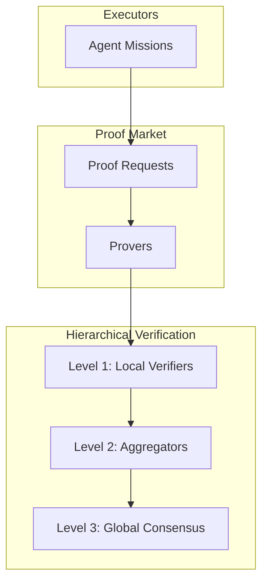
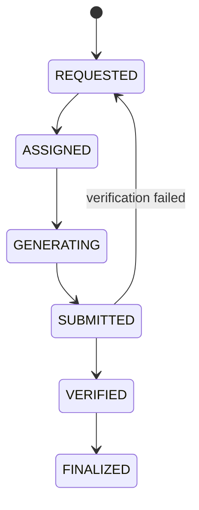

# RFC-0651 (Proof Systems): Proof Market & Hierarchical Verification Network (PHVN)

## Status

**Version:** 1.0
**Status:** Draft
**Submission Date:** 2026-03-10

> **Note:** This RFC was renumbered from RFC-0154 to RFC-0651 as part of the category-based numbering system.

## Depends on

- RFC-0106 (Numeric/Math): Deterministic Numeric Tower
- RFC-0150 (Retrieval): Verifiable Vector Query Execution
- RFC-0151 (AI Execution): Verifiable RAG Execution
- RFC-0152 (Agents): Verifiable Agent Runtime
- RFC-0153 (Agents): Agent Mission Marketplace

## Summary

As the number of missions grows, verifying every execution on every node becomes computationally expensive. This RFC introduces a Proof Market and a Hierarchical Verification Network where specialized nodes produce and verify execution proofs. The system separates roles into executors, provers, verifiers, and aggregators, enabling scalable verification for AI workloads.

## Design Goals

| Goal | Target                   | Metric                                                     |
| ---- | ------------------------ | ---------------------------------------------------------- |
| G1   | Scalable Verification    | Verification must scale to millions of executions          |
| G2   | Economic Incentives      | Nodes must be rewarded for generating and verifying proofs |
| G3   | Fault Tolerance          | Incorrect proofs must be detected                          |
| G4   | Deterministic Settlement | Proof verification must be deterministic                   |
| G5   | ZK Compatibility         | Proof systems must support zero-knowledge circuits         |

## Motivation

Decentralized AI verification faces scaling challenges:

- Every node verifying every execution is expensive
- Proof generation is computationally intensive
- Network consensus requires verification

PHVN addresses these by introducing specialized roles and hierarchical verification.

## Specification

### System Architecture



### Network Roles

The verification network introduces four node roles:

| Role        | Description                              |
| ----------- | ---------------------------------------- |
| Executors   | Agents that perform missions             |
| Provers     | Nodes that generate cryptographic proofs |
| Verifiers   | Nodes that validate proofs               |
| Aggregators | Nodes that batch proofs for efficiency   |

### Proof Market Concept

Proof generation becomes an open market:

```
ProofRequest

struct ProofRequest {
    execution_hash: Hash,
    proof_type: ProofType,
    reward: DQA,
}
```

Provers compete to generate proofs.

### Supported Proof Types

The system supports multiple proof types:

| Proof Type   | Description                      |
| ------------ | -------------------------------- |
| TRACE_PROOF  | Deterministic execution trace    |
| REPLAY_PROOF | Full deterministic recomputation |
| SNARK_PROOF  | Succinct zero-knowledge proof    |
| STARK_PROOF  | Scalable transparent proof       |

Different missions may require different proof levels.

### Proof Request Lifecycle

Proofs follow the deterministic lifecycle:



### Proof Submission

Provers submit proofs as:

```
ProofSubmission

struct ProofSubmission {
    request_id: u64,
    prover_id: u64,
    proof_hash: Hash,
    proof_blob: bytes,
}
```

The proof blob contains the cryptographic artifact.

### Verification Process

Verifiers execute deterministic validation:

1. Load execution hash
2. Validate proof structure
3. Replay computation if necessary
4. Confirm proof validity

Verification must be deterministic and reproducible.

### Hierarchical Verification

The network organizes verification hierarchically:

| Level | Role             | Verification Scope |
| ----- | ---------------- | ------------------ |
| 0     | Executors        | Self-verification  |
| 1     | Local Verifiers  | Single execution   |
| 2     | Aggregators      | Batch verification |
| 3     | Global Consensus | Final settlement   |

Each level reduces verification workload.

### Proof Aggregation

Aggregators combine multiple proofs into a single batch:

```
AggregatedProof

struct AggregatedProof {
    batch_id: u64,
    proof_count: u32,
    aggregated_hash: Hash,
}
```

Aggregation significantly reduces verification cost.

### Proof Commitments

Each proof references an execution commitment:

```
ExecutionCommitment

struct ExecutionCommitment {
    execution_hash: Hash,
    state_root: Hash,
    output_hash: Hash,
}
```

This guarantees execution integrity.

### Fraud Detection

If an invalid proof is submitted, the network detects it:

| Mechanism            | Description              |
| -------------------- | ------------------------ |
| Random verification  | Statistical sampling     |
| Challenge protocol   | Interactive verification |
| Deterministic replay | Full recomputation       |

### Challenge Protocol

Any verifier may challenge a proof:

```
Challenge

struct Challenge {
    proof_id: u64,
    challenger_id: u64,
    evidence_hash: Hash,
}
```

If the challenge succeeds, the prover is penalized.

### Slashing

Malicious provers are penalized:

```
slash_amount = stake × PENALTY_RATE
```

The slashed stake is distributed to challengers.

### Proof Rewards

Provers receive rewards when proofs are accepted:

```
prover_reward = request_reward
```

Rewards are transferred deterministically.

### Verification Rewards

Verifiers are rewarded for validating proofs:

```
verifier_reward = verification_fee
```

This incentivizes honest participation.

### Gas Model

Proof generation costs depend on complexity:

```
gas =
    execution_size
  + proof_generation_cost
  + verification_cost
```

SNARK proofs have higher generation cost but lower verification cost.

### Deterministic Limits

Consensus limits must prevent proof spam:

| Constant       | Value | Purpose                       |
| -------------- | ----- | ----------------------------- |
| MAX_PROOF_SIZE | 16 MB | Maximum proof blob size       |
| MAX_BATCH_SIZE | 1024  | Maximum proofs per batch      |
| MAX_PROOF_TIME | 600s  | Maximum proof generation time |

Requests exceeding limits must fail.

### Proof Storage

Proofs must be stored for future auditing:

```
ProofRecord

struct ProofRecord {
    proof_id: u64,
    execution_hash: Hash,
    prover_id: u64,
    timestamp: u64,
}
```

Old proofs may be archived.

### Network Synchronization

Proof records must propagate across the network:

| Data                   | Sync Frequency |
| ---------------------- | -------------- |
| Proof headers          | Per block      |
| Aggregated commitments | Per epoch      |
| Verification results   | Immediate      |

This ensures consensus.

## Performance Targets

| Metric           | Target | Notes            |
| ---------------- | ------ | ---------------- |
| Proof generation | <60s   | SNARK proof      |
| Verification     | <10ms  | Single proof     |
| Aggregation      | <100ms | 1024 proofs      |
| Finalization     | <1s    | Global consensus |

## Adversarial Review

| Threat              | Impact   | Mitigation                               |
| ------------------- | -------- | ---------------------------------------- |
| Fake proofs         | Critical | Multi-layer verification, slashing       |
| Proof withholding   | Medium   | Multiple provers per request             |
| Collusion           | High     | Randomized assignment, challenge windows |
| Verification bypass | Critical | Hierarchical verification                |

## Alternatives Considered

| Approach               | Pros              | Cons                 |
| ---------------------- | ----------------- | -------------------- |
| Universal verification | Simple            | Doesn't scale        |
| Random sampling        | Cheap             | Lower security       |
| This spec              | Scalable + secure | Complex architecture |

## Implementation Phases

### Phase 1: Core

- [ ] Proof request system
- [ ] Basic prover registration
- [ ] Single-proof verification

### Phase 2: Hierarchy

- [ ] Level 1 local verifiers
- [ ] Level 2 aggregators
- [ ] Batch verification

### Phase 3: Market

- [ ] Proof rewards
- [ ] Verification fees
- [ ] Challenge protocol

### Phase 4: ZK Integration

- [ ] SNARK circuit compatibility
- [ ] STARK support
- [ ] Cross-chain proofs

## Key Files to Modify

| File                                  | Change                    |
| ------------------------------------- | ------------------------- |
| crates/octo-proof/src/market.rs       | Proof market              |
| crates/octo-proof/src/verification.rs | Hierarchical verification |
| crates/octo-proof/src/aggregation.rs  | Proof aggregation         |
| crates/octo-vm/src/gas.rs             | Proof gas costs           |

## Future Work

- F1: Recursive proof aggregation
- F2: Proof compression
- F3: Cross-chain verification
- F4: Hardware acceleration
- F5: Proof-of-inference markets

## Rationale

PHVN provides scalable verification for the AI stack:

1. **Scalability**: Hierarchical verification reduces costs
2. **Economics**: Market incentives for provers/verifiers
3. **Security**: Challenge protocols detect fraud
4. **Composability**: Works with all prior RFCs

## Related RFCs

- RFC-0106 (Numeric/Math): Deterministic Numeric Tower — Arithmetic
- RFC-0150 (Retrieval): Verifiable Vector Query — Execution proofs
- RFC-0151 (AI Execution): Verifiable RAG Execution — Inference proofs
- RFC-0152 (Agents): Verifiable Agent Runtime — Agent proofs
- RFC-0153 (Agents): Agent Mission Marketplace — Mission layer
- RFC-0124 (Economics): Proof Market and Hierarchical Inference Network (complementary: 0124 focuses on distributed inference, 0154 focuses on verification)

> **Note**: RFC-0154 completes the verification layer.

## Related Use Cases

- [Hybrid AI-Blockchain Runtime](../../docs/use-cases/hybrid-ai-blockchain-runtime.md)
- [Proof Market](../../docs/use-cases/proof-market.md)

## Appendices

### A. Proof Verification Pseudocode

```rust
fn verify_proof(
    submission: &ProofSubmission,
    request: &ProofRequest,
) -> Result<VerificationResult, Error> {
    // 1. Verify proof hash
    let computed_hash = hash(&submission.proof_blob);
    if computed_hash != submission.proof_hash {
        return Err(VerificationError::HashMismatch);
    }

    // 2. Verify proof type matches request
    if request.proof_type != submission.proof_type {
        return Err(VerificationError::TypeMismatch);
    }

    // 3. Verify execution commitment
    let commitment = verify_commitment(
        &submission.proof_blob,
        request.execution_hash,
    )?;

    // 4. Finalize verification
    Ok(VerificationResult {
        valid: true,
        commitment,
        reward: request.reward,
    })
}
```

### B. Challenge Protocol

```rust
fn challenge_proof(
    proof_id: u64,
    challenger_id: u64,
) -> Result<ChallengeResult, Error> {
    let proof = get_proof(proof_id)?;

    // Challenger must provide evidence
    let evidence = generate_challenge_evidence(&proof)?;

    // If challenge succeeds
    if evidence.valid {
        // Slash prover
        slash_prover(proof.prover_id)?;
        // Reward challenger
        reward_challenger(challenger_id)?;
    }

    Ok(ChallengeResult {
        success: evidence.valid,
        evidence,
    })
}
```

---

**Version:** 1.0
**Submission Date:** 2026-03-10
**Changes:**

- Initial draft for PHVN specification
