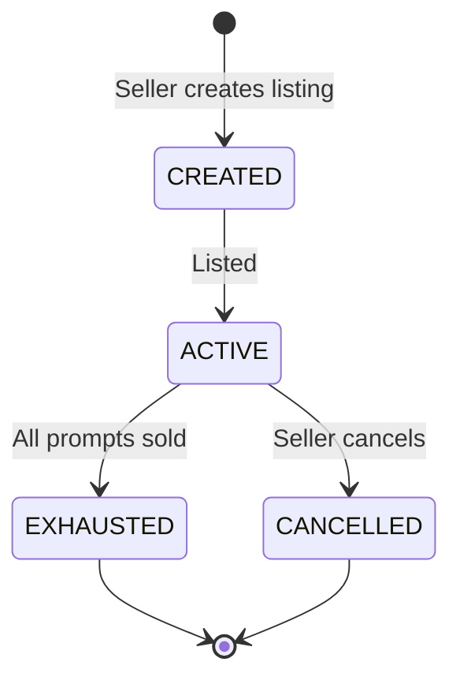
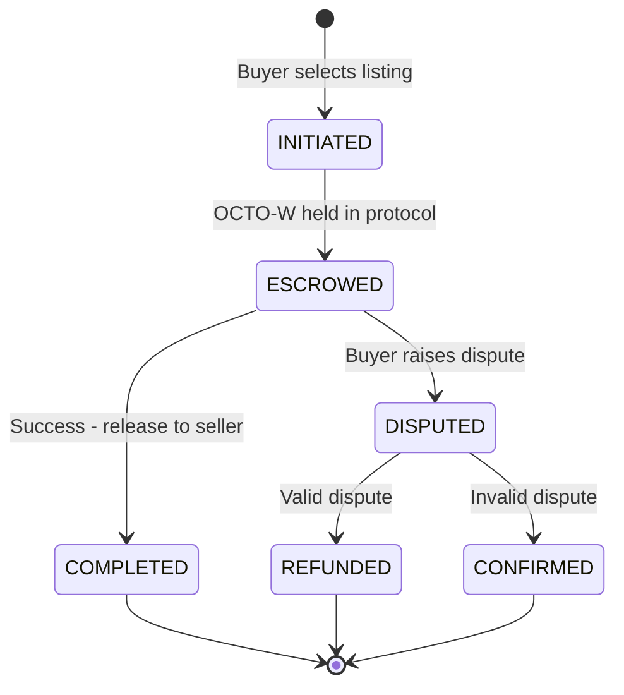
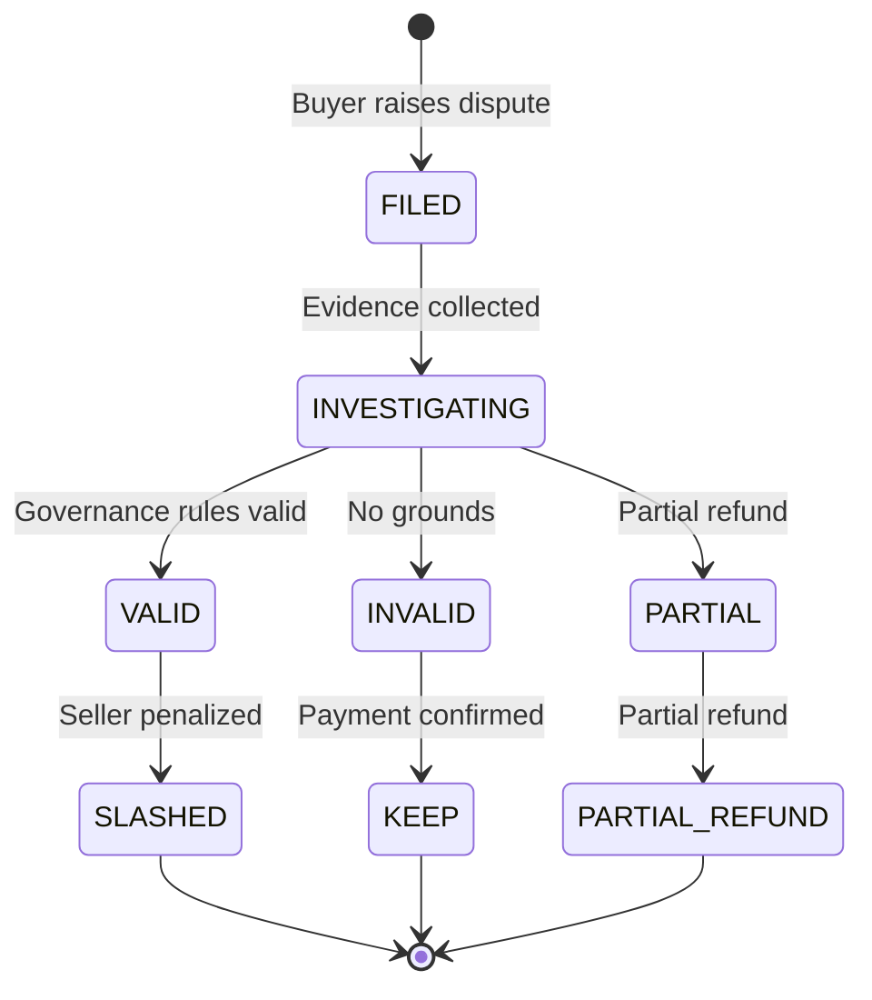

# RFC-0900 (Economics): AI Quota Marketplace Protocol

## Status

Accepted

> **Note:** This RFC was renumbered from RFC-0100 to RFC-0900 as part of the category-based numbering system.

## Version History

| Version | Date       | Changes |
| ------- | ---------- | ------- |
| 2.0     | 2026-08-18 | Chain-aware slash ledger substrate (mission 0900-d). Audit verdict 2026-08-17 Risk #2 CRITICAL closure: slash_ledger PK promoted from `(row_id, provider_id UNIQUE)` to `(chain_id, provider_id)` per §20.3 Model B (parallel to vault v013 PK). Added §Slash Ledger Substrate subsection specifying substrate invariants: `chain_id BLOB(32)` typed `ChainId` (RFC-0010 v1.4), amount columns BIGINT at scale=0 via `dqa_to_i64`/`i64_to_dqa` bridge (DQA(12) promotion deferred — stoolap fork does not expose native Dqa driver), cross-chain partition invariant (one slash_ledger row per chain per provider), in-memory `ProviderStake.chain_id: [u8; 32]` field mirrors storage row shape. Migration: `v015__chain_aware_slash_ledger.sql`. |
| 1.1     | 2026-07-24 | Gaps 5 + 7 implemented as `crates/quota-router-core::marketplace`. Order book (`orderbook::OrderBook<AskSpec>` — Gap 5.1), escrow state machine (`marketplace::escrow::Escrow` — Gap 5.2), and slashing model (`marketplace::slashing::SlashingLedger` with RFC-0900 §Slashing Model first-offense + escalation — Gap 5.3) landed. Cheapest lookup routes through the order book (`Marketplace::cheapest` — Gap 5.5). Gap 7 extended the facade with provider reputation registry (`scoring::ProviderReputationRegistry`) + circuit-breaker (`Marketplace::set_min_reputation` excludes providers below threshold — Gap 7.1) and latency-aware ranking (`Marketplace::cheapest_with_ranking` + `LatencyRanking::prefer_latency` — Gap 7.2). The TypeScript interfaces in this RFC remain a wire-shape reference; the Rust impl is the canonical source for the protocol. |
| 1.0     | 2026-03-02 | Initial draft. |

## Summary

Define the protocol for trading AI API quotas between developers using OCTO-W tokens as both currency and authorization grant.

## Motivation

Enable developers to:

- Contribute spare AI API quota to the network
- Earn OCTO-W tokens for contributed quota
- Purchase quota from other developers when needed
- Swap OCTO-W for other tokens (OCTO-D, OCTO)

This creates immediate utility for OCTO-W and bootstraps the developer network.

## Specification

### Core Concepts

```typescript
// Quota listing
interface QuotaListing {
  id: string;
  provider: 'openai' | 'anthropic' | 'google' | 'other';
  prompts_remaining: number;
  price_per_prompt: number; // in OCTO-W
  seller_wallet: string;
  status: 'active' | 'exhausted' | 'cancelled';
}

// Quota purchase
interface QuotaPurchase {
  listing_id: string;
  buyer_wallet: string;
  prompts_requested: number;
  total_cost: OCTO-W;
  timestamp: number;
}

// Token balance
interface QuotaRouter {
  wallet: string;
  octo_w_balance: OCTO-W;
  api_key: string; // encrypted, never transmitted
  proxy_port: number;
  status: 'online' | 'offline';
}
```

### Token Economics

| Action              | Token      |
| ------------------- | ---------- |
| Contribute 1 prompt | +1 OCTO-W  |
| Purchase 1 prompt   | -1 OCTO-W  |
| Minimum listing     | 10 prompts |

### Routing Protocol

```typescript
interface RouterConfig {
  // Policy
  max_price_per_prompt: OCTO-W;
  preferred_providers: string[];
  fallback_enabled: boolean;
  fallback_timeout_ms: number;

  // Security
  require_minimum_balance: OCTO-W;
  auto_recharge_enabled: boolean;
  auto_recharge_source: 'wallet' | 'swap';
}
```

### Market Operations

```typescript
// List quota for sale
async function listQuota(
  prompts: number,
  pricePerPrompt: OCTO-W
): Promise<QuotaListing>;

// Purchase quota
async function purchaseQuota(
  listingId: string,
  prompts: number
): Promise<QuotaPurchase>;

// Route prompt through network
async function routePrompt(
  prompt: string,
  config: RouterConfig
): Promise<string>;
```

## Implementation

_Implementation phases have been moved to the Roadmap and Mission files._

See (legacy, superseded 2026-08-16): `missions/archived/superseded/quota-router-mve.md`, `missions/archived/superseded/quota-market-integration.md`. Canonical execution lives in the 0900-0999 economics RFC family + `missions/claimed/0902-*.md` + `missions/claimed/0959-a-ask-pricing-stoolap.md`.

## Settlement Model

### Registry Decision

| Option        | Pros                  | Cons            | Recommendation   |
| ------------- | --------------------- | --------------- | ---------------- |
| **Off-chain** | Fast, cheap           | Less trust      | MVE - start here |
| **On-chain**  | Trustless, verifiable | Expensive, slow | Phase 2          |

### Escrow Flow

```
1. Buyer initiates purchase
   │
   ▼
2. OCTO-W held in escrow (protocol contract)
   │
   ▼
3. Seller executes prompt via their proxy
   │
   ▼
4. Success?
   │
   ├─ YES → Release OCTO-W to seller
   │
   └─ NO → Refund to buyer, slash seller stake
```

### Dispute Resolution

```typescript
enum DisputeOutcome {
  Valid, // Refund buyer, slash seller
  Invalid, // Keep payment, no action
  Partial, // Partial refund
}

interface Dispute {
  id: string;
  buyer: string;
  seller: string;
  listing_id: string;
  reason: "failed_response" | "garbage_data" | "timeout";
  evidence: string; // URL or hash
  timestamp: number;
}

// Resolution: Governance vote or automated arbitration
```

### Dispute Evidence Challenge

**Issue:** Prompts are private, but buyer needs to prove "garbage response" without revealing prompt content.

**MVE Solution:** Heavily weight automated failures:

| Dispute Type         | Evidence                 | Verifiability |
| -------------------- | ------------------------ | ------------- |
| **Timeout**          | Network logs, timestamps | Automatic     |
| **Provider error**   | Provider error codes     | Automatic     |
| **Latency high**     | Latency measurements     | Automatic     |
| **Garbage response** | Requires human review    | Manual        |
| **Failed response**  | HTTP status codes        | Automatic     |

**For MVE:** Focus disputes on automated verifications (timeouts, errors, latency). Response quality disputes require trust (reputation-based) until cryptographic solutions emerge.

**Future:** ZK proofs of inference quality (research phase).

### Slashing Model

```typescript
interface SlashingRules {
  // First offense: 10% of stake
  first_offense_penalty: 0.1;

  // Escalation per offense
  offense_multiplier: 1.5;

  // Permanent ban threshold
  permanent_ban_at: 0.5; // 50% of stake lost
}
```

### Slash Ledger Substrate

RFC-0900 v2.0 (mission 0900-d, audit verdict 2026-08-17 Risk #2
CRITICAL closure) specifies the storage + in-memory substrate
shape that backs §Slashing Model. Per §20.3 Model B, slash ledger
mirrors the vault substrate's chain-aware PK lattice.

#### Substrate invariants

- **Primary key** = `(chain_id, provider_id)`. Same provider may
  carry one slash_ledger row per chain (cross-chain stake
  partitioning). Parallel to vault v013 PK pattern `(chain_id,
  owner_did, asset_id)`.
- **`chain_id` BLOB(32)** carries the typed `ChainId` per
  RFC-0010 v1.4. Default namespace = 32 bytes of zero (`ChainId::default()`).
- **Amount columns** `stake_micro_octo_w` +
  `initial_stake_micro_octo_w` are BIGINT at scale=0 via the
  `dqa_to_i64` / `i64_to_dqa` bridge. The bridge text form is
  identical to the canonical `DqaEncoding` 16-byte BE at scale=0
  (i64 zero-extended). Stoolap fork does NOT expose a native Dqa
  driver (verified 2026-08-18: only `r.get::<i64>()` for amount
  columns); DQA(12) promotion is deferred to a follow-on mission
  tied to the upstream fork Dqa driver.
- **`cumulative_loss_pct_micro` BIGINT** — not amount-bearing;
  encoded as integer micro-percent (1e6) to keep the column
  Eq-comparable without f64 round-trip ambiguity. 500_000 = 50.0000%.
- **`last_updated_unix` BIGINT** — timestamp, kept as BIGINT.
- **Cross-chain partition invariant**: a slash event within chain X
  ONLY affects the slash_ledger row for `(chain_id=X, provider_id)`.
  Cross-chain slashing requires explicit governance coordination
  (separate RFC owed — §Open Questions).

#### In-memory mirror

```rust
struct ProviderStake {
    chain_id: [u8; 32],       // RFC-0010 v1.4 ChainId
    provider_id: String,
    stake_micro_octo_w: Dqa,  // canonical 16-byte BE wire form
    initial_stake_micro_octo_w: Dqa,
    offense_count: u32,
    cumulative_loss_pct_micro: u64,
    last_updated_unix: u64,
}
```

In-memory `HashMap` key structure is deferred to a follow-on
mission (production paths currently use `DEFAULT_CHAIN_ID` for
all providers; tuple-keyed `HashMap<([u8; 32], String), ProviderStake>`
land before any multi-chain slashing path activates).

#### Migration history

- **v012 (LANDED pre-RFC-0900)** — singleton PK `(row_id,
  provider_id UNIQUE)`; no chain dimension. Cross-chain slash
  silently overwrites. **SUPERSEDED by v015.**
- **v015 (LANDED 2026-08-18, mission 0900-d)** — chain-aware
  substrate. Adds `chain_id BLOB` column + composite UNIQUE INDEX
  `slash_ledger_chain_provider_idx` on `(chain_id, provider_id)`.
  Drops column-level UNIQUE on `provider_id` (triple-named drop
  for fork naming quirks — `unique_slash_ledger_provider_id` +
  `slash_ledger_provider_id_unique` + `sqlite_autoindex_slash_ledger_1`).
  Backfills legacy v012 rows to default namespace via
  `UPDATE ... WHERE chain_id IS NULL`.

## Security

| Mechanism           | Purpose                      |
| ------------------- | ---------------------------- |
| Local proxy only    | API keys never leave machine |
| Balance check first | Prevent overspending         |
| Stake requirement   | Prevent spam/abuse           |
| Reputation system   | Build trust                  |

## Related Use Cases

- [AI Quota Marketplace for Developer Bootstrapping](../../docs/use-cases/ai-quota-marketplace.md)

## State Machines

### Listing Lifecycle



### Purchase Lifecycle



### Dispute Lifecycle



## Observability

The marketplace must support logging without exposing sensitive data:

```typescript
interface MarketTelemetry {
  // What we log (no PII)
  event: "purchase" | "listing" | "swap" | "dispute";
  timestamp: number;
  provider: string;
  octo_w_amount: number;
  latency_ms: number;
  success: boolean;

  // What we DON'T log
  // - Prompt content
  // - API keys
  // - Wallet addresses (use hash instead)
}
```

## Security & Privacy

| Concern          | Mitigation                                                                    |
| ---------------- | ----------------------------------------------------------------------------- |
| API key exposure | Local proxy only, keys never transmitted                                      |
| Prompt privacy   | ⚠️ **TRUST ASSUMPTION** - Sellers see prompt content when executing API calls |
| Wallet privacy   | Pseudonymous addresses                                                        |
| Data residency   | No central storage                                                            |

**Important:** Prompt content is visible to the seller who executes the API request.
This is a trust-based model, not cryptographic. See Research doc for future options (TEE/ZK).

## Related RFCs

- RFC-0101 (Economics): Quota Router Agent Specification
- RFC-XXXX: Token Swap Protocol (future)
- RFC-0968: Reputation Registry

## References

- Parent Document: docs/use-cases/ai-quota-marketplace.md
- Research: docs/research/ai-quota-marketplace-research.md

## Open Questions

1. On-chain vs off-chain listing registry?
2. Minimum stake for sellers?
3. How to handle failed requests (refund OCTO-W)?

---

**Draft Date:** 2026-03-02
