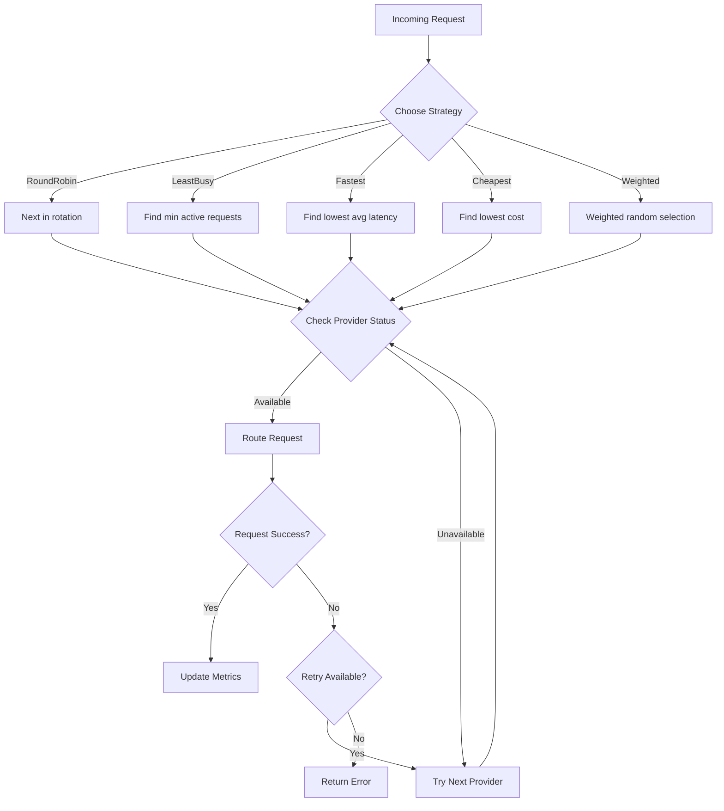

# RFC-0902 (Economics): Multi-Provider Routing and Load Balancing

## Status

Accepted

**ARCHITECTURAL CONSTRAINT: Rust-owns-all-heavy-lifting. This is a CORE project-wide constraint — ALL heavy lifting (routing, caching, telemetry, concurrency, batch execution, state management) MUST be in Rust core. All other languages are thin binding/integration bridges only.**

## Authors

- Author: @cipherocto

## Maintainers

- Maintainer: @mmacedoeu

## Summary

Define routing strategies, load balancing algorithms, and fallback mechanisms for the enhanced quota router to enable intelligent request distribution across multiple LLM providers.

## Dependencies

**Requires:**

**Optional:**

- RFC-0900 (Economics): AI Quota Marketplace Protocol
- RFC-0901 (Economics): Quota Router Agent Specification
- RFC-0903: Virtual API Key System
- RFC-0904: Real-Time Cost Tracking

## Why Needed

The enhanced quota router must support multiple LLM providers with intelligent routing to:

- Enable provider failover when one is unavailable
- Optimize cost by routing to cheapest provider
- Balance load across providers to avoid rate limits
- Support the quota marketplace (RFC-0900) with dynamic provider discovery

## Scope

**ALL routing, state management, and heavy processing is in Rust core. Python SDK, HTTP proxy, and any other bindings are thin clients only.**

### In Scope

- Rust core routing strategies (round-robin, least-busy, latency-based, cost-based) — **ALL implemented in Rust**
- Fallback chain configuration — **in Rust core**
- Provider health checking and cooldown periods — **in Rust core**
- Weight-based distribution — **in Rust core**
- Per-request routing metadata — **in Rust core**
- **RustRouterHandle** PyO3-exposed handle for Python SDK thin binding

### Out of Scope

- Provider API implementation (handled by provider modules)
- Cost tracking (RFC-0904)
- Market-based dynamic routing (future phase)
- **Python-side routing state** — Python SDK uses RustRouterHandle only
- **Any language implementing routing logic** — only Rust core owns routing

## Design Goals

| Goal | Target | Metric |
|------|--------|--------|
| G1 | <10ms routing decision | Routing latency |
| G2 | 99.9% request success | With fallback enabled |
| G3 | Support 10+ providers | Provider count |
| G4 | Configurable per-key | Routing policy flexibility |

## Specification

### Routing Strategies

Based on research into LiteLLM's routing implementation, the following strategies are supported:

```rust
/// Supported routing strategies
enum RoutingStrategy {
    /// Default - Weighted distribution based on rpm/tpm weights (recommended for production)
    /// LiteLLM: "simple-shuffle" - randomly distributes requests based on configured rpm/tpm
    SimpleShuffle,

    /// Round-robin through available providers
    RoundRobin,

    /// Route to provider with fewest active requests
    /// LiteLLM: "least-busy"
    LeastBusy,

    /// Route to fastest responding provider (based on recent latency)
    /// LiteLLM: "latency-based-routing"
    LatencyBased,

    /// Route to cheapest provider (requires RFC-0904)
    /// LiteLLM: "cost-based-routing"
    CostBased,

    /// Route to provider with lowest current usage (RPM/TPM)
    /// LiteLLM: "usage-based-routing" / "usage-based-routing-v2"
    UsageBased,

    /// Weighted distribution based on explicitly configured weights
    /// Distinct from SimpleShuffle: SimpleShuffle derives weights from rpm/tpm config;
    /// Weighted uses explicit per-provider weights from router.weights config.
    Weighted,
}
```

> **Note:** LiteLLM research shows `simple-shuffle` is recommended for production due to minimal latency overhead. Rate limit aware routing uses RPM/TPM values to make routing decisions.

#### LiteLLM Reference Implementation

| Strategy | LiteLLM Value | Description |
|----------|---------------|-------------|
| Simple Shuffle | `simple-shuffle` (default) | Randomly distributes requests based on rpm/tpm weights |
| Least Busy | `least-busy` | Routes to deployment with fewest active requests |
| Latency Based | `latency-based-routing` | Routes to fastest responding deployment |
| Cost Based | `cost-based-routing` | Routes to deployment with lowest cost |
| Usage Based | `usage-based-routing` | Routes to deployment with lowest current usage (RPM/TPM) |

#### LiteLLM Routing Strategy Enum

```python
# From litellm/types/router.py
class RoutingStrategy(enum.Enum):
    LEAST_BUSY = "least-busy"
    LATENCY_BASED = "latency-based-routing"
    COST_BASED = "cost-based-routing"
    USAGE_BASED_ROUTING_V2 = "usage-based-routing-v2"
    USAGE_BASED_ROUTING = "usage-based-routing"
    PROVIDER_BUDGET_LIMITING = "provider-budget-routing"
```

> **ProviderBudgetLimiting disposition:** This strategy (per-provider budget limits) is **out of scope** for this RFC. It is not present in the Rust `RoutingStrategy` enum above. Rationale: Per-provider budget limiting is a separate enforcement dimension from request routing — it is handled by the budget enforcement layer (RFC-0904) rather than the routing layer. `CostBased` routing (lowest-cost provider selection) is the closest equivalent in scope and is included. `ProviderBudgetLimiting` would require a per-provider quota management system that is beyond this RFC's scope.

#### Rust Core Ownership

**ALL routing strategies are implemented EXCLUSIVELY in Rust core (`quota-router-core`).**

```
┌─────────────────────────────────────────────────────────────────┐
│  quota-router-core (Rust) — ALL routing, state, heavy lifting   │
│  • RoutingStrategy enum + all strategies                        │
│  • Router struct with routing state (dashmap, lock-free)        │
│  • FallbackExecutor                                             │
│  • RateLimiter (TokenBucket)                                    │
│  • RouterHandle (PyO3-exposed handle for Python SDK)            │
└─────────────────────────────────────────────────────────────────┘
                              │ PyO3
                              ▼
┌─────────────────────────────────────────────────────────────────┐
│  Python SDK (quota-router-pyo3) — THIN BINDING ONLY             │
│  • Router class is thin PyO3 wrapper to RustRouterHandle        │
│  • NO Python-side routing state, no locks, no decay math         │
│  • All routing decisions delegated to Rust core                 │
│  • Python adds ONLY marshaling overhead (<2ms)                  │
└─────────────────────────────────────────────────────────────────┘
```

**For Python SDK:** Use `RustRouterHandle` via PyO3. The Python `Router` class is a thin wrapper that delegates all routing to `RustRouterHandle`. Do NOT implement routing strategies in Python.

```yaml
# router_settings in config.yaml
router_settings:
  routing_strategy: "least-busy"  # default

  # Fallback configuration
  fallback:
    enabled: true
    max_retries: 3
    retry_delay_ms: 100
    backoff_multiplier: 2.0
    max_backoff_ms: 5000

  # Provider weights for weighted routing (GLOBAL weights map — provider.name → weight)
  # NOT per-provider weight. Weighted strategy uses this global map to select providers.
  # If a provider.name is not in weights, falls back to SimpleShuffle behavior (rpm-based).
  weights:
    openai: 10
    anthropic: 5
    google: 3

  # Health check configuration
  health_check:
    enabled: true
    interval_seconds: 30
    timeout_ms: 5000
    cooldown_seconds: 60  # Disable provider after failure

  # Latency tracking
  latency_window: 100  # Track last N requests
```

### Fallback Mechanisms

Based on LiteLLM research, fallbacks provide reliability when a deployment fails:

#### Fallback Types

| Type | Trigger | Description |
|------|---------|-------------|
| `fallbacks` | All errors (RateLimitError, Timeout, etc.) | General fallback for failed requests |
| `content_policy_fallbacks` | ContentPolicyViolationError | Maps content policy errors across providers |
| `context_window_fallbacks` | ContextWindowExceededError | Maps context window errors to models with larger context |

#### Fallback Configuration

```yaml
router_settings:
  # Basic fallback - route to next model group on failure
  fallbacks:
    - model: gpt-3.5-turbo
      fallback_models:
        - gpt-4
        - claude-3-opus

  # Context window fallback - for longer prompts
  context_window_fallbacks:
    gpt-3.5-turbo: gpt-3.5-turbo-16k

  # Content policy fallback
  content_policy_fallbacks:
    gpt-4: claude-3-opus
```

> **LiteLLM Reference:** Fallbacks are done in-order. A list like `["gpt-3.5-turbo", "gpt-4", "gpt-4-32k"]` will try each sequentially.

### Provider State

Based on LiteLLM's implementation, provider state tracks deployment health:

```rust
struct ProviderState {
    name: String,
    status: ProviderStatus,  // Available, RateLimited, Error, Cooldown

    // Metrics — all integer to avoid floating-point non-determinism (per RFC-0104)
    active_requests: u32,
    /// Rolling average latency in microseconds (integer). Updated via integer rolling average
    /// computation. Display/alerting can convert to ms via division if needed.
    avg_latency_us: u64,
    /// Success and total counts (integer). Ratio computed at display time only —
    /// never used for routing decisions (avoids f64 non-determinism per RFC-0104).
    success_count: u64,
    total_count: u64,

    // Rate limiting (LiteLLM-inspired)
    rpm_limit: u32,          // Requests per minute limit
    tpm_limit: u32,          // Tokens per minute limit
    current_rpm: u32,       // Current usage
    current_tpm: u32,       // Current token usage

    // Health check
    last_health_check: DateTime<Utc>,
    consecutive_failures: u32,
}
```

#### Rate Limit Enforcement

LiteLLM provides two modes for rate limiting:

| Mode | Behavior | Use Case |
|------|----------|----------|
| **Soft (default)** | RPM/TPM used for routing decisions only | Prefer available capacity |
| **Hard** | Hard blocking when limit exceeded | Strict enforcement |

```yaml
router_settings:
  optional_pre_call_checks:
    - enforce_model_rate_limits  # Enables hard blocking
```

### Request Flow


```mermaid
flowchart TD
    A[Incoming Request] --> B{Choose Strategy}
    B -->|RoundRobin| C[Next in rotation]
    B -->|LeastBusy| D[Find min active requests]
    B -->|Fastest| E[Find lowest avg latency]
    B -->|Cheapest| F[Find lowest cost]
    B -->|Weighted| G[Weighted random selection]

    C --> H{Check Provider Status}
    D --> H
    E --> H
    F --> H
    G --> H

    H -->|Available| I[Route Request]
    H -->|Unavailable| J[Try Next Provider]
    J --> H

    I --> K{Request Success?}
    K -->|Yes| L[Update Metrics]
    K -->|No| M{Retry Available?}
    M -->|Yes| J
    M -->|No| N[Return Error]
```

### OpenAI-Compatible API Support

The router must expose OpenAI-compatible endpoints:

```rust
// Required endpoints for LiteLLM compatibility
POST /v1/chat/completions  // Route to selected provider
POST /v1/embeddings       // Route to embedding provider
GET  /v1/models           // List available models across providers
```

### LiteLLM Compatibility

> **Critical:** Must track LiteLLM's Python interfaces for drop-in replacement.

Reference LiteLLM's routing configuration:
- Model list format matches `model_list` in LiteLLM config
- Router settings map to LiteLLM's `router_settings`
- Same `/chat/completions`, `/embeddings` endpoints

#### LiteLLM Router Python Interface

```python
from litellm import Router

model_list = [
    {
        "model_name": "gpt-3.5-turbo",
        "litellm_params": {
            "model": "azure/chatgpt-v-2",
            "api_key": os.getenv("AZURE_API_KEY"),
            "api_base": os.getenv("AZURE_API_BASE"),
            "rpm": 900
        }
    }
]

router = Router(
    model_list=model_list,
    routing_strategy="simple-shuffle",  # or "least-busy", "latency-based-routing"
    fallbacks=[{"gpt-3.5-turbo": ["gpt-4"]}],
    num_retries=2,
    timeout=30
)

# Async completion
response = await router.acompletion(
    model="gpt-3.5-turbo",
    messages=[{"role": "user", "content": "Hello!"}]
)
```

#### LiteLLM Key Classes

| Class | File | Purpose |
|-------|------|---------|
| `Router` | `litellm/router.py` | Main routing class |
| `RoutingStrategy` | `litellm/types/router.py` | Enum of routing strategies |
| `AutoRouter` | `litellm/router_strategy/auto_router/auto_router.py` | Pre-routing hooks |
| `Deployment` | `litellm/types/router.py` | Model deployment configuration |

## Key Files to Modify

| File | Change |
|------|--------|
| `crates/quota-router-core/src/router.rs` | Routing strategies, ProviderWithState, Router |
| `crates/quota-router-core/src/providers.rs` | Provider definitions, health checking |
| `crates/quota-router-core/src/config.rs` | RouterConfig, routing settings |

> **Note:** The code uses `ProviderWithState` (not `ProviderState` as shown in the pseudocode). The struct name difference is a pre-existing discrepancy; the field semantics match RFC-0902 v1.3.

## Future Work

- F1: Market-based dynamic routing (query marketplace for best price)
- F2: Custom routing rules engine
- F3: A/B testing routing strategies

## Rationale

Multi-provider routing is essential for:
1. **Reliability** - Fallback prevents single-provider failures
2. **Cost optimization** - Route to cheapest when possible
3. **Rate limit avoidance** - Distribute across providers
4. **LiteLLM migration** - Match LiteLLM's routing capabilities

### Determinism Note (NM-2)

**Architectural tension:** RFC-0902 requires routing **diversity** (different routers may select different providers for load distribution), while RFC-0909 requires routing **determinism** (same `provider` per request for `event_id` stability). These requirements can conflict when `LatencyBased` or `UsageBased` strategies select different providers on different router instances.

**Resolution:** RFC-0909's `event_id` determinism applies to **identical requests processed by the same router instance** (enabling idempotent replay via `UNIQUE(key_id, request_id)`). Cross-router `event_id` convergence is not a stated RFC-0909 requirement — different router instances may record different `provider` values for the same logical request, producing different `event_id` values, but each individual router's `event_id` is deterministic for its own request history. The deduplication key `(key_id, request_id)` handles cross-router duplicate detection at the storage layer. `CostBased` routing (selecting lowest-cost provider) is the strategy most likely to produce consistent cross-router selections for the same model/pricing inputs, and is recommended when cross-router `event_id` consistency is desired.

## Version History

| Version | Date       | Changes |
| ------- | ---------- | --------|
| 1.7     | 2026-04-29 | **CRITICAL CONSTRAINT: Rust-owns-all-heavy-lifting.** Added top-level architectural constraint establishing Rust core as sole owner of all routing, state, caching, telemetry, concurrency. Updated Scope section with explicit Rust-core-only language. Added Rust Core Ownership section clarifying Python SDK uses RustRouterHandle only. All routing strategies are Rust-only. |
| 1.6     | 2026-04-25 | Fix YAML comment: "model_name → weight" → "provider.name → weight" (provider names used as keys, not model names) |
| 1.5     | 2026-04-25 | Clarify Weighted strategy requires global `weights: HashMap<String, u32>` in RouterConfig (not per-provider weight); add implementation note for Weighted fallback behavior |
| 1.4     | 2026-04-25 | Fix Key Files table (stale paths: quota-router-cli→quota-router-core); clarify Weighted vs SimpleShuffle (Weighted uses explicit config weights, SimpleShuffle uses rpm/tpm-derived weights); add ProviderWithState naming note |
| 1.3     | 2026-04-24 | Round 36: fix NH-1 (avg_latency_ms: f64→avg_latency_us: u64, success_rate: f64→success_count/total_count: u64 — eliminate floating-point non-determinism per RFC-0104); fix NM-6 (document ProviderBudgetLimiting as explicitly out of scope); fix NM-2 (add determinism note on routing diversity vs RFC-0909 event_id stability) |
| 1.0     | 2026-03-12 | Initial draft with LiteLLM research |
| 1.1     | 2026-03-12 | Moved to Draft, added routing strategies, fallback mechanisms |
| 1.2     | 2026-03-12 | Changed to Accepted status |

## Related RFCs

- RFC-0900 (Economics): AI Quota Marketplace Protocol
- RFC-0901 (Economics): Quota Router Agent Specification
- RFC-0903: Virtual API Key System
- RFC-0904: Real-Time Cost Tracking
- RFC-0908 (Economics): Python SDK and PyO3 Bindings

## Related Use Cases

- Enhanced Quota Router Gateway

## Related Research

- LiteLLM Analysis and Quota Router Comparison

---

**Submission Date:** 2026-03-12
**Last Updated:** 2026-03-12
