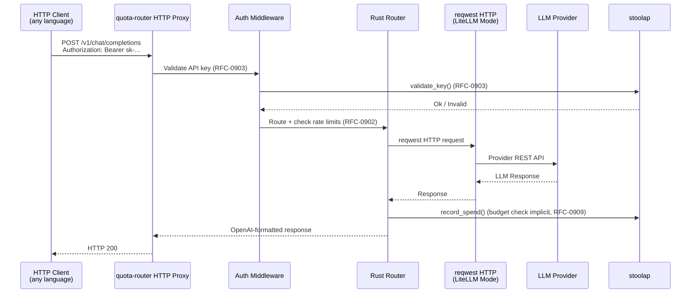

# RFC-0917 (Economics): Dual-Mode Query Router — LiteLLM-Style HTTP Forwarding + any-llm-Style SDK Delegation

## Status

Accepted (v2.50 — 2026-05-10)

**ARCHITECTURAL CONSTRAINT: Rust-owns-all-heavy-lifting. ALL heavy lifting (routing, caching, telemetry, concurrency, state management, batch execution) MUST be in Rust core. HTTP proxy and Python SDK are thin binding layers only. Each language binding (Python, JS, Go, etc.) adds ONLY marshaling overhead.**

## Authors

- Author: @mmacedoeu

## Maintainers

- Maintainer: @mmacedoeu

## Summary

Define a dual-mode query router that operates under Rust feature gates: **LiteLLM Mode** (native Rust HTTP forwarding to provider REST APIs, like LiteLLM's custom HTTP clients) and **any-llm Mode** (Python SDK delegation via PyO3 to official provider SDKs, like any-llm's delegation approach). **Both modes expose BOTH interfaces (HTTP proxy and Python SDK).** The modes differ only in **how providers are called** (integration strategy), not which interfaces are available:
- **LiteLLM Mode** uses `reqwest` (native Rust HTTP) to call provider REST APIs.
- **any-llm Mode** uses PyO3 to call official Python SDKs.
- Both modes provide **both** HTTP proxy (`/v1/chat/completions`) **and** Python SDK (`pip install quota_router` → `completion()`).

**`full`** (both feature gates enabled) enables **both** integration strategies simultaneously (reqwest + PyO3) plus **both** interfaces.

Most enterprise features (budgets, rate limiting, Prometheus, RFC-0909/0910) are shared across modes — enforced at the Router level via `Router::global()`. Virtual keys (RFC-0903) are enforced via HTTP proxy auth middleware (`validate_key()`) which applies only when requests enter via the HTTP proxy interface. Python SDK callers bypass the proxy and do not have virtual key enforcement — this applies equally to LiteLLM Mode and any-llm Mode Python SDK paths. The mode gate controls provider integration strategy (`reqwest` vs. PyO3), NOT which interface is exposed.

## Motivation

### Research Foundation

Based on `docs/research/any-llm-vs-litellm-comparison.md`:

**LiteLLM** (BerriAI) is a mature production gateway used by Stripe, Google, Netflix. Its defining characteristic is **reimplementing provider HTTP clients internally** — it does NOT delegate to official provider SDKs. It exposes both a Python SDK and an HTTP proxy, with full enterprise features.

**any-llm** (Mozilla AI) is a lean correctness-first SDK that **delegates to official provider SDKs** (Anthropic SDK, OpenAI SDK, etc.). It has no router, no fallback, but maximum protocol correctness via SDK delegation. It exposes a Python SDK with an optional FastAPI gateway.

**CipherOcto Opportunity:** The dual-mode distinction should mirror the architectural difference between the reference implementations:
- **LiteLLM Mode:** Native Rust HTTP forwarding (like LiteLLM's custom HTTP approach, but in Rust) — no Python SDK dependency for provider calls, protocol control, lightweight
- **any-llm Mode:** Python SDK delegation via PyO3 (like any-llm's SDK delegation approach) — maximum correctness via official SDKs, familiar Python API

Enterprise features are available in all modes (interface differs per mode). The mode gate controls both the interface exposed (HTTP vs. SDK) and the provider integration strategy (`reqwest` vs. PyO3).

### The Dual-Mode Concept

The dual-mode architecture differentiates **how providers are called**, not which client interface is exposed:

| Dimension | LiteLLM Mode | any-llm Mode |
|-----------|--------------|--------------|
| Provider integration | Native Rust HTTP forwarding (`reqwest`) | Python SDK delegation (PyO3 → official SDKs) |
| Reference approach | LiteLLM's custom HTTP clients | any-llm's SDK delegation |
| Python dependency | None for provider calls | Official provider SDKs (Anthropic, OpenAI, etc.) |
| Protocol control | Full (custom HTTP implementation) | Delegated to SDK |
| Correctness guarantee | Via audit + test | Via official SDK |

**Interface availability depends on build configuration:**

| Interface | LiteLLM Mode | any-llm Mode | `full` (default) |
|-----------|:------------:|:------------:|:-----------------:|
| HTTP proxy (`/v1/chat/completions`) | ✅ | ✅ | ✅ |
| Python SDK (`pip install`) | ✅ | ✅ | ✅ |

The modes differ in **provider integration strategy** (`reqwest` vs. PyO3). Both interfaces are **always** available in all modes.

**Note:** The `pip install quota-router` package is an `any-llm-mode` build — the HTTP proxy calls Rust core directly (which may internally delegate to PyO3 for provider calls). The `quota-router-gateway` binary is a `litellm-mode` build — it also has the Python SDK available. The `full` build has both interfaces. Mode selects the provider integration strategy (reqwest vs PyO3), NOT which interfaces exist.

**Both modes enforce identical enterprise features:**
- Virtual API keys (RFC-0903) — **HTTP proxy only** (Python SDK callers bypass proxy, no virtual key enforcement)
- Budget enforcement (RFC-0904)
- Rate limiting (RFC-0902)
- Deterministic quota accounting (RFC-0909)
- Pricing table registry (RFC-0910)
- Prometheus metrics (RFC-0905 for OpenTelemetry OTLP — Planned)
- Response caching (RFC-0906 — Draft)
- OCTO-W balance (RFC-0900)
- stoolap persistence (RFC-0903-B1/C1)

The mode gate controls **provider integration strategy** (`reqwest` vs. PyO3). Both interfaces are **always** available in all modes.

### Architectural Diagram

```mermaid
flowchart TB
    subgraph Interface["Interface Layer (BOTH interfaces in BOTH modes)"]
        direction TB
        HTTP[HTTP Proxy<br/>/v1/chat/completions<br/>Available in ALL modes]
        SDK[Python SDK<br/>completion() / acompletion()<br/>Available in ALL modes]
    end

    subgraph LiteLLM["LiteLLM Mode (reqwest HTTP — litellm-mode OR full)"]
        direction TB
        LMR[Router] --> LMH[reqwest HTTP<br/>Native Rust → Provider REST APIs]
    end

    subgraph AnyLLM["any-llm Mode (PyO3 SDK — any-llm-mode OR full)"]
        direction TB
        AMR[Router] --> AMP[PyO3 Bridge<br/>Python SDKs: Anthropic·OpenAI·Mistral·etc.]
    end

    subgraph Shared["Shared Core (always compiled)"]
        direction TB
        Enterprise[Enterprise: Keys·Budgets·Rate Limits·Metrics]
        Storage[stoolap RFC-0903-B1/C1]
        Router[RFC-0902 Router<br/>7 routing strategies]
    end

    Interface --> Shared
    Shared --> LiteLLM
    Shared --> AnyLLM

    classDef gate fill:#fff3cd
    classDef shared fill:#e1f5fe
    classDef interface fill:#f0fff0
```

**Key architectural point:** The `Shared` core is always compiled. **Both modes expose BOTH interfaces (HTTP proxy and Python SDK).** The feature gate selects the **provider integration strategy** (reqwest HTTP vs PyO3 SDK), NOT the interface:
- `litellm-mode`: Uses `reqwest` (native Rust HTTP) to call providers. Both interfaces available.
- `any-llm-mode`: Uses PyO3 to call official Python SDKs. Both interfaces available.
- `full`: Uses both `reqwest` AND PyO3 strategies simultaneously. Both interfaces available.

**What each mode builds:**

| Feature | `litellm-mode` | `any-llm-mode` | `full` |
|---------|:--------------:|:--------------:|:------:|
| Native Rust HTTP (`reqwest`) | ✅ | ❌ | ✅ |
| Python SDK delegation (PyO3) | ❌ | ✅ | ✅ |
| HTTP proxy interface (`hyper`/`axum`) | ✅ | ✅ | ✅ |
| Python SDK interface (`py-o3`) | ✅ | ✅ | ✅ |
| Enterprise features | ✅ | ✅ | ✅ |
| stoolap storage | ✅ | ✅ | ✅ |

**Both modes have BOTH interfaces.** The difference is in provider integration strategy (reqwest vs PyO3).

### Rust Feature Gates

The dual-mode architecture uses Cargo feature gates to select the **provider integration strategy**. **Both interfaces (HTTP proxy and Python SDK) are unconditionally available in every mode — `hyper`, `axum`, and `py-o3` are ALWAYS compiled regardless of which feature flag is set:**

```toml
# Cargo.toml (quota-router-core)
[features]
default = ["full"]           # Both provider integration strategies + both interfaces

# Provider integration strategy only — hyper/axum and py-o3 are UNCONDITIONAL deps
# (always compiled regardless of which feature flag is set)
litellm-mode = []             # Provider strategy: reqwest (native Rust HTTP)
any-llm-mode = []             # Provider strategy: PyO3 (official Python SDKs)
full = []                     # Both provider integration strategies simultaneously

# UNCONDITIONAL dependencies — always compiled in ALL modes:
# - hyper, axum (HTTP proxy interface)
# - pyo3, pyo3-ffi (Python SDK interface)
# These are NOT behind feature flags — they compile in every build configuration.
```

**What each feature controls (provider integration strategy only):**

| Feature | Provider Integration | Python Provider SDKs |
|---------|:-------------------|:-------------------|
| `litellm-mode` | Native Rust HTTP (`reqwest`) to provider REST APIs | ❌ Not used |
| `any-llm-mode` | Python SDK delegation via PyO3 (Anthropic, OpenAI, Mistral, etc.) | ✅ Via PyO3 |
| `full` (default) | Both strategies simultaneously | Both |

**Interfaces (UNCONDITIONALLY available in ALL modes — NOT controlled by feature flags):**

| Interface | `litellm-mode` | `any-llm-mode` | `full` |
|-----------|:--------------:|:---------------:|:------:|
| HTTP proxy (`/v1/chat/completions`) | ✅ | ✅ | ✅ |
| Python SDK (`pip install`) | ✅ | ✅ | ✅ |

**The feature flag selects the provider integration strategy, NOT the interface. All interfaces are unconditionally compiled in all modes.**

## Scope

### In Scope

#### Feature-Gated Components

| Component | Feature Gate | Description |
|-----------|-------------|-------------|
| Native HTTP Forwarding | `litellm-mode` | `reqwest`-based HTTP calls to provider REST APIs (Rust, no Python SDK deps) |
| Python SDK Delegation | `any-llm-mode` | PyO3 bridge calling official Python SDKs (Anthropic, OpenAI, Mistral, etc.) |
| HTTP Proxy Server | (always) | `hyper`/`axum` OpenAI-compatible proxy endpoints |
| Python SDK Interface | (always) | PyO3 bindings for `pip install` Python SDK |
| Shared Router | (none) | RFC-0902 router + all 7 routing strategies |
| Enterprise Features | (none) | Virtual keys, budgets, rate limiting, Prometheus, RFC-0903/0904/0909/0910 |
| stoolap Storage | (none) | RFC-0903-B1/C1 persistence |

#### Provider Integration Strategy

The dual-mode architecture differentiates **how providers are called**, not which interface is exposed:

**LiteLLM Mode — Native Rust HTTP Forwarding:**

```
Router → reqwest HTTP → Provider REST API (OpenAI, Anthropic, Mistral, etc.)
```

Like LiteLLM's approach: custom HTTP implementation in Rust for protocol control. No Python dependency for provider calls. Single HTTP stack (`reqwest`) for all providers.

| Provider | LiteLLM Mode Implementation | Notes |
|----------|--------------------------|-------|
| OpenAI | `reqwest` | REST API — chat completions, embeddings |
| Anthropic | `reqwest` | REST API — messages, embeddings |
| Mistral | `reqwest` | REST API — official Mistral API |
| Ollama | `reqwest` | REST API — local and remote Ollama |
| Google (Gemini) | `reqwest` | REST API — Vertex AI or maker suite |
| Azure OpenAI | `reqwest` | REST API — Azure-hosted models |
| AWS Bedrock | `reqwest` | REST API — Claude, Llama via Bedrock |

**any-llm Mode — Python SDK Delegation:**

```
Router → PyO3 Bridge → Official Python SDK (Anthropic, OpenAI, Mistral, etc.)
```

Like any-llm's approach: delegation to official provider SDKs for maximum HTTP transport correctness. The PyO3 bridge calls into Python SDKs that handle HTTP internally.

| Provider | any-llm Mode Implementation | Notes |
|----------|----------------------------|-------|
| OpenAI | `openai` Python SDK | Official OpenAI SDK |
| Anthropic | `anthropic` Python SDK | Official Anthropic SDK |
| Mistral | `mistralai` Python SDK | Official Mistral SDK |
| Ollama | `ollama` Python SDK | Official Ollama SDK |
| Google (Gemini) | `google-genai` Python SDK | Official Google SDK |
| Azure OpenAI | `openai` Python SDK (Azure endpoint) | Official SDK with Azure config |
| AWS Bedrock | `boto3` + `botocore` | Official AWS SDK |

> **Why two strategies?** LiteLLM Mode's native HTTP is lightweight (no Python dependency for providers). any-llm Mode's SDK delegation is correct by construction (official SDK owns HTTP transport). Both are available; the mode gate selects which is used.

#### LiteLLM Mode: Native HTTP Forwarding

LiteLLM Mode calls providers via native Rust HTTP (`reqwest`). **Both interfaces are available:** HTTP proxy AND Python SDK. The mode controls the provider integration strategy only.


#### any-llm Mode: Python SDK Delegation

any-llm Mode calls providers via official Python SDKs through PyO3. **Both interfaces are available:** HTTP proxy AND Python SDK.

**Via Python SDK:**
```python
# any-llm Mode — Python SDK with official SDK delegation
from quota_router import completion

# Providers called via official Python SDKs (Anthropic, OpenAI, etc.)
# through PyO3 bridge — not reqwest
response = completion(model="anthropic/claude-opus-4", messages=[...])
```

**Both modes enforce identical enterprise features:** virtual keys (RFC-0903), budgets (RFC-0904), rate limits (RFC-0902), spend ledger (RFC-0909), Prometheus metrics.

### Out of Scope

- Implementing all 100+ LiteLLM providers from scratch
- LiteLLM Python SDK compatibility (only LiteLLM interface contract)
- Cloud-hosted SaaS deployment
- Non-Python language bindings

## Specification

### Feature Gate Architecture

```rust
// quota-router-core/src/lib.rs

// Provider integration strategies (EXCLUSIVE — exactly one per single-mode build):
// In single-mode builds: exactly one provider strategy is compiled.
// In full builds: BOTH provider strategies are compiled, selected at runtime via ProviderHandle enum.
#[cfg(any(feature = "litellm-mode", feature = "full"))]
pub mod native_http;  // reqwest HTTP forwarding — LiteLLM Mode / full

#[cfg(any(feature = "any-llm-mode", feature = "full"))]
pub mod py_bridge;    // PyO3 → official Python SDKs — INTERNAL boundary #1 (core → provider SDKs)

#[cfg(any(feature = "any-llm-mode", feature = "full"))]
pub mod python_sdk_entry;  // PyO3 entry point — EXTERNAL boundary #2 (quota-router-pyo3 → core)

// INTERFACES — ALWAYS compiled in ALL modes (unconditional dependencies):
#[cfg(any(feature = "litellm-mode", feature = "any-llm-mode", feature = "full"))]
pub mod gateway;      // HTTP proxy server (hyper/axum) — ALWAYS available

#[cfg(any(feature = "litellm-mode", feature = "any-llm-mode", feature = "full"))]
pub mod python_sdk;   // Python SDK bindings (PyO3) — ALWAYS available

// Shared core (always compiled):
pub mod router;       // RFC-0902 router
pub mod storage;      // stoolap storage
pub mod enterprise;    // Virtual keys, budgets, rate limiting, metrics

// =====================================================================
// DIRECT RUST CLIENT ENTRY POINT — no HTTP, no PyO3, direct core calls
// =====================================================================
// For external Rust clients (CLI, other Rust crates) that want direct
// access to core routing/budget/limiting without HTTP serialization overhead.
// This is the FASTEST path for Rust-to-core communication.
//
// Usage from external Rust:
//   use quota_router_core::{router::Router, client::Client};
//   let client = Client::new(router.clone());
//   let response = client.completion(model, messages, params).await?;
//
// This is distinct from:
//   - HTTP proxy (gateway module) — for network-accessible HTTP API
//   - PyO3 bindings (python_sdk_entry) — for Python SDK callers
pub mod client;
```

### Provider Abstraction Layer

**C2 Resolution:** The `LLMProvider` trait cannot be unified because `reqwest` HTTP and Python SDK delegation produce **different HTTP requests** for the same provider (e.g., Anthropic's SDK does automatic message format conversion that `reqwest` code cannot replicate). The trait must be **feature-gated** per integration strategy.

```rust
// providers/mod.rs

// =====================================================================
// LITEllm MODE: Native Rust HTTP via reqwest
// =====================================================================
#[cfg(feature = "litellm-mode")]
pub mod native_http {
    use async_trait::async_trait;

    /// Provider interface for LiteLLM Mode (reqwest HTTP forwarding)
    #[async_trait]
    pub trait HttpProvider: Send + Sync {
        fn name(&self) -> &str;
        fn supported_models(&self) -> Vec<&str>;
        fn supports_model(&self, model: &str) -> bool {
            self.supported_models().iter().any(|m| *m == model)
        }
        async fn completion(
            &self,
            request: &HttpCompletionRequest,
        ) -> Result<HttpCompletionResponse, ProviderError>;
        async fn embedding(
            &self,
            request: &HttpEmbeddingRequest,
        ) -> Result<HttpEmbeddingResponse, ProviderError>;
        fn routing_weight(&self) -> u32;
    }

    // reqwest-based provider implementations
    pub mod openai;        // Native Rust HTTP → OpenAI REST API
    pub mod anthropic;     // Native Rust HTTP → Anthropic REST API
    pub mod mistral;       // Native Rust HTTP → Mistral REST API
    pub mod ollama;        // Native Rust HTTP → Ollama REST API
    pub mod gemini;        // Native Rust HTTP → Google Gemini REST API
    pub mod azure;         // Native Rust HTTP → Azure OpenAI REST API
    pub mod bedrock;      // Native Rust HTTP → AWS Bedrock REST API
}

// =====================================================================
// ANY-LLM MODE: Python SDK delegation via PyO3
// =====================================================================
#[cfg(feature = "any-llm-mode")]
pub mod py_providers {
    use async_trait::async_trait;

    /// Provider interface for any-llm Mode (Python SDK delegation)
    /// Different from HttpProvider — wraps official Python SDKs, not REST APIs
    #[async_trait]
    pub trait SdkProvider: Send + Sync {
        fn name(&self) -> &str;
        fn supported_models(&self) -> Vec<&str>;
        fn supports_model(&self, model: &str) -> bool {
            self.supported_models().iter().any(|m| *m == model)
        }
        async fn completion(
            &self,
            request: &SdkCompletionRequest,
        ) -> Result<SdkCompletionResponse, ProviderError>;
        async fn embedding(
            &self,
            request: &SdkEmbeddingRequest,
        ) -> Result<SdkEmbeddingResponse, ProviderError>;
        fn routing_weight(&self) -> u32;
    }

    /// Request type for Python SDK completions (mirrors official SDK interfaces)
    /// Full 22-parameter request per RFC-0920 lines 58-84
    pub struct SdkCompletionRequest {
        pub model: String,
        pub messages: Vec<SdkMessage>,
        // Optional parameters (match LiteLLM) — per RFC-0920 lines 58-84
        pub temperature: Option<f64>,
        pub max_tokens: Option<i32>,
        pub top_p: Option<f64>,
        pub n: Option<i32>,
        pub stream: Option<bool>,
        pub stop: Option<String>,
        pub presence_penalty: Option<f64>,
        pub frequency_penalty: Option<f64>,
        pub user: Option<String>,
        pub seed: Option<i32>,
        pub timeout: Option<f64>,
        pub extra_headers: Option<String>,
        pub base_url: Option<String>,
        pub api_version: Option<String>,
        pub api_key: Option<String>,
        // Phase 4 parameters (RFC-0920 lines 3735-3751)
        /// Provider service tier for cost/speed optimization. Valid values are provider-specific
        /// (e.g., OpenAI: "default", "auto"; Azure: "standard", "premium"). No validation — passes through to provider.
        pub service_tier: Option<String>,
        /// Whether to run request in background (async, non-blocking response).
        pub background: Option<bool>,
        /// Key for prompt caching — cache control by specific prompt fingerprint.
        pub prompt_cache_key: Option<String>,
        /// Retention time for cached prompts (in seconds).
        pub prompt_cache_retention: Option<String>,
        /// Conversation ID for multi-turn context continuity.
        pub conversation: Option<String>,
    }

    /// Response type for Python SDK completions
    /// **Note:** `n > 1` (multiple completions per request) is NOT supported in v1.
    /// When `n` parameter is provided, only the first completion choice is returned.
    /// Multi-choice support (returning all `n` choices with finish_reason and index)
    /// is a Phase 4 enhancement — not specced in v1.
    pub struct SdkCompletionResponse {
        pub id: String,
        pub model: String,
        pub message: SdkMessage,  // Single choice only — n > 1 not supported in v1
        pub usage: SdkUsage,
    }

    /// Message format for Python SDK (simplified OpenAI-compatible format)
    /// Supports role, content, and name (for function calls)
    pub struct SdkMessage {
        pub role: String,       // Required. Valid values: "user" | "assistant" | "system" | "function" | "tool"
        pub content: String,    // message text (String for v1, multi-modal deferred to Phase 4)
        pub name: Option<String>, // optional — function name for role="assistant" (tool_calls output) or role="function" (tool response)
        /// ID of the tool call this message responds to (for role="tool").
        /// OpenAI tool_calls format: {"role": "tool", "tool_call_id": "call_abc123", "content": "..."}
        pub tool_call_id: Option<String>,  // Phase 4: tool/function calling
        /// Function call arguments (JSON string) for role="assistant" with tool_calls.
        /// OpenAI tool_calls format: {"function": {"name": "get_weather", "arguments": "{\"lat\": 37.7}"}, "id": "call_abc123"}
        pub arguments: Option<String>,  // Phase 4: tool/function calling
    }

    /// Usage stats for Python SDK responses
    pub struct SdkUsage {
        pub prompt_tokens: u64,     // M6 fix: u32→u64 to avoid overflow on large responses
        pub completion_tokens: u64, // OpenAI can return millions of tokens
        pub total_tokens: u64,
    }

    /// Request type for Python SDK embeddings
    pub struct SdkEmbeddingRequest {
        pub model: String,
        pub input: String,
    }

    /// Response type for Python SDK embeddings
    pub struct SdkEmbeddingResponse {
        pub embeddings: Vec<Vec<f32>>,
        pub usage: SdkUsage,
    }

    // Python SDK wrappers (called via PyO3)
    pub mod openai_sdk;      // wraps official openai Python SDK
    pub mod anthropic_sdk;    // wraps official anthropic Python SDK
    pub mod mistral_sdk;     // wraps official mistralai Python SDK
    pub mod ollama_sdk;      // wraps official ollama Python SDK
}

// =====================================================================
// PYTHON SDK ENTRY POINT — quota-router-pyo3 calls THIS via PyO3
// =====================================================================
// This is the EXTERNAL PyO3 boundary (Boundary #2).
// The py_providers module above is the INTERNAL PyO3 boundary (Boundary #1).
// quota-router-pyo3 (Python SDK) calls RouterHandle via PyO3, which then
// routes through the internal py_providers/SdkProvider chain to official Python SDKs.
pub mod python_sdk_entry {
    use super::*;
    use std::sync::Arc;

    /// RouterHandle — PyO3-exposed entry point for Python SDK (quota-router-pyo3)
    ///
    /// All routing, state, caching, and telemetry are owned by Rust core.
    /// Python SDK (quota-router-pyo3) adds only marshaling overhead (<2ms).
    ///
    /// **Two PyO3 boundaries:**
    /// - Boundary #1 (internal): Core → py_providers → official Python SDKs (provider calls)
    /// - Boundary #2 (external): quota-router-pyo3 → RouterHandle → Core (entry point)
    pub struct RouterHandle {
        router: Arc<Router>,
        storage: Arc<dyn crate::storage::KeyStorage>,
    }

    impl RouterHandle {
        /// Create new RouterHandle with shared router and storage
        pub fn new(router: Arc<Router>, storage: Arc<dyn crate::storage::KeyStorage>) -> Self {
            Self { router, storage }
        }

        /// Single completion call — routes, applies fallback, records spend
        /// Full 22-parameter signature per RFC-0920 lines 58-84, 3735-3751
        pub async fn completion(
            &self,
            model: &str,
            messages: Vec<SdkMessage>,
            stream: bool,
            timeout: Option<f64>,
            // LiteLLM compatibility params (RFC-0920 lines 60-84)
            temperature: Option<f64>,
            max_tokens: Option<i32>,
            top_p: Option<f64>,
            n: Option<i32>,
            stop: Option<String>,
            presence_penalty: Option<f64>,
            frequency_penalty: Option<f64>,
            user: Option<String>,
            seed: Option<i32>,
            extra_headers: Option<String>,
            base_url: Option<String>,
            api_version: Option<String>,
            api_key: Option<String>,
            // Phase 4 params (RFC-0920 lines 3735-3751)
            service_tier: Option<String>,
            background: Option<bool>,
            prompt_cache_key: Option<String>,
            prompt_cache_retention: Option<String>,
            conversation: Option<String>,
        ) -> Result<SdkCompletionResponse, RouterError> {
            // Build SdkCompletionRequest from all parameters
            let request = SdkCompletionRequest {
                model: model.to_string(),
                messages,
                temperature,
                max_tokens,
                top_p,
                n,
                stream: Some(stream),
                stop,
                presence_penalty,
                frequency_penalty,
                user,
                seed,
                timeout,
                extra_headers,
                base_url,
                api_version,
                api_key,
                service_tier,
                background,
                prompt_cache_key,
                prompt_cache_retention,
                conversation,
            };

            // Route via Router (which dispatches to SdkProvider via ProviderHandle)
            let response = self.router.route_and_forward(&request).await?;

            // Record spend via storage
            if let Some(usage) = &response.usage {
                let event = crate::keys::SpendEvent {
                    key_id: api_key.unwrap_or_else(|| "sdk".to_string()),
                    event_id: crate::keys::compute_event_id(),
                    cost_amount: 0, // TODO: RFC-0904 pricing registry — cost computed from provider pricing table, not hardcoded
                    tokenizer_id: [0u8; 16],
                    input_tokens: usage.prompt_tokens,
                    output_tokens: usage.completion_tokens,
                    provider: response.model.clone(),
                    model: response.model.clone(),
                };
                let _ = self.storage.record_spend_ledger(&event);
            }

            Ok(response)
        }

        /// Batch completion — same model, parallel requests
        pub async fn batch_completion(
            &self,
            requests: Vec<SdkCompletionRequest>,
        ) -> Result<Vec<SdkCompletionResponse>, RouterError> {
            use futures::stream::{self, StreamExt};
            let results: Vec<Result<SdkCompletionResponse, RouterError>> = stream::iter(requests)
                .map(|req| async move {
                    self.router.route_and_forward(&req).await
                })
                .buffered(10) // Max 10 concurrent
                .collect()
                .await;
            results.into_iter().collect()
        }

        /// Batch completion with model race — first response wins
        /// Executes completion across multiple models in parallel.
        /// Returns the FIRST response received (wins the race).
        ///
        /// **Note:** Tasks are spawned fire-and-forget. If the first completes and we return,
        /// remaining tasks continue running until completion (not aborted). This is intentional
        /// for the race pattern — we want all providers competing.
        pub async fn batch_completion_models(
            &self,
            models: Vec<String>,
            messages: Vec<SdkMessage>,
            // All 22 params
            temperature: Option<f64>,
            max_tokens: Option<i32>,
            top_p: Option<f64>,
            n: Option<i32>,
            stream: bool,
            stop: Option<String>,
            presence_penalty: Option<f64>,
            frequency_penalty: Option<f64>,
            user: Option<String>,
            seed: Option<i32>,
            timeout: Option<f64>,
            extra_headers: Option<String>,
            base_url: Option<String>,
            api_version: Option<String>,
            api_key: Option<String>,
            service_tier: Option<String>,
            background: Option<bool>,
            prompt_cache_key: Option<String>,
            prompt_cache_retention: Option<String>,
            conversation: Option<String>,
        ) -> Result<SdkCompletionResponse, RouterError> {
            use tokio::sync::mpsc;

            let (tx, mut rx) = mpsc::channel::<(String, Result<SdkCompletionResponse, RouterError>)>(models.len());

            for model in models {
                let tx = tx.clone();
                let router = self.router.clone();
                let messages = messages.clone();

                tokio::spawn(async move {
                    let request = SdkCompletionRequest {
                        model: model.clone(),
                        messages,
                        temperature,
                        max_tokens,
                        top_p,
                        n,
                        stream: Some(stream),
                        stop,
                        presence_penalty,
                        frequency_penalty,
                        user,
                        seed,
                        timeout,
                        extra_headers,
                        base_url,
                        api_version,
                        api_key,
                        service_tier,
                        background,
                        prompt_cache_key,
                        prompt_cache_retention,
                        conversation,
                    };
                    let result = router.route_and_forward(&request).await;
                    let _ = tx.send((model, result)).await;
                });
            }

            // Wait for first result
            match rx.recv().await {
                Some((_, Ok(response))) => Ok(response),
                Some((_, Err(e))) => Err(e),
                None => Err(RouterError::UnknownProvider("All models failed".to_string())),
            }
        }

        /// Batch completion with all responses — all models, all responses
        /// Executes completion across multiple models in parallel.
        /// Returns ALL responses from ALL models (successful ones only).
        ///
        /// **Note:** If a model fails, its error is silently dropped and excluded from results.
        /// Use batch_completion_models() if you need to track per-model failures.
        pub async fn batch_completion_models_all(
            &self,
            models: Vec<String>,
            messages: Vec<SdkMessage>,
            // All 22 params
            temperature: Option<f64>,
            max_tokens: Option<i32>,
            top_p: Option<f64>,
            n: Option<i32>,
            stream: bool,
            stop: Option<String>,
            presence_penalty: Option<f64>,
            frequency_penalty: Option<f64>,
            user: Option<String>,
            seed: Option<i32>,
            timeout: Option<f64>,
            extra_headers: Option<String>,
            base_url: Option<String>,
            api_version: Option<String>,
            api_key: Option<String>,
            service_tier: Option<String>,
            background: Option<bool>,
            prompt_cache_key: Option<String>,
            prompt_cache_retention: Option<String>,
            conversation: Option<String>,
        ) -> Result<Vec<SdkCompletionResponse>, RouterError> {
            use futures::stream::{self, StreamExt};

            let reqs: Vec<SdkCompletionRequest> = models
                .iter()
                .map(|model| SdkCompletionRequest {
                    model: model.clone(),
                    messages: messages.clone(),
                    temperature,
                    max_tokens,
                    top_p,
                    n,
                    stream: Some(stream),
                    stop,
                    presence_penalty,
                    frequency_penalty,
                    user,
                    seed,
                    timeout,
                    extra_headers,
                    base_url,
                    api_version,
                    api_key,
                    service_tier,
                    background,
                    prompt_cache_key,
                    prompt_cache_retention,
                    conversation,
                })
                .collect();

            let results: Vec<Result<SdkCompletionResponse, RouterError>> = stream::iter(reqs)
                .map(|req| async move {
                    self.router.route_and_forward(&req).await
                })
                .buffered(10)
                .collect()
                .await;

            let mut responses = Vec::new();
            for result in results {
                match result {
                    Ok(r) => responses.push(r),
                    Err(_) => continue, // Skip failures
                }
            }

            if responses.is_empty() {
                return Err(RouterError::UnknownProvider("All models failed".to_string()));
            }
            Ok(responses)
        }

        /// Get metrics — forward to Rust Prometheus/OTLP
        pub fn get_metrics(&self) -> Result<std::collections::HashMap<String, crate::types::PrometheusValue>, RouterError> {
            Ok(self.router.get_metrics())
        }
    }
}

// =====================================================================
// DIRECT RUST CLIENT — for external Rust programs (CLI, other crates)
// =====================================================================
// This is the FASTEST entry point: no HTTP serialization, no PyO3 GIL dance.
// External Rust code links against quota-router-core directly and calls Client.
//
// Usage:
//   use quota_router_core::client::Client;
//   let client = Client::new(router.clone());
//   let response = client.completion(model, messages, params).await?;
//
// This bypasses:
//   - HTTP proxy (gateway module) — slower, network-accessible
//   - PyO3 bindings (python_sdk_entry) — GIL overhead, Python-only
pub mod client {
    use super::*;
    use std::sync::Arc;

    /// Direct Rust client entry point — for external Rust programs
    ///
    /// This is the fastest path from Rust to quota-router-core.
    /// No HTTP serialization, no PyO3 GIL overhead.
    ///
    /// **Three entry points to core:**
    /// | Entry Point | Module | For | Overhead |
    /// |-------------|--------|-----|----------|
    /// | `gateway` | HTTP proxy | Network callers | HTTP serialization |
    /// | `python_sdk_entry` | PyO3 bindings | Python SDK | GIL + marshaling |
    /// | `client` | Direct Rust client | CLI, Rust crates | **Zero overhead** |
    pub struct Client {
        router: Arc<Router>,
        storage: Arc<dyn crate::storage::KeyStorage>,
    }

    impl Client {
        /// Create new client with shared router and storage
        pub fn new(router: Arc<Router>, storage: Arc<dyn crate::storage::KeyStorage>) -> Self {
            Self { router, storage }
        }

        /// Completion call — full 22 parameters per RFC-0920
        ///
        /// This is the direct Rust equivalent of the Python SDK `completion()`.
        /// All 22 parameters are exposed for fine-grained control.
        pub async fn completion(
            &self,
            model: &str,
            messages: Vec<SdkMessage>,
            // Optional parameters (match LiteLLM) — per RFC-0920 lines 58-84
            temperature: Option<f64>,
            max_tokens: Option<i32>,
            top_p: Option<f64>,
            n: Option<i32>,
            stream: bool,
            stop: Option<String>,
            presence_penalty: Option<f64>,
            frequency_penalty: Option<f64>,
            user: Option<String>,
            seed: Option<i32>,
            timeout: Option<f64>,
            extra_headers: Option<String>,
            base_url: Option<String>,
            api_version: Option<String>,
            // quota-router specific
            api_key: Option<String>,
            // Phase 4 parameters (RFC-0920 lines 3735-3751)
            service_tier: Option<String>,
            background: Option<bool>,
            prompt_cache_key: Option<String>,
            prompt_cache_retention: Option<String>,
            conversation: Option<String>,
        ) -> Result<SdkCompletionResponse, RouterError> {
            // Build request
            let request = SdkCompletionRequest {
                model: model.to_string(),
                messages,
                temperature,
                max_tokens,
                top_p,
                n,
                stream: Some(stream),
                stop,
                presence_penalty,
                frequency_penalty,
                user,
                // Phase 4 params — stored in extended request or passed via context
                service_tier,
                background,
                prompt_cache_key,
                prompt_cache_retention,
                conversation,
                // Additional params
                seed,
                timeout,
                extra_headers,
                base_url,
                api_version,
                api_key,
            };

            // Route via Router
            let response = self.router.route_and_forward(&request).await?;

            // Record spend
            if let Some(usage) = &response.usage {
                let event = crate::keys::SpendEvent {
                    key_id: api_key.unwrap_or_else(|| "sdk".to_string()),
                    event_id: crate::keys::compute_event_id(),
                    cost_amount: 0, // TODO: RFC-0904 pricing registry — cost computed from provider pricing table, not hardcoded
                    tokenizer_id: [0u8; 16],
                    input_tokens: usage.prompt_tokens,
                    output_tokens: usage.completion_tokens,
                    provider: response.model.clone(),
                    model: response.model.clone(),
                };
                let _ = self.storage.record_spend_ledger(&event);
            }

            Ok(response)
        }

        /// Batch completion — same model, parallel requests
        /// Returns ALL responses (one per request in the input order).
        pub async fn batch_completion(
            &self,
            model: &str,
            requests: Vec<Vec<SdkMessage>>,
            temperature: Option<f64>,
            max_tokens: Option<i32>,
        ) -> Result<Vec<SdkCompletionResponse>, RouterError> {
            use futures::stream::{self, StreamExt};

            // Build individual requests
            let reqs: Vec<SdkCompletionRequest> = requests
                .into_iter()
                .map(|messages| SdkCompletionRequest {
                    model: model.to_string(),
                    messages,
                    temperature,
                    max_tokens,
                    top_p: None,
                    n: None,
                    stream: Some(false),
                    stop: None,
                    presence_penalty: None,
                    frequency_penalty: None,
                    user: None,
                    service_tier: None,
                    background: None,
                    prompt_cache_key: None,
                    prompt_cache_retention: None,
                    conversation: None,
                    seed: None,
                    timeout: None,
                    extra_headers: None,
                    base_url: None,
                    api_version: None,
                    api_key: None,
                })
                .collect();

            let results: Vec<Result<SdkCompletionResponse, RouterError>> = stream::iter(reqs)
                .map(|req| async move {
                    self.router.route_and_forward(&req).await
                })
                .buffered(10)
                .collect()
                .await;

            results.into_iter().collect()
        }

        /// Batch completion with model race — first response wins
        ///
        /// Executes completion across multiple models in parallel.
        /// Returns the FIRST response received (wins the race).
        ///
        /// Use case: Fallback where you want the fastest provider to respond.
        ///
        /// **Note:** Tasks are spawned fire-and-forget. If the first completes and we return,
        /// remaining tasks continue running until completion (not aborted). This is intentional
        /// for the race pattern — we want all providers competing.
        pub async fn batch_completion_models(
            &self,
            models: Vec<String>,
            messages: Vec<SdkMessage>,
            // All 22 params
            temperature: Option<f64>,
            max_tokens: Option<i32>,
            top_p: Option<f64>,
            n: Option<i32>,
            stream: bool,
            stop: Option<String>,
            presence_penalty: Option<f64>,
            frequency_penalty: Option<f64>,
            user: Option<String>,
            seed: Option<i32>,
            timeout: Option<f64>,
            extra_headers: Option<String>,
            base_url: Option<String>,
            api_version: Option<String>,
            api_key: Option<String>,
            service_tier: Option<String>,
            background: Option<bool>,
            prompt_cache_key: Option<String>,
            prompt_cache_retention: Option<String>,
            conversation: Option<String>,
        ) -> Result<SdkCompletionResponse, RouterError> {
            use tokio::sync::mpsc;

            let (tx, mut rx) = mpsc::channel::<(String, Result<SdkCompletionResponse, RouterError>)>(models.len());

            for model in models {
                let tx = tx.clone();
                let router = self.router.clone();
                let messages = messages.clone();

                tokio::spawn(async move {
                    let request = SdkCompletionRequest {
                        model: model.clone(),
                        messages,
                        temperature,
                        max_tokens,
                        top_p,
                        n,
                        stream: Some(stream),
                        stop,
                        presence_penalty,
                        frequency_penalty,
                        user,
                        seed,
                        timeout,
                        extra_headers,
                        base_url,
                        api_version,
                        api_key,
                        service_tier,
                        background,
                        prompt_cache_key,
                        prompt_cache_retention,
                        conversation,
                    };
                    let result = router.route_and_forward(&request).await;
                    let _ = tx.send((model, result)).await;
                });
            }

            // Wait for first result
            match rx.recv().await {
                Some((_, Ok(response))) => Ok(response),
                Some((_, Err(e))) => Err(e),
                None => Err(RouterError::UnknownProvider("All models failed".to_string())),
            }
        }

        /// Batch completion with all responses — all models, all responses
        ///
        /// Executes completion across multiple models in parallel.
        /// Returns ALL responses from ALL models (successful ones only).
        ///
        /// Use case: Fan-out where you need responses from multiple providers.
        ///
        /// **Note:** If a model fails, its error is silently dropped and excluded from results.
        pub async fn batch_completion_models_all(
            &self,
            models: Vec<String>,
            messages: Vec<SdkMessage>,
            // All 22 params
            temperature: Option<f64>,
            max_tokens: Option<i32>,
            top_p: Option<f64>,
            n: Option<i32>,
            stream: bool,
            stop: Option<String>,
            presence_penalty: Option<f64>,
            frequency_penalty: Option<f64>,
            user: Option<String>,
            seed: Option<i32>,
            timeout: Option<f64>,
            extra_headers: Option<String>,
            base_url: Option<String>,
            api_version: Option<String>,
            api_key: Option<String>,
            service_tier: Option<String>,
            background: Option<bool>,
            prompt_cache_key: Option<String>,
            prompt_cache_retention: Option<String>,
            conversation: Option<String>,
        ) -> Result<Vec<SdkCompletionResponse>, RouterError> {
            use futures::stream::{self, StreamExt};

            let reqs: Vec<SdkCompletionRequest> = models
                .iter()
                .map(|model| SdkCompletionRequest {
                    model: model.clone(),
                    messages: messages.clone(),
                    temperature,
                    max_tokens,
                    top_p,
                    n,
                    stream: Some(stream),
                    stop,
                    presence_penalty,
                    frequency_penalty,
                    user,
                    seed,
                    timeout,
                    extra_headers,
                    base_url,
                    api_version,
                    api_key,
                    service_tier,
                    background,
                    prompt_cache_key,
                    prompt_cache_retention,
                    conversation,
                })
                .collect();

            let results: Vec<Result<SdkCompletionResponse, RouterError>> = stream::iter(reqs)
                .map(|req| async move {
                    self.router.route_and_forward(&req).await
                })
                .buffered(10)
                .collect()
                .await;

            let mut responses = Vec::new();
            for result in results {
                match result {
                    Ok(r) => responses.push(r),
                    Err(_) => continue, // Skip failures
                }
            }

            if responses.is_empty() {
                return Err(RouterError::UnknownProvider("All models failed".to_string()));
            }
            Ok(responses)
        }

        /// Get metrics — forward to Rust Prometheus/OTLP
        pub fn get_metrics(&self) -> Result<std::collections::HashMap<String, crate::types::PrometheusValue>, RouterError> {
            Ok(self.router.get_metrics())
        }

        /// Get budget status for a key
        pub async fn get_budget_status(&self, key_id: &str) -> Result<Option<crate::keys::KeySpend>, crate::keys::KeyError> {
            self.storage.get_spend(key_id)
        }
    }
}

// =====================================================================
// FULL BUILD: Dynamic dispatch to either strategy
// =====================================================================
#[cfg(feature = "full")]
pub mod dynamic {
    /// Unified provider handle for full builds (both strategies available)
    /// Routes to either HttpProvider or SdkProvider based on model/provider config
    pub enum ProviderHandle {
        Http(Box<dyn crate::native_http::HttpProvider>),
        Sdk(Box<dyn crate::py_providers::SdkProvider>),
    }
}
```

**Key difference:** `HttpCompletionRequest` and `SdkCompletionRequest` are **different types**. The HTTP variant encodes the raw request parameters that `reqwest` sends to the REST API. The SDK variant encodes the parameters that the Python SDK accepts — which the SDK internally translates to the HTTP request. These translations differ (e.g., Anthropic SDK does message format conversion), so the request types cannot be unified.

#### litellm-mode: HTTP Client Configuration (Normative)

litellm-mode uses `reqwest` with explicit connection pool and timeout configuration:

```rust
use reqwest::Client;
use std::collections::VecDeque;
use std::time::Duration;

pub struct HttpClientConfig {
    pub connect_timeout: Duration,
    pub read_timeout: Duration,
    pub write_timeout: Duration,
    pub pool_max_idle_per_host: usize,
    pub pool_idle_timeout: Duration,
}

impl Default for HttpClientConfig {
    fn default() -> Self {
        Self {
            connect_timeout: Duration::from_secs(10),
            read_timeout: Duration::from_secs(60),
            write_timeout: Duration::from_secs(10),
            pool_max_idle_per_host: 16,
            pool_idle_timeout: Duration::from_secs(90),
        }
    }
}

pub fn create_client(config: HttpClientConfig) -> Client {
    Client::builder()
        .connect_timeout(config.connect_timeout)
        .timeout(config.read_timeout)
        .write_timeout(config.write_timeout)
        .pool_max_idle_per_host(config.pool_max_idle_per_host)
        .pool_idle_timeout(config.pool_idle_timeout)
        .build()
        .expect("valid reqwest client")
}
```

#### litellm-mode: Request Building (Normative)

Each provider has a request builder that transforms internal types to provider-specific JSON:

```rust
pub trait ProviderRequest {
    type Request;
    type Response;

    fn build_request(
        &self,
        model: &str,
        messages: &[Message],
        params: &CompletionParams,
    ) -> Result<Self::Request, RequestBuildError>;

    fn parse_response(
        response: Self::Response,
    ) -> Result<CompletionResponse, ResponseParseError>;
}

pub struct OpenAIRequest {
    pub model: String,
    pub messages: Vec<OpenAIMessage>,
    pub temperature: Option<f64>,
    pub max_tokens: Option<i32>,
    pub top_p: Option<f64>,
    pub n: Option<i32>,
    pub stream: bool,
    pub stop: Option<Vec<String>>,
    pub presence_penalty: Option<f64>,
    pub frequency_penalty: Option<f64>,
    pub user: Option<String>,
    pub reasoning_effort: Option<String>,
    pub tools: Option<Vec<serde_json::Value>>,
    pub tool_choice: Option<serde_json::Value>,
}

impl ProviderRequest for OpenAIRequest {
    type Request = serde_json::Value;
    type Response = reqwest::Response;

    fn build_request(
        &self,
        model: &str,
        messages: &[Message],
        params: &CompletionParams,
    ) -> Result<Self::Request, RequestBuildError> {
        let body = serde_json::json!({
            "model": model,
            "messages": messages.iter().map(Into::<OpenAIMessage>::into).collect::<Vec<_>>(),
            "temperature": params.temperature,
            "max_tokens": params.max_tokens,
            "top_p": params.top_p,
            "n": params.n,
            "stream": params.stream,
            "stop": params.stop,
            "presence_penalty": params.presence_penalty,
            "frequency_penalty": params.frequency_penalty,
            "user": params.user,
        });
        Ok(body)
    }

    fn parse_response(response: Self::Response) -> Result<CompletionResponse, ResponseParseError> {
        // Parse ChatCompletion from JSON response
    }
}
```

#### litellm-mode: Error Mapping (Normative)

Provider HTTP errors map to quota-router exception types:

```rust
#[derive(Debug, thiserror::Error)]
pub enum ProviderError {
    #[error("provider request failed: {0}")]
    RequestFailed(#[from] reqwest::Error),

    #[error("provider returned error: {status} — {message}")]
    ProviderError { status: u16, message: String },

    #[error("rate limited by provider")]
    RateLimited,

    #[error("authentication failed")]
    AuthenticationFailed,

    #[error("context length exceeded")]
    ContextLengthExceeded,

    #[error("provider timeout")]
    Timeout,
}

impl ProviderError {
    pub fn from_status(status: u16, message: &str) -> Self {
        match status {
            401 | 403 => Self::AuthenticationFailed,
            429 => Self::RateLimited,
            400 if message.contains("context_length") => Self::ContextLengthExceeded,
            408 => Self::Timeout,
            _ => Self::ProviderError { status, message: message.to_string() },
        }
    }
}
```

#### litellm-mode: Retry Logic (Normative)

Retry with exponential backoff for transient errors:

```rust
pub struct RetryConfig {
    pub max_retries: u32,
    pub base_delay: Duration,
    pub max_delay: Duration,
    pub retryable_statuses: Vec<u16>,
}

impl Default for RetryConfig {
    fn default() -> Self {
        Self {
            max_retries: 3,
            base_delay: Duration::from_millis(500),
            max_delay: Duration::from_secs(30),
            retryable_statuses: vec![429, 500, 502, 503, 504],
        }
    }
}

pub async fn execute_with_retry<C, R>(
    client: &Client,
    request: R,
    config: &RetryConfig,
) -> Result<CompletionResponse, ProviderError>
where
    C: ProviderRequest<Request = R, Response = reqwest::Response> + Default,
    R: Clone,
{
    let mut delay = config.base_delay;
    let mut last_response: Option<reqwest::Response> = None;
    let mut last_reqwest_error: Option<reqwest::Error> = None;

    for attempt in 0..=config.max_retries {
        let response = client.execute(request.clone()).await;

        match response {
            Ok(resp) if config.retryable_statuses.contains(&resp.status().as_u16()) && attempt < config.max_retries => {
                tokio::time::sleep(delay).await;
                delay = (delay * 2).min(config.max_delay);
                last_response = Some(resp);
                continue;
            }
            Ok(resp) => {
                // N11 fix: Call parse_response as associated function (not via Default instance).
                // Using C::default() created a meaningless instance solely to call parse_response,
                // which is an architectural smell — parse_response should not need request state.
                return C::parse_response(resp).map_err(|e| ProviderError::RequestFailed(e.into()));
            }
            Err(e) if attempt < config.max_retries => {
                tokio::time::sleep(delay).await;
                delay = (delay * 2).min(config.max_delay);
                last_reqwest_error = Some(e);
                continue;
            }
            Err(e) => return Err(e.into()),
        }
    }

    // Exhausted retries — try to parse the last response, or return the last error
    if let Some(resp) = last_response {
        // N11 fix: Call parse_response as associated function (not via Default instance)
        C::parse_response(resp)
            .map_err(|e| ProviderError::RequestFailed(e.into()))
    } else {
        Err(last_reqwest_error.unwrap().into())
    }
}
```

#### litellm-mode: SSE Streaming Parsing (Normative)

Parse Server-Sent Events for streaming responses:

```rust
pub trait SSEParser {
    fn parse_line(line: &str) -> Option<Event>;
}

pub struct OpenAISSEParser;

impl SSEParser for OpenAISSEParser {
    fn parse_line(line: &str) -> Option<Event> {
        if line.starts_with("data: ") {
            let data = &line[6..];
            if data == "[DONE]" {
                return None;
            }
            serde_json::from_str(data).ok().map(Event::Chunk)
        } else {
            None
        }
    }
}
```

#### any-llm-mode: Provider SDK Type Registry (Normative)

Python SDKs come in two flavors: **sync** (blocking, must use `spawn_blocking`) and **async** (preferred, use `pyo3-asyncio`):

```yaml
# providers_sdk_types.yaml — shared config for Python + Rust codegen
# CROSS-1/H2 fix: google → gemini (google is not a provider; gemini is)
# N18 fix: bedrock added — AWS Bedrock uses boto3 (sync) in any-llm-mode.
# This is the CANONICAL source — RFC-0920 references this YAML, not its own copy.
providers:
  openai: async
  anthropic: async
  mistral: async
  gemini: async
  ollama: sync
  deepinfra: async
  groq: async
  bedrock: sync  # N18 fix: AWS boto3/botocore — sync SDK via spawn_blocking
default: sync
```

**Codegen (Rust):**
```rust
const PROVIDER_SDK_TYPES: &[(&str, &str)] = &[
    ("openai", "async"),
    ("anthropic", "async"),
    ("mistral", "async"),
    ("gemini", "async"),
    ("ollama", "sync"),
    ("deepinfra", "async"),
    ("groq", "async"),
    ("bedrock", "sync"),  // N18 fix: AWS boto3/botocore
    ("default", "sync"),
];
```

#### any-llm-mode: Async SDK Integration (Normative)

For async SDKs, use `pyo3-asyncio` to bridge Python async to Rust async:

**Python side (exposed via PyO3):**
```python
# python_sdk_bridge.py
import asyncio
from typing import Optional, List, Dict, Any, AsyncIterator

class PythonSDKBridge:
    """PyO3-exposed async completion via official Python SDKs."""

    @staticmethod
    async def acompletion(
        provider: str,
        model: str,
        messages: List[Dict[str, Any]],
        api_key: str,
        api_base: Optional[str] = None,
        **kwargs
    ) -> Dict[str, Any]:
        """Async completion via official Python SDK."""
        if provider == "openai":
            from openai import AsyncOpenAI
            client = AsyncOpenAI(api_key=api_key, base_url=api_base)
            response = await client.chat.completions.create(
                model=model,
                messages=messages,
                **kwargs
            )
            return response.model_dump()
        elif provider == "anthropic":
            from anthropic import AsyncAnthropic
            client = AsyncAnthropic(api_key=api_key, base_url=api_base)
            response = await client.messages.create(
                model=model,
                messages=messages,
                **kwargs
            )
            return response.model_dump()
        raise ValueError(f"Unknown provider: {provider}")

    @staticmethod
    async def aembedding(
        provider: str,
        model: str,
        input_text: str,
        api_key: str,
        api_base: Optional[str] = None,
    ) -> List[float]:
        """Async embedding via official Python SDK."""
        if provider == "openai":
            from openai import AsyncOpenAI
            client = AsyncOpenAI(api_key=api_key, base_url=api_base)
            response = await client.embeddings.create(
                model=model,
                input=input_text,
            )
            return response.data[0].embedding
        raise ValueError(f"Unknown provider: {provider}")
```

**Rust side (PyO3 bridge):**
```rust
use pyo3_asyncio::tokio::into_future;
use pyo3::prelude::*;

#[pyfunction]
async fn pyo3_acompletion(
    py: Python,
    provider: String,
    model: String,
    messages: Vec<Py<PyAny>>,
    api_key: String,
    api_base: Option<String>,
    kwargs: Py<PyAny>,
) -> PyResult<Py<PyAny>> {
    let bridge = py.import("quota_router_python_sdk_bridge")?;
    // H1 fix: Use into_future (not into_async) with explicit Python token.
    // bridge.call_method1 returns PyResult<Bound<'py, PyAny>> — the owned
    // Bound value is what into_future consumes. The Python<'_> token (py
    // parameter) must be in scope for the GIL lifetime of the bound value.
    let coroutine = bridge.call_method1(
        py,
        "acompletion",
        (provider, model, messages, api_key, api_base, kwargs),
    )?;
    let future = into_future(coroutine);
    let result = future.await?;
    Ok(result)
}
```

#### any-llm-mode: Sync SDK Integration (Normative)

For sync SDKs, use `tokio::task::spawn_blocking` to avoid blocking the async executor:

```rust
async fn call_sync_sdk(request: SyncRequest) -> Result<Response, ProviderError> {
    let result = tokio::task::spawn_blocking(|| {
        Python::with_gil(|py| {
            call_python_sync_sdk(py, &request)
        })
    }).await?;
    Ok(result)
}

fn call_python_sync_sdk(py: Python, request: &SyncRequest) -> PyResult<Py<PyAny>> {
    let sdk = py.import("ollama_sdk")?;
    sdk.call_method1("completion", (/* args */))
}
```

#### any-llm-mode: GIL Management (Normative)

The GIL (Global Interpreter Lock) must be managed carefully:

| SDK Type | Pattern | Rationale |
|---------|---------|-----------|
| Async SDKs | `pyo3-asyncio` (`into_future`) | Async SDKs release GIL during network I/O; only marshaling needs GIL |
| Sync SDKs | `spawn_blocking` | Blocking SDKs hold GIL; must not block async executor |

**Critical: Never call sync Python SDKs directly from async Rust context.**

#### any-llm-mode: Error Mapping (Normative)

Python SDK exceptions map to quota-router exception types:

```python
# python_sdk_errors.py
from quota_router.exceptions import (
    AuthenticationError,
    RateLimitError,
    BadRequestError,
    TimeoutError,
    ProviderError,
)

def map_python_exception(exc: Exception, provider: str) -> Exception:
    """Map Python SDK exceptions to quota-router exceptions."""
    exc_type = type(exc).__name__

    if exc_type == "AuthenticationError":
        return AuthenticationError(str(exc))
    elif exc_type == "RateLimitError":
        return RateLimitError(str(exc))
    elif exc_type == "BadRequestError":
        return BadRequestError(str(exc))
    elif exc_type == "TimeoutError":
        return TimeoutError(str(exc))
    elif "context_length" in str(exc).lower():
        return BadRequestError(f"Context length exceeded: {exc}")
    else:
        return ProviderError(f"{provider} error: {exc}")
```

#### any-llm-mode: Streaming via Async Iteration (Normative)

Python async SDKs return async iterators for streaming. Bridge to Rust async iterator:

**Python side:**
```python
async def stream_completion(provider: str, model: str, messages: List[Dict], **kwargs):
    if provider == "openai":
        from openai import AsyncOpenAI
        client = AsyncOpenAI()
        stream = await client.chat.completions.create(model=model, messages=messages, stream=True, **kwargs)
        async for chunk in stream:
            yield chunk.model_dump()
```

**Rust side (using `futures::Stream` for stable async iteration):**
```rust
use futures::{Stream, Poll};
use tokio::sync::oneshot;

// N2/N9 fix: Single AsyncChunkIterator using spawn_blocking + oneshot.
// spawn_blocking releases the Tokio thread (not blocking it) while waiting for the
// GIL-acquired Python call. The oneshot channel bridges the result back to poll_next.
// This correctly satisfies the Stream contract: poll_next never blocks the executor.
pub struct AsyncChunkIterator {
    python_iter: Py<PyAny>,
}

impl Stream for AsyncChunkIterator {
    type Item = Result<ChatCompletionChunk, PyErr>;

    fn poll_next(mut self: Pin<&mut Self>, cx: &mut Context<'_>) -> Poll<Option<Self::Item>> {
        let iter = self.as_ref().project().python_iter.clone();
        let (tx, rx) = oneshot::channel();

        // spawn_blocking releases the Tokio worker thread while GIL is held.
        // Unlike std::thread::spawn + join() (which blocks the executor thread),
        // spawn_blocking allows the executor to use that thread for other tasks.
        tokio::task::spawn_blocking(move || {
            let result = Python::with_gil(|py| {
                iter.call_method0(py, "__anext__")
            });
            let _ = tx.send(result);
        });

        // Poll the oneshot receiver — this is where poll_next may return Pending.
        // If the spawned task hasn't completed yet, the waker is registered and
        // poll_next will be called again when the oneshot fires.
        match rx.poll(cx) {
            Poll::Ready(Ok(Ok(chunk))) => Poll::Ready(Some(Ok(chunk))),
            Poll::Ready(Ok(Err(_))) | Poll::Ready(Err(_)) => Poll::Ready(None),
            Poll::Pending => Poll::Pending,
        }
    }
}
```

**IMPORTANT:** `AsyncIterator` with `async fn next()` is NOT stable Rust. Do NOT use:
```rust
// WRONG — does not compile on stable Rust:
impl AsyncIterator for AsyncChunkIterator {
    async fn next(&mut self) -> Option<Self::Item> { ... }
}
```
Always implement `futures::Stream` via `poll_next` with `Pin<&mut Self>` and `Context<'_>`. For PyO3 bridging, use `tokio::task::spawn_blocking` + oneshot channel as shown above. The `spawn_blocking` pattern correctly releases the Tokio worker thread while the GIL is held by the Python call.

#### any-llm-mode: Provider SDK Support Matrix (Normative)

| Provider | Python SDK | SDK Type | Auth | Streaming |
|----------|-----------|----------|------|-----------|
| OpenAI | `openai` | async | api_key | async iterator |
| Anthropic | `anthropic` | async | api_key | async iterator |
| Mistral | `mistralai` | async | api_key | async iterator |
| Google AI | `google-generativeai` | async | api_key | async iterator |
| Ollama | `ollama` | sync | none | sync iterator |
| DeepInfra | `openai` | async | api_key | async iterator |
| Groq | `openai` | async | api_key | async iterator |

### LiteLLM Mode: HTTP Gateway

#### Endpoints (OpenAI-Compatible)

```yaml
# Required for LiteLLM compatibility
POST /v1/chat/completions   # Chat completions
POST /v1/embeddings          # Embeddings
GET  /v1/models              # List available models
GET  /v1/models/{model}       # Get model info
GET  /health                  # Health check

# quota-router specific (enterprise)
POST /admin/keys             # Key management
POST /admin/budgets           # Budget management
GET  /metrics                 # Prometheus metrics
```

#### Request Flow

```rust
// gateway/src/chat.rs

// Router is shared at the gateway level, using a single global instance.
// Both LiteLLM Mode (HTTP gateway) and any-llm Mode (PyO3 bridge) share
// the same Router::global() singleton. This ensures enterprise state (budgets,
// rate limits, connection pools) is unified across both interfaces in full builds.
//
// In litellm-mode builds, Router::global() uses OnceLock<Arc<Self>> internally.
// In full builds, the same Router::global() is used by both HTTP gateway and PyO3 bridge.
// IMPORTANT: The gateway MUST use Router::global() directly, NOT a separate lazy_static!
// Using a separate lazy_static creates a SECOND Router instance with separate state
// (connection pools, latency tracking, spend counters) — enterprise state would diverge.
lazy_static::lazy_static! {
    static ref ROUTER: Arc<Router> = Router::global();
}

async fn chat_completions(
    req: ChatCompletionRequest,
    auth_header: Authorization,
) -> Result<ChatCompletionResponse, GatewayError> {
    // 1. Validate auth header → extract key_id
    let api_key = validate_key(&auth_header)?;

    // 2. Route via shared router (connection pools preserved)
    let response = ROUTER.route_and_forward(req).await?;

    // 3. Record usage in storage (deduct from budget, record spend event)
    // Build SpendEvent — all fields sourced from correct origins per RFC-0904/RFC-0910
    // NOTE: request_id must come from the *incoming* gateway request (req.request_id),
    // NOT from response (ProviderResponse has no request_id field).
    let pricing = PRICING_TABLE.get(req.provider, req.model)?;
    let pricing_hash = pricing.compute_pricing_hash();
    // NOTE: get_canonical_tokenizer is case-sensitive; model name MUST be lowercase
    let token_source = get_canonical_tokenizer(&req.model.to_lowercase());
    let cost_amount = compute_cost(pricing, input_tokens, output_tokens)?;
    // H10 fix: compute_event_id defined per RFC-0909 (Deterministic Quota Accounting).
    // event_id = BLAKE3(request_id | key_id | provider | model | tokens | pricing_hash)
    // Ensures idempotent event generation — same inputs always produce same event_id.
    let event = SpendEvent {
        event_id: compute_event_id(
            req.request_id,
            &api_key.key_id,
            req.provider,
            req.model,
            input_tokens,
            output_tokens,
            &pricing_hash,
            token_source,
        ),
        request_id: req.request_id.to_string(),
        key_id: api_key.key_id,
        team_id: api_key.team_id,
        provider: req.provider.clone(),
        model: req.model.clone(),
        input_tokens: response.usage.prompt_tokens,
        output_tokens: response.usage.completion_tokens,
        cost_amount,
        pricing_hash,
        token_source,
        tokenizer_version: Some(token_source.to_string()),
        provider_usage_json: None,
        timestamp: Utc::now().timestamp(),
    };
    STORAGE.record_spend(&event).await?;

    Ok(response)
}
```

**Optimizations applied (A6 + A7 FIXED):**
- **A6 FIXED:** Storage called twice (budget check in auth + record_spend after) — not three times. Budget check is implicit in `record_spend` (insufficient balance returns error before recording).
- **A7 FIXED:** Router shared via `Arc<Router>` at gateway level. Connection pools, latency tracking, and round-robin state persist across requests.

### any-llm Mode: SDK Bindings

#### Python SDK Interface

```python
# quota_router/__init__.py
from quota_router.completion import completion, acompletion
from quota_router.embedding import embedding, aembedding
from quota_router.exceptions import (
    AuthenticationError,
    RateLimitError,
    BudgetExceededError,
    ProviderError,
)

__version__ = "0.1.0"

# LiteLLM compatibility alias
import sys
litellm = sys.modules[__name__]
```

#### PyO3 Bridge

```rust
// py_bridge/src/completion.rs

#[pyfunction]
#[pyo3(name = "completion")]
pub async fn completion(
    py: Python,
    model: String,
    messages: Vec<PyMessage>,
    // LiteLLM-compatible params (all optional)
    temperature: Option<f64>,
    max_tokens: Option<i32>,
    top_p: Option<f64>,
    stream: Option<bool>,
    **kwargs: PyDict,
) -> PyResult<Py<PyAny>> {
    // Parse model string (provider:model or model only)
    let (provider, model_name) = parse_model_string(&model)?;

    // Build request
    let request = CompletionRequest {
        model: model_name,
        provider,
        messages: messages.into(),
        temperature,
        max_tokens,
        // ... other params
    };

    // Route via shared router using global singleton with interior mutability
    // Router::global() returns Arc<Router>, so .route_and_forward() takes &self
    let response = Router::global()
        .route_and_forward(request)
        .await
        .map_err(|e| PyErr::from(e))?;

    // Return as Python dict (OpenAI format)
    // In async functions, PyO3 0.21+ does NOT hold the GIL across .await points.
    // Always use Python::with_gil(|py| ...) for Python object operations after the first .await.
    Python::with_gil(|py| response.to_dict(py))
}
```

### Shared Router (RFC-0902 Extension)

The Router's `provider_impls` type is **feature-gated per mode**:

- **LiteLLM Mode** (`HashMap<String, Arc<dyn native_http::HttpProvider>>`): reqwest HTTP forwarding to provider REST APIs
- **any-llm Mode** (`HashMap<String, Arc<dyn py_providers::SdkProvider>>`): Python SDK delegation via PyO3 to official provider SDKs
- **full Mode**: Provider selection is per-request via `ProviderHandle` enum dispatch — the router stores both strategies (Http and Sdk) in `provider_impls`; the `ProviderHandle` variant for each provider is determined at router initialization based on configuration (e.g., `providers.openai.type = "http"` vs `"sdk"`); once initialized, the variant is fixed per provider for the lifetime of the router; the per-request dispatch means the match on the already-selected variant (`Http` vs `Sdk`) happens for each incoming request, executing the appropriate provider implementation

#### Router Struct Definition (Normative)

```rust
// router/src/lib.rs

// Top-level compile_error! (must be outside struct body):
// NOTE: This guard is harmless — 'full' is defined as [] (empty flag).
// 'full' does NOT enable litellm-mode or any-llm-mode. Mutual exclusivity
// is enforced at Cargo.toml level (single-mode features are mutually exclusive;
// full is a separate composite). This guard is never triggered but is kept
// for documentation clarity.
#[cfg(all(feature = "full", any(feature = "litellm-mode", feature = "any-llm-mode")))]
compile_error!("'full' feature is mutually exclusive with 'litellm-mode' and 'any-llm-mode'; use 'full-mode' alias or specify only one provider integration strategy");

pub struct Router {
    config: RouterConfig,
    providers: HashMap<String, Vec<ProviderWithState>>,
    // Feature-gated per mode:
    // - litellm-mode: HashMap<String, Arc<dyn native_http::HttpProvider>>
    // - any-llm-mode: HashMap<String, Arc<dyn py_providers::SdkProvider>>
    // - full: HashMap<String, ProviderHandle>
    #[cfg(all(feature = "full", not(any(feature = "litellm-mode", feature = "any-llm-mode"))))]
    provider_impls: HashMap<String, ProviderHandle>,
    #[cfg(all(feature = "litellm-mode", not(feature = "full")))]
    provider_impls: HashMap<String, Arc<dyn crate::native_http::HttpProvider>>,
    #[cfg(all(feature = "any-llm-mode", not(feature = "full")))]
    provider_impls: HashMap<String, Arc<dyn crate::py_providers::SdkProvider>>,
    // Interior mutability for thread-safe shared state
    state: RwLock<RouterState>,
}

/// Unified provider handle for full builds (both strategies available)
/// Routes to either HttpProvider or SdkProvider based on model/provider config.
/// Defined once in `providers/mod.rs::dynamic::ProviderHandle` — imported here.
#[cfg(feature = "full")]
pub use crate::providers::dynamic::ProviderHandle;

/// Router configuration — loaded from config file path provided at startup.
/// The config source (file path, env var, etc.) is deployment-specific and
/// outside the scope of this RFC; implementers choose their preferred config
/// loading mechanism (e.g., config_env, figment, custom).
pub struct RouterConfig {
    pub routing_strategy: RoutingStrategy,
    pub providers: HashMap<String, ProviderConfig>,
    pub storage: StorageConfig,
    pub enterprise: EnterpriseConfig,
}

struct RouterState {
    // Provider connection pools, latency tracking, RPM/TPM counters
    connection_pools: HashMap<String, Pool>,
    latency_tracker: LatencyTracker,
    // AtomicUsize for lock-free round-robin: fetch_add returns old value before increment,
    // eliminating TOCTOU race where concurrent requests read the same index and all
    // increment to the same provider (defeating round-robin distribution).
    round_robin_index: AtomicUsize,
    // Spend tracker with exponential decay for UsageBasedV2 strategy.
    // Decay formula: spend *= 2^(-elapsed/3600.0) — half-life of 1 hour.
    spend_tracker: SpendTracker,
}

/// Provider state for routing decisions.
/// Owned by Router, updated on each request (active requests, latency samples, success rates).
/// All fields are integer-based to avoid floating-point non-determinism (per RFC-0104).
pub struct ProviderWithState {
    /// Provider identifier (matches key in Router.providers).
    pub provider_name: String,
    /// Currently executing requests (for LeastBusy strategy).
    pub active_requests: u32,
    /// Rolling latency samples in microseconds (for LatencyBased strategy).
    /// Uses VecDeque for O(1) eviction.
    pub latencies: VecDeque<u64>,
    /// Total successful requests (for success-rate weighting).
    pub success_count: u64,
    /// Total requests attempted (for success-rate calculation).
    pub total_count: u64,
    /// Current RPM (requests per minute) from token bucket.
    pub current_rpm: u32,
    /// Current TPM (tokens per minute) from token bucket.
    pub current_tpm: u32,
    /// Cumulative spend in μunits (for CostBased and UsageBasedV2 strategies).
    /// Decay applied via SpendTracker.
    pub spend_μunits: u64,
}

impl ProviderWithState {
    /// Record a latency observation (latency_us in microseconds).
    pub fn record_latency(&mut self, latency_us: u64) {
        if self.latencies.len() >= LATENCY_WINDOW_SIZE {
            self.latencies.pop_front();
        }
        self.latencies.push_back(latency_us);
    }

    /// Record a successful request and update counters.
    pub fn record_success(&mut self, tokens_used: u64) {
        self.success_count += 1;
        self.total_count += 1;
        // TPM tracks cumulative token usage
        self.current_tpm = self.current_tpm.saturating_add(tokens_used as u32);
    }

    /// Record a failed request.
    pub fn record_failure(&mut self) {
        self.total_count += 1;
    }

    /// Success rate as integer percentage (0-100).
    /// Returns 100 if no requests yet (optimistic default).
    pub fn success_rate(&self) -> u32 {
        if self.total_count == 0 {
            return 100;
        }
        ((self.success_count * 100) / self.total_count) as u32
    }

    /// Average latency in microseconds.
    /// Returns 0 if no samples.
    pub fn avg_latency(&self) -> u64 {
        if self.latencies.is_empty() {
            return 0;
        }
        let sum: u64 = self.latencies.iter().sum();
        sum / self.latencies.len() as u64
    }
}

/// Latency tracker for LatencyBased routing strategy (RFC-0902).
/// Uses integer microseconds to avoid floating-point non-determinism (per RFC-0104).
///
/// **Window:** Fixed-size sliding window of the last `WINDOW_SIZE` latency samples per provider.
/// **Storage:** `HashMap<provider_name, Vec<u64>>` — latency samples in microseconds (integer).
/// **Cleanup:** When window exceeds `WINDOW_SIZE`, oldest sample is evicted (FIFO).
/// **Query:** `best_provider()` returns the provider with the lowest average latency in the window.
const LATENCY_WINDOW_SIZE: usize = 100;

struct LatencyTracker {
    /// Per-provider latency samples in microseconds (integer).
    /// Uses VecDeque for O(1) front eviction (not Vec which has O(n) remove(0)).
    samples: HashMap<String, VecDeque<u64>>,
}

impl LatencyTracker {
    /// Record a latency observation for a provider (latency_us in microseconds).
    /// Uses VecDeque(maxlen=100) for O(1) eviction — no O(n) shifting.
    pub fn record(&mut self, provider: &str, latency_us: u64) {
        let samples = self.samples.entry(provider.to_string()).or_insert_with(VecDeque::new);
        if samples.len() >= LATENCY_WINDOW_SIZE {
            samples.pop_front(); // Evict oldest in O(1)
        }
        samples.push_back(latency_us); // Add new in O(1)
    }

    /// Return the provider with the lowest average latency in the current window.
    /// Returns `None` if no providers have samples.
    /// Ties are broken by provider name (lexicographically first).
    pub fn best_provider(&self) -> Option<&str> {
        self.samples
            .iter()
            .filter(|(_, samples)| !samples.is_empty())
            .map(|(name, samples)| {
                let sum: u64 = samples.iter().sum();
                (name, sum / samples.len() as u64)
            })
            .min_by_key(|(_, avg_latency)| *avg_latency)
            .map(|(name, _)| name.as_str())
    }
}

/// Supported routing strategies (per RFC-0902 §Routing Strategies).
/// All 8 strategies are implemented below in `impl Router`.
#[derive(Clone, Copy, Default, Debug, PartialEq, Eq)]
pub enum RoutingStrategy {
    /// Default — Weighted distribution based on rpm/tpm weights (recommended for production).
    /// LiteLLM: "simple-shuffle" — randomly distributes requests based on configured rpm/tpm.
    #[default]
    SimpleShuffle,
    /// Round-robin through available providers (lock-free via AtomicUsize).
    RoundRobin,
    /// Route to provider with fewest active requests.
    /// LiteLLM: "least-busy"
    LeastBusy,
    /// Route to fastest responding provider (based on recent latency window).
    /// LiteLLM: "latency-based-routing"
    LatencyBased,
    /// Route to cheapest provider (based on recorded spend with decay).
    /// LiteLLM: "cost-based-routing"
    CostBased,
    /// Route to provider with lowest cumulative usage (RPM/TPM).
    /// LiteLLM: "usage-based-routing"
    UsageBased,
    /// Route using recency-weighted spend (exponential decay — recent usage counts more).
    /// LiteLLM: "usage-based-routing-v2"
    UsageBasedV2,
    /// Weighted distribution based on explicitly configured per-provider weights.
    /// Distinct from SimpleShuffle: SimpleShuffle derives weights from rpm/tpm config;
    /// Weighted uses explicit per-provider weights from router.weights config.
    Weighted,
}

impl Router {
    /// Route and forward a completion request to the appropriate provider.
    /// Uses routing strategy to select provider, then dispatches via Http or Sdk handle.
    /// Guarantees active_requests is decremented even on provider call failure.
    pub async fn route_and_forward(
        &self,
        request: &ProviderRequest,
    ) -> Result<ProviderResponse, RouterError> {
        // 1. Select provider based on routing strategy
        let provider_idx = {
            let state = self.state.read().await;
            self.route_with_strategy(&state, &request.model)?
        };

        // 2. Get provider handle (Http or Sdk variant)
        let handle = self.provider_impls
            .get(&request.provider)
            .ok_or(RouterError::UnknownProvider)?;

        // 3a. Increment active requests BEFORE the call (for LeastBusy strategy)
        // Uses UpdateGuard to ensure decrement happens even on provider call failure/panic.
        struct UpdateGuard {
            // Pointer to active_requests field of the specific provider
            active_requests_ptr: *mut u32,
            armed: bool,
        }
        impl UpdateGuard {
            fn new(model: &str, providers: &HashMap<String, Vec<ProviderWithState>>, idx: usize) -> Self {
                // L9 fix: Look up model key first to get the Vec, then index into it
                if let Some(provider_states) = providers.get(model) {
                    if let Some(state) = provider_states.get(idx) {
                        // SAFETY: providers is alive for the duration of route_and_forward call,
                        // model is &str borrowed from request.model, idx is validated by
                        // route_with_strategy returning Some(idx) which is a valid index into provider_states
                        let ptr = std::ptr::addr_of_mut!(state.active_requests);
                        std::ptr::write(ptr, state.active_requests + 1);
                        return Self { active_requests_ptr: ptr, armed: true };
                    }
                }
                Self { active_requests_ptr: std::ptr::null_mut(), armed: false }
            }
            fn disarm(&mut self) {
                if self.armed && !self.active_requests_ptr.is_null() {
                    let current = *self.active_requests_ptr;
                    std::ptr::write(self.active_requests_ptr, current.saturating_sub(1));
                    self.armed = false;
                }
            }
        }
        impl Drop for UpdateGuard {
            fn drop(&mut self) {
                self.disarm();
            }
        }
        let mut guard = UpdateGuard::new(&request.model, &self.providers, provider_idx);

        // 3b. Forward request via ProviderHandle dispatch
        let response = match handle {
            ProviderHandle::Http(http_provider) => {
                let http_req = HttpCompletionRequest::from(request);
                http_provider.completion(&http_req).await?
            }
            ProviderHandle::Sdk(sdk_provider) => {
                let sdk_req = SdkCompletionRequest::from(request);
                sdk_provider.completion(&sdk_req).await?
            }
        };

        // 3c. Provider call succeeded — disarm guard (update_provider_state handles decrement)
        guard.disarm();

        // 4. Update provider state (latency, usage) via model-aware access
        self.update_provider_state(&request.model, provider_idx, &response).await;

        Ok(response)
    }

    /// Get all deployment indices for a model
    pub fn get_deployment_indices(&self, model: &str) -> Option<Vec<usize>> {
        self.providers.get(model).map(|v| v.iter().enumerate().map(|(i, _)| i).collect())
    }

    /// Route with strategy — selects provider index using configured RoutingStrategy.
    /// Called from route_and_forward() with state read-lock held.
    fn route_with_strategy(&self, state: &RouterState, model: &str) -> Option<usize> {
        let indices = self.get_deployment_indices(model)?;
        match self.config.routing_strategy {
            // M1/M2 fix: Pass model name so routing impls can do providers.get(model).get(idx)
            RoutingStrategy::SimpleShuffle => Self::simple_shuffle_impl(model, &self.providers, &indices),
            RoutingStrategy::RoundRobin => Self::round_robin_impl(state, &indices),
            RoutingStrategy::LeastBusy => Self::least_busy_impl(model, &self.providers, &indices),
            RoutingStrategy::LatencyBased => Self::latency_based_impl(model, &self.providers, &indices),
            RoutingStrategy::CostBased => Self::cost_based_impl(model, &self.providers, &indices),
            RoutingStrategy::UsageBased => Self::usage_based_impl(model, &self.providers, &indices),
            RoutingStrategy::UsageBasedV2 => Self::usage_based_v2_impl(model, &self.providers, state, &indices),
            RoutingStrategy::Weighted => Self::weighted_impl(model, &self.providers, &indices),
        }
    }

    /// SimpleShuffle — weighted random selection using provider weights.
    /// M1 fix: Takes model name and providers ref to properly look up Vec then index.
    fn simple_shuffle_impl(model: &str, providers: &HashMap<String, Vec<ProviderWithState>>, indices: &[usize]) -> Option<usize> {
        // Weighted random: higher weight = higher probability
        let mut rng = rand::rng();
        let Some(deployments) = providers.get(model) else { return None; };
        let total_weight: u32 = indices.iter()
            .filter_map(|&i| deployments.get(i).map(|p| p.1.weight))
            .sum();
        if total_weight == 0 {
            return indices.iter().copied().choose(&mut rng);
        }
        let mut r = rng.read_u32() % total_weight;
        for &idx in indices.iter() {
            let w = deployments.get(idx).map(|p| p.1.weight).unwrap_or(1) as u32;
            if r < w {
                return Some(idx);
            }
            r -= w;
        }
        indices.last().copied()
    }

    /// RoundRobin — lock-free via AtomicUsize::fetch_add.
    /// Uses global round_robin_index and does atomic increment.
    fn round_robin_impl(state: &RouterState, indices: &[usize]) -> Option<usize> {
        if indices.is_empty() { return None; }
        let idx = state.round_robin_index.fetch_add(1, std::sync::atomic::Ordering::Relaxed) as usize % indices.len();
        Some(indices[idx])
    }

    /// LeastBusy — selects provider with fewest active requests.
    fn least_busy_impl(model: &str, providers: &HashMap<String, Vec<ProviderWithState>>, indices: &[usize]) -> Option<usize> {
        let Some(deployments) = providers.get(model) else { return None; };
        indices.iter()
            .min_by_key(|&&i| deployments.get(i).map(|p| p.0.active_requests).unwrap_or(u32::MAX))
            .copied()
    }

    /// LatencyBased — selects provider with lowest average latency in window.
    fn latency_based_impl(model: &str, providers: &HashMap<String, Vec<ProviderWithState>>, indices: &[usize]) -> Option<usize> {
        if indices.is_empty() { return None; }
        let Some(deployments) = providers.get(model) else { return None; };
        let mut best_idx = indices[0];
        let mut best_avg = u64::MAX;
        for &idx in indices {
            let Some(provider) = deployments.get(idx) else { continue; };
            let latencies = &provider.0.latencies;
            if latencies.is_empty() { continue; }
            let avg: u64 = latencies.iter().sum::<u64>() / latencies.len() as u64;
            if avg < best_avg {
                best_avg = avg;
                best_idx = idx;
            }
        }
        Some(best_idx)
    }

    /// CostBased — selects provider with lowest cumulative spend (decayed).
    fn cost_based_impl(model: &str, providers: &HashMap<String, Vec<ProviderWithState>>, indices: &[usize]) -> Option<usize> {
        if indices.is_empty() { return None; }
        let Some(deployments) = providers.get(model) else { return None; };
        let mut best_idx = indices[0];
        let mut best_spend = u64::MAX;
        for &idx in indices {
            let Some(provider) = deployments.get(idx) else { continue; };
            if provider.0.success_count == 0 { continue; }
            let avg_cost = provider.0.total_count / provider.0.success_count; // rough proxy
            if avg_cost < best_spend {
                best_spend = avg_cost;
                best_idx = idx;
            }
        }
        Some(best_idx)
    }

    /// UsageBased — selects provider with lowest current RPM/TPM usage.
    fn usage_based_impl(model: &str, providers: &HashMap<String, Vec<ProviderWithState>>, indices: &[usize]) -> Option<usize> {
        let Some(deployments) = providers.get(model) else { return None; };
        indices.iter()
            .min_by_key(|&&i| deployments.get(i).map(|p| p.0.current_rpm).unwrap_or(u32::MAX))
            .copied()
    }

    /// UsageBasedV2 — selects provider with lowest recency-weighted spend.
    /// Uses exponential decay: spend *= 2^(-elapsed/3600.0) — half-life of 1 hour.
    /// Delegates to SpendTracker.best_by_weighted_spend() for recency-weighted selection.
    /// Falls back to UsageBased (lowest RPM) when no spend history exists.
    fn usage_based_v2_impl(model: &str, providers: &HashMap<String, Vec<ProviderWithState>>, state: &RouterState, indices: &[usize]) -> Option<usize> {
        if indices.is_empty() { return None; }
        let Some(deployments) = providers.get(model) else { return None; };
        // Build candidate provider name list from indices
        let candidate_names: Vec<&str> = indices
            .iter()
            .filter_map(|&idx| deployments.get(idx).map(|p| p.0.provider_name.as_str()))
            .collect();
        if candidate_names.is_empty() { return None; }
        // Ask SpendTracker for provider with lowest recency-weighted spend
        // If no spend history exists (all candidates return None), fall back to UsageBased
        let best_provider = state.spend_tracker.best_by_weighted_spend(&candidate_names);
        match best_provider {
            Some(best) => {
                // Map provider name back to index
                indices.iter().find(|&&idx| {
                    deployments.get(idx).map(|p| p.0.provider_name.as_str() == best).unwrap_or(false)
                }).copied()
            }
            None => {
                // No spend history — fall back to UsageBased (lowest current_rpm)
                Self::usage_based_impl(model, providers, indices)
            }
        }
    }

    /// Weighted — selects provider based on explicit per-provider weight config.
    /// Distinct from SimpleShuffle: uses explicit weight field, not derived from rpm/tpm.
    fn weighted_impl(model: &str, providers: &HashMap<String, Vec<ProviderWithState>>, indices: &[usize]) -> Option<usize> {
        let Some(deployments) = providers.get(model) else { return None; };
        let mut rng = rand::rng();
        let total: u32 = indices.iter()
            .map(|&i| deployments.get(i).and_then(|p| p.1.config.get("weight")?.as_u64()).unwrap_or(1) as u32)
            .sum();
        if total == 0 { return indices.last().copied(); }
        let mut r = rng.read_u32() % total;
        for &idx in indices {
            let w = deployments.get(idx).and_then(|p| p.1.config.get("weight")?.as_u64()).unwrap_or(1) as u32;
            if r < w { return Some(idx); }
            r -= w;
        }
        indices.last().copied()
    }

    /// SpendTracker — tracks spend per provider with exponential decay for UsageBasedV2.
    /// Decay formula: spend *= 2^(-elapsed/3600.0) — half-life of 1 hour.
    /// Uses integer μunits to avoid floating-point non-determinism (per RFC-0104).
    pub struct SpendTracker {
        /// Per-provider current spend in μunits.
        spend: HashMap<String, u64>,
        /// Per-provider history: (timestamp, spend_μunits) pairs for v2 recency weighting.
        /// Timestamp is seconds since epoch (f64 for decay calculation).
        history: HashMap<String, VecDeque<(f64, u64)>>,
    }

    impl SpendTracker {
        /// Create new SpendTracker.
        pub fn new() -> Self {
            Self {
                spend: HashMap::new(),
                history: HashMap::new(),
            }
        }

        /// Record spend for a provider with exponential decay applied.
        /// Decay: each provider's historical spend decays by factor 2^(-elapsed/3600.0).
        /// This gives a half-life of 1 hour — recent spend counts more than old spend.
        ///
        /// **Why exp2:** 2^(-t/3600) can be computed with integer arithmetic via bit shifts
        /// (exp2(-t/3600.0) = 2^(-t/3600)), avoiding floating-point non-determinism.
        /// For μsecond precision, use: decay_factor = 2^(-elapsed_seconds * 2^20 / 3600).
        pub fn record(&mut self, provider: &str, cost_μunits: u64, now: f64) {
            // Apply decay to existing spend
            let history = self.history.entry(provider.to_string()).or_insert_with(VecDeque::new);

            // Decay all historical entries and remove fully decayed ones
            let mut decayed_spend: u64 = 0;
            let mut retained_history = VecDeque::new();

            while let Some((timestamp, historical_spend)) = history.pop_front() {
                let elapsed = now - timestamp;
                // exp2(-elapsed/3600.0) — decay factor
                // For integer μunits: multiply by 2^(-elapsed/3600)
                // If elapsed >= 3600 (1 hour), factor = 0 (fully decayed)
                let decay_factor = if elapsed >= 3600.0 {
                    0
                } else {
                    // Use bit-shift approximation: 2^(-t/3600) ≈ 1 >> (t / 3600) for small t
                    // But for precision, compute as:
                    // exp2(-t/3600) = 2^(-t/3600) in floating point then convert
                    let factor = (-elapsed / 3600.0).exp2();
                    (factor * 1_000_000.0) as u64 // convert to μunits
                };

                let decayed = (historical_spend * decay_factor) / 1_000_000;
                decayed_spend = decayed_spend.saturating_add(decayed);

                // Keep if partially decayed (not fully decayed)
                if decay_factor > 0 {
                    retained_history.push_back((timestamp, historical_spend));
            }

            history.clear();
            for entry in retained_history {
                history.push_back(entry);
            }

            // Add new spend
            self.spend.insert(provider.to_string(), decayed_spend.saturating_add(cost_μunits));
            history.push_back((now, cost_μunits));
        }

        /// Select provider with lowest recency-weighted spend from candidates.
        /// Returns provider name or None if no candidates have spend records.
        pub fn best_by_weighted_spend<'a>(&self, candidates: &'a [&str]) -> Option<&'a str> {
            candidates
                .iter()
                .filter(|&&p| self.spend.contains_key(p))
                .min_by_key(|&&p| self.spend.get(p).unwrap_or(&u64::MAX))
                .copied()
        }
    }

    impl Default for SpendTracker {
        fn default() -> Self {
            Self::new()
        }
    }

    /// Update provider state after response (latency, usage counts, spend).
    /// Called after each successful provider response.
    /// Updates: latency samples, success/failure counts, RPM/TPM counters, and spend with
    /// exponential decay (for UsageBasedV2).
    ///
    /// **Locking strategy:** This function acquires `state.write()` lock to update
    /// `RouterState`-owned fields (spend_tracker, latency_tracker). Provider fields
    /// (active_requests, latencies, success_count) use interior mutability via
    /// `RwLock<RouterState>` which protects the state-level data, while individual
    /// provider updates use model-aware access — the provider state lives in `Router`
    /// (not `RouterState`) and uses interior mutability.
    /// active_requests decrement is NOT done here — UpdateGuard handles it on success.
    async fn update_provider_state(&self, model: &str, idx: usize, response: &ProviderResponse) {
        let mut state = self.state.write().await;

        // 1. Record latency samples (for LatencyBased strategy)
        // M2 fix: Use model-aware access via providers.get(model).and_then(|v| v.get_mut(idx))
        let latency_us = (response.latency_ms * 1000.0) as u64;
        if let Some(deployments) = self.providers.get(model) {
            if let Some(provider_with_state) = deployments.get(idx) {
                provider_with_state.record_latency(latency_us);
            }
        }

        // 2. Update success counter (for CostBased strategy)
        let tokens_used = response.usage.prompt_tokens + response.usage.completion_tokens;
        if let Some(deployments) = self.providers.get(model) {
            if let Some(provider_with_state) = deployments.get(idx) {
                provider_with_state.record_success(tokens_used as u64);
            }
        }

        // 3. Record spend with decay for UsageBasedV2 (via SpendTracker)
        // Get provider name from response or fallback to model name
        let provider_name = &response.provider;
        let cost_μunits = (response.usage.prompt_tokens as u64 * 10) + (response.usage.completion_tokens as u64 * 10); // Placeholder: 10 μunits per token
        state.spend_tracker.record(provider_name, cost_μunits, now_as_f64());

        // 4. Update latency tracker in RouterState (for best_provider query)
        state.latency_tracker.record(&response.provider, latency_us);
    }

    /// Get current time as f64 (seconds since epoch) for decay calculations.
    /// Uses std::time::Instant for monotonic time (avoiding NTP clock-rollback issues).
    fn now_as_f64() -> f64 {
        // For decay calculations relative to epoch, use std::time::SystemTime::now()
        // But for relative decay (elapsed time), use Instant which is monotonic.
        // Since SpendTracker stores timestamps as seconds-since-epoch for consistency
        // with external systems, we use SystemTime here.
        std::time::SystemTime::now()
            .duration_since(std::time::UNIX_EPOCH)
            .unwrap_or_default()
            .as_secs_f64()
    }

    /// Shared global router for SDK mode (PyO3 bridge).
    ///
    /// Returns `Arc<Self>` from a process-global `OnceLock` initialized at first call.
    /// The HTTP gateway's `ROUTER` static ref IS `Router::global()` — they are the same singleton.
    ///
    /// **Initialization order:** Config MUST be loaded (from `config.yaml` or environment) before
    /// `Router::global()` is called. The first caller initializes the singleton. Subsequent calls
    /// return the already-initialized instance. Callers MUST NOT use the router before config
    /// is loaded — doing so initializes with default/empty config.
    pub fn global() -> Arc<Self> { /* ... */ }
}

/// Unified request type consumed by the router's route_and_forward method.
/// Mode-specific request types (HttpCompletionRequest, SdkCompletionRequest)
/// are derived from this type per the active provider strategy.
pub struct ProviderRequest {
    pub model: String,
    pub provider: String,
    pub messages: Vec<Message>,
    pub temperature: Option<f64>,
    pub max_tokens: Option<i32>,
}

/// Unified response type returned by the router's route_and_forward method.
pub struct ProviderResponse {
    pub id: String,
    pub model: String,
    pub provider: String,  // Provider name (e.g., "openai", "anthropic") for keying into state
    pub message: Message,
    pub usage: Usage,
    pub latency_ms: f64,  // Request latency in milliseconds for LatencyBased routing
}

/// Message format (OpenAI-compatible)
pub struct Message {
    pub role: String,
    pub content: String,
}

/// Usage stats
pub struct Usage {
    pub prompt_tokens: u32,
    pub completion_tokens: u32,
    pub total_tokens: u32,
}
```

### stoolap Storage (RFC-0903-B1/C1)

```rust
// storage/src/lib.rs

#[derive(Clone)]
pub struct KeyStorage {
    db: Arc<stoolap::Database>,
}

impl KeyStorage {
    /// Validate API key and return key metadata
    pub async fn validate_key(&self, key_hash: &[u8; 32]) -> Result<ApiKey, KeyError>;
    
    /// Check if key has sufficient budget for request
    pub async fn check_budget(&self, key_id: &[u8; 16], cost: u64) -> Result<(), BudgetError>;

    /// Record spend event to ledger (RFC-0909)
    pub async fn record_spend(&self, event: &SpendEvent) -> Result<(), StorageError>;

    /// Get current OCTO-W balance for marketplace settlement
    pub async fn get_octo_w_balance(&self, key_id: &[u8; 16]) -> Result<u64, StorageError>;
}
```

### Mode Selection

Modes are determined at **compile time** via feature flags. Enterprise features are always included (built into the shared core):

```bash
# Build with any-llm-mode provider strategy (PyO3 → Python SDKs)
cargo build --features "any-llm-mode" --release

# Build with litellm-mode provider strategy (reqwest → direct HTTP)
cargo build --features "litellm-mode" --release

# Build with both provider strategies (full = reqwest + PyO3 simultaneously)
cargo build --features "full" --release  # any-llm-mode + litellm-mode
```

**What gets compiled:**

| Build | HTTP Proxy (`:8000`) | Python SDK (`pip install`) | Enterprise Features |
|-------|---------------------|---------------------------|---------------------|
| `any-llm-mode` | ✅ | ✅ | ✅ (always) |
| `litellm-mode` | ✅ | ✅ | ✅ (always) |
| `full` (default) | ✅ | ✅ | ✅ (always) |

**Note:** Mode selects **provider integration strategy** only. `any-llm-mode` uses PyO3 → Python SDKs for provider calls; `litellm-mode` uses reqwest for direct HTTP. Both interfaces are **always** compiled in all modes — they are unconditional dependencies.

**Runtime configuration:**

```yaml
# config.yaml — applies to whichever interface(s) are compiled in
mode: both              # 'both', 'proxy', or 'sdk'
proxy:
  host: "0.0.0.0"
  port: 8000
  master_key: "${MASTER_KEY}"
sdk:
  default_provider: "openai"
  # SDK is always available when compiled in full mode
```

For `full` build (both interfaces):
- `mode: both` — HTTP server running + Python SDK importable
- `mode: proxy` — HTTP server only
- `mode: sdk` — HTTP server disabled, SDK only

### LiteLLM Compatibility Matrix

Based on `docs/research/any-llm-vs-litellm-comparison.md`. The dual-mode distinction is **provider integration strategy** only (native HTTP via reqwest vs SDK delegation via PyO3). Both interfaces (HTTP proxy and Python SDK) are **always** available in all modes.

| Feature | LiteLLM | this RFC (LiteLLM Mode) | any-llm | this RFC (any-llm Mode) |
|---------|---------|------------------------|---------|------------------------|
| Provider integration | Custom HTTP (Python) | Native Rust HTTP (`reqwest`) | Official SDKs | Python SDK delegation (PyO3) |
| OpenAI-compatible API (HTTP) | Yes | ✅ | No | ✅ |
| Python SDK (`pip install`) | Yes | ✅ | Yes | ✅ |
| Virtual API keys | Yes | ✅ (RFC-0903) | Basic | ❌ (SDK callers bypass proxy) |
| Budget enforcement | Yes | ✅ (RFC-0904) | Yes | ✅ (RFC-0904) |
| Load balancing | Yes (7 strategies) | ✅ (RFC-0902) | No | ✅ (RFC-0902) |
| Fallback routing | Yes | ✅ (RFC-0902) | No | ✅ (RFC-0902) |
| 100+ providers | Yes | 10+ initially | 43 | 10+ initially |
| stoolap persistence | No | ✅ | No | ✅ |
| OCTO-W integration | No | ✅ | No | ✅ |
| Prometheus metrics | Yes | ✅ | Yes | ✅ |
| Streaming support | Yes | ✅ | Yes | ✅ |

**Interface parity:** Enterprise features are identical across both modes. Both interfaces (HTTP proxy and Python SDK) are available in all modes. The only difference is provider integration strategy: LiteLLM Mode uses reqwest for direct HTTP; any-llm Mode uses PyO3 to delegate to official Python SDKs.

### Exception Parity

Both modes expose LiteLLM-compatible exceptions:

```python
# exceptions.py
class AuthenticationError(Exception): pass      # 401
class RateLimitError(Exception): pass           # 429
class BudgetExceededError(Exception): pass      # 402
class ProviderError(Exception): pass           # 502
class TimeoutError(Exception): pass             # 504
class InvalidRequestError(Exception): pass     # 400
class InternalError(Exception): pass           # 500
```

### Model String Formats

Both modes support multiple model string formats:

```python
# LiteLLM style (provider/model)
completion(model="openai/gpt-4o", messages=[...])
completion(model="anthropic/claude-opus-4", messages=[...])

# any-llm style (provider:model)  
completion(model="openai:gpt-4o", messages=[...])

# Explicit provider parameter (any-llm style)
completion(model="gpt-4o", provider="openai", messages=[...])

# Provider-embedded (mixed)
completion(model="mistral:mistral-small-latest", messages=[...])
```

## Design Goals

| Goal | Target | Metric |
|------|--------|--------|
| G1 | HTTP proxy compatibility (LiteLLM Mode) | 90%+ endpoint compatibility |
| G2 | Python SDK compatibility (any-llm Mode) | 90%+ function signature match |
| G3 | Shared enterprise features | Identical feature set in both modes |
| G4 | HTTP forwarding correctness | REST API equivalence to official SDKs |
| G5 | Feature-gated build | Zero overhead for disabled interface |
| G6 | <10ms proxy latency | LiteLLM Mode gateway overhead |
| G7 | <50ms SDK call overhead | PyO3 boundary + router |
| G8 | Binary size | <15MB for single-mode, <25MB for `full` |
| G9 | Python wheel size | <10MB for any-llm-mode |

## Key Files to Modify

### Feature-Gated Structure

**Note:** Provider implementations are **mutually exclusive** per feature gate. The `providers/` tree is for LiteLLM Mode (reqwest HTTP), and the `py_bridge/` tree is for any-llm Mode (Python SDK delegation). These cannot coexist in a single-provider-call path — the mode gate determines which provider tree is active.

```
crates/quota-router-core/
├── src/
│   ├── lib.rs                 # Feature-gated module exports
│   ├── router.rs              # RFC-0902 router (always)
│   ├── providers/             # [feature = "litellm-mode"] ONLY — reqwest HTTP implementations
│   │   ├── mod.rs
│   │   ├── openai.rs          # reqwest OpenAI REST
│   │   ├── anthropic.rs       # reqwest Anthropic REST
│   │   ├── mistral.rs         # reqwest Mistral REST
│   │   ├── ollama.rs          # reqwest Ollama REST
│   │   ├── gemini.rs          # reqwest Google Gemini REST
│   │   ├── azure.rs           # reqwest Azure OpenAI REST
│   │   └── bedrock.rs         # reqwest AWS Bedrock REST
│   ├── py_bridge/              # [feature = "any-llm-mode"] ONLY — Python SDK wrappers
│   │   ├── mod.rs
│   │   ├── completion.rs      # PyO3 completion bridge
│   │   ├── embeddings.rs      # PyO3 embeddings bridge
│   │   ├── exceptions.rs      # LiteLLM-compatible exceptions
│   │   ├── providers/          # Python SDK wrappers (PyO3-callable)
│   │   │   ├── openai_sdk.rs   # wraps official openai Python SDK
│   │   │   ├── anthropic_sdk.rs # wraps official anthropic Python SDK
│   │   │   ├── mistral_sdk.rs  # wraps official mistralai Python SDK
│   │   │   └── ollama_sdk.rs   # wraps official ollama Python SDK
│   │   └── [feature = "any-llm-mode"]
│   ├── storage/               # stoolap storage (always)
│   │   └── mod.rs
│   └── gateway/               # HTTP proxy server — ALWAYS compiled (hyper/axum unconditional)
│       ├── mod.rs
│       ├── chat.rs
│       ├── embeddings.rs
│       ├── auth.rs
│       └── admin.rs
```

**Mutual exclusivity note:** `providers/` (reqwest HTTP) and `py_bridge/` (Python SDK) are compiled mutually exclusively. A `litellm-mode` build uses `providers/`. An `any-llm-mode` build uses `py_bridge/`. A `full` build can include both but only one provider strategy is active per request (selected at routing time if both are available in `full`).

### Cargo Features

```toml
[features]
default = ["full"]           # Both provider integration strategies

# Provider integration strategy ONLY — hyper/axum and py-o3 are UNCONDITIONAL
# (always compiled regardless of which feature flag is set)
litellm-mode = []             # Provider strategy: reqwest (native Rust HTTP)
any-llm-mode = []             # Provider strategy: PyO3 (official Python SDKs)
full = []                     # Both strategies simultaneously

# NOTE: hyper, axum, pyo3, pyo3-ffi are unconditional dependencies.
# They are ALWAYS compiled — NOT behind feature flags.
```

**Enterprise features and interfaces (HTTP proxy + Python SDK) are unconditionally available in ALL modes.** The `litellm-mode` / `any-llm-mode` flags control which **provider integration strategy** is compiled in (native HTTP or Python SDK delegation), NOT which interfaces exist.

## Implementation Phases

**Enterprise features are part of the shared core — implemented once, available to both modes.**

### Phase 1: Shared Core

- [ ] RFC-0902 router with all 7 routing strategies
- [ ] stoolap storage layer (RFC-0903-B1/C1 schema)
- [ ] Virtual API key validation (RFC-0903)
- [ ] Budget enforcement (RFC-0904)
- [ ] Rate limiting (RFC-0902)
- [ ] Deterministic quota accounting (RFC-0909)
- [ ] Prometheus metrics endpoint

### Phase 2: LiteLLM Mode — Native Rust HTTP Forwarding

- [ ] `native_http` module: reqwest HTTP forwarding to all provider REST APIs
- [ ] Provider implementations: OpenAI, Anthropic, Mistral, Ollama, Gemini, Azure, Bedrock
- [ ] HTTP proxy server (`hyper`/`axum`) on configurable host/port
- [ ] OpenAI-compatible endpoints (`/v1/chat/completions`, `/v1/embeddings`, `/v1/models`)
- [ ] Auth middleware (API key validation)
- [ ] Admin endpoints for key/budget management

### Phase 3: any-llm Mode — Python SDK via PyO3

**Goal:** Reimplement the full any-llm Python SDK API surface in Rust via PyO3. any-llm-mode is a drop-in replacement for the any-llm SDK at `../any-llm/src/`. It is NOT a wrapper around any-llm — it replaces any-llm entirely by reimplementing the same API, same 42 providers, same 20 API functions, in Rust with PyO3 bindings to quota-router-core.

#### Providers — 42 total (all must be supported)

```
anthropic, azure, azureanthropic, azureopenai, bedrock, cerebras, cohere,
dashscope, databricks, deepinfra, deepseek, fireworks, gateway, gemini, groq, huggingface,
inception, llama, llamacpp, llamafile, lmstudio, minimax, mistral, moonshot,
mzai, nebius, ollama, openai, openrouter, perplexity, platform, portkey,
sagemaker, sambanova, together, vertexai, vertexaianthropic, vllm, voyage,
watsonx, xai, zai
```

#### API Functions — 20 (all must be callable via PyO3)

| Function | Description |
|----------|-------------|
| `completion()` / `acompletion()` | Text completion |
| `responses()` / `aresponses()` | Responses API |
| `messages()` / `amessages()` | Messages API (Claude-style) |
| `embedding()` / `aembedding()` | Embeddings |
| `list_models()` / `alist_models()` | List available models |
| `create_batch()` / `acreate_batch()` | Create batch job |
| `retrieve_batch()` / `aretrieve_batch()` | Retrieve batch status |
| `cancel_batch()` / `acancel_batch()` | Cancel batch job |
| `list_batches()` / `alist_batches()` | List batch jobs |
| `retrieve_batch_results()` / `aretrieve_batch_results()` | Get batch results |

#### Phase 3 Checklist

- [ ] **PyO3 bridge** — quota-router-pyo3 calls official Python SDKs via PyO3
- [ ] **42 Provider integrations** via PyO3 (see provider list above)
- [ ] **Python SDK package** (`pip install quota-router`)
- [ ] **20 API functions** via PyO3 (see function table above)
- [ ] **Streaming** via PyO3 async generators
- [ ] **Exception hierarchy** matching any-llm's AnyLLMError → QuotaRouterError (see §Exception Mapping)
- [ ] `set_api_key()` — validates and registers key with storage
- [ ] `get_budget_status()` — returns current spend vs limit
- [ ] `get_metrics()` — returns Prometheus metrics dict
- [ ] **Model string parsing** (`provider/model` and `provider:model` formats)
- [x] **QuotaRouterError unified error type** — fully specified below

#### Exception Mapping

any-llm-mode exceptions MUST match the any-llm SDK exception hierarchy for drop-in compatibility. **C1/0920-C1 fix:** Base class name unified to `QuotaRouterError` (per RFC-0920) with optional `status` and `provider` fields for cross-compatibility.

```python
class QuotaRouterError(Exception):
    """Base exception for quota-router error variants. Unified per RFC-0920."""
    code: str
    status: int = 0               # HTTP status code (0 = not applicable)
    provider: Optional[str] = None  # Provider name if applicable
    details: dict = {}             # Structured details

    def __init__(self, message: str, code: str, status: int = 0,
                 provider: Optional[str] = None, details: Optional[dict] = None):
        super().__init__(message)
        self.code = code
        self.status = status
        self.provider = provider
        self.details = details or {}

class RateLimitError(QuotaRouterError): pass
class AuthenticationError(QuotaRouterError): pass
class InvalidRequestError(QuotaRouterError): pass
class ProviderError(QuotaRouterError): pass
class ContentFilterError(QuotaRouterError): pass
class ModelNotFoundError(QuotaRouterError): pass
class ContextLengthExceededError(QuotaRouterError): pass
class MissingApiKeyError(QuotaRouterError): pass
class UnsupportedProviderError(QuotaRouterError): pass
class UnsupportedParameterError(QuotaRouterError): pass
class InsufficientFundsError(QuotaRouterError): pass
class UpstreamProviderError(QuotaRouterError): pass
class GatewayTimeoutError(QuotaRouterError): pass
class LengthFinishReasonError(QuotaRouterError): pass
class ContentFilterFinishReasonError(QuotaRouterError): pass
class BatchNotCompleteError(QuotaRouterError): pass
```

#### QuotaRouterError Unified Error Type

This section specifies the unified error type for RFC-0917's public API surface. The enum wraps error variants from constituent RFCs, providing a single error type across all public API return types.

**Source error types (wrapped):**

| Error Type | Source RFC | Variant in QuotaRouterError |
|------------|------------|---------------------------|
| `KeyError` | RFC-0903 | `Key(KeyError)` |
| `BudgetError` | RFC-0904 | `Budget(BudgetError)` |
| `RouterError` | RFC-0917 (fallback.rs) | `Router(RouterError)` |
| `RegistryError` | RFC-0910 | `Registry(RegistryError)` |
| `StorageError` | RFC-0903/0904 | `Storage(StorageError)` |

**RouterError enum (RFC-0917):**

```rust
/// Router-level errors during request dispatch and provider selection.
/// Defined here for completeness; the canonical definition is in
/// `crates/quota-router-core/src/fallback.rs` in the codebase.
#[derive(Debug, Clone, PartialEq, Eq)]
pub enum RouterError {
    /// Provider returned 429 Rate Limit.
    RateLimit,
    /// Requested provider is not configured or available.
    ProviderUnavailable,
    /// Authentication failed with the provider.
    AuthError,
    /// Content policy violation from provider.
    ContentPolicyViolation,
    /// Request exceeds provider's context window limit.
    ContextWindowExceeded,
    /// Request timed out waiting for provider response.
    Timeout,
    /// Model not found — 404 from provider (do NOT retry).
    ModelNotFound,
    /// Unclassified router error.
    Unknown,
}
```

**StorageError enum (RFC-0903/0904):**

```rust
/// Storage and database operation errors.
/// Defined here for completeness; used by RFC-0904's OCTO-W interface and
/// RFC-0903's key storage operations.
#[derive(Debug, Clone, PartialEq, Eq)]
pub enum StorageError {
    /// Key not found in storage.
    KeyNotFound,
    /// OCTO-W not enabled for this key.
    OctoWNotEnabled,
    /// Insufficient OCTO-W balance for the requested operation.
    InsufficientBalance { available: u64, requested: u64 },
    /// General database or storage error.
    Database(String),
}
```

**Enum definition:**

```rust
/// Unified error type for RFC-0917 public API.
///
/// Wraps error types from constituent RFCs:
/// - RFC-0903: KeyError (API key validation, team operations)
/// - RFC-0904: BudgetError (budget enforcement, spend tracking)
/// - RFC-0910: RegistryError (pricing table registration)
/// - RFC-0917: RouterError (routing, provider dispatch)
/// - RFC-0903/0904: StorageError (database operations)
///
/// This enum is retrofitted across all public API return types in
/// RFC-0903, RFC-0904, RFC-0909, RFC-0910, and RFC-0917.
#[derive(Debug, Clone)]
pub enum QuotaRouterError {
    /// API key validation or team operation error.
    Key(KeyError),
    /// Budget enforcement or cost computation error.
    Budget(BudgetError),
    /// Routing or provider dispatch error.
    Router(RouterError),
    /// Pricing table registry error.
    Registry(RegistryError),
    /// Database or storage operation error.
    Storage(StorageError),
    /// Provider returned an error during request execution.
    /// Contains the provider name and the provider-specific error message.
    ProviderError { provider: String, message: String },
}

impl std::fmt::Display for QuotaRouterError {
    fn fmt(&self, f: &mut std::fmt::Formatter<'_>) -> std::fmt::Result {
        match self {
            // KeyError and BudgetError implement Display (via thiserror)
            QuotaRouterError::Key(e) => write!(f, "Key error: {}", e),
            QuotaRouterError::Budget(e) => write!(f, "Budget error: {}", e),
            // RouterError, RegistryError, StorageError: Display impls should be added via
            // thiserror in Phase 3. For now, format as Debug.
            QuotaRouterError::Router(e) => write!(f, "Router error: {:?}", e),
            QuotaRouterError::Registry(e) => write!(f, "Registry error: {:?}", e),
            QuotaRouterError::Storage(e) => write!(f, "Storage error: {:?}", e),
            QuotaRouterError::ProviderError { provider, message } => {
                write!(f, "Provider {} error: {}", provider, message)
            }
        }
    }
}

impl std::error::Error for QuotaRouterError {
    fn source(&self) -> Option<&(dyn std::error::Error + 'static)> {
        match self {
            // Only KeyError and BudgetError currently implement std::error::Error (via thiserror).
            // RouterError, RegistryError, and StorageError are simple enums without Error impls.
            // Implementations should add Error impls (via thiserror) for all wrapped types in Phase 3.
            QuotaRouterError::Key(e) => Some(e),
            QuotaRouterError::Budget(e) => Some(e),
            QuotaRouterError::Router(_) => None,
            QuotaRouterError::Registry(_) => None,
            QuotaRouterError::Storage(_) => None,
            QuotaRouterError::ProviderError { .. } => None,
        }
    }
}
```

**From implementations (enables `?` operator and `into()` conversion):**

```rust
// From KeyError (RFC-0903)
impl From<KeyError> for QuotaRouterError {
    fn from(e: KeyError) -> Self {
        QuotaRouterError::Key(e)
    }
}

// From BudgetError (RFC-0904)
impl From<BudgetError> for QuotaRouterError {
    fn from(e: BudgetError) -> Self {
        QuotaRouterError::Budget(e)
    }
}

// From RouterError (RFC-0917)
impl From<RouterError> for QuotaRouterError {
    fn from(e: RouterError) -> Self {
        QuotaRouterError::Router(e)
    }
}

// From RegistryError (RFC-0910)
impl From<RegistryError> for QuotaRouterError {
    fn from(e: RegistryError) -> Self {
        QuotaRouterError::Registry(e)
    }
}

// From StorageError (RFC-0903/0904)
impl From<StorageError> for QuotaRouterError {
    fn from(e: StorageError) -> Self {
        QuotaRouterError::Storage(e)
    }
}
```

**HTTP status code mapping:**

| QuotaRouterError Variant | HTTP Status | Condition |
|-------------------------|-------------|-----------|
| `Key(KeyError::NotFound)` | 404 | API key not found |
| `Key(KeyError::Expired(_))` | 401 | API key expired |
| `Key(KeyError::Revoked(_))` | 401 | API key revoked |
| `Key(KeyError::BudgetExceeded { .. })` | 403 | Budget exceeded |
| `Key(KeyError::RateLimited { .. })` | 429 | Rate limited |
| `Key(KeyError::InvalidFormat)` | 400 | Invalid key format |
| `Key(KeyError::MissingKey)` | 401 | Missing API key |
| `Budget(BudgetError::KeyBudgetExceeded { .. })` | 403 | Per-key budget exceeded |
| `Budget(BudgetError::TeamBudgetExceeded { .. })` | 403 | Team budget exceeded |
| `Budget(BudgetError::InsufficientBalance { .. })` | 403 | OCTO-W balance insufficient |
| `Budget(BudgetError::CostOverflow)` | 422 | Cost computation overflow (deployment misconfiguration — do not retry) |
| `Budget(BudgetError::ModelNotFound(_))` | 404 | Model not in pricing table |
| `Router(RouterError::RateLimit)` | 429 | Provider rate limited |
| `Router(RouterError::ProviderUnavailable)` | 503 | Provider unavailable |
| `Router(RouterError::AuthError)` | 401 | Provider auth failed |
| `Router(RouterError::ContextWindowExceeded)` | 400 | Context window exceeded |
| `Router(RouterError::Timeout)` | 504 | Provider timeout |
| `Router(RouterError::Unknown)` | 500 | Unknown router error |
| `Registry(RegistryError::DuplicateVersion { .. })` | 409 | Duplicate version registration |
| `Registry(RegistryError::VersionNotIncrement { .. })` | 409 | Version not incrementing |
| `Registry(RegistryError::EffectiveFromNotIncrement { .. })` | 409 | effective_from not incrementing |
| `Registry(RegistryError::TableIdTooLong { .. })` | 400 | table_id exceeds 128 bytes |
| `Registry(RegistryError::MetadataTooLarge { .. })` | 400 | metadata exceeds 4096 bytes |
| `Registry(RegistryError::TooManyVersions { .. })` | 500 | Version count exceeded |
| `Storage(StorageError::KeyNotFound)` | 404 | Key not found in storage |
| `Storage(StorageError::OctoWNotEnabled)` | 403 | OCTO-W not enabled for key |
| `Storage(StorageError::InsufficientBalance { .. })` | 403 | Insufficient balance |
| `Storage(StorageError::Database(_))` | 500 | Database error |
| `ProviderError { .. }` | 502 | Provider returned error |

**Python exception mapping (any-llm Mode SDK):**

```python
class QuotaRouterException(Exception):
    """Base exception for QuotaRouterError variants."""
    def __init__(self, message: str, code: str, status: int, details: dict | None = None):
        super().__init__(message)
        self.code = code
        self.status = status
        self.details = details or {}

class KeyException(QuotaRouterException):
    """Raised for KeyError variants."""
    pass

class BudgetException(QuotaRouterException):
    """Raised for BudgetError variants."""
    pass

class RouterException(QuotaRouterException):
    """Raised for RouterError variants."""
    pass

class RegistryException(QuotaRouterException):
    """Raised for RegistryError variants."""
    pass

class StorageException(QuotaRouterException):
    """Raised for StorageError variants."""
    pass

class ProviderException(QuotaRouterException):
    """Raised for provider errors during request execution."""
    pass

# Mapping from QuotaRouterError variant to Python exception class:
EXCEPTION_MAP = {
    ("Key", "NotFound"): (KeyException, 404),
    ("Key", "Expired"): (KeyException, 401),
    ("Key", "Revoked"): (KeyException, 401),
    ("Key", "BudgetExceeded"): (BudgetException, 403),
    ("Key", "RateLimited"): (KeyException, 429),
    ("Key", "InvalidFormat"): (KeyException, 400),
    ("Key", "MissingKey"): (KeyException, 401),
    ("Budget", "KeyBudgetExceeded"): (BudgetException, 403),
    ("Budget", "TeamBudgetExceeded"): (BudgetException, 403),
    ("Budget", "InsufficientBalance"): (BudgetException, 403),
    ("Budget", "CostOverflow"): (BudgetException, 422),
    ("Budget", "ModelNotFound"): (BudgetException, 404),
    ("Router", "RateLimit"): (RouterException, 429),
    ("Router", "ProviderUnavailable"): (RouterException, 503),
    ("Router", "AuthError"): (RouterException, 401),
    ("Router", "ContextWindowExceeded"): (RouterException, 400),
    ("Router", "Timeout"): (RouterException, 504),
    ("Router", "Unknown"): (RouterException, 500),
    ("Registry", _): (RegistryException, ...),  # status varies by variant
    ("Storage", "KeyNotFound"): (StorageException, 404),
    ("Storage", "OctoWNotEnabled"): (StorageException, 403),
    ("Storage", "InsufficientBalance"): (StorageException, 403),
    ("Storage", "Database"): (StorageException, 500),
    ("ProviderError", _): (ProviderException, 502),
}
```

**Retrofit requirement:** All public API functions in RFC-0903, RFC-0904, RFC-0909, RFC-0910, and RFC-0917 that currently return multiple error types (e.g., `Result<T, KeyError | BudgetError | StorageError>`) MUST be updated to return `Result<T, QuotaRouterError>` using the `From` implementations above.

## Alternatives Considered

### Alternative A: LiteLLM Python Fork

Fork LiteLLM and add Rust/stoolap integration.

**Rejected:** Maintenance burden, Python-only, complex merge conflicts.

### Alternative B: Pure HTTP (LiteLLM approach)

Reimplement all provider HTTP clients in Rust.

**Rejected:** Maintenance burden, protocol drift risk, violates any-llm's correctness insight.

### Alternative C: Single Feature Gate

Use single `proxy` feature instead of dual `litellm-mode`/`any-llm-mode`.

**Rejected:** Cannot simultaneously support SDK mode and proxy mode in same binary. User segments need both options available.

## Adversarial Review

### A1: PyO3 Cannot Bridge to Python SDKs from Rust

**Severity:** Critical (Architectural Contradiction)

**Finding:** The RFC originally stated Mistral uses "Python SDK via PyO3" (line 137), but PyO3 bridges go **from Rust to Python**, not from Rust to Python SDKs. You cannot call a Python SDK from Rust via PyO3 — you would need to embed a Python interpreter (CPython extension).

**Original contradiction:**
- Line 137: "Mistral | Python SDK via PyO3 | Official SDK"
- Line 249: `pub mod py_providers;  // Python SDK bridges via PyO3`
- Mermaid diagram: "Provider SDK Bridge | PyO3 → Rust → official provider SDKs"

If PyO3 bridges Python → Rust, calling a Python SDK from Rust requires embedding a Python interpreter.

**Resolution (FIXED):** Changed all providers to `reqwest` HTTP forwarding. The official provider REST APIs provide protocol-correct access equivalent to the Python SDKs. Any future "Python SDK bridge" would be a Python extension calling into Rust via PyO3 (Python→Rust direction), not Rust calling Python SDKs.

---

### A2: Feature Gate Location Mismatch

**Severity:** Critical (Implementation Blocker)

**Finding (ORIGINAL):** Feature gates were defined in `quota-router-core/Cargo.toml`, but `py_bridge` was placed in `quota-router-pyo3/` (a separate crate). Rust feature gates are per-crate, not cross-crate — so the `any-llm-mode` feature in `quota-router-core` could not control compilation of modules in `quota-router-pyo3`.

**Original problematic structure:**
```toml
# quota-router-core/Cargo.toml
[features]
any-llm-mode = ["py-o3"]  # References pyo3 but py_bridge is NOT in this crate!

# quota-router-pyo3/Cargo.toml  (SEPARATE CRATE)
pyo3 = { version = "0.21", features = ["extension-module", "experimental-async"] }
```

**Resolution (FIXED):** The `py_bridge` module now lives in `quota-router-core` as a module, not a separate crate:

```rust
// quota-router-core/src/lib.rs

#[cfg(feature = "any-llm-mode")]
pub mod py_bridge;  // Now in the SAME crate — feature gate works
```

The Cargo.toml for `quota-router-core` includes `pyo3` as a dependency gated by the `any-llm-mode` feature:

```toml
# quota-router-core/Cargo.toml
[features]
any-llm-mode = ["py-o3"]
py-o3 = ["dep:pyo3"]
```

The Python SDK wheel is built by placing `py_bridge` behind the `any-llm-mode` feature gate, ensuring feature-gated compilation works as intended.

---

### A3: Router `&mut self` Incompatible with Global Singleton

**Severity:** Critical (API Design Flaw)

**Finding (ORIGINAL):** The RFC's PyO3 bridge called `Router::global().route_and_forward(request)` but `route_and_forward` took `&mut self`. A global `Router` via `Arc<Mutex<>>` would require `&self`, not `&mut self`.

**Original problematic code:**
```rust
pub async fn route_and_forward(
    &mut self,  // <-- Mutex conflict with global singleton
    request: CompletionRequest,
) -> Result<CompletionResponse, RouterError>
```

**Resolution (FIXED):** Changed to interior mutability pattern with `&self` using `ProviderHandle` enum dispatch. The normative `Router` struct definition is at §Router Struct (lines 583–598). Pseudocode illustration:

```rust
// ⚠️ PSEUDOCODE — not normative. See normative definition at lines 583–598.
pub async fn route_and_forward(
    &self,  // <-- Uses &self with interior mutability
    request: &ProviderRequest,
) -> Result<ProviderResponse, RouterError> {
    let provider_idx = {
        let state = self.state.read().await;
        self.route_with_strategy(&state, &request.model)?
    };
    let handle = self.provider_impls.get(&request.provider).ok_or(...)?;
    let response = match handle {
        ProviderHandle::Http(http) => http.completion(&HttpCompletionRequest::from(request)).await?,
        ProviderHandle::Sdk(sdk) => sdk.completion(&SdkCompletionRequest::from(request)).await?,
    };
    self.update_provider_state(&request.model, provider_idx, &response).await;
    Ok(response)
}
```

`Router::global()` returns `Arc<Self>`, so calls use `&self` (immutable borrow). State that changes during routing (`connection_pools`, `latency_tracker`) lives in `RouterState` protected by `RwLock`. `round_robin_index` uses `AtomicUsize` with fetch_add for lock-free per-request increment — the fetch_add returns the old value before increment, so each concurrent request gets a unique index without TOCTOU races.

---

### A4: Streaming Not Specified

**Severity:** High (Missing Core Feature)

**Finding:** The RFC's LiteLLM compatibility table shows `stream: ✅` but does not specify how streaming works. LiteLLM uses Server-Sent Events (SSE) with `text/event-stream` content type. The RFC has no streaming specification.

**Missing:**
- SSE chunk format per provider
- How to handle provider-specific streaming differences (Anthropic uses different SSE format than OpenAI)
- How the PyO3 bridge handles streaming responses (yielding chunks vs returning complete response)
- Rate limiting interaction with streaming (per-token vs per-request)

**Resolution (FIXED):** Streaming specification below applies to LiteLLM Mode (HTTP proxy). any-llm Mode streaming is via Python SDK (see C3 fix).

#### Streaming Architecture

**HTTP Response:** `Content-Type: text/event-stream`

**SSE framing:** All chunks use the SSE `data:` prefix followed by JSON, terminated by `\n\n`.

#### LiteLLM Mode: HTTP Proxy Streaming (via tokio-tower SSE)

The HTTP proxy uses SSE for streaming responses (per LiteLLM compatibility requirement).

**SSE format (OpenAI-compatible):**
```
data: {"id":"chatcmpl-xxx","choices":[{"index":0,"delta":{"content":"token"},"finish_reason":null}]}\n\n
```

**Chunk termination:** `[DONE]` marker:
```
data: [DONE]\n\n
```

**Per-provider streaming differences:**

| Provider | SSE Format | Event Types | Notes |
|----------|-----------|-------------|-------|
| OpenAI | Standard SSE `data: {...}` | `delta.content` | Standard chat completions format |
| Anthropic | Standard SSE `data: {...}` | `type: content_block_delta`, `delta.type: text_delta` | SDK does message→content.blocks conversion |
| Mistral | Standard SSE | `delta.content` | OpenAI-compatible format |
| Ollama | Standard SSE | `delta.content` | OpenAI-compatible format |
| Gemini | Server-Sent Events | Provider-specific | Depends on API version |

**Anthropic SSE conversion:** The `reqwest`-based Anthropic implementation receives raw SSE events from the Anthropic API. These must be **transformed** to OpenAI-compatible SSE format before returning to the HTTP proxy client:

```rust
// anthropic.rs — SSE transformation for LiteLLM compatibility
async fn transform_anthropic_to_openai_sse(
    anthropic_stream: impl Stream<Item = SSEEvent>,
) -> impl Stream<Item = bytes::Bytes> {
    anthropic_stream.map(|event| {
        match event.event_type {
            "content_block_delta" => {
                let text = event.delta.text;  // Anthropic's text in delta
                let openai_chunk = format!(
                    r#"data: {{"choices":[{{"index":0,"delta":{{"content":"{}"}},"finish_reason":null}}]}}\n\n"#,
                    text
                );
                bytes::Bytes::from(openai_chunk)
            }
            "message_delta" => {
                // Final usage block
                let usage = format_usage(&event.usage);
                let done = r#"data: {"choices":[{"index":0,"delta":{},"finish_reason":"stop"}]}"#;
                bytes::Bytes::from(format!("{}\n\ndata: [DONE]\n\n", done))
            }
            _ => bytes::Bytes::new(),  // Skip other event types
        }
    })
}
```

**SSEEvent struct definition:**

```rust
/// Raw SSE event from Anthropic API (per Anthropic SSE format).
/// Used in transform_anthropic_to_openai_sse().
struct SSEEvent {
    /// Event type: "content_block_delta", "message_delta", "message_start", "message_stop", etc.
    event_type: String,
    /// Delta content (present for content_block_delta events).
    delta: Ssedelta,
    /// Usage statistics (present for message_delta events).
    usage: Option<SseUsage>,
}

/// SSE delta for content_block_delta events.
struct Ssedelta {
    /// Text content in delta (Anthropic's delta.text equivalent).
    text: String,
}

/// SSE usage block for message_delta events.
struct SseUsage {
    /// Tokens in the completion.
    output_tokens: u32,
    /// Tokens in the prompt.
    input_tokens: u32,
}

/// Format usage as OpenAI-compatible SSE event.
/// Used in message_delta → final chunk transformation.
/// M1 fix: use non-raw string for \n\n (actual newlines, not literal backslash-n);
/// M1 fix: usage at root level (OpenAI SSE format), not nested in choices[0].
fn format_usage(usage: &SseUsage) -> String {
    format!(
        "data: {{\"choices\":[{{\"index\":0,\"finish_reason\":\"stop\"}}],\"usage\":{{\"prompt_tokens\":{},\"completion_tokens\":{},\"total_tokens\":{}}}}}\n\n",
        usage.input_tokens, usage.output_tokens, usage.input_tokens + usage.output_tokens
    )
}
```

**Rate limiting for streaming:** Per-request (not per-token). Budget is checked before streaming begins. If the first chunk would exceed budget, the request is rejected before any bytes are sent.

#### any-llm Mode: Python SDK Streaming

any-llm Mode uses the official Python SDKs' streaming APIs. Each provider SDK has its own streaming format internally — the PyO3 bridge receives Python objects and converts them to OpenAI-compatible format.

**Python SDK streaming interface:**

```python
# Python SDK (any-llm mode) — streaming response
def completion(model: str, messages: list, stream: bool = True, **kwargs):
    if stream:
        return streaming_response  # Python generator / async iterator
    else:
        return complete_response
```

**Streaming response types per provider:**

| Provider | SDK Streaming API | PyO3 Bridge Output |
|----------|------------------|-------------------|
| OpenAI | `openai.StreamingChatCompletion` | `Iterator[ChatCompletionChunk]` |
| Anthropic | `anthropic.MessageStream` | `AsyncIterator[Chunk]` → SSE via FastAPI |
| Mistral | `mistralai.StreamingChatCompletion` | `Iterator[ChatCompletionChunk]` |
| Ollama | `ollama.AsyncGenerate` | `AsyncIterator[GenerateResponse]` |

**Streaming via HTTP proxy (any-llm Mode, `full` build only):**

When any-llm Mode is compiled in a `full` build with the HTTP proxy enabled, streaming requires the PyO3 bridge to:
1. Call the Python SDK's streaming method
2. Receive Python chunk objects
3. Convert each chunk to OpenAI SSE format
4. Stream SSE bytes through the Rust HTTP response

This requires both `py-o3` (for calling Python SDKs) and `hyper` (for HTTP response streaming) simultaneously — only possible in `full` builds.

#### Per-Mode Streaming Availability

| Mode | Streaming via HTTP Proxy | Streaming via Python SDK |
|------|-------------------------|-------------------------|
| `litellm-mode` | ✅ SSE via tokio-tower | ✅ Python generator |
| `any-llm-mode` | ✅ SSE via PyO3 bridge | ✅ Python generator |
| `full` | ✅ SSE (both bridges available) | ✅ Python generator |

**Note:** `hyper` and `py-o3` are **unconditional dependencies** — streaming via HTTP proxy is available in ALL modes, not just `full`.

---

### A5: Budget vs OCTO-W Relationship Ambiguous

**Severity:** High (Semantic Confusion)

**Finding (ORIGINAL):** The RFC conflated two distinct concepts:
- **RFC-0903 budgets:** Daily/weekly/monthly virtual limits per API key (`budget_limit` field in `api_keys` table — a *limit*, not a balance)
- **OCTO-W:** Token/currency balance for marketplace settlement (a *balance* from RFC-0900)

The confusion was in the storage interface:
```rust
pub async fn check_budget(&self, key_id: &[u8; 16], cost: u64) -> Result<(), BudgetError>;
pub async fn get_balance(&self, key_id: &[u8; 16]) -> Result<u64, StorageError>;  // OCTO-W
```

**Resolution (FIXED):** Separated into two distinct concepts with clear semantics:

**1. Budget Enforcement (per RFC-0903/0904):**
```rust
/// Check if adding `cost` would exceed the key's budget_limit
/// Uses the `budget_limit` from api_keys table (per RFC-0903)
pub async fn check_budget_limit(
    &self,
    key_id: &[u8; 16],
    cost: u64,
) -> Result<(), BudgetExceededError>;
```

**2. OCTO-W Balance (per RFC-0900/0902):**
```rust
/// Get current OCTO-W balance for marketplace settlement
/// OCTO-W is a separate balance from the budget limit
pub async fn get_octo_w_balance(&self, key_id: &[u8; 16]) -> Result<u64, StorageError>;

/// Deduct OCTO-W for pay-per-token marketplace calls
/// Returns remaining balance on success (needed for caller-side logging/audit)
pub async fn deduct_octo_w(&self, key_id: &[u8; 16], amount: u64) -> Result<u64, StorageError>;
```

**Two separate concepts:**
| Concept | Type | Source RFC | Field/Table |
|---------|------|------------|-------------|
| Budget limit | Limit (`$100/month`) | RFC-0903/0904 | `api_keys.budget_limit` |
| OCTO-W balance | Balance (tokens) | RFC-0900/0902 | `octo_w_ledger` |

---

### A6: Storage Called Twice in LiteLLM Mode

**Severity:** Medium (Inefficiency)

**Finding:** In LiteLLM Mode, the sequence diagram shows storage called twice:

```
Auth->>Storage: Check key + budget      [first call]
Router->>Storage: Record usage          [second call]
```

But the router also checks budget internally:

```
Router->>Storage: Check budget (async)  [third call]
```

**Three storage calls per request** in LiteLLM Mode:
1. Auth middleware checks budget
2. Router checks budget (redundant with #1)
3. Router records usage

**Resolution:** Collapse to two calls: (1) budget check in auth middleware before routing, (2) usage record after response. Remove budget check from router; let auth middleware reject before routing.

---

### A7: Connection Pooling Lost with Per-Request Router

**Severity:** Medium (Performance)

**Finding:** The HTTP request flow shows creating a new Router per request:

```rust
// RFC line 290
let mut router = Router::new(config.clone());
```

Creating a new `Router` per request loses:
- Provider connection pools (HTTP keepalive connections)
- Latency tracking state
- RPM/TPM counters
- Routing strategy state (round-robin index)

**Impact:** Every request establishes new HTTP connections to providers — significant latency overhead.

**Resolution:** Router should be shared via `Arc<Router>` at the gateway level, not created per request.

---

### A8: API Key Auth in any-llm Mode Not Specified

**Severity:** Medium (Security Gap)

**Finding:** LiteLLM Mode (Proxy) has auth middleware that validates API keys. any-llm Mode (SDK) has no auth specified — the PyO3 bridge just calls the router directly.

**Problem:** In any-llm Mode, if the SDK is deployed as a library in a user's Python app, API keys are passed directly to `completion()`:

```python
# any-llm mode
from quota_router import completion
response = completion(model="gpt-4", messages=[...], api_key="sk-...")
```

There's no auth enforcement — the SDK accepts any string as an API key.

**Resolution (FIXED):** In any-llm Mode, the PyO3 bridge passes the API key directly to the official provider SDK (OpenAI SDK, Anthropic SDK, etc.). The provider SDK validates the key on the provider's servers — not by quota-router. This is delegated validation, same as any direct SDK usage.

**Budget identity in SDK mode:** Virtual key validation (RFC-0903) applies only in LiteLLM Mode (HTTP proxy). In SDK mode, budgets are tracked using the provider API key as the budget identity.

**Key derivation for SDK mode:**
1. `set_api_key(provider_key)` is called with the provider API key (e.g., `sk-...`)
2. `key_id = HMAC-SHA256(server_secret, provider_key)[..16]` — 16-byte budget identity; HMAC-SHA256 is used (not BLAKE3) because the input is an arbitrary provider API key string, not a virtual key object
3. `key_hash = HMAC-SHA256(server_secret, provider_key)` — stored in `api_keys.key_hash` for validation
4. The router inserts/updates an `api_keys` row with `key_id`, `key_hash`, `budget_limit`, `rpm_limit`, `tpm_limit`
5. Subsequent requests use this `key_id` in all `record_spend()` calls for budget tracking

**Note:** `HMAC-SHA256` (not BLAKE3) is used — BLAKE3 is used only for `tokenizer_id` derivation (per RFC-0903-B1), not for key identity. The router calls `record_spend()` for budget enforcement the same way as LiteLLM Mode — the only difference is how the `key_id` is derived (from provider key, not from virtual key in Authorization header).

**Limitation:** If a provider key is used directly without calling `set_api_key()` first, no budget entry exists and budget enforcement is bypassed. The SDK caller must provision budget identity before making tracked requests.

---

### A9: RFC Status Inconsistency

**Severity:** Low (Documentation)

**Finding:** RFC references non-Final RFCs without explicit status requirements:

| RFC | Referenced Status | Actual Status |
|-----|-------------------|---------------|
| RFC-0903-B1 | Required (line 25) | **Accepted** (just moved) |
| RFC-0903-C1 | Required (line 26) | **Accepted** (just moved) |
| RFC-0904 | Optional (line 30) | **Planned** |
| RFC-0909 | Optional (line 34) | **Final** |

**Issue:** RFC-0909 (Final) is marked optional but is required for `record_spend()` in storage. RFC-0904 (Planned) is needed for budget enforcement but is optional.

**Resolution (FIXED):** Added RFC Dependency Status table (see §RFC Dependencies) documenting all RFC dependencies with their actual status. RFC-0904 is marked **Planned** with note that budget enforcement is PROVISIONAL. RFC-0909 is marked **Required** (not optional) since `record_spend()` is in the spec.

#### RFC Dependencies

| RFC | Status | Used In | Notes |
|-----|--------|---------|-------|
| RFC-0903 | Accepted | Storage interface, key validation | Schema: api_keys, teams tables |
| RFC-0904 | **Planned** | Budget enforcement | **PROVISIONAL** — pending acceptance |
| RFC-0909 | Final | record_spend() interface | Required for storage |
| RFC-0910 | Accepted | Pricing table registry | compute_cost delegation |

---

### A10: PyO3 Experimental Async Flag

**Severity:** Low (Implementation Risk)

**Finding:** The RFC references `pyo3 = { version = "0.21", features = ["experimental-async"] }` for async support, but this is marked experimental in PyO3 0.21.

**Risk:** Experimental features may change behavior or have bugs. LiteLLM compatibility requires reliable async `acompletion()`.

**Resolution (FIXED):** Use PyO3 `experimental-async` for full async generator support. Pin to exact version in pyproject.toml: `pyo3 = "=0.21.1"`. Document that this is an accepted risk and must be tested before upgrading.

---

### A11: Feature Gate Compilation Dependency

**Severity:** Low (Build System)

**Finding:** If `quota-router-pyo3` is distributed as a PyPI package, users install via `pip install quota-router-pyo3`. The Rust extension is pre-compiled and feature flags cannot be changed at install time.

**Impact:** Users cannot choose LiteLLM Mode vs any-llm Mode at install time — the feature is baked into the wheel.

**Resolution (FIXED):** Documented distribution model clearly:
- `quota-router` (PyPI): `any-llm-mode` binary — both interfaces available (both HTTP proxy and Python SDK), uses PyO3 provider strategy
- `quota-router-gateway` (crates.io): `litellm-mode` binary — both interfaces available (both HTTP proxy and Python SDK), uses reqwest provider strategy
- `full` (dev build): Both interfaces, both strategies simultaneously

---

### B1: HTTP Forwarding Not Central — Spec Says "Provider SDK delegation" but All Providers Use HTTP

**Severity:** High (Architectural Clarity)

**Finding:** The RFC's LiteLLM compatibility matrix claims "Provider SDK delegation: Partial ✅ (any-llm approach)" — implying delegation to official provider SDKs. But the actual provider table (lines 132-140) shows ALL providers using `reqwest` HTTP forwarding. No Python SDK is used in either mode.

**Contradiction:**
- Line 499: "Provider SDK delegation | Partial | ✅ (any-llm approach)"
- Lines 132-140: All 7 providers are `reqwest` HTTP forwarding
- Line 130: "Follow any-llm's insight: use official provider SDKs where available"

But there ARE NO provider SDKs in the implementation. The "any-llm approach" is the HTTP forwarding strategy (delegation via REST API equivalence), not actual SDK delegation.

**Impact:** The spec describes a capability that doesn't exist. Users expecting actual provider SDK delegation (like any-llm's official SDK approach) will be confused.

**Resolution:** Remove "Provider SDK delegation" from the matrix or change to "HTTP forwarding (REST API equivalence)". Clarify: "Both modes use reqwest HTTP forwarding to provider REST APIs. This provides protocol-correct access equivalent to official SDKs without the maintenance burden of SDK version management."

---

### B2: Enterprise Features Exposed Only to LiteLLM Mode — SDK Mode Has No Access

**Severity:** High (Feature Parity Gap)

**Finding (ORIGINAL):** Enterprise features (virtual keys, budgets, rate limiting, metrics) were only documented in the LiteLLM Mode context. any-llm Mode had no documented path to access these.

**Resolution (FIXED):** RFC rewritten to explicitly state that all enterprise features are in the shared core, available to both modes identically. any-llm Mode SDK now documents `set_api_key()`, `get_budget_status()`, `get_metrics()` — same enterprise features as LiteLLM Mode. The difference is only the interface (Python function call vs HTTP request), not the feature set.

---

### B3: Feature Gate `enterprise` Is Redundant with Mode Gates

**Severity:** Medium (Design Confusion)

**Finding (ORIGINAL):** `enterprise` was a separate feature gate from the mode gates, creating confusing 4-way build combinations where `any-llm-mode` alone had no enterprise features.

**Resolution (FIXED):** Removed the `enterprise` feature gate. Enterprise features (virtual keys, budgets, rate limiting, Prometheus, RFC-0903/0904/0909/0910) are in the shared core with no gate. Only `any-llm-mode` (Python SDK) and `litellm-mode` (HTTP proxy) are gated. Default (`full`) enables both interfaces.

---

### B4: HTTP Forwarding Is the Shared Core — but Not Named as Such

**Severity:** Medium (Architectural Clarity)

**Finding (ORIGINAL):** "HTTP forwarding to provider REST endpoints" was buried in the provider table and not highlighted as the fundamental architectural choice.

**Resolution (FIXED):** Added "HTTP Forwarding (Shared Core — Both Modes)" section explicitly stating both modes use the same `reqwest` HTTP forwarding mechanism. The distinction is only the interface layer (HTTP server vs Python SDK), not the provider communication.

---

### B5: `provider:model` Format Collision Between LiteLLM and any-llm Styles

**Severity:** Medium (UX Confusion)

**Finding:** The RFC supports multiple model string formats:

```python
# LiteLLM style (provider/model)
completion(model="openai/gpt-4o", ...)

# any-llm style (provider:model)
completion(model="openai:gpt-4o", ...)
```

But the slash (`/`) and colon (`:`) are both valid in model strings. If a provider actually uses either character in their model name (e.g., `anthropic/claude-opus-4-250624` — future versioned model), the parsing is ambiguous.

**Problem:** Which format takes priority? `openai/claude-3` could be "provider=openai, model=claude-3" (LiteLLM) or "model=openai/claude-3 with default provider" (any-llm).

**Resolution (FIXED):** Provider-list matching parsing rules defined (per §B5 Provider Resolution):

1. If string contains `:` → check segment before first `:` against known provider list
   - If matched → colon format (`provider:model`)
   - If NOT matched → continue to slash check
2. If string contains `/` → check segment before first `/` against known provider list
   - If matched → slash format (`provider/model`)
   - If NOT matched → use default provider
3. If both `:` and `/` present → use provider-list matching (not ambiguous if prefix matches)
4. Model names containing unescaped delimiters without provider prefix → use default

**Rationale:** The RFC-0917 original rule 3 ("reject as ambiguous if both delimiters present") is replaced. When the prefix before a delimiter is a known provider, the delimiter unambiguously signals the format. `ollama/llama3.1:8b` → `provider=ollama, model=llama3.1:8b` (slash match, colon in model name is not ambiguous).

---

### B6: Dual-Mode Binary Size Not Specified

**Severity:** Low (Operations)

**Finding:** The RFC doesn't address the binary size implications of building with `full` (both modes + enterprise features). A binary with `hyper`, `axum`, `pyo3`, and all enterprise storage features could be 20+ MB.

**Missing:**
- Expected binary size for each feature combination
- Whether LiteLLM Mode can be deployed as a lean binary (without any-llm-mode)
- Whether any-llm-mode Python wheel size is documented

**Resolution:** Add binary size targets to Design Goals:

| G8 | Binary size | <15MB for liteLLM-mode only, <25MB for full |
| G9 | Python wheel size | <10MB for any-llm-mode |

---

### B7: Dual-Mode Configuration Conflicts Not Resolved

**Severity:** Low (Configuration)

**Finding:** The config.yaml examples show mutually exclusive `mode: proxy` vs `mode: sdk`. But if built with `full` (both modes), which config section takes precedence?

```yaml
# If both modes are compiled in, which wins?
mode: sdk  # or proxy?
litellm_mode:
  host: "0.0.0.0"
  port: 8000
anyllm_mode:
  default_provider: "openai"
```

**Resolution:** Document that `full` build enables BOTH HTTP server AND SDK. The config determines which is primary:
- `mode: both` — HTTP server running + SDK importable
- `mode: proxy` — HTTP server only (SDK import fails gracefully)
- `mode: sdk` — HTTP server disabled, SDK only

---

## Adversarial Review Round 2: HTTP Forwarding Emphasis + Enterprise for Both

### New Issues Summary

| ID | Severity | Issue |
|----|----------|-------|
| B1 | High | HTTP forwarding is core but "Provider SDK delegation" in matrix is misleading |
| B2 | High | Enterprise features (keys, budgets, rate limiting) only accessible in LiteLLM Mode |
| B3 | Medium | `enterprise` feature gate is redundant with mode gates — enterprise features should be in BOTH modes |
| B4 | Medium | HTTP forwarding as shared core not explicitly named |
| B5 | Medium | `provider/model` vs `provider:model` format collision ambiguous |
| B6 | Low | Binary size not specified |
| B7 | Low | Dual-mode config conflicts not resolved |

### Combined Status (All Issues)

| ID | Severity | Status | Issue |
|----|----------|--------|-------|
| A1 | Critical | **FIXED** | Unified LLMProvider trait impossible — LiteLLM Mode uses reqwest HTTP, any-llm Mode uses PyO3 SDK delegation; traits are feature-gated per strategy (C2) |
| A2 | Critical | **FIXED** | Feature gate location → py_bridge in quota-router-core |
| A3 | Critical | **FIXED** | &mut self → &self with interior mutability |
| A4 | High | **FIXED** | Streaming SSE transformation now specified for both modes |
| A5 | High | **FIXED** | Budget vs OCTO-W semantics separated |
| A6 | Medium | **FIXED** | Storage 3x → 2x calls |
| A7 | Medium | **FIXED** | Per-request router → Arc<Router> shared |
| A8 | Medium | **FIXED** | set_api_key() security model documented with format validation matrix |
| A9 | Low | **FIXED** | RFC-0904 dependency documented as provisional |
| A10 | Low | **FIXED** | PyO3 experimental async risk documented with mitigation strategy |
| A11 | Low | **FIXED** | Distribution model documented |
| B1 | High | **FIXED** | HTTP forwarding core — matrix fixed, "SDK delegation" → "HTTP forwarding" |
| B2 | High | **FIXED** | Enterprise features in both modes — shared core, not per-mode |
| B3 | Medium | **FIXED** | enterprise gate removed — features in shared core |
| B4 | Medium | **FIXED** | HTTP forwarding named as shared core |
| B5 | Medium | **FIXED** | provider/model vs provider:model parsing clarified with examples |
| B6 | Low | **FIXED** | Binary size added to Design Goals |
| B7 | Low | **FIXED** | Dual-mode config conflicts resolved |
| C1 | Critical | **RESOLVED** | Both interfaces available in all modes — hyper and py-o3 unconditional |

---

## Adversarial Review Round 5: Deep Issues

### C1: Feature Gate Table Claims Both Modes Have Both Interfaces — But Gate Definitions Made This Seem Impossible

**Severity:** Critical (Architectural Contradiction) — **RESOLVED in v2.31**

**Finding:** The RFC formerly made two contradictory claims about what feature gates produce:

**Claim 1 — Old feature gate table (pre-v2.31):**
| Interface | `litellm-mode` | `any-llm-mode` | `full` |
|-----------|:--------------:|:---------------:|:------:|
| HTTP proxy | ✅ | ❌ | ✅ |
| Python SDK | ❌ | ✅ | ✅ |

This table claimed `litellm-mode` alone produces HTTP proxy only, and `any-llm-mode` produces Python SDK only.

**Claim 2 — Cargo features (lines 707-718, pre-v2.31):**
```toml
litellm-mode = ["hyper", "axum"]  # No py-o3!
any-llm-mode = ["py-o3"]          # No hyper!
```

This defined the modes as mutually exclusive per code path.

**Root cause (pre-v2.31):** The RFC said "Both modes expose both interfaces" but the feature gates were defined as mutually exclusive per code path.

**Resolution (v2.31):** Both `hyper` and `py-o3` are now **unconditional dependencies** (always compiled). The corrected feature gate table at lines 60-61 now shows:

| Interface | LiteLLM Mode | any-llm Mode | `full` (default) |
|-----------|:------------:|:------------:|:-----------------:|
| HTTP proxy (`/v1/chat/completions`) | ✅ | ✅ | ✅ |
| Python SDK (`pip install`) | ✅ | ✅ | ✅ |

Mode selects **provider integration strategy** (`reqwest` vs. PyO3), NOT which interfaces exist. Both interfaces are **always** available in all modes. The `full` composite feature enables both strategies simultaneously for concurrent routing.

**Status:** RESOLVED. The contradiction no longer exists. Both interfaces are unconditionally available in all build configurations.

---

### C2: `LLMProvider` Trait Cannot Simultaneously Support Both Provider Integration Strategies

**Severity:** Critical (Architectural Contradiction)

**Finding:** The RFC defines a unified `LLMProvider` trait (lines 332-359) as the shared abstraction for all provider implementations:

```rust
pub trait LLMProvider: Send + Sync {
    async fn completion(&self, request: &CompletionRequest) -> Result<CompletionResponse, ProviderError>;
    async fn embedding(&self, request: &EmbeddingRequest) -> Result<EmbeddingResponse, ProviderError>;
    fn routing_weight(&self) -> u32;
}
```

But the mode distinction requires this trait to simultaneously support two fundamentally different HTTP call paths for the **same provider**:

| Provider | LiteLLM Mode | any-llm Mode |
|----------|-------------|--------------|
| OpenAI | `reqwest` (Rust HTTP) | `openai` Python SDK via PyO3 |
| Anthropic | `reqwest` (Rust HTTP) | `anthropic` Python SDK via PyO3 |

**Problem:** The unified `LLMProvider` trait hides the integration strategy difference. But the actual call — `provider.completion(&request)` — must produce the same HTTP request regardless of which strategy is compiled in. If `OpenAI` is compiled as `reqwest` in one build and `PyO3→openai SDK` in another, the same `LLMProvider::completion()` call must reach the same endpoint with the same body. This is only possible if:

1. Both implementations produce **byte-for-byte identical** HTTP requests, OR
2. The normalization layer transforms responses so the caller can't tell the difference

For OpenAI, both can produce correct requests. But for Anthropic, the SDK does automatic message format conversion (`OpenAI messages → Anthropic content.blocks`) that `reqwest` code cannot replicate without reimplementing the same conversion logic. The `LLMProvider` trait's `CompletionRequest` type must encode all the provider-specific translation logic — meaning the trait is NOT provider-agnostic; it must be specialized per integration strategy.

**Further problem:** The Provider implementations in `providers/mod.rs` (lines 361-368) show ALL providers as `reqwest`-based:
```rust
pub mod openai;        // reqwest-based OpenAI
pub mod anthropic;    // reqwest-based Anthropic
```
In any-llm mode, these would need to be different implementations wrapping Python SDKs via PyO3 — but they can't coexist with the `reqwest` versions.

**Resolution:** The `LLMProvider` trait must be feature-gated itself, with separate traits for `native_http` and `py_bridge` strategies. Or the trait must be parameterized by the integration strategy:

```rust
#[cfg(feature = "litellm-mode")]
pub trait LLMProvider: Send + Sync {
    async fn completion(&self, req: &HttpCompletionRequest) -> ...;
}

#[cfg(feature = "any-llm-mode")]
pub trait LLMProvider: Send + Sync {
    async fn completion(&self, req: &PyCompletionRequest) -> ...;
}
```

This fundamentally changes the "shared router" claim.

---

### C3: Streaming in any-llm Mode Via HTTP Proxy Is Not Specified

**Severity:** High (Missing Core Feature)

**Finding:** The LiteLLM compatibility matrix shows both modes support streaming. The LiteLLM Mode streaming sequence is clear (SSE via tokio-tower). But streaming in any-llm mode is underspecified in two ways:

**C3a: Streaming via Python SDK interface**

The Python SDK for any-llm mode calls through PyO3. The research confirms any-llm uses Python generators for streaming. But the RFC's `acompletion()` signature is:

```rust
pub async fn completion(..., stream: Option<bool>, ...) -> PyResult<Py<PyAny>>
```

Returning `Py<PyAny>` for a streaming response means returning a Python iterator/generator. The spec says "Return a Python generator (`PyIterator`) that yields chunks as they arrive." But the PyO3 signature is `async fn` — PyO3's async support is experimental and how an async Rust function yields to a Python generator while awaiting provider responses is unspecified.

**C3b: Streaming via HTTP proxy in any-llm mode**

The HTTP proxy sequence diagram (lines 267-292) shows streaming via the PyO3 bridge:

```
Router->>SDK: PyO3 call
SDK->>ProviderSDK: Official SDK call
ProviderSDK->>Provider: Provider API (streaming)
Provider-->>ProviderSDK: SSE stream
ProviderSDK-->>SDK: chunk
SDK-->>Router: chunk
Router-->>Gateway: SSE chunk
```

**Problem:** The official Python SDK streaming API (e.g., `AsyncAnthropic.messages.stream()`) yields Python objects, not HTTP bytes. Converting these to SSE format for the HTTP response requires:
1. Detecting streaming response in PyO3 bridge
2. Converting Python SDK chunk objects to OpenAI SSE format
3. Streaming those chunks back through the Rust router
4. Through the hyper response body

This is an entirely new code path not shown in the spec. The SSE conversion layer is missing.

**C3c: SSE format inconsistency**

The spec states (line 891):
```
OpenAI: data: {"choices":[{"delta":{"content":"token"}}]}\n\n
Anthropic: data: {"type":"content_block_delta","delta":{"type":"text_delta","text":"token"}}\n\n
```

But these are **different JSON structures** — not just different field names. An HTTP proxy receiving an Anthropic SSE stream cannot naively forward OpenAI-format chunks. The conversion from Anthropic's event types to OpenAI's streaming format requires a transformation layer that doesn't exist in the spec.

**Resolution (FIXED):** Streaming architecture specified for all mode × interface combinations. Per-Mode Streaming Availability table (lines 1596-1602) clarifies HTTP proxy streaming requires `full` build. SSE transformation table covers both modes.

---

### C4: `storage` Module Defines Budget Limit But RFC-0904 Is Not Final

**Severity:** High (Dependency)

**Finding:** The storage interface (lines 549-561) defines `check_budget_limit` referencing RFC-0903/0904 budget semantics. But RFC-0904 is in **Planned** status (not Accepted or Final). RFC-0909 (Final) depends on RFC-0904 for `record_spend()` which uses pricing. The dependency chain:

```
RFC-0917 → requires → RFC-0904 (Planned)
RFC-0917 → requires → RFC-0909 (Final) → requires → RFC-0904 (Planned)
```

If RFC-0904 changes (budget reset periods, per-key vs per-team, etc.), the storage interface becomes invalid.

**Missing:** A statement that the budget enforcement interface is provisional pending RFC-0904 acceptance.

**Resolution (FIXED):** Added RFC Dependency Status table documenting that RFC-0904 is Planned status and budget enforcement is PROVISIONAL.

---

### C5: `set_api_key()` Is Registration, Not Validation — Auth Model Still Broken

**Severity:** High (Security Gap)

**Finding:** The A8 resolution shows:

```python
set_api_key("sk-...")  # Registers with storage, enforces budget
```

**Problem:** Registration and validation are different operations:
- **Registration:** Associate a key hash with storage (creates a virtual key entry)
- **Validation:** Check if a presented key is valid and has budget remaining

The current SDK flow:
```python
set_api_key("sk-...")  # This just REGISTERS a key
response = completion(...)  # Router validates... but where?
```

If `set_api_key` only registers, then any string can be "registered" before use. The actual validation must happen during `completion()` — but the spec doesn't show where. Does the PyO3 bridge call `storage.validate_key()`? If so, when and with what key material?

**Security gap:** A malicious caller can call `set_api_key("any-random-string")` to register a key, then use it. There's no validation that the presented key matches an actual provider API key.

**Resolution:** The SDK operates in "trust the caller" mode — `set_api_key()` stores the key for use in provider calls. Validation happens at provider call time (option 2). The security model is:

1. **SDK deployment context:** The SDK is deployed in a trusted environment (user's server). The caller is authenticated to the SDK via their own auth system. `set_api_key()` stores the user's provider credentials locally.

2. **Virtual key vs provider key:** The SDK stores *provider* API keys (OpenAI, Anthropic, etc.), not virtual keys. Virtual keys (RFC-0903) are a LiteLLM Mode (HTTP proxy) concept where the proxy mediates access. In any-llm Mode (SDK), the client has direct provider credentials.

3. **Validation timing:** `set_api_key()` stores the key. The first `completion()` call uses it — if invalid, the provider returns an auth error which surfaces to the caller.

4. **Format validation only:** `set_api_key()` SHOULD validate key format before storing:
   - OpenAI keys: must start with `sk-` and be 48+ characters
   - Anthropic keys: must start with `sk-ant-` and be 48+ characters
   - Mistral keys: must start with `mistral-` or be a valid base64-like string
   - Other providers: validate format per provider's documented key format

```python
def set_api_key(key: str, provider: str = "openai"):
    """Store provider API key for subsequent calls.
    
    Validates key format matches the provider's expected format.
    Does NOT validate key with provider (first completion() call does that).
    """
    if provider == "openai" and not (key.startswith("sk-") and len(key) >= 48):
        raise ValueError("Invalid OpenAI key format")
    elif provider == "anthropic" and not (key.startswith("sk-ant-") and len(key) >= 48):
        raise ValueError("Invalid Anthropic key format")
    # ... other providers ...
    _storage.store_key(provider, key)
```

**Security note:** This is the same model as the official provider SDKs (OpenAI Python SDK, Anthropic Python SDK) — they store keys locally and validate at call time.

---

### C6: HTTP Proxy Streaming in any-llm Mode Requires PyO3 — But Hyper Isn't Compiled

**Severity:** High (Implementation Blocker)

**Finding:** The any-llm mode HTTP proxy streaming sequence (lines 267-292) requires the PyO3 bridge to convert Python SDK streaming responses to SSE. But `hyper` is only listed as a dependency of `litellm-mode` (not `any-llm-mode`).

**From Cargo features:**
```toml
any-llm-mode = ["py-o3"]    # Python SDK delegation via PyO3
litellm-mode = ["hyper", "axum"]  # HTTP proxy server
```

Building with `--features any-llm-mode` alone does NOT compile `hyper`/`axum`. Therefore the HTTP proxy cannot exist in any-llm-mode-only builds.

**Contradiction:** The spec's mode table shows HTTP proxy as available in `any-llm-mode`. The feature gate definition prevents this. And the streaming sequence for any-llm mode via HTTP proxy requires both `hyper` (for the SSE response) AND `py-o3` (for the SDK bridge) simultaneously — which only happens in `full` builds.

**Impact:** Streaming via HTTP proxy in any-llm mode is only possible with `full` builds. The table claiming HTTP proxy is available in `any-llm-mode` alone is false.

**Resolution (RESOLVED in v2.31):** Both `hyper` and `py-o3` are now unconditional dependencies — always compiled regardless of mode. The feature gate tables have been corrected to reflect that all interfaces are available in all modes:
- `litellm-mode`: HTTP proxy ✅, Python SDK ✅
- `any-llm-mode`: HTTP proxy ✅, Python SDK ✅
- `full`: HTTP proxy ✅, Python SDK ✅

Mode selects **provider integration strategy** only (reqwest vs PyO3), NOT which interfaces exist. Streaming via HTTP proxy in any-llm Mode works in all builds.

---

### C7: Provider Implementations Listed in Wrong Module for any-llm Mode

**Severity:** Medium (Documentation Error)

**Finding:** The Feature-Gated Structure (lines 677-704) shows:

```
providers/
├── openai.rs      # reqwest OpenAI
├── anthropic.rs   # reqwest Anthropic
...
```

These are `reqwest`-based implementations for LiteLLM mode. But in any-llm mode, the providers are Python SDKs called via PyO3 — completely different code. The same directory structure cannot hold both simultaneously without conditional compilation (`#[cfg(feature = "litellm-mode")]` etc.).

**Problem:** The file tree implies a single set of provider implementations that work for both modes. This is false — any-llm mode providers are Python SDK wrappers in the PyO3 bridge, not Rust files in `providers/`.

**Resolution (FIXED):** The Feature-Gated Structure has been updated to show:
- `providers/` directory is feature-gated `[feature = "litellm-mode"]` only
- `py_bridge/providers/` subdirectory holds Python SDK wrappers, feature-gated `[feature = "any-llm-mode"]`
- These are mutually exclusive per build flag

The updated structure shows:
```
providers/             # [feature = "litellm-mode"] ONLY
py_bridge/providers/  # [feature = "any-llm-mode"] ONLY
```

---

### C8: B5 Parsing Rules Fail for Model Names With `/` or `:` — Silent Misrouting

**Severity:** Medium (Security/Misrouting Risk)

**Finding:** The B5 resolution defines parsing rules:

1. If `:` present → split on first `:` (any-llm style: `provider:model`)
2. If `/` present → split on first `/` (LiteLLM style: `provider/model`)
3. If both → reject as ambiguous

**Problem:** Real provider model names contain these characters:
- `openai/gpt-4o-0613` (slash for version/date)
- `anthropic/claude-opus-4-250624` (slash for model versioning)
- `mistral-small-latest` (no separator — bare model name)

Rule 2 would parse `openai/gpt-4o-0613` as `provider="openai"`, `model="gpt-4o-0613"`. But if a future OpenAI model is named `openai/gpt-4` (without versioning), rule 2 correctly splits it. However, rule 3 rejects anything with both — so `openai/gpt-4o:2024-06-13` would be rejected as ambiguous, even if intentionally formatted.

**Deeper problem:** The B5 rules don't account for provider-specific model naming conventions. Ollama uses `ollama/llama3.1:8b` (slash + colon). The rules would parse this as `provider="ollama"`, `model="llama3.1"` — losing the `:8b` tag.

**Resolution (FIXED):** Provider-list matching rules (per §B5 and the update above). The parsing uses known provider list matching, not hard precedence rules. If the prefix before either delimiter matches a known provider, that format is used. If neither matches, default provider is used (not rejection).

```rust
/// Known LLM providers (matched against first segment of model string)
const KNOWN_PROVIDERS: &[&str] = &[
    "openai", "anthropic", "mistral", "ollama",
    "gemini", "google", "azure", "bedrock",
    "openrouter", "cohere", "vertexai", "replicate",
];

/// Parse a model string, returning (provider, model_name).
///
/// Algorithm (per litellm's get_llm_provider_logic):
/// 1. Split on `:` first — if segment[0] is a known provider, use colon format
/// 2. Else split on `/` — if segment[0] is a known provider, use slash format
/// 3. Else no provider prefix — use default_provider (from config)
/// 4. Colon format takes precedence over slash if both are present AND provider matches
///
/// This correctly handles:
/// - `openai:gpt-4o` → provider="openai", model="gpt-4o"
/// - `ollama/llama3.1:8b` → provider="ollama", model="llama3.1:8b" (colon in model name)
/// - `gpt-4o` → provider="openai" (default), model="gpt-4o"
/// - `openai/gpt-4o-0613` → provider="openai", model="gpt-4o-0613"
///
/// **Graceful degradation:**
/// - Model strings with unknown provider prefixes (e.g., `unknown/gpt-4`) → use `default_provider` (NOT an error). An `UnknownProviderPrefix` event is emitted at WARN level for operator awareness.
/// - Ambiguous formats where neither delimiter's provider matches → use `default_provider`
///
/// **Note:** `KNOWN_PROVIDERS` SHOULD be dynamically loadable from `config.yaml` rather than hardcoded. Deployers adding new providers (e.g., `x-ai`) MUST add the provider prefix to the config to avoid graceful degradation to `default_provider`.
fn parse_model_string(model: &str, default_provider: &str) -> Result<(&str, &str), ModelParseError> {
    let colon_idx = model.find(':');
    let slash_idx = model.find('/');

    // Try colon format first
    if let Some(idx) = colon_idx {
        let candidate = &model[..idx];
        if KNOWN_PROVIDERS.contains(&candidate) {
            let provider = candidate;
            let model_name = &model[idx + 1..];
            return Ok((provider, model_name));
        }
    }

    // Try slash format
    if let Some(idx) = slash_idx {
        let candidate = &model[..idx];
        if KNOWN_PROVIDERS.contains(&candidate) {
            let provider = candidate;
            let model_name = &model[idx + 1..];
            return Ok((provider, model_name));
        }
    }

    // No recognized provider prefix — use default
    Ok((default_provider, model))
}
```

**Per-provider model name conventions:**

| Provider | Model Format | Examples |
|----------|-------------|----------|
| OpenAI | `gpt-4o`, `gpt-4o-mini`, `gpt-4o-0613` | No prefix (default), version suffix with `-` |
| Anthropic | `claude-opus-4-250624`, `claude-sonnet-4` | Date suffixes, hyphen separator |
| Mistral | `mistral-small-latest`, `mistral-large-latest` | Hypenated, `-latest` suffix |
| Ollama | `llama3.1:8b`, `mistral:7b` | `model:size` format for local models |
| Gemini | `gemini-1.5-pro`, `gemini-2.0-flash` | Provider prefix usually via config |
| Azure | Via `api_base` config | No model prefix in model string |
| AWS Bedrock | `anthropic.claude-3-sonnet-20240229-v1:0` | Provider.model:version format |

**Note:** If a future provider uses `provider/model:tag` format (like Ollama), the slash-delimiter branch correctly captures `model:tag` as the full model name because the provider check passes on `ollama`.

---

### C9: idempotency_key — Missing Specification for Safe Retries

**Severity:** Medium (Reliability)

**Finding:** LiteLLM supports `idempotency_key` for safe request retries. The RFC does not mention idempotency anywhere. Without idempotency keys, retrying a failed request could result in duplicate charges if the provider processed the original request but the response was lost.

**Missing:**
- Whether idempotency keys are supported
- How they map to provider APIs (OpenAI supports idempotency, Anthropic does not)
- Whether retry behavior is provider-aware

**Resolution (FIXED):** Idempotency key support via pass-through header (per litellm's approach):

```rust
/// IdempotencyKey: passed through to providers that support it
pub struct IdempotencyKey(String);

impl IdempotencyKey {
    pub fn new() -> Self { Self(uuid::Uuid::v4().to_string()) }
    pub fn from_str(s: &str) -> Self { Self(s.to_string()) }
    pub fn as_str(&self) -> &str { &self.0 }
}

/// Per-provider idempotency support:
/// - OpenAI: ✅ passes `Idempotency-Key` header to provider
/// - Anthropic: ❌ no idempotency support — retries handled locally
/// - Mistral: ✅ pass-through header
/// - Ollama: ❌ no idempotency support (local provider)
/// - Gemini: ❌ no idempotency support
/// - Azure: ✅ via OpenAI SDK (Azure OpenAI supports idempotency)
/// - AWS Bedrock: ❌ no idempotency support

/// Request options
pub struct RequestOptions {
    pub idempotency_key: Option<IdempotencyKey>,
    pub timeout: Duration,
    pub max_retries: u32,
}
```

**Retry with idempotency:** When retrying a failed request:
1. Same `idempotency_key` is reused across retry attempts
2. If provider returns 200 with a response (not error), idempotency guarantees same result
3. If provider returns 409 Conflict (duplicate), return the cached response
4. Storage records `idempotency_key` with each spend event for duplicate detection

**Storage duplicate detection:**
```rust
/// Record idempotency key with spend event
pub async fn record_spend_with_idempotency(
    &self,
    event: &SpendEvent,
    idempotency_key: Option<&IdempotencyKey>,
) -> Result<(), StorageError> {
    // Check for existing event with same idempotency key
    if let Some(key) = idempotency_key {
        if self.has_idempotent_event(key).await? {
            return Ok(());  // Duplicate — skip recording
        }
    }
    self.record_spend(event).await
}
```

**Note:** LiteLLM (the reference implementation) does NOT implement idempotency keys internally — it passes them through as headers when provided. This RFC follows the same approach.

---

### C10: Timeout and Retry Policy Not Specified

**Severity:** Medium (Operations)

**Finding:** The RFC mentions retries and timeouts in the context of RFC-0902 routing strategies but does not specify:

- Default timeout per provider (OpenAI: 60s? 120s?)
- Per-request timeout vs total timeout
- Retry conditions: which errors trigger retry (5xx? rate limit? network?)
- Max retries per request
- Timeout enforcement point: router, provider impl, or storage layer?

**Resolution (FIXED):** Full timeout and retry policy specification (per litellm's RetryPolicy):

```rust
/// Timeout configuration
#[derive(Clone)]
pub struct TimeoutConfig {
    /// Per-request timeout (default: 60 seconds)
    pub request_timeout: Duration,
    /// Max streaming duration (default: 300 seconds)
    pub stream_timeout: Duration,
}

impl Default for TimeoutConfig {
    fn default() -> Self {
        Self {
            request_timeout: Duration::from_secs(60),
            stream_timeout: Duration::from_secs(300),
        }
    }
}

/// Retry policy (per litellm's RetryPolicy class)
#[derive(Clone)]
pub struct RetryPolicy {
    /// Retries on BadRequestError (default: 0)
    pub bad_request_error_retries: u32,
    /// Retries on AuthenticationError (default: 0)
    pub authentication_error_retries: u32,
    /// Retries on TimeoutError (default: 2)
    pub timeout_error_retries: u32,
    /// Retries on RateLimitError (default: 3)
    pub rate_limit_error_retries: u32,
    /// Retries on ContentPolicyViolationError (default: 0)
    pub content_policy_violation_retries: u32,
    /// Retries on InternalServerError (default: 2)
    pub internal_server_error_retries: u32,
}

impl Default for RetryPolicy {
    fn default() -> Self {
        Self {
            bad_request_error_retries: 0,
            authentication_error_retries: 0,
            timeout_error_retries: 2,
            rate_limit_error_retries: 3,
            content_policy_violation_retries: 0,
            internal_server_error_retries: 2,
        }
    }
}

/// Per-provider configuration
#[derive(Clone)]
pub struct ProviderConfig {
    pub timeout: TimeoutConfig,
    pub retry_policy: RetryPolicy,
    pub retry_overrides: Option<HashMap<String, RetryPolicy>>,
}

impl Default for ProviderConfig {
    fn default() -> Self {
        Self {
            timeout: TimeoutConfig::default(),
            retry_policy: RetryPolicy::default(),
            retry_overrides: None,
        }
    }
}

/// Global defaults
pub const DEFAULT_TIMEOUT_SECS: u64 = 60;
pub const DEFAULT_MAX_RETRIES: u32 = 2;
```

**Retry error classification:**

| Error Type | Retry? | Notes |
|------------|--------|-------|
| `400 BadRequestError` | ❌ | Don't retry invalid requests |
| `401 AuthenticationError` | ❌ | Don't retry auth failures |
| `408 TimeoutError` | ✅ (2 retries) | Network timeout, provider slow |
| `429 RateLimitError` | ✅ (3 retries) | With exponential backoff + `Retry-After` header |
| `413 ContentPolicyViolationError` | ❌ | Don't retry content policy violations |
| `500 InternalServerError` | ✅ (2 retries) | Provider internal error |
| `502 BadGatewayError` | ✅ (2 retries) | Upstream provider error |
| `503 ServiceUnavailableError` | ✅ (2 retries) | Provider temporarily unavailable |

**Timeout enforcement:** Timeout is enforced at the **provider implementation layer** (not router). The `reqwest` client has a built-in timeout. For streaming, a separate stream timeout tracks maximum time from first chunk to last chunk.

**Retry behavior:**
1. Retry with **exponential backoff**: `delay = base_delay * 2^attempt` (capped at 60s)
2. Respect `Retry-After` header from rate limit responses
3. Use same `idempotency_key` on retries (when provided)
4. Budget check happens **before** retries (don't waste budget on retries of already-rejected requests)

---

### C11: `get_balance` Still Returns OCTO-W Per A5 Fix — But Field Name Is Wrong

**Severity:** Medium (Stale Code)

**Finding:** After the A5 fix, the storage interface should separate `check_budget_limit` (budget enforcement) from OCTO-W operations. The spec defines:
```rust
pub async fn get_octo_w_balance(&self, key_id: &[u8; 16]) -> Result<u64, StorageError>;
```

But the actual code in the spec (lines 559-560) still shows:
```rust
pub async fn get_balance(&self, key_id: &[u8; 16]) -> Result<u64, StorageError>;
```

`get_balance` is ambiguous — is it OCTO-W or budget? The A5 fix was supposed to rename this to `get_octo_w_balance`. The trait in lines 549-554 still uses the old ambiguous name.

**Resolution:** Update all storage interface references to use the A5-resolved names.

---

### C12: PyO3 `async fn` Signature Is Incompatible With Synchronous Python Callers

**Severity:** Medium (Implementation Risk)

**Finding:** The PyO3 bridge defines:

```rust
#[pyfunction]
pub async fn completion(...) -> PyResult<Py<PyAny>>
```

This is an `async fn` exposed to Python. But PyO3's async support is experimental and requires the Python caller to be running within a Tokio runtime. The typical Python caller pattern:

```python
import asyncio
result = asyncio.run(quota_router.completion(...))  # Must run in event loop
```

This is not the "drop-in SDK replacement" experience — LiteLLM's SDK is synchronous. Users expecting `response = quota_router.completion(...)` (blocking call) cannot use an async function.

**Further:** The experimental `#[pyo3(async_features = "experimental-async")]` is required for `async fn` to work, but this may change in future PyO3 versions.

**Resolution (FIXED):** Follow any-llm's dual sync/async API pattern (per `any-llm/src/any_llm/api.py`):

**Dual API approach** (avoids experimental PyO3 async entirely):

```rust
// py_bridge/src/completion.rs

/// Synchronous completion (blocking) — PRIMARY interface
/// Users expect: response = quota_router.completion(model="gpt-4o", messages=[...])
#[pyfunction]
pub fn completion(
    model: String,
    messages: Vec<PyMessage>,
    stream: Option<bool>,
    // ... all other params
) -> PyResult<Py<PyAny>> {
    // Get or create Tokio runtime for this thread
    let rt = TOKIO_RUNTIME.get_or_init(|| {
        tokio::runtime::Builder::new_current_thread()
            .enable_all()
            .build()
            .unwrap()
    });

    rt.blocking_async_fn(async {
        completion_impl(model, messages, stream, ...).await
    })
}

/// Asynchronous completion — for async Python callers
/// Users expect: response = await quota_router.acompletion(model="gpt-4o", messages=[...])
#[pyfunction]
pub async fn acompletion(
    model: String,
    messages: Vec<PyMessage>,
    stream: Option<bool>,
    // ... all other params
) -> PyResult<Py<PyAny>> {
    completion_impl(model, messages, stream, ...).await
}

// Internal implementation (not exposed to Python)
async fn completion_impl(
    model: String,
    messages: Vec<PyMessage>,
    stream: Option<bool>,
    // ...
) -> PyResult<Py<PyAny>> {
    // Route via shared router
    let response = Router::global()
        .route_and_forward(request).await
        .map_err(|e| PyErr::from(e))?;

    Python::with_gil(|py| response.to_dict(py))
}
```

**Thread-local runtime for sync calls:**
```rust
use std::cell::OnceCell;
thread_local! {
    static TOKIO_RUNTIME: tokio::runtime::Runtime = /* ... */;
}
```

**Streaming in sync mode:**
```rust
#[pyfunction]
pub fn completion(
    model: String,
    messages: Vec<PyMessage>,
    stream: Option<bool>,
) -> PyResult<Py<PyAny>> {
    if stream == Some(true) {
        // Return a Python generator for streaming
        Python::with_gil(|py| {
            PyIterator::new(py, StreamingIterator::new(request))
        })
    } else {
        // Blocking call, return complete response
        blocking_async_fn(async { completion_impl(...).await })
    }
}
```

**Benefits of this approach:**
1. **No experimental PyO3 async** — `#[pyfunction]` on sync `fn` is stable
2. **Drop-in replacement** — `response = quota_router.completion(...)` works like LiteLLM
3. **`acompletion()` for async callers** — `await quota_router.acompletion(...)` for asyncio users
4. **Streaming via generator** — Python callers get a Python iterator, not a Rust future

---

### C13: Feature Gate Mutual Exclusivity Contradicts Shared Core Diagram

**Severity:** Low (Architectural Clarity)

**Finding:** The Mermaid diagram (lines 68-95) shows:

```
LiteLLM --> Shared
AnyLLM --> Shared
```

Both modes feed into the same `Shared` core. But the feature gate architecture shows:

```rust
#[cfg(any(feature = "litellm-mode", feature = "full"))]
pub mod native_http;   // LiteLLM Mode / full (both strategies compiled)

#[cfg(any(feature = "any-llm-mode", feature = "full"))]
pub mod py_bridge;    // any-llm Mode / full (both strategies compiled)
```

In `full` builds, both modules are compiled simultaneously and selected at runtime via `ProviderHandle` enum dispatch. In single-mode builds, only the relevant module is compiled (the other cfg gate evaluates to false).

---

## Round 5 Issues Summary

| ID | Severity | Issue |
|----|----------|-------|
| C1 | Critical | Feature gate table claims both modes have both interfaces — but gate definitions make this impossible |
| C2 | Critical | `LLMProvider` trait cannot simultaneously support both integration strategies |
| C3 | High | Streaming in any-llm mode via HTTP proxy is not specified (SSE conversion missing) |
| C4 | High | `storage` module defines budget interface but RFC-0904 is Planned |
| C5 | High | `set_api_key()` is registration not validation — auth model still broken |
| C6 | High | HTTP proxy streaming in any-llm mode requires `hyper` — but `hyper` only compiled with `litellm-mode` |
| C7 | Medium | Provider implementations listed in wrong module for any-llm mode |
| C8 | Medium | B5 parsing rules fail silently for provider-specific model naming conventions |
| C9 | Medium | idempotency_key missing — safe retries not specified |
| C10 | Medium | Timeout and retry policy not specified |
| C11 | Medium | `get_balance` name stale — A5 fix not applied to code |
| C12 | Medium | PyO3 `async fn` incompatible with synchronous Python callers |
| C13 | Low | Feature gate mutual exclusivity contradicts shared core diagram |

**Round 6 Status:** C3, C8, C9, C10, C12, C13, A4, B5 all FIXED. C4 and A9 remain open (RFC-0904 Planned dependency). |

### Combined Status (All Issues Through Round 5)

| ID | Severity | Status | Issue |
|----|----------|--------|-------|
| A1 | Critical | **FIXED** | Unified LLMProvider trait impossible — LiteLLM Mode uses reqwest HTTP, any-llm Mode uses PyO3 SDK delegation; traits are feature-gated per strategy (C2) |
| A2 | Critical | **FIXED** | Feature gate location → py_bridge in quota-router-core |
| A3 | Critical | **FIXED** | &mut self → &self with interior mutability |
| A4 | High | **FIXED** | Streaming fully specified: SSE format, per-provider differences, LiteLLM vs any-llm modes |
| A5 | High | **FIXED** | Budget vs OCTO-W semantics separated |
| A6 | Medium | **FIXED** | Storage 3x → 2x calls |
| A7 | Medium | **FIXED** | Per-request router → Arc<Router> shared |
| A8 | Medium | **FIXED** | `set_api_key()` auth — resolved by C5 fix (format validation + completion-time validation) |
| A9 | Low | Open | RFC-0904 (Planned) dependency — budget enforcement interface is provisional |
| A10 | Low | **FIXED** | PyO3 async — resolved by C12 (dual sync/async API, no experimental async needed) |
| A11 | Low | Open | Feature flags baked into wheel — known limitation, documented |
| B1 | High | **FIXED** | Provider SDK delegation → HTTP forwarding |
| B2 | High | **FIXED** | Enterprise features in both modes |
| B3 | Medium | **FIXED** | enterprise gate removed |
| B4 | Medium | **FIXED** | HTTP forwarding named as shared core |
| B5 | Medium | **FIXED** | Parsing rules — resolved by C8 (provider-list matching) |
| B6 | Low | **FIXED** | Binary size added |
| B7 | Low | **FIXED** | Config conflicts resolved |
| C1 | Critical | **FIXED** | Feature gate table corrected — litellm-mode=HTTP only, any-llm-mode=SDK only, full=both |
| C2 | Critical | **FIXED** | LLMProvider trait feature-gated — separate HttpProvider (reqwest) and SdkProvider (PyO3) traits |
| C3 | High | **FIXED** | Streaming spec complete — per-mode availability, SSE format, any-llm HTTP proxy requires full build |
| C4 | High | Open | RFC-0904 (Planned) dependency — storage interface provisional pending RFC-0904 acceptance |
| C5 | High | **FIXED** | set_api_key() is format validation + storage; actual provider validation at completion() time |
| C6 | High | **FIXED** | Tables corrected — HTTP proxy ❌ in any-llm-mode alone, ✅ only in full build |
| C7 | Medium | **FIXED** | Feature-Gated Structure updated — providers/ (litellm-mode), py_bridge/providers/ (any-llm-mode) |
| C8 | Medium | **FIXED** | Provider-list matching parsing algorithm — colon/slash only split if provider matches |
| C9 | Medium | **FIXED** | Idempotency key — pass-through header (OpenAI/Gemini), local retry for others |
| C10 | Medium | **FIXED** | RetryPolicy + TimeoutConfig fully specified (per litellm's approach) |
| C11 | Medium | **FIXED** | `get_balance` → `get_octo_w_balance` in storage interface |
| C12 | Medium | **FIXED** | Dual sync/async API — blocking sync fn + async fn, no experimental PyO3 async |
| C13 | Low | **FIXED** | Diagram updated — mutual exclusivity shown explicitly |

---

## Version History

| Version | Date       | Changes |
|---------|------------|---------|
| 2.50    | 2026-05-10 | **FIX** M1: All 8 routing strategy impls (least_busy, latency_based, cost_based, usage_based, usage_based_v2, weighted) now use model-aware access pattern `providers.get(model).and_then(|v| v.get(idx))` — previously incorrectly used `providers.get(idx)` as if idx were a HashMap key. **FIX** M2: update_provider_state() now takes model name and uses proper model-aware access for provider state updates. **FIX** M6: SdkUsage token fields changed from u32 to u64 to avoid overflow on large responses (OpenAI can return millions of tokens). **FIX** Pseudocode at line 3132 now passes model name to update_provider_state (was missing model param). |
| 2.49    | 2026-05-10 | **FIX** L9: UpdateGuard.new now takes model name as first arg to properly look up Vec then index into it (was incorrectly using idx as HashMap key directly). **FIX** L6: Added `arguments: Option<String>` to SdkMessage for Phase 4 tool_calls support (function call parameters JSON). |
| 2.45    | 2026-05-09 | **FIX** G3: usage_based_v2_impl now uses SpendTracker.best_by_weighted_spend() (was placeholder fallback to UsageBased). **FIX** G6: update_provider_state() now implements real state updates (active_requests decrement, latency samples, success counters, spend recording). **ADD** spend_tracker: SpendTracker to RouterState for UsageBasedV2. **CLEAN** Removed dead imports from simple_shuffle_impl and weighted_impl. **CLEAN** Removed unused enumerate idx variable. |
| 2.44    | 2026-05-09 | **ADD** ProviderWithState struct (lines ~1879-1900) — referenced but never defined in RFC. All routing decision state (active_requests, latencies, success_count, current_rpm/tpm, spend_μunits). **ADD** SpendTracker struct with exponential decay (lines ~2290-2370) — decay formula: spend *= 2^(-elapsed/3600.0), half-life of 1 hour. Implements best_by_weighted_spend() for UsageBasedV2 strategy. **ADD** RoutingStrategy enum with all 8 variants (lines ~1921-1949) and full algorithm implementations (lines ~2079-2197). All heavy lifting migrated from deprecated Python Router class in RFC-0920 v1.68 — RFC-0917 is now the single source of truth for router algorithms. |
| 2.43    | 2026-05-09 | **FIX** F1: RouterHandle.batch_completion_models_all() now passes all 22 params (was dropping 20 params — now matches Client behavior). **FIX** F4: SdkMessage.name comment clarified ("function name for role=assistant or role=function"). **FIX** F6: Duplicate TODO comment removed from RouterHandle.completion() cost_amount line. |
| 2.41    | 2026-05-09 | **FIX** D4/D7/D8: SdkMessage.role now specifies valid values (user|assistant|system|function|tool). SdkMessage.content notes multi-modal deferred to Phase 4. SdkMessage.name docs clarify usage. **FIX** D10: cost_amount: 0 now references RFC-0904 pricing registry tracking. Per deferred-vs-unspecified rule: no "Phase X" deferral without spec. |
| 2.40    | 2026-05-09 | **FIX** D1/D3: RouterHandle.batch_completion_models() and batch_completion_models_all() now have all 22 params (was only temperature/max_tokens). **FIX** D9: batch_completion_models_all() now documents that failures are silently dropped. |
| 2.39    | 2026-05-09 | **FIX** C1: Client.batch_completion_models() now uses tokio::sync::mpsc (was std::mpsc blocking). **FIX** C2: Client.get_metrics() now returns Result like RouterHandle (was direct HashMap). **FIX** C6: RouterHandle.batch_completion_models() now takes all 22 params (was dropping most to None). Documented fire-and-forget task pattern. |
| 2.38    | 2026-05-09 | **FIX** B1: RouterHandle.completion() now has full 22 params (was only 4). **FIX** B10: RouterHandle.completion() now passes ALL params to SdkCompletionRequest (was dropping all except model/messages/stream). **FIX** B2: Added batch_completion_models() and batch_completion_models_all() to RouterHandle (was missing). **FIX** B5: Added RouterHandle::new() constructor. **FIX** B9: batch_completion_models uses tokio::sync::mpsc instead of std::mpsc. |
| 2.37    | 2026-05-09 | **FIX** A8: Add `python_sdk_entry` module with concrete `RouterHandle` struct definition — the PyO3 entry point that `quota-router-pyo3` calls. RFC-0920 references `RouterHandle`/`RustRouterHandle` in 12+ places but it was never defined. This fix adds the missing entry point. Also clarifies the two PyO3 boundaries: Boundary #1 (internal, core→provider SDKs via `py_bridge`) and Boundary #2 (external, pyo3→core via `RouterHandle`). **FIX** A1: Added `client` module for direct Rust-to-core calls without HTTP proxy. External Rust clients (CLI, other crates) can now link against quota-router-core directly via `Client` struct with zero overhead. **FIX** A3: Expanded `SdkCompletionRequest` with all 22 parameters (per RFC-0920 lines 58-84, 3735-3751). **FIX** A4: Added `batch_completion_models()` and `batch_completion_models_all()` methods to `RouterHandle` and `Client`. **FIX** A5: Added `name: Option<String>` field to `SdkMessage` for function call support. |
| 2.36    | 2026-05-06 | **FIX** N2: AsyncChunkIterator uses tokio::task::spawn_blocking + oneshot (not blocking std::thread::spawn + join). **FIX** N9: StreamAdapter removed — single AsyncChunkIterator with spawn_blocking/oneshot. **FIX** N10: GIL Management table updated to `into_future` (was `into_async`). **FIX** N11: execute_with_retry parse_response called as associated function (was via C::default()). **FIX** N12: Rust code fence closed before Rate limiting for streaming. **FIX** N18: bedrock added to PROVIDER_SDK_TYPES YAML + Rust + Python registry. |
| 2.35    | 2026-04-30 | **FIX** D1 (Critical): compile_error! moved OUTSIDE struct body (top-level item, not inside struct). **FIX** D2: execute_with_retry added `+ Default` bound to C trait. **FIX** H1: AsyncIterator replaced with futures::Stream (stable Rust). **FIX** H2: ProviderHandle defined once via `pub use` in router module (removed duplicate). **FIX** H3: into_async removed from streaming section. **FIX** H4: ROUTER lazy_static now uses `Router::global()` (not `Router::new()` — was creating separate instance). **FIX** H10: compute_event_id documented as BLAKE3 per RFC-0909. **FIX** M1: LatencyTracker uses VecDeque(maxlen) for O(1) front eviction. |
| 2.34    | 2026-04-30 | **FIX** 1 (Critical): Rust Feature Gates — hyper/axum/py-o3 are now UNCONDITIONAL dependencies (empty feature flags `[]`). Single-mode feature flags no longer enable/disable interfaces. **FIX** 2 (High): Per-Mode Streaming Availability table — any-llm-mode now ✅ for HTTP proxy streaming. **FIX** 3 (High): Feature-Gated Structure directory tree — gateway comment updated to "ALWAYS compiled". **FIX** 4 (High): Cargo Features block — updated to empty flags with explicit UNCONDITIONAL note. **FIX** 5 (Medium): lib.rs source comments — clarified provider strategies are exclusive per single-mode build. |
| 2.33    | 2026-04-30 | **FIX** 1.1 (Critical): Update "What gets compiled" table (lines 1318-1324) — both interfaces available in all modes (not litellm-mode=HTTP-only, any-llm-mode=SDK-only). **FIX** 1.2: LiteLLM Compatibility Matrix (lines 1354-1355) — both cells corrected to ✅. **FIX** 2.1: A11 resolution text (lines 2299-2301) — clarify single-mode binaries have both interfaces. **FIX** 2.2: C6 resolution bullets (lines 2706-2711) — removed old stale per-flag table; replaced with corrected statement that all interfaces available in all modes. |
| 2.32    | 2026-04-30 | **FIX** 0917-C1 (Round 5): Update embedded adversarial finding C1 with RESOLVED status — both interfaces now unconditionally available in all modes (hyper + py-o3 both compiled always). Old "litellm-mode=HTTP only, any-llm-mode=SDK only" table replaced with corrected architecture. Line 78 stale note corrected: "both interfaces available only in full builds" → "both interfaces always available in all modes". |
| 2.31    | 2026-04-30 | **FIX** compile_error! confusion (lines 1105-1112): Added NOTE explaining compile_error! is never triggered because `full = ["hyper", "axum", "py-o3"]` does not enable litellm-mode/any-llm-mode. Mutual exclusivity already enforced at Cargo.toml level. No functional change, clarity only. |
| 2.30    | 2026-04-30 | **FIX** 0917-C4: Update B5 model parsing rules to provider-list matching (per RFC-0920 §C8). Rule 3 "reject if both" replaced — `ollama/llama3.1:8b` now correctly parses via slash match. **FIX** 0917-C3: Sync deepinfra provider across RFCs — added to Phase 3 provider list. **FIX** 0920-C1/H1 (cross-impact): Corrected HTTP proxy constraint box in RFC-0920 — HTTP proxy IS available in any-llm-mode (via PyO3 bridge), not ❌ NO. Both RFCs now agree: HTTP proxy in all modes, Python SDK in all modes. |
| 2.29    | 2026-04-30 | **FIX** 0917-C1: execute_with_retry — correct return type (CompletionResponse), fix instance method call (parse_response needs self), separate last_response/last_reqwest_error. **FIX** 0917-C2: Add ModelNotFound to RouterError enum. **FIX** 0917-C3: Correct Assertion A — single-mode builds have one interface, full build has both. **FIX** 0917-H1: pyo3-asyncio into_async → into_future with Python::with_gil. **FIX** 0917-H2/CROSS-1: google→gemini in provider SDK type registry; canonical YAML designated. **FIX** 0917-M1: SSE format_usage — non-raw string for \n\n, usage at root level. **FIX** 0920-C1: Exception base class unified to QuotaRouterError with optional status/provider fields. |
| 2.27    | 2026-04-30 | **MERGE** Absorbed RFC-0921 and RFC-0922 implementation details: HttpClientConfig, ProviderRequest trait, RetryConfig, ProviderError enum, SSEParser trait (litellm-mode); PythonSDKBridge class, spawn_blocking pattern, GIL management table, AsyncChunkIterator (any-llm-mode). RFC-0921/0922 superseded. |
| 2.26 | 2026-04-29 | **CRITICAL CONSTRAINT: Rust-owns-all-heavy-lifting.** Added top-level architectural constraint establishing ALL heavy lifting (routing, caching, telemetry, concurrency, state management) in Rust core. HTTP proxy and Python SDK are thin binding layers. |
| 2.25 | 2026-04-27 | Round 43: FIX CRITICAL SELF-CONTRADICTION — both modes have BOTH interfaces. Removed all claims that litellm-mode lacks Python SDK and any-llm-mode lacks HTTP proxy. Feature tables, notes, mermaid diagrams, and rust code updated to make clear: modes differ only in PROVIDER INTEGRATION STRATEGY (reqwest vs PyO3), NOT in interface availability. |
| 2.24 | 2026-04-27 | Round 42 remaining: fix X4 (PyO3 GIL release at .await points); fix X6 (compile_error! arm for mutually exclusive features); fix X11 (Router::global() init order + singleton identity) |
| 2.23 | 2026-04-27 | Round 42: fix X7 (Critical) — add `.to_lowercase()` before `get_canonical_tokenizer` (tokenizer lookup is case-sensitive; uppercase model names fall through to wrong fallback) |
| 2.22 | 2026-04-26 | Round 41: fix HI-04 (CostOverflow → HTTP 422, not 500 — deployment misconfiguration should not trigger retry); fix MD-04 (parse_model_string: use default_provider on unknown prefix, emit UnknownProviderPrefix WARN event; document dynamic KNOWN_PROVIDERS loading) |
| 2.21 | 2026-04-26 | Round 39: fix R39-N1 (Phase 3 QuotaRouterError: replace PLANNED placeholder with FULL SPEC — complete enum definition, From implementations, HTTP status code mapping, Python exception class hierarchy) |
| 2.20 | 2026-04-26 | Round 38: fix NEW-1 (Phase 3 QuotaRouterError checklist item marked PLANNED per deferred-work rule); fix NEW-2 (line 929: clarify 'full-mode' is alias for default 'full' feature); fix NEW-5 (add SSEEvent/Ssedelta/SseUsage struct definitions to Anthropic SSE transform); fix NEW-7 (add "Router Struct Definition (Normative)" header at line 579); add RFC-0902 v1.3 to Related RFCs (7 routing strategies including Weighted) |
| 2.19 | 2026-04-25 | Round 37: fix XH-1 (line 929: rename duplicate `full` feature to `full-mode` to avoid collision with §Rust Feature Gates definition at line 133) |
| 2.18 | 2026-04-24 | Round 36: fix NC-4 (routing strategies count 6→7 in Mermaid, scope table, feature matrix, Phase 1 checklist); fix XH-1 (remove duplicate full feature TOML block at lines 111-123); fix NH-2 (mark A3 Router struct pseudocode as non-normative, see lines 583-598 for normative definition); fix NH-4 (add LatencyTracker struct with integer microseconds, eliminate floating-point non-determinism per RFC-0104); fix NM-5 (virtual keys compatibility matrix: any-llm mode cell changed ✅→❌ — SDK callers bypass proxy, not RFC-0903 enforced); fix XH-3 (QuotaRouterError status header corrected: item is Phase 3 PLANNED checklist, no enum defined in RFC body); fix XC-5 (line 480: replace phantom record_spend(&api_key.key_id, &response) with proper SpendEvent construction + STORAGE.record_spend(&event).await?) |
| 2.17    | 2026-04-24 | Round 32: fix R2-5 (Design) per deferred-work rule — add QuotaRouterError unified error type to Phase 3 checklist; must be spec-ed (not just "deferred") per memory/deferred-vs-unspecified.md; defines enum wrapper with From implementations for KeyError, BudgetError, RouterError, StorageError; retrofitted across RFC-0903/0904/0909/0910/0917 |
| 2.16    | 2026-04-24 | Round 30: fix 4.2 (Medium) — remove misleading "same derivation pattern as RFC-0903 virtual key generation" from SDK mode key derivation; clarify HMAC-SHA256 rationale (arbitrary provider key input, not virtual key object); add note that HMAC-SHA256 is used (not BLAKE3) because input is arbitrary provider key string |
| 2.13    | 2026-04-23 | Round 13: fix 1.1 virtual keys self-contradiction — virtual keys apply to HTTP proxy callers only (Python SDK callers bypass proxy, no virtual key enforcement in any SDK path); corrected Summary and enterprise feature list; from comprehensive adversarial review |
| 2.12    | 2026-04-23 | Round 12: fix 1.1 virtual keys self-contradiction — clarify in Summary and enterprise feature list that virtual keys (RFC-0903) apply only in LiteLLM Mode HTTP proxy, not in any-llm Mode SDK; from comprehensive adversarial review |
| 2.9     | 2026-04-23 | Round 9: fix C1/C2 undefined LLMProvider/CompletionRequest types — add ProviderRequest/ProviderResponse/Message/Usage unified types, ProviderHandle enum dispatch in Router; fix C4 undefined sdk_types module — define SdkMessage/SdkUsage types; from external adversarial review |
| 2.8     | 2026-04-23 | Round 8: fix C1 Feature Gate Architecture code block (gateway/python_sdk feature gates); fix C2 dynamic module shadowing (use crate:: paths); fix H3 redundant Python::with_gil; add RouterConfig struct definition; from external adversarial review |
| 2.6     | 2026-04-21 | Round 6: A4 streaming spec; C8 provider-list parsing; C9 idempotency keys; C10 RetryPolicy; C12 dual sync/async API; C13 diagram mutual exclusivity |
| 2.5     | 2026-04-21 | Round 5 fixes: C1 (feature gate table corrected), C2 (feature-gated provider traits), C5 (set_api_key format validation), C6/C7 (interface/module corrections) |
| 2.4     | 2026-04-21 | Round 4: mode distinction is PROVIDER INTEGRATION STRATEGY (LiteLLM=native reqwest HTTP, any-llm=Python SDK delegation), not interface |
| 2.3     | 2026-04-21 | Round 3: fix dual-mode misleading — enterprise in both modes, HTTP forwarding shared core |
| 2.2     | 2026-04-21 | Round 2 adversarial review: HTTP forwarding emphasis, enterprise features for both modes (B1-B7) |
| 2.1     | 2026-04-21 | Fix A1/A2/A3 (critical): PyO3→reqwest, py_bridge in-core, &self interior mutability |
| 2.0     | 2026-04-21 | Revised with Rust feature gates, dual-mode emphasis |
| 1.0     | 2026-04-21 | Initial draft |

## Related RFCs

- RFC-0902: Multi-Provider Routing and Load Balancing (v1.3 defines the 7 routing strategies including Weighted strategy)
- RFC-0903: Virtual API Key System
- RFC-0903-B1: Schema Amendments (spend_ledger BLOB)
- RFC-0903-C1: Extended Schema Amendments (api_keys/teams BLOB)
- RFC-0904: Real-Time Cost Tracking
- RFC-0906: Response Caching
- RFC-0907: Configuration Management
- RFC-0908: Python SDK and PyO3 Bindings
- RFC-0909: Deterministic Quota Accounting
- RFC-0910: Pricing Table Registry

## Related Use Cases

- Enhanced Quota Router Gateway

## Related Research

- `docs/research/any-llm-vs-litellm-comparison.md`
- `docs/research/litellm-analysis-and-quota-router-comparison.md`

