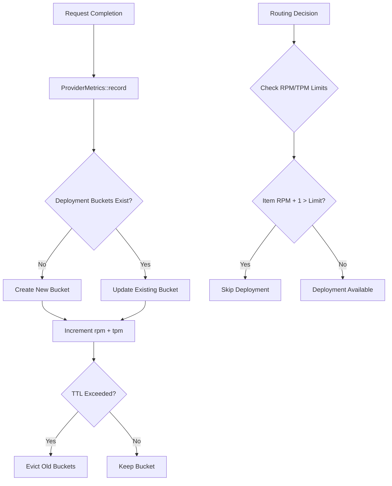

# RFC-0924 (Economics): Provider Metrics Bucket Tracking

## Status

Accepted (v9 — 2026-05-11)

## Authors

- Author: @cipherocto

## Maintainers

- Maintainer: @cipherocto

## Summary

Define per-minute TPM/RPM bucket tracking per provider deployment for latency-based routing decisions. Tracks requests and tokens per minute with minute-granularity histograms, enabling RPM-aware routing and capacity planning.

## Dependencies

**Requires:**
- RFC-0917: Dual-Mode Query Router (ProviderWithState, LatencyTracker)

**Optional:**
- RFC-0905: Observability and Logging (Prometheus metrics export)

## Motivation

Current `ProviderWithState.current_rpm` and `current_tpm` are simple cumulative counters — they cannot answer questions like "what was my RPM at 2:30pm?" or "is this deployment approaching its limit?"

litellm implements this via bucketed tracking storing `{tpm: N, rpm: N}` per deployment per minute.
Two formats exist in litellm:
- `LowestLatencyLoggingHandler` (lowest_latency.py): `f"{date:hour:minute}"` → `"YYYY-MM-DD-HH-MM"` (e.g., `"2026-05-11-14-30"`)
- `LowestTPMLoggingHandler` (lowest_tpm_rpm.py): `"%H-%M"` → `"HH-MM"` (e.g., `"14-30"`)

This RFC uses `"HH-MM"` format for TPM/RPM tracking (following LowestTPMLoggingHandler pattern), with TTL eviction handling cross-day cleanup.

**Use cases:**
- Latency-based routing with RPM awareness
- Capacity planning and usage trends
- Detecting rate limit approaching before it happens
- Multi-minute rolling averages for stability

## Design Goals

| Goal | Target | Metric |
|------|--------|--------|
| G1 | O(1) insert per request | record() must not scan buckets |
| G2 | Memory bounded | TTL eviction prevents unbounded growth |
| G3 | Minute-accurate | Query can retrieve exact minute's stats |

## Specification

### System Architecture



**Key observation from litellm:** The bucket key uses `f"{model_group}_map"` format, and the current minute's RPM/TPM includes the in-flight request (+1 for RPM, +input_tokens for TPM). This is critical for limit checking.

### Data Structures

```rust
use std::collections::HashMap;
use std::time::{Duration, Instant};

/// Provider metrics with minute-bucket tracking
/// Key: deployment_id (matches litellm's id-based tracking)
/// Value: HashMap<minute_key, BucketStats>
struct ProviderMetrics {
    buckets: HashMap<String, HashMap<String, BucketStats>>,
    /// TTL for bucket entries (default: 60 seconds per litellm RoutingArgs.ttl)
    /// litellm LowestTPMLoggingHandler uses ttl=60 (1 * 60), not 60 minutes.
    /// Short TTL is critical: HH-MM format repeats daily, so 60-min TTL would cause
    /// cross-day bucket collisions. With 60-second TTL, collisions are prevented.
    ttl_seconds: u32,
    /// When each bucket was created (for TTL eviction)
    bucket_timestamps: HashMap<String, HashMap<String, Instant>>,
}

struct BucketStats {
    tpm: u64,  // tokens per minute (u64: supports high-traffic deployments)
    rpm: u64,  // requests per minute (u64: supports high-frequency deployments)
}

impl ProviderMetrics {
    /// Record a request completion
    /// Note: RPM/TPM should be incremented BEFORE limit check (litellm pattern)
    pub fn record(&mut self, deployment_id: &str, tokens: u32) {
        let minute = Self::current_minute_key();
        let now = Instant::now();

        let stats = self.buckets
            .entry(deployment_id.to_string())
            .or_default()
            .entry(minute.clone())
            .or_default();

        // Increment counters (litellm pattern: increment THEN check limits)
        stats.tpm = stats.tpm.saturating_add(tokens as u64);
        stats.rpm = stats.rpm.saturating_add(1);

        // Track creation time for TTL
        let timestamps = self.bucket_timestamps
            .entry(deployment_id.to_string())
            .or_default();
        timestamps.entry(minute).or_insert(now);

        // Evict old buckets periodically (every 10 calls per deployment, probabilistic)
        // This prevents unbounded bucket growth without scanning on every call
        if self.bucket_timestamps.get(deployment_id)
            .map(|ts| ts.len() % 10 == 0)
            .unwrap_or(false)
        {
            self.evict_old_buckets_for(deployment_id);
        }
    }

    /// Evict buckets older than ttl_seconds for a specific deployment
    pub fn evict_old_buckets_for(&mut self, deployment_id: &str) {
        let now = Instant::now();
        let ttl = Duration::from_secs(self.ttl_seconds as u64);  // ttl_seconds is already in seconds

        if let Some(buckets) = self.buckets.get_mut(deployment_id) {
            if let Some(timestamps) = self.bucket_timestamps.get_mut(deployment_id) {
                buckets.retain(|minute_key, _| {
                    timestamps.get(minute_key)
                        .map(|created| now.duration_since(*created) < ttl)
                        .unwrap_or(false)
                });
                timestamps.retain(|minute_key, _| {
                    buckets.contains_key(minute_key)
                });
            }
        }
    }

    /// Get RPM for a specific deployment at a specific minute
    pub fn rpm_at(&self, deployment_id: &str, minute: &str) -> Option<u64> {
        self.buckets.get(deployment_id)?
            .get(minute)?
            .rpm
    }

    /// Get TPM for a specific deployment at a specific minute
    pub fn tpm_at(&self, deployment_id: &str, minute: &str) -> Option<u64> {
        self.buckets.get(deployment_id)?
            .get(minute)?
            .tpm
    }

    /// Get current minute RPM for a deployment
    pub fn current_rpm(&self, deployment_id: &str) -> u64 {
        let minute = Self::current_minute_key();
        self.rpm_at(deployment_id, &minute).unwrap_or(0)
    }

    /// Get current minute TPM for a deployment
    pub fn current_tpm(&self, deployment_id: &str) -> u64 {
        let minute = Self::current_minute_key();
        self.tpm_at(deployment_id, &minute).unwrap_or(0)
    }

    /// Check if deployment can accept a new request (limit check)
    /// Returns true if deployment is within limits
    pub fn can_accept_request(
        &self,
        deployment_id: &str,
        rpm_limit: u64,
        tpm_limit: u64,
        input_tokens: u64,
    ) -> bool {
        let current_rpm = self.current_rpm(deployment_id);
        let current_tpm = self.current_tpm(deployment_id);

        // Litellm pattern: item_rpm + 1 > _deployment_rpm means "would exceed"
        // So can_accept is true only if (current + 1) <= limit
        (current_rpm + 1) <= rpm_limit && (current_tpm + input_tokens) <= tpm_limit
    }

    /// Get rolling average RPM over N minutes
    pub fn rolling_avg_rpm(&self, deployment_id: &str, minutes: u32) -> Option<f32> {
        let buckets = self.buckets.get(deployment_id)?;
        let now = Instant::now();
        let cutoff = now - Duration::from_secs(minutes as u64 * 60);

        let recent: Vec<u64> = buckets
            .iter()
            .filter(|(minute_key, _)| {
                // Check if bucket is within the time window
                if let Some(created) = self.bucket_timestamps
                    .get(deployment_id)
                    .and_then(|ts| ts.get(*minute_key))
                {
                    *created >= cutoff
                } else {
                    false
                }
            })
            .map(|(_, stats)| stats.rpm)
            .collect();

        if recent.is_empty() {
            return None;
        }

        let sum: u64 = recent.iter().sum();
        Some(sum as f32 / recent.len() as f32)
    }

    /// Get rolling average TPM over N minutes
    pub fn rolling_avg_tpm(&self, deployment_id: &str, minutes: u32) -> Option<f32> {
        let buckets = self.buckets.get(deployment_id)?;
        let now = Instant::now();
        let cutoff = now - Duration::from_secs(minutes as u64 * 60);

        let recent: Vec<u64> = buckets
            .iter()
            .filter(|(minute_key, _)| {
                if let Some(created) = self.bucket_timestamps
                    .get(deployment_id)
                    .and_then(|ts| ts.get(*minute_key))
                {
                    *created >= cutoff
                } else {
                    false
                }
            })
            .map(|(_, stats)| stats.tpm)
            .collect();

        if recent.is_empty() {
            return None;
        }

        let sum: u64 = recent.iter().sum();
        Some(sum as f32 / recent.len() as f32)
    }

    /// Get current minute key
    /// Format: "HH-MM" (hour-minute in local time), following LowestTPMLoggingHandler pattern
    /// (LowestLatencyLoggingHandler uses "YYYY-MM-DD-HH-MM" format, but this RFC uses HH-MM for TPM/RPM tracking)
    /// Time source: SystemTime for wall-clock, local time (matches litellm's datetime.now().strftime("%H-%M"))
    fn current_minute_key() -> String {
        let now = std::time::SystemTime::now()
            .duration_since(std::time::UNIX_EPOCH)
            .unwrap();
        let total_secs = now.as_secs();

        // Get local time (offset from UTC)
        // litellm uses datetime.now().strftime("%H-%M") which is LOCAL time
        let offset_secs: i64 = 0; // Placeholder: in production, get from timezone config
        let local_secs = (total_secs as i64 + offset_secs).abs() as u64;
        let secs_in_day = local_secs % 86400;
        let hour = (secs_in_day / 3600) as u32;
        let minute = ((secs_in_day % 3600) / 60) as u32;

        format!("{:02}-{:02}", hour, minute)
    }

    /// Evict buckets older than ttl_seconds
    pub fn evict_old_buckets(&mut self) {
        let now = Instant::now();
        let ttl = Duration::from_secs(self.ttl_seconds as u64);  // ttl_seconds is already in seconds

        for (deployment_id, buckets) in self.buckets.iter_mut() {
            if let Some(timestamps) = self.bucket_timestamps.get_mut(deployment_id) {
                buckets.retain(|minute_key, _| {
                    timestamps.get(minute_key)
                        .map(|created| now.duration_since(*created) < ttl)
                        .unwrap_or(false)
                });
                timestamps.retain(|minute_key, _| {
                    buckets.contains_key(minute_key)
                });
            }
        }
    }
}
```

### Query API

```rust
impl ProviderMetrics {
    /// Get RPM at specific minute
    pub fn rpm_at(&self, deployment_id: &str, minute: &str) -> Option<u64>

    /// Get TPM at specific minute
    pub fn tpm_at(&self, deployment_id: &str, minute: &str) -> Option<u64>

    /// Get current minute RPM
    pub fn current_rpm(&self, deployment_id: &str) -> u64

    /// Get current minute TPM
    pub fn current_tpm(&self, deployment_id: &str) -> u64

    /// Check if deployment can accept new request
    pub fn can_accept_request(&self, deployment_id: &str, rpm_limit: u64, tpm_limit: u64, input_tokens: u64) -> bool

    /// Get rolling average RPM over N minutes
    pub fn rolling_avg_rpm(&self, deployment_id: &str, minutes: u32) -> Option<f32>

    /// Get rolling average TPM over N minutes
    pub fn rolling_avg_tpm(&self, deployment_id: &str, minutes: u32) -> Option<f32>
}
```

## Key Files to Modify

| File | Change |
|------|--------|
| `crates/quota-router-core/src/router.rs` | Add `ProviderMetrics` struct and `BucketStats` |

## Implementation Notes

**Time source:** Use `std::time::SystemTime` for bucket keys (wall-clock), `Instant` for TTL tracking (monotonic). Both are consistent — `Instant` is used for both recording timestamps AND computing rolling average cutoff. `SystemTime` is only used for generating the "HH-MM" bucket key string.

**Automatic TTL eviction:** `evict_old_buckets_for()` is called probabilistically (every 10th call per deployment) to prevent O(n) global scans. For higher throughput, a background task can call `evict_old_buckets()` periodically.

**Litellm compatibility:** litellm uses `f"{model_group}_map"` as the cache key, with `id` (deployment model_info.id) as the inner key. Our struct uses deployment_id directly, which is equivalent.

**Limit check pattern:** Litellm checks `(item_rpm + 1 > rpm_limit)` BEFORE routing, meaning in-flight requests are counted. Our `can_accept_request` follows this pattern.

## Open Questions

- Should buckets be stored in-memory or persisted to DB (stoolap)?
- Integration point: does this belong in `ProviderWithState` or `LatencyTracker` or standalone?
- What's the max deployments we need to track? (affects memory bounds)

## Version History

| Version | Date | Changes |
|---------|------|---------|
| 9 | 2026-05-11 | Fix: TTL changed from 60 minutes to 60 seconds (per litellm RoutingArgs.ttl=60) to prevent cross-day HH-MM bucket collisions; current_minute_key now uses local time (not UTC) per litellm datetime.now(); evict_old_buckets uses ttl_seconds directly (not * 60); updated TTL documentation to explain collision prevention |
| 8 | 2026-05-11 | Fix: clarify litellm uses TWO bucket formats (LowestLatencyLoggingHandler uses YYYY-MM-DD-HH-MM, LowestTPMLoggingHandler uses HH-MM); update motivation to explain both formats; fix current_minute_key comment to reference specific handler |
| 6 | 2026-05-11 | Fix: all `rpm`/`tpm` methods changed from `u32` to `u64` to match `BucketStats` storage; `can_accept_request` parameters updated to `u64` |
| 5 | 2026-05-11 | Fix: correct `current_minute_key` to "HH-MM" format per litellm (litellm uses HH-MM only, not YYYY-MM-DD-HH-MM; TTL eviction handles cross-day cleanup); use SystemTime for UTC wall-clock |
| 4 | 2026-05-11 | Fix: implement missing `tpm_at` and `rolling_avg_tpm`; change `BucketStats` to u64 to handle high-traffic deployments; fix `current_minute_key` comment explaining the placeholder and real calendar math needed |
| 3 | 2026-05-11 | Fix: add `can_accept_request` following litellm's increment-THEN-check pattern; add `current_rpm/tpm` helpers; clarify bucket key format matches litellm's id-based tracking |
| 2 | 2026-05-11 | Fix: use std::time not chrono; TTL eviction needs created_at tracking |
| 1 | 2026-05-11 | Initial draft |