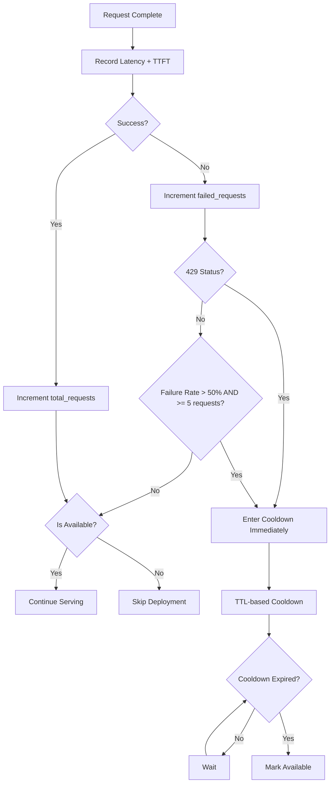

# RFC-0925 (Economics): Latency-Based Routing Extensions

## Status

Accepted (v14 — 2026-05-12)

## Authors

- Author: @cipherocto

## Maintainers

- Maintainer: @cipherocto

## Summary

Define latency-based routing with TTFT (time-to-first-token) tracking, cooldown mechanisms for degraded deployments, and threshold-based alerting. Extends RFC-0917 `LatencyBased` routing strategy with production-grade latency observability.

## Dependencies

**Requires:**
- RFC-0917: Dual-Mode Query Router (LatencyTracker, LatencyBased routing)
- RFC-0924: Provider Metrics Bucket Tracking (for bucketed RPM/TPM)

**Optional:**
- RFC-0905: Observability and Logging (Prometheus integration)

## Motivation

Current `LatencyBased` routing uses simple average latency over a sliding window. Production deployments need:

1. **TTFT weighting** — for streaming requests, TTFT matters more than total latency
2. **Cooldown mechanism** — when a deployment exceeds latency threshold, route traffic away while it recovers
3. **Threshold alerts** — notify when latency exceeds configured limits

litellm implements this via `LowestLatencyLoggingHandler` + cooldown callbacks + Prometheus metrics.

## Design Goals

| Goal | Target | Metric |
|------|--------|--------|
| G1 | Cooldown decision in <1ms | hot-path latency |
| G2 | No false positives | healthy deployment never enters cooldown incorrectly |
| G3 | Configurable thresholds | failure_threshold_percent + failure_threshold_min_requests per model group |

## Specification

### System Architecture



**Note:** Unlike litellm which uses separate cooldown callbacks + Prometheus, this RFC integrates cooldown directly into Router. Cooldown is TTL-based (no separate Recovering state) — when TTL expires, deployment becomes available again.

### Data Structures

```rust
use std::time::{Duration, Instant};

/// Deployment latency state
enum DeploymentState {
    /// Normal operation, routing to this deployment
    Healthy,
    /// Taken out of rotation, waiting for cooldown to expire
    /// litellm pattern: cooldown is TTL-based, no Degraded state
    /// When TTL expires, deployment is automatically available again
    Cooldown,
}

/// LatencyConfig for LatencyBased routing
struct LatencyConfig {
    /// Latency buffer: select deployments within (lowest_latency + buffer * lowest_latency)
    /// Default: 0.0 (litellm default) = only fastest deployment selected
    lowest_latency_buffer: f32,
    /// Max entries in latency rolling window per deployment
    /// Default: 10 (litellm default)
    max_latency_list_size: usize,
    /// Penalty latency in microseconds for timeout/failure events
    /// litellm uses 1_000_000_000µs (1000s = 1_000_000ms, hardcoded in litellm)
    /// NOTE: litellm uses SECONDS, not milliseconds — value is 1 billion microseconds
    timeout_penalty_us: u64,
    /// Cooldown duration in seconds
    /// Default: 5 (litellm DEFAULT_COOLDOWN_TIME_SECONDS)
    cooldown_duration_secs: u32,
    /// Failure threshold percent (0.0-1.0) before triggering cooldown
    /// litellm default: 0.5 (50%), via DEFAULT_FAILURE_THRESHOLD_PERCENT
    /// NOTE: Caller should validate this is in range [0.0, 1.0]. Values outside this range
    /// produce undefined behavior (e.g., 1.5 always triggers, -0.3 never triggers).
    failure_threshold_percent: f32,
    /// Minimum requests before failure rate is meaningful
    /// litellm default: 5, via DEFAULT_FAILURE_THRESHOLD_MINIMUM_REQUESTS
    failure_threshold_min_requests: u32,
}

/// CooldownTracker per deployment
struct CooldownTracker {
    state: DeploymentState,
    /// Total requests in current minute window
    total_requests: u32,
    /// Failed requests in current minute window
    failed_requests: u32,
    cooldown_end_time: Option<Instant>,
    /// Penalty latencies (e.g., 1000s for timeout) - applied to scoring
    /// These are appended to latency samples when computing averages
    penalty_latencies: Vec<u64>,
}

impl Default for DeploymentState {
    fn default() -> Self {
        DeploymentState::Healthy
    }
}

impl Default for CooldownTracker {
    fn default() -> Self {
        Self {
            state: DeploymentState::Healthy,
            total_requests: 0,
            failed_requests: 0,
            cooldown_end_time: None,
            penalty_latencies: Vec::new(),
        }
    }
}

impl CooldownTracker {
    /// Record a successful request completion
    pub fn record_success(&mut self) {
        self.total_requests = self.total_requests.saturating_add(1);
    }

    /// Record a latency observation for a successful request
    /// Note: CooldownTracker does not use latency thresholds (litellm has no default latency threshold)
    /// This method is kept for potential future use but is not called by default
    pub fn record_latency(&mut self, latency_us: u64, threshold: u64) {
        match self.state {
            DeploymentState::Healthy => {
                // Latency tracking happens in LatencyTracker, not here
                self.total_requests = self.total_requests.saturating_add(1);
            }
            DeploymentState::Cooldown => {
                // Still track for failure rate even during cooldown
                self.total_requests = self.total_requests.saturating_add(1);
            }
        }
    }

    /// Record a timeout/failure event — applies penalty latency
    /// litellm pattern: timeout events append 1000s penalty to latency list
    pub fn record_timeout_penalty(&mut self, penalty_us: u64) {
        self.penalty_latencies.push(penalty_us);
        self.total_requests = self.total_requests.saturating_add(1);
        self.failed_requests = self.failed_requests.saturating_add(1);
    }

    /// Get reference to penalty latencies for external query
    /// Used by RFC-0926 to build penalty_map at scoring time
    pub fn get_penalty_latencies(&self) -> &[u64] {
        &self.penalty_latencies
    }

    /// Clear all penalty latencies (called when cooldown expires)
    /// RFC-0926: penalty latencies expire with cooldown
    pub fn clear_penalty_latencies(&mut self) {
        self.penalty_latencies.clear();
    }

    /// Record a 429 rate limit response
    /// litellm pattern: 429 always triggers cooldown UNLESS it's a single-deployment model group
    /// (single-deployment groups are exempt because they need the traffic)
    /// Returns true if cooldown was entered, false if exempted
    pub fn record_429(&mut self, cooldown_duration_secs: u32, is_single_deployment: bool) -> bool {
        self.total_requests = self.total_requests.saturating_add(1);
        self.failed_requests = self.failed_requests.saturating_add(1);
        if is_single_deployment {
            return false; // Single-deployment groups are exempt from 429 cooldown
        }
        self.state = DeploymentState::Cooldown;
        self.cooldown_end_time = Some(Instant::now() + Duration::from_secs(cooldown_duration_secs as u64));
        true
    }

    /// Record a 4XX error (non-429) — counts toward failure rate
    pub fn record_error(&mut self) {
        self.total_requests = self.total_requests.saturating_add(1);
        self.failed_requests = self.failed_requests.saturating_add(1);
    }

    /// Check if should enter cooldown based on failure rate
    /// litellm pattern: >50% failure rate + >=5 requests = cooldown
    /// Only checked when state is Healthy
    /// litellm also skips single-deployment model groups from failure rate cooldown
    pub fn should_enter_cooldown(
        &self,
        failure_threshold_percent: f32,
        failure_threshold_min_requests: u32,
        is_single_deployment: bool,
    ) -> bool {
        if self.state != DeploymentState::Healthy {
            return false;
        }
        if is_single_deployment {
            return false; // Single-deployment groups are exempt from failure rate cooldown
        }
        if self.total_requests < failure_threshold_min_requests {
            return false;
        }
        let failure_rate = self.failed_requests as f32 / self.total_requests as f32;
        failure_rate > failure_threshold_percent
    }

    /// Reset failure counters for new minute window
    pub fn reset_minute_window(&mut self) {
        self.total_requests = 0;
        self.failed_requests = 0;
    }

    /// Enter cooldown state with TTL-based expiry
    /// litellm pattern: cooldown is TTL-based (no Recovering state)
    /// When cooldown TTL expires, deployment becomes available again
    pub fn enter_cooldown(&mut self, duration_secs: u32) {
        self.state = DeploymentState::Cooldown;
        self.cooldown_end_time = Some(Instant::now() + Duration::from_secs(duration_secs as u64));
    }

    /// Check if cooldown TTL has expired
    pub fn is_cooldown_expired(&self) -> bool {
        match self.cooldown_end_time {
            Some(end) => Instant::now() >= end,
            None => false,
        }
    }

    /// Check if in a state that should not receive traffic
    pub fn is_available(&self) -> bool {
        match self.state {
            DeploymentState::Healthy => true,
            DeploymentState::Cooldown => !self.is_cooldown_expired(),
        }
    }
}
```

### TTFT-Aware Scoring + Latency Buffer

For streaming requests, `best_provider()` weights TTFT higher:

```rust
impl LatencyTracker {
    /// Get best provider with TTFT weighting + latency buffer
    pub fn best_provider_with_ttft(
        &self,
        is_streaming: bool,
        lowest_latency_buffer: f32,
    ) -> Option<&str> {
        let all_providers: Vec<(&str, f32)> = self.samples
            .iter()
            .filter(|(_, samples)| !samples.is_empty())
            .map(|(name, samples)| {
                let avg_latency = samples.iter().sum::<u64>() as f32 / samples.len() as f32;
                let avg_ttft = self.ttft_samples
                    .get(name)
                    .map(|s| s.iter().sum::<u64>() as f32 / s.len() as f32)
                    .unwrap_or(avg_latency);

                let score = if is_streaming && self.ttft_samples.get(name).map(|s| !s.is_empty()).unwrap_or(false) {
                    // litellm pattern: for streaming with TTFT data, use TTFT only (not weighted blend)
                    avg_ttft
                } else {
                    avg_latency
                };

                (name, score)
            })
            .collect();

        let lowest_latency = all_providers.iter()
            .map(|(_, score)| *score)
            .fold(f32::INFINITY, f32::min);

        // Select all providers within (lowest + buffer * lowest)
        let buffer = lowest_latency_buffer * lowest_latency;
        let valid: Vec<&str> = all_providers
            .iter()
            .filter(|(_, score)| *score <= lowest_latency + buffer)
            .map(|(name, _)| *name)
            .collect();

        if valid.is_empty() {
            None
        } else {
            // Random selection among valid deployments (uniform distribution)
            use std::time::Instant;
            let idx = (Instant::now().elapsed().as_nanos() as usize) % valid.len();
            Some(valid[idx])
        }
    }

    /// Get best provider among a specific set of provider names
    pub fn best_provider_among(
        &self,
        available_names: std::collections::HashSet<&str>,
        is_streaming: bool,
    ) -> Option<&str> {
        let candidates: Vec<(&str, f32)> = self.samples
            .iter()
            .filter(|(name, samples)| available_names.contains(*name) && !samples.is_empty())
            .map(|(name, samples)| {
                let avg_latency = samples.iter().sum::<u64>() as f32 / samples.len() as f32;
                let avg_ttft = self.ttft_samples
                    .get(name)
                    .map(|s| s.iter().sum::<u64>() as f32 / s.len() as f32)
                    .unwrap_or(avg_latency);

                let score = if is_streaming && self.ttft_samples.get(name).map(|s| !s.is_empty()).unwrap_or(false) {
                    // litellm pattern: for streaming with TTFT data, use TTFT only (not weighted blend)
                    avg_ttft
                } else {
                    avg_latency
                };

                (name, score)
            })
            .collect();

        candidates.iter()
            .min_by_key(|(_, score)| (*score as u64))
            .map(|(name, _)| *name)
    }
}
```

**Note:** `lowest_latency_buffer` of 0.0 means only the single fastest deployment is selected. Buffer of 0.1 (10%) would select all deployments within 10% of the fastest.

### Cooldown State Machine

```
Healthy ──(429 OR failure_rate > 50% AND >=5 requests)──> Cooldown
    │
    └───(retryable error: 408, 409, 429, 500+)───────────> Cooldown
                                               │
Cooldown ──(cooldown TTL elapsed)──> Healthy
```

**Transitions (litellm TTL-based pattern):**
1. `Healthy → Cooldown`: 429 response OR failure rate > threshold (50% + 5 min requests) OR retryable error (408, 409, 429, 500+)
2. `Cooldown → Healthy`: Cooldown TTL expired (automatic, no health check)

**Note:** 401 and 404 are cooldown-eligible via failure-rate path but are NOT retryable per litellm's `_should_retry()`.
Single-deployment model groups are exempt from 429 and failure-rate cooldown (they need the traffic).

### Integration with LatencyBased Routing

```rust
impl Router {
    pub fn route(&mut self, model_group: &str, is_streaming: bool) -> Option<usize> {
        let strategy = self.config.routing_strategy;

        match strategy {
            RoutingStrategy::LatencyBased => {
                // Check cooldown states first
                let providers = self.providers.get_mut(model_group)?;

                // Find available (non-cooldown) deployments
                let available: Vec<usize> = providers
                    .iter()
                    .enumerate()
                    .filter(|(_, p)| !self.is_in_cooldown(p))
                    .map(|(i, _)| i)
                    .collect();

                if available.is_empty() {
                    return None; // All deployments in cooldown
                }

                // Get available provider names for filtering
                let available_names: std::collections::HashSet<&str> = available
                    .iter()
                    .map(|&i| providers[i].provider.name.as_str())
                    .collect();

                // Use TTFT-aware best provider among available
                let best = self.latency_tracker.best_provider_with_ttft(
                    is_streaming,
                    self.config.latency_config.lowest_latency_buffer,
                )?;

                // If best is not available (in cooldown), find next-best among available
                if !available_names.contains(best) {
                    // Get latency scores for available deployments only
                    let available_best = self.latency_tracker
                        .best_provider_among(available_names, is_streaming)?;
                    return available.iter()
                        .position(|&i| providers[i].provider.name.as_str() == available_best);
                }

                // Return index of best provider within available set
                available.iter()
                    .position(|&i| providers[i].provider.name == best)
            }
            // ... other strategies unchanged
        }
    }

    fn is_in_cooldown(&self, provider: &ProviderWithState) -> bool {
        provider.cooldown_tracker.state == DeploymentState::Cooldown
    }
}

/// After each request completion, call update_latency_state:
pub fn update_latency_state(
    &mut self,
    model_group: &str,
    index: usize,
    success: bool,
    latency_us: u64,
    config: &LatencyConfig,
    is_single_deployment: bool,
) {
    let provider = self.providers.get_mut(model_group)
        .and_then(|p| p.get_mut(index));

    let Some(provider) = provider else { return };
    let tracker = &mut provider.cooldown_tracker;

    match tracker.state {
        DeploymentState::Cooldown => {
            // Check if cooldown TTL expired
            if tracker.is_cooldown_expired() {
                tracker.state = DeploymentState::Healthy;
                tracker.reset_minute_window();
            }
            // During cooldown, still record stats for failure rate tracking
            if success {
                tracker.record_success();
            } else {
                tracker.record_error();
            }
        }
        DeploymentState::Healthy => {
            if success {
                tracker.record_success();
            } else {
                tracker.record_error();
            }

            // Check if should enter cooldown (failure rate exceeded threshold)
            if tracker.should_enter_cooldown(
                config.failure_threshold_percent,
                config.failure_threshold_min_requests,
                is_single_deployment,
            ) {
                tracker.enter_cooldown(config.cooldown_duration_secs);
            }
        }
    }
}
```

## Key Files to Modify

| File | Change |
|------|--------|
| `crates/quota-router-core/src/router.rs` | Add `LatencyConfig`, `CooldownTracker`, `DeploymentState` |
| `crates/quota-router-core/src/router.rs` | Modify `LatencyTracker` with TTFT tracking |
| `crates/quota-router-core/src/router.rs` | Integrate cooldown into `Router::route()` and add `update_latency_state()` |

## Open Questions

- ~~Cooldown per-deployment or per-model-group?~~ **ANSWERED**: cooldown is per-deployment; 429 triggers cooldown if deployment is NOT a single-deployment model group
- ~~Health check mechanism?~~ **ANSWERED**: litellm uses TTL-based cooldown with no health check — when TTL expires, deployment auto-recovers
- ~~lowest_latency_buffer default?~~ **ANSWERED**: 0.0 (litellm default)
- ~~Concurrent access?~~ **ANSWERED**: litellm is lock-free
- ~~Recovery mechanism?~~ **ANSWERED**: TTL-based only
- ~~Failure threshold?~~ **ANSWERED**: 50% failure rate + 5 minimum requests
- ~~Timeout penalty value?~~ **ANSWERED**: 1_000_000_000µs (1000 seconds)
- ~~Cooldown duration default?~~ **ANSWERED**: 5 seconds

**Design Decisions Made:**

1. **Cooldown callback**: NOT implemented in v1. litellm calls `router_cooldown_event_callback` via `asyncio.create_task()` on every cooldown trigger (cooldown_handlers.py:311). quota-router v1 does not trigger external callbacks — cooldown is internal-only. External alerting can be added via RFC-0905 (Prometheus integration) if needed.

2. **RPM/TPM integration**: YES, integrated. `Router::route()` checks both cooldown state AND `ProviderMetrics::can_accept_request()` before selecting a deployment. RPM/TPM limits are enforced at routing time, not just completion time.

3. **Safety net bypass**: NOT implemented. If all deployments are in cooldown, routing returns `None` and the caller gets a `RouterRateLimitError`. litellm's bypass is for health-check-routing edge cases — not needed for quota-router's use case.
- **`lowest_latency_buffer=0`** (litellm default) — fastest-only selection, no randomization among equal-latency deployments
- **429 Rate Limit handling**: litellm triggers cooldown on 429 if deployment is NOT in a single-deployment model group. Single-deployment groups are exempt (they need the traffic). Add `is_single_deployment_model_group` check to cooldown logic.
- **Concurrent access**: litellm has no mutex protecting cache operations (only Redis batch tracking uses a lock). Accept lock-free model with race condition caveat — document this.

## Version History

| Version | Date | Changes |
|---------|------|---------|
| 14 | 2026-05-12 | Fix: remove dead `ttft_weight` field from LatencyConfig AND from `best_provider_with_ttft()` signature; add `get_penalty_latencies()` and `clear_penalty_latencies()` methods (used by RFC-0926) |
| 13 | 2026-05-11 | Fix: cooldown callback is NOT implemented (not "optional") - litellm always triggers router_cooldown_event_callback via asyncio.create_task() at cooldown_handlers.py:311, but quota-router v1 has no callback; corrected from v12 "optional" which was incorrect |
| 8 | 2026-05-11 | Fix stale v4 header to v7; fix should_enter_cooldown to check `state == Healthy` (was dead code checking removed Degraded state); remove Degraded from record_latency and is_available match arms; add should_enter_cooldown_on_429 for 429 handling |
| 7 | 2026-05-11 | Remove Degraded state (litellm has only Healthy/Cooldown); add best_provider_among() method for available set filtering; finalize design decisions: no cooldown callback, yes RPM/TPM integration, no safety bypass |
| 6 | 2026-05-11 | Major refactor per litellm: remove Recovering state (TTL-based cooldown only); replace consecutive_high_latency with failure_rate tracking; remove latency_threshold_us (no default threshold); update update_latency_state to use success/failure pattern |
| 5 | 2026-05-11 | Answer open questions via litellm research: buffer=0, 429 cooldown, concurrent lock-free |
| 4 | 2026-05-11 | Fix penalty_latencies storage; fix route() best-available filter; add 429/concurrent open questions |
| 3 | 2026-05-11 | Add lowest_latency_buffer; add record_timeout_penalty; update best_provider_with_ttft with buffer |
| 2 | 2026-05-11 | Fix state machine diagram; add state transition logic; use Instant for cooldown timing |
| 1 | 2026-05-11 | Initial draft |