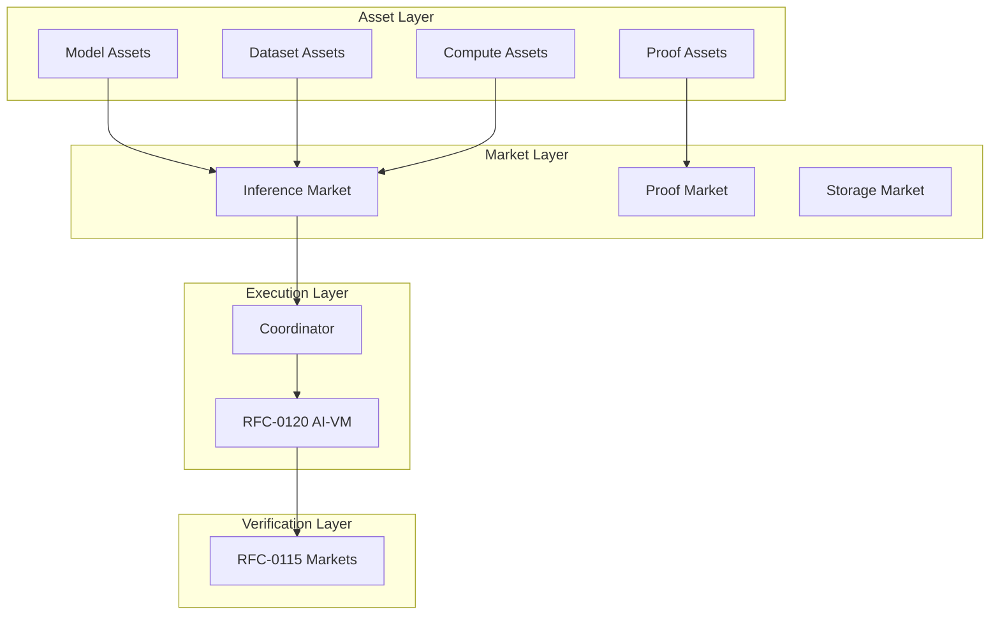

# RFC-0955: Model Liquidity Layer

## Status

Accepted 2026-07-27 (promoted from Draft after RFC-0955 + RFC-0955-R1 multi-round adversarial review converged at round 5). The on-chain reputation anchoring binding is defined in the sibling Draft
RFC `rfcs/draft/economics/0955-r1-reputation-anchoring.md` (RFC-0955-R1,
Draft), promoted from a previously in-file block at lines 912-1023
(pre-2026-07-27 revision) into its own Draft RFC per BLUEPRINT RFC-lifecycle
stage `Draft`. The promotion of RFC-0955-R1 to Accepted requires RFC-0968
acceptance; the promotion of RFC-0955 to Accepted is independent. The full
anchoring binding requires both Accepted.

The on-chain reputation anchoring binding is defined in the sibling Draft
RFC `rfcs/draft/economics/0955-r1-reputation-anchoring.md` (RFC-0955-R1,
Draft), promoted from a previously in-file block at lines 912-1023
(pre-2026-07-27 revision) into its own Draft RFC per BLUEPRINT RFC-lifecycle
stage `Draft`. The promotion of RFC-0955-R1 to Accepted requires RFC-0968
acceptance; the promotion of RFC-0955 to Accepted is independent. The full
anchoring binding requires both Accepted.

> **Note:** This RFC was renumbered from RFC-0125 to RFC-0955 as part of the category-based numbering system.

## Authors

- Author: @cipherocto
- Author: @mmacedoeu

## Maintainers

- Maintainer: @cipherocto
- Maintainer: @mmacedoeu

## Summary

This RFC introduces the **Model Liquidity Layer (MLL)** — an economic infrastructure enabling fractional ownership of AI models, decentralized trading of model shards, markets for inference compute and proof generation, and automated revenue distribution. The layer treats models, datasets, compute, and proofs as tokenized financial primitives, creating a complete decentralized AI economy where assets can be composed, traded, and verified on-chain.

## Design Goals

| Goal                       | Target                        | Metric           |
| -------------------------- | ----------------------------- | ---------------- |
| **G1: Asset Tokenization** | All AI primitives tokenized   | 4 asset types    |
| **G2: Market Efficiency**  | Sub-minute market matching    | <60s allocation  |
| **G3: Revenue Automation** | Automatic distribution        | 100% on-chain    |
| **G4: Composability**      | Models build on models        | Lineage tracking |
| **G5: Liquidity**          | Stable pools for major assets | >$10M TVL target |

## Motivation

### The Problem: Static AI Assets

Current AI infrastructure treats models and datasets as static assets:

| Issue                  | Impact                                   |
| ---------------------- | ---------------------------------------- |
| Centralized ownership  | Few companies control frontier models    |
| Closed datasets        | Valuable data locked in silos            |
| Unverifiable inference | AI outputs cannot be proven correct      |
| Compute monopolies     | GPU clusters controlled by few providers |

### The Solution: Liquidity Layer

The Model Liquidity Layer turns AI primitives into programmable financial assets:

```
Models → Tokenized ownership
Datasets → Tradable assets
Compute → Market-allocated
Proofs → Reusable commodities
```

### Why This Matters for CipherOcto

1. **Democratized model ownership** — Fractional ownership of frontier models
2. **Data economy** — Dataset creators earn royalties
3. **Compute markets** — Fair pricing for inference
4. **Proof markets** — Competitive proof generation

## Specification

### Core Asset Types

The system defines four primary asset classes:

```rust
/// Primary asset types in the Model Liquidity Layer
enum AssetType {
    /// Tokenized ownership of an AI model
    ModelAsset,

    /// Tradable dataset with provenance
    DatasetAsset,

    /// Compute execution capacity
    ComputeAsset,

    /// Verifiable computation proofs
    ProofAsset,
}
```

### Model Assets

Model assets represent ownership of complete models:

```rust
struct ModelAsset {
    /// Unique model identifier
    model_id: Digest,

    /// Model commitment root
    model_root: Digest,

    /// Layer topology
    layer_topology: LayerGraph,

    /// Shard mapping
    shard_map: Vec<ShardAssignment>,

    /// Owner shares (must sum to 1.0)
    owners: Vec<OwnershipShare>,

    /// Governance configuration
    governance: GovernanceConfig,

    /// Revenue distribution contract
    revenue_contract: Address,
}

struct OwnershipShare {
    /// Owner identity (EOA or contract)
    owner: PublicKey,

    /// Ownership percentage
    share_percent: f64,

    /// Lock-up period (if any)
    locked_until: Option<Timestamp>,
}
```

#### Example Ownership Structure

```rust
// Model: GPT-X (1T parameters)
let gpt_x = ModelAsset {
    model_id: digest("gpt-x-v1"),
    owners: vec![
        OwnershipShare { owner: alice, share_percent: 30.0 },
        OwnershipShare { owner: bob, share_percent: 25.0 },
        OwnershipShare { owner: dao_address, share_percent: 45.0 },
    ],
    // ...
};
```

### Model Shard Tokens

Individual shards become tradeable tokens:

```rust
struct ShardToken {
    /// Shard identifier
    shard_id: Digest,

    /// Parent model
    model_id: Digest,

    /// Shard commitment root
    shard_root: Digest,

    /// Storage provider
    storage_provider: PublicKey,

    /// Token standard
    standard: TokenStandard::ERC1155,

    /// Total supply (represents storage capacity)
    total_supply: u64,
}

impl ShardToken {
    /// Fractional ownership of shard storage
    fn fractionalize(&self, shares: u64) -> Vec<ShardFraction> {
        // Create fractional shares
    }

    /// Earn storage rewards
    fn claim_storage_reward(&self, period: &StoragePeriod) -> TokenAmount {
        // Reward based on storage duration and availability
    }
}
```

### Dataset Assets

Datasets become licensed, tradable assets:

```rust
struct DatasetAsset {
    /// Dataset identifier
    dataset_id: Digest,

    /// Dataset commitment root
    dataset_root: Digest,

    /// Provenance proof (from RFC-0108)
    provenance_proof: ProvenanceProof,

    /// License configuration
    license: DatasetLicense,

    /// Pricing model
    price_model: PriceModel,

    /// Royalty configuration
    royalty_config: RoyaltyConfig,

    /// Owner
    owner: PublicKey,
}

enum DatasetLicense {
    /// Full commercial usage
    Commercial,

    /// Research only
    ResearchOnly,

    /// Custom terms
    Custom { terms_hash: Digest },
}

enum PriceModel {
    /// Fixed price per access
    Fixed { price_per_access: TokenAmount },

    /// Subscription
    Subscription { monthly_rate: TokenAmount },

    /// Royalty-based
    Royalty { percentage: f64 },

    /// Free with attribution
    Open,
}

struct ProvenanceProof {
    /// Data source commitments
    source_roots: Vec<Digest>,

    /// Transformation lineage
    lineage: Vec<Transformation>,

    /// Creator signature
    creator_signature: Signature,

    /// Timestamp
    created_at: Timestamp,
}
```

### Compute Assets

Compute nodes advertise execution capacity:

```rust
struct ComputeOffer {
    /// Node identity
    node_id: PublicKey,

    /// Hardware type
    hardware: HardwareType,

    /// Available compute units
    compute_units: u64,

    /// Throughput (inferences per hour)
    throughput: u32,

    /// Price per inference
    price_per_inference: TokenAmount,

    /// Geographic region
    region: String,

    /// Reputation digest anchor (Amendment RFC-0955-R1, see
    /// `0955-r1-reputation-anchoring.md`):
    /// 32-byte BLAKE3 binding to `(did, signal_kind, layer,
    /// last_event_id, score_ewma_raw, last_event_unix, samples,
    /// severity_total)`. The previous 8-byte `u64` design was insufficient
    /// to carry the 24-byte Dfp encoding (RFC-0104) or the full tuple
    /// identity required for chain-side idempotency; the field is introduced
    /// as a new type in RFC-0955-R1, not renamed from a live on-chain field
    /// (RFC-0955 was Draft at amendment time).
    reputation: ReputationDigest,

    /// Staked tokens
    stake: TokenAmount,
}

enum HardwareType {
    CPU { cores: u32, memory_gb: u32 },
    GPU { model: String, vram_gb: u32, count: u32 },
    TPU { version: String },
    Cluster { node_count: u32 },
}

/// Reputation anchor binding (Amendment RFC-0955-R1, see
/// `0955-r1-reputation-anchoring.md`).
///
/// Anchors the on-chain binding target for reputation aggregates produced
/// under RFC-0968. Wire format: 32 bytes = `BLAKE3(BLAKE3_REPUTATION_ANCHOR_DOMAIN
/// || did || signal_kind || layer || last_event_id || DfpEncoding::from_dfp(&score_ewma).to_bytes()
/// || last_event_unix_be || samples_be || severity_total_be)`. Binds identity, kind,
/// layer, last event id, score bytes, and provenance counters in one digest —
/// not just the post-EWMA scalar.
///
/// **Endianness (RFC-0955-R1, Round 6 C9):** all `u64` integer fields in the
/// anchor envelope are encoded as **big-endian** (`to_be_bytes`), consistent
/// with the RFC-0968 §4 / §16 rule that integers in CipherOcto wire formats
/// are BE. The previous `to_le_bytes` form was a documentation error; the
/// on-chain contract storage is also BE, so no byte-swap is needed at read
/// time. All `u8` / fixed-width byte slices (`did`, `last_event_id`,
/// `DfpEncoding` 24-byte BLOB) are byte-exact as serialized.
///
/// Tuple key: `(did, signal_kind, layer, last_event_id)` is the chain-level
/// primary key for an anchoring batch transaction; duplicate submissions at
/// the same tuple key MUST return the existing `anchor_tx_hash`
/// (chain-side idempotency, per RFC-0955-R1 §"Chain-Level Idempotency").
///
/// Finality: stored with `chain_block_height`; consumers MUST require minimum
/// confirmation depth `MIN_REPUTATION_ANCHOR_FINALITY_BLOCKS = 12`
/// (= `MIN_FINALITY_BLOCKS` per `crates/octo-reputation/src/constants.rs`)
/// before treating an anchor as final. The constant is `u64` for
/// chain-compatibility with `chain_block_height`.
///
/// Round 7 (persistence-10): DID rotation between snapshot and finality.
/// If a `consume_rotation_receipt` for the anchor's `did` is finalized in
/// the chain BEFORE the anchor's `MIN_FINALITY_BLOCKS`
/// is reached, the anchor submission is invalidated (treated like a reorg
/// that drops the anchor). The anchoring job re-submits the anchor for
/// `new_did` with the post-decay `score_ewma` (the 0.9 decay factor per
/// RFC-0968 §2.1 step 3). If the rotation consumes AFTER the anchor's
/// finality depth, the anchor remains authoritative for the pre-rotation
/// aggregate; the post-rotation aggregate is anchored separately.
/// `ReputationAnchorBatch` carries `rotation_receipt_id: Option<[u8; 32]>`
/// to bind rotation provenance (None for pre-rotation-only anchors; Some
/// for anchors submitted AFTER the rotation consume).
///
/// The 32-byte length is the BLAKE3-256 output. Future BLAKE3 variants
/// (BLAKE3x for 64-byte output) MUST be introduced as a newtype, e.g.
/// `ReputationDigestX64([u8; 64])`, with a paired RFC-0968 §10 +
/// RFC-0955-R1 amendment.
#[repr(transparent)]
#[derive(Clone, Copy, PartialEq, Eq, Serialize, Deserialize)]
pub struct ReputationDigest([u8; 32]);

// Canonical home: `crates/octo-reputation/src/constants.rs`. RFC-0955-R1
// re-exports this constant via `pub use crate::constants::BLAKE3_REPUTATION_ANCHOR_DOMAIN;`.
// Do NOT re-declare here; paired-amendment coupling is a process trap.
#[allow(dead_code)]
pub const BLAKE3_REPUTATION_ANCHOR_DOMAIN_REFERENCE: &[u8] =
    b"cipherocto/reputation/anchor/v1";

// Re-export alias. Canonical home: `crates/octo-reputation/src/constants.rs::MIN_FINALITY_BLOCKS`.
// Type is `u64` (matches `chain_block_height: u64`); the previous `u32` form
// was a documentation bug that prevented drop-in use as a `chain_block_height`
// bound. The 0968 alias `MIN_STAKE_LOCK_CONFIRMATIONS` shares this constant.
#[allow(dead_code)]
pub const MIN_REPUTATION_ANCHOR_FINALITY_BLOCKS_REFERENCE: u64 = 12;

impl ReputationDigest {
    pub fn from_bytes(bytes: [u8; 32]) -> Self { Self(bytes) }
    pub fn as_bytes(&self) -> &[u8; 32] { &self.0 }
}

/// Anchoring batch transaction (Amendment RFC-0955-R1; see
/// `0955-r1-reputation-anchoring.md` for the canonical authority).
///
/// Submitted by the reputation anchoring job
/// (`missions/claimed/0968a-reputation-anchoring.md`) per
/// `(did, signal_kind, layer)` tuple whose `last_event_id` is unanchored.
/// Every anchoring transaction carries a `GovernanceSnapshot` and validates
/// freshness against `MAX_GOVERNANCE_SNAPSHOT_AGE_SECS = 600` per RFC-0968 §3
/// before any registry lookup.
///
/// Field order matches the §"Wire Contract" envelope order
/// (`0955-r1-reputation-anchoring.md`) to reduce reordering bugs at the
/// implementation layer.
#[derive(Debug, Clone, Serialize, Deserialize)]
pub struct ReputationAnchorBatch {
    pub did: [u8; 32],
    pub signal_kind: u8,
    pub layer: u8,
    pub last_event_id: [u8; 32],
    /// Raw 24-byte Dfp encoding of the post-EWMA score, NOT a BLAKE3 digest
    /// of that encoding. The anchor envelope hashes these 24 bytes verbatim
    /// (see `0955-r1-reputation-anchoring.md` §"Wire Contract").
    pub score_ewma_raw: [u8; 24],
    pub last_event_unix: u64,
    pub samples: u64,
    pub severity_total: u64,
    /// Round 7 (persistence-10): optional rotation-receipt binding. `None`
    /// for pre-rotation anchors; `Some(receipt_id)` when the anchor is
    /// submitted after a `consume_rotation_receipt` for the same `did`.
    /// The anchoring job MUST populate this when the anchor is re-submitted
    /// for `new_did` (per the Finality interaction rule above).
    pub rotation_receipt_id: Option<[u8; 32]>,
    pub governance_snapshot: GovernanceSnapshot,
    /// RFC-0968 §28.1 amendment 24 + §21 Review-Round-7
    /// cross-mission-governance #1: the anchor transaction is treated as an
    /// authoritative signature / registration and MUST carry the
    /// governance-set hash and `GOVERNANCE_QUORUM = 3` distinct signatures.
    pub governance_proof: GovernanceProof,
    /// BLAKE3 digest of the active governance-set pubkeys at snapshot time.
    pub governance_set_hash: [u8; 32],
    /// `None` at submission; populated when the anchor reaches
    /// `MIN_FINALITY_BLOCKS` confirmation depth. Set by the chain-side
    /// anchoring job; recorder-side MUST NOT pre-fill.
    pub chain_block_height: Option<u64>,
    pub batch_size: u32,
}

#[derive(Debug, Clone, Serialize, Deserialize)]
pub struct GovernanceSigner {
    /// Ed25519 pubkey (32 bytes). Required so the chain-side contract can
    /// recover which key signed each signature (a sorted-key-set 3-of-3
    /// quorum is fragile under committee rotation).
    pub pubkey: [u8; 32],
    pub signature: [u8; 64],
}

#[derive(Debug, Clone, Serialize, Deserialize)]
pub struct GovernanceProof {
    /// Per-signer signatures. Length `GOVERNANCE_QUORUM = 3`. Each entry
    /// carries the signer's pubkey for active-set-membership recovery.
    /// `governance_set_hash` is the BLAKE3 digest of the active
    /// governance-set pubkeys at snapshot time.
    pub signers: Vec<GovernanceSigner>,
}

#[derive(Debug, Clone, Copy, PartialEq, Eq, Serialize, Deserialize)]
pub struct GovernanceSnapshot {
    pub block_height: u64,
    pub epoch: u64,
    pub finalized_at_unix: u64,
}

struct ComputeMarket {
    /// Active offers
    offers: HashMap<PublicKey, ComputeOffer>,

    /// Pending requests
    requests: Vec<ComputeRequest>,

    /// Matching algorithm
    matcher: MarketMatcher,
}
```

### Proof Assets

Proof generation becomes a tradeable commodity:

```rust
struct ProofJob {
    /// Job identifier
    job_id: Digest,

    /// Execution trace to prove
    trace_hash: Digest,

    /// Required proof type
    proof_type: ProofType,

    /// Generation deadline
    deadline: Timestamp,

    /// Maximum reward
    max_reward: TokenAmount,

    /// Verification level
    level: VerificationLevel,
}

enum ProofType {
    /// Fast fraud proof
    FraudProof,

    /// Full STARK proof
    STARK,

    /// Recursive proof
    Recursive,

    /// Zero-knowledge verification
    ZK,
}

struct ProofAsset {
    /// Proof identifier
    proof_id: Digest,

    /// Root hash being proven
    root_hash: Digest,

    /// Proof data
    proof_data: Vec<u8>,

    /// Verifier contract
    verifier: Address,

    /// Proof size in KB
    size_kb: u32,

    /// Generation timestamp
    created_at: Timestamp,

    /// Reusability
    reusable: bool,
}

impl ProofAsset {
    /// Verify proof
    fn verify(&self, public_inputs: &[Digest]) -> bool {
        // Verify against on-chain verifier
    }

    /// Resell proof (if reusable)
    fn list_for_sale(&mut self, price: TokenAmount) {
        self.reusable = true;
        // List on marketplace
    }
}
```

### Inference Marketplace

Inference requests are auctioned across compute nodes:

```rust
struct InferenceRequest {
    /// Request identifier
    request_id: Digest,

    /// Model to use
    model_id: Digest,

    /// Input data
    input_data: EncryptedBlob,

    /// Requested verification level
    verification_level: VerificationLevel,

    /// Maximum price
    max_price: TokenAmount,

    /// Deadline
    deadline: Timestamp,

    /// Client
    client: PublicKey,
}

struct InferenceAuction {
    /// Active auctions
    auctions: Vec<Auction>,

    /// Matching engine
    matcher: AuctionMatcher,
}

enum AuctionType {
    /// Sealed bid
    SealedBid,

    /// Dutch auction (price decreases)
    Dutch { start_price: TokenAmount },

    /// English auction (price increases)
    English,

    /// Fixed price
    FixedPrice,
}

impl InferenceAuction {
    /// Submit inference request
    fn submit(&mut self, request: InferenceRequest) -> AuctionId {
        // Create auction
        let auction = self.matcher.create_auction(request);
        self.auctions.push(auction)
    }

    /// Match request with compute node
    fn match_auction(&self, auction_id: AuctionId) -> Option<ComputeAllocation> {
        self.matcher.find_winner(auction_id)
    }
}
```

### Revenue Distribution

Automated revenue distribution to participants:

```rust
struct RevenueDistribution {
    /// Distribution configuration
    config: DistributionConfig,

    /// Pending distributions
    pending: Vec<PendingDistribution>,
}

struct DistributionConfig {
    /// Model owner share
    model_owner_share: f64,

    /// Compute node share
    compute_node_share: f64,

    /// Proof provider share
    proof_provider_share: f64,

    /// Storage node share
    storage_node_share: f64,

    /// Protocol treasury share
    treasury_share: f64,
}

impl RevenueDistribution {
    /// Distribute inference revenue
    fn distribute_inference(&mut self, revenue: TokenAmount, request: &InferenceRequest) {
        let model_owner = self.config.model_owner_share * revenue;
        let compute = self.config.compute_node_share * revenue;
        let proof = self.config.proof_provider_share * revenue;
        let storage = self.config.storage_node_share * revenue;
        let treasury = self.config.treasury_share * revenue;

        // Transfer to participants
        self.transfer(model_owner, &request.model_id);
        self.transfer(compute, &request.compute_node);
        self.transfer(proof, &request.proof_provider);
        self.transfer(storage, &request.storage_nodes);
        self.transfer(treasury, &treasury_address);
    }
}
```

### Model Composability

Models can build on other models:

```rust
struct ModelLineage {
    /// Base model
    base_model: Digest,

    /// Derived models
    derived_models: Vec<Digest>,

    /// Transformation applied
    transformation: ModelTransformation,

    /// Revenue sharing configuration
    revenue_share: f64,
}

enum ModelTransformation {
    /// Fine-tuning
    FineTuning { base_model: Digest, training_data: Digest },

    /// Merging
    ModelMerge { sources: Vec<Digest>, method: MergeMethod },

    /// Quantization
    Quantization { base_model: Digest, target_precision: Precision },

    /// Pruning
    Pruning { base_model: Digest, sparsity: f64 },
}

struct RevenueSharing {
    /// Calculate revenue for lineage
    fn calculate_shares(&self, total_revenue: TokenAmount) -> Vec<(PublicKey, TokenAmount)> {
        // Split revenue between base and derived model owners
    }
}
```

### Dataset Royalties

Datasets earn royalties when used:

```rust
struct DatasetRoyalty {
    /// Dataset being used
    dataset_id: Digest,

    /// Usage event
    usage: DatasetUsage,

    /// Royalty calculation
    fn calculate_royalty(&self) -> TokenAmount {
        match self.dataset.price_model {
            PriceModel::Royalty { percentage } => {
                self.usage.inference_value * percentage
            }
            _ => TokenAmount::zero(),
        }
    }

    /// Distribute to data contributors
    fn distribute(&self, royalty: TokenAmount) {
        // Pay dataset contributors
    }
}
```

### Verifiable RAG Integration

The liquidity layer integrates with verifiable retrieval:

```rust
struct VerifiableOutput {
    /// The answer
    answer: String,

    /// Dataset used (with proof)
    dataset: Option<DatasetAsset>,

    /// Model used (with commitment)
    model: ModelAsset,

    /// Inference execution
    execution: InferenceExecution,

    /// Proof asset
    proof: Option<ProofAsset>,

    /// Revenue distribution record
    revenue_record: RevenueDistribution,
}

impl VerifiableOutput {
    /// Generate complete verifiable package
    fn to_verifiable_package(&self) -> VerifiablePackage {
        VerifiablePackage {
            answer: self.answer.clone(),
            dataset_proof: self.dataset.as_ref().map(|d| d.provenance_proof.clone()),
            model_commitment: self.model.model_root,
            execution_proof: self.execution.proof.clone(),
            revenue_allocation: self.revenue_record.clone(),
        }
    }
}
```

### Liquidity Pools

Stabilize markets through pooling:

```rust
struct AssetPool {
    /// Pooled asset type
    asset_type: AssetType,

    /// Total value locked
    tvl: TokenAmount,

    /// Token supply
    pool_token_supply: u64,

    /// Price oracle
    oracle: PriceOracle,

    /// Liquidity providers
    providers: Vec<LiquidityProvider>,
}

struct LiquidityProvider {
    provider: PublicKey,
    deposited: TokenAmount,
    share: f64,
    earned_fees: TokenAmount,
}

impl AssetPool {
    /// Add liquidity
    fn add_liquidity(&mut self, amount: TokenAmount) -> PoolTokens {
        // Mint pool tokens proportional to share
    }

    /// Remove liquidity
    fn remove_liquidity(&mut self, pool_tokens: PoolTokens) -> TokenAmount {
        // Burn tokens, return asset
    }

    /// Swap assets
    fn swap(&mut self, from: AssetType, to: AssetType, amount: TokenAmount) -> TokenAmount {
        // Atomic swap via pool
    }
}
```

### Governance

Model assets governed by DAOs:

```rust
struct ModelGovernance {
    /// Governance contract
    governance_contract: Address,

    /// Voting configuration
    voting: VotingConfig,

    /// Proposals
    proposals: Vec<Proposal>,
}

struct VotingConfig {
    /// Voting period
    voting_period_blocks: u32,

    /// Quorum required
    quorum: f64,

    /// Approval threshold
    threshold: f64,

    /// Delegation enabled
    delegation: bool,
}

enum Proposal {
    /// Upgrade model weights
    UpgradeWeights { new_model_root: Digest },

    /// Change pricing
    ChangePricing { new_price: TokenAmount },

    /// Modify license
    ModifyLicense { new_license: DatasetLicense },

    /// Add/remove owners
    TransferOwnership { transfers: Vec<OwnershipTransfer> },

    /// Parameter updates
    UpdateParameters { changes: ParameterChanges },
}

impl ModelGovernance {
    /// Submit proposal
    fn propose(&mut self, proposal: Proposal) -> ProposalId {
        // Create on-chain proposal
    }

    /// Vote
    fn vote(&mut self, proposal_id: ProposalId, vote: Vote) {
        // Record vote
    }

    /// Execute if passed
    fn execute(&mut self, proposal_id: ProposalId) -> Result<()> {
        // Execute approved proposal
    }
}
```

## Integration with CipherOcto Stack



### Integration Points

| RFC      | Integration                  |
| -------- | ---------------------------- |
| RFC-0106 | Deterministic numeric types  |
| RFC-0108 | Dataset provenance proofs    |
| RFC-0109 | Retrieval market integration |
| RFC-0115 | Verification markets         |
| RFC-0120 | AI-VM execution              |
| RFC-0121 | Model sharding               |
| RFC-0124 | Proof market                 |

## Performance Targets

| Metric               | Target  | Notes                |
| -------------------- | ------- | -------------------- |
| Market matching      | <60s    | Inference allocation |
| Revenue distribution | <10s    | Automated            |
| Asset transfer       | <5s     | On-chain             |
| Pool TVL             | >$10M   | Target               |
| Governance latency   | <7 days | Proposal execution   |
| Anchor submission (single batch, per controller) | <2s p99 | Mempool admission + chain-side idempotency lookup (RFC-0955-R1) |
| Anchor finality (depth confirmation) | <5min p99 | `MIN_FINALITY_BLOCKS = 12` at ~25s/block; cap at 5min (RFC-0955-R1) |
| Anchor Merkle root computation | <50ms p99 | 100 leaves per root, in-memory BLAKE3 (RFC-0955-R1) |
| Anchor storage (per anchor row in `reputation_anchors`) | <10ms p99 | Indexed PK lookup on `event_id` (RFC-0955-R1) |

## Adversarial Review

| Threat                  | Impact | Mitigation              |
| ----------------------- | ------ | ----------------------- |
| **Fake models**         | High   | Commitment verification |
| **Dataset fraud**       | High   | Provenance tracking     |
| **Inference fraud**     | High   | Proof verification      |
| **Market manipulation** | Medium | Oracle price feeds      |
| **Governance capture**  | Medium | Quorum requirements     |

## Alternatives Considered

| Approach                    | Pros                           | Cons                    |
| --------------------------- | ------------------------------ | ----------------------- |
| **Centralized marketplace** | Simple                         | Single point of failure |
| **Static model licensing**  | Familiar                       | No liquidity            |
| **This approach**           | Full liquidity + composability | Implementation scope    |
| **DAO-only governance**     | Decentralized                  | Slow decisions          |

## Implementation Phases

### Phase 1: Core Assets

- [ ] Model asset contracts
- [ ] Dataset asset contracts
- [ ] Basic ownership tracking

### Phase 2: Markets

- [ ] Inference marketplace
- [ ] Proof market integration
- [ ] Price discovery

### Phase 3: Revenue

- [ ] Automated distribution
- [ ] Royalty tracking
- [ ] Composability

### Phase 4: Liquidity

- [ ] Liquidity pools
- [ ] Governance
- [ ] Cross-chain bridges

### Phase 5: Reputation Anchoring (RFC-0955-R1)

Phase 5 is owned by the sibling Draft RFC
`rfcs/draft/economics/0955-r1-reputation-anchoring.md` and the implementation
mission `missions/claimed/0968a-reputation-anchoring.md` (gated on
RFC-0955-R1 acceptance; see `missions/claimed/0968a2-reputation-anchoring-binding.md`
for the LIVE chain-side binding patch under development). This RFC
cross-references the sibling; it does NOT duplicate the implementation checklist.

**Phase 5 acceptance gate.** RFC-0955-R1 promotion from Draft to Accepted is
gated on:

- [ ] All constants declared in RFC-0955-R1 §"Constants" defined canonically
      in `crates/octo-reputation/src/constants.rs` as `u64`.
- [ ] `ReputationAnchorBatch` struct matches the field order in RFC-0955-R1
      §"Wire Contract" (with `governance_proof`, `governance_set_hash`,
      `chain_block_height` populated).
- [ ] Per-controller Merkle-root batching model implemented per RFC-0968
      §28.1 amendment 48.
- [ ] `ReputationError::AnchorTupleFanoutExceeded (0x2A)` text in RFC-0968
      §13 updated to per-controller model.
- [ ] Test vectors in RFC-0955-R1 §"Test Vectors" pinned in
      `crates/octo-reputation/tests/anchoring/canonical_blobs.rs`.
- [ ] Mission 0968a published per-chain cost estimate with three
      recorder-count scenarios.

## Future Work

- F1: Proof-of-Inference Consensus
- F2: AI Derivatives Markets
- F3: Cross-Model Composability

(F4 "Dataset Reputation System" was REMOVED in RFC-0955-R1; superseded by the
reputation anchoring binding defined in the sibling RFC.)

## Reputation Anchoring (RFC-0955-R1)

The on-chain reputation anchoring binding is defined in the sibling Draft
RFC `rfcs/draft/economics/0955-r1-reputation-anchoring.md` (RFC-0955-R1).
Promotion of the binding to Accepted is independent of this RFC's promotion.

- **Wire contract envelope, byte-level construction.** See RFC-0955-R1
  §"Wire Contract" and §"Test Vectors".
- **Constants** (`BLAKE3_REPUTATION_ANCHOR_DOMAIN`, `MIN_FINALITY_BLOCKS`,
  `DEFAULT_ANCHOR_INTERVAL_SECS`, `MAX_ANCHOR_ROOTS_PER_CONTROLLER_PER_INTERVAL`,
  `MAX_TUPLES_PER_ROOT`, `ANCHOR_FEE_PER_ROOT`, `MIN_FEE_PER_LEAF`,
  `MAX_ANCHORED_TUPLES_PER_CONTROLLER_PER_DAY`). See RFC-0955-R1 §"Constants".
- **Cost model and per-controller Merkle-root batching.** See RFC-0955-R1
  §"Cost Model" + §"Tuple-Fanout Defense".
- **Error handling.** `ReputationError::AnchorTupleFanoutExceeded (0x2A)` is
  a joint RFC-0968 / RFC-0955-R1 table entry; canonical assignment is
  RFC-0968 §13.
- **Implementation mission.** `missions/claimed/0968a-reputation-anchoring.md`
  (gated on RFC-0955-R1 acceptance; live chain-side binding patch:
  `missions/claimed/0968a2-reputation-anchoring-binding.md`).

## Rationale

### Why Tokenized Assets?

Tokenization enables:

- Fractional ownership
- Programmable revenue distribution
- Tradable secondary markets
- Composable financial primitives

### Why Market-Based Compute?

Markets provide:

- Price discovery
- Efficient allocation
- Competition driving down costs

### Why Automated Revenue?

Automation ensures:

- Trustless operation
- Immediate compensation
- Programmable splits

## Related RFCs

Per CLAUDE.md RFC-referencing rule, this list uses numbers only; the
relationship is described in §"Integration with CipherOcto Stack" and the
sibling RFC-0955-R1 §"Cross-References".

- RFC-0955-R1
- RFC-0968
- RFC-0104
- RFC-0106
- RFC-0107
- RFC-0108
- RFC-0109
- RFC-0115
- RFC-0120
- RFC-0121
- RFC-0124
- RFC-0630
- RFC-0631

## Related Use Cases

- [Hybrid AI-Blockchain Runtime](../../docs/use-cases/hybrid-ai-blockchain-runtime.md)
- [Verifiable AI Agents for DeFi](../../docs/use-cases/verifiable-ai-agents-defi.md)

## Appendices

### A. Revenue Split Example

```
Inference Revenue: 100 OCTO

Split:
- Model owners: 40 OCTO (40%)
- Compute nodes: 30 OCTO (30%)
- Proof providers: 15 OCTO (15%)
- Storage nodes: 10 OCTO (10%)
- Treasury: 5 OCTO (5%)
```

### B. Example: End-to-End Flow

```
1. User submits prompt
   "Explain quantum tunneling"

2. Coordinator queries compute market
   - Matches with worker nodes
   - Allocates inference job

3. Dataset retrieval (if RAG)
   - Physics dataset accessed
   - Provenance proof generated

4. Model shards execute
   - Inference computation
   - Execution trace created

5. Proof market generates proof
   - STARK proof produced

6. User receives:
   - Answer
   - Dataset proof
   - Model commitment
   - Execution proof

7. Revenue automatically distributed:
   - Model owners credited
   - Compute node paid
   - Proof provider rewarded
   - Storage node credited
```

---

## Version History

| Version | Date | Changes |
| --- | --- | --- |
| 1.0 | 2026-03-07 | Initial draft. |
| 1.1 | 2026-07-27 | Promoted on-chain reputation anchoring binding to sibling Draft RFC `rfcs/draft/economics/0955-r1-reputation-anchoring.md` (RFC-0955-R1); new `ReputationDigest` type + `ReputationAnchorBatch` struct (with `governance_proof`, `governance_set_hash`, `chain_block_height` fields added); pre-promotion in-file amendment block at lines 912-1023 removed; new Phase 5 (anchoring) added to §Implementation Phases; new Performance Targets rows for anchoring workload; §Related RFCs list uses bare RFC numbers per CLAUDE.md reference-hygiene rule. |

**Version:** 1.1
**Submission Date:** 2026-03-07
**Last Updated:** 2026-07-27
