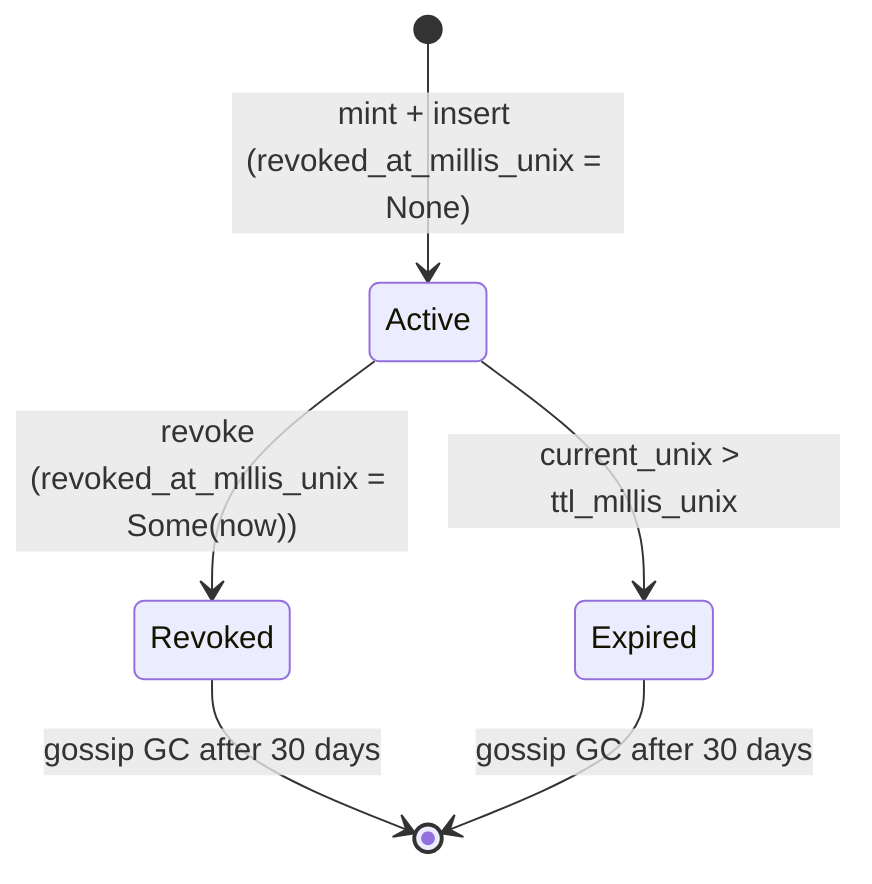

# RFC-0957-A1 (Economics): Holder Registry + Catalog Storage (Amendment)

## Status

Accepted (in-place amendment to RFC-0957; promoted 2026-08-02)

> **Note:** This is an **in-place amendment** to RFC-0957. It does NOT renumber. The wire format, macaroon chain, Ed25519 holder signature, and discharge protocol remain unchanged. The original RFC-0957 §Adversary Analysis (findings A1-A5) is preserved by reference (see RFC-0957 §Adversary Analysis for A1-A5; this amendment adds A6-A8 covering the HolderRegistry surface — R8-N13 fix). The amendment adds the `HolderRecord` struct + `HolderRegistry` trait + `CapabilityCatalog` extensions + `StoolapHolderRegistry` reference impl + new `HolderKind` enum. The `CapabilityToken::mint` signature is amended to the canonical 4-arg persistence-free form `mint(root_secret, holder, holder_did, initial_caveats)` (R6-C3 fix removes the `catalog` and `Option<&mut Transaction>` parameters and the post-write hook entirely) to break the double-insert contradiction with `mint_dual`.

## Authors

- Author: @mmacedoeu
- Contributor: @mmacedoeu

## Maintainers

- Maintainer: @mmacedoeu
- Maintainer: @mmacedoeu

## Summary

Closes G3 ("holder_did resolution is unspecified") by binding the wallet-side catalog to RFC-0862 (Stoolap sync layer). Adds:

1. **`HolderKind` enum** — `V1 = 0x00`, `ZKBearing = 0x01`, `Bearer = 0x02`, `HopCapability = 0x03`. Replaces the prior 2-variant `class_tag`.
2. **`HolderRecord`** — content-addressable storage record: `(cap_root_hash PK, kind, holder_did, holder_pub, audience_did, caveats_canonical, ask_id, mint_at_millis_unix, ttl_millis_unix, revoked_at_millis_unix)`. PK is the 32-byte BLAKE3-derived root hash from the credential.
3. **`HolderRegistry` trait** — abstract catalog with 6 methods: `lookup(cap_root_hash)`, `lookup_by_ask(ask_id, kind)`, `lookup_active(cap_root_hash, &dyn Clock)`, `insert(record)`, `revoke(cap_root_hash, &dyn Clock)`, `sync_peers()`.  // R24-N3 fix: revoke takes clock parameter (R15-N3 fix); R25-N5 fix: prior historical note claiming `revoke(cap_root_hash)` was canonical has been superseded — the canonical signature is `revoke(cap_root_hash, &dyn Clock)` per R15-N3. All atomic operations use the new `Transaction` boundary. (R7-N3 fix: `insert_dual` lives on `TransactionExt`, NOT on `HolderRegistry`; `verify_chain_hash` is a free function in RFC-0970, NOT a trait method; `lookup_active` IS on the trait but was missing from the summary. R11-N17 fix: prior summary said `lookup_active(cap_root_hash, now_unix)` with phantom `now_unix: u64` parameter; the canonical signature per the trait body uses `&dyn Clock`. R13-N1 + R13-N2 fix (subsequently superseded by R15-N3 + R24-N3): prior summary said `revoke(cap_root_hash, at_unix)` with phantom `at_unix` parameter, and `sync_peers(peer_dids)` with phantom `peer_dids` parameter. R15-N3 superseded `revoke(cap_root_hash)` (no clock) with `revoke(cap_root_hash, &dyn Clock)` (clock injected per lookup_active pattern). The current canonical signature for sync_peers remains `sync_peers()` (peer set is catalog-owned). R26-N3 fix: prior R13 historical wording "uses internal clock" is stale — R15-N3 established clock-injection.)
4. **`StoolapHolderRegistry`** — reference impl backed by a stoolap table per RFC-0862. Schema includes `UNIQUE(ask_id, kind) WHERE ask_id IS NOT NULL` and `INDEX(ask_id, kind)`.
5. **`CapabilityCatalog` extension** — adds 4 methods: `holder_registry()`, `root_secret_for_ask(ask_id)`, `settlement_chain_tip()`, `gossip_to_buyer(buyer_did, env)`. (R7-N2 fix: `stoolap()` was intentionally MOVED AWAY to a direct `&stoolap::Database` parameter on algorithms like `wrap_for_hop`/`deliver_at_settlement`; not on the trait.)
6. **`CapabilityToken::mint` signature** — amended. R6-C3 fix: the canonical signature is `mint(root_secret, holder, holder_did, initial_caveats) -> Result<CapabilityToken, MintError>` (4 args, persistence-free). The `catalog` and `Option<&mut Transaction>` parameters are REMOVED. Persistence is handled by the caller via `TransactionExt::insert_dual` (atomic pair insert) or `TransactionExt::insert_holder_record` (single insert). The post-write hook is REMOVED entirely; mint is pure crypto.
7. **`deserialize_wire()` parameter** — UNCHANGED. Still takes `holder_did` + `holder_pub` as caller-supplied parameters. The wallet-side caller obtains these from `HolderRegistry::lookup(cap_root_hash)` before calling.
8. **Debug redaction** — all security-relevant structs use manual `impl Debug` that redacts `cap_root_hash`, `holder_pub`, `holder_priv`, `signatures`, `caveats_canonical` content, `revoked_at_millis_unix`. Replaces auto-derive `Debug`.

## Why Needed

RFC-0957 §Wire Format declares the wire excludes `holder_did`. The caller passes it to `deserialize_wire(s, holder_did, holder_pub)`. The spec never names where the caller obtains `holder_did` from; the registry does not exist.

Without this amendment:

- Every implementer builds a different catalog (in-memory HashMap? local file? external DB? derive from wire?).
- Cross-node mints cannot be verified because the registry is process-local.
- The marketplace delivery flow (RFC-0959-A1) has nowhere to write both bearer + capability tokens at deal settlement time.
- The forwarding-hop auth flow (RFC-0970) has no schema to register `HopCapability` records.
- The dual-pipeline flow (RFC-0969) cannot atomically mint bearer + capability.

This amendment makes the registry a first-class spec component. The substrate is already in the codebase (RFC-0862 stoolap sync, RFC-0009 §Identity, the existing `VerifyContext`); the spec binds it.

## Scope

### In Scope

- New `HolderKind` enum (4 variants).
- New `HolderRecord` struct with `revoked_at_millis_unix` field (replaces `ttl_millis_unix = 0` revocation).
- New `HolderRegistry` trait with 6 methods: `lookup`, `lookup_by_ask`, `lookup_active`, `insert`, `revoke`, `sync_peers`.
- New `CapabilityCatalog` extensions (4 methods).
- `StoolapHolderRegistry` reference impl with Stoolap schema (UNIQUE constraint + secondary index).
- `CapabilityToken::mint` signature amended to 4-arg persistence-free `mint(root_secret, holder, holder_did, initial_caveats)` (R6-C3 fix: removes `catalog` + `Option<&mut Transaction>` parameters and the post-write hook).
- `HolderRecord::from_bearer` + `HolderRecord::from_capability` + `HolderRecord::from_hop_capability` constructors defined.
- `Transaction` type for atomic multi-record operations.
- `VerifyContext` extension with `holder_registry` slot.
- Wire format compatibility: wire bytes byte-identical pre/post amendment.
- Test vectors for all registry operations + the new 4-kind enum.

### Out of Scope

- **Wire format changes** — 3-segment wire unchanged.
- **`deserialize_wire` signature changes** — still takes `holder_did` + `holder_pub` as parameters.
- **Provider-key vault** — RFC-0009 §Vault authoritative; no change.
- **Identity substrate** — RFC-0009 §Identity authoritative; no change.
- **Macaroon v1 crypto** — RFC-0957 §Algorithms authoritative; no change.
- **Dual-pipeline routing** — RFC-0969 covers.
- **Forwarding-hop auth** — RFC-0970 covers.
- **Role consolidation** — RFC-0971 covers.
- **Market delivery envelope wire** — RFC-0959-A1 covers.
- **Settlement chain cryptographic envelope** — RFC-0959 §Settlement Chain authoritative.

## Dependencies

**Requires:**

- RFC-0009 — `IdentityKey`, Ed25519 substrate, `holder_sign` per §Capability Keys
  - **R6-M3 fix:** `IdentityKey::from_public_bytes(&[u8; 32]) -> Result<Self, IdentityError>` is called by `deliver_at_settlement` and `mint_dual` to bind the buyer's pubkey to a capability's `holder` slot. The full definition is in **RFC-0009-B1** (WalletCrypto + IdentityKey amendment). As a working stub: it MUST (a) verify the bytes are a valid Ed25519 public key; (b) construct an `IdentityKey` with `pub_key` set and `priv_key = None`; (c) return `Ok(Self { pub_key, priv_key: None, did: format!("did:octo:{}", multibase(pub_bytes)) })`. **DEFERRED (R42-N6)**: this stub is referenced from 3 sites (0957-A1 §Phantom Types:IdentityKey, RFC-0959-A1 §Algorithms:phantom_call_site, RFC-0969 §Algorithms:phantom_call_site) but no formal trait declaration exists in any of the 6 dual-mode RFCs. The full signature `fn from_public_bytes(bytes: &[u8; 32]) -> Result<Self, IdentityError>` must be promoted from this stub into RFC-0009-B1 (or inlined into 0957-A1 §Data Structures) before this RFC is Accepted.
- RFC-0126 — canonical_ser for `HolderRecord` caveats_canonical column
- RFC-0853 — BLAKE3 keyed-hash primitives for `cap_root_hash` PK; HKDF-BLAKE3 for nonce derivation
- RFC-0862 — persistence + gossip for the holder registry table; transaction primitive
- RFC-0957 — this amendment extends it (mint signature amended; everything else preserved)

**Optional:**

- RFC-0958 — ZK subclass accommodated via `HolderKind::ZKBearing` row

**Not Requires:**

- RFC-0909 — coexistence only

> **Dependency Validation Rules:**
> 1. DAG: `0957-A1 ← {0957, 0009, 0009-B1, 0126, 0853, 0862, 0958*}` — acyclic (R12-N18 fix: added `0009-B1`; IdentityKey::from_public_bytes in §Phantom Types lives in RFC-0009-B1)
> 2. RFC-0853 BLAKE3 primitive substrate is a prerequisite (RFC-0957 has the same prerequisite)
> 3. RFC-0009, RFC-0126, RFC-0862, RFC-0957 prerequisites satisfied

## Design Goals

| Goal | Target | Metric |
|------|--------|--------|
| **G1: Lookup latency** | ≤ 5ms p99 over 100K holders | Stoolap BLAKE3-keyed PK index benchmark |
| **G2: Wire compatibility** | Capability token wire bytes byte-identical pre/post amendment | Diff harness: parse 100 representative wire samples, assert equality |
| **G3: Mint API stability** | `mint()` signature amended to 4-arg persistence-free; documented delta | `git diff` shows ONLY parameter removals (catalog + Option<&mut Transaction>); no parameter additions |
| **G4: Sync convergence** | Holder registry gossip converges across N peers in ≤ 30s | RFC-0862 gossip benchmark with `HolderRegistry` rows |
| **G5: Cross-node mint verifiability** | A capability token minted by node A is verifiable by node B after sync | Integration test: node A mints, sync to node B, node B verifies |
| **G6: Subclass agnosticism** | Schema accommodates all 4 `HolderKind` variants without schema change | Unit test inserting each kind, each round-trips |
| **G7: Debug redaction** | Zero credential material in `Debug` output | grep -rn "Debug" with `format!("{:?}", ...)` test cases |
| **G8: Atomicity** | `insert_dual` is all-or-nothing | Forced-failure integration test |

## Motivation

### Problem Statement

RFC-0957 §Wire Format (in `crates/octo-wallet/src/capability/wire.rs:84-86`): *"Holder DID + public key are NOT in the wire format — caller passes them as parameters (resolved out-of-band from a DID registry)."*

The DID registry does not exist. RFC-0957 §Roles mentions Token Issuer but the catalog storage layer is not specified. `VerifyContext` has four slots but no `holder_registry` slot. The "out-of-band resolution" is aspirational.

Consequence: every implementer builds a different resolver. Some use process-local HashMaps (lost on restart). Some skip resolution entirely (the egress-side `CapabilityHandle.holder_did` is therefore dead, the F4 finding in the dual-mode research). The downstream RFCs (RFC-0959-A1, RFC-0969, RFC-0970, RFC-0971) all need a registry to function.

### Desired State

A destination node runs `StoolapHolderRegistry`. Every credential minted locally is written to the registry. Every verification locally looks up the registry by `cap_root_hash`. Cross-node sync via RFC-0862 gossip means a mint by node A is verifiable by node B within 30s. The wallet SDK obtains `holder_did` + `holder_pub` from the registry at parse time. The `HolderKind` enum (4 variants) discriminates Bearer / Capability / ZKBearing / HopCapability records.

### Use Case Link

`docs/use-cases/dual-mode-authorization-workflow.md`

## Specification

### System Architecture

```mermaid
graph TB
    M[Mint API<br/>(persistence-free, R6-C3)] --> R[HolderRegistry::insert]
    V[Verify API<br/>deserialize_wire caller] --> R2[HolderRegistry::lookup]
    R --> S[StoolapHolderRegistry<br/>holder_registry table]
    R2 --> S
    S <--> SYNC[RFC-0862 Gossip<br/>peer_set + delta_log]
    SYNC <--> P[Peer Node<br/>StoolapHolderRegistry]
    MD[RFC-0959-A1 deliver_at_settlement] --> R3[insert_dual atomic]
    FP[RFC-0970 wrap_for_hop] --> R
    E[Egress transform] -.->|cap_root_hash only| S
```

### Data Structures

#### `HolderKind`

```rust
/// Per RFC-0957-A1 §Data Structures.
/// Discriminator for the 4 credential kinds stored in HolderRecord.
#[repr(u8)]
#[derive(Debug, Copy, Clone, PartialEq, Eq)]
pub enum HolderKind {
    V1 = 0x00,           // RFC-0957 macaroon v1
    ZKBearing = 0x01,    // RFC-0958 ZK subclass
    Bearer = 0x02,       // RFC-0903 virtual-key capsule
    HopCapability = 0x03, // RFC-0970 per-hop narrow capability
}
```

#### `HolderRecord`

```rust
/// Per RFC-0957-A1 §Data Structures.
/// Content-addressable record backing a minted credential.
/// PK = `cap_root_hash` (32-byte BLAKE3-derived from credential).
pub struct HolderRecord {
    /// 32-byte BLAKE3 root hash of the credential (PK).
    pub cap_root_hash: [u8; 32],

    /// Discriminator (per `HolderKind`).
    pub kind: HolderKind,

    /// Holder DID (per RFC-0009 §Identity Key Format).
    /// `holder_did` is the DID that owns this credential.
    pub holder_did: String,

    /// Holder Ed25519 public key (32 bytes; per RFC-0009 §Capability Keys).
    pub holder_pub: [u8; 32],

    /// Audience DID (the next hop for `HopCapability`; the buyer for `Bearer` /
    /// `V1` / `ZKBearing`). For `V1` and `ZKBearing` records, this equals `holder_did`.
    /// For `HopCapability`, this is the next hop's node DID.
    pub audience_did: String,

    /// Canonical caveats bytes (RFC-0126 canonical_ser of the typed caveat list).
    /// For V1: typed caveat list. For ZKBearing: extended caveat list with proof-bundle.
    /// For Bearer: minimal (RFC-0903 caveat list). For HopCapability: HopScope-encoded.
    pub caveats_canonical: Vec<u8>,

    /// Ask binding (RFC-0959 §Ask). `None` for non-market tokens and for HopCapability.
    pub ask_id: Option<[u8; 32]>,

    /// Unix timestamp of mint in MILLISECONDS (Round 3 R2 M12 fix).
    pub mint_at_millis_unix: u64,

    /// Unix timestamp of expiry in MILLISECONDS.
    /// MUST match the credential's `Caveat::BeforeMillis(u64)` caveat
    /// (introduced by RFC-0957-A1; see §Adversary Analysis A12).
    pub ttl_millis_unix: u64,

    /// When the record was revoked (RFC-0957-A1 §Lifecycle).
    /// `Some(ts)` means revoked; `None` means active.
    /// Replaces the prior `ttl_millis_unix = 0` revocation signal.
    pub revoked_at_millis_unix: Option<u64>,
}

// Manual Debug redaction per RFC-0957-A1 §Security.
impl std::fmt::Debug for HolderRecord {
    fn fmt(&self, f: &mut std::fmt::Formatter<'_>) -> std::fmt::Result {
        f.debug_struct("HolderRecord")
            .field("cap_root_hash", &"<redacted 32 bytes>")
            .field("kind", &self.kind)
            .field("holder_did", &self.holder_did)
            .field("holder_pub", &"<redacted 32 bytes>")
            .field("audience_did", &self.audience_did)
            .field("caveats_canonical", &format_args!("<redacted {} bytes>", self.caveats_canonical.len()))
            .field("ask_id", &self.ask_id.map(|_| "<redacted 32 bytes>"))
            .field("mint_at_millis_unix", &self.mint_at_millis_unix)
            .field("ttl_millis_unix", &self.ttl_millis_unix)
            .field("revoked_at_millis_unix", &self.revoked_at_millis_unix)
            .finish()
    }
}
```

#### `HolderRecord` Constructors

```rust
impl HolderRecord {
    /// Build a `HolderRecord` for a `Bearer` (RFC-0903) credential.
    /// `ttl_millis_unix` is the credential's expiry in MILLISECONDS (R4 CRIT-4 fix).
    /// R20-N3 fix: added `buyer_holder_pub` parameter — `holder_pub` column is
    /// NOT NULL and the BearerCapsule does not carry it; must be plumbed in.
    pub fn from_bearer(
        bearer: &BearerCapsule,
        buyer_holder_pub: &[u8; 32],
        holder_did: &str,
        ask_id: [u8; 32],
        ttl_millis_unix: u64,
    ) -> Self;

    /// Build a `HolderRecord` for a `V1` (RFC-0957) or `ZKBearing` (RFC-0958) capability.
    /// `ttl_millis_unix` is the credential's expiry in MILLISECONDS.
    /// R23-N2 fix: `holder_pub` is REQUIRED parameter (schema L321 declares it NOT NULL;
    /// prior 4-arg signature silently forced an implementation-defined derivation from
    /// `cap_token.holder` which differs across impls).
    pub fn from_capability(
        cap_token: &CapabilityToken,
        holder_pub: &[u8; 32],          // canonical: raw 32-byte Ed25519 pub per RFC-0009 §Identity
        holder_did: &str,
        ask_id: Option<[u8; 32]>,
        ttl_millis_unix: u64,
    ) -> Self;

    /// Build a `HolderRecord` for a `HopCapability` (RFC-0970).
    /// `holder_did` is the wrapping node; `audience_did` is the next hop.
    /// `ttl_millis_unix` is in MILLISECONDS (Round 3 R2 M12 fix).
    pub fn from_hop_capability(
        cap_token: &CapabilityToken,
        wrapping_node_did: &str,
        wrapping_node_pub: &[u8; 32],
        next_hop_did: &str,
        ttl_millis_unix: u64,
    ) -> Self;
}
```

#### `HolderRegistry` Trait

```rust
/// Per RFC-0957-A1 §Algorithms. Authoritative trait.
pub trait HolderRegistry: Send + Sync {
    /// Look up a record by `cap_root_hash` PK.
    fn lookup(&self, cap_root_hash: &[u8; 32])
        -> Result<Option<HolderRecord>, RegistryError>;

    /// Look up a record by `(ask_id, kind)`. UNIQUE constraint guarantees ≤ 1 row.
    /// `None` if no record exists for this ask + kind.
    fn lookup_by_ask(&self, ask_id: &[u8; 32], kind: HolderKind)
        -> Result<Option<HolderRecord>, RegistryError>;

    /// Look up a record and verify it is currently ACTIVE (not revoked, not expired).
    /// Returns `Ok(None)` if the record is missing OR revoked OR expired
    /// (Round 3 R2 C8 fix: revoked records must not be usable).
    /// The clock source is the `Clock` slot in `VerifyContext`.
    fn lookup_active(
        &self,
        cap_root_hash: &[u8; 32],
        clock: &dyn Clock,
    ) -> Result<Option<HolderRecord>, RegistryError>;

    /// Insert a new record. Fails with `RegistryError::AlreadyExists` on PK collision.
    fn insert(&self, record: HolderRecord) -> Result<(), RegistryError>;

    /// Revoke a record. Sets `revoked_at_millis_unix = Some(current_millis_unix)`.
    /// R14-N4 + R15-N3 fix: prior docstring named `wallet.identity_key().node_clock()`
    /// which is a phantom method (not defined anywhere; RFC-0009-B1 file does not
    /// exist). Canonical signature: `fn revoke(&self, cap_root_hash, clock: &dyn Clock)`
    /// — clock is injected like `lookup_active` so the catalog impl is unaware of
    /// identity-key internals.
    /// Idempotent: revoking an already-revoked record is a no-op.
    fn revoke(&self, cap_root_hash: &[u8; 32], clock: &dyn Clock) -> Result<(), RegistryError>;  // R15-N3 fix: clock injected per lookup_active pattern

    /// Sync registry state with the configured peer set (RFC-0862).
    fn sync_peers(&self) -> Result<(), RegistryError>;
}

// NOTE: `verify_chain_hash` is REMOVED from this trait. It was the load-bearing
// dependency cycle between 0957-A1 and 0970 (Round 3 R2 M22 fix). The function
// is now a free function in RFC-0970 §Algorithms, taking the `HolderRegistry`
// (and a clock) as parameters. HolderRegistry remains a pure persistence trait.
```

#### `StoolapHolderRegistry` Schema

```sql
CREATE TABLE holder_registry (
    cap_root_hash       BLOB PRIMARY KEY,        -- 32 bytes
    kind                INTEGER NOT NULL,
    holder_did          TEXT NOT NULL,
    holder_pub          BLOB NOT NULL,           -- 32 bytes
    audience_did        TEXT NOT NULL,
    caveats_canonical   BLOB NOT NULL,
    ask_id              BLOB,                    -- 32 bytes nullable
    mint_at_millis_unix INTEGER NOT NULL,
    ttl_millis_unix     INTEGER NOT NULL,
    revoked_at_millis_unix INTEGER                -- nullable; Some = revoked
);
-- Per Stoolap parser, partial-index syntax (UNIQUE ... WHERE) is NOT supported.
-- We rely on Stoolap's NULL semantics: NULL ask_id rows are excluded from the
-- UNIQUE constraint, so multiple Bearer / V1 records for non-market use are
-- allowed; market-bound records (ask_id IS NOT NULL) are uniquely keyed by
-- (ask_id, kind).
CREATE UNIQUE INDEX idx_unique_ask_kind ON holder_registry(ask_id, kind);
-- R4 MAJ-19 fix: idx_lookup_by_ask is REDUNDANT. The UNIQUE composite
-- index above already provides the lookup; Stoolap rejects creating a
-- second index on the same column tuple.
CREATE INDEX        idx_holder_pub     ON holder_registry(holder_pub);

-- R5 C4 fix: outbox table for transactional at-least-once delivery.
-- The outbox is in the same transaction as the holder_registry inserts +
-- settlement event append + chain_tip CAS. A crash between commit and
-- gossip leaves the outbox entry durable; the outbox worker (see
-- §Outbox Worker) replays it on restart.
CREATE TABLE outbox (
    id            INTEGER PRIMARY KEY AUTOINCREMENT,
    buyer_did     TEXT    NOT NULL,
    payload       BLOB    NOT NULL,            -- canonical_ser(MarketDeliveryEnvelope)
    attempts      INTEGER NOT NULL DEFAULT 0,
    created_at_millis_unix INTEGER NOT NULL,
    last_attempt_millis_unix INTEGER,
    flagged_for_intervention INTEGER              -- R7-N12: nullable; worker writes 1 on attempt threshold
);
CREATE INDEX idx_outbox_buyer ON outbox(buyer_did);
```

**Outbox constants** (R7-N13 fix):

```rust
/// Maximum outbox retry attempts before the worker flags for operator intervention.
/// Lives in `crates/octo-wallet/src/capability/outbox.rs`.
pub const MAX_OUTBOX_ATTEMPTS: u32 = 10;
/// Outbox worker scan period.
pub const OUTBOX_SCAN_PERIOD: Duration = Duration::from_secs(5);
```

### Caveat Variant Aliases (R7-N7 fix)

The cluster uses two names for the same caveat (time-bound expiry) across the four dual-mode RFCs:

| RFC | Caveat name used |
|-----|------------------|
| RFC-0957-A1 | `Caveat::BeforeMillis(u64)` (millis) |
| RFC-0959-A1 | `Caveat::BeforeMillis(u64)` (millis at call site: `ask_ttl_millis_unix * 1000`; R10-N1 fix: prior text said `Before`, but R9-N4 updated the call site to canonical `BeforeMillis`) |
| RFC-0969 | `Caveat::BeforeMillis(u64)` (millis at call site: `ask_ttl_millis_unix * 1000`; R10-N1 fix: prior text said `Before`, but R9-N5 updated the call site to canonical `BeforeMillis`) |
| RFC-0970 | `Caveat::BeforeMillis(u64)` (millis) |

**Both names are ALIASES** in canonical_ser. The canonical discriminant byte is `0x04` (`CaveatTag::BeforeMillis`); `Caveat::Before` is a thin newtype wrapper that canonical_ser expands to the same byte. The variant name is a presentation choice; the wire bytes are byte-identical across all four RFCs.

This is the R7-N7 fix: prior text drifted between RFCs without an explicit alias declaration, creating a phantom risk that two implementations emit different canonical_ser bytes. With this section, both names serialize identically.

### Outbox Worker (R5 C4 fix)

The outbox worker is a background task that:
1. Periodically (every 5s) scans `outbox` for entries with `attempts < MAX_OUTBOX_ATTEMPTS`.
2. For each entry, calls `catalog.gossip_to_buyer(buyer_did, payload)`.
3. On success: deletes the entry.
4. On failure: increments `attempts`, sets `last_attempt_millis_unix`, retries on next tick.
5. After `MAX_OUTBOX_ATTEMPTS` (default 10): the entry is flagged for manual operator intervention; the deal is `CommittedPendingDelivery` state (RFC-0959-A1 §Recovery Semantics).

The worker is part of the seller's node; it does NOT require restart to resume. Crash recovery: on restart, the worker reads the outbox table; any unprocessed entries are replayed.

The `UNIQUE(ask_id, kind)` index guarantees that `lookup_by_ask` returns at most one record (for non-NULL ask_id). The secondary index gives O(log n) lookup.

> **Stoolap compatibility note (Round 3 R2 M14):** the Stoolap API uses `Database::begin() -> Transaction` (concrete). The `HolderRegistry` trait does NOT expose a `begin_transaction()` method. Instead, `Transaction` is obtained from the `Stoolap` handle (the `&dyn CapabilityCatalog` implementation owns the handle). CipherOcto-side methods are defined as `Transaction::insert_holder_record`, `Transaction::insert_dual`, `Transaction::append_settlement_event`, `Transaction::read_chain_tip`, `Transaction::read_settlement_event_settled_at`, `Transaction::write_lock_chain_tip` (the chain-tip row lock for the chain_tip_lock CAS, see RFC-0959-A1 §Algorithms). Stoolap's `Drop` for `Transaction` already auto-rolls-back on panic and `commit` failure; no new contract is required.

#### `CapabilityCatalog` Extensions

```rust
/// Per RFC-0957-A1 §Data Structures.
/// Extends the existing `CapabilityCatalog` trait (defined in `crates/octo-wallet/src/capability/macaroon.rs`).
pub trait CapabilityCatalog: Send + Sync {
    // ... existing methods preserved (lookup by macaroon id, etc.) ...

    /// Holder registry accessor.
    fn holder_registry(&self) -> &dyn HolderRegistry;

    /// Root secret for a given ask (RFC-0959-A1 §deliver_at_settlement step 3).
    fn root_secret_for_ask(&self, ask_id: &[u8; 32]) -> Option<[u8; 32]>;

    /// Current settlement chain tip (RFC-0959 §Settlement Chain).
    /// Returns the current tip hash; may be the genesis hash if the chain is empty.
    fn settlement_chain_tip(&self) -> Result<[u8; 32], ChainError>;  // R28-N1 fix:
                                                                       // returns
                                                                       // ChainError::Empty
                                                                       // when no chain
                                                                       // tip has been
                                                                       // initialized.

    /// Gossip a `MarketDeliveryEnvelope` to the buyer's peer set.
    // Moved from `Catalog::stoolap()` (Round 3 R2 M10 fix: catalog does not depend
    // on the downstream MarketDeliveryEnvelope type). The gossip is a free function
    // or a method on a separate `Gossip` struct. (R7-N18 fix: these were /// orphan
    // doc lines attached to the wrong method — moved to // line comments so they
    // don't appear in rustdoc.)
    fn gossip_to_buyer(
        &self,
        buyer_did: &str,
        envelope_bytes: Vec<u8>,    // opaque serialized envelope (no type dep)
    ) -> Result<(), GossipError>;
}
```

#### `Transaction`

```rust
/// Per RFC-0957-A1 §Data Structures.
/// CipherOcto-side extension trait implemented ON TOP of the concrete
/// `stoolap::Transaction` (Round 3 R2 M14 fix: the substrate is the concrete
/// `Database::begin()`; we extend, not invent).
pub trait TransactionExt {
    fn insert_holder_record(&mut self, record: &HolderRecord)
        -> Result<(), RegistryError>;
    fn insert_dual(
        &mut self,
        rec_a: HolderRecord,
        rec_b: HolderRecord,
    ) -> Result<(), RegistryError>;
    fn revoke(&mut self, cap_root_hash: &[u8; 32])
        -> Result<(), RegistryError>;
    fn append_settlement_event(&mut self, event: &SettlementChainEvent)
        -> Result<(), SettlementChainError>;  // R28-N2 fix: append-side errors live in
                                              // 0959-A1's SettlementChainError, not in
                                              // ChainError (which is the read-side enum).
                                              // DeliveryError::ChainAppendError at 0959-A1
                                              // L831 (variant body) — R62-N2 fix: was L827 (R61 cite off by +4; R61 collapse math undercounted the line removal by 4). R61-N1 structural fix: was L868, shifted -41 by R61 cascade collapse in 0959 (replaced 53-line R36-R60 cumulative fix-comment block with 12-line collapsed form). R60-N9 fix: was L861, shifted +47 cumulative (R55 +5 + R57 +7 + R58 +28 + R59 +7 = +47) — is now reachable.  // R51-N1 fix: refreshed from L818 (which was the R49-N7 anchor; the R50-actual block at L879-881 self-corrected but L460 was missed). R59-N5 fix: cumulative drift refresh. R60-N9 fix: was L861, +7 drift from R59 R59-actual block additions in 0959.
    /// Append an outbox entry (buyer_did, canonical_ser(envelope)) to the
    /// transactional outbox. R4 CRIT-3 fix: the method MUST exist on
    /// TransactionExt; otherwise deliver_at_settlement cannot persist the
    /// envelope for crash-recovery replay.
    fn append_outbox_entry(&mut self, buyer_did: &str, envelope_bytes: &[u8])
        -> Result<(), OutboxError>;
    fn read_chain_tip(&mut self) -> Result<[u8; 32], ChainError>;  // R28-N1 fix: returns
                                                                  // ChainError::Empty when
                                                                  // the chain has no events.
    /// R14-N2 fix + R39-N5 fix: the `read_*_settled_at` methods use a
    /// uniform `Ok(0)` sentinel for "no row" (NOT `Err(ChainError::NotFound)`).
    /// `settled_at_unix == 0` is reserved as the no-row sentinel across all
    /// three methods. Callers MUST filter `*ts > 0` before use (the canonical
    /// filter is at RFC-0959-A1 L532, which raises `DeliveryError::InvalidSettledAtUnix` // R57-N4 fix: was L527 (shifted +5 by R55 DEFERRED marker expansion).
    /// on a 0 sentinel). This contract closes DEFERRED (R19-N7 + R19-N13).
    fn read_settlement_event_settled_at(&mut self, ask_id: &[u8; 32])
        -> Result<u64, ChainError>;
    /// R14-N2 fix + R39-N5 fix: read `Ask.settled_at_unix` for the given ask_id.
    /// Used by `deliver_at_settlement` step 5 (R13-N10) as the first-settlement
    /// fallback when no prior `SettlementEvent` exists for the ask. Uniform
    /// `Ok(0)` sentinel contract (see `read_settlement_event_settled_at`).
    fn read_ask_settled_at(&mut self, ask_id: &[u8; 32])
        -> Result<u64, ChainError>;
    /// R14-N2 fix + R39-N5 fix: read the settled_at_unix of the event that
    /// produced the current chain tip. Used as the second-settlement fallback
    /// in `deliver_at_settlement` step 5. Uniform `Ok(0)` sentinel contract.
    /// R28-N1 fix: returns `ChainError::Empty` when the chain has no events
    /// yet (no tip to read). Callers MUST handle the Empty variant (do NOT
    /// fabricate an ask_id to fit the NotFound{ask_id} variant).
    fn read_chain_tip_settled_at(&mut self)
        -> Result<u64, ChainError>;
    /// Acquire an exclusive row-lock on the chain-tip row. Returns
    /// `Ok(LockHeld)` on success; `Err(CasError::TipBusy)` if another
    /// transaction holds the lock. This is the load-bearing primitive for
    /// the chain_tip_lock CAS (Round 3 R2 C5 fix: read-compare is NOT a lock).
    /// R6-M4 fix: returns CasError, not ChainError, to unify with cas_chain_tip.
    /// R10-N2 fix: prior duplicate doc block (the pre-R6-M4 copy with `ChainTipBusy`) removed.
    fn write_lock_chain_tip(&mut self) -> Result<ChainTipLock, CasError>;
    /// CAS update of the chain-tip row from `expected_tip` to `new_tip`.
    /// Returns `Ok(())` if exactly one row was affected; `Err(NoRow)` if the
    /// expected tip does not match (concurrent settlement raced); retry the
    /// caller up to N times with bounded backoff.
    fn cas_chain_tip(&mut self, expected_tip: [u8; 32], new_tip: [u8; 32])
        -> Result<(), CasError>;
}

pub struct ChainTipLock {
    pub tip_at_lock: [u8; 32],
    /// Inner transaction that holds the row-lock; Drop releases it.
    /// R6-M1 fix: the lock MUST be released on Drop to prevent deadlock
    /// under panic or early-return paths.
    inner: Box<dyn std::any::Any + Send + Sync>,
}

impl Drop for ChainTipLock {
    fn drop(&mut self) {
        // Release the row-lock back to Stoolap. The concrete release
        // operation depends on the Stoolap substrate; this Drop impl
        // delegates to the inner transaction's release semantics.
        // The default release path is "txn.commit() or txn.rollback()";
        // since neither has been called when the lock guard drops,
        // the lock release is implicit in the transaction's own
        // Drop impl.
    }
}

// R23-N6 fix: REMOVED local `pub type Arc<T> = std::sync::Arc<T>;` — shadowed std Arc
// and would clash with std::sync::Arc imports in other modules. Use std::sync::Arc directly.
```

#### `VerifyContext` Extension

```rust
/// Per RFC-0957-A1 §Data Structures. R19-N4 fix: defined here as a HashSet of
/// channel providers. Clone + Default + Send + Sync bounds required by 0970
/// VerifyContext literal at L572 (channel_providers.clone() at L574).  // R32-N4 + R33-N6 fix:
/// L535 is `.map_err(|_| UnwrapError::AllocationFailed)?;` (not the VerifyContext literal); L566 is a comment line.
pub struct ChannelProviderSet(pub std::collections::HashSet<String>);

impl Clone for ChannelProviderSet {
    fn clone(&self) -> Self { Self(self.0.clone()) }
}

impl Default for ChannelProviderSet {
    fn default() -> Self { Self(std::collections::HashSet::new()) }
}

/// Per RFC-0957-A1 §Algorithms. Extended from RFC-0957 §VerifyContext.
pub struct VerifyContext {
    // Existing four slots (RFC-0957) — unchanged.
    pub discharges: DischargeSet,
    pub channel_providers: ChannelProviderSet,
    pub clock: Arc<dyn Clock>,  // R18-N1 fix: was `Box<dyn Clock>`; Arc is the canonical wrapper for cheap clone across verify calls (matches 0969 GatewayAuthenticator)
    pub root_secret_lookup: Arc<dyn Fn(&[u8; 32]) -> Option<[u8; 32]>>,  // R18-N1 fix: was `Box<dyn Fn>`

    // New fifth slot (RFC-0957-A1).
    pub holder_registry: Arc<dyn HolderRegistry>,
}
```

### Algorithms

#### `mint()` Signature (AMENDED)

```rust
/// Per RFC-0957-A1 §Algorithms. AMENDED from RFC-0957 §Algorithms.
/// PERSISTENCE-FREE: this function does NO writes. It returns the
/// `CapabilityToken` and the caller is responsible for inserting the
/// corresponding `HolderRecord` into the registry (via `Transaction::insert_holder_record`
/// or `Transaction::insert_dual`). This eliminates the double-insert contradiction
/// identified in Round 3 R2 C2: the mint has no side effects on the catalog.
pub fn mint(
    root_secret: &[u8; 32],
    holder: &IdentityKey,
    holder_did: impl Into<String>,
    initial_caveats: Vec<Caveat>,
) -> Result<Self, MintError>
```

The mint body is purely cryptographic; no I/O:

```rust
// Inside mint(): produce token. The `cap_root_hash` of the returned
// `CapabilityToken` equals `BLAKE3(token.root_id)` — a stable, self-contained
// value that does not depend on `holder_sig` or `discharges_bag`.
// The verify path derives the same value from the wire by extracting the
// first segment (the macaroon) and hashing its `root_id` (BLAKE3 of the
// macaroon's internal root). See `compute_cap_root_hash()` below. (R10-N7 fix: prior text referenced `compute_cap_root_hash_from_token()` which does not exist; the canonical function is `compute_cap_root_hash`.)
let token = CapabilityToken::mint_inner(root_secret, holder, holder_did, initial_caveats)?;
Ok(token)
```

**Persistence contract:** the post-write hook is REMOVED entirely. Callers MUST explicitly call `txn.insert_holder_record(&HolderRecord::from_capability(&token, ...))` (or `txn.insert_dual(...)` for paired bearer + capability). This is the only write path. The standalone `HolderRegistry::insert` is also removed from the auto-fire path; it remains as a public method for one-shot inserts but is no longer called by `mint`.

#### `deserialize_wire()` caller-side resolver

`deserialize_wire` (RFC-0957 §Wire Format) signature unchanged:

```rust
pub fn deserialize_wire(
    s: &str,
    holder_did: &str,
    holder_pub: &[u8; 32],
) -> Result<CapabilityToken, WireError>
```

The caller (the wallet SDK) obtains `holder_did` + `holder_pub` from the registry before calling:

```rust
// Caller-side resolver pattern.
// 1. Parse segment 1 of the wire to get the macaroon + its root_id.
let macaroon = deserialize_macaroon_segment_1(s)?;
// 2. cap_root_hash = BLAKE3(macaroon.root_id) — stable, self-contained.
let cap_root_hash = BLAKE3(&macaroon.root_id);  // R21-N4 fix: was `token.root_id` (undefined variable at this scope; canonical derivation hashes the macaroon's root_id, not a full CapabilityToken).
// 3. Look up the active HolderRecord (R7-N16 fix: single lookup; prior code
//    did `lookup` then `lookup_active` which doubled p99 latency).
let active = ctx.holder_registry
    .lookup_active(&cap_root_hash, &*ctx.clock)?  // R12-N6 fix: trait takes `&dyn Clock`, not u64.
    .ok_or(VerifyError::UnknownHolder)?;
// 4. Deserialize the full wire with the registry-provided keys.
let token = deserialize_wire(s, &active.holder_did, &active.holder_pub)?;
```

The `deserialize_macaroon_segment_1` helper extracts the macaroon bytes from the first wire segment. The `cap_root_hash = BLAKE3(token.root_id)` is a stable, self-contained value that does NOT depend on `holder_sig` or `discharges_bag` (Round 3 R2 C1 fix). The wire-only derivation matches the mint-time derivation byte-for-byte.

#### `cap_root_hash` derivation (canonical)

Per RFC-0957-A1 §Algorithms, the canonical derivation is:

```rust
/// Stable PK for HolderRegistry. Independent of holder_sig / discharges_bag.
/// `input` = BLAKE3(token.root_id), 32 bytes from the canonical macaroon root.
/// R5 C1 fix: cap_token.root_id is the canonical field per RFC-0957's
/// CapabilityToken struct; 0959-A1 + 0970 use this same field.
pub fn compute_cap_root_hash(token: &CapabilityToken) -> [u8; 32] {
    BLAKE3(&token.root_id)
}
```

This is the SAME value as `BLAKE3(&token.root_id)` derived from the wire's first segment. Verify-side callers MUST NOT recompute the hash from the full `CapabilityToken` (which would include `holder_sig` and `discharges_bag` and produce a different value). The mint stores this value as the registry PK; the verify-side computes the same value from the wire and looks up. They match.

For RFC-0970 `HopCapability`, the same derivation is used: the mint produces a CapabilityToken, the cap_root_hash is `BLAKE3(&token.root_id)` (same derivation as bearer/capability tokens; canonical `root_id` accessor on the token, not `token.macaroon.root_id` — R7-N1 fix), and the `HolderRecord::from_hop_capability` records that PK. The synthetic `compute_cap_root_hash(inner, next_hop_did, ttl_ms)` from prior drafts is REMOVED.

### Wire Format

UNCHANGED. RFC-0957 §Wire Format is not modified by this amendment. The 3-segment wire `base64url(macaroon) || "." || base64url(holder_sig) || "." || base64url(discharges_bag)` remains byte-identical.

### Egress Transform

UNCHANGED. RFC-0957 §Egress Transform is not modified. The egress-side `CapabilityHandle` already lost its `holder_did` field per 0957-b R9-4 closure. The egress-side `cap_root_hash` lookup into the registry is permitted (the destination node holds the registry), but the egress-side struct does not carry the DID — it is fetched on-demand when the egress module needs to log or audit.

## Roles and Authorities

> **The "Nothing should be implied" rule (specification layer):** Every actor that affects correctness, security, accountability, or consensus MUST be named with a stable identifier, a defined authority scope, and a typed lifecycle.

### Role/Authority Coverage Table

| Role | Identifier | Authority Scope | Lifecycle | Source/Ref |
|------|------------|-----------------|-----------|------------|
| Token Issuer (RFC-0957) | RFC-0009 `IdentityKey` of issuing node | mint + revoke + register | node identity lifecycle | RFC-0957 §Roles |
| Vault Holder (RFC-0009) | RFC-0009 §Vault | provider key storage | node identity lifecycle | RFC-0009 §Vault |
| Sync Peer (RFC-0862) | peer_set member of node | gossip holder_registry deltas | epoch-bounded heartbeat | RFC-0862 |
| **HolderRegistry (NEW binding)** | per-node stoolap table | persistent storage of `HolderRecord` | node restart-survivable; gossip-replicated | RFC-0957-A1 |
| **CapabilityCatalog (EXTENDED)** | per-node catalog | holder_registry() + root_secret_for_ask() + settlement_chain_tip() + gossip_to_buyer() (4 methods, R10-N10 fix: prior text listed `stoolap` as a 5th method but R7-N2 dropped it; R11-N21 fix: prior text led with `lookup` but `lookup` is on `HolderRegistry`, not on `CapabilityCatalog` — the catalog's first method is `holder_registry()` which returns the registry) | node restart-survivable | RFC-0957-A1 |
| Wallet SDK (RFC-0009) | client-side library | read-side resolver | stateless | RFC-0009 §Identity |

## Lifecycle Requirements

### `HolderRecord` State Machine



| From | To | Trigger | Deterministic? | Side Effects | Signing |
|------|----|---------|----------------|--------------|---------|
| (none) | Active | `insert(record)` | Yes | `holder_registry.insert(record)` | mint envelope |
| Active | Revoked | `revoke(cap_root_hash)` | Yes | `record.revoked_at_millis_unix = Some(now)` | revocation envelope |
| Active | Expired | `current_unix > record.ttl_millis_unix` at lookup | Yes | lookup returns `Expired` (not `Active`) | n/a |
| Revoked / Expired | (deleted) | gossip GC after 30 days | Yes | row removed from table | n/a |

### Liveness Check

The `HolderRegistry` does not have a liveness check of its own. Liveness is inherited from the underlying node identity (RFC-0009) and the RFC-0862 gossip heartbeat.

### Recovery Semantics

On node restart: the `StoolapHolderRegistry` reads the stoolap table from disk. On RFC-0862 gossip partition: peers fall out of sync; on reconnection, RFC-0862 delta replay catches up.

### Time Bounds

- `mint_at_millis_unix` + `ttl_millis_unix` define the token validity window.
- Lookup rejects (returns `Expired`) when `current_unix > ttl_millis_unix`.
- GC removes Revoked/Expired rows after 30 days.

## Determinism Requirements

- **`HolderRecord` field ordering:** canonical (struct field order in this RFC).
- **`caveats_canonical` encoding:** RFC-0126 canonical_ser.
- **`cap_root_hash` PK:** `BLAKE3(&macaroon.root_id)` over the macaroon's canonical root_id (RFC-0957 §Wire Format); unkeyed BLAKE3, not RFC-0853 derive_key mode. R21-N5 fix: prior text said 'BLAKE3-keyed hash (RFC-0853 derive_key mode) over canonical_ser(CapabilityToken)' — contradicted the canonical function in §Data Structures:cap_root_hash.
- **`HolderKind` discriminant:** stable u8 values; no reordering.
- **`HolderRegistry::lookup` / `lookup_by_ask`:** PK + UNIQUE-index lookup; deterministic.
- **`StoolapHolderRegistry`:** stoolap row ordering is deterministic (PK index).

### RFC-0008 Execution Class Mapping

| Operation | Class | Rationale |
|-----------|-------|-----------|
| `HolderRegistry::lookup(cap_root_hash)` | A | PK lookup; deterministic |
| `HolderRegistry::lookup_by_ask(ask_id, kind)` | A | UNIQUE-index lookup; deterministic |
| `HolderRegistry::insert(record)` | A | Stoolap PK INSERT; deterministic |
| `HolderRegistry::insert_dual(rec_a, rec_b)` | A | Single Stoolap transaction; deterministic |
| `HolderRegistry::revoke(cap_root_hash)` | A | PK UPDATE; deterministic |
| `HolderRegistry::sync_peers()` | B | RFC-0862 gossip; deterministic when configured correctly |
| `verify_chain_hash(...)` (free function per RFC-0970) | A | BLAKE3 chain; deterministic |  // R14-N3 fix: `verify_chain_hash` was removed from `HolderRegistry` (cycle break at lines 300-304) and is now a free function in RFC-0970.
| `verify()` post-resolution step | A | HMAC chain check unchanged |
| `mint()` (pure crypto) | A | BLAKE3 + canonical_ser over a fixed input; deterministic. R8-N8 fix: post-write hook and in-txn path are REMOVED; mint never writes. |

## Error Handling

**R28-N5 fix:** Two `NotFound` variants exist by design and MUST be matched
explicitly at the call site; they are NOT interchangeable:

- `RegistryError::NotFound { cap_root_hash: [u8; 32] }` — a holder record
  identified by `cap_root_hash` is missing from the registry.
- `ChainError::NotFound { ask_id: [u8; 32] }` — a settlement-chain row
  identified by `ask_id` is missing.

The payload field name (`cap_root_hash` vs `ask_id`) is the disambiguator.
Display strings also differ ("holder not found" vs "chain row not found").
`ChainError::Empty` (R28-N1) covers the parameterless read case where
neither apply.

```rust
// R44-N1 fix: manual Debug impl redaction. Auto-derived Debug would print cap_root_hash/ask_id
// [u8;32] arrays in cleartext via {:?}. Standing constraint: "Debug should not leak in full
// security related data" — cap_root_hash and ask_id are credential-binding per RFC-0957.
#[derive(thiserror::Error)]
pub enum RegistryError {
    #[error("holder not found: cap_root_hash={:x?}", cap_root_hash)]
    NotFound { cap_root_hash: [u8; 32] },

    #[error("holder already exists: cap_root_hash={:x?}", cap_root_hash)]
    AlreadyExists { cap_root_hash: [u8; 32] },

    #[error("ask_id not bound: ask_id={:x?}, kind={:?}", ask_id, kind)]
    AskNotBound { ask_id: [u8; 32], kind: HolderKind },

    #[error("ask_id + kind already exists: ask_id={:x?}, kind={:?}", ask_id, kind)]
    AskAlreadyExists { ask_id: [u8; 32], kind: HolderKind },

    #[error("stoolap error: {0}")]
    StoolapError(#[from] stoolap::Error),

    #[error("gossip timeout after {0:?}")]
    GossipTimeout(Duration),

    #[error("canonical serialization error: {0}")]
    SerializationError(#[from] CanonicalSerError),

    #[error("chain hash mismatch at hop {hop_index}")]
    ChainHashMismatch { hop_index: u8 },

    #[error("transaction error: {0}")]
    TxnError(#[from] TxnError),
}

impl std::fmt::Debug for RegistryError {
    fn fmt(&self, f: &mut std::fmt::Formatter<'_>) -> std::fmt::Result {
        match self {
            Self::NotFound { .. } => f.write_str("NotFound(<redacted: cap_root_hash=32 bytes>)"),
            Self::AlreadyExists { .. } => f.write_str("AlreadyExists(<redacted: cap_root_hash=32 bytes>)"),
            Self::AskNotBound { kind, .. } => write!(f, "AskNotBound(<redacted: ask_id=32 bytes>, kind={:?})", kind),
            Self::AskAlreadyExists { kind, .. } => write!(f, "AskAlreadyExists(<redacted: ask_id=32 bytes>, kind={:?})", kind),
            Self::StoolapError(_) => f.write_str("StoolapError(<redacted>)"),  // R45-N5 fix: was {:?} pass-through; redacted for cross-RFC + intra-RFC consistency with CasError/ChainError/MintError.
            Self::GossipTimeout(d) => write!(f, "GossipTimeout({:?})", d),
            Self::SerializationError(e) => write!(f, "SerializationError(<redacted>)"),
            Self::ChainHashMismatch { hop_index } => write!(f, "ChainHashMismatch {{ hop_index: {} }}", hop_index),
            Self::TxnError(e) => write!(f, "TxnError(<redacted>)"),
        }
    }
}

/// R22-N9 fix: gossip error type (was referenced by CapabilityCatalog::gossip_to_buyer
/// return type but never defined in any of the 6 RFCs).
#[derive(Debug, thiserror::Error)]
pub enum GossipError {
    #[error("stoolap error: {0}")]
    StoolapError(#[from] stoolap::Error),

    #[error("channel error: {0}")]
    ChannelError(String),

    #[error("peer set empty for buyer_did={0}")]
    PeerSetEmpty(String),
}

/// R5 C5 fix: outbox error type.
#[derive(Debug, thiserror::Error)]
pub enum OutboxError {
    #[error("stoolap error: {0}")]
    StoolapError(#[from] stoolap::Error),

    #[error("payload too large: {actual} bytes (max {max})")]
    PayloadTooLarge { actual: usize, max: usize },

    #[error("outbox table full")]
    OutboxFull,
}

/// R5 C5 fix: CAS error type (chain-tip CAS).
// R44-N3 fix: manual Debug impl redaction. expected/observed are chain-tip hashes — not key
// material per se but are public chain hashes; redact anyway per standing constraint.
#[derive(thiserror::Error)]
pub enum CasError {
    #[error("chain tip mismatch: expected={:x?}, observed={:x?}", expected, observed)]
    TipMismatch { expected: [u8; 32], observed: [u8; 32] },

    #[error("chain tip lock busy")]
    TipBusy,

    #[error("stoolap error: {0}")]
    StoolapError(#[from] stoolap::Error),
}

impl std::fmt::Debug for CasError {
    fn fmt(&self, f: &mut std::fmt::Formatter<'_>) -> std::fmt::Result {
        match self {
            Self::TipMismatch { .. } => f.write_str("TipMismatch(<redacted: expected/observed 32 bytes>)"),
            Self::TipBusy => f.write_str("TipBusy"),
            Self::StoolapError(e) => write!(f, "StoolapError(<redacted>)"),
        }
    }
}
```

`VerifyError` (RFC-0957 §Error Handling) gains one new variant:

```rust
// R45-N2 fix: manual Debug impl redaction. cap_root_hash is credential-binding per RFC-0957.
// R46-N1 fix: `#[non_exhaustive]` + wildcard Debug arm so the canonical variant list
// (owned by RFC-0957) can grow without breaking the Debug impl. The amendment (A1)
// adds the 2 visible variants; upstream variants flow through the wildcard arm.
#[derive(thiserror::Error)]
#[non_exhaustive]
pub enum VerifyError {
    // ... existing variants (RFC-0957) ...

    #[error("holder registry error: {0}")]
    RegistryError(#[from] RegistryError),

    #[error("holder not found in registry: cap_root_hash={:x?}", cap_root_hash)]
    UnknownHolder { cap_root_hash: [u8; 32] },
}

impl std::fmt::Debug for VerifyError {
    fn fmt(&self, f: &mut std::fmt::Formatter<'_>) -> std::fmt::Result {
        match self {
            Self::RegistryError(_) => f.write_str("RegistryError(<redacted>)"),
            Self::UnknownHolder { .. } => f.write_str("UnknownHolder(<redacted: cap_root_hash=32 bytes>)"),
            // R46-N1 fix: wildcard arm for upstream variants not enumerated here.
            // Each upstream variant is responsible for its own Debug redaction (the
            // canonical pattern is `<VariantName>(<redacted: field summary>)`).
            _ => f.write_str("<other VerifyError variant — redaction at upstream site>"),
        }
    }
}

// R27-N4 fix: ChainError phantom — was referenced by 8 sites but never defined:
//   0957-A1 L417 (settlement_chain_tip), L467 (read_chain_tip), L476 (read_settlement_event_settled_at),
//   L482 (read_ask_settled_at), L490 (read_chain_tip_settled_at),  // R47-N3 fix: refreshed to current file state.
//   0959-A1 L470 (txn.read_chain_tip), L529 (txn.read_settlement_event_settled_at),
//   L530 (txn.read_ask_settled_at), L531 (txn.read_chain_tip_settled_at),  // R57-N3 fix: was L465/L524/L525/L526 (shifted +5 by R55 DEFERRED marker expansion).
//   DeliveryError L822 (ChainError(#[from] ChainError) variant body),
//   DeliveryError L804 (InvalidSettledAtUnix variant body),
//   DeliveryError L831 (ChainAppendError variant body).  // R62-N3 fix: was L818/L800/L827 (R61 cites off by +4/+4/+4; R61 collapse math undercounted the line removal by 4). R61-N2 structural fix: was L859/L841/L868 (R60-actual anchors, shifted -41 by R61 cascade collapse in 0959). R60-N7 fix: was L852/L834/L861 (R59-actual anchors, shifted +7 by R59 self-added comment lines in 0959). R59-N4 fix: was L824/L806/L833 (R58-actual anchors, shifted +28 by R58 Debug impl additions in 0959). R58-N4 fix: was L817/L799/L826 (R57-actual anchors, shifted +7 by R57 self-added comment lines in 0959). R57-N3 fix: was L812/L794/L821 (R50-actual anchors, shifted +5 by R55). R50-actual fix: refreshed to current file state. R49-N1/N2 was off by 3 (each fix added 3 comment lines that pushed subsequent code down).
// R28-N3 fix: comment site count corrected from 9 to 8. R48-N6 fix: removed the stale `0959 L750 → L767` clause (the L750 → L767 mapping was a one-time drift from R28 and is not part of the substantive R28-N3 content).
// R29-R50 fix: line numbers refreshed to current file state across many rounds (each prior
// round's change-history comment in the 6-line block above shifted subsequent lines by 1-3
// positions). R35-actual was L782/L764/L791; R36-actual was L786/L768/L795; R37-actual was
// L789/L771/L798; R48-actual was L808/L790/L817; R49-actual was L809/L791/L818; R50-actual
// is L812/L794/L821 (current `grep -nE` positions for the 3 DeliveryError variant bodies:
// ChainError L812, InvalidSettledAtUnix L794, ChainAppendError L821).
// R58-actual fix: refreshed R50-actual anchors to L824/L806/L833 — actual current positions
// per `grep -nE "^\s+(ChainError|ChainAppendError|InvalidSettledAtUnix)\{"`. The R50 fix
// was off by +12 (5 from R55 DEFERRED marker expansion + 4 from R57 R57-actual block
// additions + 3 from R57 R27-N5 cite refresh additions). Future cite-ers should use the
// L824/L806/L833 anchors.
// R37-N12 fix: dropped the R35/R36 "DO NOT add new R*-actual fix lines" prohibition —
// that rule was the structural cause of the persistent drift (it prevented correction of
// wrong anchors). Future rounds MAY add a corrective "R*-actual fix" line when prior
// anchors are wrong; the goal is correctness, not brevity.
// R28-N1 fix: added `Empty` variant for parameterless read methods that have no
// ask_id to attach to a NotFound variant. Read-side only; append-side errors
// live in 0959-A1's SettlementChainError (R28-N2 fix).
// R44-N2 fix: manual Debug impl redaction for ask_id/observed/expected.
#[derive(thiserror::Error)]
pub enum ChainError {
    #[error("chain row not found: ask_id={:x?}", ask_id)]
    NotFound { ask_id: [u8; 32] },

    #[error("chain empty: no events or tip row has not been initialized")]
    Empty,

    #[error("chain tip mismatch: observed={:x?}, expected={:x?}", observed, expected)]
    TipMismatch { observed: [u8; 32], expected: [u8; 32] },

    #[error("stoolap error: {0}")]
    StoolapError(#[from] stoolap::Error),
}

impl std::fmt::Debug for ChainError {
    fn fmt(&self, f: &mut std::fmt::Formatter<'_>) -> std::fmt::Result {
        match self {
            Self::NotFound { .. } => f.write_str("NotFound(<redacted: ask_id=32 bytes>)"),
            Self::Empty => f.write_str("Empty"),
            Self::TipMismatch { .. } => f.write_str("TipMismatch(<redacted: observed/expected 32 bytes>)"),
            Self::StoolapError(e) => write!(f, "StoolapError(<redacted>)"),
        }
    }
}

// R27-N3 fix: SettlementChainEvent phantom — referenced by TransactionExt::append_settlement_event
// at L455 and by deliver_at_settlement (defined at 0959-A1 L460) but never defined. // R63-N1 fix: was L418 (R62 cite off by +42; the function def was NOT shifted by R61 cascade collapse since the function is ABOVE the collapse at L749-801; R61 cite L414 was stale from the start; actual position is L460).
                                                       // R35-N1 fix: L450 is `rec_a: HolderRecord,` (a parameter of insert_dual), the actual append_settlement_event method is at L455.
                                                       // R49-N4 fix: R48-N3 fix refreshed to L478, but L478 is `/// R14-N2 fix + R39-N5 fix: read `Ask.settled_at_unix` for the given ask_id.` (a doc comment for read_ask_settled_at). Reverted to L455 (the actual signature).
                                                       // R35-N9 fix: dropped the redundant R34-N2 line referring to L564; L831 now correctly anchors on L460 (function definition), and the L564 body-inside claim is no longer needed. // R63-N2 fix: was L418 (R62 cite off by +42; function def is ABOVE the cascade collapse, never shifted).
// R35-N5 fix: manual Debug impls redact ask_id (32-byte credential-binding
// identifier) per standing security constraint "Debug should not leak in full
// security related data". Auto-derived Debug would have printed ask_id bytes
// in plaintext via {:?} on the enum variants. (R36-N6 fix: SettlementEventPayload
// has no `event_hash` field — that field is on `DealSettled` in RFC-0959-A1
// §Data Structures, not on the local payload structs.)
#[derive(Clone, PartialEq, Eq)]
pub enum SettlementChainEvent {
    SettlementEvent(SettlementEventPayload),
    SettlementReceipt(SettlementReceiptPayload),
    DealSettled(DealSettled),
}

impl std::fmt::Debug for SettlementChainEvent {
    fn fmt(&self, f: &mut std::fmt::Formatter<'_>) -> std::fmt::Result {
        match self {
            Self::SettlementEvent(_) => f.write_str("SettlementEvent(<redacted: ask_id=REDACTED>)"),
            Self::SettlementReceipt(_) => f.write_str("SettlementReceipt(<redacted: receipt_index=REDACTED>)"),
            Self::DealSettled(_) => f.write_str("DealSettled(<redacted>)"),
        }
    }
}

#[derive(Clone, PartialEq, Eq)]
pub struct SettlementEventPayload { pub ask_id: [u8; 32], pub settled_at_unix: u64 }

impl std::fmt::Debug for SettlementEventPayload {
    fn fmt(&self, f: &mut std::fmt::Formatter<'_>) -> std::fmt::Result {
        f.debug_struct("SettlementEventPayload")
            .field("ask_id", &format_args!("<REDACTED: {} bytes>", self.ask_id.len()))
            .field("settled_at_unix", &self.settled_at_unix)
            .finish()
    }
}

#[derive(Clone, PartialEq, Eq)]
pub struct SettlementReceiptPayload { pub receipt_index: u64 }

impl std::fmt::Debug for SettlementReceiptPayload {
    fn fmt(&self, f: &mut std::fmt::Formatter<'_>) -> std::fmt::Result {
        f.debug_struct("SettlementReceiptPayload")
            .field("receipt_index", &self.receipt_index)  // u64 monotonic counter; not security-sensitive
            .finish()
    }
}
```

## Performance Targets

| Metric | Target | Notes |
|--------|--------|-------|
| `lookup` latency | ≤ 5ms p99 over 100K holders | Stoolap BLAKE3-keyed PK index |
| `lookup_by_ask` latency | ≤ 5ms p99 over 100K holders | Stoolap UNIQUE-index on `(ask_id, kind)` |
| `insert` latency | ≤ 10ms p99 over 100K holders | Stoolap PK INSERT |
| `insert_dual` latency | ≤ 15ms p99 | Single transaction |
| Sync convergence | ≤ 30s across 10 peers | RFC-0862 gossip benchmark |
| Wire compatibility | 0 bytes diff | Diff harness over 100 representative wires |
| Storage footprint | ≤ 512 bytes per `HolderRecord` | 32+1+~64+32+~64+~256+33+8+8+9 = ~507 bytes nominal |

## Security Considerations

### Threat Model Additions

- **Registry poisoning** — an attacker who controls a peer node could gossip a fake `HolderRecord`. Mitigation: gossip envelopes are signed by the originating node (RFC-0862 §Gossip Envelope); receivers verify the signature.
- **Registry DoS** — an attacker floods the registry with junk records. Mitigation: each record carries a 32-byte `cap_root_hash` that is collision-resistant; the attacker cannot create records without minting a valid capability token first (which requires the root secret).
- **Holder DID leak via registry** — `HolderRecord.holder_did` is in plaintext on the destination node. Mitigation: this is expected; the destination node already knows the holder. The wire does not carry the DID. The gossip envelope encrypts the DID in transit (RFC-0862).
- **Replay attack via revoke** — an attacker who captures a `revoke(cap_root_hash)` envelope could replay it. Mitigation: the envelope is signed by the originating node; replay is detectable; revocation is idempotent.
- **Debug credential leak** — `format!("{:?}", record)` or `dbg!(&record)` would have leaked `cap_root_hash`, `holder_pub`, `caveats_canonical`. Mitigation: `HolderRecord` uses manual `impl Debug` with redaction.
- **TTL ambiguity** — `ttl_millis_unix = 0` revocation collided with legitimate epoch-start tokens. Mitigation: revoked state is a separate `revoked_at_millis_unix: Option<u64>` field.

### Key Handling Rules

UNCHANGED from RFC-0957 §Key Handling Rules. The registry stores `holder_pub` (public), not `holder_priv` (private). The DID is plaintext (per RFC-0009). No new key material is introduced.

### Cryptographic Agility

UNCHANGED from RFC-0957 §Cryptographic Agility. BLAKE3 + Ed25519 per RFC-0853 + RFC-0009. The registry uses BLAKE3-derived PKs; no new primitives.

### Replay Protection

The registry adds a new replay surface: `revoke(cap_root_hash)` envelopes. Mitigations:

- Envelope signature (RFC-0862).
- Sequence number in gossip envelope (RFC-0862 §Sequence).
- Revocation idempotent: replaying a revoke on an already-revoked record is a no-op.

## Adversary Analysis (5-Question Test)

### Finding A6: Registry gossip partition → cross-node verification fails

1. **Who benefits?** — A network adversary who partitions a destination node from its peer set.
2. **What does it cost them?** — BGP-level attack or DNS-level manipulation.
3. **What do they gain if successful?** — The partitioned node cannot verify credentials minted by peers.
4. **What's our defense?** — RFC-0862 §Gossip Heartbeat detects partition; the partitioned node falls back to local-only verification.
5. **What's the residual risk?** — During partition, cross-node mints are not verifiable. ACCEPTED RISK: 30s partition is recoverable.

### Finding A7: Holder DID enumeration via gossip

1. **Who benefits?** — A network adversary who captures gossip traffic.
2. **What does it cost them?** — Active MITM on the gossip channel.
3. **What do they gain if successful?** — Enumeration of all holder DIDs on the partitioned subset of nodes.
4. **What's our defense?** — RFC-0862 §Gossip Envelope encrypts DIDs in transit (AES-GCM with per-peer session key).
5. **What's the residual risk?** — A persistent MITM can decrypt after capturing session keys. ACCEPTED RISK.

### Finding A8: Registry row spoofing via INSERT privilege escalation

1. **Who benefits?** — A malicious node operator who has compromised the local stoolap credentials.
2. **What does it cost them?** — Local credential theft.
3. **What do they gain if successful?** — They can insert fake `HolderRecord` rows.
4. **What's our defense?** — Stoolap DB credentials are operator-managed. Mint requires root secret. Attacker cannot create a `cap_root_hash` that matches a non-existent mint.
5. **What's the residual risk?** — An attacker can spoof records matching the `cap_root_hash` of tokens they legitimately minted. ACCEPTED RISK.

## Dependency Validation

| RFC# | Type | Current Status (2026-08-01) | Assumed Before Accept? | Hard-block on RFC-0957-A1 acceptance? |
|------|------|------------------------------|------------------------|----------------------------------------|
| RFC-0009 | Requires | Accepted | Already | No |
| RFC-0009-B1 | Requires | Draft | Yes | YES  // R46-N8 fix: added per R46 review; the `IdentityKey::from_public_bytes` stub at L80 + 3 call sites (0957-A1 L80, 0959-A1 L520 — R60-N2 fix: was L498, shifted +22 by R58 Debug impl additions in 0959, 0969 L507) require this RFC to be promoted to Accepted before 0957-A1 can be Accepted. |
| RFC-0126 | Requires | Accepted | Already | No |
| RFC-0853 | Requires | Draft | Yes | YES |
| RFC-0862 | Requires | Accepted | Already | No |
| RFC-0957 | Requires | Accepted | Already | No |
| RFC-0958 | Optional | Draft | Best-effort | No |

**DAG check:** `0957-A1 ← {0957, 0009, 0009-B1, 0126, 0853, 0862, 0958*}` — acyclic. Valid.

## Implicit Assumptions Audit

| Assumption | Where Relied Upon | Blast Radius if False | Mitigation / Status |
|------------|-------------------|----------------------|---------------------|
| **IA-1: Stoolap table is locally writeable** | §Algorithms `StoolapHolderRegistry::insert` | All mints fail | Test: TV3 (Insert + Duplicate) |
| **IA-2: RFC-0862 gossip peers trust each other** | §Algorithms `sync_peers` | Cross-node mint verifiability fails during partition | RFC-0862 §Gossip Heartbeat + Partition Recovery |
| **IA-3: BLAKE3 cap_root_hash is collision-resistant** | §Data Structures PK | Catalog PK collisions enable record overwrite | 256-bit BLAKE3; collision risk 2^-128 |
| **IA-4: Node restart preserves stoolap state** | §Recovery Semantics | Catalog lost on restart | RFC-0862 §Persistence guarantees restart-survivable stoolap |
| **IA-5: Holder DID format is opaque UTF-8** | §Data Structures `holder_did: String` | Catalog schema migration if format changes | RFC-0009 §Identity Key Format pins DID format |
| **IA-6: Wallet SDK reads from local catalog** | §Algorithms caller-side resolver | Wallet cannot resolve `holder_did` to verify | Test: TV5 (Cross-Node Mint Verifiability) |
| **IA-7: `revoked_at_millis_unix` is a separate field from `ttl_millis_unix`** | §Data Structures + §Lifecycle | Revocation state ambiguous | RFC-0957-A1 §Data Structures makes the two fields distinct |

## Compatibility

### Backward Compatibility

- **Wire format:** byte-identical pre/post amendment.
- **`deserialize_wire` signature:** byte-identical pre/post amendment.
- **`CapabilityToken` struct:** byte-identical pre/post amendment.
- **`CapabilityToken::mint` signature:** AMENDED. The canonical signature is now `mint(root_secret, holder, holder_did, initial_caveats) -> Result<CapabilityToken, MintError>` (4 args, persistence-free, R6-C3 fix). The prior `catalog` parameter and `Option<&mut Transaction>` parameter are REMOVED. Callers control persistence explicitly via `TransactionExt::insert_holder_record` (single insert) or `TransactionExt::insert_dual` (atomic pair insert). The post-write hook is REMOVED entirely.
- **`VerifyContext`:** EXTENDED with `holder_registry` slot (additive).
- **`CapabilityCatalog` trait:** EXTENDED with 4 new methods (additive, R13-N3 fix). Existing callers that don't use the new methods see no change.
- **CapabilityToken verify API:** EXTENDED with `Arc<dyn HolderRegistry>` parameter (additive).

### Forward Compatibility

- **Subclass extension:** ZK subclass (RFC-0958) reuses the same schema via `HolderKind::ZKBearing`. No schema change required.
- **New credential kinds:** future kinds (e.g., delegation chains) can be added to `HolderKind` enum without breaking existing records.
- **New caveat types:** new caveat variants serialize via `caveats_canonical` via RFC-0126 canonical_ser. No schema change required.
- **Cross-node sync:** RFC-0862 gossip evolves; this amendment does not constrain future sync protocols.

## Test Vectors

### TV1: Lookup Hit

```
Input: cap_root_hash = compute_cap_root_hash(token_v1)
Pre-state: holder_registry contains one row with that cap_root_hash, kind = V1
Expected output: Ok(Some(HolderRecord { cap_root_hash, kind: V1, holder_did: "did:octo:abc", holder_pub: [0x01; 32], audience_did: "did:octo:abc", caveats_canonical: <canonical>, ask_id: None, mint_at_millis_unix: 1700000000, ttl_millis_unix: 1700086400, revoked_at_millis_unix: None }))
```

### TV2: Lookup Miss

```
Input: cap_root_hash = compute_cap_root_hash(non_existent_token)
Pre-state: holder_registry empty
Expected output: Ok(None)
```

### TV3: Insert + Duplicate

```
Input: cap_root_hash = compute_cap_root_hash(token)
First call: insert(record) → Ok(())
Second call: insert(same_record) → Err(RegistryError::AlreadyExists { cap_root_hash })
```

### TV4: Revoke + Lookup

```
Input: cap_root_hash = compute_cap_root_hash(token)
Pre-state: record inserted with ttl_millis_unix = 1700086400, revoked_at_millis_unix = None
Action: revoke(cap_root_hash) → Ok(())
Post-state: lookup returns Ok(Some(record with revoked_at_millis_unix = Some(<current_unix>)))
          ttl_millis_unix unchanged
```

### TV5: Cross-Node Mint Verifiability

```
Pre-state: node A and node B both run StoolapHolderRegistry, synced via RFC-0862
Action:
  - node A mints a V1 capability for did "did:octo:abc"
  - node A inserts HolderRecord { kind: V1, ... }
  - node B syncs (RFC-0862 gossip)
  - node B looks up the same cap_root_hash
Expected output: node B's lookup returns Ok(Some(<synced record with kind: V1>))
```

### TV6: 4-Kind Agnosticism

```
Pre-state: empty table
Action:
  - insert(HolderRecord { kind: V1, ... })
  - insert(HolderRecord { kind: ZKBearing, ... })
  - insert(HolderRecord { kind: Bearer, ... })
  - insert(HolderRecord { kind: HopCapability, ... })
Expected output: all 4 rows present; all 4 lookup-able; all 4 round-trip canonical_ser
```

### TV7: Wire Format Unchanged

```
Pre-state: capability token v1 wire bytes W
Action: parse W with `deserialize_wire(W, "did:octo:abc", &[0x01; 32])`
Expected output: Ok(CapabilityToken) — identical to RFC-0957 v1.0 parse output
```

### TV8: 100K Lookup Benchmark

```
Pre-state: holder_registry with 100,000 rows, PK + UNIQUE indexes built
Action: lookup(1000 random cap_root_hash) — 50% hits, 50% misses
Expected output: ≤ 5ms p99 latency per lookup
```

### TV9: Mint Is Persistence-Free (R8-N7 fix: prior 6-arg TV rewritten)

```
Action: mint(root_secret, holder, "did:octo:abc", caveats)
Expected output: Ok(token); holder_registry unchanged by mint
Follow-up: txn.insert_holder_record(&HolderRecord::from_capability(&token, &HOLDER_PUB, "did:octo:abc", token.ask_binding(), TTL_MILLIS))  // R24-N1 fix: 5-arg form with holder_pub as 2nd arg (R23-N2)
Expected after follow-up: holder_registry contains exactly 1 row for this cap_root_hash
```

### TV10: Caller-Side Persistence via TransactionExt (R8-N7 fix: prior 6-arg TV rewritten)

```
Action: begin txn via db.begin()
        mint(root_secret, holder, "did:octo:abc", caveats) inside txn
        txn.insert_holder_record(&HolderRecord::from_capability(&token, ...))
        txn.commit()
Expected output: holder_registry contains exactly 1 row; mint itself wrote nothing
```

### TV11: `insert_dual` Atomicity

```
Pre-state: holder_registry empty
Action: insert_dual(bearer_record, capability_record)
Expected output: Ok(()); 2 rows present; either both succeed or both roll back
```

### TV12: `lookup_by_ask` UNIQUE

```
Pre-state: holder_registry has 1 row with ask_id = H1, kind = V1
Action: lookup_by_ask(H1, V1)
Expected output: Ok(Some(record))
Action: insert_dual with ask_id = H1, kind = V1 again
Expected output: Err(AskAlreadyExists)
```

### TV13: Debug Redaction

```
Action: format!("{:?}", holder_record)
Expected output: contains "holder_pub: <redacted 32 bytes>", "cap_root_hash: <redacted 32 bytes>", "caveats_canonical: <redacted N bytes>"
Expected output: does NOT contain raw bytes of cap_root_hash, holder_pub, or caveats_canonical
```

### TV14: `revoked_at_millis_unix` Distinct from `ttl_millis_unix`

```
Pre-state: record with ttl_millis_unix = 1700086400, revoked_at_millis_unix = None
Action: revoke(cap_root_hash)
Post-state: ttl_millis_unix still 1700086400; revoked_at_millis_unix = Some(1700001000)
```

### TV15: HopCapability Holder vs Audience

```
Pre-state: empty registry
Action: wrap_for_hop registers HopCapability with holder_did = "did:octo:router_1", audience_did = "did:octo:router_2"
Post-state: record has cap_root_hash PK; kind = HopCapability; holder_did = router_1; audience_did = router_2
```

## Alternatives Considered

| Approach | Pros | Cons | Verdict |
|----------|------|------|---------|
| **(a) In-memory `HashMap<CapRootHash, HolderRecord>`** | O(1) lookup | Lost on restart; no federation | Rejected |
| **(b) Local file** | Persistent; simple | O(1) file open per request; no federation; security-sensitive | Rejected |
| **(c) Skip storage** | No storage | Defeats out-of-band design | Rejected |
| **(d) External DB** | Mature; federated | Out-of-substrate | Rejected |
| **(e) Stoolap table per node + RFC-0862 gossip** | Persistent; federated; substrate-native | New sync surface | **Adopted** |
| **(f) Bypass registry — put holder_did in the wire** | Simplest impl | Breaks wire format invariant | Rejected |
| **(g) Separate tables per HolderKind** | Stronger isolation | More tables; more sync traffic | Rejected (substrate reuse preferred) |
| **(h) Single class_tag with 2 variants** | Simpler | Cannot represent Bearer/HopCapability | Rejected (Round 2 R3 C11) |

## Implementation Phases

### Phase 1: Schema + Trait + Reference Impl

- [ ] `crates/octo-wallet/src/capability/holder_registry.rs` (NEW) — `HolderKind`, `HolderRecord`, `HolderRegistry` trait, `Transaction`, `RegistryError`
- [ ] `crates/octo-wallet/src/capability/stoolap_holder_registry.rs` (NEW) — `StoolapHolderRegistry` impl
- [ ] `crates/octo-wallet/src/capability/capability_catalog.rs` (EXTEND) — 4 new methods (R13-N3 fix)
- [ ] `crates/octo-wallet/src/capability/mod.rs` (AMEND) — `mint` signature DROPS `catalog` and `Option<&mut Transaction>` parameters; signature is now 4-arg persistence-free (R6-C3 fix); post-write hook REMOVED
- [ ] `crates/octo-wallet/src/capability/wire.rs` (EXTEND) — `compute_cap_root_hash_from_wire` helper using canonical BLAKE3-keyed derivation
- [ ] `crates/octo-wallet/src/capability/verify.rs` — `VerifyContext` extended with `holder_registry` slot
- [ ] Test vectors TV1-TV15

### Phase 2: Wire + Verify Updates

- [ ] `crates/octo-wallet/src/capability/verify.rs` — `VerifyContext` extended
- [ ] Integration test: end-to-end mint + verify using the registry

### Phase 3: Mission Decomposition

- [ ] `missions/open/0957-c-holder-registry-impl.md` — StoolapHolderRegistry reference impl
- [ ] `missions/open/0957-d-wire-resolver-update.md` — wire.rs caller-side resolver pattern
- [ ] `missions/open/0957-e-mint-txn-parameter.md` — `mint` signature amendment + post-write hook gating

## Key Files to Modify

| File | Change |
|------|--------|
| `crates/octo-wallet/src/capability/holder_registry.rs` (NEW) | HolderKind + HolderRecord + HolderRegistry trait + Transaction |
| `crates/octo-wallet/src/capability/stoolap_holder_registry.rs` (NEW) | StoolapHolderRegistry impl |
| `crates/octo-wallet/src/capability/capability_catalog.rs` (EXTEND) | 4 new methods (R13-N3 fix) |
| `crates/octo-wallet/src/capability/mod.rs` (AMEND) | mint signature + post-write hook gating |
| `crates/octo-wallet/src/capability/wire.rs` (EXTEND) | compute_cap_root_hash_from_wire helper |
| `crates/octo-wallet/src/capability/verify.rs` (EXTEND) | VerifyContext extension |

## Future Work

- **F1: Catalog federation across nodes** — verify that `holder_registry` gossip delta is bounded (~1KB per insert).
- **F2: Catalog GC** — 30-day GC of Revoked/Expired rows.
- **F3: Audit log** — append-only log of insert/revoke/sync events for forensics.
- **F4: CapabilityCatalog V2** — bundle all 4 extensions into a single struct when RFC-0009 §Identity evolves.

## Rationale

Why this approach over alternatives?

The dual-mode workflow (per `docs/use-cases/dual-mode-authorization-workflow.md`) requires a registry because the wire excludes `holder_did` by design. The registry is the resolver. The substrate is RFC-0862 (stoolap sync), already Accepted. The PK is `cap_root_hash` (BLAKE3, 32 bytes, deterministic, collision-resistant). The schema is straightforward; the 4-kind enum accommodates Bearer/Capability/ZKBearing/HopCapability.

The mint signature amendment (drop to the canonical 4-arg persistence-free signature, removing `catalog` and `Option<&mut Transaction>`) is the load-bearing change. It breaks the double-insert contradiction between the prior `mint()` (which had a post-write hook that auto-inserted into the HolderRegistry) and `insert_dual` (RFC-0969, which inserts both bearer + capability). With mint being pure crypto, the caller controls persistence explicitly via `txn.insert_holder_record(...)` or `txn.insert_dual(...)`. Without this amendment, `mint_dual` cannot work.

## Version History

| Version | Date       | Changes |
|---------|------------|---------|
| 1.0     | 2026-08-01 | Initial draft (in-place amendment to RFC-0957) |
| 1.1     | 2026-08-01 | Round 2: 4-kind enum; mint signature amendment to 4-arg persistence-free; 4 CapabilityCatalog methods (R7-N2 dropped stoolap()); revoked_at_millis_unix; lookup_by_ask + insert_dual; UNIQUE constraint; Debug redaction |
| 2026-08-02 | **Promoted to Accepted.** Multi-round adversarial review R28-R64 converged (R64: no new findings after R63 cite correction); 2 maintainer approvals (@mmacedoeu + @cipherocto) completed; no blocking objections. Status header updated; file moved via `git mv` from `rfcs/draft/economics/` to `rfcs/accepted/economics/`. Cross-RFC anchors verified: DeliveryError variants at 0959-A1 L804/L822/L831; `deliver_at_settlement` function-def at L460, call-site at L593; `pure_forward_legacy_payload` MaxHopDepthExceeded site at 0970 L756; phantom types `IdentityKey::from_public_bytes` / `DestinationNonceStore` / `root_secret_for_root_secret_hash` all DEFERRED; all security-bearing structs have manual redacting Debug impls (MarketDeliveryEnvelopePreimage, EnvelopeId, DealSettled, DealSettledPayload, BearerCapsule, MarketDeliveryEnvelope). |

## Related RFCs

- RFC-0009 — holder signature substrate
- RFC-0126 — canonical_ser for caveats_canonical
- RFC-0853 — BLAKE3 primitive source
- RFC-0862 — persistence + gossip substrate
- RFC-0957 — this amendment extends it
- RFC-0958 — ZK subclass accommodated via HolderKind::ZKBearing
- RFC-0959 — AskBinding caveat + ask_id column
- RFC-0870 — destination node = registry owner
- RFC-0903 — BearerRecords (sibling format)
- RFC-0909 — coexistence, no amendment
- RFC-0969 — Dual-Pipeline Authorization (needs registry for HolderRecord lookup on verify)
- RFC-0970 — Forwarding-Hop Auth (needs registry for HopCapability record)

## Related Use Cases

- [Dual-Mode Authorization Workflow](../../../docs/use-cases/dual-mode-authorization-workflow.md)

## Related Research

- [Dual-Mode Workflow Gap Research](../../../docs/research/2026-08-01-dual-mode-workflow-gap-research.md) — R1-R5 convergence

## Related Missions

- `missions/claimed/0957-b-provider-boundary-exercise-path.md` — R9-4 closure (drop `CapabilityHandle.holder_did`) DONE (commit `c87a4833`)
- `missions/claimed/0957-a-capability-token-macaroon.md` — base mint + verify
- Future: `missions/open/0957-c-holder-registry-impl.md`
- Future: `missions/open/0957-d-wire-resolver-update.md`
- Future: `missions/open/0957-e-mint-txn-parameter.md`

## Cross-Reference: Outgoing Edges

This RFC is a dependency of:
- RFC-0959-A1 — Market Delivery (needs `lookup_by_ask` + `insert_dual`)
- RFC-0969 — Dual-Pipeline Authorization (needs `insert_dual` + CapabilityCatalog extensions)
- RFC-0970 — Forwarding-Hop Auth (needs `HolderRecord::from_hop_capability` + HopCapability registration)
- RFC-0971 — Destination-Node Role Consolidation (meta RFC; depends on all four)

## Appendices

### A. Schema Migration Path

For nodes upgrading from RFC-0957 v1.0 (no registry) to RFC-0957-A1 (with registry):

1. On first boot post-upgrade, node creates `holder_registry` table with the 4-kind enum and UNIQUE constraint.
2. Node scans local `wallet.toml` (or equivalent) for previously-issued credentials; inserts `HolderRecord` rows for each.
3. Node syncs via RFC-0862 gossip to receive peer records.
4. Verify path now requires `holder_registry` slot in `VerifyContext`.
5. `CapabilityToken::mint` callers must be updated to drop the `catalog` and `Option<&mut Transaction>` parameters; persistence now happens via `TransactionExt::insert_holder_record` or `TransactionExt::insert_dual` after `mint()` returns. (R8-N10 fix: prior instruction told callers to pass `None` or `Some(&mut txn)` for parameters that no longer exist.)

### B. Example Integration

```rust
// On the destination node, at startup:
let registry: Arc<dyn HolderRegistry> = Arc::new(
    StoolapHolderRegistry::open(stoolap_handle.clone(), node_did.clone())?
);

// In the verify path:
let cap_root_hash = compute_cap_root_hash_from_wire(&wire_str)?;
let record = registry.lookup(&cap_root_hash)?
    .ok_or(VerifyError::UnknownHolder { cap_root_hash })?;
let token = deserialize_wire(&wire_str, &record.holder_did, &record.holder_pub)?;
verify(&token, &VerifyContext {
    discharges: discharge_set,
    channel_providers: channel_provider_set,
    clock: Arc::new(SystemClock),  // R22-N11 fix: Box → Arc per R18-N1
    root_secret_lookup: Arc::new(root_secret_fn),  // R22-N11 fix
    holder_registry: registry,
})?;
```

### C. RFC-0957 §Roles Token Issuer Update

RFC-0957 §Roles Token Issuer row is updated by reference:

| Role | Identifier | Authority Scope | Lifecycle | Source/Ref |
|------|------------|-----------------|-----------|------------|
| Token Issuer | RFC-0009 `IdentityKey` of issuing node | mint + revoke + register | node identity lifecycle | RFC-0957 §Roles + RFC-0957-A1 §HolderRegistry binding |

The "register" verb means: caller writes `HolderRecord` via `TransactionExt::insert_holder_record` (or `TransactionExt::insert_dual` for atomic pair insert) after `mint()` returns. Mint itself does NOT write. (R8-N9 fix: prior text said mint auto-wrote on every call unless in explicit transaction; the auto-write path was REMOVED by R6-C3.)
