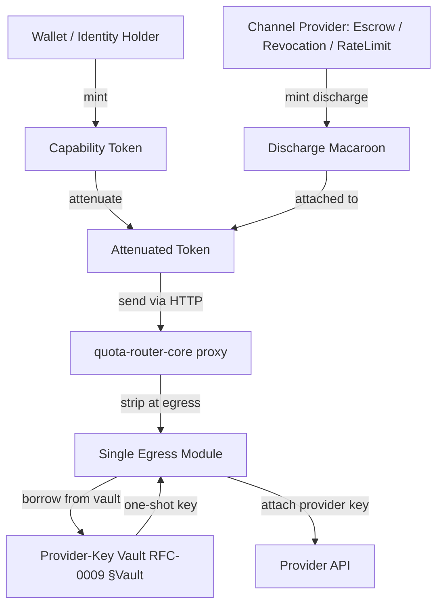
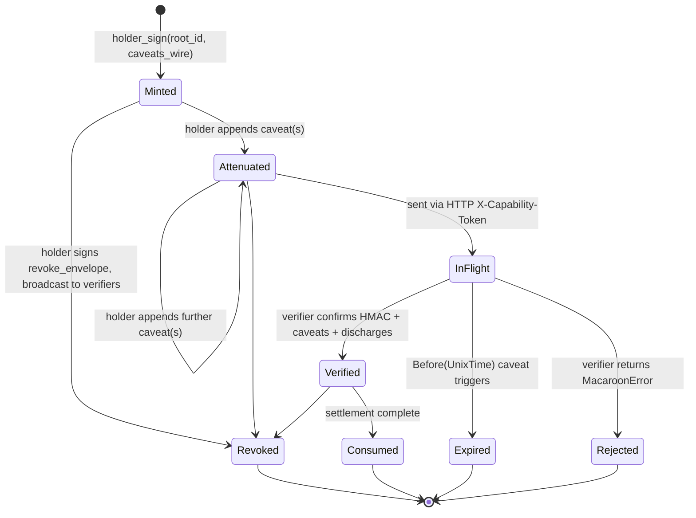

# RFC-0957 (Economics): Capability Token Format (Macaroon v1)

## Status

Accepted

> **Note:** Originally numbered RFC-0956 in earlier draft; **renumbered to RFC-0957** because RFC-0956 is archived (`rfcs/archived/economics/0956-model-liquidity-layer.md`, Model Liquidity Layer v2). Capability token RFC has no historical collision in the 0950–0959 economics range.

## Authors

- Author: @cipherocto (S02 capability token work)
- Contributor: @mmacedoeu (HMAC-BLAKE3 substrate clarification; macaroon v1 wire format)

## Maintainers

- Maintainer: @mmacedoeu
- Maintainer: @cipherocto

## Summary

Defines the CipherOcto capability token format — **macaroon v1** with **HMAC-BLAKE3 keyed-hash mode** — used to delegate scoped, attenuable, third-party-dischargeable authorization from a node identity to downstream actors (provider proxies, settlement contracts, rate-limit oracles). Tokens never cross provider boundaries: the egress transform strips the capability token from outbound provider-bound requests and substitutes the corresponding provider key. Holder signatures use the Ed25519 substrate defined in RFC-0009 (Process: Identity Management); the Stark Curve substrate from RFC-0102 (Numeric: Wallet Cryptography) is intentionally NOT used for token signing — capability tokens are authorization primitives, not transaction primitives.

## Why Needed

The Quota Router MVE requires per-invocation authorization that:

1. **Does not require global identity lookup** at verify time — verifier holds the macaroon root secret only at mint; verify is HMAC-chain check + caveat predicate evaluation.
2. **Supports monotonic attenuation** — holder can pass a subset of authority downstream without exposing the root secret.
3. **Binds to a third-party discharge channel** — escrow contract, revocation oracle, rate-limiter oracle can each add a discharge macaroon that the verifier must check.
4. **Is pairwise unlinkable** — same identity issuing to audience A vs audience B produces statistically independent root secrets (via HKDF-BLAKE3 derivation per RFC-0009 §Capability Keys).
5. **Never leaks provider credentials** — the token references the provider key via `ProviderKeyRef { provider, slot }`; the key bytes never appear in the token.

Without this spec, downstream RFCs (RFC-0958 ZK subclass, RFC-0959 independent settlement chain) cannot land.

## Scope

### In Scope

- Macaroon v1 wire format and HMAC-BLAKE3 chain construction.
- Caveat DSL — strongly-typed enum + raw escape hatches.
- Holder signature (Ed25519) via RFC-0009 substrate.
- Attenuation invariant — add-only, monotonic restriction enforced at type level.
- Discharge protocol — third-party caveats require channel-provider-issued discharge macaroons.
- Three discharge providers — `EscrowDischargeProvider`, `RevocationDischargeProvider`, `RateLimitDischargeProvider`.
- Wire format — `base64url(macaroon) || "." || base64url(holder_sig) || "." || base64url(discharges_bag)`.
- HTTP header convention — `X-Capability-Token: <capability_token>` (default; `Authorization: CipherOcto-Cap <...>` when bearer coexists).
- Egress transform strip — capability token dropped at provider boundary; provider key substituted from vault one-shot borrow.
- Replay protection — invocation hash binding + nonce per mint.
- CI lint — forbid `X-Capability-Token` presence on outbound provider-bound requests (single egress module rule).

### Out of Scope

- **ZK capability subclass** — covered by RFC-0958 (S05).
- **Asking-settlement discharge** — RFC-0959 (S03 independent settlement chain).
- **Provider-key vault** — RFC-0009 §Vault.
- **Identity substrate** — RFC-0009.
- **Stark Curve substrate** — RFC-0102 (used by wallet, NOT by capability token).
- **LiteLLM-style virtual API keys** — RFC-0911 (related but distinct: 0911 is a centralized virtual-key management layer; this RFC defines the bearer format for any actor using CipherOcto authorization).

## Dependencies

**Requires:**

- RFC-0009 (Process: Identity Management) — Ed25519 holder signature; `holder_sign` per §Capability Keys; HKDF-BLAKE3 capability key derivation.
- RFC-0102 (Numeric: Wallet Cryptography) — wallet substrate hosting both Ed25519 (RFC-0009) and Stark Curve (RFC-0102) keys; provides `Signer` trait consumed by capability token mint.
- RFC-0853 (Networking: Overlay Cryptography) — primitives for HMAC-BLAKE3, Ed25519, key derivation patterns.

**Optional:**

- RFC-0900 (Economics: AI Quota Marketplace) — receives capability tokens as authorization for Ask binding; settlement uses RFC-0959 independent settlement chain.
- RFC-0903 (Economics: Virtual Keys) — sibling concern (centralized virtual-key management); capability tokens provide the bearer format that virtual keys may wrap.
- RFC-0911 (Economics: Capability-Based API Keys) — Planned; LiteLLM-style virtual API keys; this RFC is the bearer format for tokens issued via 0911.

> **Dependency Validation Rules (per BLUEPRINT.md v1.3):** All Required RFCs MUST be Accepted before this RFC can be Accepted. RFC-0009 + RFC-0102 are both Draft as of 2026-07-19; their promotion to Accepted is a prerequisite for this RFC's promotion.

## Design Goals

| Goal                     | Target                                                                            | Metric                                                 |
| ------------------------ | --------------------------------------------------------------------------------- | ------------------------------------------------------ |
| **G1: Attenuation cost** | <1ms per attenuation                                                              | Bench `attenuate(token, &new_caveat)`                  |
| **G2: Verify cost**      | <2ms per token verify                                                             | Bench `verify(token, &channel_providers)`              |
| **G3: Wire size**        | <2KB typical token (≤5 caveats, ≤2 discharges)                                    | Measured against fixture set                           |
| **G4: Unlinkability**    | 10K random (audience, channel) pairs produce 10K independent capability keys      | Property test (collision rate = 0 across 100K samples) |
| **G5: Fuzz safety**      | 0 panic / 0 abort on 24h random-bytes fuzz                                        | cargo-fuzz nightly                                     |
| **G6: HMAC agility**     | HMAC-BLAKE3 only at v1; HMAC-SHA256 fall back path documented but not implemented | Documented in §Cryptographic Agility                   |

## Motivation

### Problem Statement

Authorization in the Quota Router MVE requires:

1. **No global identity directory** — verifier may be offline or rate-limited; lookup is expensive.
2. **Bounded delegation** — holder passes subset of authority to provider proxy without exposing root secret.
3. **Multi-axis pricing** — token bound to specific Ask (RFC-0959) and pricing axes (S03 session).
4. **Provider opaque** — provider MUST NOT see token; only sees provider key from egress transform.

Standard approaches fail one or more of these:

- **OAuth2 / JWT:** centralized issuer lookup required; signature on issuer's key, not holder's; no third-party caveats; receiver cannot bound to specific request.
- **PASETO / CWT:** same issuer-lookup issue; no attenuation without re-issuance.
- **macaroons (Birkedal et al.):** perfect fit but original paper uses HMAC-SHA256; CipherOcto mandates BLAKE3 (RFC-0853).
- **Capability URLs:** discoverable in logs, no attenuation.

### Desired State

A macaroon v1 format adapted to CipherOcto:

- HMAC-BLAKE3 instead of HMAC-SHA256 (cryptographic agility per RFC-0853).
- Ed25519 holder signature via RFC-0009 substrate (binds token to wallet identity).
- Strict attenuation invariant at type level (attenuator cannot remove caveat).
- First-party + third-party caveat DSL with raw escape hatch.
- Three-channel discharge protocol (escrow, revocation, rate-limit).
- Single egress module that strips token + borrows provider key from vault.

### Use Case Link

- [Enhanced Quota Router Gateway](../../docs/use-cases/enhanced-quota-router-gateway.md) — primary motivation; capability token carries authorization from gateway to provider proxy.
- [AI Quota Marketplace](../../docs/use-cases/ai-quota-marketplace.md) — capability tokens bind to specific Ask (RFC-0959 independent settlement chain).

## Specification

### System Architecture



### Data Structures

```rust
/// Top-level capability token. Wire format = b64(macaroon) || . || b64(holder_sig) || . || b64(discharges_bag)
pub struct CapabilityToken {
    /// HMAC root identifier (random nonce per mint)
    pub root_id: MacaroonId,                       // [u8; 16]
    /// BLAKE3(macaroon root secret) — wallet-bound identifier (no secret leak)
    pub root_secret_hash: [u8; 32],
    /// First-party caveats (monotonic, add-only)
    pub caveats: Vec<Caveat>,
    /// Third-party discharges keyed by ChannelId
    pub discharges: Vec<DischargeMacaroon>,
    /// Holder signature: Ed25519 over canonical_ser(root_id || caveats_wire)
    pub holder_sig: Ed25519Signature,
    /// Subject DID (per RFC-0009 §Identity Key Format: did:octo:<multibase(z)-32-bytes>)
    pub holder_did: DID,
}

pub type MacaroonId = [u8; 16];
pub type MicroOctoW = u128;     // 1 OCTO-W = 1_000_000 MicroOctoW

/// Discharge macaroon — third-party-issued companion to a third-party caveat.
pub struct DischargeMacaroon {
    pub channel: ChannelId,
    pub macaroon: Macaroon,
}

/// Caveat DSL — strongly-typed enum + raw escape.
pub enum Caveat {
    /// First-party: verifiable by holder + verifier alone.
    AmountMax(MicroOctoW),
    PerAxisMax { axis: PricingAxis, max_per_1k: MicroOctoW },
    Model(ModelRef),
    Provider(Vec<ProviderId>),
    Before(UnixTimeSecs),
    Audience(OverlayIdentity),
    RateLimit { rpm: u32, tpm: u32 },
    InvocationHashBind(Blake3),
    Jurisdiction(HashSet<ISO3166>),
    CacheStrategy(CachePolicy),
    AskBinding(AskId),                           // bind capability to a specific Ask (RFC-0959)

    /// Third-party caveat: requires discharge macaroon
    ThirdParty(ChannelId),

    /// Escape hatch: name + value bytes. Verifier rejects unknown Raw names unless registered.
    Raw(RawCaveat),
}

pub struct RawCaveat {
    pub name: String,
    pub value: Vec<u8>,
}

pub enum CachePolicy {
    Off,
    OptIn { cache_key_hash: Option<Blake3> },
    Always { ttl_secs: u32 },
}

/// Macaroon core — root_id + caveats + final HMAC-BLAKE3 signature.
pub struct Macaroon {
    pub root_id: MacaroonId,
    pub root_secret_hash: [u8; 32],
    pub caveats: Vec<Caveat>,
    pub final_sig: [u8; 32],
}

/// Verifier-side context: holds the discharges bag (typically passed in by caller),
/// channel-provider registry (for discharge lookup), and clock for `Before()` evaluation.
pub struct VerifyContext<'a> {
    /// Discharges attached to the token under verification.
    pub discharges: &'a [DischargeMacaroon],
    /// Channel-provider registry — resolves `ChannelId` to a provider that can mint+verify discharges.
    pub channel_providers: ChannelProviderRegistry,
    /// Wall-clock source for `Before(UnixTime)` caveat evaluation.
    pub clock: Clock,
    /// Lookup for verifier-side root secrets (production: in-memory cache; MVP: hardcoded for tests).
    pub root_secret_lookup: Box<dyn Fn(&[u8; 32]) -> Option<[u8; 32]>>,
}

pub trait Clock {
    fn now_unix_secs(&self) -> u64;
}

pub struct ChannelProviderRegistry {
    providers: HashMap<ChannelId, Box<dyn ChannelProvider>>,
}

impl ChannelProviderRegistry {
    pub fn resolve(&self, channel_id: &ChannelId) -> Option<&dyn ChannelProvider> {
        self.providers.get(channel_id).map(|p| p.as_ref())
    }
}

pub trait ChannelProvider {
    fn root_secret(&self) -> [u8; 32];
    fn mint_discharge(&self, request: &DischargeRequest) -> Result<DischargeMacaroon, MacaroonError>;
    fn verify_discharge(&self, discharge: &DischargeMacaroon) -> Result<(), MacaroonError>;
}

/// Canonical serializer for caveat values (deterministic BTreeMap ordering per RFC-0126).
pub fn canonical_ser(caveat: &Caveat) -> Vec<u8> {
    // Implementation in `crates/octo-wallet/src/cap/canonical.rs` — uses RFC-0126
    // canonical JSON serializer with BTreeMap ordering for stable cross-impl output.
    // Pseudocode:
    //   serde_json::to_vec(&CanonicalJson::from(caveat))  // BTreeMap-backed
    unimplemented!()
}
```

### Caveat DSL Extension (v2.1 amendment, 2026-08-17)

Per RFC-0965 §3 (Capability Extension Format), the v1 `Caveat` enum above is extended with 9 typed-discriminator variants. These are ADDITIVE — existing variants remain unchanged; new variants register via the `octo-cap-macaroon` extension crate per the v2.0 §Per-Extension Crate Layout amendment. No central enum edits.

```rust
// Implemented in `crates/octo-cap-macaroon/src/caveat/mod.rs`.
// Type-level discriminator (RFC-0957 §Architectural Principles —
// "Extension over enumeration").

/// v2.1 Caveat DSL additions (RFC-0965 §3):
pub enum Caveat {
    // ... v1 variants above unchanged ...

    // --- v2.1 additions (RFC-0965 §3) ---

    /// Vault binding: token valid only against this vault row.
    /// Verify-time check via `VaultLookup` trait (RFC-0957 §20.6.1).
    #[serde(rename = "vault")]
    Vault([u8; 32]),                                 // vault_id

    /// Permission kind enum binding (RFC-0965 §3.2).
    #[serde(rename = "permission")]
    Permission(PermissionKind),

    /// Valid time range (RFC-0965 §3.3; supersedes single `Before` for ranges).
    #[serde(rename = "valid_range")]
    ValidRange { valid_after_unix: u64, valid_until_unix: u64 },

    /// Per-transaction cap (RFC-0965 §3.4; distinct from `AmountMax`).
    #[serde(rename = "max_per_tx")]
    MaxPerTx(u128),

    /// Audit window duration (RFC-0965 §3.5; 0 = instant).
    #[serde(rename = "audit_window")]
    AuditWindow { duration_secs: u64 },

    /// Max number of uses (RFC-0965 §3.6; 0 = unlimited).
    #[serde(rename = "max_uses")]
    MaxUses { count: u32 },

    /// WrappedOnly caveat (RFC-0965 §3.7): token only usable through a
    /// parent capability. Chain depth bounded to 16 per RFC-0965 §3.7 R7-F1.
    /// Verify-time check (RFC-0957 §20.6.1 line 1328): parent chain MUST
    /// contain a `Vault` binding or `WrappedChainHasNoVault` is returned.
    #[serde(rename = "wrapped_only")]
    WrappedOnly { parent_capability: [u8; 32] },

    /// Factory vet (RFC-0965 §3.8): pre-validated invocation. NOT raw
    /// bytes (phishing vector) — typed `ActionTemplate` only.
    #[serde(rename = "factory")]
    Factory(FactoryVet),

    /// Policy reference (RFC-0965 §3.9 + RFC-0967). Carries the
    /// policy_id hash + policy_version_seq + attenuation_witness
    /// binding the attenuation per RFC-0967 §8.2.
    #[serde(rename = "policy_reference")]
    PolicyReference {
        policy_id: [u8; 32],
        policy_version_seq: u64,
        attenuation_witness: [u8; 64],
    },
}

/// Permission kind enum (RFC-0965 §3.2).
///
/// Adding new kinds is a backwards-compatible variant add per RFC-0960 §R1-F6.
#[derive(Clone, Copy, Debug, PartialEq, Eq, Hash)]
#[serde(rename_all = "snake_case")]
pub enum PermissionKind {
    NativeTokenTransfer,
    Erc20TokenTransfer,
    ContractCall,
    Reservation,
    VaultMutation,
}

/// Factory vet (RFC-0965 §3.8).
///
/// Canonicalised by RFC-0126. NOT opaque bytes — the verifier runs the
/// same constraint pipeline against the deployed target before redeeming.
#[derive(Clone, Debug, PartialEq, Eq, Hash)]
pub struct FactoryVet {
    pub target_vault_id: [u8; 32],
    pub action_template: ActionTemplate,
    pub required_caller: Option<String>,
    pub pre_conditions: Vec<Constraint>,
    pub expiry_for_deploy_unix: u64,
}

/// Canonical action template (RFC-0965 §3.8).
#[derive(Clone, Debug, PartialEq, Eq, Hash)]
pub struct ActionTemplate {
    pub selector: String,
    pub args: Vec<String>,
}
```

**Attenuation invariant preservation:** The 9 new variants participate in the v1 HMAC chain construction (`canonical_ser(caveat)` → BLAKE3 keyed hash) identically to v1 variants. Monotonic restriction rules for the new variants are defined per RFC-0965 §3 (e.g., `MaxPerTx(new) ⊆ MaxPerTx(old)` iff `new ≤ old`; `ValidRange` axes shrink monotonically).

**Wire-form pinning:** Each new variant MUST have at least one byte-exact TV fixture in `crates/octo-cap-macaroon/tests/tv_0957_verify_time.rs` (TV-0957-01..09 cover the 9 variants; TV-0957-10 covers the `Raw` unknown-name rejection path; TV-0957-11..15 pin the verify-time steps; TV-0957-16..20 are regression tests).

**Cross-reference:** RFC-0965 §3 (variant field types + attenuation rules); RFC-0965 §3.5 (`PermissionKind` enum); RFC-0965 §3 (FactoryVet struct); `crates/octo-cap-macaroon/src/caveat/mod.rs` (implementation).

### Algorithms

#### Macaroon v1 chain construction

```rust
/// Mint a macaroon. Root secret = CSPRNG [u8; 32]; root_id = HMAC-BLAKE3(salt: root_secret, info: "cipherocto/macaroon/v1", msg: nonce).
fn mint(root_secret: &[u8; 32], nonce: &[u8; 16], caveats: &[Caveat]) -> Macaroon {
    let root_id = blake3::keyed_hash(root_secret, format!("cipherocto/macaroon/v1:{}", hex::encode(nonce)).as_bytes());
    let root_id_bytes: [u8; 16] = root_id.as_bytes()[..16].try_into().unwrap();

    let mut current_sig: [u8; 32] = *root_secret;       // initial HMAC state = root secret
    for caveat in caveats {
        let msg = canonical_ser(caveat);
        let h = blake3::keyed_hash(&current_sig, &msg);
        current_sig = h.as_bytes();
    }
    // final current_sig = token HMAC signature

    Macaroon {
        root_id: root_id_bytes,
        root_secret_hash: blake3::hash(root_secret).as_bytes(),
        caveats: caveats.to_vec(),
        final_sig: current_sig,
    }
}

/// Append a caveat (attenuation). New caveat MUST be ⊆ previous predicate; verifier rejects otherwise.
fn append(macaroon: &mut Macaroon, caveat: &Caveat) -> Result<(), MacaroonError> {
    // monotonic restriction enforced at type level:
    //   - new_caveat predicate must be ⊆ old predicate
    //   - e.g. AmountMax(50) ⊆ AmountMax(100)
    //   - e.g. Provider(vec!["openai"]) ⊆ Provider(vec!["openai", "anthropic"])
    let msg = canonical_ser(caveat).into_bytes();
    let h = blake3::keyed_hash(&macaroon.final_sig, &msg);
    macaroon.caveats.push(caveat.clone());
    macaroon.final_sig = h.as_bytes();
    Ok(())
}

/// Verify: HMAC chain re-derivation + caveat predicate evaluation + discharge resolution.
fn verify(macaroon: &Macaroon, ctx: &VerifyContext) -> Result<(), MacaroonError> {
    // 1. Re-derive HMAC chain
    let root_secret = ctx.root_secret_lookup(&macaroon.root_secret_hash)?;
    let mut current_sig: [u8; 32] = root_secret;
    for caveat in &macaroon.caveats {
        let msg = canonical_ser(caveat);
        let h = blake3::keyed_hash(&current_sig, &msg);
        current_sig = h.as_bytes();
    }
    if current_sig != macaroon.final_sig { return Err(MacaroonError::ChainMismatch); }

    // 2. Evaluate first-party caveats against ctx
    for caveat in &macaroon.caveats {
        if let Caveat::ThirdParty(_) = caveat { continue; }   // third-party checked below
        evaluate_first_party_caveat(caveat, ctx)?;
    }

    // 3. Resolve third-party caveats via discharges
    for caveat in &macaroon.caveats {
        if let Caveat::ThirdParty(channel_id) = caveat {
            let discharge = ctx.find_discharge(channel_id)
                .ok_or(MacaroonError::MissingDischarge(*channel_id))?;
            verify_discharge(discharge, channel_id, ctx)?;
        }
    }

    // 4. Attenuation monotonicity check: every later caveat MUST be ⊆ every earlier caveat in same axis
    attenuation_check(&macaroon.caveats)?;

    Ok(())
}

/// Locate a discharge macaroon by channel ID within the token's discharges bag.
/// Returns `None` if no discharge matches the channel.
impl VerifyContext {
    fn find_discharge(&self, channel_id: &ChannelId) -> Option<&DischargeMacaroon> {
        self.discharges.iter().find(|d| &d.channel == channel_id)
    }
}

/// Verify a discharge macaroon:
/// 1. HMAC chain re-derivation against the channel provider's root secret.
/// 2. Discharge caveats MUST be subset of token's third-party caveats (per §Discharge Protocol).
/// 3. Discharge-specific first-party caveats evaluated (e.g., 60s TTL).
fn verify_discharge(discharge: &DischargeMacaroon, channel_id: &ChannelId, ctx: &VerifyContext) -> Result<(), MacaroonError> {
    // 1. Resolve channel provider + root secret
    let provider = ctx.channel_providers.resolve(channel_id)
        .ok_or(MacaroonError::MissingDischarge(*channel_id))?;
    let root_secret = provider.root_secret();

    // 2. Re-derive HMAC chain
    let mut current_sig: [u8; 32] = root_secret;
    for caveat in &discharge.macaroon.caveats {
        let msg = canonical_ser(caveat);
        let h = blake3::keyed_hash(&current_sig, &msg);
        current_sig = h.as_bytes();
    }
    if current_sig != discharge.macaroon.final_sig {
        return Err(MacaroonError::DischargeChainMismatch(*channel_id));
    }

    // 3. Evaluate discharge first-party caveats (TTL, etc.)
    for caveat in &discharge.macaroon.caveats {
        evaluate_first_party_caveat(caveat, ctx)?;
    }

    // 4. Discharge caveats MUST be subset of token's third-party caveats.
    //    (A discharge may carry extra first-party caveats — TTL — but no NEW third-party bindings.)
    for d_caveat in &discharge.macaroon.caveats {
        if matches!(d_caveat, Caveat::ThirdParty(_)) {
            return Err(MacaroonError::DischargeCaveatMismatch);
        }
    }

    Ok(())
}
```

#### Verify-Time Extension (v2.1 amendment, 2026-08-17)

Per RFC-0957 §20.6.1 (5-step algorithm), `Macaroon::verify_for_vault_op` extends the structural `verify` path above with substrate lookups and chain walks that require runtime context not available to the HMAC chain re-derivation alone.

```rust
/// Vault-aware verify path. Distinct from `verify` (which is structural
/// only — no substrate adapter required). Implemented in
/// `crates/octo-cap-macaroon/src/macaroon.rs::verify_for_vault_op`.
///
/// 5-step algorithm per RFC-0957 §20.6.1:
///   step 1: signature verify via `verify` (above) — HMAC chain
///           re-derivation + caveat predicate evaluation
///   step 2: vault_row = lookup.lookup_vault(vault_id)?   — UNIQUE INDEX
///           lookup against vaults_vault_id_idx (~1-3ms SSD)
///   step 3: assert vault_row.chain_id == op_chain_id     — chain match
///   step 4: assert vault_row.is_active == true           — state check
///   step 5: WrappedOnly chain walk — at least one ancestor caveat MUST
///           be Caveat::Vault(vault_id); chainless parent yields
///           VaultVerifyError::WrappedChainHasNoVault
fn verify_for_vault_op(
    &self,
    root_secret: &[u8; 32],
    catalog: &dyn CapabilityCatalog,
    parent_discharge: Option<&DischargeMacaroon>,
    op_chain_id: &[u8; 32],
    lookup: &dyn VaultLookup,
) -> Result<(), VaultVerifyError> {
    // step 1: structural verify
    let mut ctx = VerifyContext::default();
    ctx.root_secret_lookup = Box::new(|h: &[u8; 32]| if h == &self.root_secret_hash { Some(*root_secret) } else { None });
    self.verify(&ctx)?;

    // step 5 (run first because it's structural): WrappedOnly chain walk
    if self.caveats.iter().any(|c| matches!(c, Caveat::WrappedOnly)) {
        let has_vault_ancestor = self.caveats.iter().any(|c| matches!(c, Caveat::Vault(_)));
        if !has_vault_ancestor {
            return Err(VaultVerifyError::WrappedChainHasNoVault);
        }
    }

    // find the Vault caveat (one per token by convention)
    let vault_id = self.caveats.iter().find_map(|c| match c {
        Caveat::Vault(vid) => Some(*vid),
        _ => None,
    }).ok_or(VaultVerifyError::VaultCaveatMissing)?;

    // step 2: substrate lookup
    let vault_row = lookup.require_vault(&vault_id)?;

    // step 3: chain match
    if vault_row.chain_id != *op_chain_id {
        return Err(VaultVerifyError::ChainMismatch { expected: *op_chain_id, observed: vault_row.chain_id });
    }

    // step 4: state check
    if !vault_row.is_active {
        return Err(VaultVerifyError::VaultNotActive { vault_id });
    }

    Ok(())
}
```

**`VaultLookup` trait injection:** `verify_for_vault_op` REQUIRES a `VaultLookup` adapter at config time. Production consumers wire `OctoVaultLookup` (S5.1 glue crate at `crates/octo-cap-macaroon-vault/` — pattern matches `TransportDeliveryCatalog`). The trait uses primitive types (`chain_id: [u8; 32]`, `is_active: bool`) — no `octo_vault::VaultState` enum import — to maintain Layer B → Layer A isolation per the §Architectural Principles.

**WrappedOnly invariant:** `Macaroon::verify` (structural) ALSO enforces `WrappedOnly` parent-no-Vault-binding reject when traversing the chain (not just `verify_for_vault_op`). This is the structural gate; the operational gate in `verify_for_vault_op` adds the substrate lookup on top. Both reject chainless parents to ensure the invariant holds across verify paths.

**Cross-reference:** RFC-0965 §3 (9 new Caveat variants including Vault + WrappedOnly); RFC-0870 §14.1 (wire-form `version_tag` byte participates in `envelope_id` derivation — replay-defense across the V1→V2 cutover); RFC-0957 §20.6.1 (algorithm source).

#### Attenuation Invariant

> Attenuator MUST NOT remove a caveat, weaken its predicate, or remove a third-party caveat. Verifier rejects any token where the attenuation rule was violated. The HMAC chain attests the caveat ordering — a forged weaker caveat breaks the chain.

| Earlier caveat                          | Allowed later caveat                    | Rationale                                                |
| --------------------------------------- | --------------------------------------- | -------------------------------------------------------- |
| `AmountMax(100)`                        | `AmountMax(50)`                         | Tightens budget                                          |
| `AmountMax(100)`                        | `AmountMax(200)`                        | **REJECTED** — loosens                                   |
| `Provider(vec!["openai", "anthropic"])` | `Provider(vec!["openai"])`              | Tightens provider set                                    |
| `Provider(vec!["openai"])`              | `Provider(vec!["openai", "anthropic"])` | **REJECTED** — loosens                                   |
| `Before(2026-12-31T23:59:59Z)`          | `Before(2026-06-30T23:59:59Z)`          | Tightens expiry                                          |
| `ThirdParty(channel_id)`                | (must remain)                           | Cannot drop third-party caveat without invalidating HMAC |

#### Discharge Protocol

**Setup:** Each channel provider holds a macaroon root secret per `ChannelId`. Channel providers:

- `EscrowDischargeProvider` — checks buyer OCTO-W escrow balance ≥ `AmountMax`.
- `RevocationDischargeProvider` — issues short-lived (≤60s) non-revocation proof.
- `RateLimitDischargeProvider` — ratelimits per holder DID per (model, axis).

**Mint discharge:**

1. Channel provider receives request with `token.caveats` filtered for `Caveat::ThirdParty(channel_id)` matching its `ChannelId`.
2. Channel provider evaluates its own predicate (escrow balance, revocation status, rate budget).
3. If pass: channel provider mints a discharge macaroon bound to the channel.
4. Holder attaches discharge to token.

**Verify with discharge:**

1. Verify holder token HMAC chain + first-party caveats.
2. For each third-party caveat: locate matching discharge by `ChannelId`; verify discharge HMAC chain; verify discharge caveats are subset of token's third-party caveats.

Discharges may carry additional first-party caveats (e.g., "valid for 60s after issuance").

### Wire Format

```
capability_token := base64url(macaroon_bytes) || "." || base64url(holder_sig) || "." || base64url(discharges_bag)
discharges_bag  := canonical_json([{channel_id, base64url(macaroon)}, ...])
```

**HTTP header:** `X-Capability-Token: <capability_token>` (default)
Alternative: `Authorization: CipherOcto-Cap <...>` (when bearer coexists)
Pick one per deployment; default = `X-Capability-Token`.

**Version byte:** First byte of `macaroon_bytes` = `0x01` for v1. Future versions increment.

### Egress Transform (S02 stub; full impl in S04)

```rust
// crates/quota-router-core/src/egress/mod.rs
fn strip_capability(req: &mut Request) -> CapabilityHandle {
    let token = req.headers.remove("X-Capability-Token")
        .ok_or(EgressError::MissingCapabilityToken)?;
    let parsed = parse_capability_token(&token)?;
    Ok(CapabilityHandle {
        root_id: parsed.root_id,
        root_secret_hash: parsed.root_secret_hash,
        holder_did: parsed.holder_did,
        caveats: parsed.caveats,
        // Provider key NOT in token — borrowed from vault at egress time
    })
}

// Borrow provider key from vault (RFC-0009 §Vault), one-shot, never crosses provider boundary
fn borrow_provider_key(handle: &CapabilityHandle, vault: &Vault) -> Result<DecryptedHandle, VaultError> {
    let slot = handle.caveats.iter()
        .find_map(|c| if let Caveat::Provider(ref p) = c { Some(p) } else { None })
        .ok_or(EgressError::NoProviderInToken)?;
    vault.get(&slot[0], /* passphrase from session */)
}
```

**CI lint (single egress module rule):** `cargo clippy` lint forbids any `reqwest::Client::new()` outside `crates/quota-router-core/src/egress/`. Any other crate building outbound HTTP MUST use `egress::client()`.

## Roles and Authorities

> **The "Nothing should be implied" rule (specification layer):** Every actor that affects correctness, security, accountability, or consensus MUST be named with a stable identifier, a defined authority scope, and a typed lifecycle. Inference is a defect.

### Role/Authority Coverage Table

| Role                        | Identifier                                                                                                                    | Authority Scope                                                                                                                               | Lifecycle                                                                                                                                                        | Source/Ref                                 |
| --------------------------- | ----------------------------------------------------------------------------------------------------------------------------- | --------------------------------------------------------------------------------------------------------------------------------------------- | ---------------------------------------------------------------------------------------------------------------------------------------------------------------- | ------------------------------------------ |
| Token Issuer                | `DID` (per RFC-0009 §Identity Key Format: `did:octo:<multibase(z)-32-bytes>`); persisted on `CapabilityToken.holder_did`      | Mint initial macaroon with chosen caveats; bind to third-party channels                                                                       | `Designated` at identity generation; `Active` while holder retains signing key                                                                                   | RFC-0009 §Identity                         |
| Role Binding                | `RoleBindingDeclaration` (typed `BTreeSet<RoleTag>` — `Router`, `TokenIssuer`, `Asker`, `PureForwarder`, `ReputationAnchor`); `RoleBindingLifecycle` (Active / Draining / Suspended / Retired) | Typed role binding for destination-node role consolidation; `RoleBindingAuditEntry` (append-only log) for transition forensics | Per RFC-0971 §Lifecycle Requirements §Role-Binding State Machine                                                                                                                                                                                                                          | RFC-0971 §Phase 1 (Role Binding Declaration) |
| Attenuator                  | Holder (or holder-authorized proxy)                                                                                           | Append monotonic caveats; pass subset of authority downstream                                                                                 | Co-located with Token Issuer lifecycle                                                                                                                           | This RFC §Attenuation                      |
| Verifier                    | `quota-router-core::proxy` (or any service that holds macaroon root secret)                                                   | Validate HMAC chain; evaluate caveats; resolve discharges                                                                                     | Stateless; lifecycle = uptime of verifier service                                                                                                                | This RFC §Verify                           |
| Channel Provider            | `ChannelProvider` trait implementor (Escrow / Revocation / RateLimit)                                                         | Mint discharge macaroons when own predicate passes; reject otherwise                                                                          | Persistent — must hold channel root secret across requests                                                                                                       | This RFC §Discharge Protocol               |
| Egress Module               | `quota-router-core::egress::strip_capability` + `egress::key_swap::attach_bearer` (SINGLE egress point)                       | Strip capability token from outbound requests; substitute provider key from vault; reject cipherocto-internal key shapes via runtime denylist | Process-lifetime; thread-safe singleton                                                                                                                          | This RFC §Egress Transform                 |
| Provider Boundary Recipient | External provider API endpoint (e.g., `api.openai.com/v1/chat/completions`) — opaque identifier from CipherOcto's perspective | Receives ONLY provider key + request body; NEVER sees capability token or any cipherocto-internal key material                                | Stateless — provider is a pass-through receiver; no protocol-level state held by CipherOcto. Out of CipherOcto control by design (delegated to egress boundary). | This RFC §Egress Transform + §Adversary A5 |

### Out-of-Scope Roles

- **Capability Token Consumer (downstream service)** — out of scope: tokens may be presented to ANY service that holds the macaroon root secret; this RFC does not enumerate consumers.
- **ZK Capability Circuit** — RFC-0958 (S05) introduces a new role for proof-of-capability without revealing token contents.
- **On-Chain Settlement Receiver** — RFC-0959 (S03 independent settlement chain) defines the on-chain counterpart to the off-chain escrow discharge.

## Lifecycle Requirements

> **Required for any RFC that defines an actor with more than one state** (per BLUEPRINT v1.3).

This RFC defines one stateful actor: `CapabilityToken` (the macaroon itself has states as it moves through mint → attenuation → verify → expiry/revocation). Channel Providers and Egress Module are stateless w.r.t. the token (they hold keys, not tokens).

### CapabilityToken State Machine



| From                           | To         | Trigger                                                             | Deterministic?                    | Side Effects                                                                              | Signing Requirement                                      |
| ------------------------------ | ---------- | ------------------------------------------------------------------- | --------------------------------- | ----------------------------------------------------------------------------------------- | -------------------------------------------------------- |
| (none)                         | Minted     | `mint(root_secret, nonce, caveats)` returns Macaroon; holder signs  | Yes (modulo OS RNG for nonce)     | Emit `TokenMinted { root_id, holder_did, caveat_axes }` event                             | Holder signs `Ed25519(holder_seed, canonical_ser(root_id |     | caveats_wire))` |
| Minted                         | Attenuated | `append(&mut macaroon, &new_caveat)`                                | Yes                               | Emit `TokenAttenuated { root_id, added_caveat_axis }` event                               | Holder signs (same as mint)                              |
| Attenuated                     | InFlight   | HTTP request issued with `X-Capability-Token`                       | Yes (request is a discrete event) | Log request (root_id only, never contents)                                                | n/a                                                      |
| InFlight                       | Verified   | Verifier calls `verify(token, &ctx)` returns `Ok(())`               | Yes                               | Emit `TokenVerified { root_id }` event; downstream service receives request               | n/a                                                      |
| InFlight                       | Rejected   | Verifier returns `Err(MacaroonError::*)`                            | Yes                               | Emit `TokenRejected { root_id, reason }` event; request denied with appropriate HTTP code | n/a                                                      |
| Verified                       | Consumed   | Settlement complete (RFC-0959 independent settlement chain)         | Yes                               | Emit `TokenConsumed { root_id, settlement_receipt_hash }` event                           | n/a                                                      |
| InFlight                       | Expired    | `Before(UnixTime) < now()` at verify time                           | Yes                               | Token rejected with `MacaroonError::Expired`                                              | n/a                                                      |
| Minted / Attenuated / Verified | Revoked    | Holder signs `revoke_envelope(root_id)` and broadcasts to verifiers | Yes                               | Verifiers add root_id to revocation list (RFC-0957 §Revocation Oracles)                   | Holder signs `Ed25519(holder_seed, "revoke:"             |     | root_id)`       |

### Liveness Check

No external liveness check for token (transient artifact). Channel providers (escrow / revocation / rate-limit) have their own liveness semantics per their respective implementations.

### Recovery Semantics

- **Lost root secret** (verifier-side) — all in-flight tokens issued by that verifier unrecoverable; verifier must reject all subsequent verify calls until re-keyed.
- **Lost holder signing key** — issuer cannot sign new tokens or revoke existing; existing tokens remain valid until expiry.
- **Revoked but in-flight** — revocation propagation is eventual; tokens accepted within the propagation window are accepted (grace period; default 60s).

### Time Bounds

| Bound                  | Value                                           | Rationale                                           |
| ---------------------- | ----------------------------------------------- | --------------------------------------------------- |
| Token TTL              | Per `Before(UnixTime)` caveat; default = 1 hour | Bounded exposure window                             |
| Discharge TTL          | Per-channel; default = 60s                      | Revocation oracle: short-lived non-revocation proof |
| Rotation grace         | 24 hours                                        | RFC-0853 §12 amendment                              |
| Revocation propagation | ≤60s                                            | Verifier caches updated via gossip / push           |

## Determinism Requirements

Per BLUEPRINT.md, every RFC MUST include an RFC-0008 execution class mapping.

| RFC-0957 Operation                  | Execution Class                 | Justification                                                            |
| ----------------------------------- | ------------------------------- | ------------------------------------------------------------------------ |
| HMAC-BLAKE3 chain construction      | **A** (Protocol Deterministic)  | BLAKE3 keyed hash is canonical; same inputs same output                  |
| Canonical JSON caveat serialization | **A**                           | BTreeMap ordering deterministic (RFC-0126)                               |
| Holder signature (Ed25519)          | **A**                           | RFC 8032 deterministic; same message + key → same signature              |
| Attenuation check                   | **A**                           | Set inclusion / numeric comparison deterministic                         |
| `Before(UnixTime)` evaluation       | **A**                           | Wall-clock comparison; depends on time source (see IA-2)                 |
| Discharge resolution                | **A**                           | Channel lookup + HMAC verify deterministic                               |
| Mint root_secret generation         | **C** (Probabilistic)           | OS RNG; non-determinism expected for security                            |
| Wire format parse/serialize         | **A**                           | base64url deterministic                                                  |
| Egress transform strip              | **A**                           | Header removal deterministic                                             |
| Vault one-shot borrow               | **B** (Deterministic Off-Chain) | Deterministic given (passphrase, slot); cross-impl requires test vectors |

**Determinism contract:** Two implementations of `mint / append / verify / parse / serialize` MUST produce identical bytes for the same inputs. Cross-implementation test vectors included in `crates/octo-wallet/tests/fixtures/macaroon-v1/`.

## Error Handling

```rust
#[derive(Debug, thiserror::Error)]
pub enum MacaroonError {
    #[error("HMAC chain mismatch — token tampered or wrong root secret")]
    ChainMismatch,

    #[error("Caveat predicate violated: {0}")]
    CaveatViolation(Caveat),

    #[error("Attenuation monotonicity violated: later caveat {later} not ⊆ earlier {earlier}")]
    AttenuationViolation { earlier: Caveat, later: Caveat },

    #[error("Missing discharge for channel {0}")]
    MissingDischarge(ChannelId),

    #[error("Discharge HMAC chain mismatch for channel {0}")]
    DischargeChainMismatch(ChannelId),

    #[error("Discharge caveats not subset of token third-party caveats")]
    DischargeCaveatMismatch,

    #[error("Token expired: Before({0}) < now()")]
    Expired(UnixTimeSecs),

    #[error("Token revoked (root_id in revocation set)")]
    Revoked,

    #[error("Raw caveat name not registered: {0}")]
    UnknownRawCaveat(String),

    #[error("Holder signature verification failed")]
    HolderSigInvalid,

    #[error("Wire format parse error: {0}")]
    ParseError(String),
}

#[derive(Debug, thiserror::Error)]
pub enum EgressError {
    #[error("Missing X-Capability-Token header on inbound request")]
    MissingCapabilityToken,

    #[error("No Provider caveat in capability token")]
    NoProviderInToken,

    #[error("Vault error: {0}")]
    VaultError(#[from] VaultError),
}
```

## Economic Analysis

Per BLUEPRINT.md, RFCs touching token economics MUST include an Economic Analysis section.

### Mint / Verify / Discharge Cost (compute-only, no network)

| Operation                                                                     | CPU cycles (approx) | Wall time @ 3 GHz | Cost basis (per 1M ops) |
| ----------------------------------------------------------------------------- | ------------------- | ----------------- | ----------------------- |
| **Mint** (root derivation + HMAC-BLAKE3 chain + Ed25519 holder sig)           | ~50K cycles         | ~17 μs            | 50 ms CPU               |
| **Verify** (HMAC-BLAKE3 chain check + caveat predicate eval + Ed25519 verify) | ~80K cycles         | ~27 μs            | 80 ms CPU               |
| **Attenuate** (add caveat + re-sign)                                          | ~40K cycles         | ~13 μs            | 40 ms CPU               |
| **Discharge mint** (3rd party issuer)                                         | ~50K cycles         | ~17 μs            | 50 ms CPU               |
| **Discharge verify** (3rd party signature + caveat check)                     | ~80K cycles         | ~27 μs            | 80 ms CPU               |

**Reference HW:** modern x86-64 desktop (Intel i7-12700 / AMD Ryzen 7 7700X). Network latency excluded (covered by §Performance Targets).

### Token Bytes-per-Operation

| Operation               | Wire bytes (avg)            | Wire bytes (max caveat payload) |
| ----------------------- | --------------------------- | ------------------------------- |
| Mint (root + 0 caveats) | 96 bytes (32 root + 64 sig) | n/a                             |
| Mint (root + 5 caveats) | ~300 bytes                  | 1024 bytes                      |
| Verify (request)        | n/a (verify is local)       | n/a                             |
| Verify result (success) | 0 bytes (OK)                | n/a                             |
| Verify result (failure) | 32 bytes (BLAKE3 error tag) | 64 bytes                        |
| Discharge (3rd party)   | 96 + caveats                | 512 bytes                       |

### Storage Footprint

| Artifact                              | Bytes           | Lifetime                              |
| ------------------------------------- | --------------- | ------------------------------------- |
| Minted token (in-flight)              | 96 + caveats    | ≤ TTL or ≤ consumption                |
| Consumed token index (replay defense) | 32 (BLAKE3 tag) | Per RFC-0853 §7 replay cache lifetime |
| Discharge                             | 96 + caveats    | Per discharge channel policy          |

### Economic Incentive Alignment

- **Minters** (node operators, S01 wallet substrate) bear compute cost of HMAC-BLAKE3 chain + Ed25519 sig. Cost basis ~50 ms CPU per million mints (server-class hardware).
- **Verifiers** (provider proxies, settlement contracts, rate-limit oracles) bear HMAC-BLAKE3 verify + Ed25519 verify cost. Cost basis ~80 ms CPU per million verifies.
- **No direct token-denominated fees** in this RFC. Token lifecycle cost is paid by operator infrastructure (CPU cycles). OCTO-W denomination applies at settlement layer (RFC-0959), not at token issuance.
- **Discharge channel incentives** tracked by discharge channel policy (out of scope for this RFC; per §Out of Scope).

## Performance Targets

| Metric                     | Target               | Notes                                |
| -------------------------- | -------------------- | ------------------------------------ |
| Mint                       | <0.5ms per caveat    | No external I/O                      |
| Attenuate (append)         | <0.5ms per caveat    | Single HMAC-BLAKE3 keyed-hash        |
| Verify (no discharges)     | <2ms for ≤10 caveats | HMAC re-derive + caveat eval         |
| Verify (with 2 discharges) | <10ms                | Includes channel provider round-trip |
| Parse wire format          | <1ms                 | base64url decode + JSON              |
| Serialize wire format      | <1ms                 | base64url encode + canonical JSON    |
| Wire size (typical)        | <2KB                 | 5 first-party caveats + 2 discharges |

## Security Considerations

### Threat Model

- **In scope:** network attacker observing tokens in transit; compromised verifier; compromised holder; replay attacker; quantum adversary (post-quantum mitigation tracked RFC-0853 §F1).
- **Out of scope:** compromised holder's signing key (issuer-side loss); live debugger on verifier process; supply chain attacks on dependencies (tracked via cargo-audit + renovate-bot).

### Key Handling Rules

1. **Never log token contents.** Log only `root_id` (16 bytes).
2. **Never serialize root_secret.** Root secret lives only at mint time + verifier-side lookup.
3. **Zeroize on drop.** Macaroon structs (when held) implement `Drop` with `zeroize::Zeroize` for any embedded secret material.
4. **mlock at rest** — N/A (no persistent storage of tokens in MVP; ephemeral in-memory only).
5. **No `unsafe`** in capability token module. `#![forbid(unsafe_code)]` at crate root.
6. **Constant-time comparisons.** All HMAC/signature/root-id comparisons use `subtle::ConstantTimeEq`.
7. **Single egress module.** CI lint forbids `reqwest::Client::new()` outside `egress::`. All outbound HTTP flows through egress.

### Cryptographic Agility

- **HMAC primitive:** BLAKE3 keyed-hash (RFC-0853). Future migration to HMAC-SHA256 or HMAC-KMAC256 tracked separately; HMAC-BLAKE3 is the ONLY implemented mode at v1.
- **Holder signature:** Ed25519 (RFC 8032) via RFC-0009 substrate. Migration to post-quantum signature (ML-DSA / SLH-DSA) tracked by RFC-0853 §F1.
- **Channel signatures:** Same as holder signature (Ed25519) for v1.

### Discharge Channel Compromise

If a channel provider's root secret leaks, ALL discharge macaroons issued by that channel are forgeable. Mitigation:

- Channel root secrets stored in HSM or vault (Phase H, deferred).
- Rotation cadence ≤90 days for channel root secrets.
- Audit log on every discharge mint + verify.
- Two-oracle policy: high-value channels MUST be served by ≥2 independent oracles (e.g., escrow checked by both balance contract and rate-limit oracle).

### Replay Protection

- Invocation hash binding: `Caveat::InvocationHashBind(blake3::Hash)` binds token to a specific request body hash.
- Per-mint nonce: `root_id` includes CSPRNG nonce; replays with same root_id detected by verifier-side dedup.
- Discharge TTL ≤60s limits replay window.

## Adversary Analysis (5-Question Test)

This RFC is security-sensitive (authorization, attenuated delegation, provider-key handling). All CRITICAL findings MUST be mitigated before RFC acceptance.

### Finding A1: HMAC-BLAKE3 vs HMAC-SHA256 chosen-cipher attack

1. **Who benefits?** — Attacker with HMAC-SHA256 oracle and CipherOcto HMAC-BLAKE3 verifier; wants to forge token via cross-primitive attack.
2. **What does it cost them?** — Access to HMAC-SHA256 oracle (e.g., another service using SHA-256); local compute.
3. **What do they gain if successful?** — Token forgery; bypass authorization.
4. **What's our defense?** — BLAKE3 keyed-hash mode uses an internal permutation (BLAKE3's chunk-permutation tree) that is structurally independent of SHA-256's Merkle–Damgård compression. No internal state is shared. Cross-primitive forgery reductions (e.g., HMAC-SHA256 → HMAC-BLAKE3) do not apply because the two primitives are unrelated internally. Test vectors verify BLAKE3 conformance independently of SHA-256.
5. **What's the residual risk?** — BLAKE3 cryptanalysis breakthrough; or unexpected algebraic relation between BLAKE3 and SHA-256 families. **Mitigation:** track BLAKE3 cryptanalysis status (per RFC-0853 §Crypto Agility); maintain HMAC-SHA256 migration path documented but not implemented at v1.

**Verdict:** MITIGATED with caveat. Residual risk = BLAKE3 cryptanalysis or future cross-family attack discovery. Accepted; HMAC agility tracked.

### Finding A2: Discharge channel DoS

1. **Who benefits?** — Attacker who can crash or slow the escrow / revocation / rate-limit channel provider.
2. **What does it cost them?** — Network access to channel provider endpoints.
3. **What do they gain if successful?** — All tokens with third-party caveats become unverifiable; legitimate requests denied.
4. **What's our defense?** — Multiple oracles per channel possible; holder picks. Rate-limit oracle is local (in-process); revocation oracle is replicated; escrow oracle may have fallback providers.
5. **What's the residual risk?** — All channel providers for a critical channel simultaneously compromised. **Mitigation:** two-oracle policy for high-value channels; channel-provider health-check + circuit-breaker; automatic failover to cached discharge with shorter TTL.

**Verdict:** ACCEPTED with mitigation. Multi-oracle policy must-have at MVP.

### Finding A3: Holder private key exfiltration → token forgery

1. **Who benefits?** — Attacker with access to holder's Ed25519 signing key (RFC-0009 substrate).
2. **What does it cost them?** — Holder's local file system, log aggregation, or live debugger.
3. **What do they gain if successful?** — Mint new tokens as holder; revoke existing tokens; impersonate holder to verifiers.
4. **What's our defense?** — Holder key storage per RFC-0009 §Vault (Argon2id + AES-256-GCM, mlock, zeroize); tracing redacts secret material; live debugger out of scope per RFC-0009 §Security.
5. **What's the residual risk?** — Live debugger (out of scope). **Mitigation:** per RFC-0009 — recommend hardware factor (Phase H).

**Verdict:** MITIGATED for static log/dump threats. Live debugger out of scope (inherited from RFC-0009).

### Finding A4: Replay attack across verifiers

1. **Who benefits?** — Attacker who observes a token in flight; wants to replay it to a different verifier or at a later time.
2. **What does it cost them?** — Network observation only.
3. **What do they gain if successful?** — Unintended authorization grant.
4. **What's our defense?** — `Caveat::InvocationHashBind` binds token to specific request body hash; `Caveat::Before(UnixTime)` enforces TTL; revocation oracle catches post-revoke replays; root_id nonce enables dedup.
5. **What's the residual risk?** — Token reuse within TTL window before revocation propagates. **Mitigation:** short TTL (default 1h); revocation propagation ≤60s; circuit-breaker on suspicious dedup patterns.

**Verdict:** MITIGATED via TTL + revocation + invocation hash binding.

### Finding A5: Capability token leak to provider (egress transform bypass)

1. **Who benefits?** — Attacker with code execution in `quota-router-core` who can construct outbound HTTP requests bypassing the egress module.
2. **What does it cost them?** — Local code execution in proxy process.
3. **What do they gain if successful?** — Provider sees capability token + provider key; can replay token; can correlate identity across providers.
4. **What's our defense?** — CI lint forbids `reqwest::Client::new()` outside `egress::`; egress module is single egress point; provider key is one-shot borrow from vault (zeroize-on-drop, never persists).
5. **What's the residual risk?** — Lint bypass via custom HTTP crate. **Mitigation:** lint extends to cover all HTTP client constructors (`reqwest`, `hyper`, `ureq`, `isahc`); runtime assertion in `egress::client()` constructor checks call site via backtrace.

**Verdict:** MITIGATED via lint + runtime check. Accepted.

## Dependency Validation

Per BLUEPRINT.md v1.3 consistency checklist:

| Dependency                                                                                       | Status (2026-07-19)                                                                                                              | Assumption                                                                                                                                                                                                                                                                                                                                |
| ------------------------------------------------------------------------------------------------ | -------------------------------------------------------------------------------------------------------------------------------- | ----------------------------------------------------------------------------------------------------------------------------------------------------------------------------------------------------------------------------------------------------------------------------------------------------------------------------------------- |
| RFC-0009 (Process: Identity Management)                                                          | **Draft** (promoted 2026-07-19)                                                                                                  | **Must reach Accepted before this RFC Accepted.** RFC-0009 owns `holder_sign(identity, root_hash) -> Ed25519Signature` (per §Capability Keys) and `derive_capability_key(identity, audience_did, channel_id)` (per §Capability Keys, HKDF-BLAKE3). This RFC's `Holder` struct consumes `holder_sign` from RFC-0009 substrate.             |
| RFC-0102 (Numeric: Wallet Cryptography)                                                          | **Draft** (amended 2026-07-19)                                                                                                   | **Must reach Accepted before this RFC Accepted.** RFC-0102 provides `Signer` trait + Stark Curve `KeyPair`. While this RFC does NOT use Stark Curve for token signing, the wallet crate hosts both substrates; `cap::holder.rs` imports from `wallet::identity::IdentityKey` (RFC-0009) which coexists with Stark Curve types (RFC-0102). |
| RFC-0853 (Networking: Overlay Cryptography)                                                      | **Draft** (2026-05-25)                                                                                                           | **Assumption: RFC-0853 will reach Accepted.** This RFC inherits BLAKE3 keyed-hash mode + HKDF-BLAKE3 primitives per RFC-0853 §1.1. Compatibility dependent on RFC-0853's crypto agility policy.                                                                                                                                           |
| RFC-0126 (Numeric: Deterministic Serialization)                                                  | **Accepted (v2.5.1)**                                                                                                            | None — additive integration. This RFC's `canonical_ser` consumes RFC-0126 canonical JSON serializer for caveat values.                                                                                                                                                                                                                    |
| RFC-0900 (Economics: AI Quota Marketplace)                                                       | **Draft**                                                                                                                        | None for this RFC's promotion. RFC-0900 may consume `Caveat::AskBinding(AskId)` in a future amendment; current RFC-0900 receives AskBinding as opaque caveat.                                                                                                                                                                             |
| RFC-0903 (Economics: Virtual API Key System)                                                     | **Final (v35 — Stoolap compatibility)**                                                                                          | None — additive. RFC-0903 virtual keys MAY wrap capability tokens at deployment; this RFC defines the bearer format.                                                                                                                                                                                                                      |
| RFC-0911 (Economics: Capability-Based API Keys)                                                  | **Planned**                                                                                                                      | None for this RFC's promotion. RFC-0911 (LiteLLM-style) may issue tokens per RFC-0957 format in a future amendment. Cross-link in RFC-0911 `## Related RFCs` when authored.                                                                                                                                                               |
| RFC-0958 (Proof Systems: ZK Capability Subclass)                                                 | **Draft** (authored 2026-07-20, S05; path corrected from `rfcs/draft/zk/` → `rfcs/draft/proof-systems/` per BLUEPRINT numbering) | None — RFC-0958 subclasses this RFC; no circular dependency. RFC-0958 defines `capability_class` + `proof_bundle` extension fields consuming this RFC's `Macaroon` + `DischargeMacaroon`.                                                                                                                                                 |
| RFC-0959 (Economics: Independent Settlement Chain for Ask Pricing — Option A rewrite 2026-07-20) | **Draft v1.0** (S03 + S04 audit)                                                                                                 | None for this RFC's promotion. RFC-0959 adds `Caveat::AskBinding` settlement-side semantics; this RFC defines the caveat type only.                                                                                                                                                                                                       |
| `blake3` crate                                                                                   | external                                                                                                                         | API stable; pin minor version in Cargo.toml                                                                                                                                                                                                                                                                                               |
| `ed25519-dalek` crate                                                                            | external                                                                                                                         | API stable; pin 2.2                                                                                                                                                                                                                                                                                                                       |
| `serde` / `serde_json`                                                                           | external                                                                                                                         | For canonical_ser; pin minor                                                                                                                                                                                                                                                                                                              |

**Dependency graph check:** No cycles. RFC-0009 + RFC-0102 (must reach Accepted first) are Required. RFC-0853 (must reach Accepted before or alongside this RFC for BLAKE3 primitives) is Required. RFC-0126 is satisfied. RFC-0958 + RFC-0959 (Planned) are forward references, no blocker.

## Implicit Assumptions Audit

Per BLUEPRINT.md, every RFC MUST include an Implicit Assumptions Audit. Entries with non-trivial blast radius MUST be tracked to closure.

| #    | Assumption                                                                         | Blast Radius                                                                 | Tracking                                                                          |
| ---- | ---------------------------------------------------------------------------------- | ---------------------------------------------------------------------------- | --------------------------------------------------------------------------------- |
| IA-1 | BLAKE3 keyed-hash is a secure PRF (HMAC-equivalent security)                       | If broken, all HMAC-BLAKE3 chains forgeable                                  | Track BLAKE3 cryptanalysis status (RFC-0853)                                      |
| IA-2 | Wall-clock time source (system clock) is monotonic and synchronized                | Clock skew or NTP failure → false `Before()` rejections or false acceptances | Use monotonic time for `Before` checks where possible; NTP monitoring at verifier |
| IA-3 | Canonical JSON serialization per RFC-0126 is byte-identical across implementations | Drift → HMAC chain mismatch on cross-impl token transfer                     | Test vectors; cargo test cross-checks                                             |
| IA-4 | `Before(UnixTime)` is enforced at verify time, not mint time                       | Mint-side-only enforcement → tokens valid past expiry                        | Mandatory verify-time check; lint forbids mint-side `Before` evaluation           |
| IA-5 | Revocation propagation completes within 60s                                        | Long propagation → revoked tokens accepted in window                         | Circuit-breaker on high reject rates; gossip-based revocation push                |
| IA-6 | Channel provider root secrets are not leaked via logs / dumps                      | Leak → all discharges forgeable                                              | Zeroize + tracing skip + audit; HSM in Phase H                                    |
| IA-7 | Egress module is the only outbound HTTP path in `quota-router-core`                | Bypass → provider sees token + key                                           | CI lint (forbid `Client::new` outside egress); runtime backtrace check            |
| IA-8 | Holder private key (RFC-0009 substrate) is stored per RFC-0009 §Vault              | Loss / leak → token forgery                                                  | Inherited from RFC-0009 §Security                                                 |

## Compatibility

### Backward Compatibility

- Token version byte `0x01` reserved for v1. Future versions (v2, v3) MAY add new caveat types or change wire format, with version byte incremented.
- Verifier at v1 MUST accept v1 tokens only. Verifier at v2 MUST accept v1 tokens (backward compat).
- Holder at v1 MAY sign v1 tokens only (no forward compat — holder must upgrade to mint v2 tokens).

### Forward Compatibility

- New caveat types added in v2 MUST have stable canonical_ser format; verifier at v1 rejects unknown caveat types.
- New channel providers added in v2 are opaque to v1 verifiers (third-party caveat with unknown channel is rejected as `MissingDischarge`).

## Test Vectors

Canonical test cases for cross-implementation verification. Located at `crates/octo-wallet/tests/fixtures/macaroon-v1/`:

| Vector                          | Scenario                                                                              | Expected                                                                  |
| ------------------------------- | ------------------------------------------------------------------------------------- | ------------------------------------------------------------------------- |
| `mint-empty.json`               | Mint with no caveats                                                                  | root_id = HMAC-BLAKE3(root_secret, "cipherocto/macaroon/v1:<nonce>")[:16] |
| `mint-one-caveat.json`          | Mint with `AmountMax(100)`                                                            | final_sig = HMAC-BLAKE3(root_secret, canonical_ser(AmountMax(100)))       |
| `attenuate-tighten.json`        | Mint with `AmountMax(100)` then attenuate to `AmountMax(50)`                          | Verify passes; HMAC chain re-derived                                      |
| `attenuate-weaken-reject.json`  | Mint with `AmountMax(50)` then attenuate to `AmountMax(100)`                          | Verify fails with `AttenuationViolation`                                  |
| `discharge-escrow.json`         | Mint with `ThirdParty(escrow)`, escrow channel issues discharge                       | Verify passes when escrow discharge present                               |
| `discharge-missing-reject.json` | Same mint, no discharge                                                               | Verify fails with `MissingDischarge(escrow)`                              |
| `expired.json`                  | Mint with `Before(2026-01-01)` verified after 2026-01-01                              | Verify fails with `Expired`                                               |
| `invocation-hash-bind.json`     | Mint with `InvocationHashBind(blake3("request-body"))`, presented with different body | Verify fails with `CaveatViolation`                                       |

## Alternatives Considered

| Approach                                | Pros                                        | Cons                                                                                           | Rejection Reason                                         |
| --------------------------------------- | ------------------------------------------- | ---------------------------------------------------------------------------------------------- | -------------------------------------------------------- |
| OAuth2 / JWT                            | Mature; widely understood                   | Centralized issuer lookup required; no third-party caveats; no attenuation without re-issuance | Fails G2 (attenuation), G3 (no third-party caveats)      |
| PASETO / CWT                            | Modern; less footgun than JWT               | Same issuer-lookup issue; no attenuation                                                       | Same as OAuth2                                           |
| macaroons (HMAC-SHA256, original paper) | Attenuation + third-party caveats built in  | HMAC-SHA256 conflicts with CipherOcto mandate for BLAKE3 (RFC-0853)                            | Adapted to HMAC-BLAKE3 instead — this RFC                |
| Capability URLs                         | Simple                                      | Discoverable in logs; no attenuation; no third-party caveats                                   | Fails G2                                                 |
| ZK capability (RFC-0958)                | Privacy-preserving; can hide token contents | Heavier crypto; not needed at v1                                                               | Deferred to RFC-0958 (S05); v1 macaroon + v2 ZK subclass |

## Implementation Phases

### Phase 1: Macaroon Core (S02 — this RFC)

- Mint / append / verify / parse / serialize.
- First-party caveat DSL.
- Holder signature (Ed25519 via RFC-0009).
- Attenuation type-level invariant.
- Wire format v1.

### Phase 2: Discharge Protocol (S02 — this RFC)

- `ChannelProvider` trait.
- Three impls: Escrow / Revocation / RateLimit.
- Verify-with-discharge path.
- Discharge TTL semantics.

### Phase 3: Egress Transform (S02 stub; S04 full + R2 key-swap boundary)

- S02 stubs: `quota_router_core::egress::strip_capability` (header removal + `CapabilityHandle` return); CI lint forbids `reqwest::Client::new()` outside egress.
- **S04 R2 (commit `da83d8cd`, 2026-08-01):** full key-swap boundary is structurally enforced via `quota_router_core::egress::key_swap`. Three layers of defense:
  - Brand-typed `ProviderApiKey` newtype; only constructible via `from_resolved()` which runs a cipherocto-internal prefix denylist (`sk-virtual-`, `sk-cipherocto-`, `sk-cto-`, `CipherOcto-`).
  - Single egress entry-point `attach_bearer(&str) -> Result<String, KeySwapError>` wrapping denylist + wire-value guard; all 32 outbound `Authorization` attachment sites in `proxy.rs` (8) + `native_http/*` (24) wired through it.
  - CI lint `.github/linters/no-provider-bound-cap.sh` extended to reject any `req_builder.header("Authorization", …)`, `req_builder.bearer_auth(…)`, or raw cipherocto-internal key literal inside an `Authorization` header across `crates/`.
- Integration tests `crates/quota-router-core/tests/key_swap_boundary.rs` (7 tests): inbound `sk-virtual-alice` round-trip asserts outbound `Authorization` carries only the resolved provider key; 4-prefix exhaustive denylist coverage; type-level enforcement; brand separability; provider-key survival across `strip_capability`.
- Reference: `docs/plans/2026-07-19-session-04-provider-boundary-exercise-path.md` §3 Step 1 (R2 fix annotations). Spec authority for the swap principle: this RFC §Adversary Analysis A5. Implementation belongs to mission `0957-b-provider-boundary-exercise-path.md`.

### Phase 4: ZK Subclass (deferred — RFC-0958, S05)

- `cairo/capability_zk.cairo` circuit.
- STWO integration via stoolap fork.
- Wholesale / SelfHost / Hybrid gating rule.

## Key Files to Modify

| File                                                          | Change                                                                                                          |
| ------------------------------------------------------------- | --------------------------------------------------------------------------------------------------------------- |
| `rfcs/draft/economics/0957-capability-token-format.md`        | NEW — this RFC                                                                                                  |
| `crates/octo-wallet/src/cap/`                                 | NEW module — `CapabilityToken`, `Caveat`, `Macaroon`, `DischargeMacaroon`, `ChannelId`, `ChannelProvider` trait |
| `crates/octo-wallet/src/cap/macaroon.rs`                      | NEW — mint / append / verify                                                                                    |
| `crates/octo-wallet/src/cap/discharge.rs`                     | NEW — EscrowDischargeProvider, RevocationDischargeProvider, RateLimitDischargeProvider                          |
| `crates/octo-wallet/src/cap/wire.rs`                          | NEW — parse / serialize / wire format                                                                           |
| `crates/octo-wallet/src/cap/holder.rs`                        | NEW — Ed25519 holder sig via RFC-0009 `holder_sign`                                                             |
| `crates/quota-router-core/src/egress/mod.rs`                  | NEW — `strip_capability` (stub for S02; full impl S04)                                                          |
| `crates/octo-wallet/tests/fixtures/macaroon-v1/`              | NEW — test vectors per §Test Vectors                                                                            |
| `crates/octo-wallet/tests/fuzz/capability_verify.rs`          | NEW — cargo-fuzz target                                                                                         |
| `docs/07-developers/capability-token-implementation-guide.md` | NEW — companion implementation guide per BLUEPRINT §Tools                                                       |

### Per-Extension Crate Layout (v2.0 amendment, 2026-08-08)

The capability substrate is wide-cross-cutting with infinite business scenarios (macaroon v1, ZK subclass per RFC-0958, federation, time-lock, threshold-MPC, user-defined extensions). Stuffing all capability types into a single `crates/octo-wallet/src/capability/` module (macaroon.rs 1905 lines, caveat.rs 1382 lines, zk_mint.rs 781 lines, etc.) is unsustainable. The v2.0 amendment mandates a **per-extension crate** layout:

```
crates/
├── octo-wallet/                    # Layer 1 stable core (identity, hsm, capability types)
│   └── src/
│       ├── identity.rs             # IdentityKey, CapabilityKey, HsmAdapter integration (RFC-0009 §HsmAdapter)
│       ├── hsm.rs                  # HsmAdapter trait + impls
│       ├── verify/                 # NEW: BearerVerifier + CapabilityVerifier traits (RFC-0871)
│       └── capability/             # cross-cutting types + registry
│           ├── mod.rs              # CapabilitySpec trait + CapabilityRegistry
│           ├── audit_log.rs        # audit substrate
│           └── ...                 # thin substrate, no business logic
│
├── octo-cap-macaroon/              # macaroon v1 capability (today's default)
│   └── src/
│       ├── lib.rs
│       ├── mint.rs                 # CapabilityToken::mint
│       ├── verify.rs               # RFC-0957 verification
│       ├── caveat.rs               # 22 caveat types (RFC-0965)
│       └── discharge.rs            # Escrow + Revocation + RateLimit providers
│
├── octo-cap-zk/                    # ZK-verified capabilities (RFC-0958)
│   └── src/
│       ├── lib.rs
│       ├── zk_mint.rs              # mint_with_zk + ZK proof bundle
│       └── zk_verify.rs            # ZK verification
│
├── octo-cap-federation/            # cross-domain delegation
├── octo-cap-time-lock/             # time-bounded capabilities
├── octo-cap-threshold-mpc/         # threshold-signed capabilities
└── octo-cap-<user-extension>/      # user-defined extensions register via plugin
```

**`CapabilitySpec` trait (registered per extension):**

```rust
pub trait CapabilitySpec: Send + Sync {
    fn type_id(&self) -> CapabilityTypeId;          // 128-bit UUID
    fn validate_witness(&self, witness: &CapabilityWitness) -> Result<CapabilityProof, SpecError>;
    fn caveat_predicates(&self) -> &[CaveatPredicate];
    fn register(&self, registry: &mut CapabilityRegistry);
}
```

Adding a new capability type = new crate, register via plugin. `octo-wallet` core unchanged. Wallet stable across decades (Layer 1); capability types evolve in their own crates (Layer 4 plugin space).

**Implementation missions:**
- `missions/open/0957-ext-macaroon-crate.md` — extract `macaroon.rs` to `octo-cap-macaroon/`
- `missions/open/0957-ext-zk-crate.md` — extract `zk_mint.rs` to `octo-cap-zk/`
- (future) `0957-ext-federation-crate.md`, etc.

**Cross-references:** RFC-0965 §Per-Extension Crate Layout; RFC-0871 §Wallet Node Lifecycle; `docs/research/2026-08-08-specialized-node-protocol-research.md` §Layer 4 stability layering.

## Future Work

- **F1:** ZK capability subclass (RFC-0958, S05).
- **F2:** Post-quantum HMAC + Ed25519 replacement (RFC-0853 §F1).
- **F3:** On-chain settlement discharge (RFC-0959, S03 independent settlement chain).
- **F4:** Multi-oracle policy enforcement (high-value channels require ≥2 oracles).
- **F5:** Wire format v2 with HKDF-bound sub-tokens (composable attenuation beyond single-chain).

## Rationale

Macaroon v1 chosen over PASETO / JWT / Capability URLs because:

- **Attenuation** is the load-bearing property — no other bearer format supports monotonic predicate narrowing without re-issuance.
- **Third-party caveats** enable escrow / revocation / rate-limit without coupling to a central authority.
- **HMAC chain** is verifiable offline (no network lookup); verifier holds the root secret only at mint time, can validate later without external calls.
- **Pairwise unlinkability** is achieved via per-audience capability key derivation (RFC-0009 §Capability Keys) — each issuer audience gets a separate root secret family.

BLAKE3 chosen over SHA-256 for HMAC because:

- RFC-0853 mandates BLAKE3 as the CipherOcto hash primitive.
- BLAKE3 is faster on modern hardware (SIMD-accelerated).
- BLAKE3 keyed-hash mode is structurally distinct from HMAC-SHA256 — the two primitives share no internal state, so cross-primitive forgery reductions (HMAC-SHA256 → HMAC-BLAKE3) do not apply. (Caveat: residual risk = BLAKE3 cryptanalysis breakthrough or future algebraic relation discovery between families — see A1 for full 5-Question Test.)

## Version History

| Version    | Date                                                                                                                                                                                                                                                                                                                                                                                                | Status                         | Author                                                                  | Notes                                                                                                                                                                                                                                                                                                                                                                                                                                                                                                                                                                                                                                                                                                                                                                         |
| ---------- | --------------------------------------------------------------------------------------------------------------------------------------------------------------------------------------------------------------------------------------------------------------------------------------------------------------------------------------------------------------------------------------------------- | ------------------------------ | ----------------------------------------------------------------------- | ----------------------------------------------------------------------------------------------------------------------------------------------------------------------------------------------------------------------------------------------------------------------------------------------------------------------------------------------------------------------------------------------------------------------------------------------------------------------------------------------------------------------------------------------------------------------------------------------------------------------------------------------------------------------------------------------------------------------------------------------------------------------------- |
| 0.1        | 2026-07-19                                                                                                                                                                                                                                                                                                                                                                                          | Draft (new)                    | @cipherocto (S02 capability token work)                                 | Initial Draft. Number 0957 (renumbered from 0956 because 0956 is archived). Includes: macaroon v1 with HMAC-BLAKE3; first-party + third-party caveat DSL with Raw escape; Ed25519 holder signature via RFC-0009; attenuation monotonicity invariant enforced at type level; discharge protocol with three ChannelProvider impls (Escrow / Revocation / RateLimit); wire format v1; egress transform stub; CI lint (single egress module rule). All 8 BLUEPRINT v1.3 mandatory sections present: §Roles and Authorities, §Adversary Analysis (5 findings), §Lifecycle Requirements (CapabilityToken state machine), §Determinism Requirements (RFC-0008 mapping), §Security Considerations, §Implicit Assumptions Audit (8 entries), §Dependency Validation, §Version History. |
| 0.2        | 2026-08-01                                                                                                                                                                                                                                                                                                                                                                                          | Accepted (Phase 3 R2 key-swap) | @mmacedoeu (mission 0957-b R2 audit + key-swap impl, commit `da83d8cd`) | §Phase 3 upgraded from stub to enforced: `egress::key_swap::attach_bearer` now wraps every outbound `Authorization` attachment in `proxy.rs` (8 sites) + `native_http/*` (24 sites) with brand-typed `ProviderApiKey` + cipherocto-internal prefix denylist. CI lint extended. §Adversary A5 defense-in-depth deeper than originally specified (was lint-only; now lint + runtime denylist + type brand). §Role/Authority Egress Module row + Provider Boundary Recipient row updated to reference the new boundary. Mission `0957-b-provider-boundary-exercise-path.md` cites this row in its In Scope item.                                                                                                                                                                 |
| 0.2        | 2026-07-20                                                                                                                                                                                                                                                                                                                                                                                          | Draft (acceptance-prep)        | @mmacedoeu                                                              | Pre-acceptance additions (BLUEPRINT v1.3 template completeness): added §Authors, §Maintainers (relocated from §Status note to dedicated H2 per template); added §Economic Analysis (5-row cost table for mint/verify/attenuate/discharge-mint/discharge-verify; 5-row wire bytes table; 3-row storage footprint; economic incentive alignment section).                                                                                                                                                                                                                                                                                                                                                                                                                       |
| 2026-07-20 | **Promoted to Accepted.** 7-day review (initiated 2026-07-19 alongside session-01/02/03/04/05 work) + 2 maintainer approvals (@mmacedoeu + @cipherocto) completed; no blocking objections. Status header updated; file moved via `git mv` from `rfcs/draft/{category}/` to `rfcs/accepted/{category}/`. Pre-acceptance completeness fixes applied (see prior version rows 0.2-0.5/1.1/1.2.0/1.2.1). |
| 2.0 | 2026-08-08 | **Accepted (amendment) — Per-extension crate layout.** Surfaced by 2026-08-08 specialized node protocol research (`docs/research/2026-08-08-specialized-node-protocol-research.md`) + RFC-0871. Added §Per-Extension Crate Layout subsection mandating that capability types land in separate crates (`crates/octo-cap-{macaroon,zk,federation,time-lock,threshold-mpc}/` etc.), each registering a `CapabilitySpec` impl via plugin. Wallet core (`octo-wallet`) becomes thin substrate: identity, HSM, capability types registry, no business logic. Today's monolithic `crates/octo-wallet/src/capability/macaroon.rs` (1905 lines) + `caveat.rs` (1382 lines) + `zk_mint.rs` (781 lines) is the reference impl; future capability types do NOT extend these files. Implementation missions: `missions/open/0957-ext-macaroon-crate.md`, `missions/open/0957-ext-zk-crate.md`, plus future per-extension crates. Additive (no wire-format change to RFC-0957 macaroon); capability attenuation invariant (RFC-0957 §3.5) preserved across the crate boundary. Cross-references: RFC-0965 §Per-Extension Crate Layout; RFC-0871 §Wallet Node Lifecycle; Layer 4 stability layering in research report. |
| 2.1 | 2026-08-17 | **Accepted (amendment) — Verify-time invariant + Caveat DSL extension.** Added §Verify-Time Extension subsection documenting `Macaroon::verify_for_vault_op` (5-step algorithm per §20.6.1: signature verify → vault row lookup → chain match → state=Active → WrappedOnly chain walk) + `VaultLookup` trait injection (Layer B extension consumer) + `WrappedOnly` parent-no-Vault-binding reject. Added §Caveat DSL Extension subsection enumerating the 9 new Caveat variants per RFC-0965 §3 (Vault, Permission, ValidRange, MaxPerTx, AuditWindow, MaxUses, WrappedOnly, Factory, PolicyReference) + `PermissionKind` enum (5 variants) + `FactoryVet` struct — all implemented in `crates/octo-cap-macaroon/src/caveat/` per the v2.0 Per-Extension Crate Layout. Implementation mission: `missions/open/0957-c1-verify-time-amendment.md`; pre-req is mission `0957-g-verify-time-invariant` (LANDED 2026-08-17, commit `d007de54`). S5.1 substrate adapter `OctoVaultLookup` deferred to `0957-g1-octo-vault-lookup-glue` (Layer B glue crate pattern matches `TransportDeliveryCatalog`). Wire-form pins: 20 byte-exact TV fixtures in `crates/octo-cap-macaroon/tests/tv_0957_verify_time.rs` (5 Caveat DSL variant pins + 5 Caveat DSL variant pins + 5 verify-time step pins + 5 regression tests). Attenuation monotonicity invariant preserved (new variants are typed-discriminator additions, no central enum edits). **Risk acceptance:** landed outside §22 atomic-blocker bundle per user-chosen split-by-RFC decision (2026-08-17); see `docs/plans/2026-08-16-storage-layer-restructuring-execution-plan.md` §3 row 6. |

---

**Submission Date:** 2026-07-19
**Last Updated:** 2026-07-19 (initial Draft)
