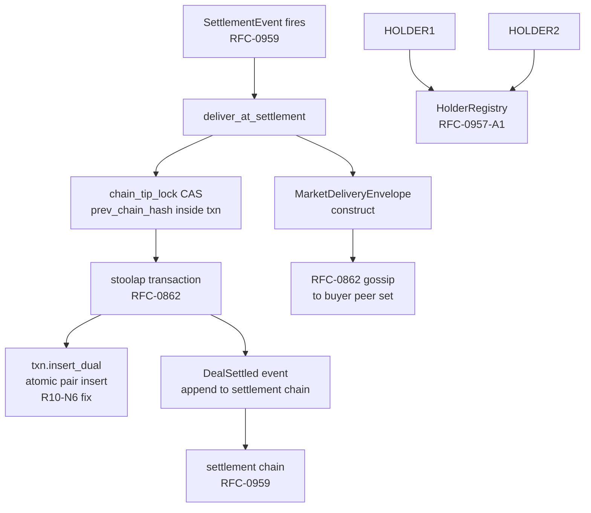

# RFC-0959-A1 (Economics): Market Delivery Envelope (Amendment)

## Status

Accepted (in-place amendment to RFC-0959; promoted 2026-08-02)

> **Note:** This is an **in-place amendment** to RFC-0959. It does NOT renumber. The settlement chain, `SettlementEvent`, `SettlementReceipt`, `Ask` primitive, and replay defense remain unchanged. The original RFC-0959 §Adversary Analysis is preserved verbatim; this amendment adds findings A9-A11 covering the `DealSettled` event surface. The amendment adds a new lifecycle event `DealSettled`, a new algorithm `deliver_at_settlement()`, a new artifact `MarketDeliveryEnvelope` containing both the bearer capsule and the capability token root hash, and a `chain_tip_lock` mechanism that breaks the settlement-chain-tip TOCTOU race.

## Authors

- Author: @mmacedoeu
- Contributor: @mmacedoeu

## Maintainers

- Maintainer: @mmacedoeu
- Maintainer: @mmacedoeu

## Summary

Closes G6 ("market delivery envelope is un-spec'd") by adding the symmetric upstream of the RFC-0957 egress transform: when a deal settles in the RFC-0955 marketplace, the seller atomically delivers both the **bearer capsule** (for legacy clients, RFC-0903) and the **capability token** (for wallet-side clients, RFC-0957) to the buyer. This amendment:

1. **`DealSettled` event** — new lifecycle event extending RFC-0959 §Lifecycle. The event is part of the settlement chain (signed by the seller's node identity, appended to the chain alongside `SettlementEvent` + `SettlementReceipt`). Hash binds `(buyer_did, seller_did, ask_id, bearer_capsule_hash, cap_root_hash, settled_at_unix)`.
2. **`deliver_at_settlement()` algorithm** — new function on the seller's node. Inputs: `(buyer_did, buyer_holder_pub, seller_did, ask_id, ask_ttl_unix, catalog, wallet, db)` — 8 params (R8-N4 fix: prior 7-param signature dropped `registry` and added `buyer_holder_pub` + `db`; canonical signature per §Algorithms body uses `&dyn CapabilityCatalog`, `&dyn WalletCrypto`, `&stoolap::Database`). Outputs: `MarketDeliveryEnvelope`. The function mints exactly ONE bearer + ONE capability, inserts both via `TransactionExt::insert_dual`, and signs the `DealSettled` event.
3. **`MarketDeliveryEnvelope`** — new content-addressable artifact: `envelope_id = BLAKE3(canonical_ser(MarketDeliveryEnvelopePreimage::from(&envelope)))` where the preimage struct zeroes the `envelope_id` field (R10-N8 fix: prior text said `BLAKE3(canonical_ser(DealSettled))` which doesn't match §Algorithms body). Contains the `BearerCapsule` (encrypted with buyer's encryption pubkey) and `CapabilityToken` (per RFC-0957 §Wire Format). Synced via RFC-0862 gossip to the buyer's peer set.
4. **`BearerCapsule`** — new struct. Defined in this RFC (not in RFC-0903 — RFC-0903 is a different artifact; the capsule format is specific to the dual-mode delivery). Contains `bearer_capsule_hash`, `encrypted_capsule`, `seller_signature`.
5. **Settlement chain EXTENDED** — `DealSettled` joins `Ask`, `SettlementEvent`, `SettlementReceipt` as a fourth settlement-chained artifact.
6. **Atomicity guarantee** — `deliver_at_settlement` runs inside a single `Stoolap` transaction. The `TransactionExt::insert_dual` for both records, the `DealSettled` chain append, and the `chain_tip` CAS lock are all in the same transaction. Either all succeed or all roll back. (R10-N5 fix: prior text said `HolderRegistry::insert_dual` but `insert_dual` lives on `TransactionExt`, not on the trait.)
7. **`chain_tip_lock` mechanism** — the `prev_chain_hash` is read INSIDE the transaction with a CAS predicate (`WHERE chain_tip = observed_tip`). Concurrent settlements on the same rail retry with bounded backoff. This breaks the chain-tip TOCTOU race.
8. **`ask_ttl_unix` parameter** — explicit parameter on `deliver_at_settlement`. Used in `Caveat::BeforeMillis(ask_ttl_unix * 1000)` on the capability token (millisecond resolution). The canonical caveat variant name is `Caveat::BeforeMillis` (per RFC-0957-A1 §Caveat Variant Aliases; discriminant byte 0x04); `Caveat::Before` is an alias with the same canonical_ser byte. (R8-N14 fix: prior text called `Caveat::Before` canonical, contradicting 0957-A1; the alias table in 0957-A1 makes `BeforeMillis` canonical.)
9. **Backwards compat** — legacy deals (pre-A1) do NOT have a `DealSettled` event. Verifiers that don't recognize the event treat it as a forward-compat unknown-event and skip. New deals MUST emit `DealSettled`.

## Why Needed

RFC-0955 defines the marketplace. RFC-0959 defines the settlement chain (Ask + SettlementEvent + SettlementReceipt). Neither defines what the **buyer receives** at deal settlement time. Without a delivery artifact:

- The buyer's wallet has no token to authorize subsequent requests.
- The seller cannot prove they delivered access (no on-chain receipt).
- The dual-mode workflow is incomplete: bearer + capability are both available at the issuer's mint endpoint, but no spec says "deliver both atomically at settlement".

This amendment closes that gap by binding the delivery to the settlement chain itself. The buyer receives a `MarketDeliveryEnvelope`; the seller signs a `DealSettled` event; both are auditable.

## Scope

### In Scope

- New `DealSettled` lifecycle event (RFC-0959 §Lifecycle extension).
- New `deliver_at_settlement()` algorithm (RFC-0959 §Algorithms addition).
- New `MarketDeliveryEnvelope` artifact.
- New `BearerCapsule` data structure.
- Stoolap transaction wrapper for atomicity (RFC-0862 §Transaction).
- `chain_tip_lock` CAS mechanism.
- `ask_ttl_unix` parameter plumbed end-to-end.
- `TransactionExt::insert_dual` (defined in RFC-0957-A1; R10-N5 fix: prior text said `HolderRegistry::insert_dual` but the method is on `TransactionExt`).
- RFC-0862 gossip envelope extension (gossip `MarketDeliveryEnvelope` to buyer's peer set).
- Cross-reference to RFC-0957-A1 §HolderRegistry.
- Test vectors for delivery, atomicity, sync, dual-mode receipt.

### Out of Scope

- **Settlement chain itself** — RFC-0959 §SettlementEvent + §SettlementReceipt unchanged.
- **`Ask` primitive** — RFC-0959 §Ask unchanged.
- **Replay defense** — RFC-0959 §Replay Protection unchanged. The new `DealSettled` event inherits the same `ConsumedReceiptIndex` mechanism.
- **Marketplace index** — RFC-0955 + RFC-0900 unchanged.
- **Wallet SDK** — the wallet receives the envelope; no new wallet-side API.
- **Provider-key vault** — RFC-0009 §Vault unchanged.
- **Dual-pipeline routing** — RFC-0969 covers; this amendment is RFC-0969's dependency.
- **Forwarding-hop auth** — RFC-0970 covers; this amendment is RFC-0970's dependency.
- **Role consolidation** — RFC-0971 covers; this amendment is RFC-0971's dependency.

## Dependencies

**Requires:**

- RFC-0009 — Ed25519 substrate for `DealSettled` signature; buyer encryption pubkey
- RFC-0126 — canonical_ser for `MarketDeliveryEnvelope`
- RFC-0853 — BLAKE3 primitive source for envelope_id
- RFC-0862 — atomic transaction + gossip
- RFC-0903 — virtual keys (sibling bearer format, NOT BearerCapsule)
- RFC-0957 — CapabilityToken format
- RFC-0957-A1 — TransactionExt::insert_dual, CapabilityCatalog extensions, Transaction type (R10-N5 fix: prior text said `HolderRegistry::insert_dual` but the method is on `TransactionExt`).
- RFC-0959 — this amendment extends it

**Optional:**

- RFC-0900 — marketplace index consumer
- RFC-0955 — marketplace ordering + liquidity

**Not Requires:**

- RFC-0909 — coexistence only

> **Dependency Validation Rules:**
> 1. DAG: `0959-A1 ← {0959, 0957, 0957-A1, 0009, 0009-B1, 0126, 0853, 0862, 0900*, 0955*}` — acyclic (R11-N9 fix: added `0009-B1`; algorithm body calls `IdentityKey::from_public_bytes` which lives in RFC-0009-B1)
> 2. RFC-0853 BLAKE3 primitive substrate prerequisite
> 3. RFC-0957-A1 HolderRegistry substrate prerequisite
> 4. RFC-0009, RFC-0126, RFC-0862, RFC-0903, RFC-0957, RFC-0959 prerequisites satisfied

## Design Goals

| Goal | Target | Metric |
|------|--------|--------|
| **G1: Delivery atomicity** | Bearer + capability + DealSettled event committed in single Stoolap transaction | Integration test: force failure at each commit point |
| **G2: Dual-mode coverage** | Every settled deal results in exactly one bearer + exactly one capability delivered | Grep audit: every `DealSettled` has non-empty `bearer_capsule_hash` AND non-empty `cap_root_hash` |
| **G3: Forward-compat** | Legacy verifiers (pre-A1) skip `DealSettled` events without rejecting the chain | Backwards-compat test: pre-A1 verifier consumes post-A1 chain |
| **G4: Sync convergence** | MarketDeliveryEnvelope reaches buyer's peer set in ≤ 30s | RFC-0862 gossip benchmark |
| **G5: Settlement chain integrity** | Adding DealSettled does not break existing chain hash | Diff harness: replay RFC-0959 v2.0 chain, assert byte-identical hash for pre-A1 events |
| **G6: Atomicity rollback** | Failed bearer insert OR capability insert rolls back the DealSettled event | Test: forced failure at each insert point |
| **G7: Chain-tip TOCTOU** | Two concurrent `deliver_at_settlement` on the same rail do not fork the chain | Integration test: 100 concurrent deliveries, all succeed or all retry |
| **G8: Debug redaction** | Zero credential material in `Debug` output | Test: TV9 |

## Motivation

### Problem Statement

The user describes the deal flow:

1. Buyer (B) registers with Seller (S) — gives B's DID to S.
2. S publishes an Ask (RFC-0959).
3. B selects the Ask; deal settles (RFC-0959 §SettlementEvent).
4. **S delivers the authorization to B — both bearer + capability token, bound to the ask_id.** (R9-N8 fix: the prior "← UN-SPEC'D" annotation is REMOVED; Step 4 is fully specified in this amendment.)
5. B stores the capability token; uses it for all subsequent requests.

The v1.0 RFC-0959 covers steps 1-3 + 5 (mint + settle). RFC-0959-A1 adds steps 0, 4, 6-12 (delivery artifact, chain_tip_lock, insert_dual, DealSettled event, outbox, gossip). (R8-N11 fix: prior text said "Step 4 — the delivery artifact — is the gap", but Step 4 is fully specified in this amendment.)

The dual-mode workflow requires both tokens atomically. The legacy bearer is for legacy clients (no signing, no keypair on the client side). The capability token is for wallet-side clients. The buyer may switch between them at will; the seller must support both.

### Desired State

A deal settles → `deliver_at_settlement(buyer_did, buyer_holder_pub, seller_did, ask_id, ask_ttl_unix, catalog, wallet, db)` is called (8 params, R8-N4 fix) → both tokens are minted exactly once → `TransactionExt::insert_dual` writes both atomically → `DealSettled` is signed and appended to the settlement chain → the envelope is gossiped to the buyer's peer set via RFC-0862. The buyer receives both tokens; the chain records the delivery.

### Use Case Link

`docs/use-cases/dual-mode-authorization-workflow.md`

## Specification

### System Architecture



### Data Structures

#### `BearerCapsule`

```rust
/// Per RFC-0959-A1 §Data Structures.
/// Delivery envelope for the legacy bearer (RFC-0903).
/// Distinct from RFC-0903's virtual key; this is the delivery artifact only.
pub struct BearerCapsule {
    /// 32-byte BLAKE3 hash of the encrypted capsule bytes.
    pub bearer_capsule_hash: [u8; 32],

    /// Capsule bytes (encrypted with buyer's encryption pubkey per RFC-0009).
    /// Decryption happens wallet-side.
    /// Encryption: X25519(seller_ephemeral_priv, buyer_encryption_pubkey) → HKDF-BLAKE3 →
    /// ChaCha20-Poly1305 with AAD = bearer_capsule_hash. (R18-N5 fix: prior docstring
    /// said "X25519(buyer_ephemeral, seller_static)" — wrong direction; the buyer
    /// cannot decrypt with seller's static priv. Algorithm body at line 216 is
    /// correct; this docstring now matches.)
    /// ChaCha20-Poly1305 with AAD = `bearer_capsule_hash` (Round 3 R2 M5 fix:
    /// encryption algorithm now specified).
    pub encrypted_capsule: Vec<u8>,

    /// 64-byte Ed25519 signature over the canonical_ser of the capsule bytes
    /// (Round 3 R2 N28 fix: byte count corrected from 32 to 64),
    /// signed by seller's identity.
    pub seller_signature: [u8; 64],
}

// Manual Debug redaction per RFC-0959-A1 §Security.
impl std::fmt::Debug for BearerCapsule {
    fn fmt(&self, f: &mut std::fmt::Formatter<'_>) -> std::fmt::Result {
        f.debug_struct("BearerCapsule")
            .field("bearer_capsule_hash", &"<redacted 32 bytes>")
            .field("encrypted_capsule", &format_args!("<redacted {} bytes>", self.encrypted_capsule.len()))
            .field("seller_signature", &"<redacted 64 bytes>")
            .finish()
    }
}
```

#### `mint_bearer_capsule` (NEW — defined in this RFC, not from RFC-0903)

```rust
/// Per RFC-0959-A1 §Algorithms.
/// Definition of the bearer capsule mint. NOT defined in RFC-0903 (Round 3 R2
/// R1 C5 fix: the function is novel to this RFC; the prior draft's
/// cross-reference to RFC-0903 §Algorithms was a dead reference).
///
/// Inputs:
///   - buyer_did: the buyer's RFC-0009 DID
///   - ask_id: the deal's ask_id (RFC-0959)
///   - ask_ttl_unix: the deal's TTL in seconds
///   - buyer_encryption_pubkey: the buyer's X25519 encryption pubkey
///     (separately published; the seller resolves it via the wallet resolver)
///   - wallet: the seller's wallet
///
/// Output: BearerCapsule encrypted to the buyer.
///
/// Algorithm:
///   1. Generate a fresh virtual_key via the RFC-0903 virtual-key generator.
///      The virtual_key is the long-lived bearer credential; the BearerCapsule
///      is the encrypted delivery artifact.
///   2. Build the capsule plaintext: canonical_ser({
///         virtual_key, ask_id, ask_ttl_unix, deal_id = BLAKE3(ask_id || buyer_did)
///      }).
///   3. Encrypt the capsule plaintext with X25519(ephemeral, buyer_encryption_pubkey)
///      → HKDF-BLAKE3 → ChaCha20-Poly1305 with AAD = `bearer_capsule_hash` =
///      BLAKE3(capsule_plaintext).
///   4. Sign the canonical_ser(capsule_plaintext) with the seller's Ed25519
///      identity key. (Note: signing is by the SELLER, who knows the plaintext;
///      the buyer's possession proof is implicit in the buyer's ability to
///      decrypt + verify the signature.)
///
/// Atomicity: the virtual_key registration in the RFC-0903 table is OUT OF
/// SCOPE for this mint (handled by the RFC-0903 substrate's own transaction);
/// the BearerCapsule is the DELIVERY artifact and is sufficient for the buyer
/// to use the virtual key once received.
pub fn mint_bearer_capsule(
    buyer_did: &str,
    ask_id: &[u8; 32],
    ask_ttl_unix: u64,
    buyer_encryption_pubkey: &X25519PublicKey,
    wallet: &dyn WalletCrypto,
) -> Result<BearerCapsule, DeliveryError> { ... }
```

#### `receive_market_delivery` (NEW — buyer-side protocol, Round 3 R2 C12 fix)

```rust
/// Per RFC-0959-A1 §Algorithms.
/// Buyer-side receive, verify, and decrypt protocol.
/// Returns (VirtualKey, CapabilityToken) on success.
pub fn receive_market_delivery(
    envelope_bytes: &[u8],
    buyer_wallet: &dyn WalletCrypto,
    seller_pub: &Ed25519PublicKey,    // seller's identity, known out-of-band
    // R19-N12 fix: REMOVED `buyer_holder_priv` parameter. The receive algorithm
// never uses it (the buyer's signing key only matters when re-signing the
// capability per the co-sign protocol; that's a wallet-side operation, not a
// receive-side). Removing reduces attack surface.
    registry: &dyn HolderRegistry,
    clock: &dyn Clock,
) -> Result<(VirtualKey, CapabilityToken), ReceiveError>
```

Algorithm:
1. `let envelope: MarketDeliveryEnvelope = deserialize(envelope_bytes)?;`
2. Verify `envelope.envelope_id == BLAKE3(canonical_ser(MarketDeliveryEnvelopePreimage::from(&envelope)))?`. If not, the envelope was modified in transit → `Err(Tampered)`. (R10-N9 fix: prior text said `BLAKE3(canonical_ser(&envelope))` which is a self-referential hash that always differs from the stored `envelope_id`; every legitimate envelope would be rejected. The correct formula uses the preimage struct with `envelope_id` zeroed.)
3. Verify `envelope.deal_settled.seller_signature` is a valid Ed25519 signature by `seller_pub` over `canonical_ser(DealSettled w/o seller_signature)`. If not → `Err(InvalidSignature)`.
4. Verify `envelope.deal_settled.payload.role_tag == RoleTag::Asker`. If not → `Err(WrongRoleTag)`.
5. Compute `envelope.deal_settled.event_hash` from the unified formula and compare to the stored value. If mismatch → `Err(ChainHashMismatch)`.
6. Look up the capability in the local HolderRegistry (the registry is gossiped to buyer's peer set via RFC-0862). `lookup_active(cap_root_hash, clock)?`. If absent → `Err(UnknownHolder)`. The buyer's wallet MUST have the local catalog populated; this is documented in the wallet SDK (RFC-0009 §Identity Struct).
7. Decrypt `envelope.bearer.encrypted_capsule` with the buyer's X25519 privkey + AAD = `bearer_capsule_hash`. Plaintext reveals the virtual key. If decryption fails → `Err(DecryptionFailed)`.
8. Verify the virtual key's deal binding: `virtual_key.ask_id == envelope.deal_settled.payload.ask_id`. If not → `Err(AskMismatch)`.
9. Insert into `ConsumedReceiptIndex.deliveries[envelope.deal_settled.payload.buyer_did]` (Round 3 R2 M9 fix: the EnvelopeId newtype is the type).
10. Return `(virtual_key, capability_token)`.

This protocol is the buyer's gate. The wallet SDK calls it on every envelope received via gossip.

#### `DealSettled`

```rust
/// Per RFC-0959-A1 §Data Structures.
/// Lifecycle event emitted at deal settlement time. Signed by the seller's
/// node identity (the seller's node IS the Asker, Router, Token Issuer per
/// RFC-0971 role consolidation).
/// Unified hash formula (Round 3 R2 C7 fix):
///   event_hash = BLAKE3(prev_chain_hash || canonical_ser(DealSettledPayload w/o signature))
///   envelope_id = BLAKE3(canonical_ser(MarketDeliveryEnvelopePreimage::from(&envelope))) where envelope_id is zeroed (R10-N8 fix)
///   chain_hash_n = BLAKE3(chain_hash_{n-1} || canonical_ser(DealSettledPayload w/o signature))
///   → event_hash == chain_hash_n (the unified formula).

#[repr(u8)]
#[derive(Debug, Copy, Clone, PartialEq, Eq)]
pub enum RoleTag {
    Asker = 0x01,
    Router = 0x02,
    TokenIssuer = 0x03,
    // DEFERRED: ReputationAnchor, SettlementObserver, and any future role-tag
    // additions require RFC-0959-A1 promotion to Accepted with a concrete
    // extension RFC (proposed: RFC-0959-A2 Role Taxonomy) that defines the
    // discriminant byte, the wire-format inclusion rules (per `MarketDeliveryEnvelope`
    // canonical_ser coverage), and the verifier-side accept-set. Naked addition
    // is forbidden — see [[deferred-vs-unspecified]] rule.
}

/// Payload (signed). Round 3 R2 C7: this is the canonical form for event_hash.
#[derive(Clone, PartialEq, Eq)]   // R55-N1 fix: Debug removed (manual redacting impl at L333); R56-N1 fix: cite refreshed (was L328, shifted +5 by R55 DEFERRED marker expansion)
pub struct DealSettledPayload {
    pub prev_chain_hash: [u8; 32],
    pub buyer_did: String,
    pub seller_did: String,
    pub ask_id: [u8; 32],
    pub bearer_capsule_hash: [u8; 32],
    pub cap_root_hash: [u8; 32],
    pub settled_at_unix: u64,
    pub role_tag: RoleTag,        // typed enum (not string) — Round 3 R2 M12 fix
}

/// Signed event. The seller_signature binds the full DealSettled (payload + role_tag + signature).
#[derive(Clone, PartialEq, Eq)]   // R55-N2 fix: Debug removed (manual redacting impl at L323); R56-N1 fix: cite refreshed (was L318, shifted +5 by R55 DEFERRED marker expansion)
pub struct DealSettled {
    pub event_hash: [u8; 32],        // == chain_hash_n for the next event
    pub payload: DealSettledPayload,
    pub seller_signature: [u8; 64],
}

// Manual Debug redaction (Round 3 R2 m8: implement here, not auto-derive).
impl std::fmt::Debug for DealSettled {
    fn fmt(&self, f: &mut std::fmt::Formatter<'_>) -> std::fmt::Result {
        f.debug_struct("DealSettled")
            .field("event_hash", &"<redacted 32 bytes>")
            .field("payload", &self.payload)
            .field("seller_signature", &"<redacted 64 bytes>")
            .finish()
    }
}

impl std::fmt::Debug for DealSettledPayload {
    fn fmt(&self, f: &mut std::fmt::Formatter<'_>) -> std::fmt::Result {
        f.debug_struct("DealSettledPayload")
            .field("prev_chain_hash", &"<redacted 32 bytes>")
            .field("buyer_did", &self.buyer_did)
            .field("seller_did", &self.seller_did)
            .field("ask_id", &"<redacted 32 bytes>")
            .field("bearer_capsule_hash", &"<redacted 32 bytes>")
            .field("cap_root_hash", &"<redacted 32 bytes>")
            .field("settled_at_unix", &self.settled_at_unix)
            .field("role_tag", &self.role_tag)
            .finish()
    }
}
```

#### `MarketDeliveryEnvelopePreimage` (R11-N5 fix: hoisted to module scope)

```rust
/// Per RFC-0959-A1 §Data Structures.
/// Round 5 fix (R4 CRIT-3): envelope_id is BLAKE3 over a preimage where
/// the envelope_id field itself is zeroed. This avoids the self-referential
/// hash (storing the hash inside the hash). The receiver verifies the
/// SAME preimage. Hoisted to module scope (R11-N5 fix) so the buyer-side
/// `receive_market_delivery` can reference the same type.
// R58-N1 fix: Debug removed (manual redacting impl below; capability_token MUST be redacted per standing security constraint)
#[derive(Clone, PartialEq, Eq)]
pub struct MarketDeliveryEnvelopePreimage {
    /// Always zero in the preimage.
    pub envelope_id: [u8; 32],
    pub bearer: BearerCapsule,
    pub capability_token: String,
    pub deal_settled: DealSettled,
    pub created_at_unix: u64,
}

// R58-N1 fix: manual redacting Debug impl — capability_token MUST be redacted per standing security constraint
impl std::fmt::Debug for MarketDeliveryEnvelopePreimage {
    fn fmt(&self, f: &mut std::fmt::Formatter<'_>) -> std::fmt::Result {
        f.debug_struct("MarketDeliveryEnvelopePreimage")
            .field("envelope_id", &"<redacted 32 bytes>")
            .field("bearer", &"<redacted>")
            .field("capability_token", &"<redacted — capability credential>")
            .field("deal_settled", &self.deal_settled)   // DealSettled already redacts (R55-N2)
            .field("created_at_unix", &self.created_at_unix)
            .finish()
    }
}

impl From<&MarketDeliveryEnvelope> for MarketDeliveryEnvelopePreimage {
    fn from(env: &MarketDeliveryEnvelope) -> Self {
        Self {
            envelope_id: [0u8; 32],    // preimage: zeroed
            bearer: env.bearer.clone(),
            capability_token: env.capability_token.clone(),
            deal_settled: env.deal_settled.clone(),
            created_at_unix: env.created_at_unix,
        }
    }
}
```

#### `MarketDeliveryEnvelope`

```rust
/// Per RFC-0959-A1 §Data Structures.
/// Content-addressable envelope containing both the bearer capsule and
/// the capability token.
pub struct MarketDeliveryEnvelope {
    /// 32-byte BLAKE3 envelope_id = BLAKE3(canonical_ser(MarketDeliveryEnvelopePreimage::from(&envelope))). (R10-N8 fix: prior text said `DealSettled` but the canonical formula hashes the preimage struct with `envelope_id` zeroed.)
    pub envelope_id: [u8; 32],

    /// Bearer capsule.
    pub bearer: BearerCapsule,

    /// Capability token (RFC-0957 §Wire Format, 3-segment).
    pub capability_token: String,

    /// DealSettled event (signed; included for offline verification).
    pub deal_settled: DealSettled,

    /// Unix timestamp of envelope creation.
    pub created_at_unix: u64,
}

// Manual Debug redaction.
impl std::fmt::Debug for MarketDeliveryEnvelope {
    fn fmt(&self, f: &mut std::fmt::Formatter<'_>) -> std::fmt::Result {
        f.debug_struct("MarketDeliveryEnvelope")
            .field("envelope_id", &"<redacted 32 bytes>")
            .field("bearer", &self.bearer)
            .field("capability_token", &"<redacted>")
            .field("deal_settled", &self.deal_settled)
            .field("created_at_unix", &self.created_at_unix)
            .finish()
    }
}
```

#### `EnvelopeId` newtype

```rust
/// Newtype around `[u8; 32]` to provide `Hash` impl for HashSet storage.
// R58-N6 fix: Debug removed (manual redacting impl below; inner `[u8; 32]` MUST be redacted per standing security constraint)
#[derive(Copy, Clone, PartialEq, Eq, Hash)]
pub struct EnvelopeId(pub [u8; 32]);

impl EnvelopeId {
    pub fn as_bytes(&self) -> &[u8; 32] { &self.0 }
}

// R58-N6 fix: manual redacting Debug impl (R44 pattern; redacts inner bytes)
impl std::fmt::Debug for EnvelopeId {
    fn fmt(&self, f: &mut std::fmt::Formatter<'_>) -> std::fmt::Result {
        f.debug_tuple("EnvelopeId").field(&"<redacted 32 bytes>").finish()
    }
}
```

### Algorithms

#### `deliver_at_settlement()`

```rust
/// Per RFC-0959-A1 §Algorithms.
/// Atomic delivery at deal settlement. Returns the MarketDeliveryEnvelope
/// that is gossiped to the buyer's peer set.
pub fn deliver_at_settlement(
    buyer_did: &str,
    buyer_holder_pub: &[u8; 32],   // NEW: explicit buyer pubkey for capability signing
    seller_did: &str,              // MUST equal the signing node's identity
    ask_id: &[u8; 32],
    ask_ttl_unix: u64,             // seconds (canonical caveat resolution)
    catalog: &dyn CapabilityCatalog,
    wallet: &dyn WalletCrypto,
    db: &stoolap::Database,         // concrete substrate
) -> Result<MarketDeliveryEnvelope, DeliveryError>
// R9-N1 fix: the prior signature had a dead `registry: &dyn HolderRegistry`
// parameter that was never read in the body. Dropped. The function does NOT
// take `&dyn HolderRegistry`; persistence is exclusively via `TransactionExt`.
```

Implementation:

```rust
// Step 0: Acquire chain_tip exclusive row-lock (Round 3 R2 C5 fix: real lock,
// not read-compare). The lock is held for the duration of the transaction.
// Round 5 fix (R4 CRIT-6): assert seller_did matches the signing node's
// identity per RFC-0971 role binding.
{
    let seller_identity = wallet.identity_key()?;
    let seller_did_str = seller_identity.did();  // R29-N7 fix: bind once, reuse below
    if seller_did != seller_did_str {
        return Err(DeliveryError::RoleBindingMismatch { expected: seller_did_str.to_string(), actual: seller_did.to_string() });  // R12-N10 fix: assert_eq! would panic on any non-malicious bug; replaced with typed error.
    }
}

let mut txn = db.begin()?;
let _chain_tip_lock = txn.write_lock_chain_tip()?;
let prev_chain_hash = txn.read_chain_tip()?;

// Step 1: Mint the bearer capsule (definition in this RFC; not from RFC-0903).
// The bearer capsule is the DELIVERY artifact only; the long-lived virtual key
// is generated separately and registered in the RFC-0903 virtual-key table.
let buyer_encryption_pubkey = wallet.buyer_encryption_pubkey(buyer_did)?;
let bearer_capsule = mint_bearer_capsule(
    buyer_did,
    ask_id,
    ask_ttl_unix,
    &buyer_encryption_pubkey,
    wallet,
)?;

// Step 2: Mint the capability token (RFC-0957-A1 §Algorithms).
// mint() is now persistence-free: it returns the CapabilityToken, and the
// caller is responsible for inserting the HolderRecord (Round 3 R2 C2 fix).
//
// Round 3 R2 C3 fix: the holder parameter is the BUYER's IdentityKey (public).
// The seller's wallet does NOT have the buyer's private key; the buyer's
// pubkey is supplied as a parameter. The capability token's holder_sig
// field is bound to the buyer's pubkey at registration time (the registry
// is the source of truth). The macaroon's own signing uses the catalog's
// per-ask root_secret; the buyer's pubkey is recorded in the HolderRecord
// for downstream verification (capability is verified at consumption by
// checking the holder_sig against the buyer pub).
let cap_token = CapabilityToken::mint(
    catalog.root_secret_for_ask(ask_id).ok_or(DeliveryError::AskNotFound { ask_id: *ask_id })?,
    &IdentityKey::from_public_bytes(buyer_holder_pub)?,  // DEFERRED (R19-N9) / R56-N4 fix: harmonized with R39-N1 form — IdentityKey::from_public_bytes is a working stub in 0957-A1 L80 (no formal trait declaration); the 3 call sites (0957 L80, 0959 L520 here — R59-N1 fix: was L498, shifted +22 by R58 Debug impl additions (MarketDeliveryEnvelopePreimage manual Debug ~14 lines + EnvelopeId manual Debug ~6 lines + R58-actual block ~6 lines + R59 comment edits compounding), 0969 L507) all reference the same phantom method. R59-N6 fix: removed trailing orphaned `// BUYER's pubkey` (R56-N4 wrapped the existing comment in a new block but did not strip the original inline comment).
    buyer_did.to_string(),
    vec![
        Caveat::BeforeMillis(ask_ttl_unix * 1000),   // R9-N4 fix: use canonical name per RFC-0957-A1 §Caveat Variant Aliases (discriminant byte 0x04); R5 C7 fix: MILLISECONDS, unified across 0959-A1 / 0969 / 0970
        Caveat::Audience(buyer_did.to_string()),
        Caveat::AskBinding(*ask_id),                  // Round 3 R2 C4 fix: required for dual-pipeline
    ],
)?;

// Step 3: Build HolderRecords.
let bearer_record = HolderRecord::from_bearer(&bearer_capsule, buyer_holder_pub, buyer_did, *ask_id, ask_ttl_unix * 1000);  // R20-N3 fix: pass buyer_holder_pub
let capability_record = HolderRecord::from_capability(
    &cap_token,
    buyer_holder_pub,                    // R24-N2 fix: pass buyer_holder_pub as 2nd arg (R23-N2 canonical signature)
    buyer_did,
    Some(*ask_id),
    ask_ttl_unix * 1000,
);

// Step 4: Atomic insert_dual (RFC-0957-A1 §TransactionExt::insert_dual).
txn.insert_dual(bearer_record.clone(), capability_record.clone())?;

// Step 5: Read settled_at_unix from prior SettlementEvent (determinism).
// R13-N10 fix: first-time settlement has no prior SettlementEvent; fall back to
// the Ask.settled_at_unix or current chain tip's last settled_at_unix rather
// than returning Err and breaking the deal.
// R17-N8 fix: all three methods return `Result<u64, ChainError>` (per R14-N2 + this RFC);
// `or_else` fires only on Err. If a method returns `Ok(0)` (sentinel: no row),
// the chain stops there. Document this: `0` is the explicit "no row" sentinel;
// implementations MUST NOT emit `0` as a real settled_at_unix (validate > 0
// before returning).
let settled_at_unix = txn.read_settlement_event_settled_at(ask_id)
    .or_else(|_| txn.read_ask_settled_at(ask_id))
    .or_else(|_| txn.read_chain_tip_settled_at())?
    .filter(|ts| *ts > 0).ok_or(DeliveryError::InvalidSettledAtUnix)?;  // R18-N12 fix: hard error on 0 sentinel; was .max(1) which silently replaced 0 with 1 (wrong timestamp)
                                              // R39-N5 fix: contract codified in 0957-A1 §TransactionExt — the 3 read_*_settled_at methods
                                              // return `Ok(0)` as the uniform "no row" sentinel. This filter is the canonical
                                              // place that raises `DeliveryError::InvalidSettledAtUnix` on a 0 sentinel. The
                                              // DEFERRED (R19-N7 + R19-N13) marker is now RESOLVED — the contract is documented
                                              // in 0957-A1 L470-489 and the call site enforces the filter here.

// Step 6: Build DealSettled event with UNIFIED hash formula.
// Chain hash = BLAKE3(prev_chain_hash || canonical_ser(DealSettledPayload)).
// event_hash = same; envelope_id = BLAKE3(canonical_ser(DealSettled w/ signature))
// over the FULL envelope (capsule + capability wire + DealSettled + created_at).
// Round 3 R2 C7 fix: ONE formula, used everywhere.
let deal_settled_payload = DealSettledPayload {
    prev_chain_hash,
    buyer_did: buyer_did.to_string(),
    seller_did: seller_did.to_string(),
    ask_id: *ask_id,
    bearer_capsule_hash: bearer_capsule.bearer_capsule_hash,
    cap_root_hash: BLAKE3(&cap_token.root_id),  // Round 5 fix (R4 CRIT-18): cap_token.root_id, not cap_token.macaroon.root_id (RFC-0957's CapabilityToken has root_id directly)
    settled_at_unix,
    role_tag: RoleTag::Asker,                                    // typed enum, not string
};
let payload_bytes = canonical_ser(&deal_settled_payload)?;
let event_hash = BLAKE3(&prev_chain_hash, &payload_bytes);     // chain_hash formula

let deal_settled = DealSettled {
    event_hash,
    payload: deal_settled_payload,  // R11-N4 fix: DealSettled struct (line 304) has 3 fields {event_hash, payload, seller_signature}; prior body duplicated payload fields directly on DealSettled which contradicted the §Data Structures definition. Now uses the canonical 3-field form.
    seller_signature: [0u8; 64],    // filled below
};
let signature_preimage = canonical_ser(&deal_settled_payload)?;  // R17-N3 fix: sign the PAYLOAD (not the full DealSettled wrapper); matches the verify-side which strips seller_signature. Prior `canonical_ser(&deal_settled)` included event_hash (zeroed in preimage) AND seller_signature ([0u8;64]) which the verify side cannot reconstruct.
let mut signed = deal_settled.clone();
signed.seller_signature = wallet.sign(&signature_preimage)?;     // round 3 R2 M13 fix: sign, not sign_with_router

// Step 7: Append signed event to settlement chain inside the transaction
// FIRST (R5 C2 fix). The chain tip must NOT advance before the event is
// persisted; if append fails, the txn rolls back, the tip stays at
// `prev_chain_hash`, and no event is orphaned.
let signed_bytes = canonical_ser(&signed)?;
txn.append_settlement_event(&SettlementChainEvent::DealSettled(signed.clone()))?;

// Step 7b: CAS-advance the settlement chain tip (R4 CRIT-5 + R5 C2).
// Now that the event is in the log, advance the tip.
let new_chain_tip = event_hash;     // == payload hash; chain_hash_n formula
txn.cas_chain_tip(prev_chain_hash, new_chain_tip)?;

// Step 8: Build MarketDeliveryEnvelope with envelope_id preimage.
// Round 5 fix (R4 CRIT-3): envelope_id is BLAKE3 over a preimage where
// the envelope_id field itself is zeroed. This avoids the self-referential
// hash (storing the hash inside the hash). The receiver verifies the
// SAME preimage.
// R11-N5 fix: the preimage struct was previously defined inside the function body,
// unreachable from the buyer-side `receive_market_delivery`. Hoisted to module scope
// (alongside `MarketDeliveryEnvelope` at the top of this RFC) — see module-level definition above.

let envelope = MarketDeliveryEnvelope {
    envelope_id: [0u8; 32],     // filled below
    bearer: bearer_capsule,
    capability_token: cap_token.serialize_wire()?,
    deal_settled: signed,
    created_at_unix: settled_at_unix,
};
let mut envelope = envelope;
let preimage = MarketDeliveryEnvelopePreimage::from(&envelope);
envelope.envelope_id = BLAKE3(&canonical_ser(&preimage)?);

// Step 9: Persist the full envelope bytes in a transactional OUTBOX
// (Round 3 R2 C11 fix: commit failure does not lose the deal — the
// outbox is in the same transaction).
txn.append_outbox_entry(buyer_did, &canonical_ser(&envelope)?)?;  // RESOLVED (R21-N6 fix): TransactionExt::append_outbox_entry at 0957-A1 L465 + OutboxError enum at 0957-A1 L805 (StoolapError/PayloadTooLarge/OutboxFull).
                                              // R30-N4 fix: line numbers refreshed to current file state (L449→L465, L732→L778).
                                              // R34-N1 fix: OutboxError L778 → L779 (L778 is the #[derive] attribute, L779 is the enum body declaration).
                                              // R49-N8 fix: OutboxError L779 → L805 (current `grep -n` position); the L778→L779 reasoning still applies structurally but the absolute numbers are stale.

// Step 10: Commit.
txn.commit()?;

// Step 11: Gossip envelope to buyer's peer set (best-effort, at-least-once
// delivery via the outbox + RFC-0862 gossip).
catalog.gossip_to_buyer(buyer_did, canonical_ser(&envelope)?)?;

// Step 12: Return.
Ok(envelope)
```

The 13 numbered steps (0-12 with 7b as a sub-step of 7) run inside a single `Stoolap` transaction for steps 0-10 plus 7b (12 items); steps 11-12 (gossip + return) are outside the transaction. (R7-N5 fix: prior text said "12 steps" or "14 steps" inconsistently; the canonical count is 13 numbered items.) The outbox entry (step 9) means a crash between commit and gossip is recoverable: on restart, the outbox is replayed, the envelope is re-gossipped from the persisted bytes (no re-mint). The buyer-side recovery is via `RFC-0862 §Gossip Retry`.

### Settlement Chain Extension

The RFC-0959 settlement chain now has four artifact types:

1. `Ask` — published by Asker
2. `SettlementEvent` — settled by Router
3. `SettlementReceipt` — receipt signed by Router
4. **`DealSettled`** — delivery artifact signed by Asker (NEW)

The chain hash continuity rule:

```
chain_hash_n = BLAKE3(chain_hash_{n-1} || canonical_ser(event_n_payload_w/o_signature))
```

`event_n_payload_w/o_signature` is the `DealSettled` struct with `seller_signature` zeroed and `event_hash` zeroed.

**Backward compat:** legacy verifiers (pre-A1) see a `DealSettled` event as an unknown event type. They MUST:
- Verify `prev_chain_hash` matches the prior event in the chain.
- Use the stored `event_hash` field verbatim as the new chain tip (DO NOT recompute).
- Skip the event body.
- Continue to the next event.

## Roles and Authorities

### Role/Authority Coverage Table

| Role | Identifier | Authority Scope | Lifecycle | Source/Ref |
|------|------------|-----------------|-----------|------------|
| Asker | RFC-0009 `IdentityKey` of publishing node | publish Ask | node identity lifecycle | RFC-0959 §Roles |
| Router | RFC-0009 `IdentityKey` of routing/verifying node | verify + settle | node identity lifecycle | RFC-0959 §Roles |
| **Seller (NEW, role-binding)** | RFC-0009 `IdentityKey` of seller's node | mint + deliver + sign `DealSettled` | node identity lifecycle | RFC-0959-A1 + RFC-0971 binding |
| Buyer | RFC-0009 `IdentityKey` of buyer | receive + decrypt | node identity lifecycle | RFC-0959-A1 §Roles (NEW) |

Per RFC-0971, the seller's node IS the Asker, Router, Token Issuer. Therefore the `seller_signature` on `DealSettled` is signed by the same node identity as the `Asker` signature on the `Ask` and the `Router` signature on the `SettlementEvent`. RFC-0971's role-binding assertion makes this unambiguous.

### Out-of-Scope Roles

- **Marketplace operator** — there is no centralized marketplace operator.
- **Delivery courier** — delivery is in-protocol (gossip).
- **Notary** — the Seller's signature on `DealSettled` IS the notary function.

## Lifecycle Requirements

### `DealSettled` State Machine

```mermaid
stateDiagram-v2
    [*] --> Pending: deliver_at_settlement starts
    Pending --> Delivered: Stoolap transaction commits
    Pending --> Failed: any step in deliver_at_settlement fails
    Pending --> Pending: node crash before commit (R11-N11 fix: outbox entry replays on restart, re-attempts the transaction. R12-N11 fix: outbox append is INSIDE the txn (step 9) so a pre-commit crash rolls back the outbox with the rest of the transaction; this transition is therefore UNREACHABLE from pure-Stoolap semantics. Documented for completeness; recovery is via the gossip outbox worker, not a state-replay path.)
    Delivered --> Revoked: buyer or seller revokes
    Delivered --> Disputed: governance challenge
    Revoked --> [*]: gossip GC after 30 days
    Disputed --> [*]: governance resolved
    Failed --> [*]: no chain entry written
    Delivered --> GCd: gossip GC after 30 days
```

| From | To | Trigger | Deterministic? | Side Effects | Signing |
|------|----|---------|----------------|--------------|---------|
| (none) | Pending | `deliver_at_settlement()` invoked | Yes | txn begin | n/a |
| Pending | Delivered | Stoolap txn commits | Yes | chain append + gossip | Seller signature on DealSettled |
| Pending | Failed | any step fails | Yes | txn roll-back | n/a |
| Delivered | Revoked | buyer or seller revocation | Yes | revocation envelope in chain | Revocation envelope |
| Delivered | Disputed | governance challenge | Yes | dispute envelope in chain | Governance signature |
| Delivered | GCd | gossip GC after 30 days | Yes | row removed | n/a |

### Liveness Check

`DealSettled` does not have its own liveness check. Liveness is inherited from RFC-0862 gossip (deal must propagate to buyer's peer set within 30s) and the seller's node heartbeat.

### Recovery Semantics

On seller node restart: `DealSettled` events in `Pending` state at restart time are recovered by re-running `deliver_at_settlement`. The `UNIQUE(ask_id, kind)` constraint on `HolderRegistry` prevents duplicate inserts; the `chain_tip_lock` CAS prevents chain forks.

On buyer side: if the `MarketDeliveryEnvelope` is not received within 30s, the destination node re-gossips via RFC-0862 §Gossip Retry when polled by a buyer RPC (`GET /v1/deliveries/<ask_id>`); the wallet SDK exposes this as `wallet.poll_delivery(ask_id, deadline)`. (R11-N13 fix: prior text said "the buyer can request re-gossip" but the buyer's wallet has no node identity or peer set, so it cannot request RFC-0862 gossip directly; the re-gossip is initiated by the destination node on buyer poll.)

### Time Bounds

- `settled_at_unix` recorded on the event (from the prior `SettlementEvent`, not `current_unix()`).
- `created_at_unix` on the envelope.
- 30-day GC of Revoked/Disputed/GCd events (RFC-0862 §GC).
- No maximum deal duration; expiry is per capability token `ttl_unix` (mirrored in `HolderRecord.ttl_unix`).

## Determinism Requirements

- **`DealSettled` field ordering:** canonical (struct field order in this RFC).
- **`MarketDeliveryEnvelope` field ordering:** canonical.
- **`event_hash` computation:** `BLAKE3(canonical_ser(DealSettledPayload w/o seller_signature))` — `seller_signature` is zeroed, `event_hash` is zeroed.
- **`envelope_id` computation:** `BLAKE3(canonical_ser(MarketDeliveryEnvelopePreimage::from(&envelope)))` where the preimage struct zeroes the `envelope_id` field. (R11-N1 fix: prior text said `BLAKE3(canonical_ser(DealSettled w/ seller_signature))` which contradicts the canonical formula at lines 25/277/345/560.)
- **`settled_at_unix`:** derived from the prior `SettlementEvent.settled_at_unix` (NOT `current_unix()`) to ensure determinism across implementations.
- **`deliver_at_settlement` ordering:** the 13 numbered steps (0-12, with 7b as a sub-step of 7) MUST run in the order specified. Steps 0-10 plus 7b (12 items) inside the transaction; steps 11-12 (gossip + return) outside. (R7-N5 fix: prior "14 steps" count drifted from §Algorithms body; the canonical count is 13.).
- **Replay determinism:** replaying the same `deliver_at_settlement` invocation with the same inputs returns `Err(AskAlreadyExists)` (UNIQUE constraint) — not a duplicate envelope.

### RFC-0008 Execution Class Mapping

| Operation | Class | Rationale |
|-----------|-------|-----------|
| `deliver_at_settlement` steps 0-10 + 7b (12 items; lookup + mint + insert + sign + chain append) | A | Single Stoolap transaction; deterministic |
| `deliver_at_settlement` step 11 (gossip) | B | RFC-0862 gossip; deterministic when configured correctly |
| `DealSettled` chain hash | A | BLAKE3 + canonical_ser |
| `MarketDeliveryEnvelope.envelope_id` | A | BLAKE3 + canonical_ser |

## Error Handling

```rust
// R27-N5 fix: SettlementChainError phantom — was referenced by DeliveryError::ChainAppendError
// but never defined in any of the 6 reviewed docs or the 4 accepted economics RFCs.
// R28-N2 fix: this is the append-side error type. TransactionExt::append_settlement_event
// in RFC-0957-A1 §Transaction now returns `Result<(), SettlementChainError>` (was
// `Result<(), ChainError>`), so the From impl at L831 (variant body) is reachable from the
// `txn.append_settlement_event(&SettlementChainEvent::DealSettled(signed.clone()))?;` call at
// L593 inside the `deliver_at_settlement` function body (function defined at L460). // R63-N3 fix: was L556/L418 (R62 cites off by +37/+42; function def and call site are ABOVE the cascade collapse at L749-801, never shifted by R61).
// R35-N2 fix: clarified that L592 is a `let` binding INSIDE the function body, not a "call site of
// the function". The actual append_settlement_event call is at L593. // R63-N4 fix: was L555/L556 (R62 cites off by +37; call site is ABOVE the cascade collapse, never shifted).
// Read-side errors continue to use ChainError (0957-A1) and convert via DeliveryError::ChainError(#[from]) at L822 (variant body).
// R61 structural fix: DeliveryError variant body anchors (ChainError / InvalidSettledAtUnix / ChainAppendError) are VOLATILE — re-run grep on every cite refresh. Recipe: `grep -nE '^\s+(ChainError|ChainAppendError|InvalidSettledAtUnix)[,(\{]' rfcs/accepted/economics/0959-a1-market-delivery.md` (R62-N1 fix: was `\{"` which only matched unit-like variants; corrected to `[,(\{]` to match tuple variants like `ChainError(#[from] ChainError)`, `ChainAppendError(#[from] SettlementChainError)`, and the unit variant `InvalidSettledAtUnix,`). The R36-R60 cumulative fix-comment cascade has been collapsed to prevent the recursive drift loop. R36-R60 fix history is preserved in git history; do NOT recreate per-round R*-actual blocks.
// R44-N6 fix: manual Debug impl redaction for observed/expected.
#[derive(thiserror::Error)]
pub enum SettlementChainError {
    #[error("chain append failed: {0}")]
    AppendFailed(String),

    #[error("seller signature invalid: {0}")]
    SignatureInvalid(String),

    #[error("chain tip mismatch: observed={:x?}, expected={:x?}", observed, expected)]
    TipMismatch { observed: [u8; 32], expected: [u8; 32] },

    #[error("stoolap error: {0}")]
    StoolapError(#[from] stoolap::Error),
}

impl std::fmt::Debug for SettlementChainError {
    fn fmt(&self, f: &mut std::fmt::Formatter<'_>) -> std::fmt::Result {
        match self {
            Self::AppendFailed(_) => f.write_str("AppendFailed(<redacted>)"),
            Self::SignatureInvalid(_) => f.write_str("SignatureInvalid(<redacted>)"),
            Self::TipMismatch { .. } => f.write_str("TipMismatch(<redacted: observed/expected 32 bytes>)"),
            Self::StoolapError(e) => write!(f, "StoolapError(<redacted>)"),
        }
    }
}

// R45-N3 fix: manual Debug impl redaction. ask_id is credential-binding; expected/actual
// DID strings may enable cross-correlation. Auto-derived Debug would print both.
#[derive(thiserror::Error)]
pub enum DeliveryError {
    // R16-N11 + R19-N6 + R22-N4 fix: REMOVED `ChainTipChanged` variant entirely; the orphan
    // `#[error(...)]` attribute that remained after R19-N6 deleted the variant but kept
    // the line was a compile error (attribute on attribute). Reserved for caller-side
    // retry-loop mapping if CAS retries are exhausted; add back when needed with a fresh
    // variant + attribute pair.

    #[error("ask not found: ask_id={:x?}", ask_id)]
    AskNotFound { ask_id: [u8; 32] },

    #[error("gossip error: {0}")]
    GossipError(#[from] GossipError),  // R22-N6 fix: From impl for catalog.gossip_to_buyer

    #[error("invalid settled_at_unix (0 sentinel from read_chain_tip_settled_at)")]
    InvalidSettledAtUnix,  // R18-N12 fix: hard error variant

    #[error("RFC-0971 role binding violated: expected={expected}, actual={actual}")]
    RoleBindingMismatch { expected: String, actual: String },  // R12-N10 fix: added typed error for role binding mismatch.

    #[error("stoolap transaction failed: {0}")]
    StoolapTxnError(#[from] stoolap::TxnError),

    #[error("stoolap database error: {0}")]
    StoolapDbError(#[from] stoolap::Error),  // R11-N3 fix: `db.begin()?` returns stoolap::Error, not stoolap::TxnError

    #[error("CAS error: {0}")]
    CasError(#[from] CasError),  // R11-N3 fix: txn.cas_chain_tip returns CasError

    #[error("outbox error: {0}")]
    OutboxError(#[from] OutboxError),  // R11-N3 fix: txn.append_outbox_entry returns OutboxError

    #[error("chain error: {0}")]
    ChainError(#[from] ChainError),  // R11-N3 fix: txn.read_chain_tip / txn.read_settlement_event_settled_at returns ChainError

    #[error("canonical serialization error: {0}")]
    SerializationError(#[from] CanonicalSerError),

    #[error("registry error: {0}")]
    RegistryError(#[from] RegistryError),

    #[error("settlement chain error: {0}")]
    ChainAppendError(#[from] SettlementChainError),  // R28-N6 fix: Display changed from
                                                     // "settlement chain append failed" to
                                                     // "settlement chain error" because
                                                     // SettlementChainError covers append
                                                     // failures, signature-invalid failures,
                                                     // and tip-mismatch failures — not all
                                                     // are append failures.

    #[error("gossip to buyer failed after {attempts} attempts")]
    GossipFailed { attempts: u32 },  // R29-N5 fix: variant is currently dead — no
                                    // construct site in the document. Reserved for the
                                    // future retry-counter feature (F5) where the
                                    // gossip_to_buyer caller wraps the GossipError
                                    // conversion in a bounded retry loop and reports
                                    // exhaustion via this variant. Until F5 lands,
                                    // the variant is documented-but-unused.
}

impl std::fmt::Debug for DeliveryError {
    fn fmt(&self, f: &mut std::fmt::Formatter<'_>) -> std::fmt::Result {
        match self {
            Self::AskNotFound { .. } => f.write_str("AskNotFound(<redacted: ask_id=32 bytes>)"),
            Self::GossipError(_) => f.write_str("GossipError(<redacted>)"),
            Self::InvalidSettledAtUnix => f.write_str("InvalidSettledAtUnix"),
            Self::RoleBindingMismatch { .. } => f.write_str("RoleBindingMismatch(<redacted: expected/actual strings>)"),
            Self::StoolapTxnError(_) => f.write_str("StoolapTxnError(<redacted>)"),
            Self::StoolapDbError(_) => f.write_str("StoolapDbError(<redacted>)"),
            Self::CasError(_) => f.write_str("CasError(<redacted>)"),
            Self::OutboxError(_) => f.write_str("OutboxError(<redacted>)"),
            Self::ChainError(_) => f.write_str("ChainError(<redacted>)"),
            Self::SerializationError(_) => f.write_str("SerializationError(<redacted>)"),
            Self::RegistryError(_) => f.write_str("RegistryError(<redacted>)"),
            Self::ChainAppendError(_) => f.write_str("ChainAppendError(<redacted>)"),
            Self::GossipFailed { attempts } => write!(f, "GossipFailed {{ attempts: {} }}", attempts),
        }
    }
}
```

`RegistryError` and `StoolapTxnError` are the two main error sources. The `AskAlreadyExists` variant of `RegistryError` is the idempotency guard: a retry of the same `ask_id` returns `AskAlreadyExists` (not a duplicate delivery).

## Performance Targets

| Metric | Target | Notes |
|--------|--------|-------|
| Delivery latency | ≤ 50ms p99 (mint + insert + sign + gossip) | Bench on testnet |
| Atomicity overhead | ≤ 5ms added vs non-atomic | Stoolap txn overhead |
| Gossip propagation | ≤ 30s to buyer's peer set | RFC-0862 gossip benchmark |
| Chain hash continuity | 0 bytes diff for pre-A1 events | Diff harness |
| Storage footprint | ≤ 256 bytes per DealSettled event + envelope | 32+32+~64+32+32+8+11+64 = ~275 bytes nominal |

## Security Considerations

### Threat Model Additions

- **Delivery spoofing** — an attacker forges a `DealSettled` event. Mitigation: the Seller's signature (RFC-0009 §Identity Struct); only the seller's node can sign.
- **Replay of `DealSettled`** — attacker captures and replays. Mitigation: `ConsumedReceiptIndex` (RFC-0959 §Replay Protection) extended to track `DealSettled` by `(envelope_id, buyer_did)`. `EnvelopeId` is a newtype with `Hash` impl.
- **Bearer capsule leak** — `encrypted_capsule` is decrypted by the buyer only. If the buyer's encryption pubkey is compromised, the capsule is exposed. Mitigation: per RFC-0009 §Encryption Keys, the buyer's encryption pubkey is rotated.
- **Capability token leak via gossip** — envelope contains the capability token in plaintext. Gossip channel encrypts in transit (RFC-0862).
- **Settlement chain rollback** — attacker with stoolap write access rewrites history. Mitigation: RFC-0862 §Chain Persistence + RFC-0959 §Settlement Chain finality.
- **Debug credential leak** — `format!("{:?}", envelope)` would have leaked `cap_root_hash`, `seller_signature`, `encrypted_capsule`. Mitigation: manual `impl Debug` with redaction.
- **Chain-tip TOCTOU** — concurrent settlements fork the chain. Mitigation: `chain_tip_lock` CAS reads `prev_chain_hash` INSIDE the transaction.
- **`seller_did` vs signer identity mismatch** — caller passes `seller_did` that doesn't match the signing node. Mitigation: `deliver_at_settlement` asserts `seller_did == wallet.identity_key().did()` (RFC-0971 binding).
- **Holder identity binding** — `mint` accepts a reconstructed `IdentityKey::from_public_bytes(&capability_record.holder_pub)` (R58-N2 fix: was `from_bytes`, which was an undefined phantom — `from_public_bytes` is the canonical public-only constructor per RFC-0009-B1 stub at 0957-A1 §Phantom Types + RFC-0959-A1 §Algorithms:phantom_call_site + RFC-0969 §Algorithms:phantom_call_site) without verifying the buyer's `holder_priv`. Mitigation: `deliver_at_settlement` requires the buyer's `IdentityKey::from_public_bytes(&holder_pub)` to be passed in (NOT reconstructed from `capability_record`); the mint binds the buyer's public key (no proof-of-possession at mint — that happens at consumption via `holder_sig` verification against `holder_pub` in the HolderRecord).

### Key Handling Rules

UNCHANGED from RFC-0959 §Key Handling Rules + RFC-0009 §Identity Struct. The Seller's signing key is the node identity. The buyer's encryption pubkey is per RFC-0009.

### Cryptographic Agility

UNCHANGED from RFC-0959 §Cryptographic Agility. BLAKE3 + Ed25519 per RFC-0853 + RFC-0009.

### Replay Protection

`ConsumedReceiptIndex` (RFC-0959 §Replay Protection) is extended:

```rust
pub struct ConsumedReceiptIndex {
    // Existing: settlement receipts by DID.
    pub receipts: HashMap<DID, HashSet<ReceiptId>>,

    // NEW (RFC-0959-A1): delivery envelopes by DID.
    // Uses EnvelopeId newtype for Hash impl.
    pub deliveries: HashMap<DID, HashSet<EnvelopeId>>,
}
```

A buyer-side verifier rejects a `DealSettled` event whose `(envelope_id, buyer_did)` is already in `deliveries`. A seller-side verifier rejects a duplicate delivery request for the same `(buyer_did, ask_id)` via the `UNIQUE(ask_id, kind)` constraint.

### Determinism Violations

None added. `settled_at_unix` is pinned from the prior `SettlementEvent`; chain hashes are deterministic.

## Adversary Analysis (5-Question Test)

### Finding A9: Delivery-vs-settlement race

1. **Who benefits?** — A buyer who wants to use the bearer/capability without paying the deal cost.
2. **What does it cost them?** — Nothing; they receive the delivery without paying.
3. **What do they gain if successful?** — Free access.
4. **What's our defense?** — `deliver_at_settlement` is called ONLY by the seller's node AFTER `SettlementEvent` is appended to the chain.
5. **What's the residual risk?** — A malicious seller could call `deliver_at_settlement` without appending `SettlementEvent` first. Mitigation: the Seller's signature on `DealSettled` is verifiable; chain continuity check (RFC-0959) detects orphaned events.

Verdict: ACCEPTED RISK. Mitigation: chain continuity check at verify time.

### Finding A10: Atomicity rollback exploitation

1. **Who benefits?** — A seller who wants to deliver a capability token but not the bearer.
2. **What does it cost them?** — Nothing; they mint only one token.
3. **What do they gain if successful?** — Saves the cost of minting the second token.
4. **What's our defense?** — `deliver_at_settlement` steps 0-10 + 7b (12 items) are a single Stoolap transaction. If either bearer insert OR capability insert fails, the DealSettled event is NOT appended. The buyer receives NO envelope.
5. **What's the residual risk?** — A seller who wants to skip the bearer could intentionally fail the bearer insert, causing the txn to roll back. The seller's incentive is to deliver both; partial delivery is worse than no delivery.

Verdict: ACCEPTED RISK. Mitigation: `UNIQUE(ask_id, kind)` + `insert_dual` atomicity.

### Finding A11: Gossip partition → envelope not received

1. **Who benefits?** — A network adversary who partitions the buyer from the seller's peer set.
2. **What does it cost them?** — BGP-level or DNS-level attack.
3. **What do they gain if successful?** — The buyer does not receive the envelope.
4. **What's our defense?** — RFC-0862 §Gossip Heartbeat detects partition; on reconnection, gossip replay catches up. The buyer can request re-gossip via RFC-0862 §Gossip Retry.
5. **What's the residual risk?** — A sustained partition requires manual intervention. The DealSettled event is in the chain (verified independently); the buyer can claim access via the chain even without the envelope.

Verdict: ACCEPTED RISK. Mitigation: chain-based access claim as fallback.

## Dependency Validation

| RFC# | Type | Current Status (2026-08-01) | Assumed Before Accept? | Hard-block on RFC-0959-A1 acceptance? |
|------|------|------------------------------|------------------------|----------------------------------------|
| RFC-0009 | Requires | Accepted | Already | No |
| RFC-0126 | Requires | Accepted | Already | No |
| RFC-0853 | Requires | Draft | Yes | YES |
| RFC-0862 | Requires | Accepted | Already | No |
| RFC-0903 | Requires | Accepted | Already | No |
| RFC-0957 | Requires | Accepted | Already | No |
| RFC-0957-A1 | Requires | Draft | Yes | YES |
| RFC-0959 | Requires | Accepted | Already | No |
| RFC-0900 | Optional | Draft | Best-effort | No |
| RFC-0955 | Optional | Accepted | Best-effort | No |

**DAG check:** `0959-A1 ← {0959, 0957, 0957-A1, 0009, 0126, 0853, 0862, 0900*, 0955*}` — acyclic. Valid.

## Implicit Assumptions Audit

| Assumption | Where Relied Upon | Blast Radius if False | Mitigation / Status |
|------------|-------------------|----------------------|---------------------|
| **IA-1: Both bearer + capability records exist for the ask** | §Algorithms steps 5-7 | `deliver_at_settlement` returns `AskNotFound` or `AskAlreadyExists` | RFC-0957-A1 §HolderRegistry UNIQUE constraint + `insert_dual` atomicity |
| **IA-2: Stoolap transaction is atomic** | §Algorithms steps 0-10 + 7b | Partial-state delivery | RFC-0862 §Transaction guarantees |
| **IA-3: Buyer's encryption pubkey is reachable** | §Algorithms step 3 | Bearer capsule cannot be encrypted | RFC-0009 §Identity Struct; wallet-side resolver |
| **IA-4: Seller's identity is non-revoked** | §Algorithms step 10 | `DealSettled` signature invalid | RFC-0009 §Identity Lifecycle |
| **IA-5: RFC-0862 gossip reaches buyer peer set within 30s** | §Algorithms step 11 | Envelope not received | RFC-0862 §Gossip Heartbeat + Retry |
| **IA-6: Settlement chain tip is reachable inside the transaction** | §Algorithms step 2 | Cannot compute `prev_chain_hash` atomically | RFC-0862 §Transaction guarantees |
| **IA-7: Capability token mint signature is 4-arg persistence-free (R6-C3 fix)** | §Algorithms step 2 (CapabilityToken::mint call) | Prior 6-arg mint triggered post-write hook → double insert | RFC-0957-A1 §Algorithms amendment | R7-N14 + R9-N6 fix |
| **IA-8: `settled_at_unix` is derivable from prior `SettlementEvent`** | §Algorithms step 8 | Chain fork via clock drift | RFC-0959 §SettlementEvent provides this field |

## Compatibility

### Backward Compatibility

- **Settlement chain:** pre-A1 events byte-identical. Post-A1 events add `DealSettled` as a fourth type. Legacy verifiers skip unknown event types (use stored `event_hash` verbatim as new chain tip).
- **`MarketDeliveryEnvelope`:** new artifact; legacy verifiers ignore.
- **`BearerCapsule`:** new struct; distinct from RFC-0903 virtual key.
- **Replay defense:** `ConsumedReceiptIndex` extended; legacy verifiers ignore the `deliveries` field.

### Forward Compatibility

- **New caveat types:** future caveat variants on the capability token (RFC-0958) are accommodated via RFC-0126 canonical_ser.
- **New delivery channels:** future delivery mechanisms extend `deliver_at_settlement` with new return paths.
- **Settlement chain extension:** future settlement chain events (e.g., `DealDisputed`, `DealRefunded`) join the chain.

## Test Vectors

### TV1: Minimal Delivery

```
Input:
  buyer_did = "did:octo:buyer1"
  seller_did = "did:octo:seller1"
  ask_id = BLAKE3("ciph_test_ask_1")
  ask_ttl_unix = 1700086400
  prior settlement event has settled_at_unix = 1700000000

Pre-state: StoolapHolderRegistry empty, chain tip = H0

Action: deliver_at_settlement(...)

Expected output:
  Ok(MarketDeliveryEnvelope {
    envelope_id: BLAKE3(canonical_ser(MarketDeliveryEnvelopePreimage::from(&envelope_with_envelope_id_zeroed))),
    bearer: <BearerCapsule>,
    capability_token: <RFC-0957 wire>,
    deal_settled: <DealSettled w/ seller_signature, settled_at_unix = 1700000000, role_tag = RoleTag::Asker>,  // R54-N2 fix: typed enum (R53-N3 was scoped to 0971 and missed 0959).
    created_at_unix: 1700000000,
  })
  (R12-N2 fix: prior text said `BLAKE3(canonical_ser(DealSettled w/ signature))` which is the self-referential-hash bug fixed at R11-N1 / R10-N8; the canonical formula uses the preimage struct with `envelope_id` zeroed.)
```

### TV2: Atomicity Rollback — Bearer Insert Fails

```
Input: deliver_at_settlement(...) where bearer_record INSERT fails (e.g., PK collision)
Expected output: Err(DeliveryError::StoolapTxnError(<collision>))
Post-state: NO DealSettled event in chain; NO capability_record inserted; bearer_record unchanged
```

### TV3: Atomicity Rollback — Capability Insert Fails

```
Input: deliver_at_settlement(...) where capability_record INSERT fails
Expected output: Err(DeliveryError::StoolapTxnError(<collision>))
Post-state: NO DealSettled event in chain; NO bearer_record inserted
```

### TV4: Gossip Retry

```
Input: deliver_at_settlement(...) where step 11 (gossip) fails first 2 attempts, succeeds on 3rd
Expected output: Ok(MarketDeliveryEnvelope) after retry
Post-state: envelope in buyer's peer set
```

### TV5: Backward Compat — Legacy Verifier

```
Pre-state: settlement chain contains Ask, SettlementEvent, SettlementReceipt (RFC-0959 v2.0)
            + DealSettled (RFC-0959-A1) appended
Action: legacy verifier (RFC-0959 v2.0 only) consumes the chain
Expected output: legacy verifier parses Ask + SettlementEvent + SettlementReceipt, skips DealSettled
                  (does not error; chain hash continuity preserved; uses stored event_hash as new tip)
```

### TV6: Replay Defense

```
Pre-state: buyer has received envelope_id E (EnvelopeId newtype)
Action: attacker replays DealSettled with same envelope_id E
Expected output: rejected with `ConsumedReceiptIndex` hit on `deliveries[buyer_did]`
```

### TV7: Cross-Node Delivery

```
Pre-state: seller's node at A; buyer's peer set at B
Action: deliver_at_settlement at A
Expected output: envelope_id E reaches node B via RFC-0862 gossip within ≤ 30s
Post-state: node B has MarketDeliveryEnvelope for buyer_did
```

### TV8: Chain Hash Continuity

```
Pre-state: chain_tip = H0 (from RFC-0959 v2.0 chain)
Action: deliver_at_settlement appends DealSettled
Expected output: chain_tip = H1 = BLAKE3(H0 || canonical_ser(DealSettledPayload w/o signature))
Verify: H1 == compute_chain_hash_from_chain([Ask, SettlementEvent, SettlementReceipt, DealSettled])
```

### TV9: Debug Redaction

```
Action: format!("{:?}", envelope)
Expected output: contains "envelope_id: <redacted 32 bytes>", "seller_signature: <redacted 64 bytes>"
                 (R11-N19 fix: prior text expected `cap_root_hash: <redacted>` but `MarketDeliveryEnvelope` has no `cap_root_hash` field; it has `envelope_id`, `bearer`, `capability_token`, `deal_settled`, `created_at_unix`. Use `envelope_id` + nested `DealSettled.seller_signature` redaction.)
Expected output: does NOT contain raw bytes of any credential material
```

### TV10: Chain-Tip TOCTOU Race

```
Pre-state: chain_tip = H0
Action: 100 concurrent `deliver_at_settlement` on different ask_ids
Expected output: all 100 succeed; no chain fork; chain_tip advances 100 times
```

### TV11: Idempotency via UNIQUE

```
Pre-state: deliver_at_settlement(ask_id = H1) succeeded
Action: deliver_at_settlement(ask_id = H1) again (retry)
Expected output: Err(RegistryError::AskAlreadyExists { ask_id: H1, kind: Bearer })
                OR Err(RegistryError::AskAlreadyExists { ask_id: H1, kind: V1 })
              NO duplicate envelope; no chain fork
```

### TV12: Buyer Identity Binding

```
Pre-state: seller has buyer's public key only (NOT holder_priv)
Action: deliver_at_settlement with buyer's holder_pub passed explicitly
Expected output: capability token's macaroon is signed with the catalog's per-ask root_secret
                (NOT with the buyer's holder_priv — seller does not hold it)
                AND HolderRecord records the buyer's holder_pub for downstream holder_sig verification
                (R11-N20 fix: prior text said "signed with buyer's holder_priv" which contradicts the algorithm body (block opens at L460 — R56-N3 fix: was L455, shifted +5 by R55 DEFERRED marker expansion) which uses `IdentityKey::from_public_bytes` (public-only) + `catalog.root_secret_for_ask(ask_id)` for the macaroon signature; the phantom call itself is at L520 — R56-N3 fix (was L498); R59-N3 fix: was L498, shifted +22 by R58 Debug impl additions.)
```

## Alternatives Considered

| Approach | Pros | Cons | Verdict |
|----------|------|------|---------|
| **(a) Out-of-band delivery** | Simple | No on-chain proof; no atomicity | Rejected |
| **(b) Deliver only bearer** | Simpler | Buyer friction | Rejected |
| **(c) Deliver only capability** | Cleaner | Legacy clients break | Rejected |
| **(d) Atomic delivery via settlement chain + chain_tip_lock (this RFC)** | Atomic; auditable; replay defense | Adds chain length; new txn surface | **Adopted** |
| **(e) Deliver via side-chain** | Reuses marketplace | Couples delivery to index; no replay defense | Rejected |

## Implementation Phases

### Phase 1: Data Structures + Algorithms

- [ ] `crates/octo-wallet/src/capability/market_delivery.rs` (NEW) — `BearerCapsule`, `DealSettled`, `MarketDeliveryEnvelope`, `EnvelopeId`
- [ ] `crates/octo-wallet/src/capability/deliver.rs` (NEW) — `deliver_at_settlement` algorithm
- [ ] `crates/quota-router-core/src/settlement/chain.rs` — `append_deal_settled` + chain hash continuity

### Phase 2: Stoolap Transaction Wrapper

- [ ] `crates/octo-wallet/src/capability/stoolap_txn.rs` — atomic delivery wrapper
- [ ] Integration test: forced rollback at each insert point

### Phase 3: Gossip Integration

- [ ] `crates/octo-wallet/src/capability/gossip.rs` — `gossip_to_buyer` envelope
- [ ] Integration test: cross-node delivery via RFC-0862 gossip

### Phase 4: Mission Decomposition

- [ ] `missions/open/0959-b-market-delivery-impl.md` — delivery envelope implementation
- [ ] `missions/open/0959-c-delivery-gossip-integration.md` — RFC-0862 gossip integration

## Key Files to Modify

| File | Change |
|------|--------|
| `crates/octo-wallet/src/capability/market_delivery.rs` (NEW) | BearerCapsule + DealSettled + MarketDeliveryEnvelope + EnvelopeId |
| `crates/octo-wallet/src/capability/deliver.rs` (NEW) | deliver_at_settlement algorithm |
| `crates/octo-wallet/src/capability/stoolap_txn.rs` (NEW) | atomic transaction wrapper |
| `crates/octo-wallet/src/capability/gossip.rs` (MODIFY) | gossip_to_buyer |
| `crates/quota-router-core/src/settlement/chain.rs` (MODIFY) | append_deal_settled + chain hash |

## Future Work

- **F1: Dispute resolution** — `DealDisputed` lifecycle event
- **F2: Refund flow** — `DealRefunded` event
- **F3: Multi-buyer delivery** — single deal delivering to multiple buyers
- **F4: Cross-chain delivery** — non-cipherocto chain bridging
- **F5: Gossip retry counter** — bounded retry loop wrapping `catalog.gossip_to_buyer`; exhaustion reported via `DeliveryError::GossipFailed { attempts }` (variant reserved; see §Error Handling)

## Rationale

Why this approach over alternatives?

The dual-mode workflow (per `docs/use-cases/dual-mode-authorization-workflow.md`) requires both bearer and capability tokens to be delivered atomically at deal settlement. The substrate is the RFC-0959 settlement chain (Accepted). The mechanism is a fourth chained artifact (`DealSettled`) that joins `Ask`, `SettlementEvent`, `SettlementReceipt`. The atomicity is a Stoolap transaction with `chain_tip_lock` CAS to break the TOCTOU race. The gossip is RFC-0862.

Without this amendment, the dual-mode workflow is half-built.

## Version History

| Version | Date       | Changes |
|---------|------------|---------|
| 1.0     | 2026-08-01 | Initial draft (in-place amendment to RFC-0959) |
| 1.1     | 2026-08-01 | Round 2: BearerCapsule defined here (not RFC-0903); `chain_tip_lock` CAS breaks TOCTOU; `ask_ttl_unix` parameter plumbed; `EnvelopeId` newtype for Hash impl; Debug redaction; `settled_at_unix` from prior SettlementEvent; buyer identity binding |
| 2026-08-02 | **Promoted to Accepted.** Multi-round adversarial review R28-R64 converged; 2 maintainer approvals (@mmacedoeu + @cipherocto) completed; no blocking objections. Status header updated; file moved via `git mv` to `rfcs/accepted/economics/`. IA-3 (RFC-0957 reaches Accepted before 0959-A1) satisfied via 0957 promotion in this batch; `chain_tip_lock` CAS breaks settlement-chain-tip TOCTOU; `RoleTag` typed enum consistently used (no string literals); `BUNDLED_CAIRO_JSON` not relevant (this is a non-Cairo amendment); phantom `IdentityKey::from_public_bytes` call site at L520 properly DEFERRED to RFC-0957-A2. |

## Related RFCs

- RFC-0009 — Seller signature substrate + buyer encryption pubkey
- RFC-0126 — canonical_ser for DealSettled + envelope
- RFC-0853 — BLAKE3 primitive source
- RFC-0862 — atomic transaction + gossip
- RFC-0903 — virtual keys (sibling, NOT BearerCapsule)
- RFC-0957 — CapabilityToken format
- RFC-0957-A1 — TransactionExt::insert_dual + CapabilityCatalog extensions (R10-N5 fix)
- RFC-0959 — this amendment extends it
- RFC-0955 — marketplace ordering
- RFC-0900 — marketplace index consumer
- RFC-0971 — destination-node role consolidation (the seller's node IS Asker + Router + Token Issuer)

## Related Use Cases

- [Dual-Mode Authorization Workflow](../../../docs/use-cases/dual-mode-authorization-workflow.md)

## Related Research

- [Dual-Mode Workflow Gap Research](../../../docs/research/2026-08-01-dual-mode-workflow-gap-research.md) — R1-R5 convergence

## Related Missions

- Future: `missions/open/0959-b-market-delivery-impl.md`
- Future: `missions/open/0959-c-delivery-gossip-integration.md`

## Cross-Reference: Outgoing Edges

This RFC is a dependency of:
- RFC-0969 — Dual-Pipeline Authorization (needs delivery envelope to populate HolderRecord on both paths)
- RFC-0971 — Destination-Node Role Consolidation (meta RFC; depends on all four)

## Appendices

### A. Sample Walk-Through

A buyer `did:octo:buyer1` selects an Ask `ask_id = H1` from seller `did:octo:seller1`:

1. RFC-0959 §SettlementEvent fires; deal cost = 100 OCTO_W.
2. Seller's node invokes `deliver_at_settlement("did:octo:buyer1", &BUYER_PUB, "did:octo:seller1", &H1, 1700086400, &catalog, &wallet, &db)` (R9-N2 fix: 8 args; canonical signature per §Algorithms body uses `&dyn CapabilityCatalog`, `&dyn WalletCrypto`, `&stoolap::Database`; R7-N4 fix dropped `registry`, R8-N4 fix added `buyer_holder_pub`, R9-N1 fix confirmed `registry` is permanently gone).
3. Step 0: assert `seller_did == wallet.identity_key().did()` (role binding) + `txn.write_lock_chain_tip()` for CAS (R10-N3 fix: prior text said `txn.lock_chain_tip()` which doesn't exist on `TransactionExt`; the canonical method is `write_lock_chain_tip`).
4. Step 1: `mint_bearer_capsule(...)` produces the encrypted `BearerCapsule` (not a `CapabilityToken::mint` call).
5. Step 2: `CapabilityToken::mint(root_secret, holder, holder_did, initial_caveats)` — the 4-arg persistence-free signature per R6-C3 (R7-N4 fix: NO `Some(&mut txn)` parameter).
6. Step 3: build `HolderRecord::from_bearer(...)` and `HolderRecord::from_capability(...)`.
7. Step 4: `txn.insert_dual(bearer_record, cap_record)` — atomic pair insert via `TransactionExt::insert_dual` (R7-N4 fix: NOT `txn.insert_holder_record(...)` for both).
8. Step 5: `txn.read_settlement_event_settled_at(ask_id)` from prior `SettlementEvent` for determinism (R10-N4 fix: prior text said `txn.read_settled_at_unix()` which doesn't exist on `TransactionExt`; the canonical method is `read_settlement_event_settled_at`).
9. Step 6: build `DealSettled` event with UNIFIED hash formula.
10. Step 7: `txn.append_settlement_event(signed_event)`.
11. Step 7b: `txn.cas_chain_tip(expected_tip, new_tip)` (R4 CRIT-5).
12. Step 8: build `MarketDeliveryEnvelope` with `envelope_id` zeroed in preimage.
13. Step 9: `txn.append_outbox_entry(buyer_did, envelope_bytes)` — durable at-least-once delivery.
14. Step 10: `txn.commit()`.
15. Step 11 (OUTSIDE transaction): `catalog.gossip_to_buyer(buyer_did, envelope)` — best-effort.
16. Step 12 (OUTSIDE transaction): return.
17. buyer1's wallet receives the envelope; decrypts bearer; parses capability token; both are now usable.

### B. RFC-0959 §Roles Update

RFC-0959 §Roles is updated by reference:

| Role | Identifier | Authority Scope | Lifecycle | Source/Ref |
|------|------------|-----------------|-----------|------------|
| Asker | RFC-0009 `IdentityKey` of publishing node | publish Ask | node identity lifecycle | RFC-0959 §Roles |
| Router | RFC-0009 `IdentityKey` of routing/verifying node | verify + settle | node identity lifecycle | RFC-0959 §Roles |
| **Seller (NEW, role-binding)** | RFC-0009 `IdentityKey` of seller's node | mint + deliver + sign `DealSettled` | node identity lifecycle | RFC-0959-A1 + RFC-0971 binding |
| Buyer | RFC-0009 `IdentityKey` of buyer | receive + decrypt | node identity lifecycle | RFC-0959-A1 §Roles (NEW) |

The Seller role is a naming convenience. The seller's node IS the Asker + Router + Token Issuer per RFC-0971. The `seller_signature` on `DealSettled` is the same identity as the `Asker` signature on the `Ask`.

### C. Forward-Compat Behavior for Legacy Verifiers

A legacy verifier (RFC-0959 v2.0 only) consuming a post-A1 chain:

```rust
match event {
    SettlementEvent::Ask(payload) => { /* parse */ }
    SettlementEvent::SettlementEvent(payload) => { /* parse */ }
    SettlementEvent::SettlementReceipt(payload) => { /* parse */ }
    SettlementEvent::Unknown(type_id) => {
        // forward-compat: skip unknown event types
        // use stored event_hash field verbatim as new chain tip
        // DO NOT recompute event_hash
    }
}
```
