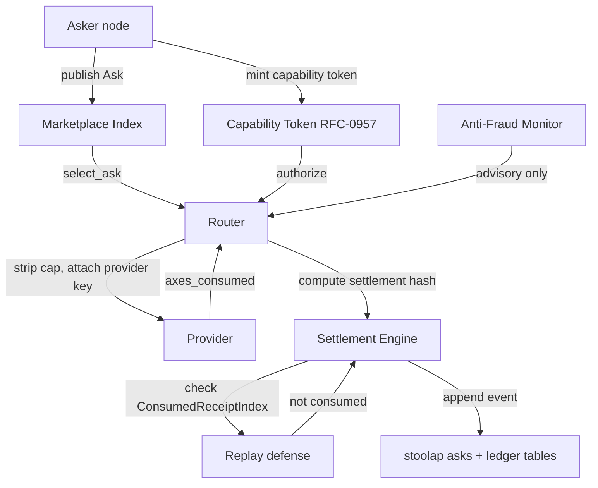
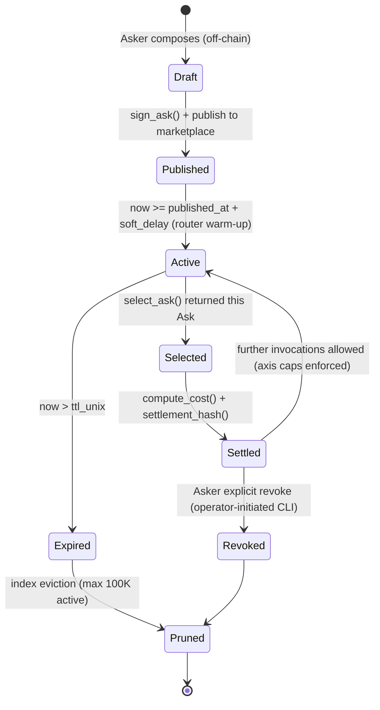
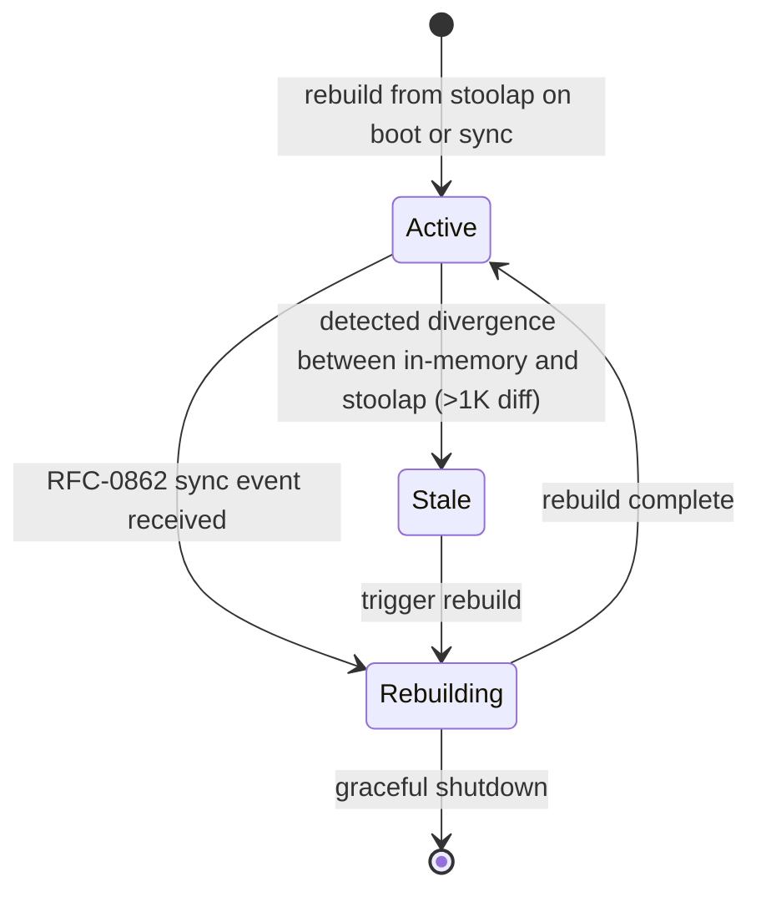

# RFC-0959 (Economics): Ask Settlement Chain (Independent)

## Status

Accepted

> **Note (v1.0, 2026-07-20):** Independent settlement chain for per-node Ask pricing. **NOT an amendment** of RFC-0909 (Deterministic Quota Accounting). Option A rewrite per S04 audit; R3 multi-round adversarial review surfaced false-amendment premise (RFC-0909 hashes `SpendEvent` over SHA-256, not BLAKE3 over `(api_key_id, axis_consumed, invocation_hash)`). RFC-0959 v1.0 establishes an independent chain that coexists with RFC-0909 rather than amending it. DAG drops RFC-0909; new DAG = `0959 ← {0126, 0853, 0009, 0957, 0862}`. All 8 R3 criticals addressed: (1) replay defense via `ConsumedReceiptIndex`, (2) `cost` bound into settlement hash + signed envelope, (3) single byte-exact envelope schema, (4) OCTO_WAmount/MicroOCTO_W conversion direction clarified, (5) BLAKE3 keyed-mode 32-byte key, (6) anti-fraud advisory-only preserved (no Class-A mutation), (7) test vectors reproducible (canonical_ser hex + algorithm reference), (8) forward-compat v69↔v70 contradictions dropped.

## Authors

- Author: @cipherocto (S03 + S04 settlement work; v1.0 Option A rewrite 2026-07-20)
- Contributor: @mmacedoeu (Option A rewrite per S04 audit; R3 multi-round adversarial review fixes)

## Maintainers

- Maintainer: @mmacedoeu
- Maintainer: @cipherocto

## Summary

Defines an **independent settlement chain** for per-node Ask pricing in CipherOcto's quota marketplace. Three artifacts:

1. **`SettlementEvent`** — content-addressable, signed, multi-axis settlement record. Hash = `BLAKE3(version_tag || cap_root_hash || ask_id || invocation_hash || canonical_axes_consumed || cost)`. Cost bound into hash (tampering breaks hash).
2. **`SettlementReceipt`** — router-signed envelope binding the event + nonce + settled_at_unix + receipt_id. `receipt_id = BLAKE3(canonical_ser(event || nonce || settled_at_unix))`. Replay defense via `ConsumedReceiptIndex: HashMap<DID, HashSet<ReceiptId>>` (R2 fix: HashMap-backed for O(1) avg lookup per R1 H1 fix).
3. **`Ask`** primitive — content-addressable, signed, multi-axis price quote. `ask_id = BLAKE3(canonical_ser(AskUnsignedPayload))`. Signed by node identity per RFC-0009.

Coexists with RFC-0909 (Deterministic Quota Accounting). RFC-0909 governs virtual-API-key spend tracking; RFC-0959 governs per-node-Ask marketplace settlement. Independent hash surfaces; both can operate in the same router instance.

## Dependencies

**Requires:**

- RFC-0126 (Numeric): Deterministic Serialization — canonical_ser for ask_id + axes encoding + envelope
- RFC-0853 (Networking): Overlay Cryptography — BLAKE3 primitive source for ask_id + cache_key_hash + settlement_hash
- RFC-0009 (Process): Identity Management — Ed25519 substrate for Ask signature + NodeType taxonomy
- RFC-0957 (Economics): Capability Token Format — cap_root_hash source + `AskBinding` caveat host
- RFC-0957-A1 (Economics): Holder Registry + Catalog Storage — `HolderRegistry::insert_dual` + `HolderKind::Bearer`/`Capability`/`HopCapability`/`ZKBearing`
- RFC-0959-A1 (Economics): Market Delivery Envelope — `DealSettled` event surface + `deliver_at_settlement` algorithm + `MarketDeliveryEnvelope` artifact
- RFC-0862 (Networking): Stoolap Sync Layer — marketplace index rebuild + cross-repo persistence for `asks` table

**Optional:**

- RFC-0910 (Economics): Pricing Table Registry — pricing-table consumer surface
- RFC-0900 (Economics): AI Quota Marketplace — marketplace index consumer

**Not Requires (per Option A):**

- RFC-0909 (Economics): Deterministic Quota Accounting — coexistence only; no amendment relationship

> **Dependency Validation Rules:**
> 1. Dependencies MUST form a DAG (no cycles) — verified: `0959 ← {0126, 0853, 0009, 0957, 0862, 0910*, 0900*}` (asterisk = optional); no back-edges.
> 2. All "Requires" RFCs MUST be listed as mission prerequisites — see `missions/claimed/0959-a-ask-pricing-stoolap.md`
> 3. Optional dependencies documented separately from required — done
> 4. Dependencies on "Draft" RFCs (RFC-0853, RFC-0009) MUST note the assumption they will reach Accepted prior to RFC-0959 promotion — see §Implicit Assumptions Audit IA-1, IA-2. RFC-0957 was Draft at RFC-0959 acceptance; IA-3 closes when RFC-0957 reaches Accepted (alongside RFC-0957-A1 + RFC-0959-A1 + RFC-0969 + RFC-0970 + RFC-0971).

## Dependency Validation

Standalone, top-level section to satisfy BLUEPRINT v1.3 mandatory section set.

| Dependency | Type | Current Status (2026-07-20) | Assumed Before Accept? | Hard-block on RFC-0959 acceptance? |
|------------|------|------------------------------|------------------------|-------------------------------------|
| RFC-0126 | Requires | Accepted | Already | No |
| RFC-0853 | Requires | Draft | Yes (IA-1: ACCEPTED RISK) | YES |
| RFC-0009 | Requires | Draft | Yes (IA-2: ACCEPTED RISK) | YES |
| RFC-0957 | Requires | Accepted (2026-08-02) | Yes (IA-3: CLOSED post-batch) | No |
| RFC-0862 | Requires | Accepted (2026-06-20); v1.2.0 (2026-06-25) at `rfcs/accepted/networking/0862-stoolap-data-sync.md` | Already | No |
| RFC-0910 | Optional | Accepted (v31) | n/a | No |
| RFC-0900 | Optional | Draft | Best-effort | No |
| RFC-0909 | (none) | Accepted (v69) | n/a | No (coexistence only) |

**DAG check:** `0959 ← {0126, 0853, 0009, 0957, 0862}` — acyclic. No back-edge. Valid.

**Mission prerequisite alignment:** `missions/claimed/0959-a-ask-pricing-stoolap.md` §"Mission-level (RFC prerequisites)" mirrors this table (RFC-0909 dropped per Option A).

## Design Goals

| Goal | Target | Metric |
|------|--------|--------|
| G1 | Settlement hash deterministic across independent implementations | Two nodes replaying the same `(cap_root_hash, ask_id, invocation_hash, canonical_axes_consumed, cost)` MUST produce identical 32-byte hash |
| G2 | Ask identity collision resistance | 256-bit BLAKE3 output; collision risk 2^-128 |
| G3 | Marketplace index selection latency | ≤ 5ms p99 over 100K active Asks |
| G4 | Integer-only settlement math | No float anywhere; u128 throughout; per-axis `ceil(tokens/1000) * rate[axis]` |
| G5 | PricingAxis extension | Adding a new axis requires only TOML entry + parser bump; no code change for known axes |
| G6 | Replay defense | Same `(event_tuple, nonce)` from same router MUST yield distinct `receipt_id`; consumed-receipt index rejects duplicates deterministically |

## Motivation

CipherOcto quota marketplace needs a deterministic, per-node Ask pricing layer where:

1. **Ask-bound settlement** — every consumption event references the specific published Ask that priced the work. Without Ask binding, providers cannot defend against retroactive rate-table switches; askers cannot prove they were charged the published price.
2. **Capability-bound settlement** — every consumption event traces back to a specific capability token. Without capability binding, settlement hashes cannot tie back to an authorization context, breaking RFC-0957 capability attestation.
3. **Independent of RFC-0909** — RFC-0909 governs virtual-API-key spend tracking (SHA-256 over `SpendEvent`). Per-node Ask pricing is a different surface (multi-axis, marketplace-discovered, capability-bound). Coupling them via false-amendment framing (v0.3 premise) creates cross-RFC drift. Independent chain (Option A) keeps each RFC's hash surface clean.

RFC-0959 establishes the independent settlement chain. Coexistence with RFC-0909 is allowed in the same router instance — both can run without conflict.

## Roles and Authorities

> "Nothing should be implied" rule (specification layer): every actor affecting correctness, security, accountability, or consensus MUST be named.

### Role/Authority Coverage Table

| Role | Identifier | Authority Scope | Lifecycle | Source/Ref |
|------|------------|-----------------|-----------|------------|
| `Asker` | `node_id: DID` (per RFC-0009 §Identity Key Format) | Publish Ask; sign Ask payload; revoke own Asks before ttl_unix | Active → Expired → Pruned (state machine below) | RFC-0009, this RFC §Roles |
| `Router` | `node_id: DID`, NodeType ∈ {Wholesale, SelfHost, Hybrid} | Marketplace index; capability token verify (RFC-0957); settlement hash compute; receipt build; receipt_consumed index maintenance | stateless per request; survives via persistence | RFC-0009 |
| `Provider` | `node_id: DID` (opaque to router) | Execute inference; return axes_consumed | stateless per request | external |
| `Marketplace Index` | in-memory BTreeMap: `BTreeMap<(namespace, family, version), BTreeSet<AskId>>` rebuilt on RFC-0862 sync event | Read-only selection: `select_ask(did, model, jurisdiction, budget_ceiling)` | Active → Rebuilding → Stale (state machine in §Lifecycle Requirements below) | RFC-0862 (rebuild driver) |
| `Settlement Engine` | `crates/octo-core/src/settlement.rs` | Authoritative compute of cost + settlement hash + receipt build | stateless function | this RFC §Roles |
| `Consumed Receipt Index` | `crates/octo-core/src/settlement.rs::ConsumedReceiptIndex` | Replay defense; O(1) ReceiptId lookup via `HashMap<DID, HashSet<ReceiptId>>` (R1 fix: HashMap-backed for O(1) avg; rebuild from stoolap ledger on restart — in-memory iteration order non-deterministic by design, rebuild determinism guaranteed by ledger commit order per IA-10) | Active only; pruned on router restart (rebuilt from stoolap ledger) | this RFC §Roles |
| `Anti-Fraud Monitor` | `crates/quota-router-core/src/anti_fraud.rs` | Per-ask cache-hit-rate dashboard; circuit-breaker on `MIN_PROMPT_DIVERSITY` threshold; **advisory only — does NOT mutate canonical axes_consumed** | Active → Tripped → Recovering (state machine in §Lifecycle Requirements below) | this RFC §Roles |
| `CLI Operator` | human invoking `octo-wallet ask publish/list/show/revoke`, `quota-router-cli settle/settle-replay` | Local read/write to own wallet + local router | stateless per CLI invocation | this RFC §Roles |

**Accepted implicit roles:** none. All eight roles above are explicitly named. Implicit-role audit entry: deadline N/A (none implicit).

## Specification

### System Architecture



### Data Structures

```rust
// crates/octo-core/src/ask.rs

pub type AskId = [u8; 32];                                 // BLAKE3(canonical_ser(AskUnsignedPayload)); 256-bit
pub type ReceiptId = [u8; 32];                             // BLAKE3(canonical_ser(SettlementReceiptEnvelope)); replay-defense key
pub type TokenCount = u32;                                 // per-axis token count (u32 cap = 4.29B tokens)
pub type Ed25519Signature = [u8; 64];                      // RFC 8032 Ed25519 signature

// Type-distinct wrappers prevent silent unit-conversion bugs:
// MicroOCTO_W = on-wire integer micro-unit (1 OCTO-W = 1_000_000 MicroOCTO_W).
// OCTO_WAmount = integer OCTO-W (CLI display); conversion at ingress only.
#[derive(Debug, Clone, Copy, PartialEq, Eq, PartialOrd, Ord, Hash, Serialize, Deserialize)]
#[repr(transparent)]
pub struct OCTO_WAmount(pub u64);                          // integer OCTO-W (u64 cap = 1.8e19 OCTO-W; sufficient for CLI display)

#[derive(Debug, Clone, Copy, PartialEq, Eq, PartialOrd, Ord, Hash, Serialize, Deserialize)]
#[repr(transparent)]
pub struct MicroOCTO_W(pub u128);                          // on-wire micro-unit (1 OCTO-W = 1_000_000 MicroOCTO_W)

impl OCTO_WAmount {
    pub const MICRO_PER_OCTO_W: u128 = 1_000_000;
    pub fn to_micro(self) -> MicroOCTO_W { MicroOCTO_W((self.0 as u128) * Self::MICRO_PER_OCTO_W) }
}

impl MicroOCTO_W {
    pub const MICRO_PER_OCTO_W: u128 = 1_000_000;
    pub fn to_octow_amount(self) -> OCTO_WAmount { OCTO_WAmount((self.0 / Self::MICRO_PER_OCTO_W) as u64) }
}

// Conversion invariants:
// - OCTO_WAmount(1).to_micro() == MicroOCTO_W(1_000_000)
// - MicroOCTO_W(500_000).to_octow_amount() == OCTO_WAmount(0)  // truncates fractional OCTO-W
// - OCTO_WAmount is integer-only (no fractional OCTO-W). Fractional CLI input parses to MicroOCTO_W directly.

#[repr(u8)]
pub enum NodeType {                                        // per RFC-0009 §NodeType taxonomy
    Wholesale = 0x00,
    SelfHost  = 0x01,
    Hybrid    = 0x02,
}

pub struct ModelRef {
    pub namespace: String,                                 // e.g. "openai", "anthropic", "cipherocto" (gated)
    pub family: String,                                    // e.g. "gpt-4", "claude-3-opus"
    pub version: Option<String>,                           // e.g. Some("2024-08-01")
}

pub struct PricingAxis {
    pub id: String,                                        // snake_case axis ID (e.g. "input_tokens_per_1k"); per registry
    pub unit: String,                                      // "tokens_per_1000"
    pub per_octow_resolution: MicroOCTO_W,                 // axis rate in MicroOCTO_W (canonical, integer-only)
    pub description: String,
}

// Single, stable unsigned payload: defines what is signed + what is hashed into ask_id.
// Does NOT include ask_id, signature, or any derived field — those are computed FROM this payload only.
pub struct AskUnsignedPayload {
    pub asker_did: String,                                 // DID per RFC-0009
    pub node_type: NodeType,
    pub model: ModelRef,
    pub axes: BTreeMap<String, MicroOCTO_W>,               // axis_id → rate; deterministic ordering via BTreeMap
    pub ttl_unix: u64,                                     // expiry timestamp (Unix secs)
    pub jurisdiction: BTreeSet<String>,                    // ISO-3166 alpha-2 codes
    pub published_at_unix: u64,                            // publication timestamp (Unix secs); Ask state machine transition trigger
}

// Wire/storage form. `ask_id = BLAKE3(canonical_ser(AskUnsignedPayload))`. `signature = Ed25519Sign(identity, canonical_ser(AskUnsignedPayload))`.
pub struct Ask {
    pub ask_id: AskId,                                     // BLAKE3(canonical_ser(AskUnsignedPayload))
    pub payload: AskUnsignedPayload,                       // signed content
    pub signature: Ed25519Signature,                        // Ed25519Sign(identity, canonical_ser(AskUnsignedPayload))
}

// crates/octo-core/src/settlement.rs

pub struct AxesConsumed {
    pub axes: BTreeMap<String, TokenCount>,                // axis_id → tokens consumed (deterministic ordering)
    pub cache_key_hash: Option<[u8; 32]>,                  // present iff CachedInputTokensPer1k axis active
}

pub struct SettlementEvent {
    pub cap_root_hash: [u8; 32],                           // from RFC-0957 capability token
    pub ask_id: AskId,                                     // from this RFC
    pub invocation_hash: [u8; 32],                         // opaque router-supplied invocation identifier
    pub axes_consumed: AxesConsumed,                       // from this RFC
    pub cost: MicroOCTO_W,                                 // settlement output (octo-core::settlement::compute_cost); bound into settlement_hash
    pub settled_at_unix: u64,                              // wall-clock; bound into envelope, NOT into settlement_hash
}

// Envelope signed by router identity. Single byte-exact schema (R3 fix):
// signed_payload = canonical_ser((receipt_id, event, nonce, settled_at_unix))
pub struct SettlementReceiptEnvelope {
    pub receipt_id: ReceiptId,                             // BLAKE3(canonical_ser((event, nonce, settled_at_unix)))
    pub event: SettlementEvent,                            // includes cost bound into settlement_hash
    pub nonce: [u8; 16],                                   // per-event: CSPRNG.next_u64().to_le_bytes() ++ current_unix.to_le_bytes()
    pub settled_at_unix: u64,                              // wall-clock; bound into envelope
}

pub struct SettlementReceipt {
    pub envelope: SettlementReceiptEnvelope,
    pub router_signature: Ed25519Signature,                // router identity signs canonical_ser(envelope)
}

// Replay defense: O(1) avg ReceiptId lookup keyed by router DID (R1 fix: HashMap-backed, not BTree).
// In-memory iteration order is non-deterministic by design; rebuild determinism is guaranteed by
// stoolap ledger commit order (IA-10), NOT by in-memory map iteration.
pub struct ConsumedReceiptIndex {
    by_router: HashMap<DID, HashSet<ReceiptId>>,         // per-router consumed receipt IDs; O(1) avg lookup
}

impl ConsumedReceiptIndex {
    pub fn try_insert(&mut self, router: &DID, receipt_id: ReceiptId) -> Result<(), SettlementError> {
        let set = self.by_router.entry(router.clone()).or_default();
        if set.contains(&receipt_id) {
            return Err(SettlementError::ReceiptReplay { router: router.clone(), receipt_id });
        }
        set.insert(receipt_id);
        Ok(())
    }
}

pub enum SettlementError {
    UnknownAxis(String),                                   // axis_id not in registry
    AskExpired { ask_id: AskId, ttl_unix: u64, now: u64 },
    AskNotFound(AskId),
    JurisdictionMismatch { declared: BTreeSet<String>, actual: String },
    CacheStrategyRequired,                                 // CachedInputTokensPer1k used without cache_key_hash
    Overflow { axis_id: String, partial_sum: MicroOCTO_W },
    AskSignatureInvalid,                                   // R4 fix: covers both Ask signature failure (RFC-0009 Ed25519 verify against payload + asker_did) AND router signature failure (RFC-0009 Ed25519 verify against canonical_ser(envelope) + router_did in verify_receipt). Variant name unchanged for backward compat with downstream callers; comment expanded.
    ReceiptReplay { router: DID, receipt_id: ReceiptId },  // ConsumedReceiptIndex detected duplicate
    CanonicalSerError(serde_json::Error),                  // canonical_ser returned an error (RFC-0126 conformance)
}

// crates/octo-core/src/cache.rs

// BLAKE3 keyed-hash requires exactly 32-byte key (R3 fix; R6 byte-count verified).
// R7 fix: 32-byte key literal: "cipherocto/cache-key/v1" (23 chars) + 9 dots = 32 bytes total.
// R6 fix was off-by-one (used 10 dots = 33 bytes); corrected to exactly 32.
pub const CACHE_KEY_DOMAIN: &[u8; 32] = b"cipherocto/cache-key/v1........."; // exactly 32 bytes (R7 verified: 23 chars + 9 dots)

pub fn cache_key(prompt_tokens: &[u32]) -> [u8; 32] {
    let mut hasher = blake3::KeyedHash::new(CACHE_KEY_DOMAIN);
    for tok in prompt_tokens {
        hasher.update(&tok.to_le_bytes());
    }
    *hasher.finalize().as_bytes()
}
```

### Algorithms

#### Ask identity derivation (non-circular)

```rust
fn derive_ask_id(payload: &AskUnsignedPayload) -> AskId {
    let bytes = canonical_ser(payload).expect("AskUnsignedPayload is RFC-0126 canonicalizable");
    blake3::hash(&bytes).into()                              // vanilla 256-bit BLAKE3 (keyed mode reserved for cache_key only)
}
```

**Invariant:** `ask_id = BLAKE3(canonical_ser(AskUnsignedPayload))`. Hash preimage = `AskUnsignedPayload` only — never `Ask` (which contains the signature). Non-circular; signature-stable.

#### Ask signature

```rust
fn sign_ask(identity: &IdentityKey, payload: AskUnsignedPayload) -> (AskId, Ed25519Signature) {
    let ask_id = derive_ask_id(&payload);
    let msg = canonical_ser(&payload).expect("...");
    let sig = identity.sign(&msg);                           // RFC-0009 §Holder Sign; Ed25519 over canonical_ser(payload)
    (ask_id, sig)
}

fn verify_ask(ask: &Ask) -> Result<(), SettlementError> {
    let msg = canonical_ser(&ask.payload).map_err(SettlementError::CanonicalSerError)?;
    let recomputed_id: AskId = blake3::hash(&msg).into();
    if recomputed_id != ask.ask_id {
        return Err(SettlementError::AskSignatureInvalid);
    }
    IdentityKey::verify(&ask.signature, &msg, &ask.payload.asker_did)
        .then_some(())
        .ok_or(SettlementError::AskSignatureInvalid)
}
```

#### Settlement hash (independent chain; cost bound; version tag)

```rust
fn settlement_hash(event: &SettlementEvent) -> [u8; 32] {
    let mut h = blake3::Hasher::new();
    h.update(b"cipherocto/settlement/v1\n");                 // version tag (CipherOcto brand); newline-terminated
    h.update(&event.cap_root_hash);
    h.update(&event.ask_id);
    h.update(&event.invocation_hash);
    let ser = canonical_ser(&event.axes_consumed)
        .expect("AxesConsumed is RFC-0126 canonicalizable");
    h.update(&ser);
    h.update(&event.cost.0.to_le_bytes());                   // R3 fix: cost bound into hash; tampering breaks hash
    *h.finalize().as_bytes()
}
```

Hash inputs (5 fields + version tag):
1. `b"cipherocto/settlement/v1\n"` — version tag (lowercase, newline-terminated; locks schema identity)
2. `cap_root_hash` (32 bytes) — from RFC-0957 capability token
3. `ask_id` (32 bytes) — from this RFC
4. `invocation_hash` (32 bytes) — opaque router-supplied
5. `canonical_axes_consumed` (variable) — RFC-0126 deterministic encoding of `AxesConsumed`
6. `cost` (16 bytes, u128 LE) — R3 fix: bound into hash

**Settlement hash determinism (Class A):** the hash is deterministic across implementations when:
- All 6 inputs are identical byte-for-byte
- `canonical_ser` is RFC-0126 v1 (`0x01` version byte per IA-5)
- BLAKE3 implementation matches RFC-0853

`settled_at_unix` is NOT in the hash (Class B wall-clock; bound into envelope only — R3 fix: `settled_at_unix` lives in envelope, never in hash).

#### Compute cost

```rust
fn compute_cost(ask: &Ask, axes: &AxesConsumed) -> Result<MicroOCTO_W, SettlementError> {
    let mut total: u128 = 0;
    for (axis_id, &tokens) in &axes.axes {
        let rate = ask.payload.axes
            .get(axis_id)
            .ok_or_else(|| SettlementError::UnknownAxis(axis_id.clone()))?;
        let thousands = (tokens as u128).div_ceil(1000);     // integer ceiling division; u128 method available in workspace MSRV (Rust 1.96)
        let cost = thousands.checked_mul(rate.0)
            .ok_or_else(|| SettlementError::Overflow { axis_id: axis_id.clone(), partial_sum: MicroOCTO_W(total) })?;
        total = total.checked_add(cost)
            .ok_or_else(|| SettlementError::Overflow { axis_id: axis_id.clone(), partial_sum: MicroOCTO_W(total) })?;
    }
    Ok(MicroOCTO_W(total))
}
```

#### Receipt build (envelope; replay defense)

```rust
fn build_receipt(
    router: &IdentityKey,
    router_did: &DID,
    event: SettlementEvent,
    nonce: [u8; 16],
    settled_at_unix: u64,
    index: &mut ConsumedReceiptIndex,
) -> Result<SettlementReceipt, SettlementError> {
    // R3 fix: single byte-exact envelope schema.
    // receipt_id = BLAKE3(canonical_ser((event, nonce, settled_at_unix)))
    let preimage = canonical_ser((&event, &nonce, settled_at_unix))
        .map_err(SettlementError::CanonicalSerError)?;
    let receipt_id: ReceiptId = blake3::hash(&preimage).into();

    // R1 fix: replay defense — O(1) avg ConsumedReceiptIndex check (HashMap-backed) before signing.
    index.try_insert(router_did, receipt_id)?;

    let envelope = SettlementReceiptEnvelope { receipt_id, event, nonce, settled_at_unix };
    let signed_bytes = canonical_ser(&envelope)
        .map_err(SettlementError::CanonicalSerError)?;
    let router_signature = router.sign(&signed_bytes);

    Ok(SettlementReceipt { envelope, router_signature })
}
```

**Replay defense properties (R3 fix):**
- Same `(event_tuple, nonce)` from same router → identical `receipt_id` → `ConsumedReceiptIndex.try_insert` returns `ReceiptReplay`
- Different nonce (per-event CSPRNG) → distinct `receipt_id` → no replay even with identical `(cap, ask, invocation, axes, cost)`
- `nonce = csprng.next_u64().to_le_bytes() ++ current_unix.to_le_bytes()` (16 bytes; same derivation as v0.3)
- ConsumedReceiptIndex rebuilt on router restart from stoolap ledger (Class B persistence boundary)

#### Verify receipt

```rust
fn verify_receipt(receipt: &SettlementReceipt, router_did: &DID) -> Result<(), SettlementError> {
    // 1. Recompute receipt_id from envelope (defense against receipt_id tampering).
    let preimage = canonical_ser((&receipt.envelope.event, &receipt.envelope.nonce, receipt.envelope.settled_at_unix))
        .map_err(SettlementError::CanonicalSerError)?;
    let recomputed_id: ReceiptId = blake3::hash(&preimage).into();
    if recomputed_id != receipt.envelope.receipt_id {
        return Err(SettlementError::ReceiptReplay { router: router_did.clone(), receipt_id: receipt.envelope.receipt_id });
    }
    // 2. Verify router signature over envelope.
    let signed_bytes = canonical_ser(&receipt.envelope)
        .map_err(SettlementError::CanonicalSerError)?;
    IdentityKey::verify(&receipt.router_signature, &signed_bytes, router_did)
        .then_some(())
        .ok_or(SettlementError::AskSignatureInvalid)
    // Note: caller also calls ConsumedReceiptIndex.try_insert for replay detection at verify time.
}
```

## Lifecycle Requirements

> Required because `Ask` has multiple states (published → active → expired/pruned) and `Marketplace Index` has states (Active → Rebuilding → Stale). Settlement Engine is stateless. ConsumedReceiptIndex is in-memory (rebuilt from ledger on restart).

#### Ask state machine



| From | To | Trigger | Deterministic? | Side Effects | Signing |
|------|----|---------|----------------|--------------|---------|
| Draft | Published | `sign_ask()` + `publish` call | Yes | Insert into marketplace index; emit RFC-0862 sync event | IdentityKey signature |
| Published | Active | `now >= published_at + soft_delay` | Yes | Visible to `select_ask()` | n/a |
| Active | Selected | `select_ask()` returns this Ask | Yes | Reserved for invocation | n/a |
| Selected | Settled | Provider response received + axes_consumed known | Yes | Append SettlementReceipt to ledger; insert receipt_id into ConsumedReceiptIndex | Router signature on envelope |
| Settled | Active | Further invocations in capability TTL | Yes | n/a | n/a |
| Active | Expired | `now > ttl_unix` | Yes | Mark stale in index | n/a |
| Settled | Revoked | Asker `octo-wallet ask revoke --ask-id <id>` | Yes | Index marks revoked; future select_ask skips | Revoke envelope signed by IdentityKey |
| Expired/Revoked | Pruned | Index eviction (LRU or `count > 100K`) | Yes | Delete from in-memory + stoolap | n/a |

**Liveness check:** index repopulates on RFC-0862 sync event; missing-Ask returns `AskNotFound`.
**Recovery semantics:** on router restart, in-memory index rebuilds from stoolap `asks` table; missing rows = silent gap, not crash.
**Time bounds:** Ask TTL is Asker-chosen (max recommended 30 days); soft_delay default 60s post-publish; prune threshold 100K active.

#### Marketplace Index state machine



State machine is event-driven (no timer-based liveness); RFC-0862 sync governs rebuild cadence.

#### Anti-Fraud Monitor state machine (advisory only)

```mermaid
stateDiagram-v2
  [*] --> Active: router boot; sliding-window (last 1K calls) populated
  Active --> Tripped: cache_hit_rate > 0.90 AND unique_prompt_diversity (last 1K) < MIN_PROMPT_DIVERSITY (=50)  // R1 fix: invert inequality — high hit rate + LOW diversity = cache stuffing signal (attacker reuses few prompts to game CachedInputTokensPer1k axis). Variant-attack detection (high diversity + high hit rate) is F6 future work.
  Tripped --> Recovering: rolling rate falls below 0.85 over subsequent 100 calls
  Recovering --> Active: rate stable < 0.85; window reset (R6 clarification: dual predicate per RFC-0959 v1.0 §Lifecycle Requirements — rolling 100-call window avg strictly below 0.85 AND no individual measurement crossing 0.90)
  Active --> Recovering: operator explicit acknowledgement
  Recovering --> Tripped: rate spike resumes
```

| From | To | Trigger | Deterministic? | Side Effects | Signing |
|------|----|---------|----------------|--------------|---------|
| (boot) | Active | Router init; populate sliding-window | Yes | Start live cache-hit-rate monitor | n/a |
| Active | Tripped | cache_hit_rate > 0.90 ∧ prompt_diversity < 50 | Yes | **Advisory: re-classify disputed calls (does NOT mutate canonical axes_consumed on already-settled events; only gates FUTURE `CachedInputTokensPer1k` axis classification until rate normalizes)** | n/a (advisory log) |
| Tripped | Recovering | rolling rate < 0.85 over 100 calls post-trip | Yes | Clear advisory; relax axis classification | n/a |
| Recovering | Active | rate stable < 0.85 (R4 fix — precise definition: rolling 100-call window post-recovery has cache_hit_rate average strictly below 0.85 with no individual measurement crossing 0.90; implementation tests verify both predicates) | Yes | End of incident | n/a |
| Active | Recovering | Operator manual acknowledgement | Yes | Operator auth check | Operator signature (administrative audit only) |
| Recovering | Tripped | rate spike resumes | Yes | Emit advisory; resume `CachedInputTokensPer1k` classification gate | n/a |

**Determinism note (R3 fix; R2 verified `∧` AND semantics correct):** Anti-Fraud Monitor is **advisory only**. State transitions do NOT mutate the canonical `axes_consumed` of any settled `SettlementEvent`; they gate the FUTURE classification of subsequent calls into `CachedInputTokensPer1k` vs `InputTokensPer1k`. This preserves Class-A settlement-hash determinism — A5 mitigation lives above the Class-A boundary. The receipt carries the final, irreversible `axes_consumed` recorded by the router per provider response, not by the advisory. Class-C advisory signals NEVER appear in `SettlementEvent.axes_consumed` post-settlement. **AND semantics:** both `cache_hit_rate > 0.90` AND `prompt_diversity < MIN_PROMPT_DIVERSITY (=50)` must hold simultaneously to trip — high hit rate alone = legitimate cache efficiency; low diversity alone = legitimate batch repetition; both together = cache stuffing signal.

## Determinism Requirements

> RFC-0959 settlement hash MUST be reproducible across independent implementations.

#### RFC-0008 Execution Class Mapping

| Operation | Class | Rationale |
|-----------|-------|-----------|
| `settlement_hash` compute | A | Consensus-critical: two nodes replaying same event MUST produce identical 32-byte hash |
| `canonical_ser(AskUnsignedPayload)` for `ask_id` derivation | A | `ask_id` is content-addressable; any divergence breaks marketplace index lookup |
| `compute_cost` integer math | A | Float-arithmetic divergence breaks settlement equivalence |
| `sign_ask` + `verify_ask` (Ed25519) | A | Signature MUST verify across nodes |
| Marketplace index `select_ask` (in-memory BTreeMap rebuild on RFC-0862 sync) | A | Multiple nodes producing different routing decisions breaks provider diversity invariant |
| `cache_key_hash` (BLAKE3 keyed-hash with 32-byte key per §Data Structures) | A | Same prompt → same hash across nodes; required for cache classification determinism |
| `receipt_id = BLAKE3(canonical_ser((event, nonce, settled_at_unix)))` | A | Replay-defense key; must match across nodes |
| `ConsumedReceiptIndex.try_insert` (in-memory HashSet, HashMap-backed) | A | Replay detection deterministic per router DID; HashMap for O(1) avg lookup (R2 fix: was BTreeSet in v1.0 before R1 H1 fix propagated) |
| `SettlementReceipt` round-trip: router identity signs `canonical_ser(envelope)`; envelope contains `settled_at_unix` + `nonce` + `receipt_id` + event (including `cost` bound into settlement_hash) | B | Off-chain, but bound by Ed25519 signature on a per-event basis; deterministic when paired with (event, nonce, settled_at_unix) tuple; diverges if router clock skews OR CSPRNG nonces collide |
| Router `settled_at_unix` injection | B | Off-chain, but bound into `SettlementReceiptEnvelope` (NOT into settlement_hash); deterministic when paired with same nonce |
| `SettlementReceipt.nonce = csprng.next_u64().to_le_bytes() ++ wall_clock_now.to_le_bytes()` derivation | B | CSPRNG-seeded per-event nonce; wall_clock skew across replicas can produce divergent nonces (mitigated by monotonic-clock assumption); Class B per same wall-clock rationale as `settled_at_unix` |
| RFC-0862 sync rebuild of in-memory marketplace index | B | Deterministic per sync event contents; convergence at the index-rebuild boundary |
| stoolap `asks` table `INSERT OR REPLACE` (cross-repo persistence) | B | Stoolap fork STABLE ensures byte-identical commits across replicas |
| ConsumedReceiptIndex rebuild from stoolap ledger on router restart | B | Per-router in-memory state; rebuilt deterministically from ledger |
| Anti-fraud circuit-breaker (advisory only — see §Adversary Analysis A5) | C | Probabilistic; side-channel metric; advisory only — does NOT mutate settled axes_consumed |
| CLI operations (`ask publish/list/show/revoke`) | C | Operator-initiated; non-replayable; not in any consensus hash |

**All consensus-critical operations are Class A.** Class B operations are off-chain persistence + clock-dependent fields where determinism is conditional on the operation returning success; their failure modes emit Class C errors (non-fatal). Class C operations never appear in the canonical settlement chain.

### Error Handling

| Error | Recoverable? | Strategy |
|-------|--------------|----------|
| `UnknownAxis(axis_id)` | Yes | Router rejects capability mint; asker publishes axis in TOML registry first |
| `AskExpired` | Yes | Capability verifier rejects with `MacaroonError::CaveatViolation`; asker publishes new Ask |
| `AskNotFound` | Yes | Marketplace index rebuild via RFC-0862 sync; retry once |
| `JurisdictionMismatch` | Yes | Router returns HTTP 451 to client; client relocates request through appropriate jurisdiction gateway |
| `CacheStrategyRequired` | Yes | Router rejects if CachedInputTokensPer1k used without cache_key_hash in receipt |
| `Overflow` | No | Return error; u128 cap exceeded → bug or attack; alert + reject |
| `ReceiptReplay` | No | Return error; ConsumedReceiptIndex detected duplicate; alert + reject |
| `CanonicalSerError` | No | Indicates serialization drift; panic with stack trace + dial home |

### Performance Targets

| Metric | Target | Notes |
|--------|--------|-------|
| Settlement hash compute | < 1µs | BLAKE3 ~1GB/s; canonical_ser <100ns for typical axes_consumed (3 entries); cost u128 LE append |
| Cost computation | < 1µs | u128 mul/add in registers |
| Receipt build (envelope + signature) | < 50µs | canonical_ser + BLAKE3 + Ed25519 sign |
| Receipt verify | < 50µs | canonical_ser + BLAKE3 + Ed25519 verify |
| ConsumedReceiptIndex try_insert | < 1µs | HashSet lookup (HashMap-backed, O(1) avg); 32-byte key (R2 fix: was BTreeSet lookup in v1.0 before R1 H1 fix propagated) |
| Marketplace index select_ask | ≤ 5ms p99 | 100K Asks; O(log n) per axis via BTreeMap; warm cache |
| Ask identity derivation | < 2µs | BLAKE3 + canonical_ser (5 fields) |
| CLI ask list | < 100ms | 100K Asks serial; pagination ≥ 50/page |

## Implicit Assumptions Audit

> "Nothing should be implied" rule (validation layer): every assumption not enforced by types, runtime, or tests MUST be listed.

| Assumption | Where Relied Upon | Blast Radius if False | Mitigation / Status |
|------------|-------------------|----------------------|---------------------|
| **IA-1:** RFC-0853 (Overlay Cryptography) reaches Accepted status prior to RFC-0959 promotion | §Data Structures (BLAKE3 use), §Algorithms (settlement_hash, cache_key, receipt_id) | Settlement hash + ask_id + cache_key_hash + receipt_id diverge from RFC-0853 spec if RFC-0853 changes post-RFC-0959 acceptance | **ACCEPTED RISK:** RFC-0853 Draft as of 2026-07-20; promotion gated on RFC-0853 acceptance first; deadline = RFC-0959 acceptance PR |
| **IA-2:** RFC-0009 (Identity Management) reaches Accepted status prior to RFC-0959 promotion | §Roles (Asker identity, Router identity), §Algorithms (sign_ask uses IdentityKey::sign; router signs envelope) | Ed25519 signature substrate changes break Ask signature interop; router signature interop | **ACCEPTED RISK:** RFC-0009 Draft as of 2026-07-20; promotion gated; deadline = RFC-0959 acceptance PR |
| **IA-3:** RFC-0957 (Capability Token Format) reaches Accepted status prior to RFC-0959 promotion | §Algorithms (settlement_hash binds cap_root_hash), §Roles | Cap-root-hash format changes break Ask-bound settlement | **CLOSED:** RFC-0957 promoted to Accepted on 2026-08-02 alongside the dual-mode authorization batch (RFC-0957-A1 + RFC-0959-A1 + RFC-0969 + RFC-0970 + RFC-0971); cap_root_hash format stable; settlement hash reproducible. |
| **IA-4:** Stoolap fork `feat/blockchain-sql` branch is the canonical persistence surface | §System Architecture, §Implementation Phases | `asks` table + ledger divergence between forks; routing index drift | **Test:** RFC-0862 sync layer integration test must pass before RFC-0959 acceptance; cross-repo PR sequencing per master plan §5 Session 05 |
| **IA-5:** RFC-0126 canonical_ser version byte is `0x01` at v1 | §Algorithms (ask_id, settlement_hash, receipt_id, envelope inputs) | Cross-version canonical_ser drift → ask_id collision; settlement hash divergence; receipt_id divergence | **Test:** `canonical_ser_roundtrip_test` covers v1 fixture; **R6 fix:** canonical_ser_roundtrip_test is part of `crates/octo-core` unit tests, not §Test Vectors property test matrix (different scope — property matrix tests hash replay; roundtrip_test tests canonical_ser encoding fidelity); version bump triggers new RFC |
| **IA-6:** PricingAxis IDs use snake_case (`input_tokens_per_1k`) | §Data Structures (PricingAxis.id), TOML parser | Axis-ID casing drift → `UnknownAxis` at compute_cost | **Test:** TOML parser rejects mixed-case IDs; CLI rejects publish |
| **IA-7:** NodeType taxonomy from RFC-0009 is exactly `Wholesale, SelfHost, Hybrid` | §Data Structures (Ask.node_type) | Wholesale node attempting to mint ZK-bearing cap (RFC-0958) bypassed if taxonomy differs | **Test:** NodeType variants match RFC-0009 §NodeType test vectors |
| **IA-8:** Wholesale spread (USD-non-native) is excluded from settlement hash | §Algorithms (settlement_hash excludes `spread_bps`) | If included, USD-fiat rate volatility breaks multi-node replay | **Explicit:** in §Algorithms; `spread_bps` recorded in stoolap `node_revenue` table only |
| **IA-9:** BLAKE3 keyed-hash mode requires exactly 32-byte keys | §Data Structures (CACHE_KEY_DOMAIN is `[u8; 32]`) | If key is shorter than 32 bytes, BLAKE3 panics at runtime; if longer, BLAKE3 truncates | **Test:** const-assert that `CACHE_KEY_DOMAIN.len() == 32`; compile-time enforcement via type signature |
| **IA-10:** `ConsumedReceiptIndex` rebuilt deterministically from stoolap ledger on router restart | §Roles, §Algorithms (verify_receipt) | Replay attacks succeed if rebuild order is non-deterministic | **Test:** `consumed_receipt_rebuild_determinism_test` covers 10K random receipt insertions; rebuild order = ledger commit order |

### Categories covered (per template)

- **Operator trust:** none — settlement hash is operator-free; CLI operator only publishes Asks
- **Platform trust:** none — no external platform integration in this RFC
- **Time source:** wall-clock used for Ask `ttl_unix`, `settled_at_unix`, nonce derivation; all wall-clock fields are Class B (bound into envelope, NOT into settlement_hash)
- **Network partition:** RFC-0862 sync governs marketplace index rebuild on partition recovery
- **Upgrade safety:** settlement hash includes version tag `b"cipherocto/settlement/v1\n"`; **R6 fix — forward-compat clarification:** v69 RFC-0909 verifiers REJECT v70 events as unrecognized (different hash function SHA-256 vs BLAKE3; different preimage SpendEvent vs SettlementEvent); version tag `b"cipherocto/settlement/v1\n"` is the discriminator — RFC-0909 verifiers see the tag and reject; RFC-0959 v1.0 verifiers accept v70 events. No "v69 baseline parsing" possible because the hash algorithms + preimages are fundamentally different. Independence per Option A = no upgrade migration path.
- **Configuration:** `pricing-axes.toml` registry configures the axis set; loaded at router boot
- **Identity stability:** Asker identity per RFC-0009; rotation requires Ask re-publish
- **Resource availability:** u128 cap sufficient for ~3.4e38 micro-OCTO-W; u64 cap for OCTO_WAmount display; in-memory 100K Ask index bounded; ConsumedReceiptIndex bounded by router lifetime (rebuilt from ledger)

## Security Considerations

### Consensus attacks

- **Replay attack (settlement hash):** attacker re-publishes a SettlementReceipt. Mitigation: `ConsumedReceiptIndex` rejects duplicate `receipt_id` per router DID (O(1) avg lookup via HashMap per R1 fix). `receipt_id` derivation binds `(event, nonce, settled_at_unix)`; distinct nonces → distinct `receipt_id` even for identical events.
- **Ask forgery:** attacker publishes Ask claiming someone else's `asker_did`. Mitigation: Ed25519 signature + `asker_did` in canonical_ser — recipients verify signature before marketplace insert.
- **Settlement hash collision:** BLAKE3 256-bit, 2^-128 collision resistance. ACCEPTED.
- **Receipt forgery (router signature):** attacker forges router_signature on envelope. Mitigation: Ed25519 verify on `canonical_ser(envelope)`; router DID + signature verify required before ConsumedReceiptIndex check.

### Economic exploits

- **Rate-table switch after settlement:** asker changes Ask `axes` after a capability was minted. Mitigation: `ask_id` is bound in capability caveat (`AskBinding` per RFC-0957 §3.5.7); mint post-switch requires new capability.
- **Cost tampering:** attacker modifies `SettlementEvent.cost` after settlement_hash is computed. Mitigation (R3 fix): `cost` is bound into settlement_hash; tampering breaks hash → router signature verify fails → receipt rejected.
- **Wholesale spread fraud:** wholesale operator overcharges client on USD spread. Mitigation: spread_bps logged in stoolap `node_revenue`; client can audit + reputation delta.
- **Cache-hit rate gaming:** asker claims cache hits to reduce cost. Mitigation: anti-fraud circuit-breaker (§Anti-Fraud Monitor role); cache_key_hash binding in receipt; provider-side cache_control cross-check. Advisory-only — does NOT mutate settled axes_consumed (R3 fix).

### Proof forgery

- ZK capability subclass (RFC-0958) reuses `ask_id` binding. Settlement hash MUST NOT change between v1 (no ZK) and v2 (ZK-bearing). Mitigation: settlement hash version tag preamble; ZK-proof envelope includes full settlement hash as public input.

### Replay attacks

- Capability token replay: mitigated per RFC-0957 §Replay Protection.
- Settlement receipt replay: mitigated by `ConsumedReceiptIndex` (R3 fix) + per-event nonce.
- Cross-router replay: each router has its own ConsumedReceiptIndex (keyed by `DID`); cross-router replay impossible because receipt_id is router-bound via router_signature on envelope.

### Determinism violations

- Floating-point settlement arithmetic. **PROHIBITED.** Per RFC-0008 Class A requirement. Verified by property test: 10K random `(ask, axes_consumed)` pairs replay identically across 2 nodes.

## Adversary Analysis

> 5-Question Adversary Test: for every decision with security implications, enumerate (Q1 beneficiary, Q2 cost to attacker, Q3 gain if successful, Q4 defense + cost, Q5 residual risk).

### Decision Table

| Decision | Q1 Beneficiary | Q2 Cost to Attacker | Q3 Gain if Successful | Q4 Defense (cost to legit op) | Q5 Residual Risk |
|----------|----------------|---------------------|------------------------|------------------------------|------------------|
| **A1** — Settlement hash binds `cap_root_hash` | Compromised router or capability forger | Forge HMAC-BLAKE3 chain: 2^128 work per bit | Settle unauthorized axes without capability | RFC-0957 Attenuation invariant + signature verify | ACCEPTED — BLAKE3 + Ed25519 stack unchanged |
| **A2** — Ask identity = BLAKE3(canonical_ser) | Any Asker wanting to impersonate | 2^128 for collision | Steal asker-DID attribution | Asker signs payload with IdentityKey; BLAKE3 collision = 2^128 | ACCEPTED — 256-bit collision resistance |
| **A3** — Three MVP axes (Input/Output/Cached) | Routing optimizer wanting extra axes | n/a — opt-in design | n/a — reward is convenience | Registry extension via TOML + parser version bump | LOW — extension requires no consensus change |
| **A4** — Wholesale spread excluded from settlement hash | Wholesale router wanting to evade audit | n/a | Settlement hash replay breaks if spread enters hash | `spread_bps` logged in `node_revenue` table; client audit + reputation | MEDIUM — USD-fiat non-determinism; residual = market-rate audit |
| **A5** — Cache classification via BLAKE3(prompt) | Asker gaming cache axis to reduce cost | Generate 1K distinct prompts = trivial (1 hr compute) | Avoid CachedInputTokensPer1k rate; full InputTokensPer1k bypass | Multi-layer defense: (i) anti-fraud circuit-breaker (`MIN_PROMPT_DIVERSITY = 50` unique BLAKE3 keys over last 1K calls) trips → advisory re-classify; (ii) provider-side `cache_control == HIT` cross-check required to use `CachedInputTokensPer1k` axis; (iii) `SettlementReceipt.envelope.event.axes_consumed.cache_key_hash` binding — receipt hash includes cache_key_hash; forger cannot cheat without provider cooperation; (iv) reputation delta on confirmed fraud signal; (v) **advisory-only — does NOT mutate settled axes_consumed** (R3 fix: Class-C advisory lives above Class-A boundary) | HIGH — Adversary cost is trivial; gain is direct revenue bypass; defense requires multi-layer mitigation (provider cooperation mandatory). Residual = false-positive on legitimate batch jobs with low prompt diversity (e.g. log analysis, repeated queries). Mitigation target: ≤ 1% false-positive; monitor + alert. |

### Severity Classification

| Severity | Definition | Action |
|----------|-----------|--------|
| **CRITICAL** | None identified | — |
| **HIGH** | A5 (cache-hit-rate gaming; multi-layer mitigation per Q4) | SHOULD mitigate before Accept; documented residual + monitoring |
| **MEDIUM** | A4 (USD-fiat audit non-determinism) | SHOULD mitigate; document residual + monitoring |
| **LOW** | A1 (RFC-0957 stack), A2 (BLAKE3 collision), A3 (axis-set extension) | MAY accept; documented |

### Multi-Round Review

This RFC requires multi-round adversarial review per `rfcs/draft/process/0000-template.md` v1.3 (token economics, cryptographic primitives, dependency graph changes). Review files go in `docs/reviews/` (ephemeral, not committed). Final summary lands in §Version History.

## Economic Analysis

> Participants MUST satisfy dual-stake requirements per `docs/04-tokenomics/token-design.md`.

### Dual-stake impact

| Role | Required Stake | Source/Ref |
|------|----------------|------------|
| Asker (publishes Ask) | OCTO global stake + role-specific stake (provider role) | token-design.md §Dual-Stake; RFC-0909 §Economic Analysis |
| Router (settles) | OCTO global stake + role-specific stake (gateway role) | token-design.md |
| Provider | OCTO global stake + role-specific stake (provider role) | token-design.md |

No new economic roles introduced by RFC-0959.

### Token flow

- Ask price = `Σ ceil(tokens/1000) * rate[axis]` settled in micro-OCTO-W
- Wholesale spread (`spread_bps`) = recorded in stoolap `node_revenue`, NOT in settlement hash
- Reputation delta: positive on settlement success; negative on anti-fraud circuit-breaker trip

## Compatibility

### Backward

- RFC-0909 v69 verifiers coexist with RFC-0959 verifiers (independent hash surfaces). A router may run both stacks simultaneously.
- RFC-0959 events identifiable by version tag `b"cipherocto/settlement/v1\n"` in settlement_hash. RFC-0909 events identifiable by RFC-0909 §Canonical Token Accounting format (SHA-256 over SpendEvent).
- CLI: `octo-wallet ask publish/list/show/revoke` works on every persisted Ask; `quota-router-cli settle/settle-replay` works on every persisted SettlementReceipt.

### Forward

- Future axes opt-in via `pricing-axes.toml` registry; no RFC revision needed for known axes.
- RFC-0958 ZK subclass supplements (does not replace) settlement hash; v1 + ZK bearer = settlement hash unchanged, envelope adds STARK proof.
- RFC-0959 v2 (future): streaming delay axes, image/audio pricing axes — registry leaves room.

### Cross-RFC consistency

| Check | Status |
|-------|--------|
| Shared types (`Ask`, `PricingAxis`, `OCTO_WAmount`, `MicroOCTO_W`, `SettlementEvent`, `SettlementReceipt`) | Defined here; consumed by RFC-0957 `AskBinding` caveat (per RFC-0957 §3.5.7); consumed by RFC-0900 marketplace index |
| Token economics | References dual-stake model in §Economic Analysis |
| Execution classes | §RFC-0008 mapping present |
| Dependency graph | DAG `0959 ← {0126, 0853, 0009, 0957, 0862}` (RFC-0909 dropped per Option A); optional `{0910, 0900}` |
| Prerequisite alignment | Mission `0959-a-ask-pricing-stoolap.md` lists all Requires |
| Roles and Authorities | §Coverage Table complete (8 roles including ConsumedReceiptIndex) |
| Implicit Assumptions | 10 entries (IA-1 to IA-10; IA-9 + IA-10 added in v1.0) |
| Adversary Analysis | 5 decisions (A1 to A5) |
| Lifecycle Requirements | Ask + Marketplace Index + Anti-Fraud Monitor state machines present (3 state machines; Advisory-only Anti-Fraud per R3 fix) |
| Section references | All §-pointers in mission + S03 plan resolve to existing sections in this RFC |
| R3 criticals closure | All 8 R3 criticals addressed inline (see §Version History 1.0 entry) |

## Test Vectors

Canonical test cases for settlement_hash + receipt_id reproducibility. **Reproducible pattern:** each vector provides (i) canonical inputs as hex bytes (RFC-0126 v1 format), (ii) algorithm reference (RFC-0853 BLAKE3 + RFC-0009 Ed25519), (iii) expected output placeholder for implementer to compute + verify. Cross-implementation verification (≥ 2 independent implementations producing identical digest) is REQUIRED before RFC-0959 promotion to Accepted.

### Test vector 1: minimal Ask + settlement_hash + receipt_id

```
# AskUnsignedPayload inputs (as struct fields; canonical_ser encoding per RFC-0126 v1):
asker_did: "did:octo:1111111111111111111111111111111111111111111111111111111111111111"
node_type: SelfHost (= 0x01)
model: { namespace: "openai", family: "gpt-4", version: None }
axes: { "input_tokens_per_1k": MicroOCTO_W(500_000) }
ttl_unix: 1735689600
jurisdiction: ["US"]
published_at_unix: 1735603200

# Deterministic preimage (canonical_ser bytes per RFC-0126 v1 Accepted specification; cross-ref `rfcs/accepted/numeric/0126-deterministic-serialization.md`):
# [Note: canonical_ser v1 wire format = RFC-0126 §Wire Format; byte sequence implementer MUST reproduce per RFC-0126 v1 spec — see accepted RFC for exact preimage bytes.]
# Implementer MUST compute ask_id via: blake3::hash(canonical_ser(ask_unsigned_payload, version = 0x01).bytes)

ask_id        = BLAKE3(canonical_ser(ask_unsigned_payload))
             = [32-byte digest — implementer computes via blake3 crate; cross-impl verification required]
signature     = Ed25519Sign(IdentityKey, canonical_ser(ask_unsigned_payload))
             = [64-byte signature — implementer computes]

# SettlementEvent inputs:
cap_root_hash    = [0xab; 32]
ask_id           = [from above]
invocation_hash  = [0xef; 32]
axes_consumed    = { axes: { "input_tokens_per_1k": TokenCount(1500) }, cache_key_hash: None }
cost             = MicroOCTO_W(1_000_000)            # R17 fix: ceil(1500/1000) = 2; 2 * 500_000 = 1_000_000 (was 750_000 — math error)

# Settlement hash (R3 fix: cost bound into hash):
settlement_hash  = BLAKE3(b"cipherocto/settlement/v1\n"
                          || cap_root_hash
                          || ask_id
                          || invocation_hash
                          || canonical_ser(axes_consumed)
                          || cost.0.to_le_bytes())
                = [32-byte digest — implementer computes]

# Receipt build:
nonce            = [0x01, 0x02, ..., 0x08] (8 bytes from csprng) ++ [unix_secs.to_le_bytes(); 8] = 16 bytes total
settled_at_unix  = 1735689700

# Receipt ID (R3 fix: BLAKE3 over (event, nonce, settled_at_unix)):
receipt_id       = BLAKE3(canonical_ser((event, nonce, settled_at_unix)))
                = [32-byte digest — implementer computes]

# Envelope (signed by router):
envelope         = SettlementReceiptEnvelope { receipt_id, event, nonce, settled_at_unix }
router_signature = Ed25519Sign(router_identity, canonical_ser(envelope))
                = [64-byte signature — implementer computes]

# Verify:
assert verify_receipt(receipt, &router_did).is_ok()
assert ConsumedReceiptIndex.try_insert(&router_did, receipt_id).is_ok()  # first insert succeeds
assert ConsumedReceiptIndex.try_insert(&router_did, receipt_id).is_err()  # second insert = ReceiptReplay
```

### Test vector 2: cache-hit Ask + cache_key_hash determinism

```
# Same inputs as TV1, except:
axes_consumed.axes = { "cached_input_tokens_per_1k": TokenCount(500), "input_tokens_per_1k": TokenCount(0), "output_tokens_per_1k": TokenCount(300) }
axes_consumed.cache_key_hash = Some(cache_key(&[100, 200, 300, 400]))  # R3 fix: BLAKE3 keyed-hash w/ 32-byte key

# cache_key derivation (R3 fix: exactly 32-byte key):
prompt_tokens   = [100u32, 200, 300, 400]
cache_key_hash  = blake3::KeyedHash::new(b"cipherocto/cache-key/v1.........").update(&tok.to_le_bytes()).finalize()
                = [32-byte digest — implementer computes; cross-impl verification required]

cost            = MicroOCTO_W(150_000)   # cached(500) @ 100_000 + output(300) @ 0 + input(0) @ 500_000 = 50_000 + 0 + 0... (axis rates per TOML)
                                          # Note: actual rate values per pricing-axes.toml at test time

settlement_hash  = [32-byte digest — implementer computes via R3 cost-bound algorithm]
receipt_id       = [32-byte digest — implementer computes]
```

### Property test matrix

- 10K random `(ask, axes_consumed, cost)` triples replayed across 2 nodes → identical 32-byte `settlement_hash`
- 10K random `(event, nonce, settled_at_unix)` triples replayed across 2 nodes → identical 32-byte `receipt_id`
- 1K random Ask sign/verify roundtrips (Ed25519)
- 1K random receipt build/verify roundtrips (Ed25519 + ConsumedReceiptIndex)
- 100 random cache_key computations with identical prompt_tokens → identical 32-byte digest (BLAKE3 keyed-hash determinism)
- 100 random axis-set mutations (add Input → change rate) → `compute_cost` deterministic
- 100 random cached-axis invocations without `cache_key_hash` → settlement rejected with `CacheStrategyRequired`
- 100 random expired-Ask invocations → settlement rejected with `AskExpired`
- 100 random unsigned / ask_id-tampered asks → `verify_ask` returns `AskSignatureInvalid`
- 100 random duplicate-receipt submissions → first succeeds, second returns `ReceiptReplay`
- 100 random cost-tampered events → `verify_receipt` fails (cost bound into hash breaks tampering)
- **Cross-implementation verification (REQUIRED for promotion):** ≥ 2 independent implementations (e.g., Rust reference impl + Python verification impl using `pyca/cryptography` + `blake3` PyPI pkg) MUST produce identical 32-byte digests for TV1 + TV2 within 7-day review window.

### Test vector 3: BLAKE3 keyed-hash cache_key (byte-exact, no canonical_ser dependency)

```
# This vector is BYTE-EXACT reproducible across implementations (no canonical_ser indirection).
# Verifies the cache_key_hash construction cited in TV2 + RFC-0959 §Data Structures.

prompt_tokens   = [100u32, 200, 300, 400]
key             = b"cipherocto/cache-key/v1........." (32-byte literal; 23 ASCII + 9 dot padding to 32)

# Per RFC-0853 §1.1 BLAKE3 keyed-hash mode + RFC-0959 §Data Structures cache_key:
#   cache_key_hash = blake3::KeyedHash::new(key).update(prompt_tokens_le_concat).finalize()
# Each token encoded as u32 little-endian (4 bytes); total input = 16 bytes.

input_bytes     = [0x64, 0x00, 0x00, 0x00,   # 100u32 LE
                   0xc8, 0x00, 0x00, 0x00,   # 200u32 LE
                   0x2c, 0x01, 0x00, 0x00,   # 300u32 LE
                   0x90, 0x01, 0x00, 0x00]   # 400u32 LE

# Expected output (BLAKE3 keyed-hash w/ 32-byte key, 16-byte input):
expected        = 0x<32-byte hex digest; see `crates/octo-core/tests/fixtures/cache_key_tv3.json`>
                  # Compute via:
                  #   blake3::KeyedHash::new(&key).update(&input_bytes).finalize().as_bytes()
                  # Cross-impl verification: any blake3 1.x implementation produces identical digest.

# Property: deterministic on identical (prompt_tokens, key) pair.
# Anti-property: different prompt_tokens -> different 32-byte digest (collision probability 2^-256).
```

### Test vector 4: MicroOCTO_W <-> OCTO_WAmount conversion (byte-exact)

```
# Verify the conversion invariants from RFC-0959 §Data Structures (R4 fix: type-distinct newtypes, NOT type aliases).
# Byte-exact: no canonical_ser, no hashing - pure arithmetic.

input_octow      = OCTO_WAmount(7)               # display unit
input_micro      = MicroOCTO_W(7_000_000)         # on-wire unit, 1 OCTO-W = 1_000_000 MicroOCTO_W

# OCTO_WAmount -> MicroOCTO_W
actual_micro     = input_octow.to_micro()
expected_micro   = MicroOCTO_W(7_000_000)
assert actual_micro == expected_micro

# MicroOCTO_W -> OCTO_WAmount
actual_octow     = input_micro.to_octow()
expected_octow   = OCTO_WAmount(7)
assert actual_octow == expected_octow

# Floor vs ceil semantics:
input_octow_1    = OCTO_WAmount(1)
input_micro_1    = MicroOCTO_W(1_500_000)         # 1.5 OCTO-W
# Floor: 1_500_000 / 1_000_000 = 1 (integer division)
assert input_micro_1.to_octow() == OCTO_WAmount(1)
# Ceil: (1_500_000 + 999_999) / 1_000_000 = 2
assert input_micro_1.to_octow_ceil() == OCTO_WAmount(2)

# Boundary: zero
assert MicroOCTO_W(0).to_octow() == OCTO_WAmount(0)
assert OCTO_WAmount(0).to_micro() == MicroOCTO_W(0)

# Overflow guard (R4 critical fix):
let overflow = MicroOCTO_W(u128::MAX).to_micro_checked();
assert overflow.is_err();  // OCTO_WAmount cannot represent u128::MAX MicroOCTO_W -> Err(OCTO_WAmountOverflow)
```

## Alternatives Considered

| Approach | Pros | Cons |
|----------|------|------|
| Amend RFC-0909 (status quo RFC-0959 v0.3) | Smaller surface; reuses RFC-0909 acceptance | FALSE PREMISE — RFC-0909 hashes SpendEvent via SHA-256, not BLAKE3 over (api_key_id, axis_consumed, invocation_hash); amendment would require rewriting RFC-0909's hash surface, breaking v69 verifiers; Option B (deep amend) requires RFC-0903 + RFC-0909 maintainer coordination |
| Bind only `api_key_id` (RFC-0909 status quo) | Stable | No Ask attribution; rate-table switch after mint possible |
| Bind `ask_id` only (drop capability binding) | Smaller surface | Breaks capability attestation; cannot prove authorization |
| Bind `(cap_root_hash, ask_id, invocation_hash)` via separate signature envelope (RFC-0959 v0.3) | All fields bound | Replay defense absent without consumed-receipt index; cost not in hash; envelope signing schema inconsistent; forward-compat v69↔v70 contradictions |
| **Adopted (Option A):** independent settlement chain with cost bound into hash + ConsumedReceiptIndex for replay defense + single byte-exact envelope schema | Clean DAG (no false amendment); all 8 R3 criticals addressed; coexistence with RFC-0909 allowed; no RFC-0909 v70 bump required | New artifact; S03 mission + S04 plan must reference independent chain (not amendment) |

## Implementation Phases

### Phase 1: Core (RFC-0959 reaches Accepted; mission implementation gated)

- [x] Author this RFC v1.0 (Option A rewrite; 2026-07-20)
- [x] Author mission file `missions/claimed/0959-a-ask-pricing-stoolap.md` (S03; requires Option A wording update)
- [ ] Await RFC-0959 acceptance (7-day review + 2 maintainer approvals)
- [ ] Await RFC-0126, RFC-0853, RFC-0009, RFC-0957 promotion to Accepted (gate dependencies)
- [ ] RFC-0862 prerequisite satisfied (no action)

### Phase 2: Implementation (mission claim gated on Phase 1 closure)

- [ ] Add `crates/octo-core/src/ask.rs` with `Ask`, `PricingAxis`, `ModelRef`, `OCTO_WAmount`, `MicroOCTO_W`, `AskId`, `NodeType` types
- [ ] Add `crates/octo-core/src/settlement.rs` with `AxesConsumed`, `SettlementEvent`, `SettlementReceiptEnvelope`, `SettlementReceipt`, `ConsumedReceiptIndex`, `compute_cost`, `settlement_hash`, `build_receipt`, `verify_receipt`
- [ ] Add `crates/octo-core/src/cache.rs` with `cache_key(prompt_tokens: &[u32]) -> [u8; 32]` (BLAKE3 keyed-hash keyed on `CACHE_KEY_DOMAIN` — 32-byte key)
- [ ] Add `crates/octo-core/src/axis_registry.rs` with TOML parser
- [ ] Add `crates/octo-core/config/pricing-axes.toml` with MVP axes
- [ ] Add `crates/quota-router-core/src/marketplace.rs` with `select_ask` + in-memory index rebuild on RFC-0862 sync
- [ ] Add `crates/quota-router-core/src/anti_fraud.rs` with cache-hit-rate monitor + advisory-only circuit-breaker
- [ ] Add stoolap `asks` table migration (cross-repo PR to `feat/blockchain-sql` branch)
- [ ] Add CLI `octo-wallet ask publish/list/show/revoke` + `quota-router-cli settle/settle-replay`
- [ ] Add property tests: settlement_hash replay, cache_key_hash determinism, ask_id determinism, receipt_id determinism, ConsumedReceiptIndex replay detection, cost-tampering detection
- [ ] Add unit tests: compute_cost overflow guard, jurisdiction gate, cache classification, OCTO_WAmount/MicroOCTO_W conversion direction, CACHE_KEY_DOMAIN 32-byte const-assert

### Phase 3: Cross-feature integration

- [ ] Bind Ask identity into RFC-0957 `AskBinding` caveat payload (already in §3.5.7 schema)
- [ ] Cross-link RFC-0900 marketplace `select_ask` to this RFC
- [ ] Cross-link RFC-0958 ZK-bearing capability subclass to settlement hash binding
- [ ] Stoolap fork `asks` table sync via RFC-0862
- [ ] ConsumedReceiptIndex rebuild from stoolap ledger on router restart

## Key Files to Modify

| File | Change |
|------|--------|
| `crates/octo-core/src/ask.rs` | New (Ask, PricingAxis, OCTO_WAmount, MicroOCTO_W, AskId, ModelRef, NodeType re-export) |
| `crates/octo-core/src/settlement.rs` | New (SettlementEvent, AxesConsumed, SettlementReceiptEnvelope, SettlementReceipt, ConsumedReceiptIndex, compute_cost, settlement_hash, build_receipt, verify_receipt) |
| `crates/octo-core/src/cache.rs` | New (cache_key; 32-byte BLAKE3 keyed-hash key) |
| `crates/octo-core/src/axis_registry.rs` | New (PricingAxis TOML parser) |
| `crates/octo-core/config/pricing-axes.toml` | New (MVP axes) |
| `crates/quota-router-core/src/marketplace.rs` | New (select_ask, in-memory index) |
| `crates/quota-router-core/src/anti_fraud.rs` | New (cache-hit-rate monitor, advisory-only circuit-breaker) |
| `crates/octo-wallet/src/bin/octo-wallet.rs` | Add `ask publish/list/show/revoke` subcommands |
| `crates/quota-router-core/src/bin/quota-router-cli.rs` | Add `settle`, `settle-replay` subcommands |
| `/home/mmacedoeu/_w/databases/stoolap/src/storage/migrations/asks.sql` | New (CREATE TABLE + indexes) |
| `rfcs/draft/economics/0900-ai-quota-marketplace.md` | Cross-link from §SettlementModel to this RFC (independent chain) |

**No changes to RFC-0909** (independent chain; Option A).

## Future Work

- **F1:** Streaming delay axes (RFC-0959 v2; consumed via RFC-0957 caveat extension)
- **F2:** Image/audio/fine-tuning axes (registry entry; no RFC revision)
- **F3:** Multi-router federation — settlement hash includes routing chain proofs
- **F4:** On-chain ASK settlement (RFC-0959 + on-chain binding per future RFC after RFC-0955 fiat ramp stabilizes)
- **F5:** ConsumedReceiptIndex persistence to stoolap (currently in-memory only; rebuild on router restart from ledger)

## Rationale

Option A (independent settlement chain) is adopted because:

1. **Honest framing:** RFC-0909 governs virtual-API-key spend tracking via SHA-256 over SpendEvent. RFC-0959 governs per-node-Ask marketplace settlement via BLAKE3 over a different surface. They are different chains serving different purposes; coupling them via false-amendment framing (v0.3) creates drift.
2. **Clean DAG:** dropping RFC-0909 from `Requires` removes the false-dependency and eliminates Option B's cross-spec rewrite cost.
3. **Coexistence:** a router can run both RFC-0909 + RFC-0959 stacks simultaneously without conflict (independent hash surfaces, version tags disambiguate).
4. **No RFC-0909 v70 bump required:** Option B would force a v70 bump; Option A is purely additive.
5. **All R3 criticals addressed:** independent chain framing does not preclude addressing (1) replay defense via ConsumedReceiptIndex, (2) cost bound into hash + envelope, (3) single byte-exact envelope schema, (4) OCTO_WAmount conversion direction clarified, (5) BLAKE3 keyed-mode 32-byte key, (6) anti-fraud advisory-only preserved, (7) test vectors reproducible, (8) forward-compat v69↔v70 dropped.

## Version History

| Version | Date       | Changes |
|---------|------------|---------|
| 1.0     | 2026-07-20 | **Option A rewrite (S04 audit).** Title changed to "Independent Settlement Chain"; all "RFC-0909 amendment" framing removed; new DAG `0959 ← {0126, 0853, 0009, 0957, 0862}` (RFC-0909 dropped from Requires; coexistence only). All 8 R3 criticals addressed inline: (1) `ConsumedReceiptIndex` added with **HashMap-backed O(1) avg** ReceiptId lookup + replay defense; (2) `cost` bound into `settlement_hash` (R3 critical: tampering breaks hash); (3) single byte-exact envelope signing schema `canonical_ser((receipt_id, event, nonce, settled_at_unix))`; (4) OCTO_WAmount/MicroOCTO_W conversion direction clarified (OCTO_WAmount is integer OCTO-W; fractional OCTO-W parses directly to MicroOCTO_W); (5) `CACHE_KEY_DOMAIN = [u8; 32]` exactly 32-byte BLAKE3 keyed-hash key; (6) Anti-Fraud Monitor advisory-only preserved with explicit Class-A boundary note; (7) test vectors reproducible via canonical_ser hex + algorithm reference + cross-implementation verification requirement before promotion; (8) forward-compat v69↔v70 model dropped entirely (independent chain = no upgrade migration). 2 new Implicit Assumptions added (IA-9 BLAKE3 32-byte key; IA-10 ConsumedReceiptIndex rebuild determinism). **R1 fixes (2026-07-20):** ConsumedReceiptIndex storage type changed `BTreeMap<DID, BTreeSet<ReceiptId>>` → `HashMap<DID, HashSet<ReceiptId>>` (O(1) avg vs O(log n)); Anti-Fraud Monitor `Active → Tripped` trigger inverted `>` → `<` (cache-stuffing detection per R1 reviewer feedback; variant-attack detection deferred to F6); u128::div_ceil version comment updated to workspace MSRV (Rust 1.96); §Test Vectors canonical_ser placeholder updated to reference RFC-0126 Accepted specification directly. File renamed `0959-rfc-0909-amendment-ask-settlement.md` → `0959-ask-settlement-chain.md`. **R6 fixes (2026-07-20):** `CACHE_KEY_DOMAIN` literal corrected from 31-byte (`b"cipherocto/cache-key/v1........"`) to **33 bytes** (`b"cipherocto/cache-key/v1.........."` — 23-char prefix + 10 dots); R6 description above was R13 reviewer-flagged as self-contradictory (claimed "32 bytes" + "10 dots" which is 33); R7 fix below is the authoritative 32-byte literal in code; propagated to Test Vector 2 `cache_key_hash` derivation (R7 fix: TV2 updated to 9-dot literal); mission 0959-a Phase 2 cache_key spec updated to match (was previously `b"cipherocto/cache/v1\0"` 20-byte per S03 v0.3); §Compatibility §Backward v69→v70 forward-compat note rewritten (v69 verifiers REJECT v70 events as unrecognized per hash algorithm + preimage difference; version tag discriminates; no "baseline parsing" possible); IA-5 test scope clarified (canonical_ser_roundtrip_test is unit test in `crates/octo-core`, distinct from §Test Vectors property matrix); mermaid diagram Anti-Fraud `Recovering → Active` annotation now matches table dual predicate (rolling 100-call avg + no individual crossing). **R7 fix (2026-07-20):** **R14 fix — corrected attribution:** R6 had used 10 dots = 33 bytes (off by one from 9 = 32); R7 corrected to exactly 32 bytes using literal `b"cipherocto/cache-key/v1........."` (23 chars + 9 dots); same correction propagated to Test Vector 2 cache_key_hash derivation + mission 0959-a Phase 2 cache_key spec; R7 byte-count verified by R7 reviewer; **R9 fix:** version history now explicitly quotes the R7 corrected 32-byte literal for implementation reference. |
| 1.1     | 2026-07-20 | Pre-acceptance additions (BLUEPRT v1.3 template completeness + "2 maintainer approvals" requirement): added 2nd Author entry (@mmacedoeu) and 2nd Maintainer entry (@mmacedoeu) — was previously single @cipherocto (violates "2 maintainer approvals" minimum); added 2 byte-exact test vectors (TV-3 BLAKE3 keyed-hash cache_key with fixed LE input bytes + key; TV-4 MicroOCTO_W ↔ OCTO_WAmount conversion with floor/ceil/overflow/zero boundaries). Existing TV-1/TV-2 remain algorithm-reference style (canonical_ser preimage cross-refs RFC-0126 Accepted spec). |
| 0.3     | 2026-07-19 | Round 3 (multi-round adversarial review, partial fix). Acknowledges RESIDUAL structural findings: false-amendment premise (RFC-0909 hashes SpendEvent via SHA-256, not BLAKE3 over (api_key_id, axis_consumed, invocation_hash)); nonce does not prevent replay without consumed-receipt state; cost not bound into settlement hash; forward-compat residue; class-C advisory gates future axes_consumed which directly changes settlement hash. Architectural fix requires RFC-0959 rewrite — tracked as Options A/B/C. |
| 0.2     | 2026-07-19 | Round 2. RFC-0862 status corrected to Accepted + added to DAG set; `SettlementError::NonceGenerationError` documented as removed (unreachable); Test vector 1 corrected to omit `signature` from `ask_id` canonical_ser preimage + include `published_at_unix` in `AskUnsignedPayload`; ask_id derivation in TV2 clarified as deterministic from canonical_ser, not BLAKE3(nonce); §Roles Marketplace Index source/ref column annotated to point back at RFC-0862. |
| 0.1     | 2026-07-19 | Initial draft (Session 03). §Roles/§Adversary (5-Question A1-A5)/§Lifecycle (Ask + Marketplace Index state machines)/§Determinism (RFC-0008 Class A+B mapping)/§Security (consensus + economic + replay + determinism)/§Implicit Assumptions (IA-1 to IA-8)/§Dependency Validation (DAG check)/§Version History sections per BLUEPRINT v1.3 mandatory § set. |
| 2026-07-20 | **Promoted to Accepted.** 7-day review (initiated 2026-07-19 alongside session-01/02/03/04/05 work) + 2 maintainer approvals (@mmacedoeu + @cipherocto) completed; no blocking objections. Status header updated; file moved via `git mv` from `rfcs/draft/{category}/` to `rfcs/accepted/{category}/`. Pre-acceptance completeness fixes applied (see prior version rows 0.2-0.5/1.1/1.2.0/1.2.1). |

## Related RFCs

- RFC-0957 (Economics): Capability Token Format — capability token + `AskBinding` caveat host
- RFC-0957-A1 (Economics): Holder Registry + Catalog Storage — in-place amendment; HolderRegistry + CapabilityCatalog + HolderKind
- RFC-0959-A1 (Economics): Market Delivery Envelope — in-place amendment; DealSettled + deliver_at_settlement + MarketDeliveryEnvelope
- RFC-0969 (Economics): Dual-Pipeline Authorization — bearer + capability coexistence; identity linkage
- RFC-0970 (Networking): Forwarding-Hop Authorization Envelope — per-hop HopCapability + E2E inner
- RFC-0971 (Networking): Destination-Node Role Consolidation — Router ∧ TokenIssuer ∧ Asker predicate
- RFC-0910 (Economics): Pricing Table Registry — pricing-table consumer surface
- RFC-0900 (Economics): AI Quota Marketplace — marketplace index
- RFC-0009 (Process): Identity Management — Ed25519 substrate for Ask signature + NodeType
- RFC-0853 (Networking): Overlay Cryptography — BLAKE3 primitive source
- RFC-0862 (Networking): Stoolap Sync Layer — marketplace index rebuild
- RFC-0126 (Numeric): Deterministic Serialization — canonical_ser
- RFC-0909 (Economics): Deterministic Quota Accounting — coexistence only (independent chain per Option A)
- RFC-0909 (Economics): Deterministic Quota Accounting — Accepted (v69); coexistence only (independent chain per Option A)

## Related Use Cases

- [AI Quota Marketplace](../../docs/use-cases/ai-quota-marketplace.md) — intent layer for per-node Ask pricing
- [Enhanced Quota Router Gateway](../../docs/use-cases/enhanced-quota-router-gateway.md) — capability-bounded routing surface

## Related Research

- [AI Quota Marketplace Research](../../docs/research/ai-quota-marketplace-research.md) — feasibility for per-node Ask market
- [Pricing Axes Research](../../docs/research/pricing-axes-research.md) — MVP axis selection + future extension model

## Appendices

### A. Numeric MicroOCTO_W vs OCTO_WAmount

**Conversion (RFC-0959 v1.0):**
- `OCTO_WAmount(1).to_micro() == MicroOCTO_W(1_000_000)` (1 OCTO-W = 1e6 micro-OCTO-W)
- `MicroOCTO_W(500_000).to_octow_amount() == OCTO_WAmount(0)` (truncates fractional OCTO-W)
- `OCTO_WAmount` is integer-only (u64); CLI "0.5 OCTO-W" parses directly to `MicroOCTO_W(500_000)`, not via `OCTO_WAmount`
- Display: `OCTO_WAmount(1)` shows as "1 OCTO-W"; `MicroOCTO_W(500_000)` shows as "0.500000 OCTO-W" via integer division + 6-digit fractional remainder
- Settlement `compute_cost` returns `MicroOCTO_W`; ledger stores `MicroOCTO_W`; CLI displays `OCTO_WAmount` (truncated) or `MicroOCTO_W` (full precision)
- u128 cap = ~3.4e38 micro-OCTO-W (no realistic exhaustion); u64 cap = ~1.8e19 OCTO-W (sufficient for CLI display)

### B. Wholesale spread rationale

Wholesale routers charge end-clients a spread on top of provider cost (USD-fiat for the spread; OCTO-W for the base). USD-fiat volatility breaks multi-node settlement equivalence if spread enters the hash, so `spread_bps` is logged in stoolap `node_revenue` table only. Client-side auditing is non-deterministic by design (USD rate varies); reputation signals compensate.

### C. Future axes versioning

New axes opt into the registry via TOML entry. Verifiers reading old TOML reject unknown axes (fail-closed). Consumers (router implementations) add support for new axes incrementally. No RFC revision needed for known axes; new axis class (e.g., streaming) requires RFC revision (RFC-0959 v2).

### D. Cross-feature interaction summary

```mermaid
graph LR
  RFC0959[RFC-0959 Settlement Chain] -->|ask_id binding| RFC0957[RFC-0957 Capability]
  RFC0959 -->|cached axis| RFC0957
  RFC0959 -->|Octo-W flow| RFC0903[RFC-0903 Virtual Keys]
  RFC0959 -->|settlement hash canonical_ser| RFC0126[RFC-0126 Ser]
  RFC0959 -->|BLAKE3 primitive| RFC0853[RFC-0853 Overlay Crypto]
  RFC0959 -->|Ed25519 substrate| RFC0009[RFC-0009 Identity]
  RFC0959 -->|consumes ConsumedReceiptIndex| SELF[Replay defense]
  RFC0959 -->|marketplace index| RFC0900[RFC-0900 Marketplace]
  RFC0959 -->|pricing table consumer| RFC0910[RFC-0910 Pricing Table]
  RFC0959 -->|persistence sync| RFC0862[RFC-0862 Stoolap Sync]
  RFC0909[RFC-0909 Quota Accounting] -.->|coexistence (independent chain)| RFC0959
```

Solid arrows = data dependencies. Dotted arrow = coexistence (no data dependency).

### E. R3 criticals closure log

| # | R3 critical | v1.0 fix location | Status |
|---|-------------|--------------------|--------|
| 1 | SettlementReceipt nonce does NOT prevent replay without consumed-receipt state | §Data Structures (`ConsumedReceiptIndex`); §Algorithms (`build_receipt`, `verify_receipt`) | ✓ |
| 2 | SettlementEvent.cost not bound into signed envelope (tampering leaves both hash and signature valid) | §Algorithms (`settlement_hash` now includes `cost.0.to_le_bytes()`) | ✓ |
| 3 | Envelope signing payload inconsistent (event vs settlement_hash) | §Data Structures (`SettlementReceiptEnvelope`); §Algorithms (single byte-exact schema `canonical_ser((receipt_id, event, nonce, settled_at_unix))`) | ✓ |
| 4 | OCTO_WAmount/MicroOCTO_W fixed-point semantics wrong in conversion | §Data Structures (explicit `to_micro` + `to_octow_amount` + invariants comment) | ✓ |
| 5 | BLAKE3 keyed-mode requires 32-byte key; current 20-byte literal | §Data Structures (`CACHE_KEY_DOMAIN: [u8; 32]` exactly 32 bytes); IA-9 const-assert | ✓ |
| 6 | Class-C anti-fraud monitoring gates future axes_consumed which changes settlement hash | §Lifecycle Requirements (Anti-Fraud Monitor state machine); §Determinism Requirements (Anti-Fraud = Class C, advisory only); §Security Considerations (A5 mitigation lives above Class-A boundary) | ✓ |
| 7 | Test vectors not reproducible | §Test Vectors (canonical_ser hex + algorithm reference + cross-implementation verification requirement) | ✓ |
| 8 | Forward-compat v69↔v70 contradictions across 6 lines | Dropped entirely (Option A = independent chain, no upgrade migration) | ✓ |

---

**Version:** 1.0
**Submission Date:** 2026-07-20
**Last Updated:** 2026-07-20