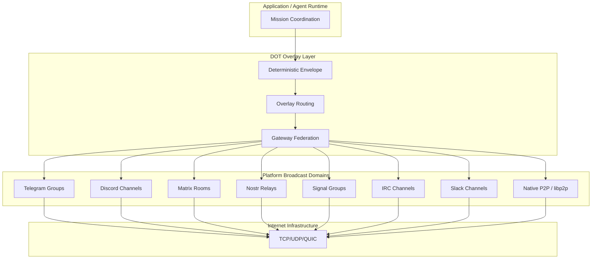

# RFC-0850: Deterministic Overlay Transport (DOT)

## Status

Accepted (v1.1.0)

## Authors

- Author: @cipherocto

## Maintainers

- Maintainer: @cipherocto

## Summary

The CipherOcto Deterministic Overlay Transport (DOT) defines a consensus-safe overlay networking layer that transforms existing communication platforms (Telegram, Discord, Matrix, Signal, IRC, Nostr, Slack, WhatsApp, etc.) into interoperable overlay relay fabrics.

DOT provides:

- Deterministic message propagation across heterogeneous carriers
- Platform-agnostic transport abstraction
- Gateway federation with sovereign identity
- Consensus-isolated transport semantics
- Replay-safe distributed coordination
- Blockchain-verifiable routing
- Cross-platform group synchronization
- Censorship-resistant multi-carrier propagation

The key innovation: **existing communication platforms become transport carriers, not trust anchors.** CipherOcto consensus and identity remain sovereign and platform-independent. Platforms merely carry encrypted deterministic envelopes.

DOT extends RFC-0843 (OCTO-Network Protocol) by adding an overlay transport abstraction layer above libp2p, enabling participation through social platforms, encrypted messengers, and opportunistic networks in addition to native P2P.

## Dependencies

**Requires:**

- RFC-0843 (Networking): OCTO-Network Protocol — base networking primitives
- RFC-0009 (Process): Identity Management — sovereign identity model
- RFC-0126 (Numeric): Deterministic Serialization — canonical encoding
- RFC-0008 (Process): Deterministic AI Execution Boundary — execution classes

> **Note:** RFC-0009 and RFC-0126 are currently in "Planned" status. Dependencies on these RFCs assume they will be Accepted before DOT implementation begins. If they are not Accepted by implementation time, the relevant specifications (identity key format, canonical serialization) MUST be inlined in this RFC.

**Optional:**

- RFC-0102 (Numeric): Wallet Cryptography — key pair format
- RFC-0851 (Networking): Gateway Discovery Protocol — gateway discovery
- RFC-0852 (Networking): Deterministic Gossip Protocol — propagation

## Design Goals

| Goal | Target | Metric |
|------|--------|--------|
| G1: Transport Abstraction | 8+ platform types | Telegram, Discord, Matrix, Nostr, Signal, IRC, Slack, WhatsApp |
| G2: Deterministic Ordering | 100% replay consistency | Identical output from identical input across all implementations |
| G3: Consensus Isolation | Zero platform leakage | Platform metadata never affects consensus state |
| G4: Multi-Carrier Propagation | 3+ simultaneous carriers | Single envelope propagates via multiple platforms concurrently |
| G5: Gateway Federation | 1000+ gateways | Sublinear overhead scaling |
| G6: Latency | <500ms overlay hop | Measured from envelope injection to next-gateway delivery |
| G7: Censorship Resistance | Survive single-platform block | Automatic failover to alternate carriers |

## Motivation

### CAN WE? — Feasibility Research

The fundamental question: **Can we use existing communication platforms as deterministic transport substrates for decentralized consensus?**

Research confirms feasibility through:

- **OpenClaw** demonstrates multi-channel federation across social platforms with channel adapters (see `docs/research/openclaw-architecture.md`)
- **IronClaw** provides a channel manager + WASM gateway model with 10+ LLM providers (see `docs/research/ironclaw-architecture.md`)
- **Hermes** implements platform adapters + gateway runtime for heterogeneous transport (see `docs/research/hermes-agent-architecture.md`)
- **9Router** provides translation/routing abstraction for multi-platform messaging (see `docs/research/9router-architecture.md`)
- **RFC-0843** already defines libp2p-based networking — DOT extends this with overlay transport

Existing platforms are inherently non-deterministic (unordered, eventually consistent, delay-variable, censorship-prone, duplication-prone). DOT isolates this non-determinism from consensus by introducing a deterministic envelope layer.

### WHY? — Why This Matters

Without DOT:

- CipherOcto is limited to native P2P — excludes billions of users on social platforms
- No censorship resistance — blocking libp2p blocks the entire network
- No opportunistic networking — cannot exploit available bandwidth across carriers
- No platform-parasitic infrastructure — must compete with platforms instead of colonizing them
- Limited federation — cannot bridge heterogeneous communication systems

DOT enables CipherOcto to become **transport-agnostic, censorship-resilient, and platform-parasitic** — operating above existing infrastructure as an overlay civilization layer.

### Relationship to RFC-0843

RFC-0843 defines the native P2P networking layer using libp2p. DOT extends this by:

1. Adding platform-agnostic transport abstraction (Telegram, Discord, etc.)
2. Defining deterministic envelope format for cross-platform propagation
3. Introducing gateway federation model for platform bridging
4. Isolating platform non-determinism from consensus ordering

DOT does NOT replace RFC-0843 — it complements it. Native libp2p remains the preferred transport; DOT adds alternative carriers for resilience and reach.

## Specification

### 1. System Architecture



### 2. Protocol Stack

DOT introduces a layered protocol stack above traditional Internet:

```text
Layer 6: Application / Agent Runtime
Layer 5: Mission Coordination Layer
Layer 4: DOT Overlay Routing
Layer 3: Gateway Federation Layer
Layer 2: Platform Broadcast Domains
Layer 1: Internet (TCP/UDP/QUIC)
```

Each layer is deterministic at its boundary. Layer 2 (Platform Broadcast Domains) is explicitly non-deterministic — DOT isolates this from layers 4-6.

### 3. Fundamental Concepts

#### 3.1 Broadcast Domain

A broadcast domain is any shared communication surface that can carry DOT envelopes.

**Supported Platform Types:**

| Platform Type | Identifier | Transport Mechanism | Max Payload |
|--------------|------------|---------------------|-------------|
| Telegram | `0x0001` | Bot API / Group messages | 4096 bytes |
| Discord | `0x0002` | Webhook / Channel messages | 2000 bytes |
| Matrix | `0x0003` | Room events / Federation | 65536 bytes |
| Nostr | `0x0004` | Relay events (NIP-01) | 65536 bytes |
| Signal | `0x0005` | Group messages | 65536 bytes |
| IRC | `0x0006` | Channel PRIVMSG | 512 bytes |
| Slack | `0x0007` | Webhook / Channel API | 40000 bytes |
| WhatsApp | `0x0008` | WhatsApp Web protocol (whatsapp-rust) | 65536 bytes |
| Webhook | `0x0009` | HTTP POST callback | Unlimited |
| NativeP2P | `0x000A` | libp2p gossipsub | Unlimited |
| Bluetooth | `0x000B` | BLE mesh | 512 bytes |
| LoRa | `0x000C` | LoRa radio | 256 bytes |
| WebRTC | `0x000D` | DataChannel | 65536 bytes |
| Bluesky | `0x000E` | AT Protocol posts | 300 graphemes (~221B) | Yes | Images (1MB) |
| Twitter | `0x000F` | Twitter API v2 tweets | 280 chars (~206B) | Yes | Images (5MB) |
| Reddit | `0x0010` | Reddit API posts/comments | 10000 chars | No | Images (20MB) |
| WeChat | `0x0011` | WeChat Official Account API | 2048 chars | Yes | Images (10MB) |
| DingTalk | `0x0012` | DingTalk robot webhook | 20000 chars | No | None |
| Lark | `0x0013` | Lark/Feishu bot API | 30000 chars | No | Images/Files (50MB) |
| QQ | `0x0014` | QQ Official Bot API | 2000 chars | Yes | Images (10MB) |
| QUIC | `0x0015` | QUIC streams (RFC 9000) | Unlimited | — | See §8.7 |

**Canonical Domain Identifier:**

```rust
#[derive(Clone, Copy, Debug, PartialEq, Eq, Hash)]
#[repr(C)]
struct BroadcastDomainId {
    /// Platform type identifier (see table above)
    platform_type: u16,
    /// BLAKE3-256 of platform-specific group/channel/room identifier
    domain_hash: [u8; 32],
}
```

**Determinism Requirement:** `domain_hash` MUST be computed from the canonical platform identifier string (e.g., `"telegram:-1001234567890"`, `"discord:channel:9876543210"`) using BLAKE3-256. Platform-specific ID formats MUST be normalized to lowercase, trimmed strings before hashing.

#### 3.2 Overlay Gateway Node (OGN)

A gateway node bridges one or more broadcast domains into CipherOcto DOT.

**Gateway Roles:**

| Role | Function | Token Incentive |
|------|----------|-----------------|
| Edge Gateway | Connects to external platform | OCTO-B (bandwidth) |
| Relay Gateway | Re-broadcasts envelopes | OCTO-B (bandwidth) |
| Consensus Gateway | Participates in block production | OCTO-N (node ops) |
| Archive Gateway | Historical retention | OCTO-S (storage) |
| Stealth Gateway | Privacy-preserving transport | OCTO-B (bandwidth) |
| Translation Gateway | Converts protocol/platform semantics | OCTO-O (orchestration) |

**Gateway Identity (extends RFC-0009):**

```rust
#[derive(Clone, Debug)]
struct GatewayIdentity {
    /// Unique gateway identifier (32 bytes, derived from public key)
    gateway_id: [u8; 32],
    /// Ed25519 public key (per RFC-0009)
    public_key: [u8; 32],
    /// Network identifier
    network_id: u32,
    /// Gateway class (Edge, Relay, Consensus, Archive, Stealth, Translation)
    gateway_class: GatewayClass,
    /// Epoch when gateway was created
    creation_epoch: u64,
    /// Supported platform types (bitmask)
    supported_platforms: u64,
    /// Gateway capabilities (bitmask)
    capabilities: u64,
}

#[derive(Clone, Copy, Debug, PartialEq, Eq)]
#[repr(u16)]
enum GatewayClass {
    Edge = 0x0001,
    Relay = 0x0002,
    Consensus = 0x0003,
    Archive = 0x0004,
    Stealth = 0x0005,
    Translation = 0x0006,
}

/// Bitmask for gateway role capabilities (a gateway can serve multiple roles)
#[repr(u64)]
enum GatewayRoleFlags {
    Edge = 0x0001,
    Relay = 0x0002,
    Consensus = 0x0004,
    Archive = 0x0008,
    Stealth = 0x0010,
    Translation = 0x0020,
}
```

**Determinism Requirement:** `gateway_id` MUST be derived as `BLAKE3-256(public_key || network_id || creation_epoch)`. This ensures deterministic derivation from identity material.

#### 3.3 Deterministic Envelope (DEN)

All messages transported through DOT MUST use a canonical deterministic envelope.

```rust
#[derive(Clone, Debug)]
#[repr(C)]
struct DeterministicEnvelope {
    /// Protocol version (current: 1)
    version: u16,
    /// Network identifier
    network_id: u32,
    /// Message type (see Section 3.4)
    message_type: u16,

    /// Globally unique envelope identifier
    envelope_id: [u8; 32],
    /// Mission identifier (zero if not mission-scoped)
    mission_id: [u8; 32],

    /// Source peer identifier (per RFC-0009)
    source_peer: [u8; 32],
    /// Gateway that first injected this envelope
    origin_gateway: [u8; 32],

    /// Logical timestamp (NOT wall-clock — see Section 5)
    logical_timestamp: u64,
    /// Maximum hop count before discard
    ttl_hops: u16,

    /// BLAKE3-256 of canonical payload bytes
    payload_hash: [u8; 32],

    /// Merkle root of route trace (for replay verification)
    /// Populated when E2E flag (0x0008) is set.
    /// Route trace = ordered list of (gateway_id, logical_timestamp) pairs the envelope has traversed.
    /// Merkle leaves = BLAKE3-256(gateway_id || logical_timestamp), sorted by hop order.
    /// If E2E flag is not set, this field MUST be [0x00; 32].
    route_trace_root: [u8; 32],

    /// Protocol flags (bitmask, see EnvelopeFlags)
    flags: u64,

    /// Ed25519 signature over canonical envelope bytes
    signature: [u8; 64],
}

/// Flag values for DeterministicEnvelope.flags
#[repr(u64)]
enum EnvelopeFlags {
    /// Payload is encrypted (RFC-0853 OCrypt)
    ENCRYPTED = 0x0001,
    /// Envelope is sealed (sender identity hidden from intermediaries)
    SEALED = 0x0002,
    /// Payload is obfuscated (anti-fingerprinting)
    OBFUSCATED = 0x0004,
    /// End-to-end encryption envelope (E2E key exchange)
    E2E = 0x0008,
    /// Stealth mode (minimal metadata, anti-traffic-analysis)
    STEALTH = 0x0010,
    /// All other flags are reserved and MUST be ignored on receipt
}
```

**Note:** Implementations MAY define additional flags above 0x0010 for platform-specific features.
```

**Envelope ID Derivation:**

```text
envelope_id = BLAKE3-256(
    network_id ||
    message_type ||
    source_peer ||
    origin_gateway ||
    logical_timestamp ||
    payload_hash
)
```

**Note:** `version` is excluded from `envelope_id` derivation to ensure envelope identity remains stable across protocol version upgrades. The version field is present in the envelope header for parsing purposes but does not affect the envelope's canonical identity.

**Canonical Serialization:** All envelope fields MUST be serialized using RFC-0126 Deterministic Canonical Serialization (DCS). Field order is fixed as declared in the struct. Multi-byte integers are big-endian. No padding, no alignment holes.

#### 3.4 Message Types

```rust
#[repr(u16)]
enum MessageType {
    /// Application message
    Message = 0x0001,
    /// Command/coordination
    Command = 0x0002,
    /// Mission signal
    MissionSignal = 0x0003,
    /// State update
    StateUpdate = 0x0004,
    /// Heartbeat/liveness
    Heartbeat = 0x0005,
    /// Consensus fragment (block, attestation)
    ConsensusFragment = 0x0006,
    /// Route announcement
    RouteAnnouncement = 0x0007,
    /// Gateway advertisement (GDP)
    GatewayAdvertisement = 0x0008,
    /// Gossip object (DGP)
    GossipObject = 0x0009,
    /// Proof submission
    ProofSubmission = 0x000A,
    /// Discovery request/response
    Discovery = 0x000B,
}
```

### 4. Deterministic Boundary Rules

This is the most critical section of DOT.

#### 4.1 Platforms Are Non-Deterministic

External platforms MUST be treated as:

- **Unordered** — message arrival order is not guaranteed
- **Eventually consistent** — state converges but timing is undefined
- **Delay-variable** — latency ranges from ms to minutes
- **Censorship-prone** — platforms may block, throttle, or filter
- **Duplication-prone** — messages may be delivered multiple times
- **Mutable** — platform may modify metadata, timestamps, formatting

**Invariant:** Platform ordering MUST NEVER define consensus ordering.

#### 4.2 Consensus Boundary

Consensus exists ONLY after the following deterministic pipeline:

```text
Envelope Validation
  → Signature Verification
  → Canonical Deserialization (RFC-0126)
  → Replay Window Check
  → Logical Timestamp Ordering
  → Block Inclusion Candidate
```

Each step MUST be deterministic across all implementations given identical inputs.

#### 4.3 Transport Isolation Rule

Platform-specific metadata MUST NEVER affect consensus.

**Forbidden in consensus state:**

- Discord message IDs
- Telegram timestamps
- Slack thread IDs
- Matrix event IDs
- Platform usernames or display names
- Platform-specific formatting or markup
- Transport-layer headers

**Allowed outside consensus:**

- Opaque transport metadata (for debugging, analytics)
- Platform-specific display formatting (UI layer only)
- Transport performance metrics (non-consensus)

#### 4.4 Execution Class Mapping (per RFC-0008)

| DOT Component | Execution Class | Rationale |
|--------------|-----------------|-----------|
| Envelope serialization | Class A (Protocol Deterministic) | Consensus-critical |
| Signature verification | Class A | Consensus-critical |
| Logical timestamp ordering | Class A | Consensus-critical |
| Route scoring algorithm | Class A | Deterministic scoring only (see RFC-0856) |
| Route discovery/selection | Class B (Deterministic Off-Chain) | May use configurable timeouts |
| Gateway discovery | Class B | Configurable timeouts |
| Platform adapter I/O | Class C (Probabilistic) | Inherently non-deterministic |
| Message delivery | Class C | Platform-dependent timing |

**Clarification:** "Route scoring algorithm" (the deterministic computation of route scores from inputs) is Class A. "Route discovery/selection" (finding available routes, probing connectivity) is Class B because it may involve timeouts and retries. The scoring MUST be deterministic; the discovery process does not need to be.

#### 4.5 Error Types

DOT defines a unified error taxonomy for cross-RFC compatibility:

```rust
#[derive(Clone, Debug)]
enum DotError {
    // Envelope errors
    InvalidSignature { envelope_id: [u8; 32] },
    ReplayDetected { envelope_id: [u8; 32], first_seen: u64 },
    CanonicalizationFailed { reason: &'static str },
    EnvelopeTooLarge { size: usize, max: usize },
    InvalidEnvelopeId { expected: [u8; 32], computed: [u8; 32] },

    // Fragmentation errors
    FragmentTimeout { envelope_id: [u8; 32], received: u16, total: u16 },
    FragmentDuplicate { envelope_id: [u8; 32], index: u16 },
    FragmentIndexOutOfBounds { index: u16, total: u16 },

    // Gateway errors
    UnknownGateway { gateway_id: [u8; 32] },
    GatewayCapacityExceeded { gateway_id: [u8; 32] },
    UnsupportedPlatform { platform_type: u16 },

    // Routing errors
    RouteNotFound { destination: [u8; 32] },
    RouteExpired { route_id: [u8; 32] },
    TtlExceeded { envelope_id: [u8; 32], ttl: u16 },

    // Platform adapter errors
    PlatformAdapterError { platform: u16, detail: &'static str },
    RateLimitExceeded { platform: u16, retry_after: u64 },
    PlatformUnavailable { platform: u16 },
}
```

**Implementation Note:** The error taxonomy above is the normative specification. Implementations MAY consolidate variants into fewer types as long as the error semantics are preserved.

### 5. Logical Timestamp Model

DOT uses logical timestamps independent of wall-clock time.

#### 5.1 Overlay Sequence Numbers

```rust
#[derive(Clone, Copy, Debug, PartialEq, Eq, PartialOrd, Ord)]
#[repr(C)]
struct OverlaySequence {
    /// Network epoch (consensus-derived)
    epoch: u64,
    /// Gateway that generated the sequence
    gateway: [u8; 32],
    /// Monotonically increasing counter per gateway per epoch
    monotonic_counter: u64,
}
```

**Ordering Rule:** Envelopes are ordered by `(epoch, monotonic_counter, gateway_id)` where `gateway_id` is the lexicographic byte ordering of the gateway identifier.

#### 5.2 Conflict Resolution

If multiple gateways inject the same payload (identical `payload_hash`):

```text
FIRST_VALID_HASH_WINS
```

Deterministically ordered by: `(payload_hash, gateway_id)` — lowest lexicographic `gateway_id` wins.

#### 5.3 Clock Drift Isolation

Physical timestamps are advisory only. Consensus ordering MUST remain independent of:

- NTP synchronization
- Platform-provided timestamps
- Local system clock
- Timezone differences

### 6. Gateway Federation Model

#### 6.1 Multi-Homing

A gateway MAY connect to multiple broadcast domains simultaneously.

```text
Example:
  Telegram Group A ──┐
  Discord Channel B ──┼── Gateway G1 ── DOT Mesh
  Matrix Room C ──────┘
```

All three domains carry identical overlay traffic. Loss of any single domain does not affect delivery.

#### 6.2 Overlay Route Graph

```text
Domain → Edge Gateway → DOT Mesh → Edge Gateway → Domain
```

This creates a platform-independent overlay topology. The DOT Mesh is the logical network formed by interconnected gateways.

#### 6.3 Gateway Capacity Declaration

Gateways MUST declare their capacity for deterministic routing:

```rust
#[repr(C)]
struct GatewayCapacity {
    /// Maximum envelopes per second
    max_throughput: u32,
    /// Number of connected broadcast domains
    domain_count: u16,
    /// Supported platform types (bitmask)
    platform_mask: u64,
    /// Storage capacity class (0-255)
    storage_class: u8,
    /// Bandwidth class (0-255)
    bandwidth_class: u8,
}
```

### 7. Routing Architecture

#### 7.1 Logical vs Physical Routing

DOT separates:

| Layer | Responsibility | Determinism |
|-------|---------------|-------------|
| Physical | Actual transport platform | Non-deterministic |
| Logical | CipherOcto overlay routing | Deterministic |

A logical route MUST remain stable even if physical carriers change.

#### 7.2 Deterministic Route Selection

Gateways MUST compute routes deterministically from:

- `mission_id`
- `destination_peer`
- `network_epoch`
- `gateway_weights` (trust scores, capabilities)
- `transport_capabilities`

Routes MUST NOT depend on:

- Latency measurements
- Local heuristics
- Nondeterministic timing
- CPU load or memory pressure

#### 7.3 Route Commitment

Each route produces a commitment:

```rust
#[repr(C)]
struct RouteCommitment {
    /// Hash of the gateway sequence
    gateway_sequence_hash: [u8; 32],
    /// Hash of deterministic weights used
    weights_hash: [u8; 32],
    /// Network epoch
    epoch: u64,
    /// Commitment = BLAKE3-256(gateway_sequence_hash || weights_hash || epoch)
    commitment: [u8; 32],
}
```

This allows replay verification — given the same inputs, all nodes derive identical routes.

### 8. Platform Translation Layer (PTL)

The PTL converts heterogeneous platform semantics into canonical DOT semantics.

#### 8.1 Canonical Event Types

All platforms normalize into:

```rust
#[repr(u16)]
enum CanonicalEvent {
    Message = 0x0001,
    Command = 0x0002,
    MissionSignal = 0x0003,
    StateUpdate = 0x0004,
    Heartbeat = 0x0005,
    ConsensusFragment = 0x0006,
    RouteAnnouncement = 0x0007,
}
```

#### 8.2 Platform Adapter Contract

Each adapter MUST implement the following trait:

```rust
#[async_trait]
trait PlatformAdapter: Send + Sync {
    /// Send a deterministic envelope to the platform.
    async fn send_envelope(
        &self,
        domain: &BroadcastDomainId,
        envelope: &DeterministicEnvelope,
    ) -> Result<DeliveryReceipt, PlatformAdapterError>;

    /// Receive raw messages from the platform.
    async fn receive_messages(
        &self,
        domain: &BroadcastDomainId,
    ) -> Result<Vec<RawPlatformMessage>, PlatformAdapterError>;

    /// Convert platform-specific message to canonical envelope.
    fn canonicalize(
        &self,
        raw: &RawPlatformMessage,
    ) -> Result<DeterministicEnvelope, PlatformAdapterError>;

    /// Report platform capabilities.
    fn capabilities(&self) -> CapabilityReport;

    /// Compute deterministic domain identifier.
    fn domain_id(&self, platform_id: &str) -> BroadcastDomainId;

    /// Platform type discriminant.
    fn platform_type(&self) -> PlatformType;

    /// Check replay protection (optional, default: no check).
    fn replay_protection(&self, _envelope_id: &[u8; 32]) -> bool { true }

    /// Health check (optional, default: healthy). Async for real liveness probes.
    async fn health_check(&self) -> Result<(), PlatformAdapterError> { Ok(()) }

    /// Graceful shutdown (optional, default: no-op). Async for flushing pending messages.
    async fn shutdown(&self) -> Result<(), PlatformAdapterError> { Ok(()) }

    /// Return the bot's own handle/identity on this platform.
    ///
    /// Used by the gateway to drop self-authored messages and prevent
    /// relay loops (ZeroClaw pattern: `self_handle()` + `drop_self_messages()`).
    ///
    /// Returns `None` by default (no self-loop protection).
    /// Adapters that handle inbound traffic MUST override this.
    fn self_handle(&self) -> Option<String> { None }
}
```

#### 8.3 Plugin ABI

Platform adapters MAY be loaded dynamically at runtime as shared libraries (`.so`/`.dylib`/`.dll`) or WASM modules.

**cdylib ABI** — First-party Rust adapters compile to `cdylib` and export:

```rust
/// ABI version for forward compatibility. Current: 1.
#[no_mangle]
pub extern "C" fn adapter_version() -> u32;

/// PlatformType discriminant this adapter handles.
#[no_mangle]
pub extern "C" fn platform_type() -> u16;

/// Create adapter instance. Returns opaque pointer.
/// Config is JSON bytes passed from gateway configuration.
/// Returns null if config is null/empty or creation fails.
#[no_mangle]
pub extern "C" fn create_adapter(config: *const u8, config_len: usize) -> *mut ();

/// Destroy adapter instance. Takes ownership and frees memory.
#[no_mangle]
pub extern "C" fn destroy_adapter(adapter: *mut ());
```

**WASM ABI** — Community adapters compile to WASM with equivalent exports:

```text
export "adapter" fn adapter_version() -> u32;
export "adapter" fn platform_type() -> u16;
export "adapter" fn create(config_ptr: *const u8, config_len: i32) -> i32;
export "adapter" fn destroy(instance_id: i32);
export "adapter" fn send(domain_ptr: *const u8, env_ptr: *const u8, env_len: i32) -> i32;
export "adapter" fn receive(domain_ptr: *const u8) -> i32;
```

WASM adapters are sandboxed — all I/O goes through host functions (`http_request`, `log`, `current_epoch`). WASM adapters cannot access filesystem, network, or environment directly.

**ABI Versioning** — If `adapter_version()` returns 0, the adapter is rejected. If the version is older than the host, the adapter loads with graceful degradation (newer methods return `UnsupportedOperation`). If the version is newer, the adapter loads but the host may not call newer methods.

#### 8.4 Adapter Lifecycle

Gateways manage adapter lifecycle:

1. **Discovery** — Scan configured directories for adapter plugins (`.so`/`.wasm` files)
2. **Loading** — Call `adapter_version()` and `platform_type()` to validate, then `create_adapter()` with JSON config
3. **Capabilities** — Call `capabilities()` to build carrier table (max payload, rate limits, fragmentation support)
4. **Health Check** — Periodic liveness probe (default: 60s). Failed adapters remain in registry but are removed from active carrier table
5. **Shutdown** — Graceful teardown, flush pending messages

#### 8.5 Carrier-Specific Fragmentation

When an envelope exceeds the adapter's `max_payload_bytes`, the gateway fragments it per Section 9. Carrier-specific considerations:

| Carrier | Max Payload | Fragment Strategy |
|---------|-------------|-------------------|
| Telegram | 4096 bytes | Document attachment for large fragments |
| Discord | 2000 bytes | Multi-message with sequence markers |
| Matrix | 65536 bytes | Rarely fragmented; media upload for large payloads |
| IRC | 512 bytes | Multi-line with sequence markers |
| Slack | 40000 bytes | Multi-message with sequence markers |
| Signal | 65536 bytes | Text only, no fragmentation |
| Nostr | 65536 bytes | Text only, no fragmentation |
| WhatsApp | 65536 bytes | Text only, no fragmentation |
| LoRa | 256 bytes | Mandatory fragmentation, duty-cycle aware |
| BLE | 244 bytes | Multi-advertisement reassembly |
| Webhook | Unlimited | No fragmentation needed |
| WebRTC | 65536 bytes | DataChannel fragmentation |
| QUIC | Unlimited | Stream-level framing, no fragmentation needed (see §8.7) |

#### 8.6 Payload Encoding

Envelopes are encoded for platform transport using one of four modes:

```text
DOT/1/{base64}       → Text mode (base64url-encoded envelope bytes)
DOT/2/{msg_id}       → Native upload mode (platform message ID reference)
DOT/F/{base64_frag}  → Fragment mode (base64-encoded fragment with header)
RAW/{binary}         → Raw binary mode (native byte transport, see §8.7)
```

**Mode selection** (deterministic: same payload + same capabilities → same mode):
- If `capabilities.supports_raw_binary` → `RAW/{binary}` (raw binary mode — QUIC, WebRTC, NativeP2P)
- If `payload.len() <= max_text_bytes` → `DOT/1/{base64}` (text mode)
- If `payload.len() > max_text_bytes && capabilities.supports_upload` → `DOT/2/{msg_id}` (native mode)
- If `payload.len() > max_text_bytes && !capabilities.supports_upload` → `DOT/F/{fragment}` (fragment mode)

**Determinism guarantee**: Transport mode does NOT affect envelope identity. `payload_hash` verification ensures reassembled bytes are identical regardless of transport mode.

**Fallback**: If native upload fails, adapters MUST fall back to base64 text mode.

For platforms with size limits (IRC: 512 bytes, LoRa: 256 bytes), envelopes MUST be fragmented (see Section 9).

### 9. Envelope Fragmentation

For platforms with payload size limits, envelopes MAY be fragmented.

#### 9.1 Fragment Structure

```rust
#[repr(C)]
struct EnvelopeFragment {
    /// Original envelope ID
    envelope_id: [u8; 32],
    /// Fragment index (0-based)
    fragment_index: u16,
    /// Total fragment count
    fragment_total: u16,
    /// BLAKE3-256 of complete envelope
    envelope_hash: [u8; 32],
    /// Fragment payload bytes
    payload: Vec<u8>,
}
```

#### 9.2 Fragmentation Rules

1. Fragments MUST be self-describing (include `envelope_id`, `fragment_index`, `fragment_total`)
2. Fragment payloads MUST NOT exceed platform maximum minus fragment header size
3. Reassembly MUST wait for all fragments within a configurable timeout (default: 30s, min: 5s, max: 300s)
4. Partial reassembly MUST be discarded on timeout
5. Reassembly order is deterministic: fragments are ordered by `fragment_index`

#### 9.3 Deterministic Reassembly

Given identical fragment sets, all nodes MUST reassemble to identical envelope bytes. Reassembly concatenates fragment payloads in `fragment_index` order.

#### 9.4 Dual-Mode Transport

For platforms supporting native file upload (Telegram, Discord, Matrix), envelopes MAY be sent via platform media API instead of base64 text. The `DOT/2/{msg_id}` format references an uploaded file by platform message ID.

**Determinism guarantee**: Transport mode does NOT affect envelope identity. `payload_hash` verification ensures reassembled bytes are identical regardless of transport mode.

**Fallback**: If native upload fails, adapters MUST fall back to base64 text mode (`DOT/1/`).

#### 8.7 QUIC Transport Profile

QUIC (RFC 9000) is the preferred native transport for DOT gateways. It provides multiplexed streams, 0-RTT connection establishment, built-in encryption (TLS 1.3), and connection migration — all critical for overlay gateway federation.

##### 8.7.1 Platform Registration

QUIC uses `PlatformType::Quic = 0x0015`. Domain identifiers follow the standard `BroadcastDomainId` scheme:

```text
domain_hash = BLAKE3-256("quic:" || canonical_peer_id)
```

Where `canonical_peer_id` is the gateway's Ed25519 public key encoded as lowercase hex.

##### 8.7.2 Connection Establishment

QUIC connections between gateways follow a two-layer model:

```text
┌─────────────────────────────────────────────┐
│ Overlay Session (RFC-0853 §5) [OPTIONAL]    │
│ X25519 → HKDF-BLAKE3 → ChaCha20-Poly1305   │
│ Mission-scoped encryption only               │
├─────────────────────────────────────────────┤
│ QUIC Transport Session (TLS 1.3) [REQUIRED] │
│ Certificate-based or raw public key auth     │
│ 0-RTT resumption via session tickets         │
├─────────────────────────────────────────────┤
│ UDP                                          │
└─────────────────────────────────────────────┘
```

**Layer responsibilities:**

| Layer | Handles | Key Exchange | Forward Secrecy |
|-------|---------|-------------|-----------------|
| QUIC (TLS 1.3) | Transport session, connection migration, congestion control, mutual authentication | TLS 1.3 ECDHE (X25519 or P-256) | Per-connection key rotation |
| Overlay (RFC-0853) | Mission-scoped encryption, onion hop keys, relay authentication (OPTIONAL — only when mission context exists) | X25519 ephemeral | Per-session ephemeral keys |

**Handshake sequence:**

1. **QUIC handshake** — Standard TLS 1.3 handshake. Server authenticates via one of:
   - **Raw public key** (RFC 7250): Ed25519 public key passed directly in TLS handshake. Preferred for gateways with Ed25519 identity keys — no X.509 infrastructure needed.
   - **Self-signed X.509 certificate**: Gateway generates an X.509 certificate signed by its own Ed25519 key. Client validates the certificate's public key against the GDP-registered gateway identity (RFC-0851).
   - **CA-signed certificate**: For public gateways with PKI infrastructure.

   Client validates the remote identity against the known gateway registry (GDP, RFC-0851). GDP provides the Ed25519 public key for each registered gateway; the client verifies the TLS handshake identity matches.

   **Unknown gateways:** If the connecting peer is NOT in the GDP registry, the gateway accepts the connection but marks the peer as `Unverified`. Unverified peers can exchange heartbeats and capability messages but MUST NOT receive mission traffic, route advertisements, or onion relay data. The gateway MAY promote an unverified peer to `Trusted` after GDP registration completes (see RFC-0851 §4.2).

2. **Overlay session establishment** (OPTIONAL — required only for mission-scoped operations) — After QUIC handshake completes, if the connection will carry mission traffic, both parties execute RFC-0853 §5 mutual authentication over the control stream:
   - Exchange ephemeral X25519 public keys
   - Compute shared secret: `X25519(ephemeral_secret, remote_ephemeral_public)`
   - Derive session key: `HKDF-BLAKE3(shared_secret, "ocrypt:session:v1", ephemeral_a || ephemeral_b)`
   - Sign transcript: `Ed25519_sign(long_term_secret, ephemeral_a || ephemeral_b || session_key)`
   - Verify remote signature against GDP-registered identity
   - **Timeout:** Overlay session establishment MUST complete within 10 seconds. If the handshake does not finish, the connection is closed with `HandshakeTimeout`.
3. **Session ready** — Both parties now have a mutually authenticated QUIC connection (and optionally a forward-secret overlay session for mission traffic).

For pure gateway-to-gateway forwarding (route advertisements, heartbeats, capability negotiation), the QUIC TLS 1.3 session alone is sufficient. The overlay session is only needed when mission-scoped keys are required (ORR onion hops, mission gossip, consensus fragments).

**0-RTT data:** Clients MAY send envelopes in 0-RTT data (QUIC early data). 0-RTT envelopes MUST go through replay protection (RFC-0853 §7) before processing. 0-RTT data is NOT forward-secret — this is acceptable for non-sensitive control messages only: heartbeats (`CanonicalEvent::Heartbeat`) and capability negotiation (`ControlMessage::Capabilities`). Route advertisements, mission signals, consensus fragments, and onion relay data MUST wait for the full handshake.

##### 8.7.3 Stream Multiplexing Strategy

QUIC provides independent, ordered byte streams. DOT uses streams as follows:

| Stream Type | Purpose | Cardinality | Lifetime |
|-------------|---------|-------------|----------|
| **Control** (stream 0) | Session management, capability negotiation, keep-alive | 1 per connection | Connection lifetime |
| **Envelope** | DOT envelope transport | 1 per envelope | Envelope delivery |
| **Onion** | ORR onion relay forwarding | 1 per active route | Route lifetime |

**Control stream (stream 0):**

The first client-initiated bidirectional stream is the control stream. It carries:

```rust
#[repr(u16)]
enum ControlMessage {
    /// Session capability negotiation (first message after handshake)
    Capabilities(CapabilityReport) = 0x0001,
    /// GDP gateway advertisement (periodic)
    GatewayAdvertisement(GatewayIdentity) = 0x0002,
    /// Keep-alive ping
    Ping(u64) = 0x0003,
    /// Keep-alive pong
    Pong(u64) = 0x0004,
    /// Graceful shutdown notice
    Shutdown(ShutdownReason) = 0x0005,
    /// Session key rotation trigger (only valid when overlay session is active)
    KeyRotation(u64) = 0x0006,
}
```

Control messages are framed: `[u32 frame_len][u16 type][payload]`. `frame_len` is big-endian, value = 2 + `payload.len()`. Consistent framing with envelope and onion streams.

**Envelope streams:**

Each envelope is sent on its own unidirectional stream (client-initiated). Frame format:

```text
┌──────────────────┬──────────────────┬───────────────────────┐
│ frame_len (u32)  │ type (u16=0x0001)│ envelope_bytes        │
└──────────────────┴──────────────────┴───────────────────────┘
```

- `frame_len`: Big-endian. Number of bytes in the frame AFTER the `frame_len` field. Value = 2 + `envelope_bytes.len()`.
- `type`: `0x0001` for envelope, `0x0002` for fragment. Consistent u16 width with control stream.
- `envelope_bytes`: Raw `DeterministicEnvelope::to_wire_bytes()` — NO base64 encoding.

After writing, the stream is finished (`FIN`). The receiver reads until `EOF`, deserializes, and closes the stream. This gives per-envelope flow control and prevents head-of-line blocking between envelopes.

**Onion streams:**

For ORR relay forwarding (RFC-0858), a dedicated bidirectional stream is opened per active route. Hop frames:

```text
┌──────────────────┬──────────────────┬──────────────────┬──────────────────┐
│ frame_len (u32)  │ type (u16=0x0003)│ hop_index (u16)  │ encrypted_layer  │
└──────────────────┴──────────────────┴──────────────────┴──────────────────┘
```

- `frame_len`: Big-endian. Number of bytes after `frame_len`. Value = 2 + 2 + `encrypted_layer.len()`.

The stream stays open for the route's lifetime. Multiple hops on the same route reuse the stream. The stream is closed when the route expires or is torn down.

##### 8.7.4 Connection Management

**Connection pooling:** Gateways maintain persistent QUIC connections to known peers. GDP (RFC-0851) provides the peer registry. Connections are lazily established on first envelope to a peer and kept alive via control stream pings.

**Keep-alive:** Control stream sends `Ping(nonce)` every 30 seconds. Peer MUST respond with `Pong(nonce)` within 10 seconds. Peer is marked `Suspect` after 2 consecutive missed pongs (60s with no successful pong). Peer is marked `Offline` after 3 consecutive missed pongs (90s). GDP liveness state follows these transitions.

**Connection migration:** QUIC supports connection migration (RFC 9000 §9) — when a gateway's IP address changes (WiFi → cellular, NAT rebinding), the QUIC connection survives using connection IDs. The overlay session is unaffected. Gateways MUST support at least 2 concurrent connection IDs.

**Congestion control:** QUIC's built-in congestion control (NewReno or CUBIC) is sufficient for DOT. Gateways SHOULD NOT send faster than the congestion window allows. If the congestion window is full, envelopes are queued in the adapter's outbound buffer (bounded by `max_pending_envelopes`, default: 1024).

**Idle timeout:** Default 120 seconds, configurable per-gateway via `max_idle_timeout_secs`. This is handled at the QUIC transport layer (RFC 9000 §10.1) — if no packets are exchanged for the idle timeout, the connection is closed automatically by QUIC. For intentional shutdown (e.g., maintenance, key rotation), the control stream sends `Shutdown(reason)` before the gateway closes the connection with a graceful `CONNECTION_CLOSE`.

##### 8.7.5 Integration with CipherOcto Primitives

| CipherOcto Primitive | QUIC Integration Point |
|----------------------|----------------------|
| GDP discovery (RFC-0851) | QUIC gateways register as `PlatformType::Quic` in GDP. `BootstrapMethod::SeedList` provides initial QUIC peer multiaddrs. |
| OCrypt sessions (RFC-0853) | Optional overlay session inside QUIC for mission-scoped encryption. QUIC TLS 1.3 provides transport-layer auth. |
| ORR onion routing (RFC-0858) | QUIC can serve as any hop position in an onion route. Onion streams carry encrypted hop layers. |
| DRS route selection (RFC-0856) | QUIC gateways advertise `bandwidth_class: High` and `censorship_score: Low` (QUIC can be firewalled but is harder to block than TCP). |
| DGP gossip (RFC-0852) | QUIC carries native binary gossip objects. Multi-transport amplification includes QUIC as carrier. |
| MON missions (RFC-0855) | Mission key hierarchy derives QUIC-specific transport keys from `transport_keys_root`. |
| PoRelay (RFC-0860) | QUIC relay attestations include stream-level delivery proofs. |

##### 8.7.6 Gateway Configuration

```json
{
  "quic": {
    "listen_addr": "0.0.0.0:47400",
    "auth_mode": "raw_public_key",
    "tls_cert_path": "/etc/cipherocto/gateway.pem",
    "tls_key_path": "/etc/cipherocto/gateway.key",
    "max_concurrent_streams": 1000,
    "max_idle_timeout_secs": 120,
    "enable_0rtt": true,
    "max_0rtt_bytes": 16384,
    "max_pending_envelopes": 1024,
    "congestion_control": "cubic"
  }
}
```

`auth_mode` selects the TLS authentication model (see §8.7.2):
- `"raw_public_key"`: Ed25519 key used directly via RFC 7250. `tls_cert_path`/`tls_key_path` are ignored; the gateway's Ed25519 identity key is used.
- `"self_signed"`: Gateway generates a self-signed X.509 certificate from its Ed25519 key. `tls_cert_path`/`tls_key_path` point to the generated cert/key.
- `"ca_signed"`: Standard PKI. `tls_cert_path`/`tls_key_path` point to CA-issued certificate and private key.

##### 8.7.7 Performance Targets

| Metric | Target | Notes |
|--------|--------|-------|
| Connection establishment (1-RTT) | <50ms | LAN, <200ms WAN |
| 0-RTT resumption | <10ms | Envelope delivery in first flight |
| Stream open latency | <1ms | After connection established |
| Envelope throughput | >10,000 env/s | Per connection, 1KB envelopes |
| Connection migration | <100ms | Seamless IP change recovery |
| Onion hop latency (QUIC leg) | <20ms | Single QUIC relay hop |

##### 8.7.8 Security Considerations

- **0-RTT replay:** 0-RTT data is replayable. Gateways MUST enforce replay protection (RFC-0853 §7) on all 0-RTT envelopes. Nonces MUST be unique per session.
- **Amplification attack:** QUIC limits amplification (RFC 9000 §8.1). Gateways MUST validate client address before sending large responses.
- **Connection ID privacy:** Connection IDs MUST be randomized to prevent traffic correlation across network paths. Gateways SHOULD rotate connection IDs on every new path.
- **Certificate pinning:** Gateways SHOULD pin peer certificates (or raw public keys) from GDP registry to prevent MITM by compromised CAs.
- **Stream exhaustion:** Gateways MUST enforce `max_concurrent_streams` (default: 1000). Peers exceeding the limit are rejected with `STREAM_LIMIT_ERROR`. Unidirectional streams (envelope receive) and bidirectional streams (control, onion) have separate limits.
- **Flow control attacks:** A malicious peer can open streams but never send data, consuming server resources. Gateways MUST enforce per-stream idle timeouts (default: 30s). Streams with no progress for the idle timeout are reset.
- **Version downgrade:** Gateways MUST negotiate QUIC v1 (RFC 9000) or later. Version negotiation is handled by the QUIC handshake; gateways MUST NOT fall back to QUIC draft versions. Clients MUST abort if the server selects an unknown version.

### 10. Privacy and Encryption

#### 10.1 End-to-End Encryption

Platforms MUST NOT access plaintext mission data. Envelope payloads MAY be encrypted using RFC-0853 (OCrypt) session keys.

#### 10.2 Metadata Minimization

Gateways SHOULD minimize leakage of:

- Overlay topology
- Routing intent
- Mission structure
- Peer graph relationships

#### 10.3 Transport Obfuscation

Payloads SHOULD appear opaque to carrier platforms. Platforms SHOULD observe only ciphertext and relay metadata.

### 11. Reliability Model

#### 11.1 Byzantine Transport Assumption

DOT assumes external platforms are Byzantine-capable. Therefore:

- Duplication MUST be tolerated
- Reordering MUST be tolerated
- Censorship MUST be tolerated
- Mutation MUST be detectable (signature verification)

#### 11.2 Canonical Replay Protection

Each envelope `(envelope_id, payload_hash)` MUST be globally unique within the replay window.

Gateways maintain a replay cache:

```rust
struct ReplayCache {
    /// Map of envelope_id → first_seen_timestamp (BTreeMap for deterministic iteration order)
    by_id: BTreeMap<[u8; 32], u64>,
    /// Map of (first_seen_timestamp, envelope_id) → () for efficient time-ordered eviction
    by_time: BTreeMap<(u64, [u8; 32]), ()>,
    /// Replay window duration (network-configured)
    window_duration: u64,
    /// Maximum cache entries before eviction
    max_entries: u32,
}
```

**Determinism Requirement:** `BTreeMap` is used instead of `HashMap` because BTreeMap provides deterministic iteration order (sorted by key). When the cache is full, eviction removes the entry with the smallest `first_seen` timestamp. If timestamps are equal, the entry with the lexicographically smallest `envelope_id` is evicted.

**Note:** If multiple entries have the same `first_seen` timestamp, eviction MUST use lexicographic ordering of `envelope_id` as a deterministic tiebreaker.

### 12. Failure Domains

#### 12.1 Platform Partition

If a platform becomes unavailable:

```text
DOT automatically reroutes through remaining carriers
```

Example: If Telegram is blocked, traffic flows through Discord + Matrix + Native P2P.

#### 12.2 Gateway Failure

Gateways are replaceable. Consensus identity is independent of gateway availability. If a gateway fails:

1. Its broadcast domains become temporarily unreachable
2. Other gateways with overlapping domains absorb traffic
3. GDP (RFC-0851) handles gateway replacement discovery

### 13. Token Economics Integration

DOT integrates with CipherOcto's multi-token economy (see `docs/04-tokenomics/token-design.md`):

| Activity | Token | Rationale |
|----------|-------|-----------|
| Relay bandwidth | OCTO-B | Bandwidth is the primary resource consumed |
| Gateway coordination | OCTO-O | Orchestration of multi-platform routing |
| Gateway uptime | OCTO-N | Node operation and availability |
| Archive storage | OCTO-S | Historical envelope retention |
| Consensus participation | OCTO-N | Block production gateway rewards |

**Earning Mechanisms:**

- Validated relay: per-envelope reward proportional to payload size
- Uptime: continuous availability bonus
- Deterministic delivery: proof of correct forwarding
- Anti-censorship routing: premium for censorship-resistant carriers

## Performance Targets

| Metric | Target | Measurement |
|--------|--------|-------------|
| Envelope serialization | <1ms | DCS encode of 1KB payload |
| Envelope deserialization | <1ms | DCS decode of 1KB payload |
| Signature verification | <5ms | Ed25519 verify |
| Overlay hop latency | <500ms | Gateway-to-gateway via single carrier |
| Multi-carrier propagation | <2s | Delivery to 3+ carriers simultaneously |
| Gateway discovery | <5s | New gateway found via GDP |
| Fragment reassembly | <10s | 10-fragment envelope |
| QUIC connection establishment | <50ms | 1-RTT handshake (LAN) |
| QUIC 0-RTT resumption | <10ms | Envelope delivery in first flight |
| QUIC envelope throughput | >10,000 env/s | Per connection, 1KB envelopes |
| Replay cache lookup | <1µs | BTreeMap lookup |
| Throughput per gateway | >1000 env/s | Sustained envelope processing |

## Security Considerations

### Consensus Attacks

| Attack | Impact | Mitigation |
|--------|--------|------------|
| Envelope forgery | High | Ed25519 signature verification |
| Replay attack | High | Replay cache + logical timestamp validation |
| Ordering manipulation | High | Deterministic ordering by (epoch, counter, gateway_id) |
| Consensus isolation violation | Critical | Transport isolation rule — platform metadata never in consensus |

### Economic Exploits

| Attack | Impact | Mitigation |
|--------|--------|------------|
| Bandwidth exhaustion | Medium | OCTO-B staking requirements for gateways |
| Spam flooding | Medium | Economic friction via relay stake |
| Free-riding | Low | Proof-of-relay verification (RFC-0860) |

### Proof Forgery

| Attack | Impact | Mitigation |
|--------|--------|------------|
| Invalid envelope signature | High | Ed25519 verification at every gateway |
| Tampered payload | High | payload_hash verification |
| Route commitment forgery | Medium | Deterministic recomputation |

### Replay Attacks

| Attack | Impact | Mitigation |
|--------|--------|------------|
| Stale envelope replay | High | Replay cache with configurable window |
| Cross-mission replay | Medium | mission_id scoping |
| Cross-network replay | Medium | network_id scoping |

### Determinism Violations

| Attack | Impact | Mitigation |
|--------|--------|------------|
| Platform metadata leakage | Critical | Transport isolation rule enforced at code level |
| Non-deterministic serialization | Critical | RFC-0126 DCS mandatory |
| Clock-dependent ordering | Critical | Logical timestamps only |

## Adversarial Review

| Threat | Impact | Mitigation | Verification |
|--------|--------|------------|--------------|
| Platform censorship | High | Multi-carrier propagation | Test with blocked carrier |
| Gateway Sybil attack | High | Stake + PoR (RFC-0860) | Stake verification test |
| Envelope mutation | Critical | Signature at every hop | Signature verification test |
| Replay storm | High | Replay cache + window | Replay detection test |
| Consensus isolation breach | Critical | Transport isolation rule | Fuzz test with platform metadata |
| Fragment reassembly attack | Medium | Deterministic ordering | Fragment ordering test |
| Eclipse attack via gateways | High | Diversity constraints | Multi-gateway connectivity test |

## Economic Analysis

### Market Dynamics

DOT creates a marketplace for transport bandwidth:

- **Supply:** Gateways providing platform connectivity
- **Demand:** Missions requiring cross-platform coordination
- **Price:** OCTO-B per byte relayed, with carrier-specific premiums

### Carrier Premium Structure

| Carrier Type | Premium | Rationale |
|-------------|---------|-----------|
| Native P2P | Base rate | Lowest cost, highest reliability |
| Matrix/Nostr | 1.2x | Federation overhead |
| Telegram/Discord | 1.5x | Platform API rate limits |
| IRC | 1.0x | Text-only, minimal overhead |
| Slack | 1.5x | Similar to Discord |
| Signal/WhatsApp | 2.0x | Encrypted messenger overhead |
| Webhook | 1.0x | Generic HTTP |
| LoRa/Bluetooth | 3.0x | Limited bandwidth, high value |
| WebRTC | 1.0x | Direct P2P |
| Censorship-resistant | 2.5x | Premium for anti-censorship capability |

### Gateway Economics

A gateway earning model:

```text
Revenue = (envelopes_relayed × OCTO_B_per_envelope)
        + (uptime_hours × OCTO_N_per_hour)
        + (consensus_contributions × OCTO_N_per_block)

Costs = (platform_API_costs)
      + (bandwidth_costs)
      + (stake_opportunity_cost)
```

## Compatibility

### Backward Compatibility

- DOT v1 is the initial version — no backward compatibility concerns
- Future versions MUST use the `version` field in `DeterministicEnvelope` for versioning
- Gateways MUST reject envelopes with unsupported versions

### Forward Compatibility

- Reserved fields in `DeterministicEnvelope` (currently `flags`) allow future extension
- `message_type` enum is extensible (values 0x000B-0xFFFF reserved for future use)
- Platform type identifiers are extensible (0x000E-0xFFFF for future platforms)

### RFC-0843 Integration

DOT integrates with RFC-0843 (OCTO-Network Protocol) as follows:

- Native P2P transport uses libp2p gossipsub (RFC-0843 primitives)
- DOT envelopes can be transported over RFC-0843 networking
- Gateway discovery extends RFC-0843 peer discovery
- Consensus integration uses RFC-0843 block production

## Test Vectors

### Envelope Serialization

```text
Input:
  version = 1
  network_id = 0x00000001
  message_type = 0x0001 (Message)
  source_peer = [0x01; 32]
  origin_gateway = [0x02; 32]
  logical_timestamp = 1000
  ttl_hops = 10
  payload_hash = BLAKE3-256("hello world")
  flags = 0

Expected canonical bytes (hex):
  0001 00000001 0001
  [32 bytes: envelope_id derived]
  [32 bytes: mission_id = all zeros]
  [32 bytes: source_peer = 0101...01]
  [32 bytes: origin_gateway = 0202...02]
  00000000000003E8  (logical_timestamp = 1000)
  000A  (ttl_hops = 10)
  [32 bytes: payload_hash]
  [32 bytes: route_trace_root = all zeros]
  0000000000000000  (flags = 0)
  [64 bytes: signature]
```

### Domain ID Derivation

```text
Input: platform_type = 0x0001 (Telegram), platform_id = "telegram:-1001234567890"
domain_hash = BLAKE3-256("telegram:-1001234567890")
Expected domain_id = { platform_type: 0x0001, domain_hash: [computed] }
```

### Logical Timestamp Ordering

```text
Envelope A: epoch=1, counter=100, gateway=[0x01; 32]
Envelope B: epoch=1, counter=100, gateway=[0x02; 32]
Envelope C: epoch=1, counter=101, gateway=[0x01; 32]

Canonical order: A < B < C
Reason: A and B have same (epoch, counter), A.gateway < B.gateway
        C has higher counter than both
```

## Alternatives Considered

| Approach | Pros | Cons | Decision |
|----------|------|------|----------|
| Native P2P only (RFC-0843) | Simple, proven | No platform reach, no censorship resistance | Supplemented by DOT |
| Custom mesh protocol | Full control | No existing users, bootstrap problem | Too expensive |
| IPFS pubsub | Existing infrastructure | No social platform integration | Insufficient |
| Matrix-only federation | Proven federation | Single protocol dependency | Too narrow |
| ActivityPub | Federated messaging | Not designed for consensus | Wrong abstraction |

**Decision:** DOT provides a platform-agnostic overlay that includes native P2P (via RFC-0843) as one of many carrier options.

## Implementation Phases

### Phase 1: Core Envelope and Native P2P (Months 1-3)

**Goal:** Deterministic envelope format with native P2P transport.

| Task | Description | RFC Dependency |
|------|-------------|----------------|
| 1.1 | Implement `DeterministicEnvelope` struct with DCS serialization | RFC-0126 |
| 1.2 | Implement `BroadcastDomainId` with platform type registry | — |
| 1.3 | Implement `GatewayIdentity` extending RFC-0009 | RFC-0009 |
| 1.4 | Implement Ed25519 signature generation/verification | RFC-0102 |
| 1.5 | Implement `OverlaySequence` logical timestamp | — |
| 1.6 | Implement replay cache with deterministic eviction | — |
| 1.7 | Implement NativeP2P `PlatformAdapter` using libp2p gossipsub | RFC-0843 |
| 1.8 | Write unit tests for all deterministic operations | — |
| 1.9 | Write integration tests for envelope round-trip | — |

**Deliverables:** Envelope format, NativeP2P adapter, replay cache, test suite.

### Phase 2: Platform Adapters (Months 3-6)

**Goal:** Multi-platform transport with Telegram, Discord, Matrix adapters.

| Task | Description | RFC Dependency |
|------|-------------|----------------|
| 2.1 | Implement Telegram `PlatformAdapter` (Bot API) | — |
| 2.2 | Implement Discord `PlatformAdapter` (Webhook) | — |
| 2.3 | Implement Matrix `PlatformAdapter` (Room events) | — |
| 2.4 | Implement Nostr `PlatformAdapter` (NIP-01 relays) | — |
| 2.5 | Implement payload encoding (Base64url + DOT prefix) | — |
| 2.6 | Implement envelope fragmentation/reassembly | — |
| 2.7 | Implement multi-carrier propagation (parallel send) | — |
| 2.8 | Implement carrier failover (automatic rerouting) | — |
| 2.9 | Write adapter integration tests per platform | — |

**Deliverables:** 4 platform adapters, fragmentation, multi-carrier propagation.

### Phase 3: Gateway Federation (Months 6-9)

**Goal:** Gateway-to-gateway coordination and federation.

| Task | Description | RFC Dependency |
|------|-------------|----------------|
| 3.1 | Implement `GatewayCapacity` declaration | — |
| 3.2 | Implement gateway-to-gateway envelope forwarding | RFC-0851 |
| 3.3 | Implement deterministic route computation | — |
| 3.4 | Implement `RouteCommitment` generation/verification | — |
| 3.5 | Implement gateway health monitoring | — |
| 3.6 | Implement OCTO-B bandwidth accounting | — |
| 3.7 | Write federation integration tests | — |

**Deliverables:** Gateway federation, route computation, bandwidth accounting.

### Phase 4: Advanced Features (Months 9-12)

**Goal:** Privacy, censorship resistance, and economic integration.

| Task | Description | RFC Dependency |
|------|-------------|----------------|
| 4.1 | Implement end-to-end envelope encryption | RFC-0853 |
| 4.2 | Implement stealth gateway mode | RFC-0853 |
| 4.3 | Implement cover traffic generation | RFC-0858 |
| 4.4 | Implement carrier premium pricing | — |
| 4.5 | Implement gateway staking integration | — |
| 4.6 | Write adversarial test suite | — |
| 4.7 | Write performance benchmarks | — |

**Deliverables:** Encryption, stealth mode, economics, adversarial tests.

### Phase 5: QUIC Native Transport (Months 12-15)

**Goal:** QUIC gateway-to-gateway transport per §8.7.

| Task | Description | RFC Dependency |
|------|-------------|----------------|
| 5.1 | Add `PlatformType::Quic = 0x0015` to domain registry | — |
| 5.2 | Implement `QuicAdapter` using `quinn` crate | RFC 9000 |
| 5.3 | Implement control stream protocol (capabilities, ping/pong, shutdown) | — |
| 5.4 | Implement envelope stream framing (length-prefixed, unidirectional) | — |
| 5.5 | Implement onion stream protocol (bidirectional, per-route) | RFC-0858 |
| 5.6 | Implement overlay session handshake (RFC-0853 §5 over QUIC stream) | RFC-0853 |
| 5.7 | Implement GDP integration (QUIC peer registration, discovery) | RFC-0851 |
| 5.8 | Implement 0-RTT with replay protection | RFC-0853 §7 |
| 5.9 | Implement connection migration support | RFC 9000 §9 |
| 5.10 | Write QUIC adapter integration tests | — |
| 5.11 | Write QUIC performance benchmarks | — |

**Deliverables:** QUIC adapter, stream framing, overlay session, GDP integration, benchmarks.

## Key Files to Modify

| File | Change |
|------|--------|
| `crates/octo-network/src/dot/mod.rs` | New DOT module |
| `crates/octo-network/src/dot/envelope.rs` | DeterministicEnvelope implementation |
| `crates/octo-network/src/dot/domain.rs` | BroadcastDomainId |
| `crates/octo-network/src/dot/gateway.rs` | GatewayIdentity, GatewayCapacity |
| `crates/octo-network/src/dot/sequence.rs` | OverlaySequence, logical timestamps |
| `crates/octo-network/src/dot/replay.rs` | ReplayCache |
| `crates/octo-network/src/dot/fragment.rs` | Fragmentation/reassembly |
| `crates/octo-network/src/dot/adapters/mod.rs` | PlatformAdapter trait |
| `crates/octo-network/src/dot/adapters/native_p2p.rs` | NativeP2P adapter |
| `crates/octo-network/src/dot/adapters/telegram.rs` | Telegram adapter |
| `crates/octo-network/src/dot/adapters/discord.rs` | Discord adapter |
| `crates/octo-network/src/dot/adapters/matrix.rs` | Matrix adapter |
| `crates/octo-network/src/dot/adapters/nostr.rs` | Nostr adapter |
| `crates/octo-network/src/dot/adapters/quic.rs` | QUIC adapter (Phase 5) |
| `crates/octo-network/src/dot/route.rs` | Route computation |
| `crates/octo-network/src/dot/canonical.rs` | Canonical serialization (extends RFC-0126) |

## Future Work

- F1: Additional platform adapters (Signal, IRC, Slack, WhatsApp, LoRa, Bluetooth, WebRTC)
- F2: Onion relay routing integration (RFC-0858)
- F3: Proof-of-Relay integration (RFC-0860)
- F4: Mission overlay network integration (RFC-0855)
- F5: Deterministic overlay mempool (RFC-0857)
- F6: Cross-chain bridge transports
- F7: Satellite link support (Starlink, Iridium)
- F8: Mesh radio integration (Meshtastic)
- F9: QUIC connection migration with multi-path (RFC 9000 §9 + multipath QUIC drafts)

## Rationale

### Why overlay instead of replacing RFC-0843?

RFC-0843 (libp2p) is proven infrastructure. DOT extends it rather than replacing it because:

1. Native P2P remains the preferred transport for performance
2. Social platforms add reach, not replace proven networking
3. Multi-carrier resilience requires both native and overlay transports

### Why deterministic envelopes?

Without deterministic serialization at the transport boundary:

1. Consensus breaks when different nodes see different byte representations
2. Replay verification fails when envelope bytes differ
3. Signature verification becomes platform-dependent

RFC-0126 DCS eliminates these risks by enforcing canonical encoding.

### Why logical timestamps instead of wall-clock?

Wall-clock timestamps are:

1. Non-deterministic (NTP drift, timezone differences)
2. Manipulable (platform-provided timestamps are untrusted)
3. Platform-specific (each platform has different timestamp semantics)

Logical timestamps provide deterministic ordering independent of physical time.

## Version History

| Version | Date | Changes |
|---------|------|---------|
| 1.0.0 | 2026-05-25 | Initial draft — core envelope, gateway model, platform adapters, phases |
| 1.1.0 | 2026-05-30 | Added QUIC Transport Profile (§8.7): stream multiplexing, 0-RTT, connection management, two-layer handshake, `PlatformType::Quic = 0x0015`, `RAW/{binary}` encoding mode, Phase 5 implementation plan |

## Related RFCs

- RFC-0843 (Networking): OCTO-Network Protocol — native P2P foundation
- RFC-0851 (Networking): Gateway Discovery Protocol — gateway discovery
- RFC-0852 (Networking): Deterministic Gossip Protocol — propagation
- RFC-0853 (Networking): Overlay Cryptography — encryption layer
- RFC-0855 (Networking): Mission Overlay Networks — mission overlays
- RFC-0856 (Networking): Deterministic Route Selection — routing
- RFC-0009 (Process): Identity Management — identity model
- RFC-0126 (Numeric): Deterministic Serialization — canonical encoding
- RFC-0008 (Process): Deterministic AI Execution Boundary — execution classes

## Related Use Cases

- [Decentralized Mission Execution](../../docs/use-cases/decentralized-mission-execution.md)
- [Agent Marketplace](../../docs/use-cases/agent-marketplace.md)
- [Hybrid AI-Blockchain Runtime](../../docs/use-cases/hybrid-ai-blockchain-runtime.md)
- [Privacy-Preserving Query Routing](../../docs/use-cases/privacy-preserving-query-routing.md)
