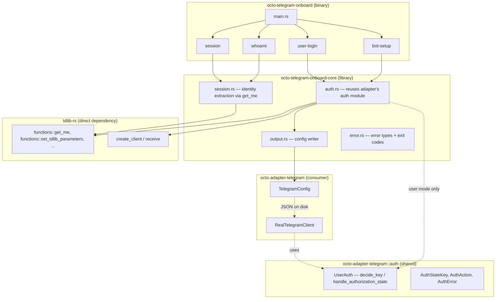
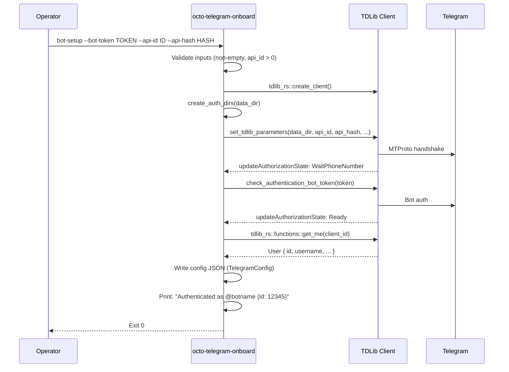
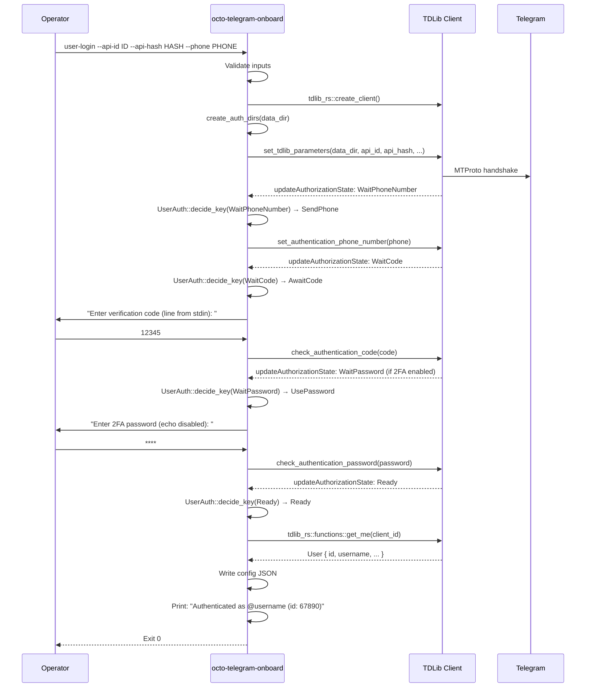

# RFC-0850ab-a (Networking): Telegram Auth Onboarding CLI

## Status

Accepted (2026-06-11)

## Authors

- @mmacedoeu

## Maintainers

- @mmacedoeu

## Summary

Define a standalone CLI binary (`octo-telegram-onboard`) and companion library (`octo-telegram-onboard-core`) that authenticate a CipherOcto operator against Telegram via TDLib, capture the resulting session, and write a JSON config file consumable by `octo-adapter-telegram` without modification. Covers bot-token setup, interactive user-account login (phone + code + 2FA), session verification (`whoami`), and session management (list, verify, remove). Mirrors the `octo-matrix-onboard` architecture from Mission 0850h-a, adapted to TDLib's state-machine auth model.

## Dependencies

**Requires:**

- Mission 0850ab: DOT Telegram Adapter (TDLib rewrite) -- the `TelegramConfig` schema this tool produces
- RFC-0850: Deterministic Overlay Transport, §8.1 (Platform Adapters)

**Optional:**

- Mission 0850h-a: Matrix Auth Onboarding -- architectural reference (same pattern, different SDK)

## Design Goals

| Goal | Target | Metric |
|------|--------|--------|
| G1 | Standalone auth without gateway | `octo-telegram-onboard bot-setup` exits 0 without loading adapter cdylib |
| G2 | Interactive user auth in terminal | `octo-telegram-onboard user-login` drives full TDLib state machine |
| G3 | Config produced is adapter-compatible | `TelegramConfig::validate()` passes on output JSON |
| G4 | No plaintext secrets in CLI logs | tracing redaction layer test passes |
| G5 | Exit codes distinguish failure classes | 7 distinct exit codes (0-6) |
| G6 | Session verification without auth | `whoami` works on persisted TDLib database |

## Motivation

### Use Case Link

[Telegram Auth Onboarding](../../docs/use-cases/telegram-auth-onboarding.md)

### Problem Statement

Telegram auth is the only CipherOcto adapter auth that requires a running gateway. Matrix has `octo-matrix-onboard` (4 login modes, `whoami`, `session`, `e2ee`). Discord/IRC/etc. use non-interactive tokens. Telegram's TDLib state machine is the most complex auth flow in the project, yet has zero tooling.

The core insight: TDLib auth produces a persistent session in `data_dir/database` (SQLite). Once authenticated, the adapter can restore the session from that directory without re-authenticating. The onboard tool's job is to drive the initial auth, persist the session, and write a config pointing at the right `data_dir`.

## Specification

### System Architecture



### Crate Split

The binary/core split follows the `octo-matrix-onboard` pattern:

| Crate | Type | Purpose |
|-------|------|---------|
| `octo-telegram-onboard` | binary | CLI surface (clap), dispatches to core |
| `octo-telegram-onboard-core` | lib | Auth flows, session extraction, output writing |

**Rationale:** The core library can be reused by integration tests, CI scripts, and future tools (e.g., a session-rotation daemon) without depending on clap or the CLI binary.

**Auth module reuse:** The onboard core imports `octo-adapter-telegram`'s `auth` module directly (specifically `AuthStateKey`, `AuthAction`, `AuthError` for both modes; `UserAuth` additionally for user-mode auth decision logic). This avoids duplicating the tested auth decision logic. The onboard core calls `tdlib_rs::functions::*` directly (not through the adapter's `TelegramClient` trait) because the onboard tool needs a short-lived auth-only client, not the adapter's long-running receive-loop wrapper. See §Algorithms for details.

### CLI Surface

```
octo-telegram-onboard
├── bot-setup           — Non-interactive bot auth
│   ├── --bot-token <TOKEN>        (or $TELEGRAM_BOT_TOKEN)
│   ├── --api-id <ID>              (or $TELEGRAM_API_ID)
│   ├── --api-hash <HASH>          (or $TELEGRAM_API_HASH)
│   ├── --data-dir <DIR>           (default: ~/.local/share/octo/telegram/default/)
│   ├── --verifying-key <BASE64>   (or $TELEGRAM_VERIFYING_KEY; optional)
│   ├── --out <PATH>               (default: ~/.config/octo/telegram.json)
│   ├── --stdout                   (write JSON to stdout instead of file)
│   ├── --force                    (overwrite existing config)
│   └── --verbose                  (DEBUG-level tracing)
│
├── user-login          — Interactive user-account auth
│   ├── --api-id <ID>              (or $TELEGRAM_API_ID)
│   ├── --api-hash <HASH>          (or $TELEGRAM_API_HASH)
│   ├── --phone <PHONE>            (or $TELEGRAM_PHONE)
│   ├── --data-dir <DIR>           (default: ~/.local/share/octo/telegram/default/)
│   ├── --verifying-key <BASE64>   (or $TELEGRAM_VERIFYING_KEY; optional)
│   ├── --out <PATH>               (default: ~/.config/octo/telegram.json)
│   ├── --stdout
│   ├── --force
│   ├── --verbose
│   └── --timeout <SECS>           (default: 300, for code/2FA entry)
│
├── whoami              — Verify existing session
│   ├── --config <PATH>            (load TelegramConfig JSON)
│   └── --verbose
│   # Future: --store <PATH> for multi-account session store (Phase 3)
│
├── session
│   ├── list                       — Show known TDLib database dirs
│   │   └── --base-dir <DIR>       (default: ~/.local/share/octo/telegram/)
│   ├── verify <DIR>               — Check if a TDLib database has a valid session
│   └── remove <DIR>               — Delete a TDLib database dir (with confirmation)
│
└── version
```

### Auth Flow: bot-setup



**Key design decisions:**

1. **Blocking wait with timeout.** TDLib's auth state machine is async (update callbacks). The CLI blocks on a `tokio::sync::Notify` that fires when `Ready` is reached, with a configurable timeout (default 30s for bot-setup, 300s for user-login).

2. **No gateway dependency.** The CLI creates its own TDLib client via `tdlib_rs::create_client()`, drives auth to completion, and extracts identity via `tdlib_rs::functions::get_me()`. For user mode, it uses the adapter's `UserAuth` state machine. For bot mode, it calls `check_authentication_bot_token` directly (no `UserAuth` needed). The adapter never touches auth. The onboard core calls TDLib functions directly (not through the adapter's `TelegramClient` trait) because it needs a short-lived auth-only client.

3. **data_dir selection.** The `--data-dir` flag (default: `~/.local/share/octo/telegram/default/`) is resolved *before* auth begins — TDLib requires `database_directory` at `set_tdlib_parameters` time. If the operator provides `--data-dir`, that path is used directly. Otherwise the default staging directory is used. The data_dir is created with mode 0700 on Unix before TDLib is initialized. After auth completes, the operator may optionally rename the directory (the config records whatever path was used).

### Auth Flow: user-login



**Key design decisions:**

1. **stdin for secrets.** Code and password are read from stdin (not command-line args) to avoid shell history leaks. Matches `octo-matrix-onboard`'s `--password-stdin` pattern.

2. **WaitRegistration handling.** TDLib may emit `WaitRegistration` for brand-new accounts. The CLI prints a clear message ("This phone number is not registered with Telegram. Please register via the Telegram app first.") and exits with code 2 (auth rejected). The CLI does not handle registration -- that's out of scope.

3. **Timeout.** The `--timeout` flag (default 300s) applies to the entire interactive flow (code entry + 2FA). If the operator doesn't respond within the timeout, the CLI exits with code 4 (cancelled).

### Session Extraction

After auth completes, the core library extracts identity from the TDLib client:

```rust
pub struct TelegramSession {
    /// Bot username (e.g., "mybot") or user username (e.g., "johndoe")
    pub username: Option<String>,
    /// Numeric user ID from get_me()
    pub user_id: i64,
    /// "bot" or "user" — matches TelegramConfig::mode (Option<String>)
    pub mode: Option<String>,
    /// Path to TDLib database directory
    pub data_dir: PathBuf,
    /// Ed25519 verifying key (base64, optional). Passed through from CLI arg.
    pub verifying_key: Option<String>,
}
```

**Difference from Matrix:** Matrix extracts `access_token`, `refresh_token`, `device_id` because the adapter restores sessions via those tokens. Telegram/TDLib restores sessions via the `data_dir` database. The onboard tool captures `data_dir` + `user_id` instead.

### Config Output

The tool writes a `TelegramConfig`-compatible JSON file:

```json
{
  "mode": "bot",
  "bot_token": "123456:ABC-DEF...",
  "api_id": 12345,
  "api_hash": "0123456789abcdef0123456789abcdef",
  "data_dir": "/home/user/.local/share/octo/telegram/default/",
  "groups": [],
  "features": {
    "e2e_chats": false,
    "voice_video": false
  },
  "verifying_key": "<base64 or null>"
}
```

For user mode:

```json
{
  "mode": "user",
  "api_id": 12345,
  "api_hash": "0123456789abcdef0123456789abcdef",
  "phone": "+1234567890",
  "data_dir": "/home/user/.local/share/octo/telegram/default/",
  "groups": [],
  "features": {
    "e2e_chats": false,
    "voice_video": false
  },
  "verifying_key": "<base64 or null>"
}
```

**Note:** `bot_token` is included in bot-mode output because `TelegramConfig` requires it for TDLib's `check_authentication_bot_token` on subsequent starts. This matches the Matrix pattern where `access_token` is written to disk. `verifying_key` is included when provided via `--verifying-key` or `$TELEGRAM_VERIFYING_KEY`; omitted (or null) otherwise. The `password` field is NOT written to disk — 2FA passwords are ephemeral and should not persist in config files.

**File permissions:** Mode 0600 on Unix (contains secrets). Same atomic-write pattern as `octo-matrix-onboard` (`tempfile::NamedTempFile` + `persist`).

### Error Types

```rust
pub enum OnboardError {
    Generic(anyhow::Error),           // exit 1
    AuthRejected(String),             // exit 2 — wrong token, 2FA fail, not registered
    TelegramUnreachable(String),      // exit 3 — MTProto connect fail, DNS
    Cancelled(String),                // exit 4 — timeout, Ctrl-C
    BadConfig(String),                // exit 5 — unwritable path, invalid config
    RateLimited(String),              // exit 6 — TDLib flood-wait
}
```

Seven exit codes (0-6), matching `octo-matrix-onboard`'s table exactly. Code 6 is TDLib flood-wait (analogous to HTTP 429 in the Matrix variant).

### Logging & Redaction

Same pattern as `octo-matrix-onboard`:

- `tracing-subscriber` with a custom `Layer` that redacts fields named `bot_token`, `api_hash`, `phone`, `password`, `access_token`, `verifying_key` (case-insensitive)
- Messages containing these substrings are also redacted
- `--verbose` enables DEBUG level; secrets stay redacted at every level
- Identity fields (`user_id`, `username`, `chat_id`) are safe to log

### Data Directory Layout

```
~/.local/share/octo/telegram/
├── default/            # default staging directory (used when --data-dir is omitted)
│   ├── database        # TDLib SQLite (auth_key, session, DC info)
│   ├── database-wal    # WAL (if present)
│   └── files/          # TDLib downloaded files
├── <custom-name>/      # operator-specified --data-dir
│   ├── database
│   └── files/
└── ...
```

The `data_dir` is resolved *before* auth begins (TDLib requires `database_directory` at `set_tdlib_parameters` time). The default is `~/.local/share/octo/telegram/default/`. Operators managing multiple accounts should use distinct `--data-dir` values.

The `session list` subcommand scans the `~/.local/share/octo/telegram/` base directory, reads metadata from each subdirectory (either via a sidecar JSON file written by `bot-setup`/`user-login`, or by creating a temporary TDLib client and calling `get_me()`), and prints account info. The sidecar approach is preferred for performance; the `get_me()` fallback is used when no sidecar exists.

### RFC-0008 Execution Class Mapping

| Operation | Class | Rationale |
|-----------|-------|-----------|
| CLI arg parsing | A | Deterministic string matching |
| TDLib client creation | B | TDLib is deterministic when configured correctly |
| Auth state machine | B | TDLib's auth flow is deterministic given same inputs |
| getMe() identity extraction | B | TDLib API call, deterministic given session |
| Config JSON serialization | A | Deterministic serde output |
| File write (atomic rename) | A | Deterministic filesystem operation |
| Session verification | B | TDLib database read, deterministic given database state |

All operations are Class A or B. No probabilistic operations.

### Data Structures

```rust
// octo-telegram-onboard-core/src/lib.rs

/// Credentials provided by the operator (CLI args or env vars).
pub struct Credentials {
    pub phone: Option<String>,      // None for bot mode
    pub api_id: i32,
    pub api_hash: String,
    pub password: Option<String>,   // None if no 2FA
    pub bot_token: Option<String>,  // None for user mode
    pub verifying_key: Option<String>,
}

/// Captured session after successful auth.
pub struct TelegramSession {
    pub username: Option<String>,
    pub user_id: i64,
    pub mode: Option<String>,
    pub data_dir: PathBuf,
    pub verifying_key: Option<String>,
}

/// Auth result from bot-setup or user-login.
pub struct AuthResult {
    pub session: TelegramSession,
    pub config_json: serde_json::Value,
}

/// Session info for session list/verify.
pub struct SessionInfo {
    pub data_dir: PathBuf,
    pub user_id: Option<i64>,
    pub username: Option<String>,
    pub mode: Option<String>,
    pub is_valid: bool,
}
```

### Algorithms

**Auth state machine driver (core/auth.rs):**

The onboard core uses the adapter's auth types from `octo-adapter-telegram::auth`:
- `AuthStateKey`, `AuthAction`, `AuthError` — enum types used by both modes
- `UserAuth::decide_key(AuthStateKey) -> AuthAction` — pure decision function (user mode only, no I/O, unit-testable)
- `UserAuth::decide(&AuthorizationState) -> AuthAction` — TDLib-aware wrapper (user mode only, behind `real-tdlib` feature)
- `UserAuth::handle_authorization_state(state, client_id, data_dir) -> AuthResult<()>` — side-effecting handler (user mode only, behind `real-tdlib` feature)

```rust
fn drive_auth(client_id: i32, mode: Mode, creds: Credentials, data_dir: &Path, timeout: Duration) -> Result<TelegramSession> {
    let notify = Arc::new(Notify::new());
    let state = Arc::new(Mutex::new(AuthState::Initial));

    // Register TDLib update handler
    // On each update:
    //   1. Map AuthorizationState to AuthStateKey
    //   2. Determine action based on mode:
    //      - Bot mode: handle WaitPhoneNumber directly (check_authentication_bot_token)
    //      - User mode: call user_auth.decide_key(key) to get AuthAction
    //   3. Execute the action (set_tdlib_parameters, check_authentication_bot_token, etc.)
    //   4. On Ready → notify; on Error → set error + notify
    //
    // Bot mode flow:
    //   WaitTdlibParameters → set_tdlib_parameters()
    //   WaitPhoneNumber → check_authentication_bot_token(creds.bot_token)
    //   Ready → get_me(), write config
    //
    // User mode flow:
    //   let user_auth = UserAuth::new(creds.phone, creds.api_id, creds.api_hash, creds.password);
    //   WaitTdlibParameters → user_auth.decide_key(WaitTdlibParameters) → SetParameters
    //   WaitPhoneNumber → user_auth.decide_key(WaitPhoneNumber) → SendPhone
    //   WaitCode → user_auth.decide_key(WaitCode) → AwaitCode (drain stdin)
    //   WaitPassword → user_auth.decide_key(WaitPassword) → UsePassword (or Error if no password)
    //   WaitRegistration → AuthError::RegistrationRequired (adapter auth.rs:73)
    //   Ready → get_me(), write config

    // Wait for completion or timeout
    tokio::time::timeout(timeout, notify.notified()).await?;

    match state.into_inner():
        Ready => {
            let me = tdlib_rs::functions::get_me(client_id).await?;
            Ok(TelegramSession {
                username: me.username,
                user_id: me.id,
                mode: Some(mode.to_string()),
                data_dir: data_dir.to_path_buf(),
                verifying_key: creds.verifying_key,
            })
        }
        Rejected(msg) => Err(OnboardError::AuthRejected(msg))
        _ => Err(OnboardError::Cancelled("timeout"))
}
```

**Key design decision:** The onboard core imports `UserAuth` and related types from `octo-adapter-telegram::auth` rather than reimplementing the state machine. This ensures the auth decision logic is tested once and shared between the adapter and the onboard tool. The adapter's existing tests for `UserAuth::decide_key` (covering all `AuthStateKey` variants) provide coverage for the onboard tool's auth decisions without additional test code.

**Bot vs user mode auth:** `UserAuth` is user-mode only (it has a required `phone` field). For bot mode, the onboard core handles `WaitPhoneNumber` directly by calling `check_authentication_bot_token(creds.bot_token)` without going through `UserAuth::decide_key`. The auth flow per mode:

- **Bot mode:** `WaitTdlibParameters` → call `set_tdlib_parameters()` directly. `WaitPhoneNumber` → call `check_authentication_bot_token()` directly. `Ready` → `get_me()`, write config. No `UserAuth` instance needed.
- **User mode:** Create `UserAuth::new(phone, api_id, api_hash, password)`. Use `UserAuth::decide_key` for all states. `WaitPhoneNumber` → `SendPhone` → call `set_authentication_phone_number()`. `WaitCode` → `AwaitCode` → read stdin. `WaitPassword` → `UsePassword` → read stdin. `Ready` → `get_me()`, write config.

**Dependency note:** The onboard core depends on `octo-adapter-telegram` as a library dependency (for the `auth` module). The onboard core's `Cargo.toml` must include `octo-adapter-telegram = { path = "../octo-adapter-telegram", features = ["real-tdlib"] }` to access `handle_authorization_state` and `decide` (both behind `#[cfg(feature = "real-tdlib")]`). The pure `decide_key` function is available without the feature gate. This pulls in `tdlib-rs` as a transitive dep, which the onboard core already depends on directly.

### Determinism Requirements

All operations are deterministic given the same inputs and TDLib database state. The CLI does not use randomness except for TDLib's internal MTProto handshake (which is Class B -- deterministic when configured correctly).

### Stdin Reading

Code and password are read as a single line from stdin via `BufRead::read_line`. This supports both interactive terminal input and piped input (e.g., `echo 12345 | octo-telegram-onboard user-login`).

| Input | Method | Echo | Notes |
|-------|--------|------|-------|
| Verification code | `BufRead::read_line` | Yes (not secret, one-time OTP) | Trimmed before use |
| 2FA password | `rpassword::read_password` | No (secret) | Uses `rpassword` crate to disable terminal echo; zeroed on drop via `Zeroizing<String>` |

If stdin is a pipe and the timeout expires before input arrives, the CLI exits with code 4 (cancelled).

### Error Handling

| TDLib State | CLI Action | Exit Code |
|-------------|-----------|-----------|
| `WaitPhoneNumber` (bot) | Send bot_token | -- |
| `WaitCode` (user) | Read line from stdin | -- |
| `WaitPassword` (user) | Read password (echo disabled) | -- |
| `WaitRegistration` | Print error, exit | 2 |
| `Closed` (auth failed) | Print error, exit | 2 |
| `FloodWait(secs)` | Print wait time, exit | 6 |
| MTProto connect timeout | Print error, exit | 3 |
| Invalid bot_token (401) | Print error, exit | 2 |
| data_dir unwritable | Print error, exit | 5 |
| Config file exists, no --force | Print error, exit | 5 |
| Code/2FA timeout | Print error, exit | 4 |
| Ctrl-C during interactive | Print error, exit | 4 |

### whoami Session Verification

The `whoami` subcommand loads a config JSON, creates a TDLib client against the configured `data_dir`, and calls `get_me()` to verify the session is alive.

**Expired session handling:** If the persisted TDLib session is expired (e.g., bot token revoked, user logged out elsewhere), TDLib will emit `WaitPhoneNumber` or `Closed` instead of `Ready`. The `whoami` subcommand waits up to 10s for `Ready`. If any other terminal state is reached, it prints "Session expired or invalid" and exits with code 2 (auth-rejected). This is a read-only check -- `whoami` does not drive re-authentication.

### Session Management

`session list` scans `~/.local/share/octo/telegram/` and prints one line per account:

```
DATA_DIR                              MODE  USER_ID     USERNAME    VALID
/home/user/.local/share/octo/telegram/default/  bot   123456789   @mybot      yes
/home/user/.local/share/octo/telegram/user1/    user  987654321   @johndoe    no (expired)
```

**Implementation:** For each subdirectory, the tool first checks for a `session_meta.json` sidecar file (written by `bot-setup`/`user-login` alongside the TDLib database). If the sidecar exists, it reads `user_id`, `username`, and `mode` directly (fast, no TDLib client needed). If no sidecar exists, it creates a temporary TDLib client, calls `get_me()` with a 5s timeout, and prints the result. `session verify <dir>` checks if a specific TDLib database has a valid session. `session remove <dir>` deletes a database directory after confirmation.

## Performance Targets

| Metric | Target | Notes |
|--------|--------|-------|
| bot-setup latency | <5s | MTProto handshake + bot auth + getMe |
| user-login latency | <10s + operator time | MTProto + phone + code entry + getMe |
| whoami latency | <2s | Load TDLib database + getMe |
| Binary size | <15 MB stripped | Lean binary, no TDLib download features |
| Config write | <100ms | Atomic JSON write |

## Security Considerations

### Credential handling

- **bot_token** and **api_hash** are accepted via CLI args OR environment variables. CLI args are visible in `ps` output; env vars are preferred for CI.
- **Phone number** and **2FA password** are read from stdin only (never as CLI args).
- **Config file** is mode 0600 on Unix (contains bot_token, api_hash, phone).
- **TDLib database** contains auth_key material; data_dir is mode 0700.

### Log redaction

- All credential fields are redacted in tracing output at every log level.
- `user_id` and `username` are safe to log (not secrets).
- TDLib's internal logs are routed through the same redaction layer.

### Threat model

| Threat | Impact | Mitigation |
|--------|--------|-----------|
| bot_token in shell history | Credential leak | Accept via env var or stdin |
| Config file permissions | Credential leak | Mode 0600, atomic write |
| TDLib database permissions | Auth key leak | Mode 0700 on data_dir |
| TDLib flood-wait | DoS on repeated auth attempts | Exit code 6, operator must wait |
| Malformed config output | Adapter fails to start | validate() before write |
| Ctrl-C during write | Partial config file | Atomic write (tempfile + rename) |

## Adversarial Review

| Threat | Impact | Mitigation |
|--------|--------|-----------|
| TDLib update callback races | Auth state missed | Notify-based synchronization with timeout |
| getMe() fails after Ready | Config written without identity | Fail fast, don't write config |
| data_dir created before auth succeeds | Orphaned empty directory on auth failure | Acceptable — data_dir is the operator's chosen path; cleanup on failure is optional |
| Config JSON field order differs from adapter expectations | Deserialization failure | Use serde_json::to_string_pretty (deterministic field order) |
| Multiple onboard processes on same data_dir | TDLib database corruption | Lockfile advisory (flock) on data_dir |

## Economic Analysis

Not applicable. This is operational tooling with no economic surface.

## Compatibility

### Backward compatibility

- Existing env-var-based deployment (`TelegramConfig::from_env()`) continues to work unchanged.
- The onboard tool writes configs that are a strict subset of `TelegramConfig`'s schema.
- No adapter code changes required.

### Forward compatibility

- The `session list/verify/remove` subcommands are designed for multi-account support (future mission).
- The `--data-dir` flag allows operators to manage multiple TDLib databases.

### Breaking changes

None. This is purely additive.

## Test Vectors

### Bot-setup config output

Input:
```
--bot-token "123456:ABC-DEF" --api-id 12345 --api-hash "abcdef0123456789abcdef0123456789"
```

Expected output (structure, data_dir varies):
```json
{
  "mode": "bot",
  "bot_token": "123456:ABC-DEF",
  "api_id": 12345,
  "api_hash": "abcdef0123456789abcdef0123456789",
  "data_dir": "<resolved>",
  "groups": [],
  "features": { "e2e_chats": false, "voice_video": false },
  "verifying_key": null
}
```

### User-login config output

Input:
```
--api-id 12345 --api-hash "abcdef0123456789abcdef0123456789" --phone "+1234567890"
```

Expected output (structure, data_dir and phone vary):
```json
{
  "mode": "user",
  "api_id": 12345,
  "api_hash": "abcdef0123456789abcdef0123456789",
  "phone": "+1234567890",
  "data_dir": "<resolved>",
  "groups": [],
  "features": { "e2e_chats": false, "voice_video": false },
  "verifying_key": null
}
```

### User-login with 2FA config output

Input:
```
--api-id 12345 --api-hash "abcdef0123456789abcdef0123456789" --phone "+1234567890"
```
Stdin (after code prompt): `12345`
Stdin (after password prompt): `my2FAsecret`

Expected output: same as user-login above. The `password` field is NOT written to disk -- 2FA passwords are ephemeral.

### Error exit codes

| Scenario | Expected exit |
|----------|--------------|
| Invalid bot_token | 2 |
| Unregistered phone (WaitRegistration) | 2 |
| Network unreachable | 3 |
| Code entry timeout (10s) | 4 |
| Ctrl-C during interactive | 4 |
| Config file exists, no --force | 5 |
| data_dir unwritable | 5 |
| TDLib flood-wait | 6 |

## Alternatives Considered

| Approach | Pros | Cons |
|----------|------|------|
| **Env-var only (current)** | Simple, no new crate | No interactive auth, no validation, no session mgmt |
| **Adapter subcommand** | No new crate | Couples tooling to cdylib, can't run standalone |
| **Pure-MTProto tool (grammers)** | No C++ dep | Duplicate auth logic, diverges from TDLib adapter |
| **Reimplement auth state machine** | No dependency on adapter crate | Divergent logic, maintenance burden |
| **This RFC: standalone binary + core lib (reusing adapter auth)** | Clean separation, shared auth logic, mirrors matrix-onboard | New crate, compile-time dep on adapter auth module |

**Decision:** Standalone binary + core lib, reusing the adapter's auth types (and `UserAuth` for user mode). Mirrors the proven `octo-matrix-onboard` pattern. The C++ build cost is already paid by `octo-adapter-telegram` (same `tdlib-rs` dep).

## Implementation Phases

### Phase 1: Core + Session Management

- [ ] `octo-telegram-onboard-core` library: auth driver (reusing adapter's `UserAuth`), session extraction via `get_me`, output writer (with `session_meta.json` sidecar), error types
- [ ] `octo-telegram-onboard` binary: `bot-setup`, `user-login`, `whoami`, `session {list, verify, remove}` subcommands
- [ ] Tracing redaction layer (including `verifying_key`)
- [ ] Unit tests (mock TDLib client, reuse adapter's `UserAuth::decide_key` tests)
- [ ] Integration test (real Telegram test DC, feature-gated)

### Phase 2: Multi-Account (future)

- [ ] Session store (stoolap-backed, per `octo-matrix-onboard` 0850h-d pattern)
- [ ] `session use` to switch active account
- [ ] `session import` to register existing TDLib databases
- [ ] `whoami --store` flag for multi-account lookup

## Key Files to Modify

| File | Change |
|------|--------|
| `crates/octo-telegram-onboard/Cargo.toml` | New crate (binary) |
| `crates/octo-telegram-onboard/src/main.rs` | CLI entry point (clap) |
| `crates/octo-telegram-onboard/src/cli.rs` | Arg structs |
| `crates/octo-telegram-onboard/src/logging.rs` | Redaction layer |
| `crates/octo-telegram-onboard-core/Cargo.toml` | New crate (lib) |
| `crates/octo-telegram-onboard-core/src/lib.rs` | Public API |
| `crates/octo-telegram-onboard-core/src/auth.rs` | Auth driver (imports adapter's `UserAuth`) |
| `crates/octo-telegram-onboard-core/src/session.rs` | Identity extraction via `get_me` |
| `crates/octo-telegram-onboard-core/src/output.rs` | Config writer + `session_meta.json` sidecar |
| `crates/octo-telegram-onboard-core/src/error.rs` | Error types |
| `Cargo.toml` (workspace) | Add new crates to workspace members |

## Future Work

- F1: Multi-account session store (stoolap-backed)
- F2: E2E encryption setup (Phase 3 of telegram adapter)
- F3: QR-code-based device linking (when TDLib exposes the API)
- F4: CI-mode non-interactive user-login via pre-shared session

## Rationale

**Why mirror `octo-matrix-onboard`?** The binary+core split, clap CLI, tracing redaction, atomic config writer, and exit code table are battle-tested from Mission 0850h-a. Reusing the same patterns reduces design risk and makes the codebase consistent.

**Why not embed in the adapter?** The adapter is a cdylib loaded by a host process. Embedding auth tooling would require the host process to be running, defeating the purpose of standalone pre-flight validation.

**Why TDLib instead of raw Bot API?** The adapter already uses TDLib (Mission 0850ab). Using the same SDK avoids duplicating auth logic. The raw Bot API's `getMe` is trivial, but user-mode auth requires MTProto (TDLib).

## Version History

| Version | Date | Changes |
|---------|------|---------|
| 1.0 | 2026-06-11 | Initial draft |
| 1.1 | 2026-06-11 | R1 fixes: reuse adapter auth module, getMe via tdlib-rs direct, verifying_key, data_dir timing, stdin spec, session management |
| 1.2 | 2026-06-11 | R2 fixes: UserAuth bot-mode clarification, mode type consistency, Credentials struct, feature gate docs, stale threat fix |
| 1.3 | 2026-06-11 | R3 fixes: bot-setup sequence diagram corrected (no UserAuth), pseudocode mode-qualified, arch diagram dashed arrow, AC/Type Coverage qualified |
| 1.4 | 2026-06-11 | R4 fixes: Crate Split and Alternatives §UserAuth qualified to user mode; Credentials struct added to Mission Type Coverage |
| 1.5 | 2026-06-11 | Accepted after 4 rounds of adversarial review (37 findings, all addressed) |

## Related RFCs

- RFC-0850 (Networking): Deterministic Overlay Transport
- RFC-0850ab (Networking): DOT Telegram Adapter (TDLib rewrite)

## Related Use Cases

- [Telegram Auth Onboarding](../../docs/use-cases/telegram-auth-onboarding.md)
